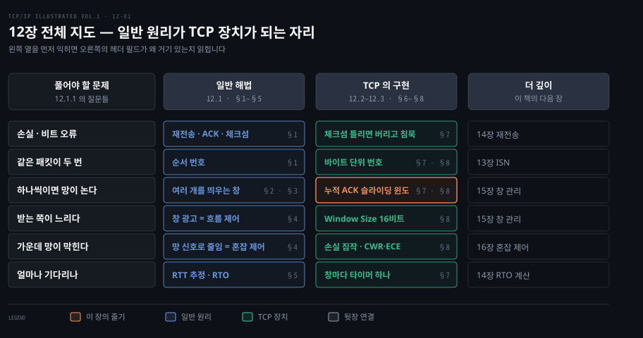
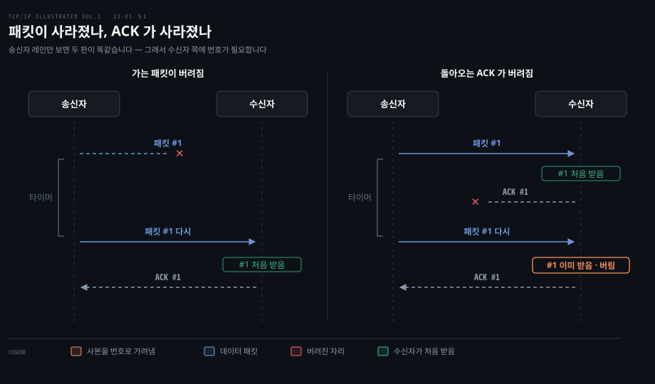
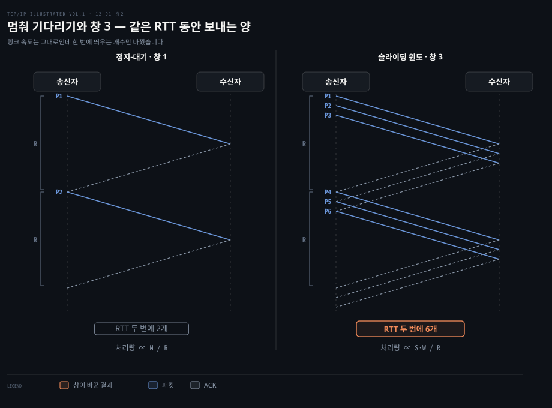
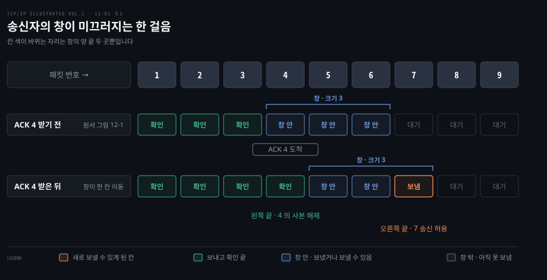
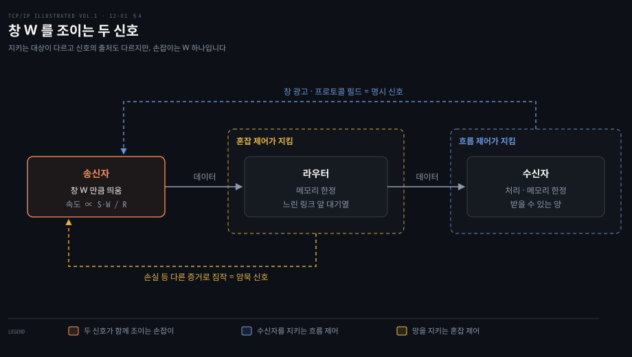
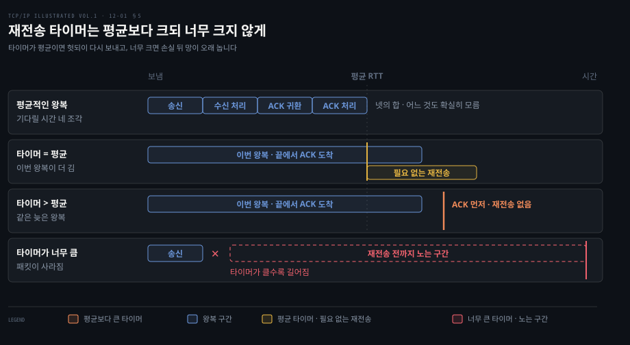
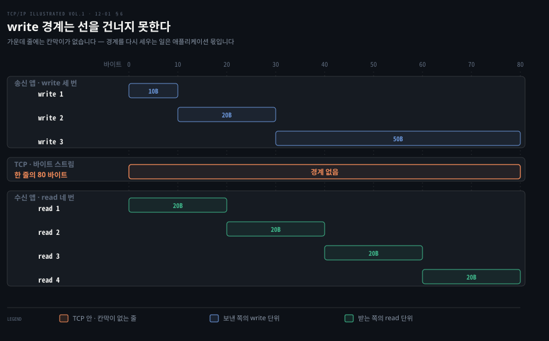
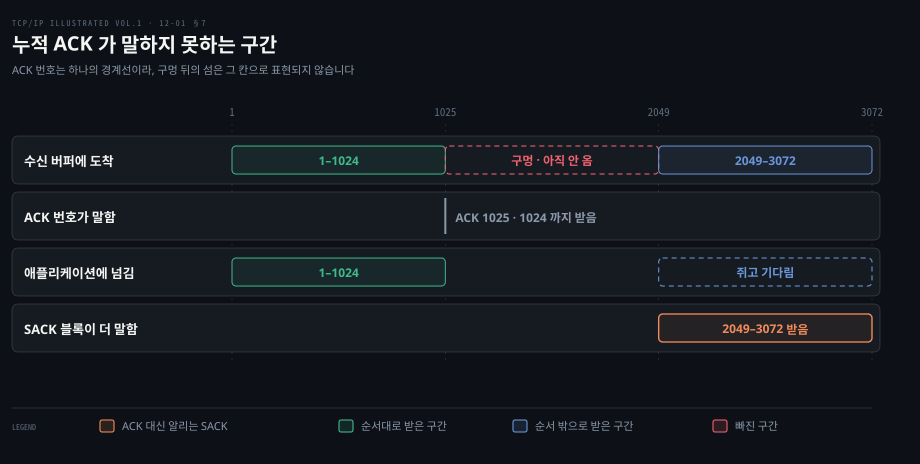
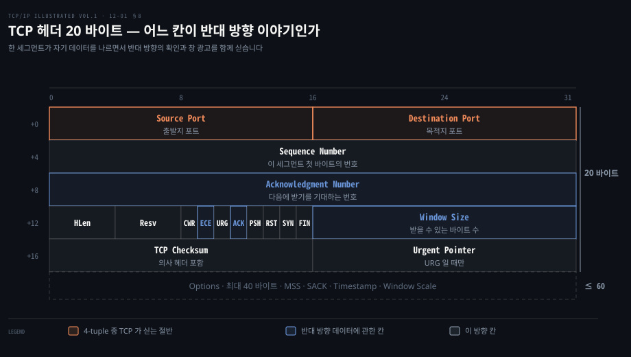

# TCP 의 신뢰성은 재전송·번호·창으로 만든다

---

> 12장은 TCP 를 곧바로 설명하지 않고 패킷을 잃어버리는 망 위에서 믿을 만한 전달을 만드는 일반 원리부터 세웁니다. 재전송·순서 번호·슬라이딩 윈도·창 광고·재전송 타이머를 먼저 익히면, 뒤에 나오는 TCP 헤더의 칸들이 왜 그 자리에 있는지 읽힙니다.

## 핵심 요약

> 이 장이 매달린 하나의 생각은, TCP 헤더의 칸 대부분이 "잃어버리는 망에서 재전송으로 신뢰를 만든다"는 일반 원리의 부품을 하나씩 구현한 것이라는 점입니다.

원문은 오류를 다루는 길을 둘로 나눕니다. 여분의 비트를 붙여 받는 쪽이 고치게 하는 오류 정정 부호가 하나이고 받았다는 확인이 올 때까지 다시 보내는 재전송이 다른 하나입니다. TCP 는 뒤쪽, 곧 ARQ 위에 서 있습니다. 재전송을 쓰는 순간 받았는지 알려 줄 ACK, 같은 패킷을 두 번 받았는지 가릴 순서 번호, 얼마나 기다릴지 정할 타이머가 함께 필요해집니다.

그런데 하나 보내고 확인을 기다리는 방식은 RTT 가 길수록 처리량이 떨어집니다. 그래서 여러 패킷을 한꺼번에 띄운 뒤, 그 가운데 아직 확인받지 못한 구간을 창으로 관리합니다. 창 크기를 받는 쪽이 직접 알려 주는 것이 흐름 제어입니다. 망이 넘친다는 증거를 보고 송신자가 스스로 줄이는 것은 혼잡 제어입니다.

12.2 와 12.3 은 이 부품들이 TCP 에서 어떤 모양이 되는지 봅니다. 순서 번호는 패킷이 아니라 바이트를 셉니다. ACK 는 순서대로 받은 끝까지를 한 번에 확인하는 누적 ACK 이고 창 광고는 헤더의 16비트 Window Size 칸입니다. 연결 하나는 양 끝의 IP 주소와 포트 넷, 곧 4-tuple 로 가려집니다. 부품마다의 자세한 동작은 13~17장이 한 장씩 맡습니다.


## 학습 목표

> 이 편을 읽고 나면 아래 다섯 가지를 스스로 해낼 수 있습니다.

1. 패킷 손실과 ACK 손실이 송신자에게 구분되지 않는 이유를 들고 그래서 수신자에게 순서 번호가 필요하다는 것을 설명할 수 있습니다.
2. 정지-대기의 처리량이 M/R 에 비례한다는 식에 값을 넣어 RTT 가 긴 경로에서 창이 왜 필요한지 수치로 보일 수 있습니다.
3. 슬라이딩 윈도에서 ACK 하나가 도착하면 창의 왼쪽 끝과 오른쪽 끝에서 각각 무슨 일이 일어나는지 말할 수 있습니다.
4. 흐름 제어와 혼잡 제어가 지키는 대상과 신호의 출처가 어떻게 다른지 구분할 수 있습니다.
5. TCP 헤더의 각 칸을 12.1 의 일반 원리와 짝짓고 4-tuple·ISN·순수 ACK 를 실제 캡처에서 짚을 수 있습니다.

아래는 이 편 전체를 풀어야 할 문제 여섯 줄로 펼친 지도입니다. 왼쪽 열이 §1~§5 가 다루는 일반 해법이고 가운데 열이 §6~§8 이 다루는 TCP 의 구현입니다. 오른쪽 열은 그 장치를 자세히 다루는 이 책의 뒷장입니다.



가로로 읽으면 하나의 문제가 원리에서 장치로 옮겨 가는 길이 보입니다. 강조한 칸인 "누적 ACK 슬라이딩 윈도"가 이 장의 줄기로, 원문은 TCP 를 "누적 긍정 확인을 쓰는 슬라이딩 윈도 프로토콜"이라고 한 줄로 요약합니다.


## 1. 버려지는 패킷은 다시 보내서 고친다

> 손상이나 손실을 고치는 길은 부호로 고치거나 다시 보내는 것 둘이고 TCP 는 다시 보내는 쪽(ARQ)을 고릅니다. 다시 보내기로 하는 순간 ACK·타이머·순서 번호 세 가지가 함께 필요해집니다.

### IP 와 UDP 는 오류를 고치지 않습니다

TCP 아래 층에는 데이터를 믿을 만하게 나르는 장치가 없습니다. 원문은 이 관찰로 장을 엽니다. 체크섬이나 CRC 같은 수학 함수로 잘못된 데이터가 왔다는 것을 알아챌 수는 있어도 그것을 고치려고 애쓰지는 않습니다. IP 와 UDP 는 오류 복구를 전혀 하지 않습니다. 이더넷 계열은 몇 번 재시도하다가 안 되면 포기합니다.

망이 여러 홉으로 이어지면 문제가 늘어납니다. 비트 오류에 더해 중간 라우터에서 순서 뒤바뀜, 중복, 유실이 생깁니다. IP 위에서 오류를 바로잡으려는 프로토콜은 이 셋을 모두 감당해야 합니다.

### 부호로 고칠 것인가, 다시 보낼 것인가

원문은 Shannon 의 1948년 정보 이론에서 출발해 두 길을 나눕니다. 하나는 오류 정정 부호입니다. 여분의 비트를 붙여 일부 비트가 상해도 원래 정보를 되살릴 수 있게 하는 방법입니다. 다른 하나는 정보가 결국 도착할 때까지 "다시 보내 보는" 방법이고 **자동 재전송 요청(ARQ)**, Automatic Repeat Request 라 부릅니다. TCP 를 비롯한 많은 통신 프로토콜이 ARQ 위에 서 있습니다.

재전송을 쓰려면 두 가지를 알아야 합니다. 받는 쪽이 패킷을 받았는지, 그리고 받은 패킷이 보낸 것과 같은지입니다. 받았다는 신호를 **확인 응답(ACK)**이라 부릅니다. 가장 단순한 형태에서는 송신자가 패킷 하나를 보내고 ACK 를 기다리다가 ACK 가 오면 다음 패킷을 보냅니다.

### 단순한 재전송이 던지는 세 질문

원문은 이 단순한 형태에서 질문 셋을 뽑습니다.

1. 송신자는 ACK 를 얼마나 기다려야 하는가? 원문이 깊은 질문이라고 말하며 14장으로 미루고 이 편에서는 §5 가 윤곽만 봅니다.
2. ACK 가 사라지면 어떻게 하는가? 송신자는 ACK 가 사라진 경우와 원래 패킷이 사라진 경우를 쉽게 구분하지 못하므로 그냥 다시 보냅니다.
3. 받은 패킷에 오류가 있으면 어떻게 하는가? 오류를 고치는 부호보다 찾아내는 부호가 훨씬 적은 비트로 되므로 체크섬으로 오류를 찾고 오류가 있으면 ACK 를 보내지 않습니다. 송신자는 결국 다시 보냅니다.

둘째 질문의 답이 새 문제를 만듭니다. 패킷은 도착했는데 ACK 만 사라졌다면 송신자가 다시 보낸 패킷은 수신자에게 사본입니다. 아래 도식은 두 경우를 나란히 놓은 것입니다.



송신자 레인만 보면 두 판이 같습니다. 패킷 #1 을 보낸 뒤 타이머가 끝날 때까지 아무것도 오지 않아 다시 보냅니다. 차이는 수신자 쪽에만 있어서 오른쪽 수신자는 #1 을 두 번 받습니다. 그래서 원문은 순서 번호(sequence number)를 들입니다. 출발지는 새 패킷마다 새 번호를 붙여 패킷 안에 싣습니다. 수신자는 그 번호로 이미 본 패킷인지 판단해 사본을 버립니다.

채널의 결함을 하나씩 가정하며 이 세 장치(ACK·타이머·순서 번호)를 쌓아 올리는 설명은 『Computer Networking: A Top-Down Approach』 정독 노트(이하 CNTD)에 있습니다. [CNTD 03-02 §1](../cntd_computer-networking-top-down/03-02.신뢰성은%20어떻게%20만들어지는가.md) 의 rdt1.0~rdt3.0 이 더 자세합니다. 원문은 오류 정정 부호 쪽을 이 장에서 더 다루지 않습니다.


## 2. 하나씩 보내고 기다리면 RTT 가 처리량을 깎는다

> 정지-대기는 믿을 만하지만 처리량이 패킷 크기를 RTT 로 나눈 값에 묶입니다. 여러 패킷을 망에 동시에 띄워야 경로가 놀지 않습니다.

### 정지-대기의 처리량은 M/R 에 비례합니다

§1 의 방식은 믿을 만하지만 효율이 낮습니다. 송신자가 패킷 하나를 경로에 밀어 넣은 뒤 ACK 를 들을 때까지 멈춰야 하기 때문입니다. 그래서 이 방식을 **정지-대기(stop and wait)**라 부릅니다. 원문은 손실이 없다고 가정할 때 그 처리량이 M/R 에 비례한다고 적습니다. M 은 패킷 크기, R 은 왕복 시간(RTT)입니다. 패킷 크기가 고정이면 R 이 커질수록 처리량이 떨어집니다.

숫자를 넣으면 크기가 보입니다. 원문은 위성 링크에서 1~2초의 지연이 드물지 않다고 예를 듭니다. 1,500바이트 패킷을 RTT 1초 경로에서 정지-대기로 보내면 초당 1,500바이트, 약 12kbit/s 입니다. 링크가 1Gbit/s 여도 결과는 같습니다. 병목이 링크 속도가 아니라 기다림에 있기 때문입니다. 이 값은 원문 식에 숫자를 넣어 계산한 것입니다.

손실이 있으면 더 나빠집니다. 원문은 처리량(throughput)과 굿풋(goodput)을 구분합니다. 처리량은 단위 시간에 망에 실은 데이터이고 굿풋은 그중 쓸모 있게 전달된 양입니다. 패킷이 사라지거나 상하면 굿풋은 처리량보다 상당히 작아질 수 있습니다.

### 조립 라인을 비워 두지 않으려면 여러 개를 띄웁니다

원문은 이 상황을 조립 라인에 빗댑니다. 완제품 하나가 나와야 다음 일감이 라인에 들어갈 수 있다면 라인 대부분이 놉니다. 라인에 일감을 여럿 올리면 낫듯이 망에도 패킷을 여럿 띄우면 경로가 바빠지고 처리량이 오릅니다.



두 판은 RTT 도, 링크도, 패킷 하나를 내보내는 간격도 같습니다. 달라진 것은 ACK 없이 띄울 수 있는 개수 하나입니다. 그 차이로 RTT 두 번 동안 보낸 양이 2개에서 6개로 세 배가 됩니다. 오른쪽 판에서 P4 가 나가는 시각이 P1 의 ACK 가 돌아온 시각과 같다는 점도 보아 둡니다. ACK 하나가 돌아와야 새 패킷 하나가 나간다는 이 관계가 다음 절의 창입니다.

### 여러 개를 띄우면 풀어야 할 일이 늘어납니다

대가는 복잡함입니다. 원문은 패킷 여럿이 동시에 망에 있으면 어떤 일이 생기는지 이렇게 늘어놓습니다.

- 송신자는 언제 보낼지뿐 아니라 몇 개를 보낼지 정해야 합니다.
- 송신자는 ACK 를 기다리는 동안 타이머를 어떻게 둘지 정해야 하고 확인받지 못한 패킷마다 재전송용 사본을 보관해야 합니다.
- 수신자는 어떤 패킷을 받았고 어떤 것을 못 받았는지 가려 말하는 더 정교한 ACK 가 필요합니다.
- 수신자는 손실이나 순서 뒤바뀜 때문에 기대보다 먼저 온 패킷을 담아 둘 버퍼가 필요합니다. 그냥 버릴 수도 있지만 원문은 그 길을 비효율적이라고 봅니다.
- 수신자가 송신자보다 느리면 처리·메모리 한계로 패킷을 버릴 수 있고 가운데 라우터도 같은 문제를 겪을 수 있습니다.

다음 세 절이 이 목록에 차례로 답합니다. 몇 개를 띄울지는 §3 의 창, 수신자와 라우터가 느린 문제는 §4 의 흐름 제어와 혼잡 제어, 타이머는 §5 가 맡습니다.


## 3. 슬라이딩 윈도는 확인받지 못한 패킷의 구간을 관리한다

> 창은 보냈지만 아직 확인받지 못한 패킷의 모음이고, ACK 가 올 때마다 오른쪽으로 미끄러집니다. 왼쪽 끝에서는 사본을 버리고 오른쪽 끝에서는 새 패킷을 보낼 수 있게 됩니다.

### 몇 개를 띄웠는지 셀 장부가 필요합니다

여러 패킷을 띄우면 송신자에게는 어느 패킷이 확인됐고 어느 것이 아직 날아가는 중인지 셀 장부가 있어야 합니다. 원문은 모든 패킷에 순서 번호가 있다는 §1 의 가정에서 출발해 그 장부를 창으로 정의합니다. **패킷의 창(window)**은 송신자가 보냈지만 아직 완전히 확인받지 못한 패킷, 또는 그 번호의 모음이고 창 안의 패킷 수가 창 크기입니다. 통신 중 보낸 패킷을 긴 줄로 세우고 작은 구멍으로 들여다보면 그중 일부만 보입니다. 이름은 그 모습에서 왔습니다.

### ACK 하나가 창을 한 칸 밉니다

아래 도식의 윗줄은 원서 그림 12-1 의 상태이고 아랫줄은 그다음 ACK 하나가 도착한 장면입니다.



윗줄의 창 크기는 3 이고 창 안에 4·5·6 이 있습니다. 3 은 이미 보내고 확인까지 받았으므로 송신자가 들고 있던 사본은 버려도 됩니다. 7 은 송신자에게 준비돼 있지만 창 밖이라 아직 보낼 수 없습니다. 이제 ACK 4 가 오면 창이 오른쪽으로 한 칸 미끄러져 4 의 사본을 버리고 7 을 보낼 수 있게 됩니다. 창이 이렇게 움직이기 때문에 이런 프로토콜을 **슬라이딩 윈도 프로토콜(sliding window protocol)**이라 부릅니다.

칸 색이 바뀌는 자리는 창의 양 끝뿐입니다. ACK 는 왼쪽 끝을 밀어 메모리를 돌려주고 그만큼 오른쪽 끝이 열려 보낼 거리가 생깁니다. 창은 망에 띄울 수 있는 양의 상한이므로 보낼 데이터가 충분하고 창 크기가 그대로인 동안에는 떠 있는 패킷 수가 창 크기에 머뭅니다. 이 문장은 원문이 아니라 노트의 해석입니다. §2 도식에서 ACK 1 이 돌아온 순간 P4 가 나간 것이 이 한 걸음입니다.

### 창은 송신자와 수신자 양쪽에 있습니다

원문은 이 창 구조가 보통 송신자와 수신자 모두에 있다고 덧붙입니다. 같은 모양이지만 추적하는 것이 다릅니다.

| 위치 | 창이 추적하는 것 |
|---|---|
| 송신자 | 사본을 버려도 되는 패킷 · ACK 를 기다리는 패킷 · 아직 보낼 수 없는 패킷 |
| 수신자 | 이미 받고 확인한 패킷 · 기대하는 패킷과 그것을 담을 메모리 · 받아도 메모리가 없어 담지 않을 패킷 |

다만 창 구조는 장부일 뿐입니다. 창을 얼마나 크게 잡을지, 수신자나 망이 송신 속도를 못 따라오면 어떻게 할지는 알려 주지 않습니다. 원문도 이 질문을 남긴 채 다음 절로 넘어갑니다.

창 안의 패킷 하나가 사라졌을 때 그 뒤를 전부 다시 보내느냐(Go-Back-N), 사라진 것만 다시 보내느냐(Selective Repeat)는 원문이 이 장에서 나누지 않는 갈림입니다. 두 방식의 비교는 [CNTD 03-02 §3·§4](../cntd_computer-networking-top-down/03-02.신뢰성은%20어떻게%20만들어지는가.md) 에 있고 TCP 가 그 사이 어디에 서는지는 §7 의 SACK 에서 다시 만납니다.


## 4. 창 크기는 수신자와 망이 각각 조인다

> 창 크기를 바꾸면 송신 속도가 바뀝니다. 수신자가 창 광고로 직접 알려 주면 흐름 제어이고 망이 넘친다는 것을 송신자가 다른 증거로 짐작해 줄이면 혼잡 제어입니다.

### 받는 쪽이 느리면 보내는 쪽을 늦춰야 합니다

수신자가 송신자보다 느릴 때 송신자를 늦추는 장치를 **흐름 제어**라 부릅니다. 원문은 두 방식을 듭니다. 속도 기반 흐름 제어는 송신자에게 일정 데이터 속도를 할당하고 그 이상은 못 보내게 합니다. 스트리밍 애플리케이션에 가장 잘 맞고 브로드캐스트·멀티캐스트에도 쓸 수 있습니다. 슬라이딩 윈도와 함께 가장 널리 쓰이는 쪽은 창 기반 흐름 제어입니다.

창 기반 방식에서는 창 크기가 고정되지 않고 시간에 따라 바뀝니다. 수신자는 송신자에게 창을 얼마로 쓸지 알리고 이 신호를 창 광고(window advertisement) 또는 창 갱신(window update)이라 부릅니다. 논리적으로 창 갱신은 ACK 와 별개이지만 실제로는 한 패킷에 함께 실립니다. 그래서 송신자는 창을 오른쪽으로 미는 바로 그 순간에 창 크기도 함께 고치는 경향이 있습니다.

### 창이 속도를 정하는 식은 S·W/R 입니다

창 크기를 바꾸는 것이 왜 흐름 제어가 되는지는 식 하나로 보입니다. 송신자는 ACK 를 하나도 듣기 전에 패킷 W 개를 망에 넣을 수 있습니다. 양 끝이 충분히 빠르고 망에 손실이 없고 용량이 무한하다면 전송 속도는 S·W/R bit/s 에 비례합니다. S 는 비트로 잰 패킷 크기, W 는 창 크기, R 은 RTT 입니다. 수신자의 창 광고가 W 를 묶으면 송신자의 전체 속도가 묶여 수신자가 넘치지 않습니다.

이 식은 §8 에서 다시 쓰입니다. TCP 의 창 광고 칸은 16비트라 65,535바이트를 넘지 못합니다. RTT 가 100ms 인 경로라면 65,535 × 8 / 0.1 ≈ 5.2Mbit/s 가 창이 허락하는 상한이고 링크가 1Gbit/s 여도 그 이상은 못 냅니다. 그래서 원문은 15장의 Window Scale 옵션을 미리 언급합니다. 이 값도 원문 식에 숫자를 넣어 계산한 것입니다.

### 가운데 망이 넘치는 것은 수신자가 모릅니다

수신자를 지키는 데는 창 광고로 충분하지만 원문은 가운데 망을 묻습니다. 송신자와 수신자 사이에 메모리가 작은 라우터가 느린 링크를 감당한다면 수신자는 여유가 있어도 송신 속도가 라우터의 처리 능력을 넘어 패킷이 버려집니다. 이런 손실을 막는 특별한 형태의 흐름 제어가 **혼잡 제어(congestion control)**입니다.



두 장치는 지키는 대상이 다르고 신호가 오는 길도 다릅니다. 흐름 제어에서는 수신자가 창 광고라는 프로토콜 칸으로 상황을 직접 알려 줍니다. 그 일만을 위한 칸이 있으므로 원문은 이 방식을 명시적 신호(explicit signaling)라 부릅니다. 원문은 다른 선택지로 송신자가 다른 증거를 보고 늦춰야 한다고 짐작하는 길, 곧 암묵적 신호(implicit signaling)를 듭니다.

라우터가 따로 알려 주지 않을 때 혼잡 제어는 이 암묵적 신호에 기댑니다. 다만 §8 의 ECE·CWR 비트처럼 망이 혼잡을 표시해 주는 명시적 길도 있어 혼잡 제어가 늘 짐작에만 기대는 것은 아닙니다(16장). 어느 쪽이든 두 장치가 조이는 손잡이는 결국 송신자의 창 W 하나입니다.

원문은 데이터그램 망의 혼잡 제어와 그와 가까운 큐잉 이론이 오랫동안 주요 연구 주제였고 모든 상황에서 완전히 풀리기는 어렵다고 적습니다. TCP 가 실제로 쓰는 기법과 그 변형들은 16장의 몫입니다. 손실을 신호로 삼는 계열과 지연을 신호로 삼는 Vegas·BBR 의 갈래는 [CNTD 03-05 §3](../cntd_computer-networking-top-down/03-05.혼잡을%20어떻게%20다스리는가.md) 에 미리 정리돼 있습니다.


## 5. 재전송 타임아웃은 RTT 평균보다 커야 한다

> 기다릴 시간은 알 수 없는 시간 넷의 합이라 통계로 추정할 수밖에 없습니다. 평균에 맞추면 쓸데없는 재전송이 생기고 너무 크게 잡으면 망이 놉니다.

### 기다릴 시간은 넷의 합이지만 어느 것도 모릅니다

§1 에서 미룬 첫 질문으로 돌아옵니다. 원문은 이 질문을 재전송 기반 프로토콜 설계자가 마주하는 가장 중요한 성능 문제 가운데 하나로 꼽습니다. 직관적으로 송신자가 기다릴 시간은 다음 넷의 합입니다.

1. 패킷을 보내는 시간
2. 수신자가 그것을 처리하고 ACK 를 보내는 시간
3. ACK 가 송신자에게 돌아오는 시간
4. 송신자가 ACK 를 처리하는 시간

실제로는 이 가운데 어느 것도 확실히 알 수 없습니다. 게다가 양 끝 호스트나 라우터의 부하가 오르내리면서 전부 시간에 따라 바뀝니다.

### 그래서 RTT 를 표본으로 추정합니다

사용자가 모든 상황의 값을 프로토콜에 알려 주고 최신으로 유지하는 것은 현실적이지 않으므로 구현이 직접 추정합니다. **RTT 추정(round-trip-time estimation)**이라는 통계적인 과정입니다. 참 RTT 는 RTT 표본 모음의 평균에 가까울 것이라고 봅니다. 다만 경로가 바뀔 수 있어 이 평균 자체가 시간에 따라 변합니다.

추정값이 생겨도 실제로 재전송을 일으킬 타임아웃 값을 정하는 문제가 남습니다. 평균은 표본이 모두 같지 않은 한 극단값이 될 수 없습니다. 그래서 타이머를 평균과 똑같이 잡으면 실제 RTT 가운데 상당수가 그보다 길어 원치 않는 재전송이 일어납니다. 타임아웃은 평균보다 커야 합니다. 반대로 너무 크게 잡으면 다시 망을 놀리게 되어 처리량이 떨어집니다. 얼마나 커야 하는지, 평균을 직접 써도 되는지는 원문도 이 장에서 열어 둔 채 14장으로 넘깁니다.



원서 12.1.4 에는 그림이 없어 위 두 소절의 문장을 시간축 위에 옮겼습니다. 막대 길이는 측정값이 아니라 앞뒤 순서만 보이는 모식입니다. 맨 윗줄은 기다릴 시간 네 조각이 이어져 한 번의 왕복이 되는 모습이고 그 끝을 평균 RTT 로 삼았습니다.

둘째·셋째 줄은 이번 왕복이 평균보다 길게 끝난 같은 장면이고 타이머 위치 하나만 다릅니다. 타이머가 평균이면 ACK 가 오기 전에 만료돼 필요 없는 사본이 나갑니다. 그 사본은 수신자가 §1 의 순서 번호로 버려야 하는 바로 그 사본입니다. 강조한 타이머처럼 평균보다 크게 잡으면 ACK 가 먼저 와서 재전송이 일어나지 않습니다.

넷째 줄은 패킷이 정말 사라진 장면입니다. ACK 는 끝내 오지 않으므로 송신자는 타이머가 끝날 때까지 다시 보낼 수 없고 타이머가 클수록 그동안 망이 노는 구간이 길어집니다. 두 실패 사이 어디에 타이머를 둘지가 14장의 문제입니다.

원문은 여기서 멈추므로 결론만 RFC 6298 로 미리 적어 둡니다. TCP 는 RTT 평균 SRTT 와 함께 편차 RTTVAR 도 잽니다. 타임아웃은 SRTT + max(G, 4 × RTTVAR) 이고 G 는 시계 해상도입니다.[^rfc6298] 편차를 더하는 것이 위 문단의 "평균보다 커야 한다"에 대한 답입니다. 그 식을 실측과 함께 따라가는 설명은 [CNTD 03-03 §4](../cntd_computer-networking-top-down/03-03.TCP%20는%20어떻게%20세고%20어떻게%20기다리는가.md) 에 있습니다.


## 6. TCP 는 연결 지향의 바이트 스트림을 준다

> TCP 는 같은 IP 위에서 UDP 와 전혀 다른 서비스를 줍니다. 두 끝점이 먼저 연결을 맺고, 그 뒤로는 메시지가 아니라 경계 없는 바이트의 줄을 주고받습니다.

### 원본 명세와 현행 명세

앞의 다섯 절은 잃어버리는 망에서 신뢰를 만드는 부품을 특정 프로토콜 없이 세웠습니다. 그 부품이 TCP 에서 어떤 모양이 되는지 보려면 먼저 무엇을 TCP 의 정의로 읽을지 정해야 합니다. 원문은 12.2 부터 이 일을 합니다. 출발점으로 TCP 의 원본 명세 RFC 793 을 들고 그 RFC 의 오류 일부를 호스트 요구 사항 RFC 1122 가 바로잡았다고 적습니다.

책이 나온 뒤인 2022년에 RFC 9293 이 RFC 793 을 대체하고 RFC 1122 를 갱신했으므로 지금 명세를 찾을 때는 RFC 9293 을 봅니다.[^rfc9293] 서비스 모델은 두 명세에서 같습니다. 헤더는 하나가 다릅니다. RFC 793 은 Reserved 6비트에 플래그 여섯 개였고 그 가운데 2비트를 RFC 3168 이 CWR·ECE 로 쓰게 한 것을 RFC 9293 이 반영했습니다. 원서의 플래그 여덟 개는 이미 이 갱신을 반영한 셈법입니다.

### 연결은 정확히 두 끝점 사이에 맺습니다

TCP 와 UDP 는 같은 네트워크 층(IPv4 또는 IPv6)을 쓰지만 애플리케이션 층에 주는 서비스는 전혀 다릅니다. TCP 는 연결 지향(connection-oriented)이고 신뢰성 있는 바이트 스트림 서비스를 줍니다.

연결 지향이라는 말은 TCP 를 쓰는 두 애플리케이션이 데이터를 주고받기 전에 서로 연락해 연결을 맺어야 한다는 뜻입니다. 원문의 비유는 전화입니다. 번호를 누른 뒤 상대가 받기를 기다렸다가 "여보세요" 와 "누구세요?" 를 주고받는 과정이 먼저 있습니다. TCP 연결에서 통신하는 끝점은 정확히 둘이므로 브로드캐스트와 멀티캐스트는 TCP 에 해당하지 않습니다. 연결을 맺고 끊는 실제 절차는 13장이 다룹니다.

### write 경계는 받는 쪽에 전해지지 않습니다

TCP 는 애플리케이션에 바이트 스트림이라는 추상을 줍니다. 그 설계의 결과로 TCP 는 레코드 표시나 메시지 경계를 자동으로 넣지 않습니다. 레코드 표시란 애플리케이션이 한 번에 쓴 범위를 가리키는 표시입니다.



원문의 예를 그대로 그렸습니다. 한쪽 애플리케이션이 10바이트, 20바이트, 50바이트를 차례로 쓰면 반대쪽은 개별 쓰기의 크기를 알 수 없습니다. 80바이트를 20바이트씩 네 번에 읽을 수도 있고 다른 방식으로 읽을 수도 있습니다. 한쪽이 TCP 에 넣은 바이트 줄과 똑같은 바이트 줄이 다른 쪽에 나타날 뿐이고 읽기와 쓰기의 크기는 각 끝점이 따로 고릅니다.

이 성질이 실무에서 가장 자주 사고를 냅니다. 요청 하나를 한 번에 썼으니 받는 쪽도 한 번에 읽으리라 가정한 코드는 요청이 쪼개져 도착하거나 두 요청이 붙어 도착할 때 깨집니다. 그래서 TCP 위의 프로토콜은 경계를 스스로 다시 세웁니다. 원문 밖의 예를 하나 들면 HTTP/1.1 은 `Content-Length` 헤더나 청크 전송 코딩으로 본문이 어디서 끝나는지 알립니다.[^rfc9112]

TCP 는 바이트의 내용도 해석하지 않습니다. 이진 데이터인지, ASCII 문자인지, EBCDIC 문자인지 모르며 해석은 양 끝 애플리케이션의 몫입니다. 원문은 예외로 송신자가 스트림의 일부를 특별하다고 표시하는 긴급(urgent) 메커니즘을 들지만 이제는 쓰지 말라고 권한다고 덧붙입니다.


## 7. 바이트 번호·누적 ACK·체크섬이 TCP 의 신뢰성을 만든다

> TCP 의 순서 번호는 패킷이 아니라 바이트를 세고 ACK 는 순서대로 받은 끝까지를 한 번에 확인합니다. 그래서 ACK 하나를 잃어도 다음 ACK 가 덮어 주지만, 구멍 뒤에 먼저 도착한 데이터는 ACK 번호로 표현되지 않습니다.

### 번호는 패킷이 아니라 바이트를 셉니다

바이트 스트림을 주려면 TCP 는 애플리케이션의 바이트 줄을 IP 가 나를 수 있는 패킷 묶음으로 바꿔야 합니다. 이 일을 패킷화(packetization)라 부릅니다. 이 패킷에 붙는 순서 번호는 TCP 에서 패킷 번호가 아니라, 전체 스트림 안에서 그 패킷 첫 바이트가 놓인 바이트 오프셋입니다.

바이트를 세는 덕분에 전송 도중 패킷 크기가 달라져도 되고 여러 패킷을 하나로 합치는 재패킷화(repacketization)도 할 수 있습니다. TCP 는 애플리케이션 데이터를 자신이 보기에 가장 좋은 크기로 잘라 보내는데 보통 조각 하나가 단편화되지 않을 IP 데이터그램 하나에 들어가게 맞춥니다. 애플리케이션이 쓸 때마다 그 크기의 데이터그램이 하나씩 나가는 UDP 와 다른 점입니다. TCP 가 IP 에 넘기는 이 조각이 **세그먼트(segment)**입니다. 세그먼트 크기를 정하는 방법은 15장이 다룹니다.

### 체크섬이 틀리면 버리고 아무 말도 하지 않습니다

TCP 는 헤더와 실린 애플리케이션 데이터, 그리고 IP 헤더의 일부 칸에 대해 의무 체크섬을 둡니다. 이 종단 간 의사 헤더(pseudo-header) 체크섬은 전송 중에 생긴 비트 오류를 찾는 것이 목적입니다. 체크섬이 틀린 세그먼트가 오면 TCP 는 그것을 버리고 버린 패킷에 대해서는 어떤 ACK 도 보내지 않습니다. §1 의 셋째 질문에 대한 답 그대로입니다. 다만 수신 TCP 는 송신자의 혼잡 제어 계산을 돕기 위해 이전의, 이미 확인한 세그먼트를 다시 확인할 수는 있습니다.

원문은 큰 데이터를 옮길 때 이 체크섬이 충분히 강하지 않다는 우려가 있다고 적습니다. 그래서 신중한 애플리케이션은 더 강한 체크섬이나 CRC 같은 자체 오류 보호를 하거나 같은 일을 하는 미들웨어 층을 쓰라고 권합니다.

### 타이머는 세그먼트마다가 아니라 창마다 하나입니다

TCP 는 세그먼트 묶음을 보낼 때 보통 재전송 타이머 하나만 둡니다. 세그먼트마다 따로 두지 않고 데이터 창을 보낼 때 타이머를 건 뒤 ACK 가 도착할 때마다 타임아웃을 갱신합니다. 제때 확인이 오지 않으면 세그먼트를 다시 보냅니다. 이 적응형 타임아웃과 재전송 전략이 14장의 주제입니다.

### 누적 ACK 는 앞선 ACK 의 손실을 덮어 줍니다

TCP 는 반대쪽에서 데이터를 받으면 ACK 를 보냅니다. 이 ACK 는 곧바로 나가지 않고 보통 1초 미만만큼 지연될 수 있습니다. TCP 의 ACK 는 누적(cumulative) 방식이라 바이트 번호 N 을 가리키는 ACK 는 N 바로 앞까지(N 은 빼고)의 모든 바이트를 잘 받았다는 뜻입니다. 그래서 ACK 하나를 잃어도 그다음 ACK 가 앞의 세그먼트까지 함께 확인할 가능성이 큽니다. TCP 가 ACK 손실을 견디는 힘이 여기서 나옵니다.

### 양방향이라 한 세그먼트가 두 방향의 일을 합니다

TCP 는 전이중(full-duplex) 서비스라 데이터가 두 방향으로 서로 독립적으로 흐를 수 있습니다. 그래서 연결의 각 끝은 방향마다 순서 번호를 따로 유지합니다. 연결이 맺어진 뒤에는 한 방향의 데이터를 실은 세그먼트가 반대 방향 세그먼트에 대한 ACK 와, 반대 방향 흐름 제어를 위한 창 광고도 함께 싣습니다. 세그먼트 하나가 도착하면 창이 앞으로 밀릴 수도, 창 크기가 바뀔 수도, 새 데이터가 올 수도 있는 것은 이 때문입니다. §8 헤더 도식의 파란 칸이 이 반대 방향 몫입니다.

### 구멍이 메워질 때까지 뒤의 데이터는 쥐고 있습니다

IP 는 중복 제거도 순서 보장도 하지 않으므로 수신 TCP 는 순서 번호로 중복 세그먼트를 버리고 순서가 뒤바뀐 세그먼트를 다시 정렬합니다. 바이트 스트림 프로토콜이라 순서가 어긋난 데이터를 애플리케이션에 넘기는 일은 없습니다. 그래서 수신 TCP 는 빠진 낮은 번호의 세그먼트, 곧 구멍(hole)이 채워질 때까지 큰 번호의 데이터를 애플리케이션에 주지 않고 쥐고 있어야 할 수 있습니다.

이 장면에서 누적 ACK 의 한계가 드러납니다. 원문이 12.3 에서 드는 예를 그대로 그린 것이 아래 도식입니다.



1–1024 를 받았고 다음으로 2049–3072 를 실은 세그먼트가 왔다면 ACK 번호 칸은 순서대로 받은 가장 큰 바이트에 1 을 더한 1025 에서 멈춥니다. 수신자는 보통의 ACK 칸으로는 2049–3072 를 받았다고 알릴 방법이 없습니다. 현대 TCP 는 이 섬을 알리는 **선택 확인(SACK)**, selective acknowledgment 옵션을 둡니다. 원문은 선택적 재전송(selective repeat)을 할 수 있는 송신자와 짝을 이루면 큰 성능 이득을 얻을 수 있다고 적습니다. 같은 ACK 번호가 여러 번 오는 중복 ACK 를 TCP 가 오류·혼잡 제어에 쓰는 방법은 14장입니다.


## 8. TCP 헤더의 칸마다 앞의 개념이 하나씩 들어 있다

> TCP 헤더는 옵션이 없으면 20바이트이고, 칸 대부분이 §1~§7 의 개념과 짝을 이룹니다. 포트 두 칸은 IP 헤더의 주소 둘과 합쳐 연결 하나를 가리키는 4-tuple 이 됩니다.

### 세그먼트는 IP 데이터그램 안에 들어갑니다

TCP 세그먼트는 IP 헤더(또는 마지막 IPv6 확장 헤더) 바로 뒤에 TCP 헤더가 오고 그 뒤에 데이터가 붙는 모양으로 IP 데이터그램에 담깁니다(원서 그림 12-2). TCP 헤더는 옵션이 없으면 보통 20바이트이고 옵션이 붙으면 60바이트까지 커집니다. 원문은 이 헤더가 UDP 보다 훨씬 복잡한 이유를, 연결의 양 끝이 현재 상태에 대해 서로 동기화돼 있어야 하기 때문이라고 설명합니다.

아래는 원서 그림 12-3 의 배치를 칸 너비가 비트 수에 비례하도록 옮긴 것입니다. 이후의 소절이 칸을 위에서 아래로 차례로 읽습니다.



원서 캡션은 음영 칸(Acknowledgment Number·Window Size·ECE 비트·ACK 비트)이 이 세그먼트를 보낸 쪽 기준으로 반대 방향에 흐르는 데이터에 관한 것이라고 적습니다. 도식의 파란 칸이 그것이고 §7 의 전이중 이야기가 헤더에 새겨진 모습입니다.

### 포트 둘과 주소 둘이 연결 하나를 가리킵니다

모든 TCP 헤더에는 출발지와 목적지의 포트 번호가 있습니다. 이 두 값이 IP 헤더의 출발지·목적지 IP 주소와 함께 각 연결을 유일하게 가립니다. TCP 문헌에서는 IP 주소와 포트 번호의 조합을 끝점(endpoint) 또는 소켓(socket)이라 부르기도 합니다. 소켓은 RFC 793 에 나오는 말이고 이 말이 결국 버클리 계열 네트워크 프로그래밍 인터페이스의 이름으로 채택된 것이 오늘의 Berkeley sockets 입니다.

TCP 연결 하나를 유일하게 가리키는 것은 소켓 한 쌍, 곧 클라이언트 IP 주소·클라이언트 포트·서버 IP 주소·서버 포트로 이루어진 **4-tuple** 입니다. 원문은 이 사실이 TCP 서버가 여러 클라이언트와 통신하는 방식을 볼 때 중요해진다며 13장으로 넘깁니다. 원문이 13장으로 미루는 내용을 미리 짚으면 같은 서버 포트에 클라이언트 여럿이 붙어도 클라이언트 쪽 주소나 포트가 다르면 4-tuple 이 달라 연결끼리 섞이지 않습니다. 듣는 소켓 하나가 연결마다 새 소켓을 만들어 내는 구조는 13장과 [CNTD 03-01 §4 「듣는 소켓과 연결된 소켓」](../cntd_computer-networking-top-down/03-01.트랜스포트는%20무엇을%20더하는가.md) 에서 이어집니다.

### 순서 번호는 바이트를, ACK 번호는 다음 기대를 가리킵니다

Sequence Number 칸은 이 세그먼트에 실린 첫 데이터 바이트가 스트림의 몇 번째 바이트인지 가리킵니다. 한 방향의 바이트 줄에서 TCP 는 바이트마다 번호를 매기고 이 번호는 32비트 부호 없는 수라 2^32 − 1 다음에 0 으로 돌아갑니다.

모든 바이트에 번호가 있으므로 Acknowledgment Number 칸(줄여서 ACK 번호)에는 확인을 보내는 쪽이 다음에 받기를 기대하는 순서 번호가 들어갑니다. 곧 마지막으로 잘 받은 바이트의 번호에 1 을 더한 값입니다. 이 칸은 ACK 비트가 켜져 있을 때만 유효합니다. ACK 번호 칸과 ACK 비트는 언제나 헤더에 들어 있으므로 ACK 를 보내는 데 다른 세그먼트보다 비용이 더 들지 않습니다.

연결이 맺어진 뒤에는 RST 를 빼고 모든 세그먼트에 ACK 비트가 켜져 있습니다. 연결을 닫는 첫 FIN 도 반대 방향 데이터에 대한 확인을 함께 싣기 때문에 예외가 아니며, RFC 9293 도 연결이 맺어진 뒤에는 ACK 번호를 늘 보낸다고 정합니다.[^rfc9293] ACK 비트가 꺼진 채 나가는 것은 연결을 여는 첫 SYN 과 일부 RST 입니다. ACK 가 켜진 세그먼트에 답하는 RST 와 애플리케이션이 연결을 중단하며 보내는 RST 가 그 예입니다(RFC 9293 §3.10.5·§3.10.7.1). 아래 캡처에서도 닫는 쪽의 FIN 은 `Flags [F.]`, 곧 ACK 와 함께 나갔습니다.

### SYN 은 번호 하나를 차지합니다

새 연결을 맺을 때 클라이언트가 서버로 보내는 첫 세그먼트에는 SYN 비트가 켜집니다. 이런 세그먼트를 SYN 세그먼트 또는 그냥 SYN 이라 부릅니다. 이때 Sequence Number 칸에는 그 방향에서 쓸 첫 순서 번호가 들어가는데 0 이나 1 이 아니라 흔히 무작위로 고른 다른 수입니다. 이 수가 초기 순서 번호(ISN, initial sequence number)입니다. 0 이나 1 이 아닌 이유는 보안 조치로서 13장에서 다룹니다.

그 방향의 첫 데이터 바이트 번호는 ISN + 1 입니다. SYN 비트가 순서 번호 하나를 차지하기 때문입니다. 원문은 여기서 중요한 연결을 하나 더 짓습니다. 순서 번호를 차지한다는 것은 재전송으로 믿을 만하게 전달된다는 뜻이기도 합니다. 그래서 SYN 과 애플리케이션 바이트, 그리고 뒤에 볼 FIN 은 믿을 만하게 전달됩니다. 순서 번호를 차지하지 않는 ACK 는 그렇지 않습니다. 사라진 ACK 를 따로 다시 보내지 않는다는 뜻이며 그 손실은 §7 의 누적 ACK 가 덮습니다.

### 헤더 길이 칸과 플래그 여덟

Header Length 칸은 헤더 길이를 32비트 단어 수로 적습니다. 옵션 칸의 길이가 가변이라 필요한 칸입니다. 4비트 칸이라 최댓값 15 × 4 = 60바이트가 헤더의 상한이고 옵션이 없으면 5 × 4 = 20바이트입니다.

플래그는 현재 여덟 비트가 정의돼 있고 둘 이상을 동시에 켤 수 있습니다. 원문은 오래된 구현 가운데 일부가 뒤의 여섯 개만 이해한다고 적습니다.

| 플래그 | 뜻 | 자세히 |
|---|---|---|
| CWR | 송신자가 송신 속도를 줄였음 (Congestion Window Reduced) | 16장 |
| ECE | 송신자가 앞서 혼잡 알림을 받았음 (ECN Echo) | 16장 |
| URG | Urgent Pointer 칸이 유효함 · 거의 안 쓰임 | 15장 |
| ACK | Acknowledgment Number 칸이 유효함 · 연결 수립 뒤 늘 켜짐 | 13장 · 15장 |
| PSH | 수신자가 이 데이터를 애플리케이션에 되도록 빨리 넘겨야 함 · 믿을 만하게 구현·사용되지 않음 | 15장 |
| RST | 연결을 리셋함 · 보통 오류로 인한 중단 | 13장 |
| SYN | 연결을 시작하며 순서 번호를 동기화함 | 13장 |
| FIN | 이 세그먼트를 보낸 쪽이 데이터 보내기를 마쳤음 | 13장 |

다른 자료에서 플래그를 아홉 개로 세는 경우가 있습니다. [N&K 01-02 의 헤더 도식](../../../08_cloud/book/networking-and-kubernetes/01-02.HTTP에서%20TCP·TLS·UDP까지%20—%20Transport%20계층%20해부.md) 이 그렇습니다. 원서와 RFC 9293 이 Reserved 로 둔 비트 7 을 2026년 4월에 나온 RFC 9768(AccECN)이 AE(Accurate ECN) 플래그로 정의했기 때문입니다. 

이 자리는 원래 실험적 ECN nonce 의 NS 비트(RFC 3540)였습니다. RFC 8311 이 2018년에 RFC 3540 을 Historic 으로 돌린 뒤 비어 있던 자리입니다.[^tcp-flags] 그래서 원서의 여덟은 RFC 9293 까지의 셈법입니다. 지금 IANA 등록부 기준으로는 Reserved 3비트에 플래그 아홉입니다.

### Window Size 는 ACK 번호에서 시작하는 바이트 수입니다

TCP 의 흐름 제어는 각 끝이 Window Size 칸으로 창 크기를 광고하는 것으로 이뤄집니다. 값은 ACK 번호가 가리키는 바이트부터 세어 수신자가 받을 의향이 있는 바이트 수입니다. 16비트 칸이라 창은 65,535바이트로 제한되고 그 때문에 TCP 처리량도 제한됩니다. §4 에서 계산한 5.2Mbit/s 가 바로 이 상한입니다. 15장의 Window Scale 옵션이 이 값에 배율을 적용해 고속·장거리 망에서 훨씬 큰 창을 쓰게 합니다.

### 체크섬·긴급 포인터·옵션

TCP Checksum 칸은 ICMPv6·UDP 와 비슷한 의사 헤더 계산으로 TCP 헤더와 데이터, IP 헤더의 일부 칸을 덮습니다. 송신자는 반드시 계산해 넣고 수신자는 반드시 검증해야 합니다. 알고리즘은 IP·ICMP(Internet Control Message Protocol, IP 계층의 오류·제어 메시지)·UDP 가 쓰는 것과 같은 인터넷 체크섬입니다.

Urgent Pointer 칸은 URG 비트가 켜졌을 때만 유효합니다. 세그먼트의 Sequence Number 에 이 양의 오프셋을 더하면 긴급 데이터 마지막 바이트의 순서 번호가 나옵니다.

가장 흔한 옵션은 최대 세그먼트 크기(MSS, Maximum Segment Size) 옵션입니다. 각 끝은 보통 처음 보내는 세그먼트, 곧 SYN 에 이 옵션을 싣습니다. 값은 옵션을 보낸 쪽이 반대 방향에서 받을 의향이 있는 최대 세그먼트 크기입니다. 그 밖에 흔한 옵션으로 SACK, Timestamp, Window Scale 이 있고 13~15장에서 다룹니다.

### 데이터가 없는 세그먼트도 있습니다

원서 그림 12-2 에서 데이터 부분은 선택입니다. 연결을 맺거나 끊을 때는 데이터 없이 헤더만 있는 세그먼트가 오갑니다. 그 방향으로 보낼 데이터가 없는데 받은 데이터는 확인해야 할 때 헤더만 담아 보내는 세그먼트가 순수 ACK(pure ACK)입니다. 창 크기 변화를 알리는 것은 창 갱신이라 부릅니다. 타임아웃 때문에 데이터 없이 세그먼트를 보내는 경우도 있습니다.

### 실제 캡처에서 칸을 읽어 봅니다

원문은 칸을 소개하는 데서 멈추므로 리눅스 루프백에서 짧은 HTTP 요청 하나를 떠서 칸을 직접 짚어 봅니다. 환경은 OrbStack 의 Ubuntu(커널 7.0.14, arm64)와 tcpdump 4.99.6 이고 2026-10-04 에 실행했습니다. `-S` 는 순서 번호를 상대값이 아니라 실제 값으로 보이게 하는 옵션입니다.

```bash
python3 -m http.server 8080 &
sudo tcpdump -i lo -nn -S -c 10 'tcp port 8080' &
curl -s -o /dev/null http://127.0.0.1:8080/
```

출력 앞 다섯 줄입니다. 시각 열은 뺐습니다.

```bash
IP 127.0.0.1.57084 > 127.0.0.1.8080: Flags [S], seq 2805284146, win 65495, options [mss 65495,sackOK,TS val 1537417226 ecr 0,nop,wscale 10], length 0
IP 127.0.0.1.8080 > 127.0.0.1.57084: Flags [S.], seq 547076596, ack 2805284147, win 65483, options [mss 65495,sackOK,TS val 1740591199 ecr 1537417226,nop,wscale 10], length 0
IP 127.0.0.1.57084 > 127.0.0.1.8080: Flags [.], ack 547076597, win 64, options [nop,nop,TS val 1537417226 ecr 1740591199], length 0
IP 127.0.0.1.57084 > 127.0.0.1.8080: Flags [P.], seq 2805284147:2805284225, ack 547076597, win 64, options [nop,nop,TS val 1537417226 ecr 1740591199], length 78: HTTP: GET / HTTP/1.1
IP 127.0.0.1.8080 > 127.0.0.1.57084: Flags [.], ack 2805284225, win 64, options [nop,nop,TS val 1740591199 ecr 1537417226], length 0
```

다섯 줄 안에 이 절의 칸이 대부분 보입니다.

- 4-tuple: `127.0.0.1.57084` 와 `127.0.0.1.8080` 이 주소·포트 쌍 둘입니다. 클라이언트 포트 57084 는 커널이 고른 임시 포트입니다.
- ISN: 첫 SYN 의 `seq 2805284146` 은 0 도 1 도 아닌 값이고 서버도 자기 방향의 ISN `547076596` 을 따로 고릅니다. 방향마다 번호가 따로라는 §7 의 전이중이 숫자로 보입니다.
- SYN 이 차지하는 번호: 서버의 `ack 2805284147` 은 클라이언트 ISN + 1 이고 클라이언트의 첫 데이터도 `seq 2805284147:2805284225`, 곧 ISN + 1 부터 78바이트입니다.
- 순수 ACK: 셋째·다섯째 줄은 `Flags [.]`(ACK 만 켜짐)에 `length 0` 입니다. 데이터도 SYN·FIN·RST 도 없는 세그먼트라 tcpdump 가 seq 를 생략합니다.
- MSS 옵션: SYN 과 SYN·ACK 에만 `mss 65495` 가 실립니다. 루프백 인터페이스의 MTU(Maximum Transmission Unit, 링크가 한 프레임에 실을 수 있는 최대 크기)가 65536 으로 커서 IP 데이터그램 최대 크기 65,535 에서 IP·TCP 헤더 40바이트를 뺀 값이 나왔습니다.
- Window Size 와 배율: SYN 의 `win 65495` 는 16비트 칸에 그대로 든 값이고 셋째 줄부터의 `win 64` 는 `wscale 10` 배율을 적용하기 전의 칸 값입니다. 실제 창은 64 × 2^10 = 65,536바이트입니다. SYN 이 실은 창 값에는 배율을 적용하지 않는다는 규칙은 RFC 7323 에 있습니다.[^rfc7323]

캡처 뒷부분에서는 HTTP/1.0 으로 응답한 서버가 먼저 `Flags [F.]` 를 보냈습니다. 앞에서 말한, ACK 와 함께 나가는 FIN 입니다.


## 면접 대비

> 학습 목표 다섯에 하나씩 대응하는 질문입니다. 둘째·셋째·다섯째는 본문에 없는 값을 주므로 식과 규칙을 직접 적용해 답해 보세요.

1. 송신자가 타이머 만료 뒤 같은 패킷을 다시 보냈을 때, 수신자에게 순서 번호가 없으면 어떤 일이 생기나요? 송신자는 왜 이 문제를 스스로 피할 수 없나요?
2. 1,000바이트 패킷을 RTT 200ms 경로에서 정지-대기로 보내면 처리량은 얼마인가요? 손실 없이 창을 10 으로 늘리면 얼마가 되나요?
3. 송신자의 창에 4·5·6 이 떠 있을 때 4 를 확인하는 ACK 가 오면 창의 왼쪽 끝과 오른쪽 끝에서 각각 무슨 일이 일어나나요? 같은 ACK 에 실린 창 광고가 3 에서 2 로 줄었다면 7 을 보낼 수 있나요?
4. 수신자는 버퍼가 넉넉하다고 광고하는데 송신자가 손실을 계속 겪는다면, 어느 장치가 일해야 하는 상황이고 그 신호는 어디서 오나요?
5. 클라이언트의 SYN 이 `seq 1000` 이었다면 서버 SYN·ACK 의 ACK 번호는 무엇인가요? 클라이언트가 이어서 100바이트를 보내면 그 세그먼트의 순서 번호 범위와 서버 순수 ACK 의 번호는 무엇이고, 그 순수 ACK 를 잃으면 서버가 다시 보내나요?


## 정답 (자답 후 펼치기)

> 위 §면접 대비의 질문에 먼저 스스로 답한 뒤 읽으세요.

### 정답 1 — 사본과 순서 번호

패킷은 도착했는데 ACK 만 사라진 경우, 다시 보낸 패킷은 수신자에게 사본입니다. 번호가 없으면 수신자는 그것이 새 패킷인지 이미 받은 패킷인지 가릴 수 없어 같은 데이터를 두 번 넘길 수 있습니다. 송신자 쪽에서는 패킷이 사라진 경우와 ACK 가 사라진 경우가 똑같이 "타이머가 끝날 때까지 아무것도 오지 않음"으로 보이므로 다시 보내지 않을 방법이 없습니다. 그래서 사본을 가려내는 일은 번호를 보고 수신자가 맡습니다(§1).

### 정답 2 — M/R 과 S·W/R

정지-대기 처리량은 M/R 에 비례하므로 1,000바이트 ÷ 0.2초 = 초당 5,000바이트, 약 40kbit/s 입니다. 창 W 개를 띄우면 속도는 S·W/R 에 비례하므로 양 끝과 망이 충분히 빠르다는 같은 가정에서 10배인 약 400kbit/s 가 됩니다. 이때 창에 든 데이터는 10,000바이트라 16비트 Window Size 의 상한 65,535바이트 안에 있습니다(§2·§4·§8).

### 정답 3 — 창의 두 끝과 창 광고

ACK 4 가 오면 왼쪽 끝이 5 로 밀려 송신자는 4 의 사본을 버립니다. 창 크기가 3 그대로라면 오른쪽 끝도 한 칸 밀려 7 을 보낼 수 있습니다. 하지만 같은 ACK 가 창을 2 로 줄였다면 창은 5·6 만 덮어 오른쪽 끝이 열리지 않으므로 7 은 아직 보낼 수 없습니다. 창 갱신이 ACK 와 한 패킷에 실려 오기 때문에 송신자는 창을 미는 순간 크기도 함께 고칩니다(§3·§4).

### 정답 4 — 흐름 제어와 혼잡 제어

수신자가 아니라 가운데 망이 넘치는 상황이라 혼잡 제어가 일해야 합니다. 흐름 제어는 수신자를 지키고 신호가 창 광고라는 전용 칸으로 직접 옵니다. 혼잡 제어는 망을 지키며 라우터가 따로 알리지 않으면 송신자가 손실 같은 다른 증거로 짐작하는 암묵적 신호에 기댑니다. ECN 처럼 망이 혼잡을 표시해 ECE·CWR 비트로 이어지는 명시적 길도 있습니다. 어느 쪽이든 줄이는 손잡이는 송신자의 창 W 하나입니다(§4).

### 정답 5 — SYN 이 차지하는 번호와 순수 ACK

SYN 이 순서 번호 하나를 차지하므로 서버의 ACK 번호는 1001 입니다. 클라이언트의 첫 데이터는 1001 부터 100바이트라 tcpdump 표기로 `seq 1001:1101` 이고 서버는 다음에 기대하는 번호인 1101 로 순수 ACK 를 보냅니다. 순수 ACK 는 순서 번호를 차지하지 않으므로 재전송되지 않습니다. 그 손실은 뒤따르는 누적 ACK 가 덮을 가능성이 큽니다(§7·§8). 뒤따를 데이터가 없으면 클라이언트가 타이머 만료 뒤 데이터를 다시 보내고 그에 대한 새 ACK 를 받습니다.


## 참고 자료

- 《TCP/IP Illustrated, Volume 1: The Protocols》 2nd ed. Kevin R. Fall · W. Richard Stevens, Addison-Wesley, 2011. ISBN 978-0-321-33631-6.
  12장 TCP: The Transmission Control Protocol (Preliminaries).
- [RFC 9293 — Transmission Control Protocol (TCP)](https://www.rfc-editor.org/rfc/rfc9293): 원문이 원본 명세로 드는 RFC 793 을 2022년에 대체한 현행 명세입니다.
- [RFC 6298 — Computing TCP's Retransmission Timer](https://www.rfc-editor.org/rfc/rfc6298): §5 의 RTO 식.
- [RFC 7323 — TCP Extensions for High Performance](https://www.rfc-editor.org/rfc/rfc7323): Window Scale 옵션과 SYN 창 값 규칙.
- [RFC 8311 — Relaxing Restrictions on ECN Experimentation](https://www.rfc-editor.org/rfc/rfc8311): NS 비트를 정의한 RFC 3540 을 Historic 으로 돌린 문서입니다.
- [RFC 9768 — More Accurate ECN (AccECN) Feedback in TCP](https://www.rfc-editor.org/rfc/rfc9768): 비트 7 을 AE 플래그로 정의한 2026년 표준입니다.


## 관련 문서

- [CNTD 03-02 신뢰성은 어떻게 만들어지는가](../cntd_computer-networking-top-down/03-02.신뢰성은%20어떻게%20만들어지는가.md): §1~§3 의 재전송·창을 rdt 단계와 Go-Back-N·Selective Repeat 로 쌓아 올린 설명입니다.
- [CNTD 03-03 TCP 는 어떻게 세고 어떻게 기다리는가](../cntd_computer-networking-top-down/03-03.TCP%20는%20어떻게%20세고%20어떻게%20기다리는가.md): §5·§8 의 바이트 번호와 RTO 공식을 실측으로 따라갑니다.
- [PAW 03-01 TCP 연결의 생애](../paw_packet-analysis-wireshark/03-01.TCP%20연결의%20생애.md): 같은 헤더 칸을 Wireshark 화면과 필터 이름으로 읽습니다.
- [N&K 01-02 Transport 계층 해부](../../../08_cloud/book/networking-and-kubernetes/01-02.HTTP에서%20TCP·TLS·UDP까지%20—%20Transport%20계층%20해부.md): 플래그를 아홉 개로 세는 헤더 도식이 있어 §8 의 셈법 차이와 대조됩니다.
- [이 책의 정독 인덱스](./README.md): 12~17장 진행 상태와 다음 편.

[^rfc6298]: RFC 6298 §2 — RTO ← SRTT + max(G, K·RTTVAR), K = 4. <https://www.rfc-editor.org/rfc/rfc6298#section-2>
[^rfc9293]: RFC 9293 — 머리말(Obsoletes 793 · Updates 1122), §3.1 헤더 형식(Acknowledgment Number: "Once a connection is established, this is always sent."), §3.10.7.1 RST 생성. <https://www.rfc-editor.org/rfc/rfc9293>
[^rfc9112]: RFC 9112 §6.3 — Message Body Length. <https://www.rfc-editor.org/rfc/rfc9112#section-6.3>
[^tcp-flags]: RFC 8311 §3 — ECN Nonce and RFC 3540 <https://www.rfc-editor.org/rfc/rfc8311#section-3> · RFC 9768 §3.1.1 — NS 를 AE 로 다시 이름 붙임 <https://www.rfc-editor.org/rfc/rfc9768#section-3.1.1> · IANA TCP Header Flags 등록부 비트 7 <https://www.iana.org/assignments/tcp-parameters/tcp-parameters.xhtml#tcp-header-flags>
[^rfc7323]: RFC 7323 §2.2 — "The window field in a segment where the SYN bit is set (i.e., a <SYN> or <SYN,ACK>) MUST NOT be scaled." <https://www.rfc-editor.org/rfc/rfc7323#section-2.2>
