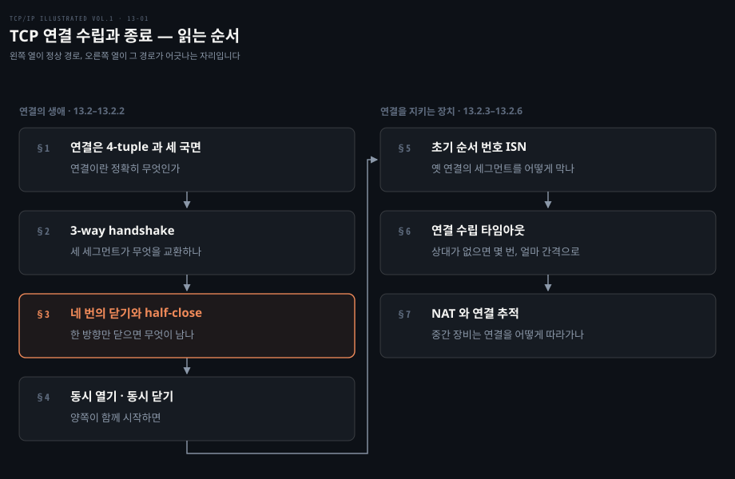
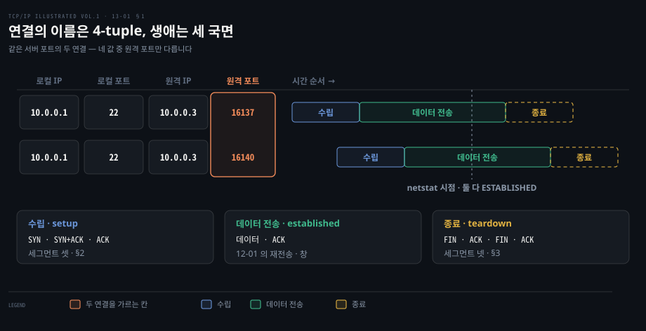
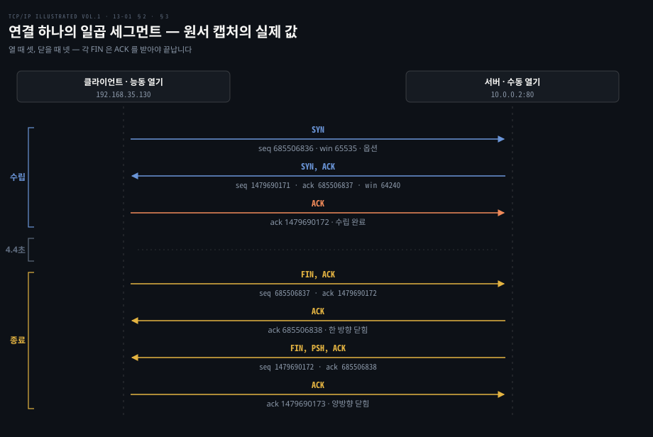
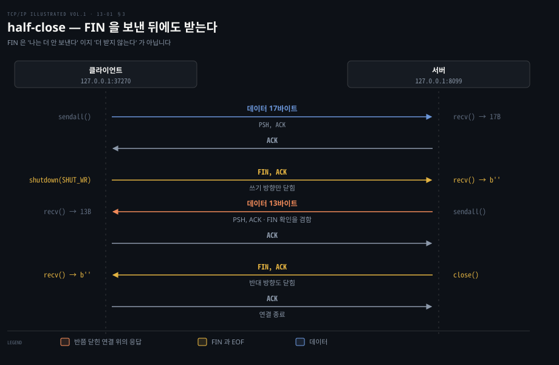
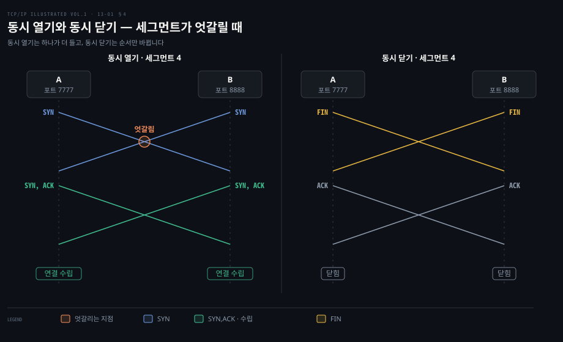
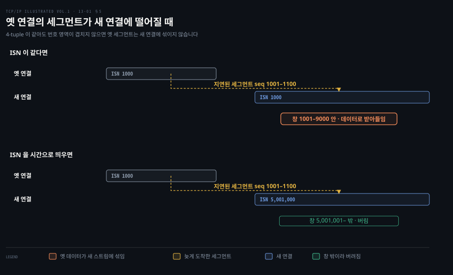
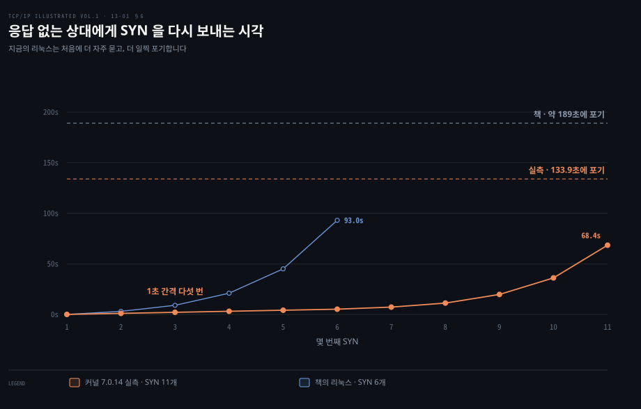
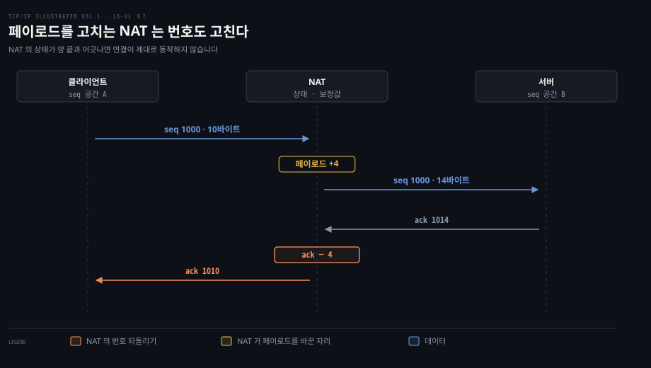

# TCP 연결은 세 세그먼트로 열고 네 세그먼트로 닫는다

---

> 13장 앞부분(13.1·13.2)은 TCP 연결이 무엇이고 어떻게 열리고 닫히는지를 패킷 단위로 따라갑니다. 정상 경로 다음에는 그 경로를 옛 세그먼트·응답 없는 상대·중간 장비로부터 지키는 장치(ISN, SYN 재전송, NAT 의 상태 추적)가 이어집니다.

## 핵심 요약

> 이 편이 매달린 하나의 생각은, TCP 연결이 양 끝이 함께 쥐고 있는 상태이고 그 상태를 맞추는 일이 열 때 세 세그먼트·닫을 때 네 세그먼트로 드러난다는 것입니다.

UDP 와 달리 TCP 는 양 끝이 연결에 대한 정보를 각자 들고 있습니다. 원문은 TCP 가 UDP 보다 훨씬 복잡한 이유를 이 상태 관리에서 찾습니다. 연결이 만들어질 때, 정상적으로 끝날 때, 경고 없이 리셋될 때를 모두 맞게 처리해야 하기 때문입니다.

여는 쪽은 3-way handshake 입니다. 세 세그먼트로 양쪽이 서로의 초기 순서 번호(ISN)를 확인하고 옵션을 맞춥니다. 닫는 쪽은 넷입니다. 연결이 양방향이라 각 방향을 따로 닫아야 하기 때문이고 한 방향만 닫고 반대 방향은 계속 받는 half-close 도 그래서 가능합니다.

이 편의 뒷부분은 그 상태를 지키는 장치를 봅니다. ISN 은 같은 4-tuple 로 다시 열린 연결에 옛 세그먼트가 섞이지 않게 하고 위조를 어렵게 합니다. 상대가 응답하지 않으면 SYN 을 간격을 늘려 가며 다시 보내다 포기합니다. 이 간격은 책의 실험이 이뤄진 2009년의 리눅스와 지금의 리눅스가 다릅니다. 중간의 NAT(Network Address Translation, 사설 주소와 공인 주소를 바꿔 주는 장비)는 TCP 상태 기계의 일부를 구현해 연결을 따라갑니다.


## 학습 목표

> 이 편을 읽고 나면 아래 다섯 가지를 스스로 해낼 수 있습니다.

1. 3-way handshake 의 세 세그먼트가 각각 무엇을 교환하는지 원서 캡처의 순서 번호로 짚을 수 있습니다.
2. 닫기에 세그먼트가 넷 드는 이유를 양방향과 half-close 로 설명하고, `shutdown()` 과 `close()` 의 차이를 말할 수 있습니다.
3. 동시 열기와 동시 닫기가 보통 경우와 세그먼트 수·순서에서 어떻게 다른지 비교할 수 있습니다.
4. ISN 이 0 이 아니고 시간에 따라 바뀌어야 하는 두 이유(옛 연결의 세그먼트, 위조)를 들고, 지금의 리눅스가 ISN 을 만드는 방식을 설명할 수 있습니다.
5. 연결이 맺어지지 않을 때 SYN 재전송 간격과 횟수가 책의 리눅스와 커널 6.5 이후 리눅스에서 어떻게 다른지 실측으로 말할 수 있습니다.

아래는 이 편의 절 일곱을 두 묶음으로 나눈 지도입니다. 왼쪽 열 §1~§4 가 연결 하나가 열리고 닫히는 정상 경로이고 오른쪽 열 §5~§7 이 그 경로가 어긋날 수 있는 자리를 지키는 장치입니다.



강조한 §3 은 [네트워크 로드맵](../../../roadmap/network-roadmap.md) 1단계의 half-close 행을 채우는 자리입니다. 같은 연결의 상태 이름(SYN_SENT·TIME_WAIT 등)과 전이는 13.5 를 다루는 다음 편들이 맡으므로 이 편은 상태 이름 대신 세그먼트와 소켓 호출로 이야기합니다.


## 1. 연결은 4-tuple 로 이름이 붙고 세 국면을 지난다

> TCP 연결은 두 IP 주소와 두 포트, 곧 4-tuple 로 이름이 붙는 양 끝의 상태입니다. 수립·데이터 전송·종료의 세 국면을 지나며, 국면 사이의 전이를 모두 맞게 처리하는 것이 구현의 어려움입니다.

### UDP 에 없는 것은 상태입니다

SSH 서버 한 대의 22번 포트에는 여러 클라이언트가 동시에 붙습니다. 서버의 TCP 는 22번 포트로 들어온 세그먼트가 그중 어느 연결의 것인지 무엇으로 가르고 연결마다 무엇을 기억해 두어야 할까요? 이 물음에 답하려면 TCP 가 말하는 연결이 정확히 무엇인지부터 세워야 합니다.

원문은 TCP 를 유니캐스트 연결 지향 프로토콜로 소개합니다. 어느 쪽이든 데이터를 보내기 전에 두 끝 사이에 연결을 맺어야 합니다. TCP 가 주는 것은 바이트 스트림이고 IP 층 이하에서 생기는 손실·중복·오류를 거의 모두 찾아 고칩니다.

그 대가가 연결 상태입니다. 연결 상태는 두 끝점이 그 연결에 대해 각자 들고 있는 정보를 말합니다. UDP 는 연결을 맺지도 끊지도 않는 비연결형이라 이런 정보가 없습니다. 원문이 꼽는 둘의 가장 큰 차이는 TCP 상태를 맞게 다루는 데 드는 세부의 양입니다. 연결이 만들어질 때, 정상적으로 끝날 때, 경고 없이 리셋될 때를 모두 처리해야 합니다.

연결을 맺는 동안에는 연결의 매개변수에 관한 옵션을 양 끝이 주고받습니다. 연결을 맺을 때만 보낼 수 있는 옵션도 있고 나중에 보낼 수 있는 옵션도 있습니다. [12-01 §8](./12-01.TCP%20의%20신뢰성은%20재전송·번호·창으로%20만든다.md) 에서 본 것처럼 옵션 칸은 40바이트로 제한됩니다. 옵션 하나하나는 13.3 을 다루는 다음 편에서 봅니다.

### 연결의 이름은 4-tuple 입니다

그러면 같은 포트로 들어온 세그먼트는 무엇으로 가를까요? 답은 연결의 이름에 있습니다. 원문은 TCP 연결을 두 IP 주소와 두 포트 번호로 이루어진 4-tuple 로 정의합니다. 더 정확히는 끝점(endpoint) 또는 소켓의 한 쌍이고 각 끝점은 (IP 주소, 포트 번호) 쌍으로 가려집니다. 같은 4-tuple 이 다시 쓰이면 무슨 일이 생기는지가 §5 의 주제입니다.

서버 포트가 같아도 클라이언트 쪽 값이 하나라도 다르면 다른 연결입니다. 원문은 13.7 에서 netstat 출력으로 이것을 보입니다. 서버 10.0.0.1 의 22번 포트에 같은 호스트 10.0.0.3 의 SSH 클라이언트 둘이 붙자 두 연결은 원격 포트 16137 과 16140 으로만 갈렸습니다. 클라이언트가 고르는 임시 포트는 그 호스트에서 지금 쓰이지 않는 번호라 둘이 겹치지 않습니다. 원문은 TCP 가 들어온 세그먼트를 목적지 포트 하나가 아니라 네 값을 모두 써서 가른다고 다시 강조합니다. 새 연결 요청을 받는 대기 소켓과 연결별 소켓이 어떻게 나뉘는지는 [13-04 §1](./13-04.서버의%20연결%20큐와%20SYN%20쿠키는%20수락%20전에%20작동한다.md) 이 다룹니다.

연결은 보통 세 국면을 지납니다. 수립, 데이터 전송, 종료이고 원문은 각각 setup, established, teardown(closing)이라 부릅니다. 원문은 튼튼한 TCP 구현을 만드는 어려움의 일부가 이 국면들 사이의 전이를 모두 맞게 처리하는 데 있다고 봅니다.



왼쪽 네 칸이 두 연결의 이름이고 오른쪽 막대가 각 연결이 지나는 국면입니다. 두 행에서 값이 다른 칸은 강조한 원격 포트 하나뿐입니다. 그 한 칸 덕분에 서버는 두 연결의 상태를 따로 들고 갑니다. 늦게 붙은 연결은 앞 연결이 데이터를 주고받는 동안 제 수립 국면을 지납니다. 국면은 포트가 아니라 연결마다 따로 흐릅니다. netstat 을 찍은 순간 둘 다 데이터 전송 국면(ESTABLISHED)에 있었습니다. 점선 종료 막대는 원서 출력 밖의 이후입니다. 시간 축은 순서만 나타내고 막대 길이에는 뜻이 없습니다. 수립은 §2, 종료는 §3 에서 세그먼트 단위로 봅니다.


## 2. 3-way handshake 는 양쪽의 ISN 을 교환한다

> 연결을 여는 세 세그먼트는 양쪽이 서로의 초기 순서 번호(ISN)를 확인하고 옵션을 알리는 절차입니다. SYN 이 번호 하나를 차지하므로 각 ACK 는 상대 ISN + 1 을 가리킵니다.

### 세 세그먼트가 하는 일

연결을 맺을 때는 보통 다음 일이 일어납니다.

1. 능동 열기를 하는 쪽(보통 클라이언트)이 SYN 세그먼트를 보냅니다. 연결하려는 상대의 포트 번호와 클라이언트의 초기 순서 번호 ISN(c)를 싣고 보통 옵션을 하나 이상 함께 보냅니다.
2. 서버가 자기 ISN(s)를 실은 SYN 세그먼트로 응답합니다. 같은 세그먼트로 ISN(c) + 1 을 ACK 해 클라이언트의 SYN 을 확인합니다. SYN 은 순서 번호 하나를 차지하고 잃어버리면 다시 보냅니다.
3. 클라이언트가 ISN(s) + 1 을 ACK 해 서버의 SYN 을 확인합니다.

이 세 세그먼트로 연결 수립이 끝나며 흔히 **3-way handshake** 라 부릅니다. 원문이 드는 목적은 둘입니다. 연결이 시작된다는 것과 옵션에 실린 세부를 양 끝이 서로 알게 하는 것, 그리고 ISN 을 교환하는 것입니다.

첫 SYN 을 보내는 쪽이 **능동 열기(active open)**를 한다고 말하고 이 SYN 을 받아 다음 SYN 을 보내는 쪽이 **수동 열기(passive open)**를 한다고 말합니다. 앞쪽이 보통 클라이언트, 뒤쪽이 보통 서버입니다. 양쪽이 동시에 능동 열기를 하는 드문 경우는 §4 에서 봅니다.

### 원서 캡처의 값으로 따라갑니다

원문은 윈도의 Telnet 클라이언트로 10.0.0.2 의 웹 서버 80번 포트에 연결합니다. Telnet 은 23번이 아닌 포트에 붙으면 애플리케이션 프로토콜을 쓰지 않고 입력 바이트를 그대로 TCP 로 옮길 뿐입니다. 웹 서버는 연결을 받으면 페이지 요청을 기다리는데 요청을 보내지 않았으므로 데이터가 하나도 오가지 않습니다. 연결 수립과 종료만 보기에 알맞은 조건입니다. 아래는 그 캡처(원서 그림 13-5)의 값을 원서 그림 13-1 의 모양으로 옮긴 것입니다.



위 세 줄이 handshake 입니다. 클라이언트의 SYN 은 ISN 685506836 과 창 65535 에 13.3 에서 다룰 옵션 몇 개를 함께 싣습니다.

둘째 세그먼트는 서버의 SYN 이면서 클라이언트에 대한 ACK 입니다. 서버 ISN 은 1479690171 이고 ACK 번호 685506837 은 클라이언트 ISN 보다 1 큽니다. 서버가 받을 수 있다고 광고한 창은 64,240바이트입니다. 셋째 세그먼트의 ACK 번호 1479690172 로 handshake 가 끝납니다. 원문은 여기서 ACK 번호가 누적이라는 점을 다시 짚습니다. ACK 번호는 늘 ACK 를 보내는 쪽이 다음에 받기를 기대하는 번호이지 마지막으로 받은 번호가 아닙니다.

원문은 첫 TCP 헤더의 길이가 44바이트로 최소 크기보다 24바이트 크다는 것도 밝힙니다. SYN 이 실은 옵션이 그만큼을 차지한 것입니다.

### SYN 에도 데이터를 실을 수 있습니다

원문은 TCP 가 SYN 세그먼트에 애플리케이션 데이터를 싣는 기능을 지원한다고 적습니다. 다만 버클리 소켓 API 가 지원하지 않아 거의 쓰이지 않는다고 덧붙입니다. 책이 나온 뒤 이 자리를 쓰는 TCP Fast Open 이 2014년 RFC 7413 으로 나왔습니다.[^rfc7413] 서버가 준 쿠키를 다음 연결의 SYN 에 실어 handshake 를 끝내기 전에 데이터를 보내는 방식입니다. 그 흐름은 [CNTD 03-04 §2 「빠른 열기 쿠키로 연결 수립의 1 RTT 를 줄이기」](../cntd_computer-networking-top-down/03-04.흐름%20제어와%20연결%20관리,%20그리고%20혼잡.md) 에 있습니다.


## 3. 닫기는 네 세그먼트이고, 한 방향만 닫을 수도 있다

> 연결이 양방향이라 각 방향을 따로 닫아야 하므로 닫기에는 세그먼트가 넷 듭니다. 한 방향만 닫고 반대 방향은 계속 받는 것이 half-close 이고, 소켓 API 에서는 `close()` 가 아니라 `shutdown()` 으로 씁니다.

### 네 세그먼트로 한 방향씩 닫습니다

연결을 닫는 일은 어느 쪽이든 시작할 수 있습니다. 전통적으로는 클라이언트가 먼저 닫는 경우가 많았습니다. 웹 서버처럼 요청을 처리한 뒤 서버가 먼저 닫는 경우도 있습니다. 보통은 애플리케이션이 `close()` 시스템 호출 같은 것으로 연결을 끝내겠다고 알리면 닫는 쪽 TCP 가 FIN 비트를 켠 세그먼트를 보내며 닫기가 시작됩니다. 닫기는 양쪽이 모두 닫아야 끝납니다.

1. 능동 닫기를 하는 쪽이 FIN 세그먼트를 보냅니다. 순서 번호는 상대가 다음에 받기를 기대하는 값(원서 그림의 K)이고 반대 방향으로 마지막에 온 데이터에 대한 ACK(그림의 L)도 함께 싣습니다.
2. 수동 닫기를 하는 쪽이 K + 1 을 ACK 해 FIN 을 받았다고 알립니다. 이 시점에 애플리케이션은 상대가 연결을 닫았다는 통지를 받고, 보통 그에 따라 자기 쪽 닫기를 시작합니다. 그러면 이쪽도 능동 닫기를 하는 셈이 되어 순서 번호 L 의 FIN 을 보냅니다.
3. 마지막 세그먼트가 그 FIN 을 ACK 해 닫기를 마칩니다. FIN 을 잃어버리면 ACK 를 받을 때까지 다시 보냅니다.

위 도식의 아래 네 줄이 원서 캡처의 닫기입니다. 4.4초 뒤 클라이언트가 순서 번호 685506837 의 FIN 을 보냅니다. 데이터를 하나도 보내지 않았으므로 ISN + 1 그대로입니다. 서버는 685506838 로 ACK 하고 곧이어 순서 번호 1479690172 의 자기 FIN 을 보냅니다. 이 FIN 은 클라이언트의 FIN 을 한 번 더(중복으로) 확인하며 PSH 비트가 켜져 있습니다. 원문은 이 PSH 가 닫기에 실제 영향은 없고 보통 서버가 더 보낼 데이터가 없다는 뜻이라고 설명합니다. 마지막 세그먼트의 ACK 번호 1479690173 이 서버의 FIN 을 확인합니다.

열 때 셋, 닫을 때 넷으로 모두 일곱 세그먼트가 "점잖게" 맺고 끊는 연결의 기본 비용입니다. 특수한 리셋 세그먼트로 연결을 갑자기 허무는 길도 있는데 13.6 을 다루는 편에서 봅니다. 원문은 이 비용 때문에 적은 데이터만 주고받는 일부 애플리케이션이 연결 없이 보내는 UDP 를 고른다고 덧붙입니다. 그 대신 그런 애플리케이션은 오류 복구, 혼잡 관리, 흐름 제어를 스스로 맡아야 합니다.

### half-close 는 쓰기 방향만 닫습니다

연결이 양방향이므로 한 방향만 동작하게 둘 수도 있습니다. TCP 의 **half-close** 는 데이터 흐름의 한 방향만 닫는 동작입니다. half-close 두 번이 모이면 연결 전체가 닫힙니다. 규칙은 단순합니다. 어느 쪽이든 데이터를 다 보냈으면 FIN 을 보낼 수 있습니다. FIN 을 받은 TCP 는 상대가 그 방향의 흐름을 끝냈다고 애플리케이션에 알려야 합니다. 보통은 애플리케이션이 닫기를 호출해 FIN 이 나가므로 대개 두 방향이 함께 닫힙니다.

원문은 이 기능이 필요한 애플리케이션이 드물어 흔하지 않다고 적습니다. 쓰려면 API 가 "보낼 데이터는 끝났으니 상대에게 FIN 을 보내라, 그래도 상대가 FIN 을 보낼 때까지는 받겠다" 를 말할 수 있어야 합니다. 버클리 소켓 API 에서는 흔히 쓰는 `close()` 대신 `shutdown()` 을 호출하면 됩니다. 대부분의 애플리케이션은 `close()` 로 두 방향을 함께 닫습니다.

원문은 그림 13-2 로 이 흐름을 보이지만 실제 캡처는 없으므로 리눅스 루프백에서 직접 떠 보았습니다. 환경은 12-01 과 같은 OrbStack 의 Ubuntu(커널 7.0.14)입니다. 클라이언트는 요청 17바이트를 보낸 뒤 `shutdown(SHUT_WR)` 을 부르고 서버는 `recv()` 가 빈 바이트열을 돌려줄 때까지 읽은 뒤 13바이트로 답합니다.

```python
# 클라이언트 (hc_client.py)
s = socket.create_connection(("127.0.0.1", 8099))
s.sendall(b"hello half-close\n")
s.shutdown(socket.SHUT_WR)        # 쓰기 방향만 닫는다 → FIN
print("reply:", s.recv(4096))     # 반쯤 닫힌 연결로도 받는다
print("next recv:", s.recv(4096)) # b"" = 서버의 FIN
```

핸드셰이크 세 줄을 뺀 캡처입니다(tcpdump `-S`, 옵션 칸은 줄였습니다).

```bash
127.0.0.1.37270 > 127.0.0.1.8099: Flags [P.], seq 3991546832:3991546849, ack 1965954738, length 17
127.0.0.1.8099 > 127.0.0.1.37270: Flags [.], ack 3991546849, length 0
127.0.0.1.37270 > 127.0.0.1.8099: Flags [F.], seq 3991546849, ack 1965954738, length 0
127.0.0.1.8099 > 127.0.0.1.37270: Flags [P.], seq 1965954738:1965954751, ack 3991546850, length 13
127.0.0.1.37270 > 127.0.0.1.8099: Flags [.], ack 1965954751, length 0
127.0.0.1.8099 > 127.0.0.1.37270: Flags [F.], seq 1965954751, ack 3991546850, length 0
127.0.0.1.37270 > 127.0.0.1.8099: Flags [.], ack 1965954752, length 0
```



순서는 원서 그림 13-2 와 같습니다. 클라이언트가 셋째 줄에서 FIN 을 보낸 뒤에도 서버는 넷째 줄에서 13바이트를 보내고 클라이언트는 그것을 받아 ACK 합니다. 서버가 `close()` 해 보낸 둘째 FIN 이 확인되면 연결이 완전히 닫힙니다. 애플리케이션 쪽에서 FIN 은 `recv()` 가 돌려주는 빈 바이트열 `b''`, 곧 파일 끝(EOF)으로 보입니다.

원서 그림과 다른 점이 하나 있습니다. 서버는 클라이언트의 FIN 을 따로 ACK 하지 않았습니다. 13바이트 응답 세그먼트의 ACK 번호 3991546850 이 FIN 의 순서 번호 3991546849 + 1 이라 응답이 FIN 의 확인을 겸했습니다. 원문이 12장에서 말한 "데이터 세그먼트가 반대 방향 ACK 를 함께 싣는다" 가 닫기에서도 그대로 적용되는 모습입니다.

half-close 가 실무에서 문제가 되는 자리는 바이트를 양쪽으로 옮겨 주는 중계 프로그램입니다. 원문 밖의 이야기입니다. 한쪽에서 FIN 이 왔을 때 중계가 반대쪽 연결을 통째로 `close()` 해 버리면 아직 오는 중인 응답을 잃습니다. 쓰기 방향만 닫아 FIN 을 그대로 전해야 합니다. Go 의 `net.TCPConn.CloseWrite` 처럼 쓰기 방향만 닫는 API 가 따로 있는 이유입니다.[^go-closewrite] 로드맵도 그래서 reverse proxy 와 half-close 를 한 행에 묶었습니다.


## 4. 동시 열기와 동시 닫기

> 양쪽이 동시에 능동 열기를 하면 두 SYN 이 엇갈리고 세그먼트가 하나 더 들어 넷이 됩니다. 동시 닫기는 세그먼트 수가 보통 닫기와 같고 순서만 엇갈립니다.

### 서로에게 동시에 거는 연결

일부러 맞추지 않는 한 거의 일어나지 않지만 두 애플리케이션이 서로에게 동시에 능동 열기를 할 수 있습니다. 각 끝은 상대의 SYN 을 받기 전에 자기 SYN 을 보내야 하므로 두 SYN 이 망에서 엇갈려 지나갑니다. 또 각 끝이 상대의 IP 주소와 포트 번호를 미리 알아야 합니다. 원문은 이것이 7장에서 본 방화벽 "hole punching" 기법을 빼면 드물다고 적습니다. 이런 경우를 **동시 열기(simultaneous open)**라 부릅니다.

원문의 예는 이렇습니다. 호스트 A 의 로컬 포트 7777 에서 호스트 B 의 포트 8888 로 능동 열기를 하는 동시에, B 의 로컬 포트 8888 에서 A 의 포트 7777 로 능동 열기를 합니다. 원문은 이것이 A 의 클라이언트가 B 의 서버에, B 의 클라이언트가 A 의 서버에 동시에 붙는 것과 다르다고 강조합니다. 그 경우에는 두 서버가 수동 열기를 하고 두 클라이언트가 서로 다른 임시 포트를 고르므로 별개의 TCP 연결 둘이 생깁니다.



왼쪽이 원서 그림 13-3 입니다. 엇갈린 SYN 을 받은 양쪽이 각자 SYN,ACK 를 보내므로 보통의 3-way handshake 보다 세그먼트가 하나 많은 넷이 오갑니다. 원문 캡션은 각 세그먼트의 SYN 비트가 그 SYN 이 확인될 때까지 켜져 있다고 적습니다. 양쪽이 모두 클라이언트이자 서버로 행동하므로 어느 쪽도 클라이언트나 서버라고 부르지 않습니다.

오른쪽이 원서 그림 13-4 의 동시 닫기입니다. 보통은 한쪽이 능동 닫기를 해 첫 FIN 을 보내는데 동시 닫기에서는 양쪽이 다 능동 닫기를 합니다. 세그먼트 수는 보통 닫기와 같고 순서가 차례가 아니라 엇갈린다는 점만 다릅니다. 원문은 동시 열기와 동시 닫기가 TCP 구현에서 평소 잘 쓰이지 않는 특정 상태를 지난다고 덧붙입니다. 그 상태는 13.5 를 다루는 편에서 봅니다. 동시 열기를 실제로 쓰는 NAT 너머 연결 기법은 로드맵 8단계의 hole punching 행으로 이어집니다.


## 5. ISN 은 옛 연결의 세그먼트와 위조를 막는다

> 같은 4-tuple 로 다시 열린 연결에 옛 연결의 지연된 세그먼트가 섞이지 않도록 ISN 은 시간에 따라 바뀌어야 합니다. 4-tuple 과 창만 알면 세그먼트를 위조할 수 있으므로 ISN 은 추측하기도 어려워야 합니다.

### 같은 4-tuple 의 다음 연결이 문제입니다

연결이 열려 있으면 두 IP 주소와 포트 번호가 맞는 세그먼트는 순서 번호가 창 안에 있고 체크섬이 맞는 한 유효로 받아들여집니다. 그러면 망 어딘가를 떠돌던 TCP 세그먼트가 나중에 나타나 연결을 어지럽힐 수 있지 않을까요? 원문은 이 걱정을 ISN 을 신중하게 고르는 것으로 다룬다고 말합니다.

각 끝은 연결을 맺으려고 SYN 을 보내기 전에 그 연결의 ISN 을 고릅니다. ISN 은 시간에 따라 바뀌어 연결마다 달라야 합니다. RFC 793 은 ISN 을 4μs 마다 1 씩 느는 32비트 카운터로 보라고 정합니다. 목적은 한 연결의 순서 번호가 같은 연결의 다음 인스턴스(incarnation)의 순서 번호와 겹치지 않게 하는 것입니다.

같은 연결의 인스턴스가 여럿이라는 말은 연결이 4-tuple 로 가려진다는 것을 떠올리면 분명해집니다. 어떤 연결의 세그먼트 하나가 오래 지연된 사이 그 연결이 닫혔다가 같은 4-tuple 로 다시 열렸다면 지연된 세그먼트가 새 연결의 데이터 스트림에 유효한 데이터로 다시 들어갈 수 있습니다. 아래 도식은 이 장면을 설명용 숫자로 그린 것입니다.



위 판은 새 연결이 옛 연결과 같은 ISN 으로 시작한 경우라 늦게 온 seq 1001–1100 이 새 창 안에 들어 데이터로 받아들여집니다. 아래 판은 ISN 이 시간과 함께 멀리 떨어진 경우라 같은 세그먼트가 창 밖에 떨어져 버려집니다. 원문은 연결 인스턴스 사이의 번호 겹침을 피하면 이 위험을 줄일 수 있다고 하면서도 데이터 무결성이 아주 중요한 애플리케이션은 애플리케이션 층에서 자체 CRC 나 체크섬을 쓰라고 권합니다. 큰 파일에서 흔히 하는 일이기도 합니다. 원문의 이 절 밖에서 덧붙이면, 같은 위험을 시간 쪽에서 막는 장치가 TIME_WAIT 이고 13.5 를 다루는 편에서 봅니다.

### 4-tuple 과 창만 알면 세그먼트를 위조할 수 있습니다

원문은 연결의 4-tuple 과 현재 유효한 순서 번호 창만 알면 상대 TCP 가 유효로 여기는 세그먼트를 만들 수 있다고 적습니다. 이것이 TCP 의 취약점입니다. 누구든 순서 번호·IP 주소·포트 번호를 맞게 골라 세그먼트를 위조하면 TCP 연결을 끊을 수 있습니다. 원문은 그 근거로 RFC 5961 을 댑니다. 원문이 드는 방어는 둘입니다. 하나는 초기 순서 번호를 추측하기 어렵게 만드는 것이고 임시 포트 번호도 같은 목적으로 무작위화합니다(RFC 6056). 다른 하나는 18장의 암호화입니다.

### ISN 을 고르는 방식은 책 이후 바뀌었습니다

원문은 현대 시스템이 ISN 을 반쯤 무작위로 고른다고 적습니다. 2009년 무렵 리눅스의 방식은 이렇게 설명합니다. 시계 기반 방식을 쓰되 연결마다 시계를 무작위 오프셋에서 시작합니다. 오프셋은 연결 식별자인 4-tuple 에 대한 암호학적 해시로 고르며 해시의 비밀 입력은 5분마다 바뀝니다. ISN 32비트 가운데 위 8비트는 비밀값의 일련번호이고 나머지는 해시가 만듭니다. 윈도도 RC4 를 쓰는 비슷한 방식이라고 합니다.

원문은 여기까지이므로 현행 규칙과 지금의 리눅스 소스로 채웁니다. RFC 9293 은 RFC 6528 을 흡수해 ISN 을 ISN = M + F(로컬 IP, 로컬 포트, 원격 IP, 원격 포트, 비밀 키) 로 만들라고 권합니다. M 은 4μs 시계이고 F 는 밖에서 계산할 수 없는 의사 난수 함수입니다.[^rfc9293-isn] 리눅스는 이 틀을 따르되 시계를 더 촘촘히 씁니다.

| 항목 | 책이 설명한 리눅스 (2009) | 현재 리눅스 `secure_seq.c` |
|---|---|---|
| 해시 | 4-tuple 의 암호학적 해시 | `siphash_3u32(saddr, daddr, ports, net_secret)` |
| 비밀값 | 5분마다 바뀜 · 위 8비트가 비밀값 일련번호 | 처음 쓸 때 한 번 무작위로 정함(`net_get_random_once`) |
| 시계 | 시계 기반 | 실시간 시계 ns >> 6, 곧 64ns 단위 |

커널 소스의 주석은 RFC 793 의 4μs 시계가 2Mb/s 망을 가정한 값이라고 짚습니다. 10Gb/s 망이라면 1GHz 시계도 괜찮겠지만 32비트 번호가 MSL(2분) 안에 두 번 돌지 않도록 해상도를 64ns 로 제한했고 이 시계로 한 바퀴 도는 데 274초가 걸린다고 적습니다.[^secure-seq] 12-01 §8 의 캡처에서 클라이언트 ISN 2805284146 과 서버 ISN 547076596 이 아무 관계 없이 보였던 것이 이 해시 덕분입니다.


## 6. 연결이 맺어지지 않으면 SYN 을 물러나며 다시 보낸다

> 상대가 응답하지 않으면 TCP 는 SYN 을 간격을 늘려 가며 다시 보내다 포기합니다. 책의 리눅스는 3초에서 시작해 매번 두 배로 늘렸고, 지금의 리눅스는 1초 간격으로 다섯 번 보낸 뒤에야 두 배로 늘립니다.

### 책의 실험은 3초에서 시작해 매번 두 배입니다

연결을 맺지 못하는 경우는 여럿입니다. 서버 호스트가 꺼져 있는 것이 가장 뻔한 경우입니다. 원문은 같은 서브넷의 존재하지 않는 호스트로 telnet 을 걸어 이 상황을 흉내 냅니다. ARP 테이블을 그대로 두면 ARP 응답이 오지 않아 "No route to host" 오류로 끝납니다. 그래서 먼저 쓰이지 않는 MAC 주소로 ARP 항목을 넣어 ARP 요청 없이 곧장 TCP 로 연결을 시도하게 합니다. 타임아웃은 명령 후 약 3.2분 뒤에 났습니다. 응답할 호스트가 없으니 캡처된 세그먼트는 모두 클라이언트가 보낸 SYN 입니다.

원서 Listing 13-1 의 SYN 시각은 0, 3.0, 9.0, 21.0, 45.0, 93.0초입니다. 둘째는 첫째 뒤 3초, 셋째는 둘째 뒤 6초, 넷째는 셋째 뒤 12초로 간격이 매번 두 배가 됩니다. 이것이 지수 백오프(exponential backoff)입니다. 원문은 3장의 이더넷 CSMA/CD 도 비슷하지만 이더넷은 최대 백오프만 두 배로 늘리고 실제 값은 무작위로 고르는 반면 TCP 는 매번 정확히 두 배라는 점이 다르다고 짚습니다.

첫 SYN 을 몇 번 다시 보낼지는 시스템에 따라 설정할 수 있고 보통 5 처럼 작은 값입니다. 리눅스에서는 `net.ipv4.tcp_syn_retries` 가 능동 열기 때 SYN 을 다시 보내는 최대 횟수입니다. `net.ipv4.tcp_synack_retries` 는 상대의 능동 열기에 답하는 SYN + ACK 를 다시 보내는 최대 횟수입니다. 연결마다 리눅스 전용 소켓 옵션 `TCP_SYNCNT` 로 정할 수도 있습니다. 원문은 이 기본값이 5 라고 적습니다. 재전송 사이의 지수 백오프는 TCP 혼잡 관리의 일부라 뒷장에서 자세히 다룬다고 말합니다.

### 지금의 리눅스는 1초 간격으로 다섯 번 먼저 보냅니다

같은 실험을 OrbStack 의 Ubuntu(커널 7.0.14)에서 해 보았습니다. ARP 대신 nftables 로 루프백의 9999번 포트로 들어오는 SYN 을 입력 단계에서 버리게 하고 tcpdump 로 나가는 SYN 의 시각을 쟀습니다.

```bash
sysctl net.ipv4.tcp_syn_retries net.ipv4.tcp_syn_linear_timeouts
# net.ipv4.tcp_syn_retries = 6
# net.ipv4.tcp_syn_linear_timeouts = 4
sudo nft add table inet labdrop
sudo nft 'add chain inet labdrop in { type filter hook input priority 0; }'
sudo nft add rule inet labdrop in ip daddr 127.0.0.1 tcp dport 9999 tcp flags syn drop
python3 -c 'import socket; socket.create_connection(("127.0.0.1", 9999))'
```

tcpdump `-ttt` 가 찍은 SYN 사이 간격은 1.06 · 1.01 · 1.02 · 1.02 · 1.03 · 2.05 · 4.03 · 8.51 · 16.38 · 32.26초였습니다. 누적하면 SYN 이 0 · 1.1 · 2.1 · 3.1 · 4.1 · 5.1 · 7.2 · 11.2 · 19.7 · 36.1 · 68.4초에 모두 11번 나갔습니다.

`connect()` 는 133.9초 만에 `TimeoutError(110, 'Connection timed out')` 로 실패했습니다. 다시 보낸 SYN 은 모두 같은 순서 번호 851642495 를 실었습니다. 새 연결 시도가 아니라 같은 SYN 의 재전송이기 때문입니다.



두 계열을 같은 축에 놓으면 차이가 셋 보입니다.

| 항목 | 책의 리눅스 (2009) | 커널 7.0.14 실측 |
|---|---|---|
| 첫 재전송까지 | 3초 | 1초 |
| 재전송 간격 | 3 · 6 · 12 · 24 · 48초 | 1 · 1 · 1 · 1 · 1 · 2 · 4 · 8 · 16 · 32초 |
| 보낸 SYN | 6개 (재전송 5번) | 11개 (재전송 10번) |
| 포기까지 | 약 189초 (3.2분) | 133.9초 |

첫째 차이인 1초는 원문 밖의 RFC 6298 에서 왔습니다. RTT 를 한 번도 재지 못한 동안 쓰는 초기 RTO 를 1초로 두라고 정하면서 이전 판(RFC 2988)의 3초에서 낮췄다고 밝힙니다.[^rfc6298-init] 책의 실험이 3초로 시작한 것은 그 이전 값이었습니다.

둘째와 셋째 차이는 커널 6.5 에 들어간 변경입니다. 커밋 ccce324dabfe 는 첫 SYN 백오프 N 번을 선형으로 만드는 `tcp_syn_linear_timeouts` 를 더하고 기본값을 4 로 정했습니다. 커밋 설명은 링크 장애 때 지수 백오프가 지나치게 보수적이라 더 적극적으로 다시 보내면 라우터가 살아 있는 우회 경로를 찾을 때까지 걸리는 시간이 준다고 이유를 듭니다. 기본값 4 는 macOS·iOS 가 십 년 넘게 써 온 1·1·1·1·1·2·4·8 일정에 맞춘 것이라고 적습니다.[^linear-commit]

재전송이 `tcp_syn_retries` 의 6번보다 많은 10번인 이유는 커널 소스에 있습니다. `tcp_timer.c` 의 `tcp_write_timeout()` 은 SYN_SENT 상태에서 재전송 상한을 `tcp_syn_retries` 에 `tcp_syn_linear_timeouts` 를 더한 값으로 잡습니다.[^tcp-timer] 6 + 4 = 10 이라 SYN 이 11개 나갑니다. 마지막 재전송인 68.4초 뒤 RTO 64초를 더 기다린 약 132초에 포기하는 것이 계산값입니다. 실측의 마지막 대기는 약 65.5초여서 133.9초가 나왔습니다. 그 1.5초 차이의 원인은 이 실험으로 가리지 않았습니다.

커널 문서도 기본값 6 이 선형 백오프 4 와 함께 마지막 재전송까지 67초, 최종 타임아웃 131초에 해당한다고 적습니다.[^ip-sysctl] 선형 백오프는 능동 열기 쪽 SYN 에만 적용됩니다. 수동 쪽 SYN+ACK 재전송을 정하는 `tcp_synack_retries`(기본 5)에는 효과가 없습니다.

실무에서는 이 숫자가 "연결이 안 될 때 클라이언트가 몇 초를 붙잡혀 있나" 를 정합니다. 애플리케이션이 자체 연결 타임아웃을 두지 않으면 리눅스 클라이언트는 기본값으로 2분 넘게 기다립니다. 책이 잰 약 3.2분이 지금은 약 2분 14초로 줄었지만 사용자를 기다리게 하기에는 여전히 긴 시간입니다.


## 7. NAT 는 TCP 상태를 따라가며 고친다

> NAT 는 SYN·SYN+ACK·ACK 를 보고 연결의 시작과 끝을 알아내며, TCP 상태 기계의 일부를 구현해 연결을 추적합니다. 페이로드를 고쳐 쓰는 NAT 는 순서 번호와 ACK 번호까지 고쳐야 하고, 그 상태가 양 끝과 어긋나면 연결이 깨집니다.

### NAT 는 TCP 의 의사 헤더 체크섬부터 고칩니다

7장에서 본 보통의 NAT 는 TCP·UDP 같은 프로토콜이 쓰는 주소와 포트 번호를 바꿔 씁니다. TCP 에 NAT 를 쓰면 의사 헤더 체크섬도 대개 고쳐야 합니다. [12-01 §7](./12-01.TCP%20의%20신뢰성은%20재전송·번호·창으로%20만든다.md) 에서 본 것처럼 이 체크섬은 IP 헤더의 주소까지 덮기 때문입니다. 원문은 체크섬에 영향을 주지 않도록 주소를 바꾸는 방식(checksum-neutral)을 쓰는 경우만 예외라고 적고 의사 헤더 체크섬을 쓰는 다른 프로토콜도 같다고 덧붙입니다.

### NAT 는 상태 기계의 일부를 구현해 연결을 따라갑니다

TCP 연결이 처음 맺어질 때 NAT(또는 NAT64)는 세그먼트의 SYN 비트로 그 사실을 알아챕니다. 이어서 알맞은 순서 번호를 가진 SYN + ACK 와 ACK 를 보고 연결이 완전히 맺어졌는지도 알아냅니다. 연결이 끝날 때도 마찬가지입니다. NAT 에 TCP 상태 기계의 일부를 구현하면(원문은 RFC 6146 의 3.5.2.1·3.5.2.2 절을 예로 듭니다) 현재 상태, 방향별 순서 번호, 그에 대응하는 ACK 번호까지 추적할 수 있습니다. 원문은 이런 상태 추적이 NAT 구현에서 흔하다고 적습니다.

리눅스에서 이 일을 하는 것이 netfilter 의 연결 추적(conntrack)입니다. 연결마다 상태를 들고 있다가 같은 연결의 다음 패킷에 같은 주소 변환을 적용합니다. 그 구조는 [N&K 02-02](../../../08_cloud/book/networking-and-kubernetes/02-02.커널이%20패킷을%20판정하는%20층%20—%20Netfilter·Conntrack·라우팅.md) 와 [network-fundamentals-lab 05-01 「연결은 양 끝만의 일이 아니다」](../../project/network-fundamentals-lab/05-01.연결은%20양%20끝만의%20일이%20아니다.md) 이 실습으로 다룹니다.

### 페이로드를 고치면 번호도 고쳐야 합니다

NAT 가 편집자처럼 전송 프로토콜의 데이터 페이로드 내용까지 고쳐 쓰면 일이 더 복잡해집니다. TCP 라면 데이터 스트림에 바이트를 넣거나 빼게 되어 순서 번호와 세그먼트 길이가 달라집니다. 체크섬은 물론이고 데이터의 순서까지 영향을 받습니다. NAT 가 스트림에 데이터를 넣거나 뺐다면 이 값들을 맞춰 고칠 수 있지만 원문은 이것이 다소 깨지기 쉽다고 경고합니다. NAT 의 상태가 양 끝의 상태와 어긋나는 순간 연결이 제대로 동작하지 않기 때문입니다.

아래 도식은 이 보정을 설명용 숫자로 그린 것입니다.



클라이언트가 seq 1000 부터 10바이트를 보내는데 NAT 가 페이로드를 4바이트 늘려 서버에 넘깁니다. 서버는 14바이트를 받았으니 ack 1014 를 돌려줍니다. NAT 는 이것을 클라이언트가 아는 번호인 ack 1010 으로 되돌려야 합니다. 이후 이 방향의 번호는 계속 4 만큼 어긋난 채로 NAT 가 고쳐 줘야 합니다. 원문이 드는 이유는 NAT 의 상태가 양 끝과 어긋날 수 있다는 것입니다. 노트의 해석을 덧붙이면, 그 보정값을 양 끝은 모르고 NAT 만 쥐고 있기 때문에 어긋남이 곧 연결의 고장이 됩니다.

원문 밖의 예로 실제 구현을 하나 봅니다. 리눅스의 NAT 도우미는 FTP 의 PORT 명령 같은 페이로드 속 주소를 바꿔 씁니다. 바꾼 뒤 길이가 달라지면 `nf_nat_helper.c` 가 `nf_ct_seqadj_set()` 으로 그 차이를 연결 추적 항목에 기록합니다. 그 뒤로 이 연결의 순서 번호는 기록된 차이만큼 보정됩니다.[^seqadj]


## 면접 대비

> 아래 질문에 답하면서 각 세그먼트가 순서 번호를 몇 개 차지하는지, 그리고 어느 쪽이 무엇을 기억하는지를 함께 말해 보세요.

1. 원서 캡처에서 클라이언트 ISN 이 685506836 일 때 서버의 SYN,ACK 는 왜 ack 685506837 을 싣고, 셋째 세그먼트의 ACK 번호는 무엇이 되나요?
2. 연결을 닫는 데 세그먼트가 넷 드는 이유는 무엇이고, `shutdown(SHUT_WR)` 을 부른 클라이언트가 그 뒤에도 응답을 받을 수 있는 이유는 무엇인가요?
3. 호스트 A 의 7777번 포트와 호스트 B 의 8888번 포트가 서로에게 동시에 능동 열기를 하면 연결이 몇 개 생기고 세그먼트가 몇 개 오가나요? 동시 닫기와는 무엇이 다른가요?
4. 모든 연결이 ISN 0 으로 시작한다면 같은 4-tuple 로 다시 연 연결에서 무슨 일이 생길 수 있고, 지금의 리눅스는 ISN 을 어떻게 만드나요?
5. 응답하지 않는 서버에 커널 7.0.14 의 기본값으로 `connect()` 하면 SYN 이 몇 개 나가고 얼마 뒤에 실패하나요? 책의 리눅스와 무엇이 다르고 그 차이는 어디서 왔나요?


## 정답 (자답 후 펼치기)

> 위 §면접 대비의 질문에 먼저 스스로 답한 뒤 읽으세요.

### 정답 1 — SYN 이 차지하는 번호 하나

SYN 은 데이터가 없어도 순서 번호 하나를 차지합니다. ACK 번호는 ACK 를 보내는 쪽이 다음에 받기를 기대하는 번호이므로 서버는 클라이언트 SYN 의 번호 685506836 다음인 685506837 을 싣습니다. 같은 이유로 셋째 세그먼트는 서버 ISN 1479690171 에 1 을 더한 1479690172 를 ACK 하며 이 세그먼트로 handshake 가 끝납니다.

### 정답 2 — 방향마다 따로 닫는 FIN

연결이 양방향이라 각 방향을 따로 닫아야 합니다. 방향마다 FIN 하나와 그 ACK 하나가 들어 넷이 됩니다. FIN 은 "이 방향으로는 더 보내지 않는다" 는 뜻이지 받기를 멈춘다는 뜻이 아닙니다. 그래서 `shutdown(SHUT_WR)` 으로 쓰기 방향만 닫은 클라이언트는 서버가 자기 FIN 을 보낼 때까지 계속 받습니다. §3 의 캡처에서 서버의 13바이트 응답이 클라이언트 FIN 의 ACK 를 겸했습니다.

### 정답 3 — 엇갈린 SYN 과 하나의 연결

두 끝이 서로의 포트를 정확히 겨냥한 동시 열기라 연결은 하나이고 엇갈린 SYN 에 양쪽이 각자 SYN,ACK 로 답해 세그먼트가 넷 오갑니다. 보통의 3-way handshake 보다 하나 많습니다. 동시 닫기는 세그먼트 수가 보통 닫기와 같은 넷이고 순서만 엇갈립니다. 반대로 A 의 클라이언트가 B 의 서버에, B 의 클라이언트가 A 의 서버에 붙는 경우는 임시 포트가 달라 별개의 연결 둘이 생깁니다.

### 정답 4 — 옛 인스턴스의 세그먼트와 해시 기반 ISN

옛 연결에서 오래 지연된 세그먼트가 새 연결의 창 안에 떨어져 유효한 데이터로 들어갈 수 있습니다. ISN 이 예측 가능하면 4-tuple 과 창을 맞춰 세그먼트를 위조하기도 쉬워집니다. 지금의 리눅스는 RFC 9293 의 ISN = M + F(4-tuple, 비밀 키) 틀을 따라 4-tuple 과 처음 한 번 정한 비밀값을 `siphash` 로 섞은 값에 64ns 단위 시계를 더합니다.

### 정답 5 — 1초 시작과 선형 백오프

`tcp_syn_retries` 6 에 `tcp_syn_linear_timeouts` 4 를 더한 10번을 재전송하므로 SYN 이 11개 나갑니다. 실측에서는 133.9초 뒤 `ETIMEDOUT` 으로 실패했습니다. 책의 리눅스는 3초에서 시작해 매번 두 배로 늘리며 SYN 6개를 보낸 뒤 약 3.2분 만에 포기했습니다. 첫 간격 1초는 RFC 6298 이 초기 RTO 를 3초에서 1초로 낮춘 결과이고 처음 다섯 간격이 1초로 같은 것은 커널 6.5 의 선형 백오프 변경 때문입니다.


## 참고 자료

- 《TCP/IP Illustrated, Volume 1: The Protocols》 2nd ed. Kevin R. Fall · W. Richard Stevens, Addison-Wesley, 2011. ISBN 978-0-321-33631-6.
  13장 TCP Connection Management, 13.1~13.2.
- [RFC 9293 — Transmission Control Protocol (TCP)](https://www.rfc-editor.org/rfc/rfc9293): §3.4.1 초기 순서 번호 선택.
- [RFC 6298 — Computing TCP's Retransmission Timer](https://www.rfc-editor.org/rfc/rfc6298): 초기 RTO 1초.
- [RFC 7413 — TCP Fast Open](https://www.rfc-editor.org/rfc/rfc7413): SYN 에 데이터를 싣는 방식.
- 리눅스 커널 소스: [`net/core/secure_seq.c`](https://github.com/torvalds/linux/blob/165573e41f2f/net/core/secure_seq.c) · [`net/ipv4/tcp_timer.c`](https://github.com/torvalds/linux/blob/18666c73afe9/net/ipv4/tcp_timer.c) · [커밋 ccce324dabfe](https://github.com/torvalds/linux/commit/ccce324dabfe).


## 관련 문서

- [12-01 TCP 의 신뢰성은 재전송·번호·창으로 만든다](./12-01.TCP%20의%20신뢰성은%20재전송·번호·창으로%20만든다.md): 4-tuple·ISN·SYN 이 번호 하나를 차지한다는 이 편의 전제를 세운 앞 편입니다.
- [PAW 03-01 TCP 연결의 생애](../paw_packet-analysis-wireshark/03-01.TCP%20연결의%20생애.md): 같은 열기·닫기를 Wireshark 화면과 상태 이름으로 읽습니다.
- [CNTD 03-04 흐름 제어와 연결 관리, 그리고 혼잡](../cntd_computer-networking-top-down/03-04.흐름%20제어와%20연결%20관리,%20그리고%20혼잡.md): §2 에 TCP Fast Open 쿠키와 SYN 플러드가 있습니다.
- [N&K 02-02 Netfilter·Conntrack·라우팅](../../../08_cloud/book/networking-and-kubernetes/02-02.커널이%20패킷을%20판정하는%20층%20—%20Netfilter·Conntrack·라우팅.md): §7 의 상태 추적을 리눅스 conntrack 으로 실습합니다.
- [이 책의 정독 인덱스](./README.md): 13장 나머지 편(옵션·PMTUD, 상태 전이·리셋, 서버 동작)의 진행 상태.

[^rfc7413]: RFC 7413 — TCP Fast Open (Experimental, 2014). <https://www.rfc-editor.org/rfc/rfc7413>
[^go-closewrite]: Go 표준 라이브러리 `net.TCPConn.CloseWrite` — "CloseWrite shuts down the writing side of the TCP connection." <https://pkg.go.dev/net#TCPConn.CloseWrite>
[^rfc9293-isn]: RFC 9293 §3.4.1 — "ISN = M + F(localip, localport, remoteip, remoteport, secretkey) where M is the 4 microsecond timer". <https://www.rfc-editor.org/rfc/rfc9293#section-3.4.1>
[^secure-seq]: 리눅스 `net/core/secure_seq.c` — `seq_scale()` 주석("Choosing a clock of 64 ns period is OK. (period of 274 s)")과 `secure_tcp_seq_and_ts_off()`, `net_secret_init()`. <https://github.com/torvalds/linux/blob/165573e41f2f/net/core/secure_seq.c>
[^rfc6298-init]: RFC 6298 §2.1 — "the sender SHOULD set RTO <- 1 second … the previous version of this document used an initial RTO of 3 seconds". <https://www.rfc-editor.org/rfc/rfc6298#section-2>
[^linear-commit]: 리눅스 커밋 ccce324dabfe — "tcp: make the first N SYN RTO backoffs linear" (2023-05, v6.5 에 포함). <https://github.com/torvalds/linux/commit/ccce324dabfe>
[^tcp-timer]: 리눅스 `net/ipv4/tcp_timer.c` — `tcp_write_timeout()` 의 `max_retransmits += sysctl_tcp_syn_linear_timeouts`. <https://github.com/torvalds/linux/blob/18666c73afe9/net/ipv4/tcp_timer.c>
[^ip-sysctl]: 리눅스 `Documentation/networking/ip-sysctl.rst` — `tcp_syn_retries`, `tcp_syn_linear_timeouts`, `tcp_synack_retries` 항목. <https://docs.kernel.org/networking/ip-sysctl.html>
[^seqadj]: 리눅스 `net/netfilter/nf_nat_helper.c` — 바꾼 길이가 다르면 `nf_ct_seqadj_set(ct, ctinfo, tcph->seq, rep_len - match_len)`. <https://github.com/torvalds/linux/blob/master/net/netfilter/nf_nat_helper.c>
