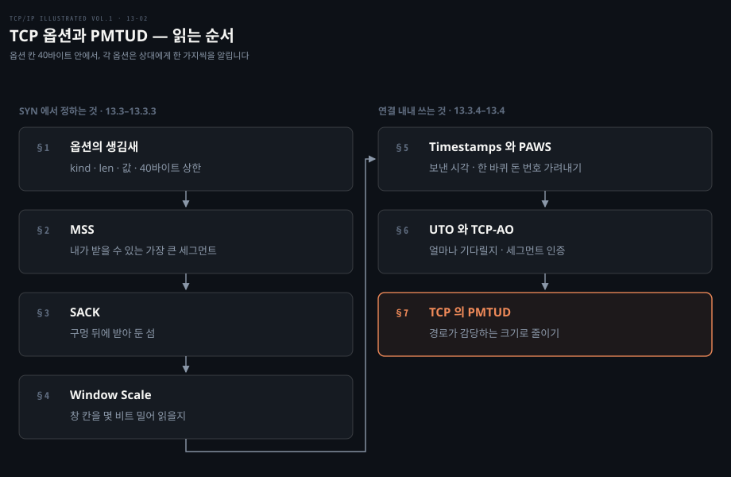
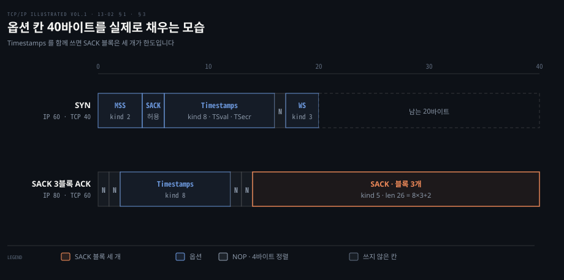
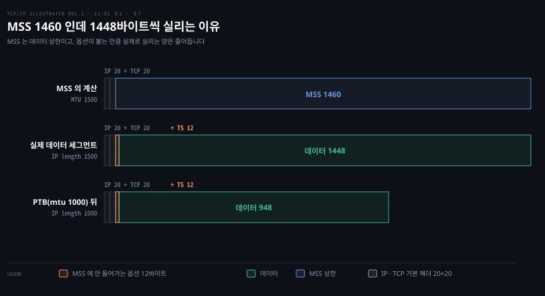
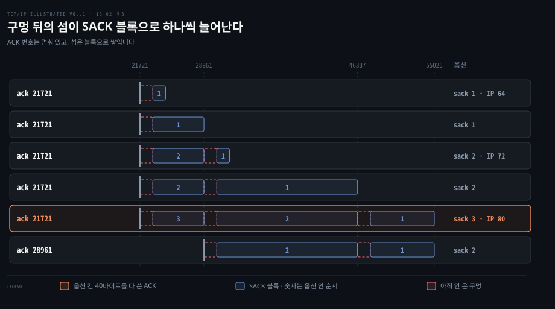
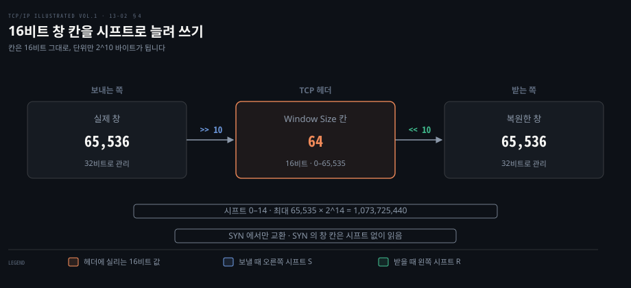
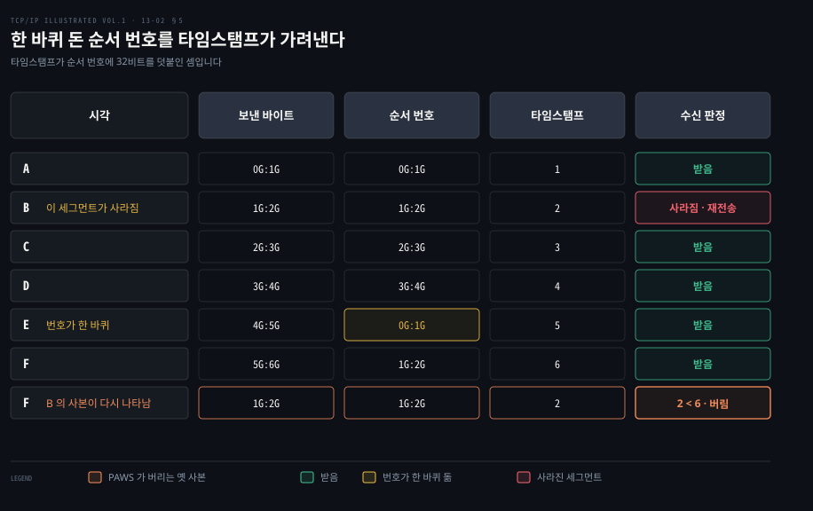
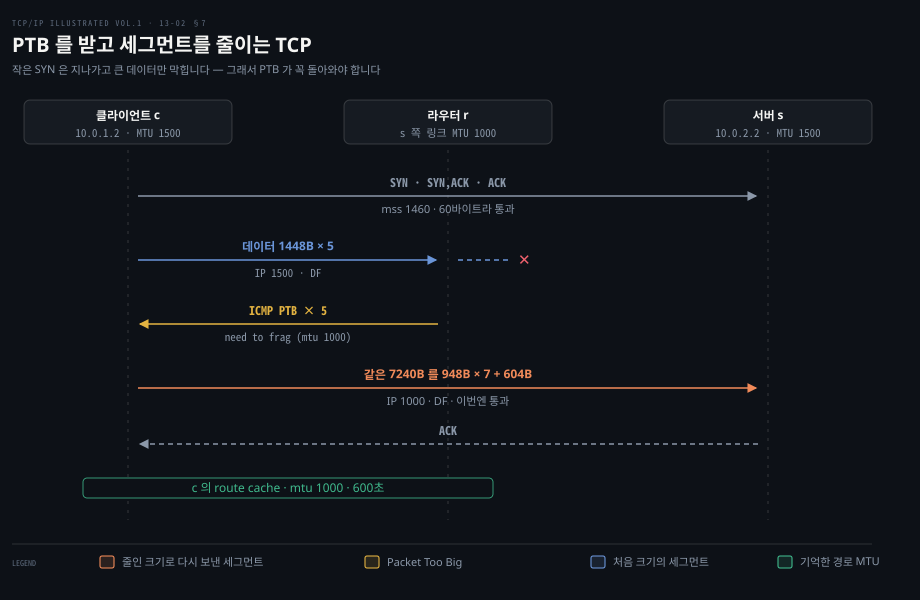

# TCP 옵션은 40바이트 안에서 능력과 한계를 알린다

---

> 13장 가운데 13.3·13.4 는 TCP 헤더의 옵션과, TCP 가 연결 도중 세그먼트 크기를 경로에 맞추는 Path MTU Discovery 를 다룹니다. 옵션 대부분은 SYN 에서 한 번 정해져 연결 내내 쓰이고 PMTUD 는 연결이 시작된 뒤 크기를 바꾸는 드문 장치입니다.

## 핵심 요약

> 이 편이 매달린 하나의 생각은, TCP 옵션이 40바이트라는 좁은 칸 안에서 양 끝이 서로의 능력과 한계를 알리는 자리라는 것입니다.

MSS 는 "이보다 큰 세그먼트는 받지 않는다" 는 한계를 알립니다. SACK 허용은 "구멍 뒤에 받아 둔 데이터를 따로 알려 줄 수 있다" 는 능력을, Window Scale 은 "창 칸을 몇 비트 밀어 읽어라" 는 약속을 알립니다. Timestamps 는 세그먼트마다 보낸 시각을 실어 RTT 표본을 늘리고 한 바퀴 돈 순서 번호를 가려내는 PAWS 의 근거가 됩니다.

이 옵션들은 같은 40바이트를 나눠 씁니다. 그래서 Timestamps 를 쓰면 SACK 블록은 세 개까지만 실리고 MSS 가 1460 이어도 실제로 실리는 데이터는 1448바이트가 됩니다. 이 편은 그 수를 리눅스가 실제로 보낸 세그먼트로 셉니다.

마지막 절의 PMTUD 는 성격이 다릅니다. 경로 중간의 링크가 작으면 라우터가 Packet Too Big 을 돌려보내고 TCP 는 같은 바이트를 더 작은 세그먼트로 다시 보냅니다. 그 ICMP 가 방화벽에 막히면 작은 SYN 은 지나가는데 큰 데이터만 멈추는 블랙홀이 생깁니다.


## 학습 목표

> 이 편을 읽고 나면 아래 다섯 가지를 스스로 해낼 수 있습니다.

1. 옵션의 kind·len 구조와 40바이트 상한을 설명하고 실제 SYN 의 옵션 칸을 바이트 단위로 셀 수 있습니다.
2. MSS 가 협상이 아니라 상한인 이유와, MSS 1460 인 연결에서 데이터가 1448바이트씩 실리는 이유를 설명할 수 있습니다.
3. Timestamps 와 함께 쓸 때 SACK 블록이 세 개로 제한되는 이유를 8n+2 식으로 계산할 수 있습니다.
4. Window Scale 의 시프트가 창 칸을 늘리는 방식과, Timestamps 가 PAWS 로 옛 세그먼트를 가려내는 방식을 설명할 수 있습니다.
5. TCP 의 PMTUD 가 Packet Too Big 으로 세그먼트를 줄이는 과정과, 그 메시지가 막혔을 때의 블랙홀·리눅스 `tcp_mtu_probing` 을 설명할 수 있습니다.

아래는 이 편의 절 일곱을 두 묶음으로 나눈 지도입니다. 왼쪽 열 §1~§4 는 SYN 에서 정하고 끝나는 옵션이고 오른쪽 열 §5~§7 은 연결 내내 쓰이거나 연결 도중 세그먼트 크기를 바꾸는 장치입니다.



강조한 §7 은 [네트워크 로드맵](../../../roadmap/network-roadmap.md) 2단계의 "MTU · MSS · PMTUD · PMTUD 블랙홀 · `tcp_mtu_probing`" 행을 받치는 자리입니다. 같은 현상을 손으로 고장 내 보는 실습은 [network-fundamentals-lab 06-01](../../project/network-fundamentals-lab/06-01.작은%20것은%20되고%20큰%20것만%20멎는다.md) 이 맡습니다.


## 1. 옵션은 kind·len·값으로 이어 붙는다

> 옵션은 1바이트 kind 로 시작하고 kind 0·1 을 뺀 나머지는 길이 바이트와 값이 뒤따릅니다. 모든 옵션이 40바이트 안에 들어가야 하고, 헤더 길이가 4바이트 단위라 NOP 로 자리를 맞춥니다.

### 원본 명세에는 옵션이 셋뿐이었습니다

[13-01 §2](./13-01.TCP%20연결은%20세%20세그먼트로%20열고%20네%20세그먼트로%20닫는다.md) 의 캡처에서 클라이언트 SYN 의 TCP 헤더는 최소 크기보다 24바이트 큰 44바이트였습니다. 그 24바이트에는 어떤 옵션이 들어 있고 받는 쪽은 처음 보는 옵션을 만나면 어디까지 건너뛰어야 할까요? 답하려면 어떤 옵션이 있는지와 옵션을 이어 붙이는 규칙을 먼저 알아야 합니다.

원문은 TCP 원본 명세가 정의한 옵션이 셋뿐이었다고 적습니다. 옵션 목록의 끝을 알리는 EOL, 아무 일도 하지 않는 NOP, 그리고 MSS 입니다. 그 뒤로 여러 옵션이 정의됐으며 전체 목록은 IANA 가 관리합니다. 원서의 Table 13-1 은 표준 트랙 RFC 가 있는 옵션을 모은 그림이라 텍스트로 옮겨지지 않았습니다. 그래서 같은 옵션을 IANA 등록부에서 다시 뽑아 아래 표로 옮겼습니다. 마지막 열은 리눅스 커널의 옵션 정의에 그 kind 가 있는지를 덧붙였습니다.[^iana-opt][^linux-opt]

| kind | 길이 | 이름 | 정의 | 리눅스 커널 |
|---|---|---|---|---|
| 0 | 1 | End of Option List | RFC 9293 | 있음 |
| 1 | 1 | No-Operation | RFC 9293 | 있음 |
| 2 | 4 | Maximum Segment Size | RFC 9293 | 있음 |
| 3 | 3 | Window Scale | RFC 7323 | 있음 |
| 4 | 2 | SACK Permitted | RFC 2018 | 있음 |
| 5 | 가변 | SACK | RFC 2018 | 있음 |
| 8 | 10 | Timestamps | RFC 7323 | 있음 |
| 28 | 4 | User Timeout | RFC 5482 | 없음 |
| 29 | 가변 | TCP Authentication Option | RFC 5925 | 있음 (6.7 부터) |

책이 나온 뒤에 정해진 옵션도 있습니다. kind 30 Multipath TCP(RFC 8684)와 kind 34 TCP Fast Open 쿠키(RFC 7413)가 그 예이고 원서 표에는 없습니다.

### kind 와 len 의 규칙

모든 옵션은 옵션 종류를 나타내는 1바이트 kind 로 시작합니다. 원문은 RFC 1122 에 따라 알아듣지 못한 옵션은 그냥 무시된다고 적습니다. kind 가 0 과 1 인 옵션은 한 바이트만 차지합니다. 나머지 옵션은 kind 다음에 len 바이트가 오고 이 길이는 kind 와 len 바이트를 포함한 전체 길이입니다.

NOP 가 있는 이유는 송신자가 필요할 때 칸을 4바이트 배수로 채우게 하려는 것입니다. TCP 헤더 길이 칸이 32비트 단위라 헤더 길이는 늘 4바이트의 배수여야 하기 때문입니다. EOL 은 옵션 목록이 끝났으니 더 처리하지 말라는 표시입니다.

### 실제 세그먼트 둘이 40바이트를 쓰는 모습

[12-01 §8](./12-01.TCP%20의%20신뢰성은%20재전송·번호·창으로%20만든다.md) 에서 본 것처럼 헤더 길이 칸이 4비트라 헤더는 60바이트까지입니다. 기본 20바이트를 뺀 40바이트가 옵션 칸입니다. 아래에 리눅스(OrbStack Ubuntu, 커널 7.0.14)가 실제로 보낸 세그먼트 둘의 옵션 칸을 바이트 폭에 비례해 그렸습니다. 윗줄은 연결을 여는 SYN 이고 아랫줄은 §3 에서 볼 SACK 블록 세 개를 실은 ACK 입니다.



SYN 의 tcpdump 출력은 `options [mss 1460,sackOK,TS val 4221125693 ecr 0,nop,wscale 10]` 이었고 IP 길이는 60바이트였습니다. MSS 4, SACK 허용 2, Timestamps 10, NOP 1, Window Scale 3 을 더하면 20바이트이고 20바이트 기본 헤더와 합쳐 TCP 헤더가 40바이트가 됩니다. Window Scale 3바이트 앞에 NOP 하나를 넣어 전체를 4의 배수로 맞춘 것이 보입니다.

원문이 13.2.4 에서 본 윈도 클라이언트의 SYN 은 헤더가 44바이트였으니 구현마다 SYN 에 싣는 옵션 조합이 조금씩 다릅니다. 원서 텍스트는 그 24바이트가 어떤 옵션으로 채워졌는지 적지 않으므로, 이 절은 같은 물음을 리눅스 SYN 으로 대신 답했습니다.


## 2. MSS 는 받을 수 있는 가장 큰 세그먼트를 알리는 상한이다

> MSS 는 상대에게서 받을 의향이 있는 가장 큰 세그먼트의 데이터 크기이고, 헤더는 세지 않습니다. 협상이 아니라 일방적인 상한이며, 옵션이 붙는 만큼 실제로 실리는 데이터는 MSS 보다 작아집니다.

### MSS 는 데이터만 셉니다

§1 의 SYN 이 맨 앞에 실은 옵션은 MSS 였습니다. 양 끝은 이 값을 보고 상대에게 보낼 세그먼트의 크기를 정합니다. 그렇다면 이 값은 헤더까지 센 크기일까요, 그리고 두 끝이 서로 맞춰 가는 협상일까요? 둘 다 실제로 한 세그먼트에 실리는 바이트 수를 바꾸는 물음입니다.

원문의 정의는 이렇습니다. 최대 세그먼트 크기(MSS)는 TCP 가 상대에게서 받을 의향이 있는 가장 큰 세그먼트이고 따라서 상대가 보낼 때 써야 하는 가장 큰 크기입니다. MSS 값은 TCP 데이터 바이트만 세고 TCP·IP 헤더 크기는 넣지 않습니다(RFC 879). 연결을 맺을 때 각 끝은 보통 SYN 에 실은 MSS 옵션으로 자기 MSS 를 알립니다. 값은 16비트로 적습니다.

MSS 옵션이 없으면 536바이트를 기본값으로 씁니다. 원문은 그 이유를 모든 호스트가 처리해야 하는 IPv4 데이터그램의 최소 크기 576 에서 찾습니다. 최소 크기의 IPv4·TCP 헤더로 536바이트를 보내면 20 + 20 + 536 = 576바이트 데이터그램이 됩니다.

### 1460 은 이더넷 1500 에서 나옵니다

원서 그림 13-5 의 MSS 는 모두 1460 이었고 원문은 이것이 IPv4 의 전형이라고 적습니다. IPv4 데이터그램은 TCP 헤더 20바이트와 IPv4 헤더 20바이트만큼 커서 1500바이트가 됩니다. 이것이 이더넷의 전형적인 MTU 이자 인터넷의 전형적인 경로 MTU 입니다. IPv6 에서는 헤더가 더 커서 MSS 가 보통 20바이트 작은 1440 입니다. IPv6 점보그램에는 특수값 65535 를 써서 MSS 가 무한대라는 뜻을 나타냅니다. 이때 실제 송신 MSS 는 경로 MTU 에서 60바이트(IPv6 헤더 40 + TCP 헤더 20)를 뺀 값입니다.

원문은 MSS 옵션이 양 끝 사이의 협상이 아니라 한계라는 점을 강조합니다. 한쪽이 MSS 옵션을 주는 것은 그 연결이 이어지는 동안 그보다 큰 세그먼트는 받지 않겠다는 뜻입니다. 양쪽이 서로 다른 값을 알려도 맞춰 가는 절차는 없고 각자 상대가 알린 값을 넘지 않을 뿐입니다.

### MSS 1460 인데 1448바이트씩 실립니다

MSS 가 데이터만 센다는 정의에는 실무에서 자주 헷갈리는 결과가 하나 따라옵니다. §7 의 실험에서 양 끝은 MSS 1460 을 주고받았는데 실제 데이터 세그먼트는 1448바이트씩 실렸습니다. IP 길이는 정확히 1500이었습니다.



차이 12바이트는 Timestamps 옵션입니다. 이 연결의 데이터 세그먼트는 `options [nop,nop,TS val … ecr …]` 를 실었습니다. 옵션 10바이트에 정렬용 NOP 2바이트를 더하면 12바이트입니다. MSS 계산은 IP·TCP 기본 헤더 40바이트만 빼므로 옵션이 붙으면 그만큼 데이터 자리가 줄어듭니다. 1500 − 20 − 20 − 12 = 1448 입니다. §7 에서 경로 MTU 가 1000 으로 줄었을 때 948바이트가 실린 것도 같은 계산입니다. 이 해석은 원문이 아니라 캡처 수치에서 노트가 계산한 것입니다.


## 3. SACK 은 구멍 뒤에 받아 둔 섬을 알린다

> 누적 ACK 는 순서대로 받은 끝까지만 말할 수 있어서, SACK 옵션이 구멍 뒤에 받아 둔 블록을 따로 알립니다. 블록 하나가 8바이트라 Timestamps 와 함께 쓰면 한 세그먼트에 세 개까지만 들어갑니다.

### 누적 ACK 는 이어지지 않은 데이터를 확인하지 못합니다

[12-01 §7](./12-01.TCP%20의%20신뢰성은%20재전송·번호·창으로%20만든다.md) 에서 본 것처럼 TCP 는 누적 ACK 를 씁니다. 그래서 잘 받았지만 앞서 받은 데이터와 순서 번호가 이어지지 않는 데이터는 확인할 수 없습니다. 이럴 때 수신자의 받은 데이터 큐에 구멍(hole)이 있다고 말합니다. 바이트 스트림 추상 때문에 수신 TCP 는 애플리케이션이 구멍 너머의 데이터를 읽지 못하게 막습니다. 구멍과 그 뒤의 섬을 바이트 축에 그린 도식은 12-01 §7 에 있습니다.

송신자가 수신자 쪽 구멍과 그 너머에 받아 둔 블록을 알 수 있다면 세그먼트가 사라졌을 때 어느 세그먼트를 다시 보낼지 더 잘 고를 수 있습니다. TCP 의 선택 확인(SACK) 옵션(RFC 2018·2883)이 그 능력을 줍니다. 다만 원문은 송신자 쪽 논리가 SACK 정보를 잘 활용할 때에만 이 방식이 효과를 낸다고 단서를 답니다.

### SACK 허용은 SYN 에서, 블록은 아무 세그먼트에서

TCP 는 SYN(또는 SYN + ACK)에서 SACK-Permitted 옵션을 받으면 상대가 SACK 정보를 보낼 수 있다는 것을 압니다. 그 뒤로 순서 밖의 데이터를 받은 TCP 는 그 데이터를 설명하는 SACK 옵션을 보내 상대의 재전송을 돕습니다. SACK 옵션에는 순서 번호 범위들이 담기고 각 범위는 수신자가 잘 받은 데이터 블록을 나타냅니다. 범위 하나를 SACK 블록이라 부르며 32비트 순서 번호 한 쌍으로 나타냅니다.

그래서 블록 n 개를 실은 SACK 옵션은 8n + 2 바이트이며 2바이트는 옵션의 kind 와 길이입니다. 원문은 옵션 칸이 좁아서 한 세그먼트에 보낼 수 있는 SACK 블록이 최대 셋이라고 적습니다. 이 수는 현대 구현에서 흔한 Timestamps 를 함께 쓴다는 가정 위의 값입니다. SACK-Permitted 옵션은 SYN 에만 실리지만 SACK 블록 자체는 그 뒤 아무 세그먼트에나 실릴 수 있습니다.

셋이라는 수는 직접 계산해 볼 수 있습니다. 40바이트에서 Timestamps 10바이트와 정렬용 NOP 2바이트를 빼면 28바이트가 남고 다시 SACK 앞 정렬용 NOP 2바이트를 빼면 26바이트입니다. 8n + 2 ≤ 26 을 만족하는 가장 큰 n 이 3 입니다. Timestamps 가 없으면 NOP 2바이트를 뺀 38바이트에 8n + 2 ≤ 38 이 되어 넷까지 들어갑니다. 이 계산은 원문이 아니라 노트가 한 것입니다.

### 실제로 블록이 하나씩 늘어나는 모습

원문은 SACK 의 동작을 14·16장으로 미룹니다. 그래서 수신 쪽에서 데이터 세그먼트를 약 4% 버리게 한 링크(OrbStack Ubuntu, 네트워크 네임스페이스 둘)로 400KB 를 보내며 수신자가 돌려보내는 ACK 를 떠 보았습니다. 순서 번호는 tcpdump 의 상대값이고 옵션 앞부분은 줄였습니다.

```bash
ack 21721, … nop,nop,sack 1 {23169:24617}                            # IP 64
ack 21721, … nop,nop,sack 1 {23169:28961}
ack 21721, … nop,nop,sack 2 {30409:31857}{23169:28961}               # IP 72
ack 21721, … nop,nop,sack 2 {30409:46337}{23169:28961}
ack 21721, … nop,nop,sack 3 {47785:55025}{30409:46337}{23169:28961}  # IP 80
ack 28961, … nop,nop,sack 2 {47785:55025}{30409:46337}
```



위 캡처 여섯 줄을 바이트 축에 옮긴 그림입니다. 가로축은 순서 번호이고 행은 위에서 아래로 ACK 가 나간 순서입니다. 각 행의 세로 막대가 ACK 번호, 파란 막대가 SACK 블록, 붉은 점선이 아직 오지 않은 구멍입니다. 막대 안 숫자는 그 블록이 옵션 안에서 몇 번째로 실렸는지를 가리킵니다. 블록 하나의 두 경계가 각각 무엇을 가리키는지는 [14-02 §3](./14-02.손실은%20타이머보다%20ACK%20와%20SACK%20으로%20빨리%20찾는다.md) 의 도식이 원서 14장의 값으로 따로 그립니다.

ACK 번호는 21721 에서 멈춰 있습니다. 21721 부터 23168 까지의 세그먼트가 사라졌기 때문입니다. 그 사이 수신자는 구멍 뒤에 받은 섬을 블록으로 하나씩 늘려 알립니다. 블록이 하나 늘 때마다 IP 길이가 64 → 72 → 80 으로 8바이트씩 커집니다. 8n + 2 의 8n 이 눈에 보이는 장면입니다. 세 블록을 실은 ACK 는 IP 80바이트, 곧 TCP 헤더 60바이트로 옵션 칸을 다 썼습니다(§1 도식의 아랫줄).

가장 최근에 받은 블록이 맨 앞에 옵니다. RFC 2018 은 첫 SACK 블록이 이 ACK 를 일으킨 세그먼트를 담은 블록이어야 한다고 정합니다. 나머지 자리는 앞서 알린 블록을 되풀이해 채우라고 권합니다.[^rfc2018] 마지막 줄에서 재전송된 세그먼트가 구멍을 메우자 ACK 번호가 28961 로 뛰었고 이제 구멍 앞이 된 블록 {23169:28961} 이 목록에서 빠졌습니다.

### 같은 장면을 다시 떠 보면 블록 둘까지 나옵니다

위 캡처는 원 캡처 파일과 netem 설정이 남아 있지 않습니다. 그래서 2026-10-05 같은 커널(7.0.14)에서 조건을 적어 두고 다시 떴습니다. 두 veth 의 TSO·GSO·GRO 를 끄고 송신 쪽에 `netem delay 20ms rate 20mbit loss 4%` 를 건 뒤 400KB 를 보냈습니다. 오프로드를 켜 두면 세그먼트가 큰 덩어리로 묶여 ACK 하나가 여러 세그먼트를 한꺼번에 확인했습니다. 대역 제한을 걸지 않으면 손실이 한 덩어리 구멍으로 몰렸습니다.

```bash
ack 251233, … sack 1 {252681:254129}                  # IP 64
ack 251233, … sack 2 {257025:258473}{252681:255577}   # IP 72
ack 251233, … sack 2 {257025:264265}{252681:255577}
ack 255577, … sack 1 {257025:264265}                  # IP 64
ack 264265, …                                         # IP 52
```

열네 줄 가운데 다섯 줄만 골랐습니다. ACK 번호가 머무는 동안 블록이 늘고 IP 길이가 8바이트씩 커지는 모습이 위 캡처와 같습니다. 새 블록이 앞에 오는 것도, 구멍이 메워지면 앞 블록이 빠지는 것도 같습니다. 블록 셋(IP 80)을 실은 ACK 는 다섯 번 떠서 한 번도 나오지 않았습니다. 한 창 안에 구멍 셋이 동시에 열려야 하므로 이 조건에서는 드문 장면으로 보입니다.


## 4. Window Scale 은 16비트 창 칸을 시프트로 늘린다

> Window Scale 옵션은 칸 크기를 바꾸지 않고 읽는 법만 바꿉니다. 받은 16비트 값을 시프트 수만큼 왼쪽으로 밀어 실제 창으로 읽으며, 시프트는 SYN 에서 한 번 정해집니다.

### 칸은 그대로 두고 배율을 정합니다

[12-01 §4](./12-01.TCP%20의%20신뢰성은%20재전송·번호·창으로%20만든다.md) 에서 계산했듯 16비트 창 칸은 65,535바이트가 상한이라 RTT 가 긴 경로에서는 링크를 다 쓰지 못합니다. 원문은 Window Scale 옵션(WSCALE 또는 WSOPT)이 TCP 창 광고 칸의 용량을 16비트에서 약 30비트로 늘린다고 소개합니다. 칸 크기를 바꾸는 대신 헤더에는 여전히 16비트 값을 담고 그 값에 배율을 적용하는 옵션을 정의한 것입니다.

배율은 창 칸 값을 시프트 수 s 만큼 왼쪽으로 미는 것, 곧 2^s 를 곱하는 것입니다. 1바이트 시프트 수는 0 부터 14 까지이고 0 은 배율 없음입니다. 최대값 14 이면 최대 창은 65,535 × 2^14 = 1,073,725,440바이트로, 2^30 − 1 = 1,073,741,823 에 가까운 약 1GB 입니다. TCP 는 내부에서 실제 창을 32비트 값으로 관리합니다.

### SYN 에서만, 양쪽이 다 보내야 켜집니다

이 옵션은 SYN 세그먼트에만 실릴 수 있으므로 시프트 수는 연결을 맺을 때 방향마다 고정됩니다. 창 배율을 켜려면 양 끝이 모두 SYN 에 이 옵션을 보내야 합니다. 능동 열기를 하는 쪽은 자기 SYN 에 싣고 수동 열기를 하는 쪽은 받은 SYN 에 이 옵션이 있을 때만 실을 수 있습니다. 방향마다 시프트 수가 달라도 됩니다. 능동 열기 쪽이 0 이 아닌 시프트를 보냈는데 상대에게서 이 옵션을 받지 못하면 보내기·받기 시프트를 모두 0 으로 둡니다. 이 옵션을 모르는 시스템과도 함께 동작하게 하려는 규칙입니다.

보내기 시프트를 S, 받기 시프트를 R 이라 하면 동작은 대칭입니다. 상대에게서 받은 16비트 창 광고는 R 비트 왼쪽으로 밀어 실제 광고 창을 얻습니다. 상대에게 창을 광고할 때는 32비트 실제 창을 S 비트 오른쪽으로 밀어 16비트 값을 헤더에 넣습니다.



[12-01 §8](./12-01.TCP%20의%20신뢰성은%20재전송·번호·창으로%20만든다.md) 의 루프백 캡처가 이 모습이었습니다. 양쪽 SYN 이 `wscale 10` 을 실었고 이후 세그먼트의 `win 64` 는 64 × 2^10 = 65,536바이트를 뜻합니다. RFC 7323 이 SYN 의 창 칸에는 배율을 적용하지 않는다고 정하므로 SYN 에 적힌 `win 65495` 는 그대로 읽습니다.

원문은 시프트 수를 TCP 가 수신 버퍼 크기에 따라 자동으로 고른다고 적습니다. 버퍼 크기는 시스템이 정하지만 보통 애플리케이션이 바꿀 수 있습니다. 이 옵션은 대역폭-지연 곱이 큰 망에서 대량 전송을 할 때 가장 의미가 큽니다. 원문은 그 쓰임을 뒷장으로 미룹니다. 책이 근거로 든 RFC 1323 은 2014년 RFC 7323 으로 대체됐습니다.[^rfc7323]


## 5. Timestamps 는 RTT 표본과 PAWS 를 준다

> Timestamps 옵션은 세그먼트마다 보낸 시각을 싣고 상대가 그 값을 되돌려 보내게 해서, ACK 마다 RTT 를 잴 수 있게 합니다. 같은 값이 순서 번호를 32비트 늘린 것처럼 쓰여, 한 바퀴 돈 순서 번호의 옛 세그먼트를 가려냅니다.

### 보낸 값을 그대로 되돌려 받아 RTT 를 잽니다

Timestamps 옵션은 송신자가 모든 세그먼트에 4바이트 타임스탬프 값 둘을 싣게 합니다. 원문은 TSOPT 또는 TSopt 라고도 적습니다. 송신자는 첫 칸인 Timestamp Value 에 32비트 값을 넣고 이 칸을 TSval 이라 부릅니다. 수신자는 그 값을 둘째 칸인 Timestamp Echo Reply, 곧 TSecr 에 바꾸지 않고 되돌려 줍니다. 그러면 송신자는 받은 ACK 마다 RTT 추정값을 계산할 수 있습니다.

원문은 TCP 가 ACK 하나로 여러 세그먼트를 확인하는 일이 잦아 "세그먼트마다" 가 아니라 "받은 ACK 마다" 라고 말해야 한다고 짚습니다. 이 옵션이 들어간 헤더는 타임스탬프 8바이트와 kind·len 2바이트를 합쳐 10바이트 커집니다.

타임스탬프는 단조 증가하는 값입니다. 수신자는 받은 값을 되돌릴 뿐이라 그 단위나 값이 무엇인지 상관하지 않고 두 호스트 사이에 시계 동기화도 필요 없습니다. RFC 1323 은 송신자가 타임스탬프를 적어도 1초에 1 씩 올리라고 권합니다.

원서 그림 13-6 의 캡처에서 클라이언트의 SYN 은 TSval 81813090 을 싣고 아직 서버의 값을 모르므로 TSecr 은 0 입니다. 둘째 세그먼트는 그 값을 클라이언트에게 되돌려 주면서 자기 값 349742014 를 싣습니다. 그 연결의 TCP 헤더는 44바이트였습니다.

RTT 를 잘 추정하려는 주된 이유는 재전송 타임아웃을 정하는 것입니다. 원문은 Timestamps 옵션이 생기기 전에는 대부분의 TCP 가 데이터 창 하나에 RTT 표본을 하나만 뽑았는데 이 옵션으로 더 많은 표본을 얻어 더 나은 추정을 할 수 있게 됐다고 적습니다. 그 쓰임은 14장이 자세히 다룹니다.

지금의 리눅스는 이 값을 연결마다 무작위 오프셋으로 시작합니다. 커널 문서는 `tcp_timestamps` 기본값 1 이 "현재 시각만 쓰는 대신 연결마다 무작위 오프셋을 쓴다" 는 뜻이라고 적습니다.[^ip-sysctl] 이 노트의 캡처들에서 TSval 이 4221125693, 2153310588 처럼 연결마다 동떨어진 값으로 시작한 것이 그 결과입니다.

### 한 바퀴 돈 순서 번호를 PAWS 가 가려냅니다

원문은 Timestamps 의 둘째 쓰임으로 Protection Against Wrapped Sequence Numbers(PAWS)를 듭니다. 수신자가 옛 세그먼트를 유효한 것으로 받아들이지 않게 하는 장치입니다. 상황은 이렇습니다. Window Scale 로 가장 큰 창인 약 1GB 를 쓰는 연결이 Timestamps 도 쓰고 송신자가 창 하나를 보낼 때마다 타임스탬프를 1 씩 올린다고 합시다. 원문은 실제로는 이보다 빨리 올라가므로 보수적인 가정이라고 덧붙입니다. 이 연결로 6GB 를 보내면 32비트 순서 번호가 4G 에서 0 으로 돌아가는 일이 생깁니다.

원서 Table 13-2 는 이 흐름을 표로 보이지만 그림이라 값이 텍스트에 없습니다. 아래는 원문 서술로 재구성한 표입니다. 원문의 서술은 셋입니다. 시각 B 에 세그먼트 하나가 사라져 재전송됩니다. 순서 번호는 D 와 E 사이에서 한 바퀴 돕니다. 사라졌던 세그먼트가 F 에 다시 나타납니다. G 는 1,073,741,824 이고 J:K 는 바이트 J 부터 K − 1 까지입니다.



F 에 다시 나타난 B 의 세그먼트는 순서 번호 1G:2G 로 F 에 새로 보낸 데이터와 같은 번호를 갖습니다. 순서 번호만 보는 수신자는 둘을 구분하지 못합니다. 원문은 수신자가 타임스탬프를 순서 번호의 32비트 확장으로 본다고 설명합니다. 다시 나타난 세그먼트의 타임스탬프 2 는 가장 최근의 유효한 타임스탬프(5 또는 6)보다 작으므로 PAWS 알고리즘이 버립니다. PAWS 는 송신자와 수신자 사이의 시간 동기화를 요구하지 않고 타임스탬프가 단조 증가하며 데이터 창 하나마다 적어도 1 씩 오르기만 하면 됩니다.

이 일이 가능하려면 사라진 세그먼트가 다시 나타나기까지의 시간이 세그먼트가 망에서 살 수 있는 최대 시간(MSL)보다 짧아야 합니다. 그렇지 않으면 TTL 이 다해 어떤 라우터가 그 세그먼트를 버렸을 것입니다. 원문은 그래서 이 문제가 비교적 빠른 연결에서만 나타난다고 말합니다. 숫자로 보면 2^32 바이트는 1Gbit/s 로 약 34초, 10Gbit/s 로 약 3.4초에 다 써 버립니다. 두 경우 모두 [13-01 §5](./13-01.TCP%20연결은%20세%20세그먼트로%20열고%20네%20세그먼트로%20닫는다.md) 에서 본 리눅스 주석의 MSL 2분보다 짧으니 고속 망에서는 같은 연결 안에서도 번호가 겹칠 수 있습니다. 이 계산은 원문 밖에서 노트가 한 것입니다.


## 6. UTO 와 TCP-AO 는 책이 쓰일 때 아직 드물었다

> User Timeout 옵션은 "얼마나 기다리다 연결을 포기할지" 를 상대에게 알리고, TCP-AO 는 공유한 비밀 키로 세그먼트마다 인증값을 붙입니다. 원문은 둘 다 아직 널리 쓰이지 않는다고 적었고, 지금 리눅스는 TCP-AO 만 구현합니다.

### UTO 는 포기 시점을 알리는 권고입니다

User Timeout 옵션은 RFC 5482 가 정의했고 원문은 비교적 새로운 기능이라고 소개하며 UTO 라 줄여 부릅니다. UTO 값은 USER_TIMEOUT 이라고도 부릅니다. 이 값은 송신 TCP 가 보낸 데이터의 ACK 를 얼마나 기다린 뒤 상대가 고장 났다고 결론 내릴지를 정합니다. USER_TIMEOUT 은 RFC 793 이래 전통적으로 TCP 의 로컬 설정이었습니다. UTO 옵션은 이 값을 연결 상대에게 알리게 합니다. 그러면 받는 TCP 가 동작을 조정할 수 있습니다.

예를 들어 연결을 끊기 전에 연결이 끊긴 상태를 더 오래 참을 수 있습니다. 원문은 NAT 장비도 이 정보를 연결 활동 타이머를 정하는 데 쓸 수 있다고 덧붙입니다.

UTO 값은 권고일 뿐입니다. 한쪽이 큰 값이나 작은 값을 원한다고 상대가 따라야 하는 것은 아닙니다. 원문은 RFC 1122 가 USER_TIMEOUT 의 정의를 다듬어 재전송이 문턱 R1(세 번)에 이르면 요청한 애플리케이션에 알리고 100초(R2) 뒤에는 연결을 닫으라고 권한다고 적습니다. 긴 UTO 는 자원 고갈을, 짧은 UTO 는 연결이 일찍 끊기는 일종의 DoS 공격을 부를 수 있어서 값에 상한과 하한을 둡니다.

```bash
USER_TIMEOUT = min(U_LIMIT, max(ADV_UTO, REMOTE_UTO, L_LIMIT))
```

ADV_UTO 는 상대에게 알린 UTO, REMOTE_UTO 는 상대가 알린 UTO, U_LIMIT 와 L_LIMIT 는 로컬 시스템의 상한과 하한입니다. 원문은 이 식이 연결 양 끝에서 같은 값을 보장하지 않는다는 점, L_LIMIT 가 그 연결의 RTO 보다 커야 하며 RFC 1122 와의 호환을 위해 100초가 권장된다는 점을 짚습니다. UTO 옵션은 연결을 맺을 때의 SYN, 첫 비-SYN 세그먼트, 그리고 USER_TIMEOUT 이 바뀔 때마다 실립니다. 값은 15비트이고 앞의 granularity 비트가 1 이면 분 단위, 0 이면 초 단위입니다.

원문은 이 옵션이 아직 널리 배포되지 않았다고 적었습니다. 지금도 리눅스 커널의 TCP 옵션 정의에는 kind 28 이 없습니다.[^linux-opt] 리눅스에 있는 것은 같은 이름의 소켓 옵션 `TCP_USER_TIMEOUT` 입니다. 이 옵션은 보낸 데이터가 확인되지 않은 채 머물 수 있는 최대 시간을 밀리초로 정합니다. 그 시간을 넘으면 연결을 강제로 닫고 `ETIMEDOUT` 을 돌려줍니다.[^tcp-man] 로컬의 USER_TIMEOUT 만 바꾸고 상대에게 알리지는 않는 셈입니다.

### TCP-AO 는 세그먼트마다 인증값을 붙입니다

원문이 소개하는 TCP Authentication Option(TCP-AO, RFC 5925)은 TCP 연결의 보안을 높이려는 옵션으로, 앞선 장치인 TCP-MD5(RFC 2385)를 개선해 대체하려고 설계됐습니다. 암호학적 해시 알고리즘에 연결 양 끝만 아는 비밀값을 함께 써서 세그먼트마다 인증합니다. TCP-MD5 보다 나은 점은 여러 암호 알고리즘을 지원하고 키가 바뀌는 것을 대역 안 신호로 알린다는 것입니다. 다만 종합적인 키 관리는 하지 않으므로 양 끝은 동작 전에 공유 키 집합을 세울 방법을 따로 마련해야 합니다.

보낼 때 TCP 는 공유 비밀 키에서 트래픽 키를 끌어내고 정해진 알고리즘(RFC 5926)으로 해시값을 계산합니다. 같은 비밀 키를 가진 수신자도 트래픽 키를 끌어내 도착한 세그먼트가 오는 길에 바뀌지 않았는지 높은 확률로 확인합니다. 원문은 이것을 여러 TCP 위조 공격에 대한 강한 대책으로 보면서도 공유 키를 만들고 나눠야 하고 비교적 새로운 옵션이라 아직 널리 배포되지 않았다고 적습니다. 리눅스는 2023년 말 커널 6.7 에서 TCP-AO 를 받아들였고 커널 문서에 그 구현 설명이 따로 있습니다.[^tcp-ao]


## 7. TCP 의 PMTUD 는 Packet Too Big 을 받아 세그먼트를 줄인다

> TCP 는 연결 내내 DF 를 켠 데이터그램을 보내다가, 경로 중간에서 Packet Too Big 이 돌아오면 그 MTU 에 맞춰 세그먼트를 줄여 다시 보냅니다. 그 메시지가 막히면 작은 SYN 은 지나가고 큰 데이터만 멈추는 블랙홀이 생깁니다.

### 크기를 정하는 쪽이 TCP 라서 할 수 있는 일

경로 MTU 는 두 호스트 사이 경로에 있는 링크들의 MTU 가운데 가장 작은 값입니다. 이 값을 알면 TCP 같은 프로토콜이 단편화를 피할 수 있습니다. 원문은 10장에서 ICMP 메시지로 경로 MTU 를 찾는 방법(PMTUD)을 봤지만 UDP 는 데이터그램 크기를 애플리케이션이 정하므로 보통 크기를 맞춰 바꾸지 못한다고 상기시킵니다. 반면 TCP 는 바이트 스트림을 구현하면서 세그먼트 크기를 스스로 정합니다. 그래서 결국 만들어지는 IP 데이터그램의 크기를 훨씬 많이 통제할 수 있습니다.

원문의 설명은 TCP/IPv4 와 TCP/IPv6 에 함께 적용되며 근거는 각각 RFC 1191 과 RFC 1981 입니다. ICMP 를 쓰지 않는 방법도 TCP 가 쓸 수 있습니다. Packetization Layer Path MTU Discovery, 줄여서 PLPMTUD 이고 RFC 4821 이 정의합니다. 원문은 ICMPv4 의 Destination Unreachable(Fragmentation Required)과 ICMPv6 의 Packet Too Big 을 함께 PTB 라 부릅니다. 이 노트도 그 말을 따릅니다.

### 정상 절차는 세 걸음입니다

TCP 의 정상적인 PMTUD 는 이렇게 진행됩니다.

1. 연결을 맺을 때 나가는 인터페이스의 MTU 와 상대가 알린 MSS 가운데 작은 쪽을 바탕으로 송신 MSS(SMSS)를 고릅니다. PMTUD 가 상대가 알린 MSS 를 넘게 해 주지는 않습니다. 목적지마다 경로 MTU 정보를 저장해 두고 크기를 고르는 데 쓸 수도 있습니다. 연결의 두 방향은 경로 MTU 가 다를 수 있습니다.
2. 처음 SMSS 를 고른 뒤로 그 연결에서 보내는 모든 IPv4 데이터그램에 DF 비트를 켭니다. IPv6 에는 DF 비트가 없고 모든 데이터그램이 DF 를 켠 것으로 간주됩니다. PTB 를 받으면 세그먼트 크기를 줄여 다시 보냅니다. PTB 에 다음 홉 MTU 가 있으면 그 값에서 IP·TCP 헤더 크기를 뺀 값을 쓰고 없으면 이진 탐색 같은 방법으로 여러 값을 시도합니다. 원문은 이것이 혼잡 제어에도 영향을 준다고 덧붙입니다.
3. 경로는 바뀔 수 있으므로 마지막으로 줄인 뒤 시간이 지나면 처음 SMSS 까지 더 큰 값을 다시 시도합니다. RFC 1191·1981 은 그 간격을 약 10분으로 권합니다.

PLPMTUD 도 비슷하지만 PTB 를 쓰지 않습니다. 대신 PMTUD 를 하는 프로토콜이 메시지가 버려진 것을 빨리 알아채고 스스로 크기를 고쳐야 합니다.

### 원서의 실험을 비대칭 MTU 로 재현했습니다

원문의 예는 PPPoE 로 DSL 에 붙은 리눅스 라우터입니다. PPPoE 링크의 MTU 는 이더넷 1500 에서 PPPoE 6바이트와 PPP 2바이트를 뺀 1492 입니다. 원문은 PMTUD 를 보이려고 이를 288 까지 줄입니다. 리눅스는 작은 MTU 공격을 막으려 최소 경로 MTU 를 기본 552 로 묶으므로 클라이언트에서 `net.ipv4.route.min_pmtu` 를 68 로 낮춰야 했다고 적습니다.

원서 Listing 13-2 의 요점은 비대칭입니다. 원격 쪽의 첫 패킷은 588바이트인데도 라우터를 한 번에 지나갑니다. 로컬 쪽 PPPoE 링크만 MTU 288 이고 원격 쪽은 더 큰 SMSS(아마 1492)를 쓰기 때문입니다. 반면 로컬이 DF 를 켠 588바이트 패킷을 보내자 라우터(10.0.0.1)가 다음 홉 MTU 288 을 담은 PTB 를 돌려보냈습니다. TCP 는 다음 패킷을 288바이트로 보낸 뒤 나머지를 288·116바이트 둘로 나눠 보냈습니다.

같은 구성을 OrbStack Ubuntu(커널 7.0.14)의 네트워크 네임스페이스 셋으로 만들었습니다. 클라이언트 c 와 서버 s 사이에 라우터 r 을 두고 r 의 s 쪽 링크만 MTU 를 1000 으로 줄였습니다. 기본 `min_pmtu` 552 위에서 실험하려고 원서의 288 대신 1000 을 썼습니다. 캡처가 GSO 로 뭉치지 않도록 오프로딩을 껐습니다.

```bash
sudo ip -n r link set r1 mtu 1000          # 라우터의 s 쪽 링크만 작게
sudo ip netns exec c python3 pm_cli.py     # c → s 로 20,000바이트 업로드
sudo ip netns exec c ip route get 10.0.2.2 # 전송 뒤 라우트 캐시 확인
```

c 에서 뜬 캡처를 요약하면 이렇습니다(tcpdump `-v`, 순서 번호는 상대값).

```bash
c→s [S]  IP 60   mss 1460 · DF
s→c [S.] IP 60   mss 1460
c→s [.]  IP 1500 seq 1:1449 … 5793:7241   (1448B × 5, DF)
r→c ICMP 10.0.2.2 unreachable - need to frag (mtu 1000)   × 5
c→s [.]  IP 1000 seq 1:949 … 5689:6637    (948B × 7)
c→s [P.] IP 656  seq 6637:7241            (604B)
# ip route get 10.0.2.2 → cache expires 597sec mtu 1000
```



순서는 원서와 같습니다. 양 끝은 MSS 1460 을 주고받고 1500바이트 세그먼트를 보내지만 라우터는 그것을 넘기지 못하고 PTB(mtu 1000)로 답합니다. TCP 는 PTB 가 가리킨 세그먼트들의 7,240바이트를 948바이트 일곱 개와 604바이트 하나로 다시 보냈습니다. §2 에서 계산한 대로 1000 − 20 − 20 − 12 = 948 입니다.

전송 뒤 c 의 라우트 캐시에는 `mtu 1000` 이 남았고 597초 뒤 만료된다고 나왔습니다. 리눅스의 `net.ipv4.route.mtu_expires` 기본값 600초가 RFC 1191 의 "약 10분" 권고와 맞습니다. 원문은 PMTUD 가 큰 데이터를 옮기는 동안 연결이 시작된 뒤 TCP 가 세그먼트 크기를 명시적으로 바꾸려 하는 거의 유일한 방법이라고 적고 세그먼트 크기가 처리량에 주는 영향은 15장으로 미룹니다.

### PTB 가 막히면 블랙홀이 생깁니다

원문은 PTB 메시지를 막는 방화벽이 있는 인터넷 환경에서 PMTUD 에 여러 문제가 생긴다고 적고(RFC 2923), 그중 블랙홀이 가장 골치 아팠다고 말합니다. 다만 상황은 나아지고 있어 원문이 인용한 연구에서는 조사한 시스템의 80% 가 PTB 를 제대로 처리했습니다.

PMTUD 블랙홀은 세그먼트 크기를 조정하려고 ICMP 메시지에 기대는 TCP 구현이 그 메시지를 끝내 받지 못할 때 생깁니다. 방화벽이나 NAT 설정이 그런 ICMP 를 전달하지 않는 것이 흔한 이유입니다. 결과는 큰 패킷을 쓰기 시작한 순간 더 나아가지 못하는 TCP 연결입니다. 원문은 이것을 진단하기 어려운 이유도 짚습니다. 큰 패킷만 전달되지 않고 연결을 맺는 SYN·SYN + ACK 같은 작은 패킷은 대개 성공하기 때문입니다.

원문은 일부 TCP 구현이 "블랙홀 감지" 를 갖췄다고 적습니다. 이 기능은 세그먼트가 여러 번 재전송되면 더 작은 세그먼트 크기를 시도합니다. 리눅스에서 이 일을 맡는 것이 원문 밖의 `net.ipv4.tcp_mtu_probing` 입니다.[^ip-sysctl]

- 0: 끔
- 1: 평소에는 끄고, ICMP 블랙홀을 감지하면 켬
- 2: 늘 켜고, 처음 MSS 로 `tcp_base_mss` 를 씀

실험한 커널의 기본값은 0 이었고 `tcp_base_mss` 는 1024 였습니다. 이 기능은 PTB 없이 크기를 찾는다는 점에서 위의 PLPMTUD(RFC 4821)를 구현합니다. 커널 문서도 이 항목을 "Packetization-Layer Path MTU Discovery" 를 제어하는 설정으로 소개합니다.

### 블랙홀을 직접 만들고 tcp_mtu_probing 으로 빠져나왔습니다

위 실험 구성에서 라우터 r 이 ICMP destination-unreachable 을 내보내지 못하게 nftables 로 막고 같은 20,000바이트 업로드를 `tcp_mtu_probing` 0 과 1 로 한 번씩 돌렸습니다. 캡처는 c 에서 떴습니다.

```bash
sudo ip netns exec r nft add rule inet bh out icmp type destination-unreachable drop
```

| 경과 | 값 0 (끔) | 값 1 (블랙홀 감지 때 켬) |
|---|---|---|
| 0초 | 1500바이트 세그먼트 11개 | 1500바이트 세그먼트 11개 |
| 0.2 → 3.1초 | seq 1:1449 를 1500바이트로 재전송 4번 | 같음 |
| 6.4초 | 같은 1500바이트로 다시 재전송 | 1076바이트(MSS 1024)로 줄여 재전송 |
| 13.3초 | 1500바이트 재전송 | 564바이트(MSS 512)로 남은 데이터 전송, FIN 까지 ACK(ack 20002) |
| 26.4 · 52.5초 | 1500바이트 재전송, 60초에 클라이언트 타임아웃 | — |

0 일 때는 PTB 가 오지 않으니 TCP 가 같은 1500바이트 세그먼트를 재전송 간격만 두 배씩 늘리며 계속 보냈습니다. 데이터는 한 바이트도 넘어가지 못했습니다. 연결을 맺는 세그먼트 셋은 문제없이 오갔으니 원문이 말한 대로 작은 패킷은 성공하고 큰 패킷만 막힌 블랙홀입니다. 1 일 때는 재전송이 다섯 번 이어지자 커널이 블랙홀로 판단해 `tcp_base_mss` 1024 로 MSS 를 낮췄습니다. 그것도 실패하자 512 로 한 번 더 낮춰 13.3초에 전송을 마쳤습니다.

이 둘째 실행에서도 클라이언트가 60초에 타임아웃을 냈습니다. 시험용 서버가 한 번에 한 연결만 처리하는 구조라 앞 실행의 멈춘 연결에 붙잡혀 응답을 못 보냈기 때문입니다. TCP 수준에서는 13.3초에 모든 바이트가 확인됐습니다.


## 면접 대비

> 아래 질문에 답하면서 각 수가 40바이트 옵션 칸의 어느 몫에서 나오는지를 함께 말해 보세요.

1. 알아듣지 못한 kind 의 옵션을 만난 TCP 는 어떻게 다음 옵션으로 건너뛰고, `mss 1460,sackOK,TS,nop,wscale 10` 을 실은 SYN 의 TCP 헤더는 몇 바이트인가요?
2. 양 끝이 MSS 1460 을 주고받은 연결에서 IP 길이 1500 인 데이터 세그먼트에 1448바이트만 실리는 이유는 무엇이고, MSS 를 협상이라 부르지 않는 이유는 무엇인가요?
3. Timestamps 를 쓰는 연결의 ACK 에는 SACK 블록이 몇 개까지 들어가고, Timestamps 를 끄면 몇 개가 되나요?
4. 상대가 `wscale 10` 을 보낸 뒤 `win 64` 를 광고했다면 실제 창은 몇 바이트이고, 같은 연결에서 순서 번호가 한 바퀴 돌았을 때 PAWS 는 무엇으로 옛 세그먼트를 가려내나요?
5. 경로 중간 링크의 MTU 가 1000 이고 그 라우터의 ICMP 가 방화벽에 막혔다면 연결은 어떻게 보이고, 리눅스의 `tcp_mtu_probing` 을 1 로 두면 무엇이 달라지나요?


## 정답 (자답 후 펼치기)

> 위 §면접 대비의 질문에 먼저 스스로 답한 뒤 읽으세요.

### 정답 1 — len 바이트와 4바이트 정렬

kind 0(EOL)과 1(NOP)을 뺀 옵션은 kind 다음에 kind·len 을 포함한 전체 길이 len 바이트가 오므로 모르는 kind 라도 len 만큼 건너뛰면 다음 옵션에 닿습니다. 이 SYN 의 옵션은 MSS 4 + SACK 허용 2 + Timestamps 10 + NOP 1 + Window Scale 3 = 20바이트입니다. 기본 헤더 20바이트와 합쳐 TCP 헤더는 40바이트이고 NOP 하나가 전체를 4의 배수로 맞춥니다.

### 정답 2 — 데이터만 세는 일방적 상한

MSS 는 TCP·IP 기본 헤더 40바이트만 빼고 계산한 데이터 크기라서 세그먼트에 옵션이 붙으면 그만큼 데이터 자리가 줄어듭니다. 데이터 세그먼트마다 Timestamps 10바이트와 정렬용 NOP 2바이트가 붙어 1500 − 20 − 20 − 12 = 1448 이 됩니다. MSS 옵션은 "이보다 큰 세그먼트는 받지 않는다" 는 일방적인 한계이고 양쪽 값이 달라도 맞춰 가는 절차 없이 각자 상대가 알린 값을 넘지 않을 뿐입니다.

### 정답 3 — 8n + 2 와 남은 26바이트

SACK 옵션은 블록 하나에 8바이트, kind·len 에 2바이트라 8n + 2 바이트입니다. 40바이트에서 Timestamps 10, 그 앞 NOP 2, SACK 앞 NOP 2 를 빼면 26바이트가 남고 8n + 2 ≤ 26 이라 셋까지 들어갑니다. Timestamps 가 없으면 NOP 2바이트만 빼 38바이트가 남으므로 넷까지 들어갑니다.

### 정답 4 — 시프트 배율과 타임스탬프 비교

받은 16비트 값을 시프트 수 10 만큼 왼쪽으로 밀어 64 × 2^10 = 65,536바이트로 읽습니다. 시프트는 양쪽 SYN 에서 한 번 정해지며 SYN 의 창 칸에는 배율을 적용하지 않습니다. PAWS 는 타임스탬프를 순서 번호의 32비트 확장으로 보고 다시 나타난 세그먼트의 타임스탬프가 가장 최근의 유효한 값보다 작으면 순서 번호가 겹치더라도 버립니다.

### 정답 5 — PMTUD 블랙홀과 PLPMTUD

SYN·SYN+ACK 같은 작은 세그먼트는 지나가 연결은 맺어지지만 DF 를 켠 1500바이트 데이터 세그먼트는 라우터에서 버려지고 PTB 가 돌아오지 않습니다. 송신자는 같은 크기로 재전송 간격만 늘리며 다시 보내고 데이터는 넘어가지 못합니다. `tcp_mtu_probing` 을 1 로 두면 커널이 반복된 재전송을 블랙홀로 판단해 MSS 를 `tcp_base_mss` 1024 로, 그래도 안 되면 512 로 낮춰 전송을 마칩니다. §7 의 실험에서는 13.3초에 모든 바이트가 확인됐습니다.


## 참고 자료

- 《TCP/IP Illustrated, Volume 1: The Protocols》 2nd ed. Kevin R. Fall · W. Richard Stevens, Addison-Wesley, 2011. ISBN 978-0-321-33631-6.
  13장 TCP Connection Management, 13.3~13.4.
- [IANA — TCP Option Kind Numbers](https://www.iana.org/assignments/tcp-parameters/tcp-parameters.xhtml): 원서 Table 13-1 을 대신한 옵션 목록.
- [RFC 2018 — TCP Selective Acknowledgment Options](https://www.rfc-editor.org/rfc/rfc2018): SACK 블록의 순서 규칙.
- [RFC 7323 — TCP Extensions for High Performance](https://www.rfc-editor.org/rfc/rfc7323): Window Scale·Timestamps·PAWS 의 현행 명세.
- [RFC 4821 — Packetization Layer Path MTU Discovery](https://www.rfc-editor.org/rfc/rfc4821): PTB 없이 경로 MTU 를 찾는 방법.
- 리눅스 커널 문서: [ip-sysctl](https://docs.kernel.org/networking/ip-sysctl.html) · [TCP-AO 구현](https://docs.kernel.org/networking/tcp_ao.html).


## 관련 문서

- [12-01 TCP 의 신뢰성은 재전송·번호·창으로 만든다](./12-01.TCP%20의%20신뢰성은%20재전송·번호·창으로%20만든다.md): 누적 ACK 의 구멍, 16비트 창의 상한, 옵션 칸 40바이트의 출처를 세운 편입니다.
- [13-01 TCP 연결은 세 세그먼트로 열고 네 세그먼트로 닫는다](./13-01.TCP%20연결은%20세%20세그먼트로%20열고%20네%20세그먼트로%20닫는다.md): 옵션을 싣는 SYN 과 MSL·ISN 이야기의 앞 편입니다.
- [network-fundamentals-lab 06-01 작은 것은 되고 큰 것만 멎는다](../../project/network-fundamentals-lab/06-01.작은%20것은%20되고%20큰%20것만%20멎는다.md): §7 의 PMTUD 블랙홀을 containerlab 으로 직접 고장 내고 고칩니다.
- [CNTD 03-04 흐름 제어와 연결 관리, 그리고 혼잡](../cntd_computer-networking-top-down/03-04.흐름%20제어와%20연결%20관리,%20그리고%20혼잡.md): 「윈도우 스케일은 칸을 그대로 두고 읽는 법을 바꿉니다」 소절이 §4 와 같은 축입니다.
- [이 책의 정독 인덱스](./README.md): 13장 나머지 편(상태 전이·리셋, 서버 동작)의 진행 상태.

[^iana-opt]: IANA — TCP Parameters, "TCP Option Kind Numbers" 등록부. <https://www.iana.org/assignments/tcp-parameters/tcp-parameters.xhtml#tcp-parameters-1>
[^linux-opt]: 리눅스 `include/net/tcp.h` 의 `TCPOPT_*` 정의 — NOP·EOL·MSS·WINDOW·SACK_PERM·SACK·TIMESTAMP·MD5SIG·AO·MPTCP·FASTOPEN·ACCECN·EXP 이며 User Timeout(28)은 정의에 없습니다. <https://github.com/torvalds/linux/blob/master/include/net/tcp.h>
[^rfc2018]: RFC 2018 §4 — "The first SACK block … MUST specify the contiguous block of data containing the segment which triggered this ACK". <https://www.rfc-editor.org/rfc/rfc2018#section-4>
[^rfc7323]: RFC 7323 — TCP Extensions for High Performance (2014, RFC 1323 대체). <https://www.rfc-editor.org/rfc/rfc7323>
[^ip-sysctl]: 리눅스 `Documentation/networking/ip-sysctl.rst` — `tcp_timestamps`, `min_pmtu`, `tcp_mtu_probing`, `tcp_base_mss` 항목. <https://docs.kernel.org/networking/ip-sysctl.html>
[^tcp-man]: tcp(7) man page — `TCP_USER_TIMEOUT (since Linux 2.6.37)`. <https://man7.org/linux/man-pages/man7/tcp.7.html>
[^tcp-ao]: 리눅스 커밋 c845f5f3590e "net/tcp: Add TCP-AO config and structures"(2023-10, v6.7 에 포함)와 커널 문서 "TCP Authentication Option Linux implementation (RFC5925)". <https://docs.kernel.org/networking/tcp_ao.html>
