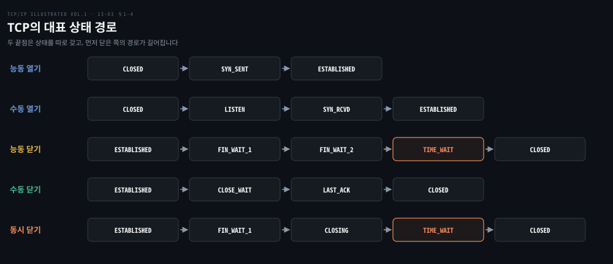
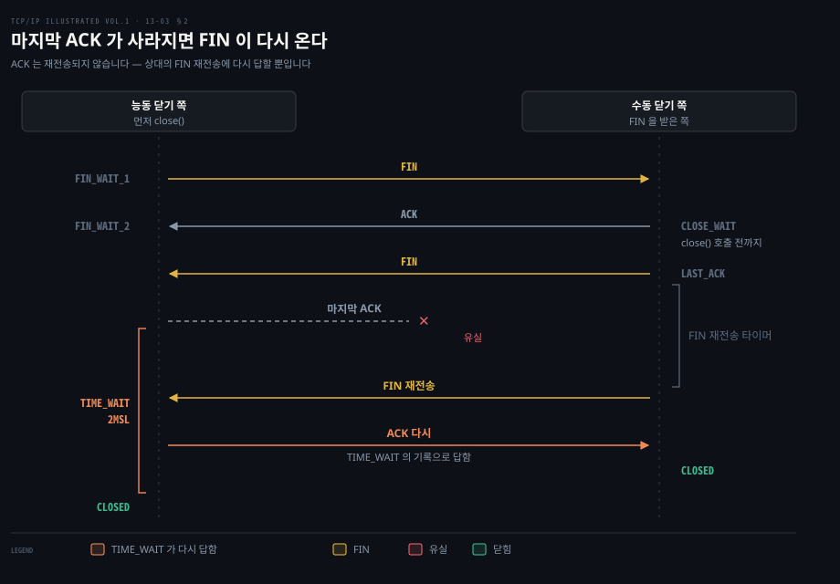
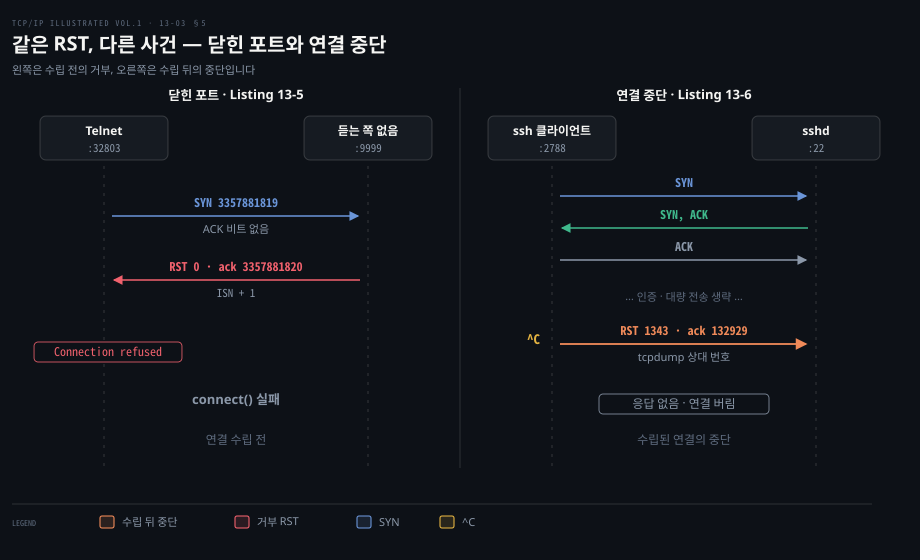
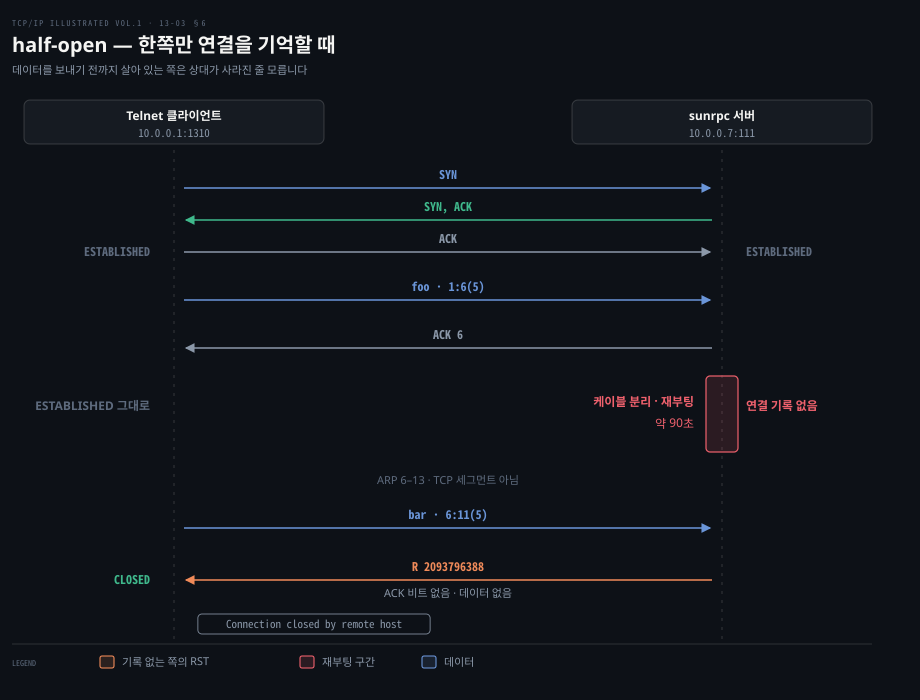
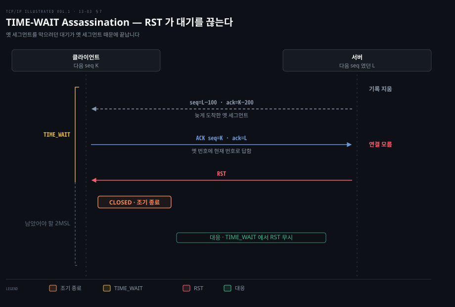

# TCP 상태는 연결의 과거를 기억하고 RST는 그 기억을 끊는다

---

> 13장의 §13.5–13.6은 TCP 연결의 열기·닫기를 상태 전이로 다시 읽고, 정상 종료와 다른 RST의 의미를 설명합니다. 특히 `TIME_WAIT`는 닫힌 연결의 과거를 잠시 기억하고, RST는 연결 중단이나 해당 연결 상태가 없음을 알리는 데 쓰입니다.

## 핵심 요약

> 연결의 상태는 다음 세그먼트에 어떻게 답할지를 정하며, 같은 네 주소·포트 조합을 재사용할 때 옛 세그먼트와 새 연결을 구별할 근거가 됩니다.

능동적으로 닫은 쪽은 마지막 ACK를 보낸 뒤 `TIME_WAIT`에 남습니다. 마지막 ACK가 사라져 상대가 FIN을 다시 보내면 답할 수 있고, 지연된 옛 세그먼트가 새 연결에 섞이는 것도 막습니다. `FIN_WAIT_2`는 다른 기다림입니다. 내 FIN은 확인받았지만 상대 애플리케이션이 아직 닫지 않아 상대의 FIN을 기다립니다.

RST는 FIN처럼 남은 데이터를 정리하며 닫는 절차가 아닙니다. 듣는 프로세스가 없는 포트, 연결 상태가 사라진 상대, 애플리케이션의 강제 중단에서 나타납니다. 캡처에서 RST를 보면 어느 쪽이 어떤 세그먼트를 받은 직후 보냈는지부터 봅니다.

## 학습 목표

> 이 편을 읽고 나면 상태와 세그먼트를 함께 보며 연결 종료 문제를 설명할 수 있습니다.

1. 능동 열기와 수동 열기, 능동 닫기와 수동 닫기의 대표 상태 경로를 설명할 수 있습니다.
2. `TIME_WAIT`의 두 역할과 같은 4-tuple 재사용에 미치는 영향을 설명할 수 있습니다.
3. `FIN_WAIT_2`와 `CLOSE_WAIT`가 오래 남을 때 어느 애플리케이션을 확인해야 하는지 판단할 수 있습니다.
4. 닫힌 포트의 RST와 기존 연결을 중단하는 RST를 캡처에서 구분할 수 있습니다.
5. half-open 연결과 TIME-WAIT Assassination에서 RST가 어떤 일을 하는지 설명할 수 있습니다.

아래 도식은 앞 편에서 본 연결의 생애를 상태 관점으로 압축한 지도입니다. 한쪽이 먼저 닫는 정상 경로와 양쪽이 동시에 닫는 경로가 `TIME_WAIT`에서 만납니다.

이 지도는 원서 Figure 13-8의 상태 전이도와 Figure 13-9의 클라이언트·서버 경로를 대신합니다. 한 줄이 한 끝점이 지나는 경로입니다. 강조한 `TIME_WAIT` 칸은 능동 닫기와 동시 닫기가 만나는 자리입니다. 대표 경로 다섯 줄만 골랐으므로 `SYN_RCVD`에서 `LISTEN`으로 돌아가는 것 같은 드문 전이는 §1의 글로 봅니다.

## 1. 상태는 지금 들어온 세그먼트의 뜻을 바꾼다

> 같은 SYN·FIN·ACK라도 현재 상태와 애플리케이션의 동작에 따라 다음 상태가 달라집니다. 각 끝점은 자기 상태를 따로 갖습니다.

연결을 열고 닫는 세그먼트를 외우는 것만으로는 장애를 해석하기 어렵습니다. TCP는 받은 세그먼트, 애플리케이션의 `open`·`close`, 타이머 만료를 현재 상태와 함께 해석합니다. 원서 Figure 13-8은 이를 상태 전이도로 그렸고 Figure 13-9는 보통의 클라이언트·서버 경로만 뽑았습니다(§13.5.1, PDF 29–31쪽). 이 편 앞의 상태 경로 지도가 두 그림을 대신합니다.

수동으로 여는 서버는 `CLOSED → LISTEN → SYN_RCVD → ESTABLISHED`를 거칩니다. 능동으로 여는 클라이언트는 `CLOSED → SYN_SENT → ESTABLISHED`를 거칩니다. `ESTABLISHED`에서는 두 방향 모두 데이터를 보낼 수 있습니다. 여기서 애플리케이션이 먼저 닫는 쪽은 `FIN_WAIT_1 → FIN_WAIT_2 → TIME_WAIT → CLOSED`로, 상대의 FIN을 먼저 받은 쪽은 `CLOSE_WAIT → LAST_ACK → CLOSED`로 갑니다. `FIN_WAIT_1`에서 상대 FIN을 먼저 받는 동시 닫기는 `CLOSING`을 거칩니다.

`CLOSED`는 연결 기록이 없는 시작·끝을 표현하려고 그림에 넣은 이름입니다. 원서는 이를 엄밀한 의미의 공식 상태가 아니라고 구분합니다. 드문 `LISTEN → SYN_SENT` 전이는 프로토콜상 가능하지만 Berkeley sockets에서는 지원하지 않는다고도 설명합니다. 그래서 상태 도식의 화살표가 모두 평소 서버 코드에서 관찰할 경로는 아닙니다.

`SYN_RCVD → LISTEN`도 조건이 있습니다. `LISTEN`에서 SYN을 받고 `SYN_RCVD`에 들어간 뒤 RST를 받았을 때의 경로입니다. 동시 열기로 `SYN_SENT`에서 들어온 `SYN_RCVD`에는 같은 복귀를 적용하지 않습니다(§13.5.1, PDF 31쪽).

## 2. TIME_WAIT는 마지막 ACK와 옛 세그먼트를 함께 다룬다

> 능동 닫기의 마지막 ACK 뒤에 남는 `TIME_WAIT`는 끝난 연결의 정보를 일정 기간 보관합니다. 그래서 FIN 재전송에 다시 답하고, 같은 4-tuple의 다음 연결과 옛 세그먼트를 분리할 수 있습니다.

마지막 ACK가 유실되면 수동 닫기 쪽은 자신의 FIN을 다시 보냅니다. ACK 자체는 TCP가 재전송하지 않습니다. `TIME_WAIT`에 남아 있는 능동 닫기 쪽이 재전송된 FIN을 받고 ACK를 다시 보내는 방식입니다. 원서는 기다리는 시간을 2MSL, 즉 구현이 택한 최대 세그먼트 수명(MSL)의 두 배로 설명합니다(§13.5.2, PDF 32–33쪽). MSL은 원서가 인용한 RFC 793에서 2분으로 잡았지만 원서의 구현 사례는 30초·1분·2분입니다. 운영체제에서 본 대기 시간이 반드시 4분이라고 일반화할 수 없습니다.

원서는 이 장면을 그림 없이 문장으로 설명하므로 그 순서를 시간순 메시지로 옮겼습니다. 위쪽 세 줄은 보통의 닫기입니다. 마지막 ACK가 길에서 사라진 다음부터가 `TIME_WAIT`의 첫째 역할입니다. 오른쪽 수동 닫기 쪽은 `LAST_ACK`에서 확인을 기다리다 FIN을 다시 보냅니다. 왼쪽 능동 닫기 쪽은 아직 연결 기록을 갖고 있어 그 FIN에 ACK를 다시 보낼 수 있습니다. 왼쪽 괄호가 그 기록을 붙들고 있는 2MSL 구간입니다.

두 번째 이유는 지연된 옛 세그먼트입니다. TCP 연결은 로컬 IP·포트와 상대 IP·포트, 네 값의 조합인 **4-tuple**로 구별합니다. 그 조합을 곧바로 새 연결에 쓰면 오래 떠돌던 이전 연결의 세그먼트가 새 연결에 들어올 수 있습니다.

원서는 대기 기간의 재사용 제한을 기본 규칙으로 설명합니다. 새 초기 순서 번호가 이전 연결의 최댓값보다 크거나 타임스탬프로 두 세대를 분리할 수 있는 조건도 함께 듭니다(RFC 1122·6191). 같은 로컬 포트의 모든 재사용을 막는 구현도 원서 실험에 등장합니다. 이를 모든 운영체제의 불변 규칙으로 볼 수는 없습니다.

원서 Listing 13-3에서 서버가 6666번 포트의 연결을 직접 끝낸 뒤 곧바로 재시작하자 `Address already in use`가 나옵니다. 당시 시스템은 서버의 로컬 포트 재사용까지 엄격하게 막았습니다. Listing 13-4에서는 클라이언트가 앞서 쓰던 2091번 로컬 포트를 `-b`로 다시 고르자 `bind()`가 같은 오류를 냈습니다. 일반 클라이언트는 임시 포트를 새로 배정받아 이 문제를 덜 겪습니다. 다만 같은 서버로 빠르게 많은 연결을 만들면 임시 포트 고갈과 맞닿을 수 있습니다(§13.5.2, PDF 34–36쪽).

`SO_REUSEADDR`는 포트에 `bind()`할 수 있는 범위를 넓힙니다. 그렇다고 같은 4-tuple의 옛 데이터까지 안전해지는 것은 아닙니다. 원서의 `sock -A` 실험에서는 같은 호스트의 빠른 재연결이 성공합니다. 다른 호스트 조합에서는 대기나 연결 거부가 나타나 구현 차이를 보여 줍니다(PDF 36–39쪽). `Address already in use`가 나면 먼저 어느 끝점이 능동 닫기를 했는지와 `TIME_WAIT`의 네 값을 확인해야 합니다.

> **원문 정오**: §13.5.2는 Linux의 `net.ipv4.tcp_fin_timeout`을 2MSL `TIME_WAIT` 대기값으로 소개합니다(PDF 32쪽). 그러나 같은 장 §13.5.4는 이 값을 `FIN_WAIT_2`의 고아 연결 타이머로 설명합니다(PDF 40쪽). [Linux 커널 문서](https://docs.kernel.org/networking/ip-sysctl.html)는 `tcp_fin_timeout`을 `FIN_WAIT_2`에서 기다리는 시간으로 정의합니다. 두 상태를 같은 타이머로 읽지 않아야 합니다.

## 3. 재부팅과 FIN_WAIT_2는 서로 다른 빈틈을 만든다

> 호스트가 재부팅하면 `TIME_WAIT`의 기억도 사라질 수 있습니다. 반면 `FIN_WAIT_2`는 상태가 살아 있지만 상대 애플리케이션의 닫기를 기다리는 자리입니다.

앞 절의 `TIME_WAIT`는 호스트가 살아 있는 동안에만 옛 세그먼트를 막습니다. 그 기억이 재부팅으로 통째로 사라지면 무엇이 옛 연결과 새 연결을 갈라 줄까요?

원서가 소개하는 **quiet time**은 재부팅 직후 옛 세그먼트를 새 연결로 오인하지 않으려는 대기입니다. `TIME_WAIT`에 있던 호스트가 MSL 안에 재부팅하고 같은 4-tuple로 연결을 다시 만들면 재부팅 전에 떠난 세그먼트가 도착할 수 있습니다. 원서가 인용한 RFC 793은 재부팅이나 충돌 뒤 새 연결을 만들기 전에 MSL만큼 기다리도록 권합니다. 원서는 실제로는 이 규칙을 따르는 구현이 적다고 설명합니다. 재부팅 자체가 MSL보다 길거나 애플리케이션의 별도 검사로 오류를 알아채기도 한다고 덧붙입니다(§13.5.3, PDF 39–40쪽).

`FIN_WAIT_2`는 내 FIN을 보냈고 그 ACK도 받았지만 상대 FIN은 아직 받지 못한 상태입니다. 반대편은 보통 `CLOSE_WAIT`에서 애플리케이션의 `close`를 기다립니다. 상대 애플리케이션이 끝내 닫지 않으면 둘 다 오래 머무를 수 있습니다. §2 도식의 둘째 줄과 셋째 줄 사이가 이 기다림입니다. 이 구간에서 왼쪽은 `FIN_WAIT_2`에, 오른쪽은 `CLOSE_WAIT`에 머뭅니다. 그 기다림은 오른쪽 애플리케이션이 `close()`를 불러 FIN이 나갈 때 끝납니다.

원서는 능동 닫기를 한 애플리케이션이 수신을 계속 기대하는 half-close가 아니라 완전 종료를 했을 때, 구현이 유휴 `FIN_WAIT_2`를 타이머로 정리한다고 설명합니다. 리눅스의 `tcp_fin_timeout` 기본값은 원서 시점에 60초였다고 적습니다(§13.5.4, PDF 40쪽). 현재 적용값은 대상 호스트에서 따로 확인합니다.

운영 중 `CLOSE_WAIT`가 계속 쌓이면 그 상태를 가진 쪽의 애플리케이션이 FIN을 받고도 닫지 않는 경로를 우선 확인합니다. `FIN_WAIT_2`를 보았다면 상대가 언제 FIN을 보낼지, 내 쪽 소켓이 half-close인지 완전 종료인지 확인합니다. 상태 이름만으로 네트워크 손실을 단정하면 원인을 놓칩니다.

## 4. 동시에 열거나 닫으면 대칭 경로를 지난다

> TCP는 양쪽이 거의 동시에 시작해도 연결 하나로 합칠 수 있고, 양쪽이 함께 닫으면 둘 다 `TIME_WAIT`에 들어갑니다.

§1 지도의 다섯째 줄인 동시 닫기는 정상 경로에 없는 `CLOSING`을 지납니다. 세그먼트가 엇갈리는 모습은 [13-01 §4 동시 열기와 동시 닫기](./13-01.TCP%20연결은%20세%20세그먼트로%20열고%20네%20세그먼트로%20닫는다.md#4-동시-열기와-동시-닫기)의 도식에서 이미 봤습니다. 여기서는 그 세그먼트에 상태 이름만 붙입니다.

동시 열기에서는 양 끝이 SYN을 보내 `SYN_SENT`에 들어갑니다. 각자 상대 SYN을 받으면 `SYN_RCVD`로 가서 자신의 SYN을 다시 싣고 상대 SYN을 ACK합니다. 서로의 SYN+ACK를 받으면 `ESTABLISHED`가 됩니다. 원서 §13.5.5는 이 경로를 앞의 Figure 13-3과 연결합니다(PDF 40–41쪽). 보통의 클라이언트·서버 열기처럼 한쪽만 `LISTEN`에서 시작한다고 가정하면 이 흐름을 읽을 수 없습니다.

동시 닫기에서는 두 애플리케이션이 모두 `close`하여 양쪽이 `FIN_WAIT_1`로 갑니다. 서로의 FIN이 길에서 교차해 각각 `CLOSING`으로 옮기고 ACK를 보냅니다. 마지막 ACK를 받으면 양쪽 모두 `TIME_WAIT`에 머뭅니다. 먼저 닫은 한쪽만 항상 `TIME_WAIT`를 갖는다는 설명에는 이 예외가 있습니다.

## 5. RST는 닫힌 포트와 강제 중단을 알린다

> 연결 중에 유효한 RST를 받으면 FIN을 주고받는 정상 종료 절차 없이 연결을 버립니다. 받은 세그먼트를 처리할 연결이 없을 때도 RST를 보내므로, 원인은 직전 패킷과 함께 읽어야 합니다.

`connect()`가 곧바로 `Connection refused`로 실패할 때도 잘 돌던 연결이 `Connection reset by peer`로 끊길 때도 캡처에는 RST 한 줄이 보입니다. 같은 비트가 서로 다른 사건을 알리므로 무슨 일이 있었는지는 RST가 나가기 직전의 상황을 봐야 풀립니다.

첫째 상황은 목적지 포트에서 듣는 프로세스가 없는데 SYN이 온 경우입니다. 이때 TCP는 UDP에서 쓰는 ICMP Port Unreachable과 달리 RST로 답합니다. 원서 Listing 13-5에서는 `127.0.0.1:9999`로 보낸 SYN에 RST가 즉시 돌아오고 Telnet은 `Connection refused`를 출력합니다(§13.6.1, PDF 41–42쪽). SYN의 초기 순서 번호는 3,357,881,819입니다. SYN이 번호 하나를 차지하므로 응답의 확인 번호는 3,357,881,820입니다.

이미 열린 연결을 애플리케이션이 강제로 중단할 수도 있습니다. 정상 FIN은 orderly release로, 앞서 큐에 넣은 데이터를 보낸 뒤 닫습니다. 반면 abortive release는 큐에 남은 데이터를 버리고 RST를 즉시 보냅니다. 원서는 소켓 API에서 `SO_LINGER`를 켜고 linger 값을 0으로 두는 방법을 듭니다.

Listing 13-6의 SSH 예에서는 사용자가 대량 출력을 `^C`로 중단한 뒤 RST가 나갑니다. 상대는 이에 ACK를 보내지 않고 연결을 버립니다. 애플리케이션에는 `Connection reset by peer` 같은 오류가 전달될 수 있습니다(§13.6.2, PDF 42–45쪽).

원서 Listing 13-5와 13-6을 나란히 놓아 대신합니다. 왼쪽 RST는 순서 번호가 0이고 확인 번호만 의미가 있습니다. 원서 설명대로 들어온 SYN에 ACK 비트가 없었기 때문입니다. 오른쪽 RST는 수립된 연결의 순서 번호 1343과 확인 번호 132929(tcpdump 상대 번호)를 그대로 싣고 나갑니다. 상대는 여기에 아무 응답도 하지 않습니다. 원서는 abortive release를 만드는 API로 `SO_LINGER`를 듭니다. 다만 이 ssh 예가 그 옵션을 썼다고는 적지 않습니다.

두 캡처의 결과는 모두 RST지만 판단은 다릅니다. 첫째는 아직 연결을 수립하지 못한 `connect()` 실패입니다. 둘째는 수립된 연결의 데이터와 상태를 버린 중단입니다. 캡처에서 RST 한 줄만 떼어 보면 이 차이가 사라집니다.

> **원문 정오**: §13.6.1은 RST를 받으려면 ACK 비트가 켜져 있어야 한다고 일반화합니다(PDF 42쪽). 하지만 같은 장 Listing 13-8은 연결 상태를 잃은 서버가 ACK 비트 없는 `R`로 답하는 모습을 보여 줍니다(PDF 47쪽). [RFC 9293 §3.10.7](https://www.rfc-editor.org/rfc/rfc9293#section-3.10.7)은 상태에 따라 RST의 유효한 순서 번호 또는 ACK 번호를 검사하며, 모든 RST에 ACK 비트를 요구하지 않습니다. [RFC 5961](https://www.rfc-editor.org/rfc/rfc5961)은 연결이 동기화된 상태에서 RST 검증을 더 엄격하게 다룹니다.

## 6. Half-open 연결은 한쪽만 옛 상태를 믿는 상황이다

> 상대가 충돌하거나 재부팅해 연결 기록을 잃어도, 내 쪽은 아무 데이터도 보내지 않는 동안 이를 알아채지 못할 수 있습니다.

앞 절에서 TCP는 받을 연결이 없는 세그먼트에 RST로 답했습니다. 그렇다면 상대가 재부팅해 연결 기록을 잃었는데 이쪽은 그 사실을 모른 채 데이터를 보내면 어떻게 될까요?

여기서 **half-open 연결**은 앞 편의 **half-close**와 다릅니다. Half-close는 FIN으로 한 방향만 의도적으로 닫고 다른 방향을 살린 상태입니다. Half-open은 한쪽의 연결 정보가 사라진 사실을 다른 쪽이 모르는 상태입니다. 원서 §13.6.3은 상대 호스트의 충돌·전원 차단을 예로 듭니다(PDF 45쪽). 데이터 교환이 없으면 살아 있는 쪽의 TCP는 상대가 사라졌다는 증거를 아직 받지 못합니다.

원서 Listing 13-7·13-8의 실험에서 클라이언트는 `10.0.0.7:111`의 sunrpc 서버에 접속해 `foo`를 보내고 ACK를 받습니다. 그 뒤 서버 네트워크를 끊고 재부팅합니다. 서버의 케이블을 다시 연결한 뒤 클라이언트가 기존 세션에서 `bar`를 보냅니다. 서버는 그 4-tuple의 기존 연결을 모르므로 RST를 보냅니다.

캡처에서 `bar` 세그먼트는 클라이언트의 상대적 순서 번호 6:11에 해당하는 5바이트이고, 응답은 데이터와 ACK 없는 `R`입니다(PDF 46–48쪽). 그 앞의 ARP 패킷은 양쪽에서 나옵니다. 재부팅한 서버는 자기 주소를 알리고 기본 라우터의 MAC 주소를 묻습니다. 클라이언트는 서버의 MAC 주소를 다시 묻습니다. 어느 쪽도 TCP 연결을 회복한 신호가 아닙니다.

원서 Listing 13-8의 순서를 대신합니다. 붉은 띠는 서버가 재부팅하며 연결 기록을 잃은 구간입니다. 그동안 아무 세그먼트도 오가지 않으므로 클라이언트의 상태는 `ESTABLISHED` 그대로입니다. 마지막 RST의 순서 번호 2093796388은 `bar` 세그먼트가 싣고 간 확인 번호와 같은 값입니다. 이 응답에 ACK 비트는 켜져 있지 않습니다.

이 상황에서 클라이언트의 `ESTABLISHED` 표시는 상대까지 같은 상태라는 보증이 아닙니다. 한쪽의 상태와 양쪽이 같은 연결을 기억하는지는 별개의 질문입니다. 원서는 유휴 연결의 상대 소멸을 찾아내는 keepalive는 17장으로 미룹니다.

## 7. TIME-WAIT Assassination은 대기를 너무 일찍 끝낸다

> 늦은 옛 세그먼트에 답한 ACK가 상태 없는 상대의 RST를 부르면, `TIME_WAIT`가 조기 종료될 수 있습니다. 이때 원래의 옛 세그먼트 격리 목적이 깨집니다.

§2에서 `TIME_WAIT`는 옛 세그먼트를 막으려고 2MSL을 버틴다고 했습니다. 그런데 바로 그 옛 세그먼트 하나가 RST를 불러들이면 대기가 그 자리에서 끝날 수 있습니다.

원서 Figure 13-10은 서버가 이미 연결 기록을 지운 뒤 클라이언트만 `TIME_WAIT`에 남은 상황입니다. 연결을 닫을 때 클라이언트의 다음 순서 번호가 K, 서버의 다음 번호가 L이었다고 둡니다. 서버 쪽에서 늦게 도착한 옛 세그먼트는 `seq=L−100`, `ack=K−200`입니다. 클라이언트가 현재 값 `seq=K`, `ack=L`로 ACK를 보내면 연결을 모르는 서버가 RST로 답합니다. 클라이언트가 그 RST를 받아 `TIME_WAIT → CLOSED`로 바로 가면 **TIME-WAIT Assassination(TWA)**입니다(§13.6.4, PDF 48–49쪽).

원서 Figure 13-10을 대신합니다. 점선 화살표가 늦게 도착한 옛 세그먼트입니다. 클라이언트는 두 번호가 모두 옛 값이라 판단해 현재 값으로 ACK를 돌려보냅니다. 왼쪽 괄호의 실선 부분은 실제로 머문 `TIME_WAIT`입니다. 점선 부분은 RST 때문에 잘려 나간 대기입니다.

문제는 RST 자체보다 그것이 대기 기간을 지우는 일입니다. 원서는 대부분의 시스템이 `TIME_WAIT`에서 RST에 반응하지 않아 이 경로를 피한다고 설명합니다. 따라서 캡처에서 `TIME_WAIT` 중 RST가 보였다는 사실만으로 상태가 사라졌다고 단정할 수 없습니다. 실제 소켓 상태와 이후 같은 4-tuple의 재사용 여부를 확인해야 합니다.

## 결정 치트시트

> TCP 상태를 진단할 때는 상태 이름보다 그 상태로 들어오게 한 동작과 직전 세그먼트를 먼저 확인합니다.

| 관찰 | 먼저 확인할 것 | 이유 |
|---|---|---|
| `TIME_WAIT`가 많음 | 어느 쪽이 능동 닫기를 하는지·같은 4-tuple 재사용 여부 | 마지막 ACK와 옛 세그먼트를 위한 대기일 수 있음 |
| `CLOSE_WAIT`가 오래 감 | 그 상태를 가진 애플리케이션의 `close` 경로 | 상대 FIN은 받았고 로컬 종료가 남음 |
| `FIN_WAIT_2`가 오래 감 | 상대 FIN·half-close 여부 | 내 FIN의 ACK를 받았지만 상대 종료가 남음 |
| `connect()`가 즉시 거부됨 | SYN 직후 닫힌 포트의 RST인지 | 수립 이전의 거부를 뜻함 |
| 데이터 전송 뒤 reset | 상대 재부팅·연결 상태 소실 또는 abortive close인지 | 같은 RST라도 직전 사건이 다름 |

## 면접 대비

> 각 상태를 정의로만 외우기보다, 직전에 어떤 세그먼트를 주고받았는지 붙여 답해 보세요.

1. 능동 열기와 수동 열기는 각각 어떤 사건으로 `SYN_SENT`와 `SYN_RCVD`에 들어갑니까?
2. `TIME_WAIT`는 왜 필요하며 마지막 ACK가 사라지면 이 상태의 TCP는 무엇에 응답합니까?
3. `FIN_WAIT_2`와 `CLOSE_WAIT`는 각각 누구를 기다리고 `tcp_fin_timeout`은 어느 상태의 타이머입니까?
4. 닫힌 포트가 보낸 RST와 연결 중단의 RST를 캡처에서 어떻게 구분하며 RST는 FIN과 무엇이 다릅니까?
5. half-open은 half-close와 어떻게 다르고 TIME-WAIT Assassination에서 RST가 위험한 이유는 무엇입니까?

## 정답 (자답 후 펼치기)

> 위 §면접 대비의 다섯 질문에 먼저 스스로 답한 뒤 읽으세요.

### 정답 1 — 능동 열기와 수동 열기

능동으로 여는 클라이언트는 애플리케이션이 연결을 요청해 SYN을 보내면서 `SYN_SENT`에 들어갑니다. 상대의 SYN+ACK를 받으면 `ESTABLISHED`가 됩니다. 수동으로 여는 서버는 `LISTEN`에서 SYN을 받고 SYN+ACK를 보내며 `SYN_RCVD`에 들어갑니다. 그 뒤 마지막 ACK를 받아 `ESTABLISHED`가 됩니다.

### 정답 2 — TIME_WAIT의 두 역할

능동 닫기를 한 끝점이 마지막 ACK 뒤 2MSL 동안 연결 기록을 보관하는 자리입니다. ACK는 TCP가 재전송하지 않습니다. 마지막 ACK가 사라지면 상대가 FIN을 다시 보내고 `TIME_WAIT`의 TCP가 그 FIN에 ACK를 다시 보냅니다. 또 같은 4-tuple에 남은 옛 세그먼트가 다음 연결에 섞이는 것을 막습니다.

### 정답 3 — 서로를 기다리는 두 상태

`FIN_WAIT_2`는 내 FIN의 ACK를 받았고 상대가 보낼 FIN을 기다립니다. 상대편 `CLOSE_WAIT`는 FIN을 받은 뒤 로컬 애플리케이션이 닫기를 호출할 때까지 기다립니다. 그러므로 오래 남는 `CLOSE_WAIT`는 그 호스트의 애플리케이션 종료 경로를 살펴볼 단서입니다. Linux 커널 문서는 `tcp_fin_timeout`을 `FIN_WAIT_2`에서 기다리는 시간으로 정의합니다. 이 값은 `TIME_WAIT`의 보편적인 대기값이 아닙니다.

### 정답 4 — RST 직전의 사건

닫힌 포트의 RST는 SYN 직후에 돌아오고 이때 `connect()`는 `Connection refused`로 실패합니다. 연결 중단의 RST는 데이터가 오간 수립된 연결에서 나가며 큐에 남은 데이터는 버려집니다. 상대는 그 RST에 응답하지 않습니다. FIN은 이미 큐에 넣은 데이터를 보낸 뒤 한 방향을 차례대로 닫는 orderly release입니다. RST는 연결을 즉시 중단합니다.

### 정답 5 — half-open과 TWA

half-close는 FIN으로 한 방향만 의도적으로 닫은 상태입니다. half-open은 한쪽이 충돌·재부팅으로 연결 기록을 잃은 사실을 다른 쪽이 모르는 상태입니다.

TWA에서는 늦게 도착한 옛 세그먼트에 답한 ACK가 상태 없는 상대의 RST를 부릅니다. 그 RST가 `TIME_WAIT`를 조기에 끝내면 옛 세그먼트를 격리하려던 대기가 사라집니다. 대부분의 시스템은 `TIME_WAIT`에서 RST를 무시해 이를 피합니다.

## 참고 자료

- 《TCP/IP Illustrated, Volume 1: The Protocols》 2nd ed. Kevin R. Fall · W. Richard Stevens.
  Addison-Wesley, 2011. ISBN 978-0-321-33631-6. 13장 §13.5–13.6, PDF 28–49쪽.
- [RFC 9293 — Transmission Control Protocol](https://www.rfc-editor.org/rfc/rfc9293): 현재 TCP 상태 전이·RST 처리 명세.
- [RFC 5961 — Improving TCP's Robustness to Blind In-Window Attacks](https://www.rfc-editor.org/rfc/rfc5961): 동기화 상태의 RST 검증 보강.
- [RFC 6191 — Reducing the TIME-WAIT State Using TCP Timestamps](https://www.rfc-editor.org/rfc/rfc6191): 타임스탬프로 옛 연결과 새 연결을 분리하는 조건.
- [Linux 커널 ip-sysctl 문서](https://docs.kernel.org/networking/ip-sysctl.html): `tcp_fin_timeout`의 대상 상태.

## 관련 문서

- [13-01 TCP 연결은 세 세그먼트로 열고 네 세그먼트로 닫는다](./13-01.TCP%20연결은%20세%20세그먼트로%20열고%20네%20세그먼트로%20닫는다.md): 이 편이 상태로 다시 읽는 SYN·FIN과 half-close의 출발점입니다.
- [13-02 TCP 옵션은 40바이트 안에서 능력과 한계를 알린다](./13-02.TCP%20옵션은%2040바이트%20안에서%20능력과%20한계를%20알린다.md): 타임스탬프 옵션과 옛 세그먼트 판별의 배경입니다.
