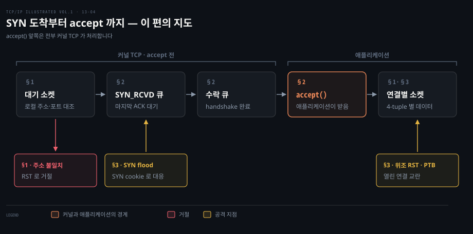
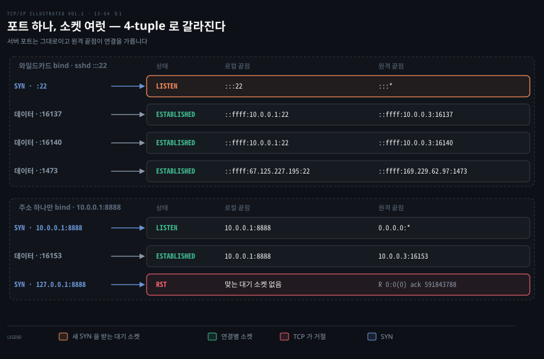
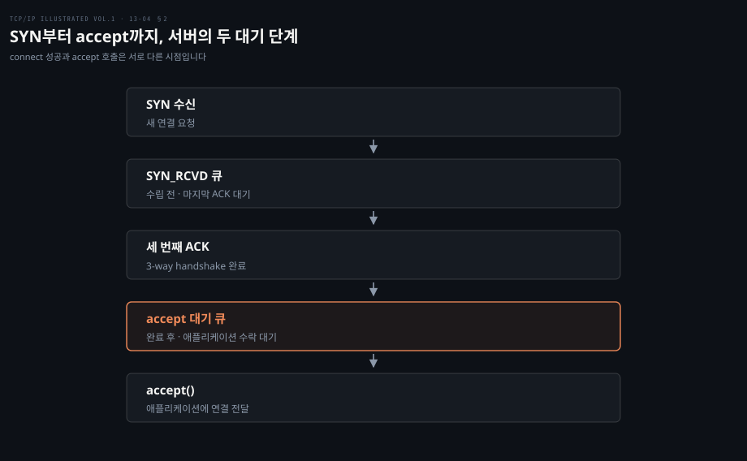
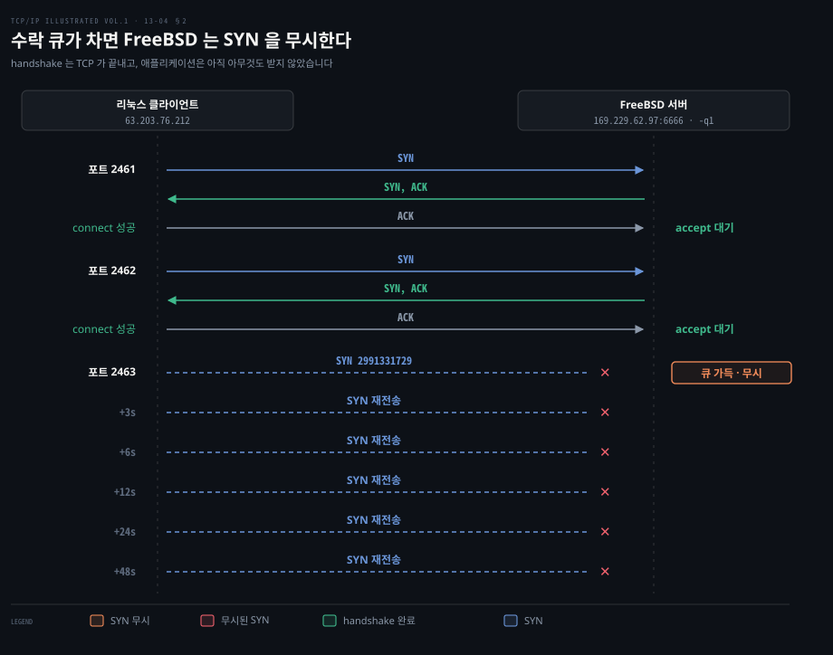
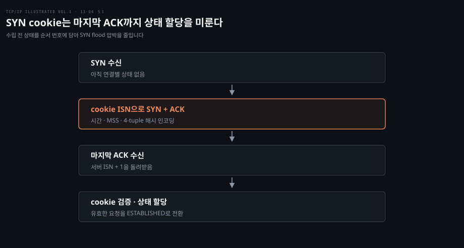

# 서버의 연결 큐와 SYN 쿠키는 수락 전에 작동한다

---

> 13장 마지막 본문인 §13.7·§13.8은 서버가 여러 연결을 어떻게 구별하고 애플리케이션에 넘기는지, 그 사이의 상태를 공격자가 어떻게 소모하거나 속일 수 있는지 살핍니다. 핵심 경계는 TCP가 연결을 수립하는 시점과 서버 애플리케이션이 `accept()`로 연결을 받는 시점이 다르다는 데 있습니다.

## 핵심 요약

> 이 편이 매달린 하나의 생각은, 서버가 연결 요청을 애플리케이션에 넘기기 전에 커널 TCP가 4-tuple과 두 종류의 대기 상태로 관리한다는 것입니다.

대기 소켓은 정해진 로컬 포트에서 새 SYN을 기다립니다. 연결이 성립하면 같은 서버 포트를 쓰는 연결별 소켓이 따로 생기고 상대 주소와 포트까지 포함한 4-tuple로 구별합니다. SYN을 받았지만 handshake가 끝나지 않은 연결과 handshake를 끝냈지만 애플리케이션이 받지 않은 연결은 서로 다른 큐에 놓입니다.

이 차이는 장애를 해석할 때 중요합니다. 클라이언트의 `connect()`가 성공해도 서버 애플리케이션이 이미 `accept()`를 호출해 요청을 읽었다는 뜻은 아닙니다. SYN flood는 수립 전 상태를 소모하려 하고 SYN cookie는 필요한 상태 일부를 서버의 SYN + ACK 순서 번호에 넣어 이 압박을 줄입니다. 이미 열린 연결을 겨냥한 위조 세그먼트와 가짜 ICMP는 다른 검증 문제를 만듭니다.

## 학습 목표

> 읽은 뒤에는 연결 수립, 애플리케이션 수락, 공격 표면을 서로 다른 단계로 설명할 수 있습니다.

1. 하나의 서버 포트로 여러 연결을 처리하는 이유를 4-tuple과 대기 소켓으로 설명할 수 있습니다.
2. 로컬 주소를 특정해서 바인딩할 때와 와일드카드 주소로 바인딩할 때 들어오는 SYN의 처리 차이를 말할 수 있습니다.
3. `SYN_RCVD` 큐와 handshake가 끝난 연결의 대기 큐가 각각 무엇을 담는지 구별할 수 있습니다.
4. `listen()`의 backlog가 동시 처리 연결 수의 상한이 아닌 이유를 설명할 수 있습니다.
5. SYN flood·가짜 PTB·연결 위조가 각각 어떤 상태나 입력을 노리는지, 책이 소개한 방어 방향과 함께 말할 수 있습니다.

아래는 SYN 하나가 서버에 도착해 애플리케이션이 연결을 받기까지 지나는 단계를 이 편의 세 절에 맞춰 이은 지도입니다. 위 줄의 단계 옆 절 번호가 그 단계를 다루는 곳입니다. 아래 줄은 주소가 맞지 않아 거절되는 자리(§1)와 공격이 겨냥하는 자리(§3)입니다.

강조한 `accept()` 칸이 이 편의 경계입니다. 그 왼쪽은 애플리케이션이 모르는 사이 커널 TCP가 처리하므로, 연결 수립과 애플리케이션 수락을 같은 사건으로 읽으면 §2의 backlog와 §3의 SYN cookie가 모두 엇나갑니다.

## 1. 대기 소켓은 포트를 지키고 연결별 소켓은 4-tuple로 갈라진다

> 서버 포트 22 하나에 SSH 연결이 여러 개 붙어도 충돌하지 않습니다. `LISTEN` 소켓은 다음 SYN을 받고, 이미 성립한 연결은 각자의 출발지 주소와 포트가 더해진 4-tuple로 구별됩니다(원서 §13.7.1).

### 같은 서버 포트를 여러 클라이언트가 씁니다

서버가 동시 접속을 처리하려면 한 클라이언트를 상대하는 동안에도 다음 연결을 받아야 합니다. 원문은 SSH 서버의 `netstat -a -n -t` 출력을 예로 듭니다. 처음에는 `:::22`에서 기다리는 `LISTEN` 항목 하나만 있습니다. `:::`는 모든 로컬 주소를 받는 IPv6 와일드카드 표현이고 상대 끝점 `:::*`는 아직 정해지지 않았습니다.

클라이언트 `10.0.0.3`에서 첫 연결이 오면 서버의 `10.0.0.1:22`와 클라이언트의 `10.0.0.3:16137`로 이루어진 `ESTABLISHED` 항목이 생깁니다. 같은 클라이언트의 두 번째 연결은 서버 포트 22를 그대로 쓰지만 클라이언트 포트가 16140이므로 다른 4-tuple입니다. 원문의 출력에는 서버 주소가 `::ffff:10.0.0.1`처럼 IPv4 매핑 IPv6 주소로 나타납니다. 다른 인터페이스로 들어온 셋째 연결은 서버 쪽 로컬 IP 주소도 달라집니다.

| 역할 | 로컬 끝점 | 원격 끝점 | 받는 것 |
|---|---|---|---|
| 대기 소켓 | 와일드카드 주소:22 | 와일드카드 | 새 연결 요청인 SYN |
| 첫 연결별 소켓 | 10.0.0.1:22 | 10.0.0.3:16137 | 그 연결의 데이터 |
| 둘째 연결별 소켓 | 10.0.0.1:22 | 10.0.0.3:16140 | 그 연결의 데이터 |

서버 포트만 보고 들어온 세그먼트를 어느 프로세스나 연결에 넘길지 결정할 수는 없습니다. TCP는 출발지·목적지 IP 주소와 포트를 모두 봅니다. 대기 소켓은 새 SYN을 계속 받습니다. 성립한 소켓은 자기 연결의 데이터를 받습니다. 원서 §13.7.1의 요점은 소켓을 하나 만든 뒤 포트를 바꿔 가며 클라이언트를 처리하는 것이 아니라, 대기 소켓과 연결별 소켓이 같은 포트를 공유한다는 데 있습니다.

### 로컬 주소를 묶으면 그 주소의 SYN만 받습니다

앞의 sshd는 와일드카드 주소로 모든 로컬 주소에서 SYN을 받았습니다. 서버가 여러 주소를 가진 호스트에서 주소 하나에만 묶이면, 다른 주소로 온 SYN은 어떻게 될까요?

원서 §13.7.2의 서버는 `10.0.0.1:8888`에만 바인딩합니다. `10.0.0.3`이 목적지 `10.0.0.1:8888`로 접속하면 성립합니다. 그러나 같은 호스트의 `127.0.0.1:8888`로 보내면 그 대기 소켓과 맞지 않아 TCP가 RST로 거절합니다(원서 Listing 13-9). 이 검사는 서버 애플리케이션의 `accept()` 전에 운영체제 TCP가 합니다.

원서가 `netstat -a -n -t` 출력으로 보인 §13.7.1·13.7.2의 소켓 목록과 Listing 13-9를 한 장에 모아 대신합니다. 왼쪽 글자가 들어오는 세그먼트입니다. 위 칸에서 SYN은 강조한 `LISTEN` 소켓으로만 가고, 데이터는 원격 포트가 맞는 `ESTABLISHED` 소켓으로 갑니다. 세 연결별 소켓의 로컬 포트는 모두 22입니다. 아래 칸의 마지막 줄은 목적지 `127.0.0.1:8888`과 맞는 대기 소켓이 없는 경우로, 순서 번호 0과 확인 번호 591843788을 실은 RST가 돌아갑니다.

원서 §13.7.3은 RFC 793의 추상적인 수동 열기가 특정 원격 끝점만 기다리는 형태도 허용한다고 설명합니다. 그러나 일반적인 Berkeley 소켓 API의 서버는 보통 원격 주소·포트를 바인딩 단계에서 고정하지 않습니다. 먼저 연결을 받은 다음 클라이언트 주소·포트를 살펴 허용 여부를 판단합니다. 그래서 특정 클라이언트를 거절하더라도 이미 완료된 TCP handshake 자체를 없던 일로 만들 수는 없습니다.

## 2. SYN 큐와 수락 큐의 경계를 알아야 backlog를 읽을 수 있다

> 커널에는 SYN을 받고 아직 `SYN_RCVD`인 연결과 handshake를 끝내고 애플리케이션의 `accept()`를 기다리는 연결이 따로 쌓입니다. 원서의 리눅스 설명에서 `listen()` backlog는 뒤쪽 큐의 한계이며, 이미 수락해 처리 중인 전체 연결의 한계가 아닙니다(§13.7.4).

### 연결 성립과 애플리케이션 수락은 다릅니다

§1의 대기 소켓이 SYN을 받아들였다고 해서 애플리케이션이 곧바로 그 연결을 보는 것은 아닙니다. 그 사이에 무엇이 있는지 모르면 "`connect()`는 성공했는데 서버가 응답하지 않는다" 같은 증상을 어디서 찾아야 할지 알 수 없습니다.

SYN이 오면 서버 TCP가 먼저 응답하고 연결 상태를 관리합니다. 서버 애플리케이션이 매 세그먼트를 직접 보고 SYN + ACK를 보내는 구조가 아닙니다. 원서는 수락 전 연결을 두 부류로 나눕니다.

| 커널의 대기 단계 | 상태 | 아직 남은 일 | 원서가 든 리눅스 한계 |
|---|---|---|---|
| 미완료 연결 | `SYN_RCVD` | 클라이언트의 마지막 ACK 수신 | 시스템의 `net.ipv4.tcp_max_syn_backlog` |
| 완료됐으나 미수락 연결 | `ESTABLISHED` | 애플리케이션의 `accept()` | 대기 소켓의 backlog, 시스템 상한 `net.core.somaxconn` |

두 설정과 원서의 기본값(`tcp_max_syn_backlog` 1000, `somaxconn` 128)은 책이 관찰한 당시의 리눅스 설명입니다. 환경과 버전에 걸쳐 고정된 프로토콜 상수로 읽으면 안 됩니다. `listen(backlog)`의 backlog는 *그 대기 소켓에서 handshake를 끝내고 애플리케이션을 기다리는 연결*의 길이를 제한합니다. 애플리케이션이 이미 `accept()`해 처리하는 연결 수까지 제한하지 않습니다.

클라이언트는 세 번째 ACK를 보내고 자기 쪽 능동 열기가 성공했다고 판단할 수 있습니다. 서버 애플리케이션은 아직 연결을 전달받지 않았을 수 있고 그 사이 클라이언트가 보낸 데이터는 서버 TCP가 큐에 둘 수 있습니다. 따라서 `connect()` 성공은 서버의 요청 처리 시작이나 애플리케이션 수준의 수락을 증명하지 않습니다.

### 수락 큐가 차면 관측 결과가 구현마다 다릅니다

backlog가 수락 큐의 길이를 정한다면, 애플리케이션이 `accept()`를 오래 부르지 않아 그 큐가 찼을 때 새 SYN은 어떻게 될까요?

원서의 `sock -s -v -q1 -O30000 6666` 예제는 backlog를 1로 두고 서버 프로그램이 오래 `accept()`하지 않게 합니다. 이때 원문은 리눅스가 연결을 지연시키는 사례와, FreeBSD 4.7·Solaris 8이 뒤따른 SYN에 응답하지 않아 클라이언트가 재전송하다 시간 초과되는 사례를 구별합니다. Listing 13-10에서는 FreeBSD 서버가 첫 두 연결의 handshake를 끝내고 셋째 클라이언트의 SYN에는 응답하지 않습니다. 셋째는 약 3·6·12·24·48초 간격으로 SYN을 다시 보냅니다. 이 실험의 세부 수를 오늘의 모든 시스템에서 그대로 기대할 수는 없습니다.

원서 Listing 13-10을 대신합니다. 포트 2461과 2462는 서버 TCP가 handshake를 곧바로 끝내 클라이언트의 `connect()`가 성공합니다. 그러나 서버 애플리케이션은 잠든 채라 두 연결 모두 수락 큐에 머뭅니다. 포트 2463의 SYN은 서버에 닿아도 답을 받지 못하므로 점선 끝에 ✕로 그렸습니다. 왼쪽 간격 3·6·12·24·48초는 원서 타임스탬프에서 읽은 재전송 간격입니다. 재전송한 SYN은 모두 같은 ISN 2991331729를 씁니다.

원서는 리눅스의 `net.ipv4.tcp_abort_on_overflow`를 켜면 초과 연결에 RST를 보낼 수 있다고 적습니다. 다만 일시적으로 바쁜 서버가 RST를 보내면 클라이언트는 서비스가 없다는 식의 확정적인 실패로 받아들이게 됩니다. 기본적으로 이 동작을 켜지 않는 이유입니다. 큐가 찼을 때 응답이 늦어지는지, 무시되는지, RST가 오는지는 운영체제와 설정을 함께 확인해야 합니다.

이제 원격 끝점 거절의 시점도 분명해집니다. Berkeley 소켓 서버가 `accept()` 뒤에 클라이언트 주소를 보고 거절하면 FIN으로 정상 종료하거나 RST로 중단할 수 있습니다. 어느 쪽이든 클라이언트의 `connect()`는 이미 성공했을 수 있고 요청 데이터도 보냈을 수 있습니다(원서 §13.7.4).

## 3. SYN cookie는 미완료 연결의 상태 일부를 순서 번호에 담는다

> 출발지 주소를 속인 SYN이 대량으로 오면 서버가 수립 전 연결의 상태를 쌓는 방식이 약점이 됩니다. SYN cookie는 서버가 보낸 SYN + ACK의 초기 순서 번호에 복원에 필요한 정보를 인코딩하고, 유효한 마지막 ACK가 돌아왔을 때 연결 상태를 만듭니다(원서 §13.8).

### SYN flood가 노리는 것은 수립 전 상태입니다

§2의 `SYN_RCVD` 단계는 마지막 ACK가 올 때까지 연결마다 상태를 붙잡아 둡니다. 마지막 ACK가 끝내 오지 않는 SYN이 대량으로 들어오면 그 자리가 정상 클라이언트 몫까지 차지됩니다.

SYN flood는 여러 SYN으로 서버가 아직 완료되지 않은 연결에 자원을 쓰게 하는 서비스 거부 공격입니다. 출발지 IP를 위조하면 정상적인 마지막 ACK가 돌아오지 않아 상태가 오래 남을 수 있습니다. 서버는 정상 클라이언트의 SYN과 공격자의 SYN을 패킷 하나만으로 쉽게 구별하지 못합니다.

여기서 책이 `half-open`이라 부르는 것은 *handshake가 아직 끝나지 않은 서버 쪽 부분 연결*입니다. §13.6.3의 half-open은 한쪽이 충돌·재부팅해 연결 상태를 잃고 다른 쪽은 모르는 상황을 가리키므로 뜻이 다릅니다. [13-01의 half-close](./13-01.TCP%20연결은%20세%20세그먼트로%20열고%20네%20세그먼트로%20닫는다.md)는 FIN으로 한쪽 송신 방향만 닫은 상태입니다.

SYN cookie를 쓰면 서버는 SYN을 받자마자 그 요청마다 완전한 연결 상태를 저장하지 않고 SYN + ACK를 보냅니다. 정상 클라이언트가 마지막 ACK를 돌려줍니다. 그러면 서버는 ACK 번호가 자신이 보낸 ISN + 1이라는 점을 이용해 cookie를 검증하고 필요한 매개변수를 복원합니다. 그때 연결 상태를 할당해 `ESTABLISHED`로 옮깁니다.

원서가 소개한 당시 리눅스의 cookie 구성은 32비트 ISN 중 높은 5비트에 64초마다 증가하는 시간 카운터의 하위값, 다음 3비트에 여덟 가지 중 하나인 MSS 인코딩, 나머지 24비트에 4-tuple과 시간값을 섞은 암호학적 해시를 넣는 방식입니다. 이 비트 배치는 원서의 구현 사례이지 TCP wire format의 고정 규칙이 아닙니다. 저장하지 않은 상태를 32비트에 모두 담을 수 없으므로, 원문은 임의의 MSS를 그대로 표현할 수 없는 제약을 지적합니다. 현재 리눅스의 기본 사용 여부나 내부 비트 배치는 이 원서 설명에서 추론하지 않습니다.

### 다른 공격은 이미 있는 연결이나 ICMP 입력을 속입니다

SYN cookie가 지키는 것은 수립 전 상태뿐입니다. 이미 성립한 연결은 위조된 세그먼트와 ICMP라는 다른 입력에 노출됩니다. 원서 §13.8은 공격을 SYN 큐 소모에서 끝내지 않습니다.

가짜 ICMP Packet Too Big(PTB)에 아주 작은 MTU, 예를 들어 68바이트를 넣으면 피해 TCP가 세그먼트를 지나치게 작게 만들 수 있습니다. 연결은 살아 있어도 처리량이 떨어지는 성능 저하 공격입니다. [13-02의 PMTUD](./13-02.TCP%20옵션은%2040바이트%20안에서%20능력과%20한계를%20알린다.md)에서 PTB가 크기를 조정하는 입력이라는 점을 먼저 봤습니다.

원문은 대응을 셋 소개합니다. 호스트의 PMTUD를 아예 끄는 방법, next-hop MTU가 576바이트 미만인 PTB를 받았을 때 PMTUD를 끄는 방법, 그리고 리눅스처럼 최소 패킷 크기를 고정하고 그보다 큰 패킷에는 DF 비트를 켜지 않는 방법입니다.

이미 성립한 연결도 위조 세그먼트의 대상입니다. 순서 번호 등 수락 조건을 맞춘 RST는 연결을 바로 중단시킬 수 있습니다. 연결 탈취에서는 두 끝의 순서 번호 상태를 어긋나게 만든 뒤, 공격자가 맞춘 데이터를 한쪽에서 유효한 것으로 받아들이게 하려 합니다. 원문은 위조 RST와 함께 SYN이나 ACK도 위조될 수 있다고 한 문장으로 덧붙입니다. 연결 탈취에 대해서는 대응을 따로 들지 않습니다.

위조 세그먼트에 대한 대응으로 원문은 TCP-AO 세그먼트 인증, RST 수락에 범위가 아닌 정확한 순서 번호 요구, 타임스탬프 검사, 연결이나 비밀값을 더 정확히 알아야 맞출 수 있는 다른 형태의 쿠키를 열거합니다. 단순히 4-tuple이 맞는다고 보낸 사람을 신뢰할 수 없는 이유입니다.

ICMP 위조도 TCP 자체 바깥에서 연결에 영향을 줍니다. 원문이 인용한 RFC 5927의 방향은 ICMP 메시지만 보지 말고 그 안에 되돌아온 원래 TCP 세그먼트의 4-tuple과 순서 번호까지 가능한 만큼 대조하는 것입니다. PTB와 목적지 도달 불가 같은 외부 신호를 TCP 연결 상태에 반영하기 전, 그 신호가 해당 연결에서 나온 것인지 확인해야 합니다.

이 절의 공격을 노리는 상태·입력과 원서가 든 대응의 축으로 모으면 다음과 같습니다.

| 공격 | 노리는 상태·입력 | 결과 | 원서가 든 대응 |
|---|---|---|---|
| SYN flood | 수립 전 `SYN_RCVD` 상태 | 정상 연결의 자리 소모 | SYN cookie |
| 가짜 PTB | 경로 MTU 입력(예: 68바이트) | 작은 세그먼트로 처리량 저하 | PMTUD 끄기·576바이트 미만 PTB 때 끄기·최소 패킷 크기 고정 |
| 위조 세그먼트(RST·SYN·ACK) | 성립한 연결의 순서 번호 범위 | RST 는 대개 즉시 중단·SYN·ACK 는 홍수 공격과 겹쳐 여러 문제 | TCP-AO·정확한 RST 순서 번호·타임스탬프 검사·쿠키 |
| 연결 탈취 | 두 끝의 순서 번호 동기 | 위조 데이터 수락 | 원서는 따로 들지 않음 |
| ICMP 위조 | ICMP 오류 메시지 | PMTUD 조작, 도달 불가 통지는 연결 종료로 이어지는 일이 잦음 | 내장 TCP 세그먼트의 4-tuple·순서 번호 대조(RFC 5927) |

## 결정 치트시트

> 증상을 본 뒤에는 실패가 어느 경계에서 일어났는지 먼저 나눕니다. 같은 `connect()` 문제라도 대기 주소, 두 큐, 애플리케이션 수락, 위조된 제어 입력은 확인할 근거가 다릅니다.

| 관측 | 먼저 볼 경계 | 원서가 보여 준 이유 |
|---|---|---|
| SYN에 즉시 RST | 대기 소켓의 로컬 주소·포트 | 해당 목적지로 바인딩된 리스너가 없을 수 있음 (§13.7.2) |
| SYN 재전송이 이어짐 | 수립 전 큐·수락 큐와 운영체제 동작 | 큐가 차면 응답을 미루거나 무시할 수 있음 (§13.7.4) |
| `connect()` 성공, 애플리케이션 응답 없음 | handshake와 `accept()` 사이 | 커널은 애플리케이션보다 먼저 연결을 성립시킴 (§13.7.4) |
| 많은 미완료 연결 | SYN flood와 SYN cookie 사용 조건 | 상태를 저장하는 시점이 자원 소모를 결정함 (§13.8) |
| 연결은 살아 있으나 작은 패킷만 전송 | PTB·경로 MTU 입력 | 작은 MTU를 알리는 ICMP가 성능을 낮출 수 있음 (§13.8) |

## 면접 대비

> 서버 포트의 공유와 `accept()`의 시점을 분리해 답해 보세요.

1. 서버 포트 22 하나에 SSH 클라이언트 여러 개가 동시에 붙을 수 있는 이유는 무엇입니까?
2. 서버가 `10.0.0.1:8888`에만 바인딩했을 때 `127.0.0.1:8888`로 온 SYN은 어떻게 처리됩니까?
3. SYN을 받은 연결과 handshake를 마친 연결은 왜 다른 큐에 있고 클라이언트의 `connect()` 성공은 서버가 요청을 읽는다는 뜻입니까?
4. `listen()`의 backlog는 무엇의 상한이며 무엇의 상한이 아닙니까?
5. SYN cookie는 연결 상태를 언제 할당하며 가짜 PTB와 위조 RST는 각각 무엇을 속입니까?

## 정답 (자답 후 펼치기)

> 위 §면접 대비의 다섯 질문에 먼저 스스로 답한 뒤 읽으세요.

### 정답 1 — 대기 소켓과 4-tuple

대기 소켓은 새 SYN을 받습니다. 연결이 성립할 때마다 서버 IP·포트와 클라이언트 IP·포트를 합친 4-tuple이 다른 연결별 소켓이 만들어집니다. 서버 포트는 그대로 22입니다. 클라이언트 포트 16137과 16140이 두 연결을 가릅니다.

### 정답 2 — 로컬 주소 제한

목적지 주소가 대기 소켓의 로컬 주소와 맞지 않으므로 운영체제 TCP가 RST로 거절합니다(원서 Listing 13-9). 이 거절은 `accept()` 전에 일어나므로 서버 애플리케이션은 그 연결 요청을 보지 못합니다.

### 정답 3 — 두 큐와 connect 성공

`SYN_RCVD` 연결은 마지막 ACK를 기다리는 수립 전 상태입니다. handshake를 마친 연결은 애플리케이션의 `accept()`를 기다립니다. 커널 TCP가 handshake를 마쳐도 연결은 수락 큐에 있을 수 있습니다. 그동안 클라이언트가 보낸 데이터도 커널에 잠시 쌓이므로 `connect()` 성공이 요청 처리 시작을 뜻하지는 않습니다.

### 정답 4 — backlog의 범위

원서의 리눅스 설명에서 backlog는 한 대기 소켓에서 handshake를 끝내고 `accept()`를 기다리는 연결의 길이를 제한합니다. 애플리케이션이 이미 수락해 처리하는 연결 수나 시스템 전체의 연결 수를 제한하지는 않습니다.

### 정답 5 — SYN cookie와 위조 입력

SYN cookie를 쓰는 서버는 SYN마다 미완료 연결 상태를 저장하지 않습니다. SYN + ACK의 ISN에 복원 가능한 정보를 담아 두었다가 유효한 마지막 ACK가 돌아올 때 상태를 만듭니다. 가짜 PTB는 경로 MTU 입력을 속여 세그먼트를 지나치게 작게 만듭니다. 위조 RST는 성립한 연결의 순서 번호 조건을 맞춰 연결을 끊습니다.

## 참고 자료

- 《TCP/IP Illustrated, Volume 1: The Protocols》 2nd ed. Kevin R. Fall · W. Richard Stevens, Addison-Wesley, 2011. ISBN 978-0-321-33631-6.
  13장 §13.7–13.8을 1차 자료로 사용했습니다. §13.9는 장 전체 요약이며 §13.10은 원문 참고문헌입니다.
- [RFC 4987 — TCP SYN Flooding Attacks and Common Mitigations](https://www.rfc-editor.org/rfc/rfc4987): 원문이 근거로 든 SYN flood 자료입니다.
- [RFC 4953 — Defending TCP Against Spoofing Attacks](https://www.rfc-editor.org/rfc/rfc4953): 원문이 근거로 든 TCP 위조 자료입니다.
- [RFC 5927 — ICMP Attacks against TCP](https://www.rfc-editor.org/rfc/rfc5927): 원문이 근거로 든 ICMP 위조 자료입니다. 이 노트의 구현 수치와 사례는 RFC가 아닌 원서 §13.7–13.8에 귀속됩니다.

## 관련 문서

- [13-01 TCP 연결은 세 세그먼트로 열고 네 세그먼트로 닫는다](./13-01.TCP%20연결은%20세%20세그먼트로%20열고%20네%20세그먼트로%20닫는다.md): handshake와 4-tuple의 선행 설명입니다.
- [13-02 TCP 옵션은 40바이트 안에서 능력과 한계를 알린다](./13-02.TCP%20옵션은%2040바이트%20안에서%20능력과%20한계를%20알린다.md): PMTUD·TCP-AO·Timestamps가 공격 대응과 연결되는 자리입니다.
