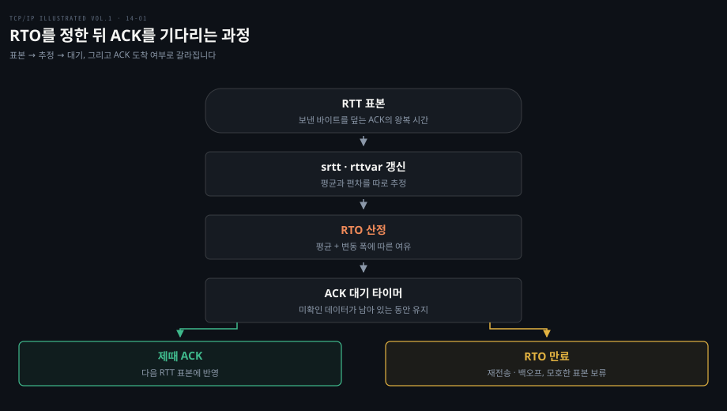
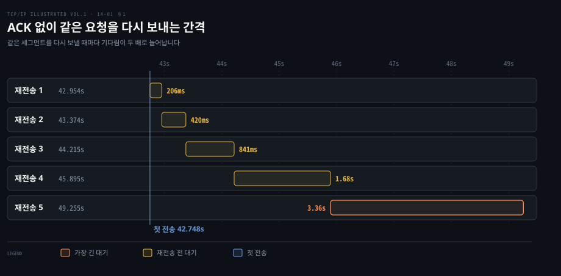
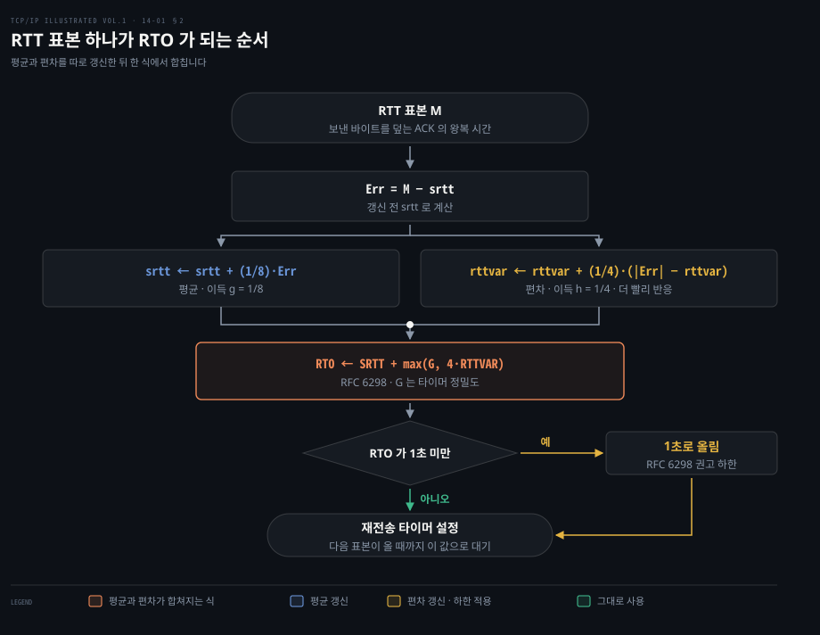
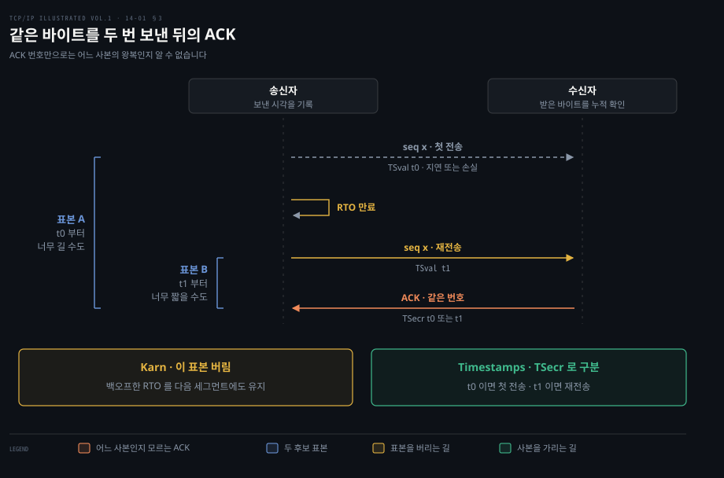
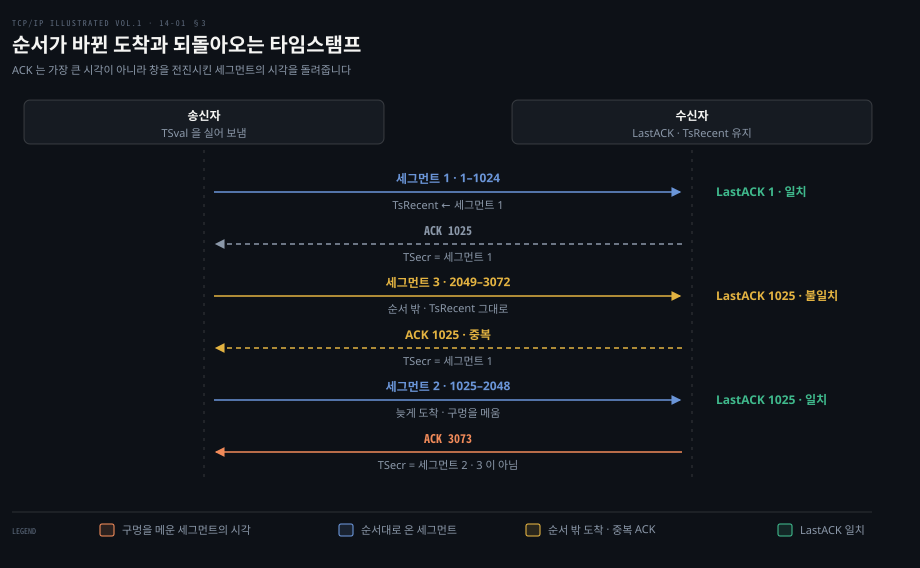

# RTO 는 RTT 의 평균과 흔들림으로 정한다

---

> 14장 앞부분(§14.1–14.3)은 TCP 가 ACK 를 얼마나 기다렸다가 재전송할지 결정하는 과정을 다룹니다. 책의 2011년 리눅스 구현 수치와 RFC 의 일반 규칙을 구분해 읽어야 합니다.

## 핵심 요약

> 이 편의 중심 생각은 재전송 타이머가 단순한 고정 대기 시간이 아니라, 그 연결에서 관측한 왕복 시간과 변동 폭에 맞춰 다시 정하는 값이라는 것입니다.

너무 일찍 다시 보내면 아직 이동 중인 데이터를 중복 전송합니다. 너무 늦게 보내면 손실 뒤의 복구가 멈춥니다. TCP 는 RTT 표본으로 평활 평균 `srtt` 와 평균 편차 `rttvar` 를 추정해 RTO 를 정합니다.

재전송한 바이트의 ACK 로는 어느 전송의 왕복 시간을 잰 것인지 알기 어렵습니다. 그래서 Karn 알고리즘으로 표본을 걸러내고 연속 타임아웃에서는 대기 간격을 늘립니다.

이 편의 리눅스 구현 설명은 원서가 분석한 당시 시스템의 동작입니다. 여기 적힌 최소 RTO 와 커널 내부 변수·계산식을 현재 모든 리눅스의 기본값으로 읽지 않습니다.

## 학습 목표

> 이 편을 읽고 나면 다음을 설명할 수 있습니다.

1. RTO 가 너무 짧거나 긴 경우 각각 어떤 비용이 생기는지 설명할 수 있습니다.
2. `srtt` 와 `rttvar` 로 RTO 를 계산하고 RTT 변동 폭을 따로 추적하는 이유를 말할 수 있습니다.
3. 재전송 모호성이 RTT 측정을 망치는 이유와 Karn 알고리즘의 두 부분을 구분할 수 있습니다.
4. Timestamps 옵션이 RTT 표본을 만드는 방식과 누적 ACK·지연 ACK 에서 주의할 점을 설명할 수 있습니다.
5. 원서의 리눅스 RTO 추정기를 RFC 의 표준식과 구분해 읽을 수 있습니다.

도식의 첫 세 단계는 정상 측정 경로이고 아래쪽은 손실이 의심될 때의 경로입니다. 재전송이 일어나도 새 RTT 표본을 무조건 넣지 않는 이유는 §3에서 설명합니다.

## 1. 타이머는 손실의 증명이 아니라 기다림의 한계다

> ACK 가 정해 둔 시간 안에 오지 않으면 TCP 는 아직 확인되지 않은 데이터를 다시 보냅니다. 네트워크 손실 외에 지연과 ACK 손실도 같은 모습을 만들 수 있습니다.

### 고정된 5초로는 망이 바뀔 때 대응하지 못합니다

서버가 연결 도중 갑자기 응답하지 않게 되면 송신자는 보낸 데이터를 언제 다시 보내고 언제 포기해야 할까요? 가장 단순한 답은 정해 둔 간격마다 다시 보내는 것입니다. 원서는 8장의 TFTP 클라이언트가 UDP 위에서 5초마다 재전송하던 방식을 단순하지만 좋지 않은 전략의 예로 듭니다. 경로가 바뀌어 RTT 가 크게 달라지면 고정된 5초는 너무 짧거나 너무 길어집니다.

TCP 가 실제로 어떻게 하는지 보려고 원서 §14.2 는 서버를 연결 도중 격리한 뒤 18바이트 HTTP 요청을 보낸 실험을 보여 줍니다. 요청은 서버에 닿지 못하고 클라이언트의 송신 큐에 남습니다. 첫 전송은 캡처 시각 42.748초에 나갑니다. ACK 가 오지 않아 첫 전송 후 206ms 에 재전송합니다. 이어지는 간격은 420ms, 841ms, 1.68초, 3.36초로 늘었습니다(Figure 14-1).

원서 Figure 14-1 을 대신합니다. 가로축은 캡처 시각이고 막대 하나가 직전 전송에서 다음 재전송까지 기다린 구간입니다. 아래 행으로 내려갈수록 막대가 거의 두 배씩 길어집니다. 같은 세그먼트의 재전송 간격을 대체로 두 배씩 늘리는 이 동작이 지수 백오프입니다. 원서 실험에서 연결이 최종 종료되기까지는 약 15.5분이 걸렸습니다. 이 숫자는 그 실험의 관측치이지 TCP 전체의 고정된 종료 시간은 아닙니다.

원서는 재전송을 얼마나 오래 시도할지 두 문턱으로도 설명합니다. R1 은 IP 계층에 경로 재검토 같은 부정적 조언을 줄 시점입니다. R2 는 연결을 포기할 시점입니다. §14.2 의 2011년 운영체제별 기본값은 당시 구현 예시이므로 현재 호스트를 진단할 때는 그 값이 지금도 같은지 별도로 확인해야 합니다.

### RTT 에 비해 빠르거나 늦으면 둘 다 손해입니다

고정 타이머가 틀리는 까닭은 기다려야 할 시간이 그 연결의 왕복 시간에 달려 있기 때문입니다. 왕복 시간(RTT)은 데이터가 나간 뒤 그 데이터를 확인하는 ACK 가 돌아오기까지의 시간입니다. 송신 TCP 는 특정 바이트의 전송 시각과 그 바이트를 덮는 ACK 의 도착 시각 차이를 RTT 표본으로 삼습니다. 경로 변경이나 부하 때문에 이 값은 연결 중에도 달라집니다.

RTO 가 실제 ACK 도착 시간보다 짧으면 아직 전달 중인 바이트를 다시 보내 망에 중복 부하를 줍니다. 지나치게 길면 실제 손실이 난 뒤에도 전송이 멈춰 있습니다. 따라서 RTO 는 평균 RTT 한 값만이 아니라 최근 흔들림까지 반영해야 합니다(§14.3).

## 2. 표준 RTO 는 평균에 편차의 여유를 더한다

> 원래 TCP 는 평활 RTT 에 상수를 곱했습니다. Jacobson의 개선과 RFC 6298 은 편차를 따로 추적해, RTT 가 불안정할수록 기다림을 늘립니다.

### 초기 방식은 평균의 배수였습니다

§1 의 결론대로라면 RTO 는 RTT 를 따라 움직여야 합니다. 그러면 하나하나 흔들리는 표본에서 기다릴 시간을 어떻게 뽑아낼까요? 첫 답은 평균의 배수였습니다.

원래 명세 RFC 793 의 방식은 새 표본 `RTTs` 를 얻을 때 `SRTT ← α·SRTT + (1−α)·RTTs` 로 평활 평균을 갱신합니다. 원서가 소개하는 권장 `α` 는 0.8–0.9라 이전 값의 비중이 큽니다. 이어 RTO 를 `SRTT` 의 1.3–2배 정도로 정하고 상·하한 사이에 둡니다.

평균이 같더라도 어떤 경로는 RTT 가 거의 일정하고 어떤 경로는 크게 흔들립니다. 평균의 고정 배수로는 두 경로에 같은 여유를 주는 문제가 생깁니다(§14.3.1).

### 편차가 커지면 기다릴 시간을 늘립니다

평균의 배수가 흔들림을 못 담는다면 흔들림을 따로 재면 됩니다. 원서 §14.3.2 의 Jacobson 방식은 `srtt` 와 평균 편차 `rttvar` 를 함께 갱신합니다. `M` 이 새 RTT 표본이면 평균에는 1/8, 편차에는 1/4의 새 정보 비중을 줍니다. 원서는 이 비중을 이득(gain)이라 부르고 평균 쪽을 `g`, 편차 쪽을 `h` 로 적습니다. 편차가 더 빨리 반응하므로 RTT 가 갑자기 흔들릴 때 RTO 를 서둘러 키울 수 있습니다.

- `Err = M − srtt`
- `srtt ← srtt + (1/8)·Err`
- `rttvar ← rttvar + (1/4)·(|Err| − rttvar)`
- `RTO = srtt + 4·rttvar`

위 식의 오차는 갱신 전 `srtt` 로 계산합니다. [RFC 6298 §2](https://www.rfc-editor.org/rfc/rfc6298#section-2) 은 타이머 정밀도 `G` 를 넣어 `RTO ← SRTT + max(G, 4·RTTVAR)` 로 정하고 계산 결과가 1초보다 작으면 1초로 올리도록 권고합니다.

표본 하나가 들어올 때마다 그림을 위에서 아래로 한 번 지납니다. `Err` 를 갱신 전 `srtt` 로 먼저 구하고 같은 `Err` 로 평균과 편차를 따로 움직인 뒤 강조한 칸에서 둘을 합칩니다. 편차 쪽 이득이 평균 쪽의 두 배라서 RTT 가 흔들리기 시작하면 RTO 는 평균보다 편차 항을 통해 먼저 커집니다. 마지막 마름모가 RFC 6298 의 1초 하한입니다.

예를 들어 최초 RTT 표본 `M` 이 100ms 면 `SRTT=100ms`, `RTTVAR=50ms`로 초기화되어 식의 원시 결과는 300ms 입니다. RFC 6298 규칙을 적용한 RTO 는 1초입니다. 이 1초는 RFC 의 권고이고 원서에 나온 당시 Linux의 최소 RTO 200ms와 구분해야 합니다.

최초 표본 전에는 RTT 를 모르므로 RFC 6298 은 초기 RTO 를 1초로 두도록 권고합니다. 첫 SYN 을 기다리다 타임아웃이 났다면 별도 규칙을 적용합니다. 초기 RTO 가 3초보다 작았던 연결은 데이터 전송을 시작할 때 RTO 를 3초로 다시 두어야 합니다([RFC 6298 §5.7](https://www.rfc-editor.org/rfc/rfc6298#section-5)). 원서는 초기 표본을 받았을 때 `srtt=M`, `rttvar=M/2`로 시작한다고 설명합니다(§14.3.2.2).

## 3. 재전송한 바이트의 ACK 는 어느 사본을 확인했는지 모호하다

> 같은 순서 번호를 두 번 보낸 다음 돌아온 누적 ACK 만으로는 원본이 늦게 도착했는지 재전송본이 도착했는지 구분하기 어렵습니다.

### Karn 알고리즘은 표본을 버리고 대기 간격을 늘립니다

§2 의 식은 표본 `M` 이 정확하다는 전제 위에 서 있습니다. 그런데 표본을 믿을 수 없게 되는 순간이 바로 재전송 직후입니다. 첫 전송 뒤 RTO 가 만료되어 같은 바이트를 다시 보냈다고 가정합니다. 곧 ACK 가 왔을 때 첫 전송부터 잰 시간은 너무 길 수 있고 재전송부터 잰 시간은 너무 짧을 수 있습니다. ACK 번호 자체에는 어느 사본을 확인했는지 표시가 없습니다. 이것이 재전송 모호성입니다(§14.3.2.3).

Karn 알고리즘의 첫 부분은 재전송된 바이트의 ACK 로 RTT 추정기를 갱신하지 않는 것입니다. 두 번째 부분은 연속 타임아웃 때 사용 RTO 를 2배씩 백오프하고 재전송 없이 확인된 데이터에서 다시 정상 추정값을 쓰는 것입니다. 표본을 피하는 것만 적용하면 손실 중에도 너무 작은 타이머를 계속 쓸 수 있기 때문에 두 부분이 함께 필요합니다. 타임아웃 뒤 송신 속도를 낮추는 혼잡 제어는 원서 16장의 주제입니다.

위에서 아래로 시간이 흐릅니다. 강조한 ACK 는 같은 번호만 실어 오므로 왼쪽 괄호 두 개 가운데 어느 쪽이 진짜 왕복인지 송신자는 알 수 없습니다. 아래 왼쪽 칸이 Karn 알고리즘의 길로, 모호한 표본을 버리고 늘린 대기 간격을 지킵니다. 오른쪽 칸은 다음 소절의 Timestamps 옵션이 같은 장면을 푸는 길입니다. 보낸 시각(`TSval`)을 ACK 가 그대로 되돌려 주면(`TSecr`) 그 값이 어느 사본의 것인지 가리킵니다. 원서는 Timestamps 옵션을 쓰는 연결에서는 이 모호성을 피할 수 있어 Karn 알고리즘의 첫 부분이 적용되지 않는다고 적습니다.

### 타임스탬프는 보낸 시각을 되돌려 받습니다

TCP Timestamps 옵션을 협상한 연결에서 송신자는 `TSval` 에 자기 시계 값을 넣습니다. 수신자는 ACK 의 `TSecr` 로 그 값을 되돌려 줍니다. 송신자는 돌아온 값과 현재 시계의 차이에서 RTT 표본을 구할 수 있습니다. 재전송 사본들의 타임스탬프가 다르면 순서 번호만 볼 때보다 모호성을 줄일 수 있습니다(§14.3.2.4; [RFC 7323 §4](https://www.rfc-editor.org/rfc/rfc7323#section-4)).

다만 받은 세그먼트마다 즉시 ACK 를 보내지는 않습니다. 수신자는 마지막으로 보낸 ACK 번호를 `LastACK` 에 기억합니다. 새 세그먼트의 시작 순서 번호가 `LastACK` 와 같으면 그 세그먼트의 `TSval` 을 `TsRecent` 에 저장하고 다음 ACK 의 `TSecr` 로 돌려줍니다.

원서 Figure 14-2 의 ACK 7001 은 지연 ACK 로 두 세그먼트를 한꺼번에 확인합니다. 이때 가장 최근에 온 세그먼트가 아니라 아직 확인되지 않은 가장 오래된 세그먼트의 시각을 되돌립니다(§14.3.3). 지연 ACK 에서 이렇게 첫 미확인 세그먼트의 시각을 돌려주라는 권고는 [RFC 7323 §4.3(A)](https://www.rfc-editor.org/rfc/rfc7323#section-4.3) 의 규칙입니다.

원서 Figure 14-4 에서는 1–1024바이트를 받은 뒤 2049–3072바이트가 먼저 오면 ACK 는 여전히 1025이고 첫 세그먼트의 타임스탬프를 되돌립니다. 이어 1025–2048바이트가 도착해 구멍을 메우면 ACK 3073에는 구멍을 메운 세그먼트의 값을 넣어야 합니다([RFC 7323 §4.3(C)](https://www.rfc-editor.org/rfc/rfc7323#section-4.3)). 돌아온 값은 단순히 가장 큰 `TSval` 이 아니라 어떤 수신이 ACK 를 전진시켰는지를 반영합니다(§14.3.5).

원서 Figure 14-4 를 대신합니다. 메시지는 수신자에 도착한 순서대로 그렸습니다. 오른쪽 글자는 그 순간 수신자가 세그먼트의 시작 번호를 `LastACK` 와 비교한 결과입니다. 세그먼트 3 은 `LastACK` 1025 와 맞지 않아 `TsRecent` 를 바꾸지 못합니다. 늦게 온 세그먼트 2 는 맞으므로 그 시각이 ACK 3073 에 실립니다. 원서는 이렇게 재정렬이나 손실이 있을 때 RTT 를 실제보다 크게 재게 되고 그만큼 RTO 가 커져 성급한 재전송을 줄인다고 해석합니다.

## 4. 원서의 리눅스 추정기는 표준식과 다른 여유를 둔다

> Linux 2.6 송신자의 RTT 추정기는 촘촘한 타임스탬프 표본 때문에 편차가 작아지는 문제를 별도 변수와 하한으로 다뤘습니다. 원서가 분석한 이 구현은 지금 커널의 기본값이 아니라 역사적 사례입니다.

### 많은 표본이 오히려 편차 추정을 줄일 수 있습니다

§2 의 표준식은 표본이 드물게 들어오던 시절에 만들어졌습니다. 원서에 따르면 고전 알고리즘을 설계할 때 TCP 시계의 정밀도는 대개 500ms 였고 Timestamps 옵션도 널리 쓰이지 않아 창 하나에 RTT 표본을 하나쯤 얻었습니다. 1ms 시계와 타임스탬프로 세그먼트마다 RTT 를 재면 사정이 달라집니다. 한 창 안의 표본은 서로 비슷하므로 편차 추정이 0 가까이 줄고 `4·rttvar` 여유가 사라져 RTO 가 실제 RTT 에 바짝 붙습니다.

원서 §14.3.3 의 리눅스 방식은 이 문제를 풀려고 `srtt`, `rttvar` 외에 움직이는 편차 `mdev` 와 최근 창의 최댓값 `mdev_max` 를 둡니다. 비슷한 RTT 표본을 한 창에서 잇따라 받으면 매번 편차가 줄어 RTO 가 지나치게 작아질 수 있습니다. 책의 해당 구현은 `mdev_max` 를 최소 50ms 로 두고 `rttvar` 를 그 값 이상으로 유지해 편차 항 `4·rttvar` 만으로 최소 200ms의 여유를 만들었습니다. `rttvar` 는 창이 바뀔 때 한 번만 줄어들 수 있습니다. 이 수치는 원서의 Linux 2.6 계열 사례입니다.

책의 Figure 14-2 는 첫 SYN 교환에서 측정한 16ms를 `srtt` 로 삼습니다. `mdev=8ms`지만 `mdev_max` 와 `rttvar` 는 50ms여서 RTO 는 `16 + 4×50 = 216ms` 입니다. 뒤에 새 표본 96ms를 받으면 원서 계산의 `srtt` 는 26ms, `mdev` 는 26ms, `rttvar` 는 여전히 50ms이므로 RTO 는 226ms가 됩니다. 책에 나온 수치를 재현한 것이며 현재 커널의 수치를 주장하지 않습니다.

### RTT 가 크게 줄 때에는 편차 급증을 억제했습니다

일반 편차식은 표본이 평균보다 크게 작아져도 절댓값 오차가 커져 RTO 를 올릴 수 있습니다. 원서의 리눅스 방식은 `M < srtt−mdev`이면 새 편차 표본의 비중을 보통의 1/4 대신 1/32로 낮춥니다. 경로가 빨라졌는데 타이머만 길어지는 상황을 줄이려는 선택입니다(§14.3.3).

두 추정기의 차이를 같은 축에 놓으면 다음과 같습니다. 표준식 열은 RFC 6298 의 규칙이고 리눅스 열은 원서가 분석한 Linux 2.6 의 동작입니다.

| 축 | 표준식 (RFC 6298) | 원서의 Linux 2.6 |
|---|---|---|
| 추적하는 값 | `srtt`, `rttvar` | `srtt`, `rttvar`, `mdev`, `mdev_max` |
| RTO 식 | `srtt + max(G, 4·rttvar)` | `srtt + 4·rttvar` |
| 편차 항(`4·rttvar`)의 바닥 | 타이머 정밀도 `G` | 200ms (`rttvar ≥ mdev_max ≥ 50ms` 의 4배) |
| RTO 하한 | 1초 권고 | 편차 바닥 덕에 사실상 200ms |
| 표본이 `srtt − mdev` 아래일 때 | 편차 비중 1/4 그대로, RTO 가 오를 수 있음 | 편차 비중 1/32, 편차 급증 억제 |
| 남는 위험 | 하한을 빼면 거짓 재전송 | 200ms 하한이 손실 복구를 늦춤 |

§14.3.4 의 Figure 14-3 은 두 추정기를 같은 합성 표본에 적용한 그래프로 이 차이를 보여 줍니다. 원 데이터가 없어 곡선을 다시 그리지 않고 원서 본문과 캡션이 그래프에서 읽어 낸 내용만 옮깁니다. 표본은 200개입니다. 처음 100개는 정규분포 N(200, 50)에서, 나머지 100개는 N(50, 50)에서 뽑았고 음수는 부호를 뒤집었습니다. 원서는 둘째 모수가 무엇인지와 단위를 적지 않았습니다. 음수 표본이 나온다는 서술로 보아 평균 200ms·표준편차 50ms 로 읽을 수 있지만 이는 노트의 해석입니다. 이 그래프에서는 설명을 위해 표준식의 1초 하한을 뺐습니다.

평균이 떨어지는 표본 100 직후 리눅스 방식의 RTO 는 거의 곧바로 내려옵니다. 표준식은 표본 20개를 더 지나서야 내려옵니다. 표본 120 이후로는 리눅스의 200ms 하한 때문에 오히려 표준식 RTO 가 더 촘촘합니다. 리눅스의 `rttvar` 는 50ms 바닥 때문에 거의 평평합니다. 이 예에서 리눅스 방식은 RTO 를 너무 낮게 잡는 일이 없었습니다. 표준식은 표본 78과 191에서 거짓 재전송이 일어날 수 있는 지점을 만났습니다.

반면 200ms 여유 하한은 실제 손실 복구를 늦출 수 있습니다. 두 방식 모두 지연 오탐과 손실 복구 속도 사이의 선택입니다.

## 면접 대비

> 식을 외우는 것보다 손실 의심, 표본 채택, 타이머 백오프를 각각 언제 하는지 설명해 보세요.

1. RTT 평균이 같은 두 연결에서 RTO 가 달라져야 하는 이유는 무엇인가요?
2. 재전송한 세그먼트의 ACK 를 RTT 표본으로 쓰면 어떤 오류가 생기고, Karn 알고리즘의 두 부분은 각각 무엇을 하나요?
3. RFC 6298 의 최소 RTO 와 원서 Linux 2.6 의 수치를 어떻게 구분해야 하나요?
4. RTO 가 실제 ACK 도착 시간보다 짧을 때와 지나치게 길 때 각각 어떤 비용이 생기나요?
5. 세그먼트 1, 3, 2 순서로 도착했을 때 ACK 3073 의 `TSecr` 에는 어느 세그먼트의 시각이 실리고, 그 결과 RTO 는 어느 쪽으로 움직이나요?

## 정답 (자답 후 펼치기)

> 위 §면접 대비의 질문에 먼저 스스로 답한 뒤 읽으세요.

### 정답 1 — 평균과 편차

RTT 평균이 같아도 한 경로의 RTT 가 크게 흔들리면 ACK 가 평균보다 늦게 올 가능성이 높습니다. `rttvar` 에 비례한 여유를 더해야 아직 이동 중인 데이터를 손실로 잘못 판단할 가능성을 줄일 수 있습니다.

### 정답 2 — 재전송 모호성

누적 ACK 번호는 같은 바이트의 첫 전송과 재전송 중 어느 사본을 확인했는지 알려 주지 않습니다. 잘못된 시작 시각으로 잰 표본은 `srtt` 와 RTO 를 왜곡하므로, 타임스탬프로 모호성을 풀 수 없는 경우 Karn 알고리즘은 그 표본을 쓰지 않습니다. 이것이 첫 부분입니다. 둘째 부분은 연속 타임아웃마다 RTO 를 두 배로 백오프하고 재전송 없이 확인된 데이터가 나올 때까지 그 값을 유지하는 것입니다. 표본만 버리고 백오프하지 않으면 손실이 이어지는 동안 너무 작은 타이머로 재전송을 계속 쏟아붓게 됩니다.

### 정답 3 — 규범과 구현 사례

RFC 6298 은 RTO 계산에 타이머 정밀도를 반영하고 1초 미만의 값은 1초로 올리도록 권고합니다. 원서의 최소 200ms와 `mdev_max` 는 당시 Linux 2.6 구현을 설명한 값입니다. 현행 리눅스 동작을 판단할 때 원서 수치를 그대로 기본값이라고 말하면 안 됩니다.

### 정답 4 — 너무 짧은 RTO 와 너무 긴 RTO

RTO 가 실제 ACK 도착 시간보다 짧으면 아직 전달 중인 바이트를 다시 보내 망에 중복 부하를 줍니다. 지나치게 길면 실제 손실이 난 뒤에도 그 시간만큼 전송이 멈춰 있어 처리량이 떨어집니다. 그래서 RTO 는 평균 RTT 와 함께 흔들림을 반영해 정합니다.

### 정답 5 — 창을 전진시킨 세그먼트의 시각

ACK 3073 에는 가장 뒤 바이트를 실은 세그먼트 3 이 아니라 구멍을 메운 세그먼트 2 의 시각이 실립니다. 수신자는 시작 번호가 `LastACK` 와 같은 세그먼트의 `TSval` 만 `TsRecent` 에 저장하기 때문입니다. 송신자는 RTT 를 실제보다 크게 재므로 RTO 가 커지고 재정렬 때 성급한 재전송이 줄어듭니다.

## 참고 자료

> 원문 §14.1–14.3 과 계산 규칙의 원천 문서를 대조했습니다.

- Kevin R. Fall · W. Richard Stevens, 《TCP/IP Illustrated, Volume 1: The Protocols》, 2nd ed., Ch.14 §14.1–14.3, ISBN 978-0-321-33631-6.
- [RFC 6298: Computing TCP's Retransmission Timer](https://www.rfc-editor.org/rfc/rfc6298).
- [RFC 7323: TCP Extensions for High Performance](https://www.rfc-editor.org/rfc/rfc7323).

## 관련 문서

> 앞의 옵션 노트에서 타임스탬프의 형식을 확인하고, 다음 편에서 이렇게 정한 RTO 가 만료되는 상황과 ACK 기반 복구를 읽습니다.

- [12-01. TCP 의 신뢰성](./12-01.TCP%20의%20신뢰성은%20재전송·번호·창으로%20만든다.md) — ARQ·슬라이딩 윈도·바이트 번호의 출발점입니다.
- [13-02. TCP 옵션](./13-02.TCP%20옵션은%2040바이트%20안에서%20능력과%20한계를%20알린다.md) — Timestamps 와 SACK 옵션 형식입니다.
- [14-02. 손실 복구](./14-02.손실은%20타이머보다%20ACK%20와%20SACK%20으로%20빨리%20찾는다.md) — 타이머가 실제로 만료되거나 중복 ACK 가 도착했을 때의 처리입니다.
