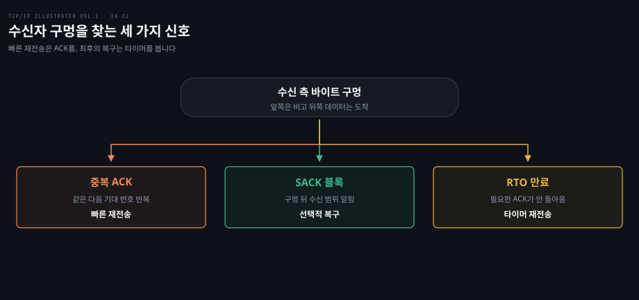
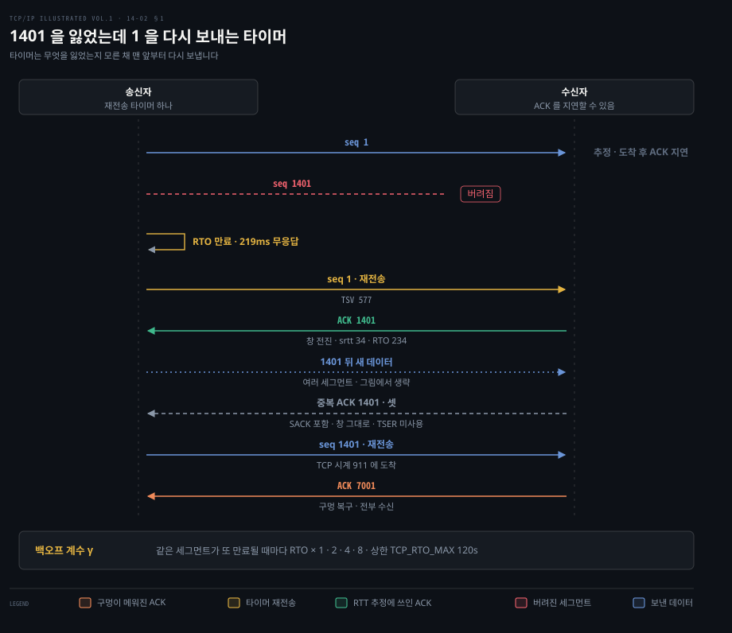
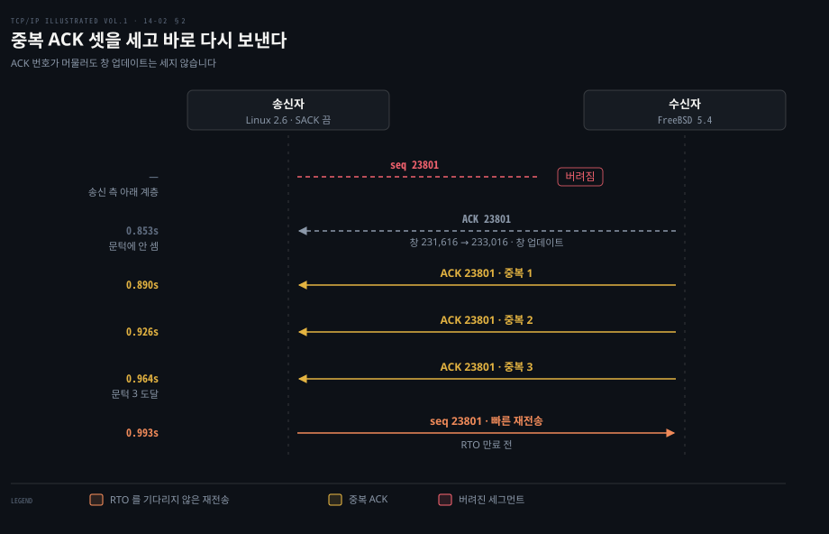
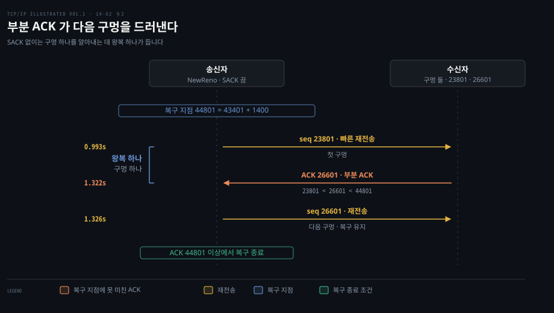
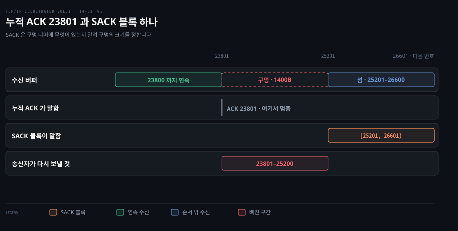

# 손실은 타이머보다 ACK 와 SACK 으로 빨리 찾는다

---

> 14장 가운데(§14.4–14.6)는 송신자가 확인받지 못한 바이트를 어떻게 다시 보낼지 다룹니다. 타이머 만료는 최후의 재시작 장치이고, 계속 들어오는 ACK 는 손실을 더 일찍 추론할 수 있게 합니다.

## 핵심 요약

> 이 편의 중심 생각은 TCP 가 기다림의 한계인 RTO 와 수신자의 피드백인 ACK·SACK 을 함께 써서 손실 복구 시점을 고른다는 것입니다.

타이머가 만료되면 가장 앞의 미확인 바이트를 다시 보내고 대기 간격을 늘립니다. 수신자가 구멍 뒤의 데이터를 받으면 같은 ACK 번호를 반복하므로 송신자는 RTO 전에도 손실을 의심할 수 있습니다. SACK 은 그 구멍 너머에서 받은 범위까지 알려 줍니다. 덕분에 송신자는 여러 손실을 한 왕복 시간 안에 고칠 수 있습니다.

원서의 NewReno 와 SACK 실험은 각각 특정 송수신자·네트워크 조건의 캡처입니다. 재전송 횟수와 시각을 모든 구현의 고정 규칙으로 일반화하지 않습니다.

## 학습 목표

> 이 편을 읽고 나면 다음을 설명할 수 있습니다.

1. 확인받지 못한 데이터가 있을 때 재전송 타이머가 어떻게 작동하는지 설명할 수 있습니다.
2. 중복 ACK 세 개가 손실의 단서가 되는 이유와 재정렬을 오인할 가능성을 말할 수 있습니다.
3. NewReno 의 복구 지점과 부분 ACK 가 여러 구멍을 처리하는 방식을 설명할 수 있습니다.
4. SACK 블록의 범위를 읽고 누적 ACK 만으로 알 수 없는 수신 상태를 추론할 수 있습니다.
5. SACK 이 송신 버퍼를 해제할 증거가 아닌 이유를 설명할 수 있습니다.

한 구멍을 고치더라도 방법은 여러 가지입니다. 왼쪽에서 오른쪽으로 진행하는 두 ACK 경로는 타이머를 기다리지 않습니다. 아래 경로는 피드백만으로 손실을 확신할 수 없을 때 복구를 시작합니다.

## 1. 타이머 만료는 멎은 연결을 다시 움직인다

> ACK 가 돌아오지 않아 RTO 가 만료되면 TCP 는 확인되지 않은 데이터부터 다시 보내고, 다음 만료 시점은 뒤로 미룹니다.

보낸 세그먼트가 망에서 사라지고 수신자도 아무 ACK 를 보내지 않으면 송신자가 받을 신호는 하나도 없습니다. 이 침묵을 깨는 장치가 재전송 타이머입니다. [14-01](./14-01.RTO%20는%20RTT%20의%20평균과%20흔들림으로%20정한다.md) 에서 정한 RTO 가 그 길이입니다.

원서 §14.4 는 연결에 아직 확인되지 않은 데이터가 있으면 재전송 타이머를 유지한다고 설명합니다. 앞선 §14.3 은 순서 번호를 차지하는 SYN·FIN 도 타이머 대상이라고 명시합니다. 정상적으로 ACK 가 계속 오면 타이머를 재설정하거나 취소할 뿐 실제 만료는 일어나지 않습니다. 원서는 이 때문에 TCP 구현에서 중요한 타이머 연산이 '만료'보다 '설정·재설정·취소'라고 짚습니다.

만료 시 TCP 는 확인되지 않은 가장 앞쪽 데이터를 다시 보냅니다. 같은 세그먼트가 계속 확인되지 않으면 사용 RTO 의 배수를 1, 2, 4, 8처럼 키웁니다. 손실 가능성이 커진 망에 같은 속도로 재전송을 쏟아붓지 않으려는 조절입니다. 타임아웃은 혼잡 제어의 송신 창도 줄이지만 그 절차는 원서 16장에서 다룹니다(§14.4).

원서 Figure 14-5 는 순서 번호 1401의 세그먼트를 두 차례 강제로 버린 예입니다. 먼저 1번과 1401번 세그먼트를 보냈고 1401번이 버려졌습니다. 원서는 1번이 수신자에 닿았지만 수신자가 ACK 를 지연해 바로 응답하지 않은 것으로 추정합니다. 약 219ms 뒤 타이머가 만료되어 송신자는 미확인 구간의 맨 앞인 1번을 재전송합니다. 이 재전송은 실제로 잃은 1401번을 처음부터 다시 보낸 것이 아닙니다. 재전송한 1번의 ACK 는 송신 창을 전진시키므로 송신자는 그 ACK 의 타임스탬프로 `srtt` 와 RTO 를 각각 34와 234로 갱신합니다.

원서 Figure 14-5 를 대신합니다. 위에서 아래로 시간이 흐릅니다. 오른쪽 글자는 그 순간 수신자 쪽 사정입니다. 녹색 ACK 는 점선 중복 ACK 셋(아래 문단)과 달리 창을 전진시키므로 RTT 추정에 쓰입니다.

중복 ACK 는 구멍 뒤의 데이터가 도착할 때 수신자가 되풀이해 보내는 같은 번호의 ACK 로, §2 에서 자세히 봅니다. 점선으로 그린 중복 ACK 셋은 RTT 추정에 쓰이지 않습니다. 그림의 'SACK 포함'은 이 ACK 가 구멍 너머에서 받은 범위도 함께 알린다는 뜻이며 §3 에서 다룹니다. 맨 아래 칸의 1·2·4·8 배는 이 실험에서 관측한 값이 아니라 같은 절의 일반 규칙입니다.

ACK 1401 이라는 번호는 원서 텍스트에 없습니다. 1–1400 만 받은 수신자의 누적 ACK 로 이끌어 낸 값입니다. 중복 ACK 셋을 만든 것은 1401 뒤에 보낸 새 데이터 세그먼트들인데, 그림에서는 한 줄로 줄이고 생략했다고 표시했습니다. ACK 7001 은 그 데이터까지 모두 받았다는 뜻입니다. ACK 7001 도 창을 전진시키므로 같은 규칙에 따라 추정 갱신 대상이지만, 원서는 그 값을 적지 않아 그림에서는 녹색으로 칠하지 않았습니다.

원서 텍스트에는 이 실험의 타이머 만료가 한 번만 나옵니다. 캡션이 말하는 두 번째 버림의 시점은 적혀 있지 않아 그리지 않았습니다.

뒤이어 오는 중복 ACK 는 송신 창을 전진시키지 못해 이 실험의 RTT 추정에 쓰지 않았습니다. 나중에 1401번이 재전송되어 구멍이 메워지자 ACK 7001이 돌아옵니다. 저자가 조작한 실험이며 평소 네트워크의 전형적 지연이 아닙니다.

## 2. 중복 ACK 는 기다리지 않고 손실을 의심하게 한다

> 수신자는 예상보다 뒤의 데이터를 받으면 현재 필요한 바이트 번호를 ACK 에 다시 적습니다. 반복되는 번호는 앞쪽에 구멍이 있다는 단서입니다.

### 왜 세 번을 기다리는가

§1 의 타이머는 RTO 만큼 침묵이 이어져야 움직입니다. 그런데 손실 뒤에도 수신자는 대개 침묵하지 않습니다. 송신자가 1–1400바이트를 보내고 다음 1401–2800바이트를 잃었으며 그 뒤의 바이트가 도착했다고 생각해 봅니다. 수신자는 순서대로 이어진 끝 다음인 1401을 계속 ACK 합니다. 뒤의 도착이 잇따르면 ACK 1401도 반복됩니다. 송신자는 일정 수의 중복 ACK 를 보고 그 바이트를 RTO 전에 다시 보내는 빠른 재전송을 할 수 있습니다(§14.5; [RFC 5681 §3.2](https://www.rfc-editor.org/rfc/rfc5681#section-3.2)).

하지만 앞선 세그먼트가 다른 경로에서 늦게 오는 재정렬도 같은 중복 ACK 를 만듭니다. 원서가 소개하는 전통적인 중복 ACK 문턱은 세 개입니다. 문턱 셋은 '손실이 증명됐다'는 뜻이 아니라 약한 재정렬을 견디기 위한 추론 규칙입니다. 원서의 일부 구현은 관측한 재정렬 정도에 따라 문턱을 바꾸기도 합니다. 현재 특정 운영체제의 고정 기본값이라는 뜻으로 읽지 않습니다.

같은 ACK 번호라고 모두 중복 ACK 로 세는 것은 아닙니다. 원서 Figure 14-7–14-8 에서 0.853초에 온 ACK 23801은 광고 창 값이 달라진 창 업데이트라 문턱에 넣지 않았습니다. 0.890, 0.926, 0.964초의 ACK 23801 세 개를 센 뒤 0.993초에 순서 번호 23801의 세그먼트를 다시 보냈습니다. 책 그림을 보지 않아도 판단 순서는 'ACK 번호가 머묾 → 창 업데이트는 제외 → 세 중복 ACK → 즉시 재전송'입니다.

원서 Figure 14-7·14-8 을 대신합니다. 왼쪽 열은 송신자가 각 ACK 를 받은 캡처 시각입니다. 0.853초의 ACK 는 번호가 같아도 광고 창이 231,616바이트에서 233,016바이트로 바뀐 창 업데이트라 세지 않습니다. 노란 중복 ACK 세 개를 센 직후 강조한 재전송이 나갑니다. 그때까지 RTO 는 만료되지 않았습니다.

### 부분 ACK 는 두 번째 구멍을 알려 줍니다

원서 Figure 14-6–14-8 의 실험은 SACK 을 쓰지 않습니다. 여기서는 둘 이상의 세그먼트가 빠집니다. 처음 빠른 재전송을 하기 직전, 송신자는 그때까지 보낸 가장 높은 순서 번호를 복구 지점으로 기억합니다. 원서 예시에서는 다음 기대 ACK 번호 기준으로 44801입니다. 첫 구멍을 메운 ACK 가 23801에서 26601로 올라가도 복구 지점에는 못 미칩니다. 이런 ACK 를 부분 ACK 라고 부릅니다.

NewReno 송신자는 부분 ACK 를 받으면 복구를 마쳤다고 판단하지 않고 새로 드러난 구멍 26601을 다시 보냅니다. 누적 ACK 만 보면 앞 구멍이 메워지고 ACK 가 올라와야 다음 구멍을 확실히 알 수 있습니다. 그래서 여러 손실을 복구하는 데 구멍당 왕복 시간 하나가 들 수 있습니다. 원서는 예전 Reno 변형에서는 부분 ACK 개념 없이 복구를 일찍 끝내 성능 문제가 생길 수 있다고 비교합니다(§14.5.1).

원서 Figure 14-8 아래쪽의 두 번째 재전송을 따로 떼어 그린 것입니다. 복구 지점 44801 은 첫 재전송 직전에 보낸 마지막 세그먼트 43401 에 1400 을 더한 값입니다. 0.993초에 보낸 재전송의 답이 1.322초에 ACK 26601 로 돌아옵니다. 송신자는 4ms 뒤인 1.326초에 26601 을 다시 보냅니다. 왼쪽 괄호가 구멍 하나를 알아내는 데 든 왕복 하나입니다.

## 3. SACK 은 받은 범위를 따로 알려 준다

> 누적 ACK 는 순서대로 이어진 접두부만 확정합니다. SACK 은 그 뒤에 수신자가 갖고 있는 연속 바이트 범위를 보내 송신자가 구멍을 가려내게 합니다.

### 블록의 오른쪽 경계는 다음 바이트입니다

§2 의 결론은 누적 ACK 만 보는 송신자가 구멍 하나를 알아내는 데 왕복 시간 하나를 쓴다는 것이었습니다. 수신자가 구멍 너머에 무엇을 갖고 있는지 직접 말해 주면 이 기다림이 줄어듭니다. 그 말을 싣는 자리가 SACK 옵션입니다.

SACK 은 연결을 열 때 양쪽이 SACK-Permitted 옵션으로 능력을 알린 뒤 ACK 에 실을 수 있습니다. 각 블록에는 수신한 연속 범위의 왼쪽 경계와 오른쪽 경계가 들어갑니다. 오른쪽은 마지막 수신 바이트가 아니라 그 다음 순서 번호입니다. 예를 들어 누적 ACK 가 23801이고 SACK 블록이 `[25201, 26601)`이면 수신자는 25201–26600을 보관했고 그 앞의 23801–25200은 이어져 있지 않습니다(§14.6; 원서 Figure 14-11).

원서 Figure 14-11 을 대신합니다. 가로축은 바이트 번호입니다. 누적 ACK 는 23801 에서 멈춘 경계선 하나라 그 뒤의 섬을 표현하지 못합니다. 강조한 SACK 블록이 25201–26600 을 따로 알립니다. 송신자는 두 정보 사이의 23801–25200, 곧 23801 에서 시작하는 1400바이트 세그먼트 하나만 다시 보내면 됩니다.

SACK 옵션 길이는 블록 `n`개일 때 `8n+2`바이트입니다. TCP 옵션 공간이 최대 40바이트라 단독으로는 최대 네 블록, Timestamps 옵션과 함께 쓸 때는 통상 세 블록이 들어갑니다. 수신자는 새로 받은 범위를 첫 블록에 넣고 앞서 알린 블록을 뒤에 반복할 수 있습니다. ACK 자체가 사라질 수 있으므로 이 반복 덕에 수신 상태 정보가 다시 전해질 수 있습니다(§14.6.1; [RFC 2018 §4](https://www.rfc-editor.org/rfc/rfc2018#section-4)).

### 송신자는 SACK 점수를 보고 다시 보낼 바이트를 고릅니다

SACK 송신자는 누적 ACK 와 SACK 범위를 함께 기억합니다. 그래서 수신자가 이미 갖고 있다고 보고한 부분은 다시 보내지 않습니다. 허용된 송신량 안에서 수신자의 구멍부터 메우면 한 왕복 시간에 여러 구멍을 고칠 수 있습니다. 책의 SACK 실험은 첫 구멍을 메운 ACK 를 기다리기 전에 뒤쪽 손실도 알아내 다시 보냅니다. 원서 Figure 14-11 의 첫 SACK 은 창 업데이트라 중복 ACK 로 세지 않습니다. §2 에서 본 창 업데이트 규칙과 같으며 이 구현만의 특성은 아닙니다(§14.6.3).

그다음 SACK 을 실은 첫 중복 ACK 가 오자 세 번을 기다리지 않고 빠른 재전송을 시작합니다. 뒤따르는 ACK 두 개가 두 번째 재전송도 허용했습니다. 이 조기 시작은 해당 구현의 실험 결과이지 모든 SACK 송신자의 고정 문턱은 아닙니다(§14.6.2–14.6.3).

> **원문 정오**: 원서 §14.6.3 첫 문단과 Figure 14-9 설명은 SACK 실험이 앞 실험과 같은 설정에서 23601 과 28801 을 버렸다고 적습니다. 그러나 그 설정인 §14.5.1 은 23801 과 26601 을 버립니다. 같은 §14.6.3 의 Figure 14-11 설명도 구멍을 [23801, 25200] 으로, 두 재전송을 23801 과 26601 로 적습니다. 0.967초 SACK 의 블록 [28001, 29401] 은 28801 을 이미 받았다는 뜻이기도 합니다. 그래서 이 노트는 23801·26601 을 씁니다. 같은 절이 재전송 직전에 보낸 가장 높은 순서 번호 43400 을 견주며 "Figure 14-5 의 NewReno 예"라고 부르는 것도 실제로는 §14.5.1 의 Figure 14-6–14-8 을 가리킵니다. Figure 14-5 는 타이머 재전송 예입니다.

다만 SACK 블록은 권고 정보입니다. 수신자가 순서 밖 데이터를 버리고 이전 SACK 을 철회하는 'reneging'이 가능합니다. 그래서 송신자는 SACK 만 보고 원본 바이트를 재전송 버퍼에서 버리면 안 됩니다. 누적 ACK 가 그 바이트를 지나야 비로소 버릴 수 있습니다. 원서는 RTO 만료 뒤에는 이전 SACK 기반의 순서 밖 수신 기록을 잊고 다시 판단한다고 설명합니다(§14.6.2). SACK 이 '한 번 받았다는 힌트'이고 누적 ACK 가 '연속적으로 확정한 범위'인 차이입니다.

## 4. SACK 의 이익은 경로와 손실 형태에 달렸다

> SACK 은 한 ACK 에 더 많은 위치 정보를 담지만, 실제 완료 시간은 RTT·손실 정도·혼잡 제어에 함께 좌우됩니다.

§1–§3 에서 손실을 찾는 증거 세 가지를 봤습니다. 캡처에서 재전송을 만났을 때 어느 증거가 재전송을 촉발했는지 가려야 지연의 원인을 짚을 수 있습니다. 세 증거를 같은 축으로 놓으면 다음과 같습니다. 시점 칸의 수치는 원서 실험의 관측치입니다.

| 축 | 타이머 재전송 | 중복 ACK 빠른 재전송 | SACK 복구 |
|---|---|---|---|
| 촉발 증거 | RTO 동안 창을 전진시키는 ACK 가 없음 | 같은 번호의 중복 ACK 가 문턱(전통적으로 3)만큼 | SACK 블록을 실은 중복 ACK |
| 시점 | RTO 만료 뒤, 원서 예 약 219ms | RTO 전, 원서 예 셋째 중복 ACK 뒤 0.993초 | 원서 구현은 첫 SACK 중복 ACK(0.967초) 직후 |
| 다시 보내는 것 | 미확인 구간의 맨 앞 | ACK 번호가 가리키는 구멍 하나, 부분 ACK 마다 다음 구멍 | 블록 사이의 구멍들, 한 RTT 에 여럿 |
| 전제 | 미확인 데이터가 있으면 늘 동작 | 구멍 뒤 데이터가 도착해 ACK 를 만들어야 함 | 양쪽 SACK-Permitted 협상과 SACK 송신자 구현 |
| 한계 | 대기가 길고 재만료마다 두 배 | 재정렬을 손실로 오인할 수 있고 구멍당 RTT 하나 | 블록 수 3~4개, reneging 때문에 버퍼 해제 근거가 아님 |

원서의 비교에서는 비 SACK NewReno 전송이 131,074바이트를 3.592초에 마치고 SACK 전송은 3.674초에 마쳤습니다. 저자는 이것을 SACK 이 느리다는 근거로 삼지 않습니다. 두 번의 실험이 같은 네트워크 조건이 아니었고 시뮬레이션도 아니었기 때문입니다. §14.6.3 은 RTT 가 길고 여러 세그먼트가 빠질 때 SACK 의 '한 RTT 에 여러 구멍 복구' 이점이 더 잘 나타난다고 해석합니다.

캡처를 볼 때는 '재전송이 몇 번인가'만 세지 말고 그 직전에 어떤 ACK 가 왔는지 확인해야 합니다. RTO 만료였다면 오래 ACK 가 없었는지, 빠른 재전송이라면 같은 ACK 번호가 반복됐는지, SACK 복구라면 블록이 어느 바이트를 이미 수신했다고 말하는지 확인합니다. 원서의 Figure 14-6·14-9를 읽는 기준도 이 순서입니다.

## 면접 대비

> 아래 질문에 답하면서 '어떤 증거가 재전송을 촉발했는가'를 함께 말해 보세요.

1. 빠른 재전송은 타이머 재전송과 어떤 증거를 다르게 쓰나요?
2. 누적 ACK 23801과 SACK `[25201, 26601)`은 각각 무엇을 알려 주나요?
3. SACK 으로 받은 데이터를 확인했는데도 송신 버퍼에서 바로 지우지 않는 이유는 무엇인가요?
4. NewReno 송신자가 ACK 26601 을 받고도 복구를 끝내지 않는 이유는 무엇이고, 다음에 무엇을 보내나요?
5. 중복 ACK 를 하나가 아니라 세 개까지 기다리는 이유는 무엇이고, 같은 번호의 ACK 가운데 문턱에 세지 않는 것은 무엇인가요?

## 정답 (자답 후 펼치기)

> 위 §면접 대비의 질문에 먼저 스스로 답한 뒤 읽으세요.

### 정답 1 — 타이머와 피드백

타이머 재전송은 RTO 안에 필요한 ACK 가 오지 않았다는 시간 조건으로 시작합니다. 빠른 재전송은 중복 ACK 로 앞쪽 손실을 추론합니다. 중복 ACK 는 뒤의 데이터가 도착했음을 암시하므로 타이머를 기다리지 않을 수 있습니다.

### 정답 2 — 접두부와 순서 밖 범위

누적 ACK 23801은 그 앞의 바이트가 연속으로 확인됐고 다음에는 23801을 기대한다는 뜻입니다. SACK `[25201, 26601)`은 그 뒤의 25201–26600도 수신자가 보관한다는 뜻입니다. 그러니 사이의 23801–25200 구간은 비어 있다고 짐작할 수 있습니다.

### 정답 3 — SACK reneging

수신자는 순서 밖 데이터를 나중에 버릴 수 있으므로 SACK 은 송신 버퍼 해제의 확정 증거가 아닙니다. 누적 ACK 가 해당 데이터를 지나가야 연속 수신이 확정되어 원본 바이트를 버릴 수 있습니다.

### 정답 4 — 복구 지점과 부분 ACK

송신자는 첫 빠른 재전송 직전에 보낸 가장 높은 순서 번호로 복구 지점 44801 을 기억합니다. ACK 26601 은 이전 최고값 23801 보다 크지만 44801 에 못 미치는 부분 ACK 라서 아직 다른 구멍이 남아 있습니다. NewReno 송신자는 복구를 이어 가며 새로 드러난 26601 을 곧바로 다시 보냅니다.

### 정답 5 — 재정렬 내성과 창 업데이트

앞선 세그먼트가 다른 경로로 늦게 와도 같은 중복 ACK 가 생기므로 하나만 보고 재전송하면 재정렬을 손실로 오인하기 쉽습니다. 문턱 셋은 약한 재정렬을 견디려는 추론 규칙이지 손실의 증명이 아닙니다. 데이터 없이 광고 창만 바뀐 창 업데이트는 번호가 같아도 세지 않으며, 원서 실험의 0.853초 ACK 가 그 예입니다.

## 참고 자료

> 원문 §14.4–14.6 의 실험과 ACK·SACK 규칙을 대조했습니다.

- Kevin R. Fall · W. Richard Stevens, 《TCP/IP Illustrated, Volume 1: The Protocols》, 2nd ed., Ch.14 §14.4–14.6, ISBN 978-0-321-33631-6.
- [RFC 5681: TCP Congestion Control](https://www.rfc-editor.org/rfc/rfc5681).
- [RFC 2018: TCP Selective Acknowledgment Options](https://www.rfc-editor.org/rfc/rfc2018).

## 관련 문서

> 앞 편의 타이머 계산을 실제 재전송 결정에 연결하고, 다음 편에서 손실 추론이 틀렸을 때의 복구를 살펴봅니다.

- [14-01. RTO 추정](./14-01.RTO%20는%20RTT%20의%20평균과%20흔들림으로%20정한다.md) — 타이머 간격의 계산 근거입니다.
- [13-02. TCP 옵션](./13-02.TCP%20옵션은%2040바이트%20안에서%20능력과%20한계를%20알린다.md) — SACK 옵션의 형식과 협상입니다.
- [14-03. 잘못된 재전송](./14-03.재전송은%20지연과%20재정렬에도%20속을%20수%20있다.md) — 재정렬과 중복 패킷이 빠른 재전송을 속이는 상황입니다.
