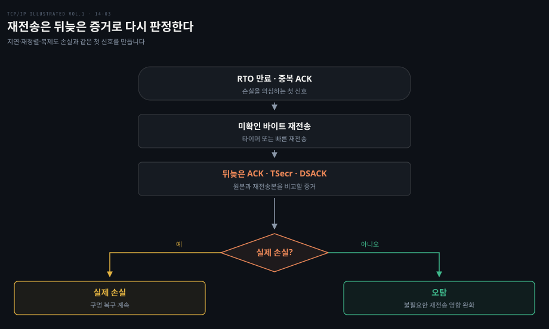
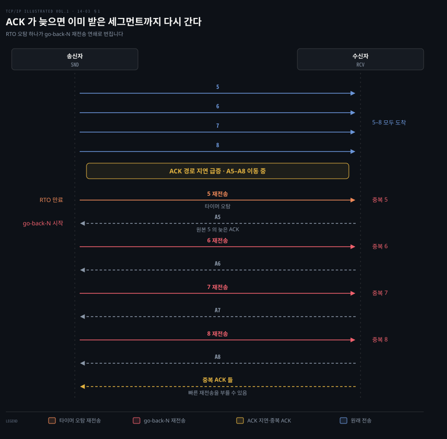
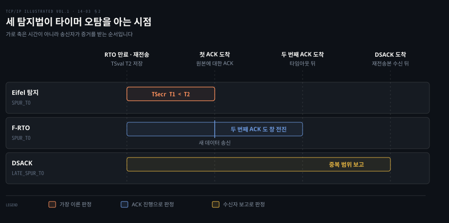
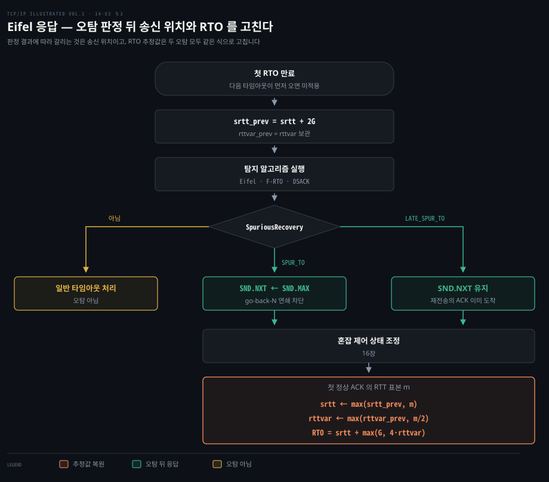
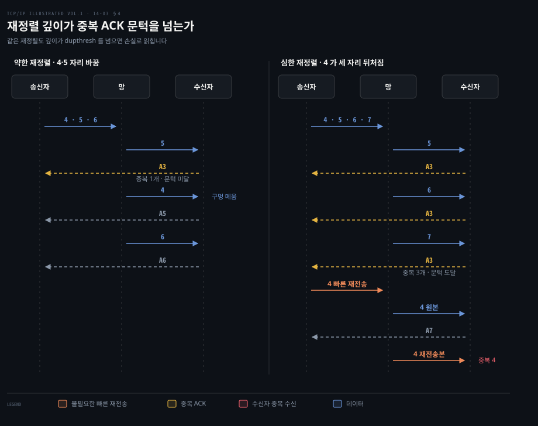
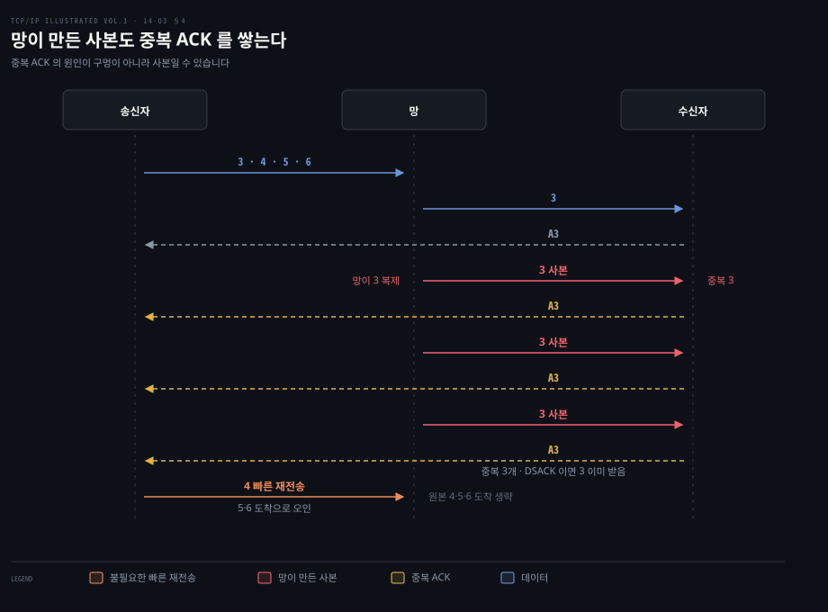
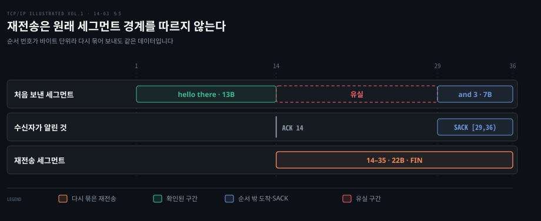

# 재전송은 지연과 재정렬에도 속을 수 있다

---

> 14장 뒷부분(§14.7–14.12)은 재전송의 전제가 틀릴 수 있음을 살핍니다. 실제 손실 없이 지연·순서 뒤바뀜·패킷 복제가 생겨도 RTO 나 중복 ACK 는 송신자에게 손실처럼 보일 수 있습니다.

## 핵심 요약

> 이 편의 중심 생각은 재전송이 어디까지나 손실에 대한 추론이며, 그 추론이 틀렸음을 되돌아오는 ACK·타임스탬프·DSACK 으로 뒤늦게 알아낼 수 있다는 것입니다.

원서는 잘못된 타이머 만료와 빠른 재전송을 다룹니다. 중복 선택 확인(Duplicate SACK, DSACK)·Eifel·F-RTO 로 오탐을 가리는 방법도 비교합니다. 이어 데이터 경로와 ACK 경로의 재정렬, 패킷 복제가 같은 증상을 만드는 이유를 설명합니다. 마지막으로 연결을 넘어 남기는 경로 측정값, 바이트 번호 덕분에 가능한 재패킷화, 재전송 타이밍을 악용하는 공격을 연결합니다.

알고리즘의 RFC 명칭은 해당 문서에 실린 기법의 이름입니다. 이름이 붙었다고 모든 TCP 가 이 기법을 전부 사용하지는 않습니다.

## 학습 목표

> 이 편을 읽고 나면 다음을 설명할 수 있습니다.

1. 실제 손실이 없어도 재전송이 일어나는 두 경로를 구분할 수 있습니다.
2. DSACK·Eifel 탐지·F-RTO 가 각각 어떤 증거로 오탐을 판단하는지 비교할 수 있습니다.
3. Eifel 응답 알고리즘이 오탐 판정 뒤 송신 위치와 RTO 추정값을 어떻게 다루는지 설명할 수 있습니다.
4. 데이터·ACK 재정렬과 패킷 복제가 송신자에게 남기는 신호를 읽을 수 있습니다.
5. 경로 측정값 재사용, 재패킷화, 저속 DoS 가 재전송과 어떻게 연결되는지 설명할 수 있습니다.

첫 신호만으로 실제 손실을 확정할 수 없습니다. §1–§3은 오른쪽의 판단 근거를, §4는 첫 신호가 왜 거짓으로 나타나는지를 설명합니다.

## 1. 늦은 ACK 는 없어진 세그먼트처럼 보인다

> RTT 가 갑자기 RTO 보다 길어지면 전송 원본이 살아 있어도 타이머가 먼저 울립니다.

송신자는 RTO 가 다 지나도록 ACK 가 오지 않으면 세그먼트가 사라졌다고 보고 다시 보냅니다. 그런데 세그먼트는 멀쩡히 도착했고 ACK 만 늦게 오는 중이라면 이 판단은 틀립니다. 타이머가 울린 순간의 송신자에게는 두 경우를 가를 정보가 아직 없습니다.

원서 §14.7 은 무선 구간 등의 지연 급증, 순서 뒤바뀜, 패킷 복제, ACK 손실이 불필요한 재전송을 일으킬 수 있다고 설명합니다. Figure 14-12에서는 데이터 8번을 보낸 뒤 ACK 경로가 늦어져 5번의 RTO 가 만료됩니다. 5번의 원래 전송에 대한 ACK 는 아직 돌아오는 중인데 송신자는 5번을 다시 보냅니다. 이어 도착하는 예전 ACK 들에 맞춰 이미 수신된 6·7·8번까지 다시 보내는 비효율적인 go-back-N 형태가 나타납니다.

이 그림은 설명을 위해 실제 TCP 와 달리 바이트 대신 패킷 번호를 쓴 도식입니다. ACK 도 다음에 기대하는 번호가 아니라 이미 도착한 번호를 가리킵니다. A5 는 5까지 도착했음을 나타냅니다.

원서 Figure 14-12 를 대신합니다. 위쪽 네 줄에서 5–8 은 이미 모두 도착했습니다. 노란 띠는 그 ACK 들이 아직 돌아오는 중임을 표시합니다. 주황 화살표가 타이머 오탐으로 나간 5 재전송입니다. 그 아래 빨간 재전송 셋은 늦은 ACK 가 하나 올 때마다 다음 번호가 끌려 나간 go-back-N 연쇄입니다. 원서 본문은 'ACK 된 세그먼트의 다음부터' 다시 보낸다고만 적었으므로 그림은 늦은 ACK 하나에 재전송 하나를 잇는 모양으로 그렸습니다.

불필요한 재전송은 세그먼트 하나가 더 나가는 데서 끝나지 않습니다. 중복 데이터가 수신자에게 중복 ACK 를 만들고 송신자는 그것을 다시 손실 단서로 받아들일 수 있습니다. 타임아웃에 반응하는 혼잡 제어도 불필요하게 송신량을 줄일 수 있습니다.

탐지 알고리즘은 '재전송이 필요했는가'를 판단합니다. 응답 알고리즘은 그 뒤의 송신 상태를 조정합니다(§14.7).

## 2. 오탐 탐지는 세 가지 다른 증거를 쓴다

> 수신한 중복 바이트, 돌려받은 전송 시각, 타임아웃 뒤의 ACK 진행은 각각 다른 시점에 재전송의 필요성을 알려 줍니다.

앞 절의 송신자가 오탐을 일찍 알아챌 수 있다면 go-back-N 연쇄의 대부분을 피할 수 있습니다. 그렇게 하려면 '재전송이 필요 없었다'는 증거가 어디서 오고 언제 도착하는지를 알아야 합니다. 원서 §14.7.1–14.7.3 에는 서로 다른 증거를 쓰는 세 방법이 나옵니다. 아래 표는 셋을 같은 축으로 놓은 것입니다.

| 방법 | 필요한 정보 | 판단의 근거 | 제약 |
|---|---|---|---|
| DSACK (§14.7.1) | SACK 블록 | 수신자가 같은 바이트를 두 번 받았다는 보고 | 두 번째 사본이 도착하고 DSACK 이 돌아와야 함 |
| Eifel 탐지 (§14.7.2) | Timestamps 옵션 | ACK 의 `TSecr` 가 재전송 시각보다 이전 | 타임스탬프 협상 필요 |
| F-RTO (§14.7.3) | 타임아웃 뒤의 ACK 진행 | 새 데이터를 보낸 뒤 두 ACK 가 창을 전진시킴 | 타이머 오탐 탐지에 한정 |

표의 제약 칸은 결국 판정 시점의 차이입니다. 같은 타이머 오탐 하나에 세 방법을 놓으면 송신자가 증거를 받는 자리가 다릅니다.

가로 축은 시간이 아니라 송신자가 증거를 받는 순서입니다. Eifel 은 원본에 대한 첫 ACK 하나로 판정할 수 있어 막대가 가장 짧습니다. F-RTO 는 첫 ACK 를 받고 새 데이터를 보낸 뒤 두 번째 ACK 까지 봅니다. DSACK 은 재전송본이 수신자에 닿아야 만들어지고 다시 송신자로 돌아와야 쓸 수 있어 가장 늦습니다.

원서 §14.7.4 는 Eifel·F-RTO 처럼 일찍 잡은 오탐과 DSACK 처럼 늦게 잡은 오탐을 나눕니다. 이 구분이 §3 의 `SPUR_TO`·`LATE_SPUR_TO` 입니다. 칸 사이의 실제 간격은 경로마다 다르므로 이 그림이 시간 차를 재 주지는 않습니다.

### DSACK 은 두 번째 사본이 도착했다는 사실을 전합니다

원래 SACK 은 누적 ACK 너머에 받은 범위를 알렸습니다. DSACK 은 첫 SACK 블록으로 중복 수신한 바이트 범위를 표시합니다. 이미 누적 ACK 아래에 있는 바이트나, 아직 순서 밖에 있지만 두 번 받은 바이트 모두 표현할 수 있습니다. 기존 SACK 형식을 쓰므로 별도의 옵션 협상이 필요하지 않습니다. 다만 DSACK 정보는 한 ACK 에만 실리고 반복하지 않아 그 ACK 가 사라지면 증거도 사라질 수 있습니다(§14.7.1; [RFC 2883](https://www.rfc-editor.org/rfc/rfc2883)).

DSACK 만으로 원인을 언제나 하나로 확정할 수는 없습니다. 중복 수신은 불필요한 재전송 외에 망 내부의 복제에서도 생깁니다. 원서도 짚듯이 RFC 2883은 DSACK 을 받은 송신자가 구체적으로 무엇을 해야 하는지 정하지 않습니다.

### Eifel 은 재전송 이전의 타임스탬프를 찾습니다

Eifel 탐지는 재전송할 때의 `TSval` 을 저장합니다. 해당 바이트를 덮는 첫 ACK 가 돌아왔을 때 `TSecr` 가 저장한 재전송 타임스탬프보다 작으면 그 ACK 는 재전송본보다 앞선 원본을 확인한 것입니다. 이때는 재전송이 필요 없었다고 판단할 수 있습니다. 원본에 대한 ACK 는 재전송본이 수신자에 도착하기 전에 돌아오기도 하므로 DSACK 보다 일찍 알아낼 수 있습니다(§14.7.2; [RFC 3522](https://www.rfc-editor.org/rfc/rfc3522)).

원서는 Eifel 탐지에 DSACK 을 결합할 때의 예외도 설명합니다. 한 창에 해당하는 ACK 가 전부 사라졌지만 원본과 재전송본이 모두 도착했다면 돌아온 DSACK 은 중복 수신을 알립니다. 이 경우 기본 Eifel 판정은 오탐입니다. 하지만 DSACK 결합 판정에서는 ACK 손실이 심하다는 사실을 고려해 해당 재전송을 오탐으로 처리하지 않을 수 있습니다(§14.7.2).

### F-RTO 는 새 데이터를 보내 본 뒤 ACK 진행을 봅니다

F-RTO 는 TCP 옵션 없이 타이머 오탐을 가리는 방식입니다. 타임아웃으로 가장 앞의 미확인 바이트를 재전송한 뒤 첫 ACK 가 창을 전진시키면 이전 바이트들을 차례로 되풀이하기보다 아직 보내지 않은 새 데이터를 보냅니다. 타임아웃 뒤의 첫 두 ACK 중 하나라도 중복 ACK 면 오탐의 증거가 부족해 일반 복구로 돌아갑니다. 둘 다 창을 전진시키면 원래 재전송이 불필요했다고 판단합니다. 새 데이터가 수신자의 창을 전진시키는지 확인하는 탐침인 셈입니다. 이 설명은 원서의 간략화된 흐름이며 자세한 조건은 [RFC 5682](https://www.rfc-editor.org/rfc/rfc5682)에 있습니다(§14.7.3).

## 3. Eifel 응답은 탐지 결과를 송신 상태에 반영한다

> '오탐이었다'는 판정과 '그다음에 어떻게 보낼까'는 별개의 문제입니다. 원서의 Eifel 응답은 타이머 오탐 뒤의 불필요한 재전송 연쇄를 끊고 RTO 를 다시 정합니다.

앞 절의 세 방법은 '재전송이 필요 없었다'는 판정까지만 내립니다. 판정이 나올 무렵 송신자는 이미 타이머 만료에 맞춰 평소의 조치를 한 뒤입니다. 그 조치를 무엇부터 되돌리거나 누그러뜨릴지 정하는 몫이 응답 알고리즘입니다(§14.7).

원서 §14.7.4 의 Eifel 응답 알고리즘은 탐지 수단을 Eifel 탐지로 제한하지 않습니다. DSACK 이나 F-RTO 의 판단과도 결합할 수 있습니다. 다만 원서가 설명하는 RFC 4015의 범위는 타이머 기반 재전송입니다. 빠른 재전송의 모든 오탐에 그대로 적용한다고 읽으면 안 됩니다.

첫 타이머 만료 때 알고리즘은 `srtt_prev = srtt + 2G`, `rttvar_prev = rttvar` 를 보관합니다. `G` 는 타이머 정밀도입니다. 지연이 약간 늘어서 RTO 가 빠듯했다면 평균에 `2G`를 더한 값이 다음 판단의 하한 역할을 합니다.

원서에서 빠른 오탐 판정 `SPUR_TO` 를 얻었다면 다음 송신 위치 `SND.NXT` 를 새 데이터가 시작하는 `SND.MAX` 로 옮겨 go-back-N 연쇄를 줄입니다. 뒤늦은 판정 `LATE_SPUR_TO` 에서는 초기 재전송에 대한 ACK 가 이미 왔으므로 송신 위치를 바꾸지 않습니다. 두 경우 모두 혼잡 제어 상태를 다루는 응답이 이어지는데, 원서는 이 상태를 reset 한다고만 적습니다. [RFC 4015](https://www.rfc-editor.org/rfc/rfc4015) §3.4 는 이를 타임아웃 전 상태로 되돌리는(reverse) 단계로 정합니다.

다만 아직 확인되지 않은 데이터를 처음 확인하는 ACK(RFC 의 acceptable ACK, 아래 「정상 ACK」)가 ECN-Echo 비트를 켜고 있으면 되돌리지 않습니다. ECN-Echo 는 망이 혼잡을 표시했다고 수신자가 되돌려 주는 비트로 [12-01 §8](./12-01.TCP%20의%20신뢰성은%20재전송·번호·창으로%20만든다.md) 의 ECE 입니다. 혼잡 제어 상태의 세부 규칙은 원서 16장에서 다룹니다.

이후 타임아웃 뒤에 보낸 데이터의 첫 정상 ACK 에서 얻은 RTT 표본 `m` 으로 `srtt ← max(srtt_prev, m)`, `rttvar ← max(rttvar_prev, m/2)` 를 적용합니다. RTO 는 `srtt + max(G, 4(rttvar))` 로 다시 계산합니다. 원서의 의도는 경로 RTT 가 정말 늘었으면 작은 과거 추정값을 버리고 잠깐의 지연이었다면 불필요하게 추정값을 낮추지 않는 것입니다. 한 번 더 타임아웃이 나면 이 응답 절차를 적용하지 않는다는 제한도 있습니다(§14.7.4; [RFC 4015](https://www.rfc-editor.org/rfc/rfc4015)).

세 갈래로 나뉘는 것은 다음 송신 위치뿐입니다. 오탐으로 판정된 두 갈래는 같은 혼잡 제어 응답과 같은 추정값 식으로 다시 합쳐집니다. 맨 아래 식은 보관값과 새 표본 중 큰 쪽만 남기므로 원서의 말대로 이 응답을 거쳐 `srtt`·`rttvar` 가 줄어드는 일은 없습니다. RTT 가 늘지 않았다면 추정값은 그대로입니다. 타임아웃이 있었다는 사실은 사실상 무시됩니다.

## 4. 재정렬과 패킷 복제는 손실과 같은 신호를 만든다

> TCP 는 받은 순서가 보낸 순서와 달라진 까닭을 ACK 번호 하나로 구분할 수 없습니다.

### 데이터 방향과 ACK 방향의 재정렬은 다르게 보입니다

IP 는 패킷 도착 순서를 보장하지 않습니다. 경로가 바뀌거나 라우터 내부 처리 시간이 달라지면 뒤에 보낸 데이터가 먼저 도착하기도 합니다. 이때 수신자는 앞쪽 바이트를 계속 기대하므로 중복 ACK 를 보냅니다. 약한 재정렬이면 송신자가 중복 ACK 문턱에 닿기 전에 늦은 원본이 도착해 복구됩니다. 원서 Figure 14-13의 심한 재정렬은 세 중복 ACK 를 만들어 불필요한 빠른 재전송을 유발합니다(§14.8.1).

원서 Figure 14-13 을 대신합니다. 가운데 망 레인은 보낸 순서와 도착 순서를 나눠 보이려고 둔 자리입니다. ACK 표기는 §1 처럼 이미 도착한 번호입니다. 왼쪽은 4 와 5 가 자리만 바꿔 중복 ACK 가 하나에 그치므로 dupthresh 3 에 못 미쳐 송신자가 무시합니다. 오른쪽은 4 가 세 자리 뒤처져 5·6·7 이 각각 중복 ACK 를 만듭니다. 셋째 중복 ACK 에서 빠른 재전송이 불립니다. 늦게 닿은 원본 4 와 재전송본 4 가 모두 도착하므로 수신자는 4 를 두 번 받습니다.

왼쪽 패널의 패킷 번호는 원서 본문에 없어 오른쪽과 대비되도록 골랐습니다. 두 사본 가운데 어느 쪽이 먼저 닿는지도 원서가 정하지 않아, 그림은 원본이 먼저 닿는 쪽으로 그렸습니다.

반대 방향인 ACK 경로가 재정렬되면 송신자에게 갑자기 크게 전진한 ACK 가 먼저 오고 예전 ACK 가 뒤이어 옵니다. 원서에 따르면 뒤늦은 예전 ACK 는 폐기되지만 송신이 한꺼번에 몰릴 수 있습니다. 데이터와 ACK 가 비대칭 경로를 지날 수 있으므로 어느 방향의 재정렬인지 구분해 캡처를 읽어야 합니다.

### 복제도 중복 ACK 를 세 번 만들 수 있습니다

망이나 링크 계층이 같은 패킷을 여러 번 전달하면 수신자가 같은 바이트를 중복 수신합니다. 원서 Figure 14-14에서는 패킷 3이 세 번 복제되어 중복 ACK 가 잇따릅니다. 비 SACK 송신자는 이를 뒤쪽 데이터의 도착으로 잘못 읽고 빠른 재전송을 합니다. DSACK 이 있으면 중복 ACK 에서도 '새 순서 밖 데이터'가 아니라 '이미 받은 같은 바이트'라는 정보를 볼 수 있어 원인을 가르는 데 도움이 됩니다(§14.8.2). 그러나 DSACK 하나만으로 망 복제와 불필요한 재전송 중 원인을 항상 확정할 수는 없습니다.

원서 Figure 14-14 를 대신합니다. 망이 3 을 세 번 더 전달하자 수신자는 사본마다 같은 A3 을 되풀이합니다. 비 SACK 송신자는 이 중복 ACK 셋을 4 가 빠진 채 5·6 이 먼저 도착한 신호로 읽고 4 를 다시 보냅니다. 원서는 원본 4·5·6 이 언제 닿는지 적지 않아 그림에는 송신만 두고 도착은 그리지 않았습니다. 마지막 중복 ACK 아래의 DSACK 표시가 송신자가 이 오인을 피할 수 있는 단서입니다.

## 5. 배운 RTT 와 세그먼트 모양도 재전송에 영향을 준다

> 연결이 끝난 뒤에도 경로 측정값을 참고할 수 있고, 다시 보낼 때에는 원래 세그먼트 경계를 그대로 지킬 필요가 없습니다.

### 목적지 측정값은 새 연결의 출발점을 바꿀 수 있습니다

앞의 §1 에서 본 오탐은 RTT 추정이 현실보다 작을 때 생겼습니다. 그런데 같은 상대에게 새 연결을 열면 `srtt`·`rttvar` 같은 경로 추정을 처음부터 다시 쌓아야 합니다. 원서는 예전 TCP 가 연결이 닫히면 배운 값을 함께 잃었다고 적습니다.

원서 §14.9 는 일부 구현이 RTT·편차·경로 MTU 같은 목적지 측정값을 연결 밖의 라우팅·전달 테이블에 남겨 후속 연결의 초기 추정에 쓴다고 설명합니다. 예로 든 Linux 2.6의 `ip route show cache` 출력에는 `rtt 29ms`, `rttvar 29ms`, `mtu 1500`, `advmss 1460` 등이 보입니다. 이것은 책이 촬영한 당시의 경로 캐시와 명령 출력입니다. 지금 같은 명령이 같은 필드를 보여 준다고 가정하지는 않습니다. 여기서 읽을 것은 '처음 연결의 빈 추정 대신 이전 경로 관측을 활용할 수 있다'는 원리입니다.

### 다시 보내는 바이트는 더 큰 세그먼트로 묶일 수 있습니다

TCP 는 패킷 번호가 아니라 바이트 순서 번호로 전달을 확인합니다. 그래서 재전송 시 원래 세그먼트를 복제할 의무는 없습니다. 상대가 알린 MSS 와 경로 MTU 를 넘지 않는 범위에서 주변의 아직 확인되지 않은 바이트를 합쳐 재패킷화할 수 있습니다(§14.10).

원서의 Telnet 실험에서 상대는 바이트 14부터의 데이터를 못 받았습니다. 그사이 뒤쪽 29–35바이트가 도착해 ACK 14와 SACK `[29,36)`을 보냅니다. 송신자는 원래 14에서 시작하던 데이터를 다시 보낼 때 14–35바이트를 하나의 22바이트 세그먼트로 묶었습니다.

이 재전송은 이미 SACK 으로 알려진 뒤쪽 바이트와도 겹칩니다. 원서는 왜 겹쳤는지 설명하지 않습니다. [14-02 §3](./14-02.손실은%20타이머보다%20ACK%20와%20SACK%20으로%20빨리%20찾는다.md) 에서 본 SACK 의 권고성이나 송신 시점의 패킷 구성이 이유일 수 있으므로 'SACK 이 있으면 어떤 중복도 없어야 한다'고 단정할 수는 없습니다. 실험의 핵심은 순서 번호가 바이트 기준이어서 세그먼트 경계를 바꿔도 같은 데이터로 인식된다는 점입니다.

원서가 보여 준 tcpdump 출력을 바이트 구간으로 옮겨 대신합니다. 가로 축은 상대 순서 번호입니다. 둘째 줄의 ACK 14 는 13까지 받았다는 경계입니다. SACK `[29,36)` 은 그 너머에 따로 받은 구간입니다. 셋째 줄의 재전송은 원래 경계였던 29 를 무시하고 14부터 35까지 22바이트를 한 번에 싣습니다. 원서에 따르면 이 세그먼트는 연결의 마지막 데이터라 FIN 비트도 켜져 있었습니다.

## 6. 재전송 시각을 예측할 수 있으면 공격 표면이 된다

> 공격자가 재전송 시점을 맞히면 타임아웃을 되풀이시키고, RTT 추정을 흔들면 복구를 늦추거나 재전송을 늘릴 수 있습니다. 원서 §14.11 은 TCP 의 송신 속도를 떨어뜨리거나 불필요한 재전송을 늘리는 이런 공격 아이디어를 소개합니다.

저속 DoS 는 짧은 트래픽 폭주를 피해자 연결의 재전송 시점에 맞춰 보내 타임아웃을 되풀이하게 하는 방식입니다. 피해 TCP 는 이를 혼잡으로 보고 송신량을 줄이며 RTO 백오프도 키웁니다. 원서가 소개하는 대응 아이디어는 재전송 시각을 예측하기 어렵게 RTO 에 무작위성을 더하는 것입니다. 여기서는 공격 기법의 원리만 요약합니다. 특정 운영체제가 이 대응을 기본 적용한다는 뜻은 아닙니다.

또 다른 두 방향은 RTT 추정 자체를 흔듭니다. 데이터나 ACK 를 늦춰 RTT 를 과대 추정시키면 실제 손실 복구가 느려집니다. 반대로 데이터가 도착하기 전에 위조 ACK 를 보내 RTT 를 너무 작게 믿게 하면 불필요한 재전송이 늘 수 있습니다. 두 경우 모두 앞 편에서 본 '측정한 RTT → RTO → 재전송' 연결을 악용합니다(§14.11).

## 면접 대비

> 오탐을 만든 원인과, 그 오탐을 알아내는 증거를 분리해 답해 보세요.

1. DSACK 과 Eifel 탐지는 각각 언제 불필요한 재전송을 알 수 있나요?
2. 데이터 재정렬과 ACK 재정렬은 송신자에게 어떻게 다르게 보이나요?
3. TCP 가 원래 패킷보다 큰 세그먼트로 재전송할 수 있는 이유는 무엇인가요?

## 정답 (자답 후 펼치기)

> 위 §면접 대비의 세 질문에 먼저 스스로 답한 뒤 읽으세요.

### 정답 1 — 수신 증거와 시각 증거

DSACK 은 수신자가 중복 바이트를 실제로 받은 뒤 첫 SACK 블록에 표시하고 그 ACK 가 돌아와야 보입니다. Eifel 은 재전송 때 기록한 `TSval` 과 돌아온 ACK 의 `TSecr` 를 비교하므로 원본에 대한 ACK 가 먼저 오면 재전송본이 수신자에 닿기 전에도 오탐을 판단할 수 있습니다.

### 정답 2 — 어느 방향이 뒤집혔는가

데이터가 뒤집히면 수신자가 앞쪽 구멍을 보아 같은 ACK 번호를 반복하고 송신자가 손실을 오인할 수 있습니다. ACK 가 뒤집히면 송신자에게 크게 전진한 ACK 뒤에 예전 ACK 가 나타나며 전진에 따라 송신이 몰릴 수 있습니다.

### 정답 3 — 바이트 스트림

TCP 의 신뢰성은 세그먼트의 동일한 모양이 아니라 각 바이트의 순서 번호와 누적 ACK 로 정의됩니다. 따라서 MSS 와 경로 MTU 를 지키는 한, 아직 확인되지 않은 인접 바이트를 새 크기의 세그먼트로 다시 묶어도 수신자는 같은 스트림 위치로 처리할 수 있습니다.

## 참고 자료

> 원문 §14.7–14.12와 각 탐지·응답 기법의 RFC 를 대조했습니다.

- Kevin R. Fall · W. Richard Stevens, 《TCP/IP Illustrated, Volume 1: The Protocols》, 2nd ed., Ch.14 §14.7–14.12, ISBN 978-0-321-33631-6.
- [RFC 2883: An Extension to the Selective Acknowledgement Option for TCP](https://www.rfc-editor.org/rfc/rfc2883).
- [RFC 3522: The Eifel Detection Algorithm for TCP](https://www.rfc-editor.org/rfc/rfc3522).
- [RFC 5682: Forward RTO-Recovery](https://www.rfc-editor.org/rfc/rfc5682).
- [RFC 4015: The Eifel Response Algorithm for TCP](https://www.rfc-editor.org/rfc/rfc4015).

## 관련 문서

> 앞선 두 편의 RTO 와 빠른 재전송을 전제로, 손실 추론이 빗나간 경우를 다시 살펴보는 편입니다.

- [14-01. RTO 추정](./14-01.RTO%20는%20RTT%20의%20평균과%20흔들림으로%20정한다.md) — 타이머 오탐이 생기는 출발점입니다.
- [14-02. 손실 복구](./14-02.손실은%20타이머보다%20ACK%20와%20SACK%20으로%20빨리%20찾는다.md) — 중복 ACK·SACK 이 손실 단서가 되는 방식입니다.
- [13-02. TCP 옵션](./13-02.TCP%20옵션은%2040바이트%20안에서%20능력과%20한계를%20알린다.md) — 타임스탬프와 SACK 의 옵션 형식입니다.
