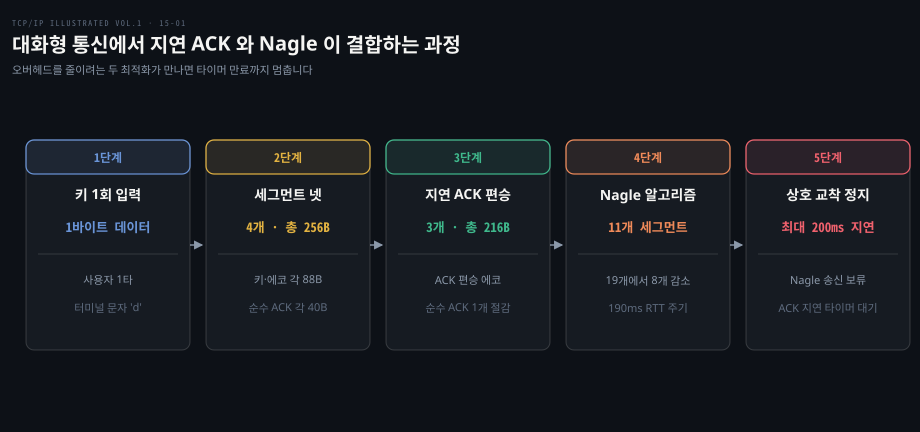
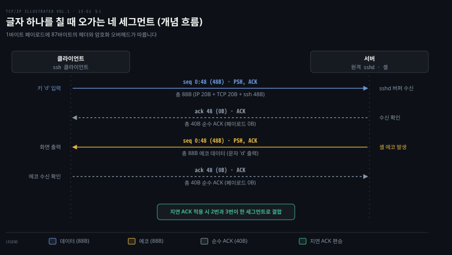
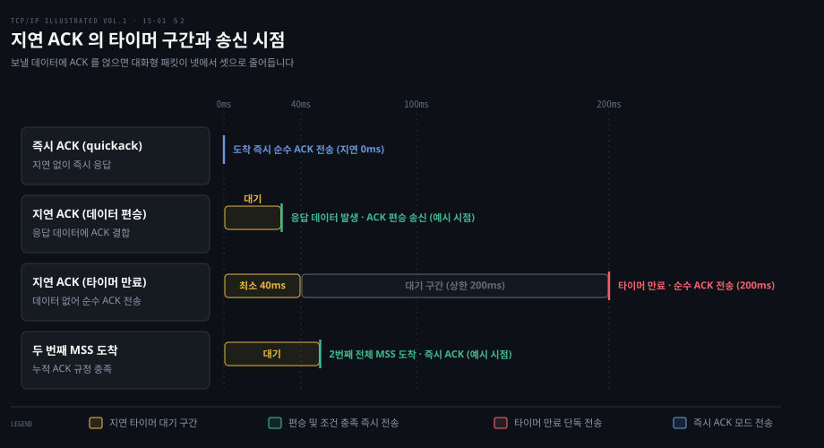
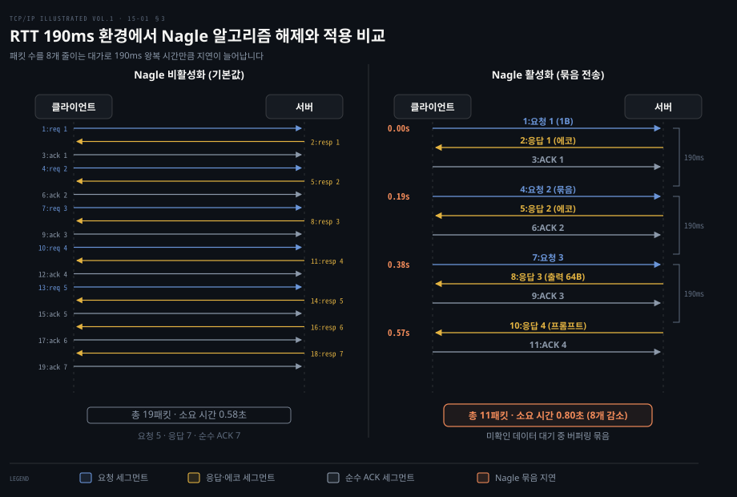
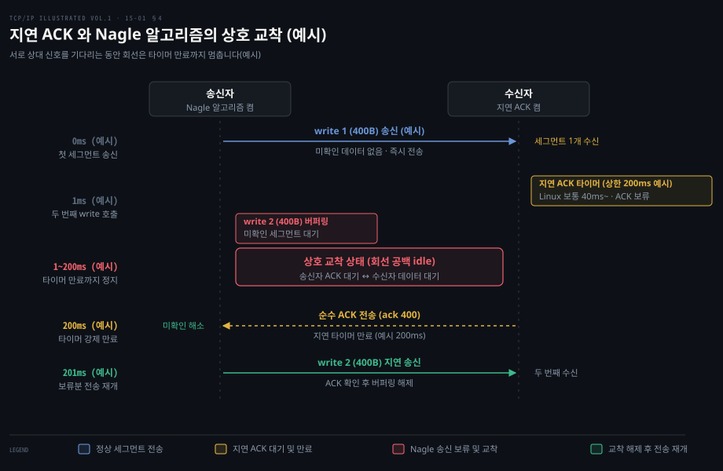

# 작은 세그먼트는 지연 ACK 와 Nagle 알고리즘이 묶어 보낸다

---

> 대화형 연결에서 발생하는 작은 패킷 오버헤드를 줄이기 위해 수신자는 지연 ACK 로 응답을 합치고, 송신자는 Nagle 알고리즘으로 미확인 구간 동안 패킷을 모아 보냅니다.

## 핵심 요약

> 이 편의 중심 생각은 네트워크 효율을 높이려는 수신자의 지연 ACK 와 송신자의 Nagle 알고리즘이 맞물릴 때 작은 쓰기 연산이 상호 교착에 빠져 타이머 만료까지 멈출 수 있다는 사실입니다.

TCP 트래픽 측정 연구에서는 세그먼트의 90% 이상이 웹·파일 전송·전자메일 같은 대용량 데이터를 싣고 세그먼트 크기도 1500바이트 안팎으로 큽니다. 반면 원격 셸이나 온라인 게임 같은 대화형 통신은 사용자의 키 입력이나 마우스 움직임마다 수십 바이트 이하의 작은 조각을 실어 나릅니다. 1바이트 키 입력도 ssh 암호화·인증을 거쳐 48바이트 페이로드가 되며 IP 20바이트와 TCP 20바이트 헤더가 붙어 패킷 크기는 88바이트까지 불어납니다.

TCP 는 이 낭비를 막기 위해 양방향에서 서로 다른 메커니즘을 둡니다. 수신 측은 들어온 데이터마다 즉시 확인 응답을 돌려주지 않고 **지연 ACK** 타이머를 켭니다. 로컬 애플리케이션이 역방향으로 보낼 데이터 세그먼트에 ACK 번호를 얹어 보내는 편승을 시도합니다. 송신 측은 아직 확인받지 못한 작은 데이터가 망에 떠 있는 동안 새로 들어오는 작은 조각들을 버퍼에 모읍니다. ACK 가 돌아오거나 최대 세그먼트 크기(SMSS)를 채웠을 때 한꺼번에 쏘는 **Nagle 알고리즘**을 가동합니다.

그러나 두 알고리즘이 동시에 켜진 채로 애플리케이션이 연속해서 작은 조각을 쓰면 심각한 지연이 발생합니다. 송신자는 이전 조각의 ACK 를 기다리느라 다음 조각 전송을 멈추고 수신자는 세그먼트를 하나만 받아(두 번째 최대 크기 세그먼트가 오지 않아) 지연 ACK 타이머가 끝날 때까지 응답을 보류합니다. 양쪽이 상대방의 신호를 기다리며 회선이 지연 ACK 타이머 만료까지(Linux 보통 40ms 안팎, 상한 200ms, Windows 기본 200ms) 멎는 이 현상이 일시적 상호 교착입니다. 저지연 애플리케이션은 소켓 옵션 `TCP_NODELAY` 로 이 매듭을 풀어야 합니다.


## 학습 목표

> 이 편을 읽고 나면 다음을 설명할 수 있습니다.

1. 대화형 터미널에서 글자 하나를 입력할 때 왜 네 세그먼트가 발생하며 페이로드 대비 헤더 오버헤드가 몇 바이트인지 계산할 수 있습니다.
2. 지연 ACK 가 패킷 수를 줄이는 원리와 현행 RFC 9293 및 Linux 커널의 지연 시간 상한을 제시할 수 있습니다.
3. Nagle 알고리즘의 동작 규칙 한 줄을 정의하고 왕복 시간(RTT)에 따라 패킷 수와 크기가 조절되는 자기 클록 메커니즘을 설명할 수 있습니다.
4. Nagle 알고리즘과 지연 ACK 가 결합했을 때 왜 지연 ACK 타이머 만료까지(최대 200ms) 상호 교착이 발생하는지 시퀀스 흐름으로 증명할 수 있습니다.
5. `TCP_NODELAY`, `TCP_CORK`, `net.ipv4.tcp_autocorking` 의 차이를 구분하고 프로그래밍 언어의 기본 설정을 선택할 수 있습니다.



위 개요도는 작은 세그먼트를 다루는 네 단계 메커니즘의 연결을 보여줍니다. 1바이트 키 입력이 네 세그먼트를 만들고 지연 ACK 가 에코에 응답을 얹어 셋으로 줄이며 Nagle 알고리즘이 RTT 동안 패킷을 버퍼링해 묶습니다. 그러나 두 최적화가 연속 쓰기에서 만나면 지연 타이머가 만료될 때까지(보통 40~200ms) 데이터 흐름이 완전히 정지합니다.


## 1. 키 하나를 치면 세그먼트 넷이 오간다

> 터미널에서 한 글자를 칠 때 클라이언트의 전송, 서버의 TCP 확인, 원격 셸의 화면 에코, 에코에 대한 클라이언트의 확인까지 네 세그먼트가 오가며 헤더 오버헤드가 페이로드를 압도합니다.

원격 서버의 터미널에서 글자 하나를 입력했을 때 화면에 그 글자가 나타나기까지 얼마나 많은 패킷이 오갈까요? 사용자의 즉각적인 반응성을 지원하는 원격 로그인 프로토콜은 라인 단위가 아니라 키스트로크마다 개별 세그먼트를 만듭니다. 사용자가 누른 글자는 즉시 원격 호스트로 전달되어야 하고 화면에 글자가 뜨는 것 역시 원격 호스트의 셸이 반사(echo)해 준 결과를 로컬 터미널이 받아 출력하기 때문입니다.

암호화와 무결성 검증을 제공하는 ssh 연결을 예로 들면 클라이언트가 문자 `d` 하나를 입력할 때 네트워크에서는 순수한 TCP 수준에서 총 네 개의 세그먼트가 연속해서 오갈 수 있습니다.

1. 클라이언트가 문자 `d` 를 담아 서버로 보냅니다.
2. 서버 TCP 계층이 키 입력을 정상 수신했음을 알리는 순수 ACK 를 클라이언트로 돌려줍니다.
3. 서버의 셸 프로세스가 `d` 를 읽고 화면 출력을 위해 동일한 문자 `d` 를 클라이언트로 에코합니다.
4. 클라이언트 TCP 계층이 에코 세그먼트를 잘 받았음을 알리는 순수 ACK 를 서버로 보냅니다.



위 흐름에서 관측되는 패킷 크기는 대화형 전송의 비효율을 보여줍니다. IPv4 기본 헤더는 20바이트이고 TCP 옵션이 없는 기본 헤더 역시 20바이트입니다. 여기에 ssh 프로토콜의 대칭키 암호화 블록 정렬 패딩과 메시지 인증 코드가 붙으면서 사용자가 입력한 단 1바이트의 문자는 48바이트의 페이로드로 부풀어 오릅니다.

결과적으로 클라이언트가 서버로 쏘는 세그먼트는 88바이트가 됩니다. 유효한 애플리케이션 데이터는 단 1바이트인데 이를 전송하기 위해 87바이트의 헤더와 보안 오버헤드가 소모됩니다. 뒤이어 서버가 보내는 순수 확인 응답은 페이로드가 0바이트이므로 헤더만 합친 40바이트가 됩니다. 셸이 돌려주는 에코 역시 암호화되어 88바이트이며 마지막 에코 확인 응답이 다시 40바이트입니다.

단 한 글자를 터미널 화면에 띄우는 데 왕복 두 번과 총 256바이트의 패킷 교환이 네트워크 대역폭을 소모합니다. 이러한 작은 크기의 패킷을 **타이니그램(tinygram)** 이라고 부릅니다. 근거리 통신망은 대역폭이 넓고 혼잡이 드물어 이 오버헤드가 큰 문제가 되지 않습니다. 하지만 수많은 홉을 거치는 광역 통신망에서는 작은 패킷의 홍수가 라우터의 큐를 채우고 CPU 인터럽트 부하를 가중시킵니다.

2005년 Linux 서버로 연 ssh 패킷 캡처를 살펴보면 데이터를 실은 세그먼트(대부분 48바이트, 명령 출력과 프롬프트는 64바이트)에는 모두 TCP 플래그의 `PSH` 비트가 1로 설정되어 있습니다. PSH 비트는 관례상 송신 호스트가 이 세그먼트를 내보내면서 버퍼를 비워 더 보낼 데이터가 없다는 표시입니다. [12-01](./12-01.TCP%20의%20신뢰성은%20재전송·번호·창으로%20만든다.md) 의 수신 측 의미와 함께 볼 수 있습니다. 수신 호스트 역시 버퍼링하지 않고 애플리케이션에 즉시 올려 보내도록 유도합니다.

이어지는 `date` 명령의 출력 28글자에 CR·LF 를 더한 30바이트 평문이 암호화되어 64바이트 페이로드로 늘어납니다. 대화형 통신에서는 데이터 내용 자체보다 프로토콜 헤더와 암호화 래퍼가 차지하는 고정 비용이 네트워크 자원의 상당 부분을 점유합니다.


## 2. 지연 ACK 는 보낼 데이터에 ACK 를 실으려 기다린다

> 수신자는 모든 세그먼트에 즉시 ACK 를 보내지 않고 타이머 동안 대기하여, 반대편으로 나가는 데이터 세그먼트에 확인 응답을 결합함으로써 대화형 한 글자의 세그먼트를 넷에서 셋으로 줄이고 대량 전송에서는 ACK 수를 절반 가까이 줄입니다.

1바이트 데이터를 보내기 위해 40바이트 헤더를 실은 패킷이 쉼 없이 오가면 네트워크는 헤더를 나르느라 정작 데이터를 나르지 못합니다. 네 세그먼트가 오가는 비효율에서 가장 먼저 줄일 수 있는 자리는 서버가 보내는 순수 ACK 와 에코 데이터입니다.

서버 TCP 계층이 키 입력을 받자마자 40바이트짜리 빈 ACK 를 즉시 쏘지 않고 아주 잠깐만 기다린다면 셸이 곧바로 만들어낼 에코 데이터 세그먼트의 TCP 헤더 안에 직전 수신에 대한 ACK 번호와 플래그를 함께 실어 보낼 수 있습니다. ACK 를 늦추는 것을 **지연 ACK(delayed acknowledgment)**, 늦춘 ACK 를 반대 방향 데이터에 얹어 보내는 것을 **편승(piggybacking)** 이라고 부릅니다.

지연 ACK 는 TCP 가 누적 확인 응답 방식을 사용하기 때문에 성립합니다. 수신자는 도착한 모든 바이트마다 영수증을 끊어줄 필요가 없으며 일정 시간 동안 확인을 미루었다가 가장 마지막으로 연속 수신된 바이트 번호만 한 번에 알려주면 됩니다.

편승이 성공하면 앞선 네 개의 세그먼트는 셋으로 줄어듭니다.
1. 클라이언트 → 서버: 키 입력 `d` (88B)
2. 서버 → 클라이언트: 키 ACK 와 셸 에코 `d` 가 결합된 세그먼트 (88B)
3. 클라이언트 → 서버: 에코에 대한 ACK (40B)

패킷 수가 4개에서 3개로 줄어들고 전체 전송량도 256바이트에서 216바이트로 절감됩니다. 대량 데이터 전송에서는 수신자가 보통 두 세그먼트마다 하나의 ACK 를 돌려주므로 ACK 수가 절반으로 줄어듭니다. [CNTD 03-03](../cntd_computer-networking-top-down/03-03.TCP%20는%20어떻게%20세고%20어떻게%20기다리는가.md) 에서 정리된 누적 ACK 의 원리가 바로 이 지연을 지탱합니다.



하지만 확인 응답을 무한정 미룰 수는 없습니다. 송신 측은 [14-01](./14-01.RTO%20는%20RTT%20의%20평균과%20흔들림으로%20정한다.md) 에서 계산한 재전송 타임아웃 타이머를 돌리고 있으므로 수신자가 너무 늦게 응답하면 송신자는 데이터가 유실되었다고 판단하여 불필요한 재전송을 일으킵니다.

현행 TCP 공식 명세인 [RFC 9293 §3.8.6.3](https://www.rfc-editor.org/rfc/rfc9293#section-3.8.6.3) 은 지연 ACK 의 상한과 조건을 다음과 같이 규정합니다.

1. **지연 상한**: ACK 지연 시간은 반드시 0.5초 미만이어야 합니다. 실제 대부분의 상용 구현체는 200ms 이하를 최대 지연값으로 사용합니다.
2. **두 번째 세그먼트 즉시 응답**: 수신자는 최대 크기 세그먼트가 둘 도착하거나 수신 MSS 의 2배에 달하는 새 데이터를 받으면 타이머 만료를 기다리지 않고 즉시 ACK 를 만들어 보내야 합니다.
3. **순서 밖 세그먼트 즉시 응답**: RFC 9293 은 RFC 5681 §4.2 를 가리켜, 구멍 위나 구멍을 채우는 순서 밖 세그먼트가 도착하면 빠른 손실 복구를 위해 지연 없이 즉시 ACK 하라고 권고합니다.

운영체제 커널의 구현을 보면 Linux 는 [`include/net/tcp.h`](https://github.com/torvalds/linux/blob/master/include/net/tcp.h) 에 지연 타이머의 최소·최대 범위를 상수로 정의합니다. `TCP_DELACK_MAX` 는 `HZ/5` 로 정의되어 타이머 주파수와 무관하게 정확히 200ms 로 고정됩니다. `TCP_DELACK_MIN` 은 `HZ >= 100` 일 때 `HZ/25` 로 정의되어 약 40ms 가 됩니다.

Linux 는 또한 연결 초기에 빠른 전송을 위해 모든 세그먼트에 즉시 ACK 를 보내는 **quickack** 모드로 시작했다가 트래픽 패턴이 안정되면 지연 ACK 모드로 전환하는 동적 조절 알고리즘을 사용합니다. 애플리케이션은 소켓 옵션 `TCP_QUICKACK` 을 통해 소켓을 강제로 quickack 상태로 밀어 넣을 수 있으나 커널의 내부 이벤트나 후속 데이터 흐름에 의해 다시 지연 ACK 모드로 되돌아갈 수 있습니다.

macOS 는 커널 파라미터 `net.inet.tcp.delayed_ack` 를 통해 지연 정책을 설정합니다. 지연을 완전히 끄는 0, 항상 지연하는 1, 패킷 둘마다 ACK 를 보내는 2, 연결 상태를 자동 감지하는 기본값 3을 지원합니다. Windows 는 레지스트리의 `TcpAckFrequency` 로 지연 타이머 무시 기준 패킷 수를 조정하며 `TcpDelAckTicks` 로 대기 시간을 조정합니다.


## 3. Nagle 은 확인 안 된 작은 세그먼트가 있으면 다음 것을 모은다

> Nagle 알고리즘은 네트워크에 미확인 작은 세그먼트가 떠 있는 동안 다음 작은 데이터의 송신을 멈추고 버퍼에 모음으로써, 왕복 시간이 긴 망에서 타이니그램의 수를 크게 줄입니다.

수신자가 ACK 를 늦춰 에코에 얹어 보내더라도 송신자가 키를 누를 때마다 작은 패킷을 즉시 쏘아 보내면 네트워크는 여전히 타이니그램으로 넘쳐납니다. 지연 ACK 가 수신 측의 최적화라면 송신 측에서 작은 패킷의 범람을 막는 핵심 장치는 존 네이글(John Nagle)이 제안한 [RFC 896](https://www.rfc-editor.org/rfc/rfc896) 의 **Nagle 알고리즘**입니다.

Nagle 알고리즘의 동작 규칙은 명쾌합니다.
> **연결에 아직 확인 응답을 받지 못한 데이터가 남아 있다면, 송신자는 최대 세그먼트 크기보다 작은 세그먼트를 네트워크로 내보낼 수 없습니다.**

대신 송신 측 TCP 는 애플리케이션이 새로 쓰는 작은 데이터들을 내부 버퍼에 모아둡니다. 앞서 보낸 미확인 데이터에 대한 ACK 가 수신자로부터 도착하는 순간 그때까지 버퍼에 쌓인 모든 데이터를 하나의 세그먼트로 합쳐서 전송합니다.

이 알고리즘의 본질은 **정지-대기(stop-and-wait)** 동작의 강제입니다. 미확인 패킷이 하나라도 있으면 다음 전송이 멈추기 때문에 네트워크에는 한 번에 하나의 작은 세그먼트만 떠 있게 됩니다. 주목할 점은 이 알고리즘이 **자기 클록(self-clocking)** 메커니즘을 가진다는 사실입니다.

RTT 가 짧은 고속 LAN 환경에서는 보낸 세그먼트의 ACK 가 몇 밀리초 만에 돌아옵니다. 송신자는 데이터를 거의 기다리지 않고 즉시 내보냅니다. 반면 RTT 가 긴 저속 WAN 에서는 ACK 가 돌아오는 데 수백 밀리초가 걸립니다. 그 시간 동안 버퍼에 더 많은 데이터가 쌓여 더 크고 적은 세그먼트로 묶여 나갑니다. 즉 송신 속도와 패킷 크기를 네트워크 경로의 RTT 가 스스로 제어합니다.



Nagle 알고리즘을 켜고 끌 수 있게 수정한 ssh 클라이언트로 RTT 약 190ms 연결에서 `date` 명령을 실행한 캡처를 비교해 보면 Nagle 알고리즘의 효과와 대가가 선명하게 드러납니다.

먼저 Nagle 알고리즘을 비활성화했을 때입니다.
클라이언트는 키 입력 이벤트가 발생하는 족족 네트워크로 패킷을 쏩니다. 전체 명령 교환은 0.58초 동안 19개 패킷을 발생시켰습니다. 클라이언트 요청 5개와 서버 응답 7개 및 순수 ACK 7개가 서로 뒤엉키며 양방향 회선을 오갔으며 패킷의 상당수가 48바이트 사용자 데이터만을 담은 작은 세그먼트였습니다.

반면 동일한 조건에서 Nagle 알고리즘을 활성화한 캡처입니다.
전체 패킷 수는 19개에서 11개로 8개나 감소했습니다. 클라이언트가 첫 문자 `d` 를 보낸 뒤 서버로부터 ACK 와 에코가 돌아올 때까지 다음 글자들의 전송이 보류되었고 버퍼에 모인 문자열이 한 패킷으로 묶여 나갔기 때문입니다.

그러나 패킷 수를 줄인 대가로 지연 시간은 늘어났습니다. 도식 우측 타임라인을 보면 각 요청-응답 쌍이 0.00초, 0.19초, 0.38초, 0.57초 로 거의 정확히 190ms 간격을 두고 단계별로 진행합니다. 왕복 시간 190ms 를 온전히 기다린 뒤에야 다음 묶음이 출발할 수 있으므로 전체 교환 시간은 0.58초에서 0.80초 로 38% 증가했습니다.

패킷 수를 줄여 네트워크 대역폭과 라우터 부하를 아끼는 대신 반응 지연 시간을 희생하는 전형적인 트레이드오프입니다. 만약 RTT 가 15ms 미만인 일반적인 LAN 환경이라면 1초에 60타 이상을 치지 않는 한 타이핑 속도가 RTT 보다 느리므로 Nagle 알고리즘이 켜져 있어도 지연을 체감하기 어렵습니다. 하지만 지연이 큰 네트워크에서는 이 기다림이 애플리케이션의 반응성을 떨어뜨립니다.


## 4. 지연 ACK 와 Nagle 이 만나면 타이머가 끝날 때까지 멈춘다

> 송신 측의 Nagle 알고리즘과 수신 측의 지연 ACK 가 동시에 활성화되면, 송신자는 ACK 를 기다리고 수신자는 다음 데이터를 기다리는 상호 교착이 발생해 타이머 만료까지(시스템에 따라 40~200ms) 통신이 멈춥니다.

네트워크 대역폭을 아끼기 위해 수신자는 확인 응답을 미루고 송신자는 작은 패킷을 묶는 두 최적화가 한 연결에서 만나면 뜻밖의 성능 지연이 일어납니다. Nagle 알고리즘과 지연 ACK 는 각각 독립적으로 설계되었을 때는 훌륭한 네트워크 대역폭 절약 기법입니다. 그러나 분산 시스템과 네트워크 프로그래밍에서 이 둘이 한 세션에서 마주치면 심각한 성능 저하를 일으킵니다. 이를 **Nagle 과 지연 ACK 의 상호 교착(deadlock)** 이라고 부릅니다.

이 교착은 애플리케이션이 데이터를 보낼 때 흔히 사용하는 연속 쓰기 패턴에서 발생합니다. 예를 들어 HTTP 나 RPC 서버로 요청을 보낼 때 헤더를 먼저 소켓에 쓰고 곧이어 바디를 쓰는 경우를 생각해 봅니다.



위 도식의 시간 순서(HTTP 요청 연속 쓰기의 예시 값: 400바이트 헤더·400바이트 바디)를 따라가면 정지 원인이 명확히 드러납니다.

1. **t = 0ms (예시)**: 송신자가 400바이트 크기의 요청 헤더를 전송합니다. 이 시점에는 네트워크에 미확인 데이터가 없으므로 Nagle 알고리즘을 통과하여 즉시 세그먼트가 발송됩니다.
2. **t = 1ms (예시)**:
   * 수신자는 세그먼트 하나만 받았으므로(두 번째 최대 크기 세그먼트가 아니므로) 즉시 ACK 를 보내지 않고 지연 ACK 타이머를 시작합니다.
   * 같은 시각 송신자 애플리케이션이 400바이트 크기의 바디를 소켓에 씁니다. 그러나 송신 측 TCP 는 Nagle 알고리즘을 검사합니다. 네트워크에 직전에 보낸 첫 번째 조각의 ACK 가 도착하지 않았고 바디 역시 SMSS 미만의 작은 데이터입니다. 송신 측 TCP 는 두 번째 조각의 전송을 중단하고 송신 버퍼에 보류합니다.
3. **t = 1ms ~ 200ms (상호 교착 구간 예시)**:
   * 송신자는 수신자로부터 첫 번째 조각의 ACK 가 오기를 기다립니다.
   * 수신자는 애플리케이션이 응답 데이터를 보내거나 송신자로부터 두 번째 데이터가 도착하기를 기다립니다.
   * 양쪽 호스트가 서로의 신호를 기다리는 침묵이 이어지고 네트워크 링크는 완전히 유휴 상태로 멈춥니다.
4. **t = 200ms (타이머 만료 예시)**: 마침내 수신 측의 지연 ACK 타이머(200ms 상한)가 만료됩니다. 수신자 TCP 는 더 이상 기다리지 못하고 페이로드가 없는 40바이트짜리 순수 ACK 를 강제로 송신합니다.
5. **t = 201ms (예시)**: 송신자가 드디어 ACK 를 받아 첫 번째 조각이 확인됩니다. 미확인 구간이 사라지자 송신자 TCP 는 버퍼에 묶어 두었던 두 번째 세그먼트를 네트워크로 내보냅니다.

단 몇 마이크로초 만에 끝났어야 할 두 번의 소켓 쓰기가 지연 ACK 타이머가 끝날 때까지(상한 200ms, Linux 보통 40ms 안팎) 마비된 뒤에야 완료됩니다. 영구적인 교착 상태는 아니지만 요청 처리 지연 시간이 수십~200ms 단위로 튀는 레이턴시 스파이크의 주범이 바로 이 현상입니다.

이 문제를 해결하는 방법은 세 가지 차원에서 접근할 수 있습니다.

### 소켓 옵션 TCP_NODELAY

가장 널리 쓰이는 표준 해법은 버클리 소켓 API 에서 Nagle 알고리즘을 비활성화하는 것입니다.
```c
int one = 1;
setsockopt(fd, IPPROTO_TCP, TCP_NODELAY, &one, sizeof(one));
```
`TCP_NODELAY` 옵션을 켜면 송신 측 TCP 는 미확인 데이터가 남아 있든 상관없이 애플리케이션이 쓴 데이터를 버퍼링하지 않고 즉시 세그먼트로 만들어 망에 띄웁니다. 지연 시간을 줄여야 하는 웹 서버와 RPC 프레임워크는 이 옵션을 필수로 켭니다.

현대 네트워크 라이브러리들은 아예 이를 기본값으로 채택하고 있습니다. [Go 언어 공식 net 패키지](../../../01_language/docs/go/net/04-01.TCPConn.md#공식-계약-nagle-알고리즘과-setnodelay) 의 `*net.TCPConn` 명세를 보면 Go 는 TCP 소켓이 생성되거나 수락되는 즉시 내부적으로 `SetNoDelay(true)` 를 호출하여 Nagle 알고리즘을 기본으로 해제합니다. 대화형 RPC 와 HTTP 통신에서 예측 불가능한 200ms 정지를 사전에 차단하기 위한 언어 차원의 설계 계약입니다.

### Linux TCP_CORK 와 패킷 모으기

반대로 지연 시간보다 전송 효율이 중요한 대용량 파일 전송이나 정적 웹 서버에서는 Nagle 을 끄는 대신 정교하게 패킷을 묶는 방식을 씁니다. Linux 가 제공하는 `TCP_CORK` 소켓 옵션은 코르크 마개를 끼우듯 자투리 전송을 붙잡아 둡니다.
* `TCP_CORK` 가 켜져 있으면 꽉 찬 세그먼트만 내보내고, 남은 자투리 데이터는 최대 200ms 까지 붙잡아 둡니다(tcp(7)).
* 애플리케이션이 헤더와 파일 데이터를 모두 쓴 뒤 코르크 마개를 뽑으면 버퍼에 남은 자투리 데이터가 한 세그먼트로 묶여 방출됩니다.

정적 파일 서버는 헤더를 쓰고 `sendfile()` 로 본문을 보내는 동안 `TCP_CORK` 를 켜 두었다가 끝에 풀어 헤더와 본문 첫 조각을 한 세그먼트로 묶습니다([SP 10-03 의 TCP_CORK 행](../systems-performance/10-03.네트워크%20—%20방법론·실험·튜닝.md) 참고).

### 커널 차원의 자동 병합: net.ipv4.tcp_autocorking

Linux 커널 3.14 부터는 애플리케이션이 소켓 옵션을 일일이 건드리지 않아도 커널이 트래픽 패턴을 감지해 패킷을 지능적으로 묶어주는 기능이 도입되었습니다. 리눅스 공식 문서 [`Documentation/networking/ip-sysctl.rst`](https://github.com/torvalds/linux/blob/master/Documentation/networking/ip-sysctl.rst) 에 명시된 `net.ipv4.tcp_autocorking` 파라미터입니다.
* 기본값은 `1`(활성화)입니다.
* 애플리케이션이 연속해서 작은 쓰기 시스템 콜을 호출할 때 이전 패킷이 전송 큐에 아직 대기 중이면 커널이 후속 데이터를 자동으로 병합합니다. 이를 통해 큰 세그먼트를 만듭니다.
* 디바이스 큐가 비어 있으면 데이터는 즉시 전송되므로 지연 시간이 늘어나지 않습니다. 전송 큐에 부하가 걸렸을 때만 패킷 수를 줄여 소프트 IRQ 와 CPU 부하를 크게 낮추는 현대 리눅스의 기본 방어 장치입니다.


## 면접 대비

> 아래 질문에 답하면서 Nagle 알고리즘과 지연 ACK 가 상호작용하는 시점과 해결책을 함께 점검해 보세요.

1. 대화형 터미널에서 글자 하나를 전송할 때 발생하는 네 세그먼트의 구성을 밝히고 왜 극심한 헤더 오버헤드가 발생하는지 설명하세요.
2. 지연 ACK 가 패킷 수를 줄이는 원리와 현행 RFC 9293 이 규정하는 지연 시간 상한 및 즉시 ACK 전송 조건을 설명하세요.
3. Nagle 알고리즘의 동작 규칙 한 줄을 제시하고 RTT 가 긴 네트워크에서 패킷 수와 크기가 어떻게 변하는지 설명하세요.
4. 연속적인 작은 쓰기 패턴에서 Nagle 알고리즘과 지연 ACK 가 만났을 때 왜 지연 ACK 타이머 만료까지(최대 200ms) 상호 교착이 발생하는지 증명하세요.
5. 상호 교착을 해결하기 위한 소켓 옵션 `TCP_NODELAY` 의 역할과 Linux 커널의 `tcp_autocorking` 기능이 동작하는 원리를 비교하세요.


## 정답 (자답 후 펼치기)

> 위 면접 대비의 질문에 먼저 스스로 답한 뒤 읽으세요.

### 정답 1 — 대화형 통신의 네 세그먼트와 오버헤드

원격 셸은 클라이언트가 누른 키스트로크마다 개별 세그먼트를 전송하며 화면 출력 역시 원격 셸 프로세스가 화면에 에코해 주는 구조입니다. 첫째는 88바이트의 클라이언트 키 입력 전송입니다. 둘째는 40바이트의 서버 수신 확인 순수 ACK 입니다. 셋째는 88바이트의 서버 셸 문자 에코 세그먼트입니다. 넷째는 40바이트의 클라이언트 에코 수신 순수 ACK 입니다. 1바이트의 유효 문자 데이터에 20바이트 IP 헤더, 20바이트 TCP 헤더, ssh 암호화 페이로드 패딩이 붙어 단 1바이트를 나르는 데 87바이트의 오버헤드가 발생하며 총 256바이트의 트래픽을 유발합니다.

### 정답 2 — 지연 ACK 와 RFC 9293 규정

지연 ACK 는 수신자가 데이터 세그먼트를 받았을 때 즉시 빈 ACK 를 보내지 않고 타이머를 가동하는 기법입니다. 로컬 애플리케이션이 역방향으로 보낼 데이터 세그먼트의 헤더에 ACK 번호를 얹어 보내는 편승을 유도합니다. RFC 9293 §3.8.6.3 은 지연 시간이 반드시 500ms 미만이어야 한다고 명시합니다. 통상 상용 커널은 200ms 이하를 씁니다. 전체 크기 세그먼트가 둘 누적되거나 순서 밖 세그먼트가 도착하면(RFC 5681 §4.2 권고) 손실 복구를 위해 타이머를 무시하고 즉시 ACK 를 보냅니다.

### 정답 3 — Nagle 알고리즘과 자기 클록

Nagle 알고리즘의 규칙은 "네트워크에 아직 확인받지 못한 데이터가 남아 있다면, SMSS 보다 작은 세그먼트를 보낼 수 없다"는 것입니다. 이전 세그먼트의 ACK 가 도착할 때까지 후속 작은 데이터들은 송신 버퍼에 누적됩니다. RTT 가 짧은 LAN 에서는 ACK 가 즉시 오므로 지연 없이 패킷이 나갑니다. 반면 RTT 가 긴 WAN 에서는 왕복 시간 동안 더 많은 데이터가 버퍼에 모여 패킷 수는 19개에서 11개로 줄어들고 세그먼트 크기는 커집니다. 190ms 주기 락스텝으로 인해 전체 소요 시간은 증가합니다.

### 정답 4 — 연속 쓰기에서의 상호 교착

헤더와 바디를 연속해서 전송하는 쓰기 패턴에서 첫 번째 세그먼트는 미확인 데이터가 없어 즉시 발송됩니다. 수신자는 세그먼트 하나만 받았으므로(두 번째 최대 크기 세그먼트가 아니므로) 지연 ACK 타이머를 켭니다. 곧이어 송신자가 두 번째 세그먼트를 쓰면 Nagle 알고리즘이 발동하여 직전 세그먼트의 ACK 가 올 때까지 전송을 보류합니다. 송신자는 ACK 를 기다려 안 보내고 수신자는 다음 데이터를 기다려 ACK 를 안 보내는 상호 교착이 발생합니다. 수신자의 지연 타이머가 만료된 뒤에야(최대 200ms, Linux 보통 40ms 안팎) 순수 ACK 가 나간 뒤에 통신이 재개됩니다.

### 정답 5 — TCP_NODELAY 와 tcp_autocorking

`TCP_NODELAY` 는 소켓 수준에서 Nagle 알고리즘을 해제하여 버퍼링 없이 즉시 패킷을 내보내도록 설정하는 옵션입니다. Go 언어의 `net.TCPConn` 처럼 저지연 RPC 나 대화형 서비스에서 기본값으로 활성화됩니다. 반면 Linux 3.14+ 의 `net.ipv4.tcp_autocorking` 은 sysctl 설정입니다. 커널 전송 큐에 이전 패킷이 대기 중일 때만 연속된 소형 시스템 콜을 큰 세그먼트로 자동 병합합니다. 큐가 비어 있으면 즉시 전송하여 지연 시간 증가 없이 패킷 수를 줄입니다.


## 참고 자료

> 15장 앞부분(§15.1–15.4)의 대화형 통신 캡처와 타이니그램 억제 메커니즘을 RFC 공식 명세 및 커널 1차 자료와 대조했습니다.

- Kevin R. Fall · W. Richard Stevens, 《TCP/IP Illustrated, Volume 1: The Protocols》, 2nd ed., Ch.15 §15.1–15.4, ISBN 978-0-321-33631-6.
- [RFC 9293: Transmission Control Protocol (TCP)](https://www.rfc-editor.org/rfc/rfc9293#section-3.8.6.3) — §3.8.6.3 Delayed Acknowledgments.
- [RFC 896: Congestion Control in IP/TCP Internetworks](https://www.rfc-editor.org/rfc/rfc896) — John Nagle 의 Nagle 알고리즘 원전.
- [RFC 1122: Requirements for Internet Hosts -- Communication Layers](https://www.rfc-editor.org/rfc/rfc1122#section-4.2.3.2) — §4.2.3.2 When to Send an ACK Segment.
- [Linux Kernel include/net/tcp.h](https://github.com/torvalds/linux/blob/master/include/net/tcp.h) — `TCP_DELACK_MIN` (40ms), `TCP_DELACK_MAX` (200ms) 상수 정의.
- [Linux Kernel Documentation/networking/ip-sysctl.rst](https://github.com/torvalds/linux/blob/master/Documentation/networking/ip-sysctl.rst) — `net.ipv4.tcp_autocorking` 동작 정의.


## 관련 문서

> 슬라이딩 윈도의 흐름 제어와 RTO 계산을 기반으로, 대화형 통신의 지연 문제와 후속 혼잡 제어를 잇습니다.

- [12-01. TCP 의 신뢰성](./12-01.TCP%20의%20신뢰성은%20재전송·번호·창으로%20만든다.md) — 누적 ACK 와 슬라이딩 윈도 기본 메커니즘입니다.
- [14-01. RTO 추정](./14-01.RTO%20는%20RTT%20의%20평균과%20흔들림으로%20정한다.md) — 왕복 시간 측정과 재전송 타이머 기준입니다.
- [CNTD 03-03. TCP 의 신뢰적 데이터 전송](../cntd_computer-networking-top-down/03-03.TCP%20는%20어떻게%20세고%20어떻게%20기다리는가.md) — 누적 ACK 와 지연 ACK 의 계층적 원리입니다.
- [시스템 성능 10-03. 네트워크 튜닝](../systems-performance/10-03.네트워크%20—%20방법론·실험·튜닝.md) — 소켓 버퍼와 `TCP_NODELAY`·`TCP_CORK` 최적화입니다.
- [Go net.TCPConn 공식 계약](../../../01_language/docs/go/net/04-01.TCPConn.md) — Nagle 알고리즘 기본 해제(`SetNoDelay(true)`)와 커널 시스템 콜 인터페이스입니다.
