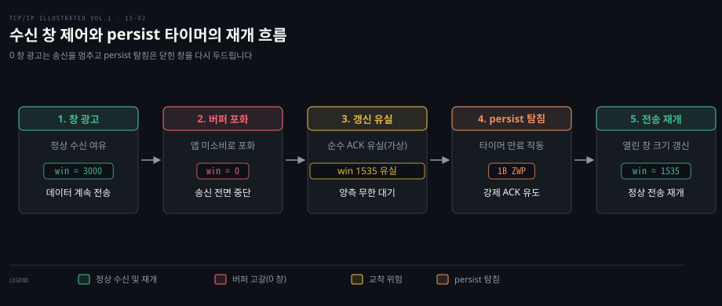
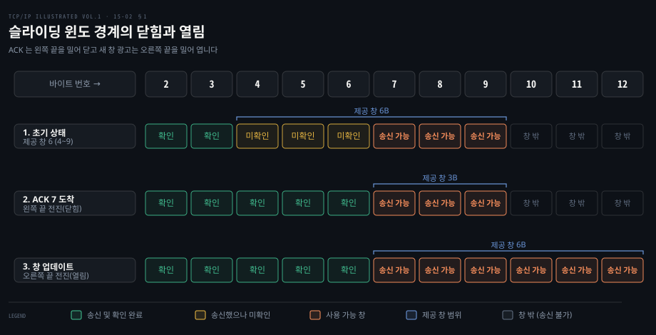
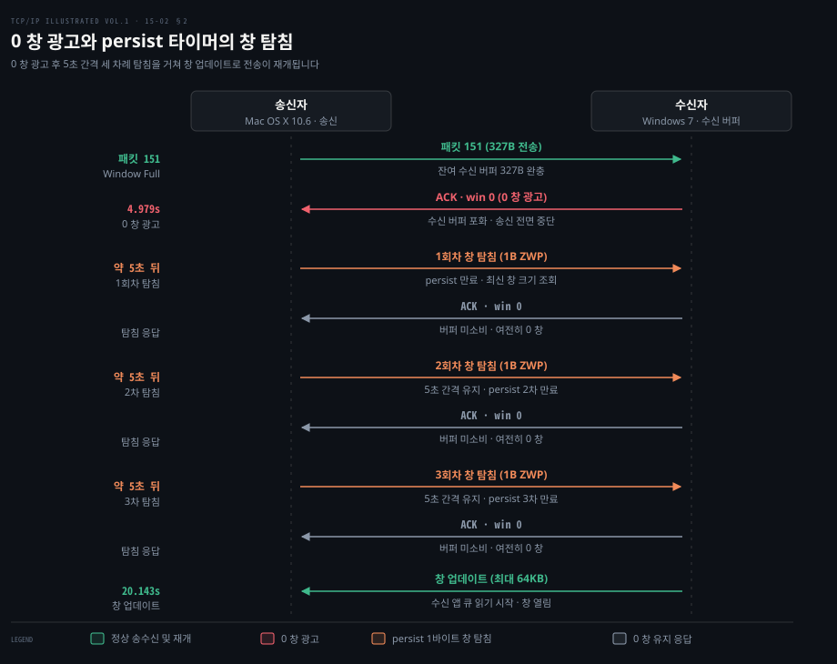
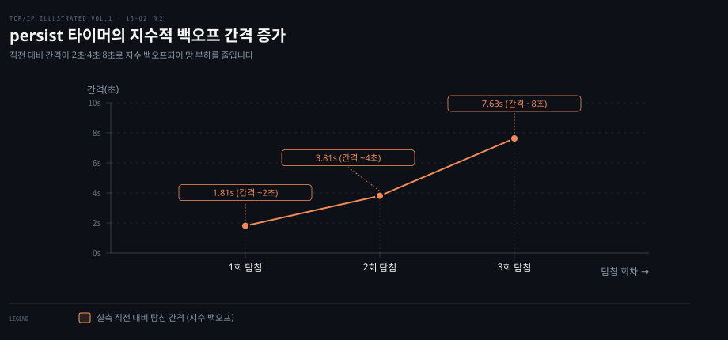
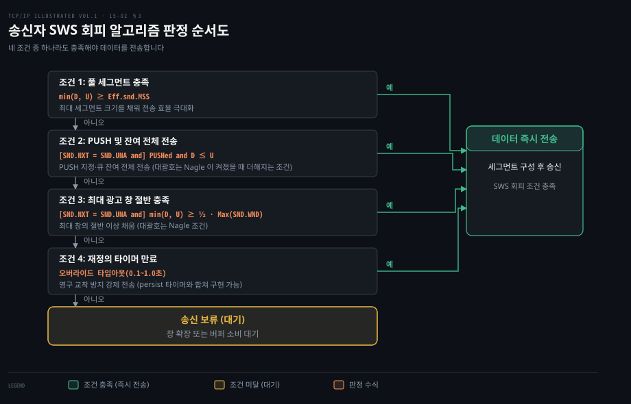

# 수신 창은 송신을 붙잡고 0 창은 persist 타이머가 다시 연다

---

> TCP 흐름 제어는 수신 버퍼의 빈자리를 알리는 창 크기로 송신 속도를 묶고, 버퍼가 가득 차 닫힌 0 창은 송신 측 persist 타이머의 주기적 탐침으로 다시 엽니다.

## 핵심 요약

> 송신자는 수신자가 허용한 바이트 경계를 절대 넘지 않으며, 수신 버퍼가 고갈되어 창이 닫히면 persist 타이머가 유실 위험이 있는 순수 ACK 의 침묵을 깨뜨립니다.

TCP 연결은 양방향 독립 스트림이므로 각 방향마다 송신 창과 수신 창 구조를 따로 유지합니다. 수신자가 ACK 헤더에 싣는 16비트 창 광고는 송신자가 즉시 전송할 수 있는 바이트 한계를 규정합니다. 수신 측 애플리케이션이 데이터를 제때 읽지 못해 수신 버퍼가 완전히 차면 창 크기 0이 전달되어 송신이 중단됩니다. 이후 수신 버퍼가 비워져 창을 다시 여는 갱신 패킷은 데이터를 싣지 않는 순수 ACK 로 전달되므로 유실되어도 재전송되지 않습니다. 이 갱신이 사라지면 양쪽이 서로를 무한정 기다리는 교착에 빠집니다.

송신자는 persist 타이머를 두어 창이 0으로 닫힌 동안에도 창 탐침을 주기적으로 보냅니다. 0 창인 수신자는 어떤 세그먼트가 도착해도 다음 기대 번호와 창 크기를 담은 ACK 로 응답해야 하므로 탐침은 최신 창 상태를 확실하게 끌어냅니다. 전통적 구현은 유실 시 신뢰성 있는 재전송을 위해 1바이트를 싣고, 현재 리눅스는 이미 확인된 번호인 SND.UNA-1 로 데이터 없이 탐침을 보냅니다.

나아가 수신자가 바이트 단위로 비는 족족 작은 창을 열거나 송신자가 조각난 세그먼트를 마구 쏟아내면 헤더 오버헤드로 네트워크가 마비되는 어리석은 창 증후군(SWS)이 일어납니다. TCP 는 수신 측이 최소 1 MSS 나 버퍼 절반 이상 비기 전까지 창 갱신을 숨기고 송신 측도 효율적 크기가 갖춰질 때까지 전송을 참는 상호 회피 규칙으로 이 병목을 예방합니다.


## 학습 목표

> 이 편을 읽고 나면 다음을 설명할 수 있습니다.

1. 송신 측 슬라이딩 윈도에서 왼쪽 경계와 오른쪽 경계가 닫힘·열림으로 움직이는 원리와 창 줄어듦을 강하게 막는 이유를 설명할 수 있습니다.
2. 0 창 상태에서 창 업데이트 세그먼트가 유실되었을 때 왜 양방향 교착 상태가 발생하는지 규명할 수 있습니다.
3. 송신 측 persist 타이머가 창 탐침을 생성하는 메커니즘과 지수 백오프 간격을 분석할 수 있습니다.
4. 리눅스 커널의 `tcp_probe_timer` 구현에서 무한 탐침 원칙과 고아 소켓·타임아웃 한계의 관계를 설명할 수 있습니다.
5. 어리석은 창 증후군(SWS)이 일어나는 조건과 수신자·송신자 양측의 회피 알고리즘 판정 규칙을 계산할 수 있습니다.



수신 창은 버퍼 고갈 시 0으로 닫혀 송신을 안전하게 차단합니다. 이후 버퍼가 비워졌을 때 발생할 수 있는 교착은 persist 타이머의 창 탐침이 해소하며, SWS 회피 알고리즘은 극소 크기의 창으로 통신이 마비되는 현상을 사전에 방지합니다.


## 1. 송신자는 광고된 창의 오른쪽 끝까지만 보낸다

> 수신 버퍼의 여유 공간을 알리는 창 광고는 송신 윈도의 오른쪽 경계를 결정하며, 이 경계는 한번 약속된 뒤 왼쪽으로 후퇴해서는 안 됩니다.

### 수신 창이 송신 바이트를 통제하는 구조

TCP 연결은 언제나 양방향으로 데이터를 나릅니다. 클라이언트에서 서버로 흐르는 데이터 스트림과 서버에서 클라이언트로 흐르는 데이터 스트림은 완전히 독립적이며 각 방향마다 전송 상태를 추적하는 윈도 구조가 별도로 존재합니다. [12-01](./12-01.TCP%20의%20신뢰성은%20재전송·번호·창으로%20만든다.md) 에서 다룬 슬라이딩 윈도의 기초 위에 각 엔드포인트는 실제 전송을 위해 **송신 윈도 구조**와 **수신 윈도 구조**를 메모리에 유지합니다.

모든 TCP 세그먼트 헤더에는 32비트 순서 번호와 확인 응답 번호 외에도 16비트 크기의 **윈도 크기 필드**가 포함됩니다. 수신자가 ACK 세그먼트에 실어 보내는 이 값을 **제공 창**이라고 부릅니다. 이 값은 확인 응답 번호를 기준으로 수신자가 즉시 받아들여 버퍼에 적재할 수 있는 여유 바이트 크기를 나타냅니다. 윈도 스케일 옵션을 사용할 경우 16비트 한계를 넘어 대규모 버퍼를 표현할 수 있으며 이 옵션의 협상과 동작은 [13-02](./13-02.TCP%20옵션은%2040바이트%20안에서%20능력과%20한계를%20알린다.md) 에서 정리했습니다.

송신자가 현재 시점에 추가로 전송할 수 있는 데이터의 양은 **사용 가능 창**으로 계산됩니다. 송신 호스트는 아직 확인 응답을 받지 못한 가장 앞쪽 바이트의 순서 번호 `SND.UNA`와 상대방이 광고한 창 크기 `SND.WND`를 유지합니다. 여기에 다음에 보낼 바이트의 순서 번호 `SND.NXT`를 대입하면 즉시 보낼 수 있는 데이터 바이트 수가 나옵니다.

$$\text{사용 가능 창} = \text{SND.UNA} + \text{SND.WND} - \text{SND.NXT}$$

수신자가 약속한 오른쪽 한계선은 $\text{SND.UNA} + \text{SND.WND}$ 입니다. 송신자가 이미 네트워크로 보내 아직 승인받지 못한 비행 데이터를 이 한계선에서 뺀 나머지 공간만이 새로 보낼 수 있는 허용량입니다.

### 경계의 이동과 창 줄어듦의 위험

송신 윈도의 경계는 네트워크 패킷의 교환에 따라 끊임없이 전진합니다.

첫째 수신자로부터 새로운 데이터에 대한 확인 응답이 도착하면 왼쪽 경계 `SND.UNA`가 오른쪽으로 이동합니다. 확인된 데이터는 송신 버퍼에서 해제되며 이 과정을 **창 닫힘**이라고 부릅니다. 왼쪽 경계는 확인된 바이트의 증가에 의해서만 오른쪽으로 전진하며 결코 왼쪽으로 되돌아가지 않습니다.

둘째 수신 애플리케이션이 수신 큐에서 데이터를 읽어 들여 버퍼 공간이 확보되면 수신자는 더 커진 윈도 크기를 담은 세그먼트를 회신합니다. 이에 따라 오른쪽 경계인 $\text{SND.UNA} + \text{SND.WND}$ 가 오른쪽으로 이동하며 이 과정을 **창 열림**이라고 부릅니다. 오른쪽 경계가 넓어지면 송신자의 사용 가능 창이 즉시 증가합니다.



그렇다면 제공 창의 오른쪽 끝이 왼쪽으로 이동하는 현상, 곧 **창 줄어듦**이 발생하면 왜 심각한 문제가 될까요?

수신자가 이전 ACK 에서 순서 번호 1000번에 대해 창 크기 4000바이트를 광고했다면 오른쪽 허용 한계는 5000번(1000~4999번 바이트 허용)이 됩니다. 송신자는 이 약속을 신뢰하고 4500번까지의 데이터 세그먼트를 즉시 네트워크로 전송할 권리를 갖습니다. 그런데 수신자가 잠시 후 다른 버퍼 사정 등을 이유로 확인 번호 1000번에 창 크기 2000바이트를 광고하여 오른쪽 끝을 3000번으로 당겨버린다면 이미 보낸 3000번 이후(3000~4500번) 데이터는 창 밖으로 밀려나 거부당하고 버려질 수밖에 없습니다.

현행 규격인 [RFC 9293 §3.8.6](https://www.rfc-editor.org/rfc/rfc9293#section-3.8.6) 은 수신자가 이미 광고한 오른쪽 윈도 끝을 왼쪽으로 이동시키는 행위를 강력히 지양하도록 규정합니다. 견고성 원칙에 따라 송신자는 상대방이 창을 줄여 사용 가능 창이 음수가 되는 상황에도 대비해야 합니다. 하지만 정상적인 수신자 구현은 한번 약속한 오른쪽 경계를 반드시 유지해야 합니다.

실제 실험에서 확인하듯이 수신자는 SWS 회피 알고리즘보다도 창 줄어듦 방지를 최우선으로 적용합니다. 이에 따라 75바이트처럼 작은 창일지라도 이전에 약속한 오른쪽 끝을 보존하기 위해 0으로 축소하지 않고 그대로 광고합니다.


## 2. 창이 0 이면 persist 타이머가 창 탐침으로 교착을 푼다

> 수신 버퍼가 고갈되어 발생한 0 창은 송신을 정지시키며, 이후 전달되는 창 갱신 ACK 가 유실되어 빠지는 교착은 persist 타이머의 창 탐침이 해결합니다.

### 0 창 광고와 확인 응답 유실의 교착

수신 애플리케이션의 처리 속도가 네트워크의 도착 속도를 따라가지 못하면 수신 버퍼에 데이터가 쌓이면서 수신 헤더의 창 크기는 점진적으로 감소합니다. 결국 수신 버퍼가 완전히 가득 차면 수신 TCP 는 `win = 0` 을 알리는 확인 응답을 송신자에게 전달합니다. 이를 **0 창** 광고라고 부르며 송신자는 사용 가능 창이 0이 되므로 즉시 데이터 전송을 멈춥니다.

이후 수신 애플리케이션이 실행되어 버퍼에서 데이터를 읽어 내면 비로소 빈자리가 생깁니다. 수신 TCP 는 송신자에게 전송을 재개해도 좋다는 신호로 새로운 창 크기를 실은 세그먼트를 발송합니다. 이러한 세그먼트는 새 데이터를 확인하지 않고(ACK 번호는 그대로) 오른쪽 끝만 밀어 주므로 **창 업데이트**라고 부릅니다.

문제는 창 업데이트 세그먼트가 데이터를 싣지 않는 순수 ACK 라는 점입니다. TCP 는 사용자 데이터가 없는 순수 ACK 에 대해서는 별도의 확인 응답을 요구하지 않으며 재전송 타이머를 가동하지도 않습니다. 만약 네트워크 경로에서 이 창 업데이트 세그먼트가 유실되면 어떻게 될까요?

수신자는 송신자에게 창을 열어주었으므로 새 데이터가 도착하기만을 기다립니다. 반면 송신자는 0 창 광고를 받은 뒤 창이 열렸다는 통보를 받지 못했으므로 창 업데이트가 도착하기만을 기다립니다. 양측 모두 상대방의 행동을 영원히 기다리는 전형적인 **교착 상태**에 빠지게 됩니다.

### persist 타이머와 창 탐침

이 치명적인 교착을 해결하기 위해 송신자는 제공 창이 0이 되는 순간 **persist 타이머**를 가동합니다. persist 타이머가 만료되면 송신자는 수신자에게 현재 창 크기를 강제로 보고하게 만드는 특수 패킷인 **창 탐침**을 전송합니다.

창 탐침 세그먼트는 전통적으로 1바이트의 페이로드를 싣습니다. 이는 탐침 세그먼트 자체가 망에서 유실되었을 때 TCP 재전송 타이머에 의해 신뢰성 있게 다시 전달되도록 만들기 위함입니다. [RFC 9293 §3.8.6.1](https://www.rfc-editor.org/rfc/rfc9293#section-3.8.6.1) 은 수신 창이 0일 때 세그먼트가 도착하면 수신 TCP 가 반드시 다음 기대 순서 번호와 현재 창 0을 알리는 ACK 를 회신해야 한다고 규정합니다.

1바이트 탐침을 받았을 때 수신 버퍼에 여유가 없다면 해당 바이트는 버려지고 ACK 번호는 유지됩니다. 반대로 버퍼에 여유가 생겼다면 바이트가 저장되고 ACK 번호가 1 증가합니다. 어느 경우든 최신 창 상태가 송신자에게 확실하게 전달됩니다. 한편 현대 리눅스 커널은 데이터 페이로드 없이 이미 확인된 순서 번호인 `SND.UNA - 1` 로 비데이터 세그먼트를 전송하여 수신자의 즉각적인 ACK 회신을 유도합니다.

[RFC 9293 §3.8.6.1](https://www.rfc-editor.org/rfc/rfc9293#section-3.8.6.1) 에 따르면 송신자는 제공 창이 0이 된 후 첫 번째 RTO 가 경과했을 때 최초 창 탐침을 전송해야 하며 이후 탐침 간격은 재전송 백오프와 마찬가지로 지수적으로 증가해야 합니다.



Mac OS X 10.6 송신자와 Windows 7 수신자의 실험 캡처를 보면 0 창 탐침의 기본 흐름을 볼 수 있습니다. 수신 프로세스가 20초간 읽기를 멈춘 사이 송신자는 남은 327바이트를 보내 수신 버퍼를 완전히 채웁니다(패킷 151). 약 200ms 뒤인 4.979초에 수신자가 창 크기 0을 회신하여 0 창을 광고합니다.

이후 Mac OS X 10.6 송신자는 약 5초 고정 간격으로 세 차례 창 탐침을 보냅니다. 수신자는 매 탐침마다 창 크기 0으로 응답합니다. 20초가 지난 후 수신 애플리케이션이 읽기를 시작하자 최대 64KB 까지 여는 창 업데이트 두 개가 송신자에게 전달되어 정상 전송이 재개됩니다. 한편 RFC 가 권하는 지수 증가는 다음 Windows XP 실측 캡처에서 명확히 확인됩니다.

### 탐침 주기의 지수 백오프와 실측 수치

persist 타이머의 만료 간격은 네트워크 부하를 가중시키지 않기 위해 지수적으로 증가합니다. Windows XP 송신자와 FreeBSD 수신자 간의 실측 캡처에서 관측된 persist 탐침 시간 간격은 이를 명확히 보여줍니다.

| 이벤트 | 패킷 번호 | 캡처 시각(초) | 기준 시각 대비 경과 | 직전 탐침 대비 간격 | 동작 내용 |
|---|---|---|---|---|---|
| 최초 0 창 수신 | 패킷 8 | 5.160s | 0.000s | — | 수신 버퍼 완전 포화(win = 0) |
| 1회차 창 탐침 | 패킷 9 | 6.970s | 1.810s | 1.810s (약 2초) | 1바이트 탐침 (버퍼 포화로 거부) |
| 2회차 창 탐침 | 패킷 11 | 10.782s | 5.622s | 3.812s (약 4초) | 1바이트 탐침 (버퍼 포화로 거부) |
| 3회차 창 탐침 | 패킷 13 | 18.408s | 13.248s | 7.626s (약 8초) | 1바이트 탐침 (버퍼 여유로 수용) |



탐침 사이 간격은 약 2초, 4초, 8초로 두 배씩 늘어납니다. 실측 간격은 직전 탐침 대비 1.810초, 3.812초, 7.626초입니다. 최초 0 창 기준 경과 시각은 1.810초, 5.622초, 13.248초이며 지수 백오프는 직전 탐침 대비 간격에서 성립합니다.

### 현대 리눅스 커널의 탐침 상한과 소켓 수명

전통적인 TCP 명세는 프린터에 용지가 떨어진 상황처럼 수신 측의 일시적 정체가 길어질 수 있음을 인정합니다. 수신자가 탐침에 대해 ACK 응답을 계속 보내는 한 송신 TCP 는 연결을 임의로 끊지 않고 무한히 탐침해야 한다고 규정합니다([RFC 1122 §4.2.2.17](https://www.rfc-editor.org/rfc/rfc1122#section-4.2.2.17), [RFC 9293 §3.8.6.1](https://www.rfc-editor.org/rfc/rfc9293#section-3.8.6.1)).

그러나 실무 운영체제에서 아무런 제한 없이 연결을 영구히 유지하면 악의적인 클라이언트나 좀비 프로세스가 서버 자원을 고갈시키는 취약점이 발생합니다. 현대 리눅스 커널 소스코드 [`net/ipv4/tcp_timer.c`](https://github.com/torvalds/linux/blob/master/net/ipv4/tcp_timer.c) 의 `tcp_probe_timer` 함수는 이 명세와 시스템 안정성 간의 균형을 정밀하게 제어합니다.

```c
/* net/ipv4/tcp_timer.c 발췌 */
void tcp_probe_timer(struct sock *sk)
{
    /* ... */
    /* 수신자가 탐침에 응답할 때마다 tcp_input.c 의 tcp_ack() 에서 
     * icsk->icsk_probes_out 카운터를 0 으로 리셋합니다. */
    max_probes = READ_ONCE(sock_net(sk)->ipv4.sysctl_tcp_retries2);

    /* 소켓이 애플리케이션에 의해 닫힌 고아 소켓(SOCK_DEAD)인 경우 */
    if (sock_flag(sk, SOCK_DEAD)) {
        const bool alive = inet_csk_rto_backoff(icsk, rto_max) < rto_max;
        max_probes = tcp_orphan_retries(sk, alive);
        if (!alive && icsk->icsk_backoff >= max_probes)
            goto abort;
        if (tcp_out_of_resources(sk, true))
            return;
    }

    /* 응답이 없어 누적된 탐침 실패가 한계를 넘거나 타임아웃 초과 시 연결 강제 종료 */
    if (icsk->icsk_probes_out >= max_probes) {
abort:
        tcp_write_err(sk);
    } else {
        tcp_send_probe0(sk);
    }
}
```

리눅스 커널의 동작 규칙은 세 가지 축으로 확립됩니다.

- **정상 활성 소켓**: 애플리케이션이 소켓을 쥐고 있고 상대방이 탐침에 대해 꾸준히 `win = 0` ACK 응답을 반환하면 패킷 수신 루틴인 `tcp_ack()` 에서 `icsk_probes_out` 을 0으로 리셋합니다. 따라서 RFC 명세대로 연결이 유지됩니다.
- **무응답 상대방 격리**: 상대방 호스트가 비정상 종료되거나 회선이 단절되어 창 탐침에 대한 ACK 응답이 끊기면 `icsk_probes_out` 이 리셋되지 않고 증가합니다. 이 값이 시스템 기본 튜너블인 `net.ipv4.tcp_retries2`(기본값 15)에 도달하면 커널은 `tcp_write_err` 를 호출해 연결을 즉시 강제 종료합니다.
- **고아 소켓 및 사용자 타임아웃 강제 종료**: 애플리케이션이 `close()` 를 호출하여 커널에 남겨진 고아 소켓은 `net.ipv4.tcp_orphan_retries` 제한을 받아 신속히 회수됩니다. 또한 소켓 옵션 `TCP_USER_TIMEOUT` 이 설정된 경우 상대방의 ACK 응답 여부와 무관하게 지정된 밀리초가 경과하면 커널이 즉각 연결을 종료하여 서버의 파일 디스크립터와 메모리 누수를 방지합니다.


## 3. 작은 창을 광고하고 채우면 어리석은 창 증후군이 된다

> 수신자가 극소량의 버퍼가 빌 때마다 창을 열고 송신자가 이를 곧바로 채우면 통신 효율이 극단으로 추락하며, 양측은 각자의 회피 알고리즘으로 이를 차단합니다.

### 1바이트씩 주고받는 비효율의 원인

**어리석은 창 증후군**은 TCP 연결에서 양단이 대규모 세그먼트 대신 극히 작은 크기의 데이터 세그먼트를 지속적으로 주고받는 병목 현상을 의미합니다([RFC 813](https://www.rfc-editor.org/rfc/rfc813)).

수신 애플리케이션이 1바이트씩 데이터를 읽는 상황을 가정해 봅니다. 수신 TCP 가 1바이트가 비자마자 즉시 창 크기 1을 광고한다고 가정해 봅니다. 송신 TCP 가 이 창을 보고 즉각 1바이트 세그먼트를 전송하면 어떻게 될까요? IP 헤더 20바이트와 TCP 헤더 20바이트를 합쳐 최소 40바이트의 헤더를 붙여 단 1바이트의 유효 데이터를 실어 나르게 됩니다. 수신자는 다시 1바이트를 읽고 40바이트짜리 ACK 로 창 크기 1을 광고합니다.

이러한 패턴이 고착화되면 네트워크 대역폭과 호스트 CPU 는 순전히 40바이트짜리 헤더를 포장하고 벗기는 오버헤드에 낭비되며 데이터 전송 효율은 바닥으로 곤두박질칩니다. SWS 는 수신 측과 송신 측 어느 한쪽의 조급한 동작으로도 촉발될 수 있으므로 [RFC 9293 §3.8.6.2](https://www.rfc-editor.org/rfc/rfc9293#section-3.8.6.2) 는 양측 모두 독립적인 SWS 회피 알고리즘을 반드시 구현하도록 강제합니다.

### 수신자 측 SWS 회피 알고리즘

수신 측 SWS 회피의 핵심은 "버퍼에 충분한 공간이 생길 때까지 창 증가 사실을 송신자에게 숨기는 것"입니다.

수신 버퍼 전체 공간을 `RCV.BUFF`라 하고 아직 읽지 않은 수신 데이터를 `RCV.USER`라 부릅니다. 이미 광고한 창 크기 `RCV.WND`를 빼면 새로 확보된 미광고 여유 공간은 $\text{RCV.BUFF} - \text{RCV.USER} - \text{RCV.WND}$ 가 됩니다. [RFC 9293 §3.8.6.2.2](https://www.rfc-editor.org/rfc/rfc9293#section-3.8.6.2.2) 는 이 미광고 여유 공간이 다음 문턱을 넘기 전까지는 오른쪽 윈도 끝을 전진시키지 않고 기존 값을 유지하도록 규정합니다.

$$\text{RCV.BUFF} - \text{RCV.USER} - \text{RCV.WND} \ge \min\left( \frac{1}{2} \times \text{RCV.BUFF}, \; \text{Eff.snd.MSS} \right)$$

즉 1 완전 세그먼트 크기 이상 비거나 전체 수신 버퍼 용량의 절반 이상이 빌 때 비로소 창 업데이트를 보냅니다. 그전까지는 애플리케이션이 데이터를 소비하더라도 송신자에게 알리지 않고 침묵합니다.

다만 수신자가 창 탐침에 응답할 때는 규칙이 미세하게 갈립니다. FreeBSD 등의 구현에서는 자발적인 창 업데이트를 보낼 때는 위 기준을 따르지만 송신자의 창 탐침에 응답할 때는 버퍼의 1/4 이상 또는 1 MSS 가 비어 있으면 0 대신 해당 창 크기를 광고합니다.

### 송신자 측 SWS 회피 알고리즘

송신 측 역시 수신자가 작은 창을 광고하더라도 이를 즉시 소비하지 않고 참아야 합니다. [RFC 9293 §3.8.6.2.1](https://www.rfc-editor.org/rfc/rfc9293#section-3.8.6.2.1) 은 송신자가 큐에 쌓인 데이터 $D$ 와 사용 가능 창 $U$ 를 비교하여 다음 네 가지 조건 중 적어도 하나를 만족할 때만 세그먼트를 내보내도록 규정합니다.

1. **완전한 세그먼트 전송 가능**: $\min(D, U) \ge \text{Eff.snd.MSS}$
2. **PUSH 데이터 및 대기 데이터 전체 전송 가능**: 대기 중인 모든 데이터를 즉시 보낼 수 있고($D \le U$) PUSH 플래그가 설정되어 있음. 단, Nagle 알고리즘이 켜져 있다면 미확인 데이터가 없어야 함(`SND.NXT == SND.UNA`).
3. **최대 광고 창의 절반 이상 전송 가능**: $\min(D, U) \ge \frac{1}{2} \times \max(\text{SND.WND})$. 단, Nagle 알고리즘이 켜져 있다면 미확인 데이터가 없어야 함(`SND.NXT == SND.UNA`).
4. **재정의 타임아웃 발생**: 송신 보류가 영구 교착으로 이어지지 않도록 0.1~1.0초 범위의 오버라이드 타이머가 만료됨



[15-01](./15-01.작은%20세그먼트는%20지연%20ACK%20와%20Nagle%20알고리즘이%20묶어%20보낸다.md) 에서 살펴본 Nagle 알고리즘이 작은 쓰기 조각들을 송신 측에서 묶어주는 역할이라면 송신자 SWS 회피 알고리즘은 수신 측이 제공하는 작은 창 광고에 휘둘리지 않도록 제동을 거는 상호 보완적 장치입니다.

### 실측 실험으로 보는 상호 회피 동작

Windows XP 송신자가 2048바이트씩 세 번 쓰고 FreeBSD 수신자가 버퍼를 3000바이트로 고정한 채 15초 대기 후 2초 간격으로 256바이트씩 읽는 실험 캡처를 분석하면 양측의 상호작용이 선명하게 드러납니다.

| 시각(초) | 패킷 | 송신자 동작 | 수신자 동작 | 수신 앱 읽기 | 버퍼 데이터 | 가용 공간 | 동작 분석 및 규칙 적용 |
|---|---|---|---|---|---|---|---|
| 0.000 | 1~3 | SYN, ACK | SYN+ACK (win 3000) | — | 0 | 3000 | 3-Way Handshake 완료 |
| 0.052 | 4 | 1:1460 (1460B) | — | — | 1460 | 1540 | 1차 쓰기 첫 조각 |
| 0.053 | 5 | 1461:2048 (588B) | — | — | 2048 | 952 | 1차 쓰기 완료 (총 2048B) |
| 0.053 | 6 | — | ACK 2049, win 952 | — | 2048 | 952 | 가용 공간 952B 광고 |
| 5.066 | 7 | 2049:3000 (952B) | — | — | 3000 | 0 | **송신자 SWS 회피**: 952B < 1460B 이므로 5초간 대기 후 persist 만료로 전송 |
| 5.160 | 8 | — | ACK 3001, win 0 | — | 3000 | 0 | 수신 버퍼 완전 포화 (0 창 광고) |
| 6.970 | 9~10 | 1B 창 탐침 | ACK 3001, win 0 | — | 3000 | 0 | 1회차 탐침 (2초 백오프) · 수신 거부 |
| 10.782 | 11~12 | 1B 창 탐침 | ACK 3001, win 0 | — | 3000 | 0 | 2회차 탐침 (4초 백오프) · 수신 거부 |
| 15.000 | — | — | — | 256B 읽음 | 2744 | 256 | 가용 256B < min(1500, 1460)=1460B 이므로 갱신 보류 |
| 17.000 | — | — | — | 256B 읽음 | 2488 | 512 | 가용 512B < min(1500, 1460)=1460B 이므로 갱신 보류 |
| 18.408 | 13~14 | 1B 창 탐침 | ACK 3002, win 0 | — | 2489 | 511 | 3회차 탐침 수용. 가용 511B < 750B 이므로 win 0 응답 |
| 25.000 | — | — | — | 6회 누적 1536B | 1465 | 1535 | **수신자 SWS 회피 해제**: 가용 1535B > min(1500, 1460)=1460B 충족 |
| 25.061 | 15 | — | ACK 3002, win 1535 | — | 1465 | 1535 | 창 업데이트 전송 (창 열림) |
| 25.064 | 16 | 3002:4461 (1460B) | — | — | 2925 | 75 | 송신자 풀 MSS 세그먼트 전송 |
| 25.161 | 17 | — | ACK 4462, win 75 | — | 2925 | 75 | **창 줄어듦 방지**: 75B < 750B 이지만 오른쪽 끝(4537) 보존 위해 75 광고 |
| 30.043 | 18 | 4462:4536 (75B) | — | — | 2488 | 512 | 송신자 5초 대기 후 잔여 75B 전송 |
| 31.548 | 20~21 | 1B 창 탐침 | ACK 4538, win 767 | — | 2233 | 767 | 가용 767B > 750B 충족하여 win 767 광고 |
| 43.486 | 30~31 | 마지막 71B 전송 | ACK 6145, win 696 | — | 2304 | 696 | 총 6144B 전송 완료 |

이 실측 흐름에서 주목할 결정적 순간은 세 지점입니다.

첫째 패킷 6에서 수신자가 952바이트 창을 광고했을 때 송신자는 가용 창이 존재함에도 즉시 전송하지 않고 5초간 대기합니다. 952바이트가 1 MSS 인 1460바이트보다 작아 송신자 SWS 회피 조건에 걸렸기 때문입니다.

둘째 15초와 17초에 수신 애플리케이션이 256바이트씩 총 512바이트를 읽었음에도 수신 TCP 는 창 업데이트를 보내지 않습니다. 가용 공간 512바이트가 갱신 문턱인 1460바이트(버퍼 절반 1500바이트와 MSS 1460바이트 중 작은 값)에 미치지 못하여 수신자 SWS 회피 알고리즘이 작동했기 때문입니다. 25초에 6번째 읽기가 완료되어 가용 공간이 1535바이트에 도달하자 비로소 패킷 15의 창 업데이트가 나갑니다.

셋째 패킷 17에서 수신자는 가용 버퍼가 75바이트밖에 남지 않았음에도 `win = 75` 를 광고합니다. 원칙대로라면 75바이트는 버퍼의 1/4보다 작아 0으로 숨겨야 하지만 직전 패킷 15에서 약속했던 오른쪽 끝인 $3002 + 1535 = 4537$ 을 축소하지 않기 위해 75바이트 광고를 유지한 것입니다. 즉 **창 줄어듦 회피가 SWS 회피 규칙보다 상위 우선순위**로 적용됨을 실증합니다.


## 면접 대비

> 아래 질문에 답하면서 흐름 제어의 수치적 판정과 교착 방지 메커니즘을 함께 설명해 보세요.

1. 수신자가 이전에 광고했던 창의 오른쪽 끝을 왼쪽으로 당기는 창 줄어듦을 RFC 9293 이 강하게 막는(SHOULD NOT) 기술적 이유는 무엇인가요?
2. 0 창 상태에서 수신자가 버퍼를 비우고 보낸 창 업데이트 세그먼트가 유실되면 왜 영구 교착이 발생하나요?
3. 송신 측 persist 타이머가 보내는 창 탐침에 1바이트를 싣는 구현이 존재하는 이유와, 현대 리눅스가 데이터 없이도 응답을 끌어내는 원리는 무엇인가요?
4. 현대 리눅스 커널의 `tcp_probe_timer` 는 RFC 명세의 무한 창 탐침 원칙을 지원하면서도 좀비 연결로 인한 자원 고갈을 어떻게 방어하나요?
5. 어리석은 창 증후군을 방지하기 위해 수신 측과 송신 측은 각각 어떤 조건이 충족될 때까지 데이터 전송이나 창 광고를 보류하나요?


## 정답 (자답 후 펼치기)

> 위 §면접 대비의 질문에 먼저 스스로 답한 뒤 읽으세요.

### 정답 1 — 비행 데이터 유실 방지와 계약 보존

송신자는 수신자가 제시한 오른쪽 경계선까지 데이터를 자유롭게 전송할 권리를 갖습니다. 만약 수신자가 오른쪽 끝을 왼쪽으로 축소해 버리면 이미 송신되어 네트워크를 비행 중인 정상 데이터 세그먼트가 수신 버퍼에서 수용되지 못하고 강제로 드롭됩니다. 이는 불필요한 재전송과 타이머 만료를 야기하므로 RFC 9293 은 기약속된 오른쪽 경계의 축소를 강하게 막으며(SHOULD NOT) 수신자는 극소 크기일지라도 이전 오른쪽 끝을 보존하는 창을 광고해야 합니다.

### 정답 2 — 순수 ACK 의 비신뢰성과 상호 대기

수신자가 전송을 재개하기 위해 보내는 창 업데이트 세그먼트는 데이터를 싣지 않는 순수 ACK 입니다. TCP 는 순수 ACK 에 대해 별도의 확인 응답을 요구하지 않고 재전송 타이머도 가동하지 않으므로 이 패킷이 망에서 유실되면 재전송되지 않습니다. 결과적으로 수신자는 데이터를 보내주길 기다리고 송신자는 창이 열렸다는 신호를 기다리며 양측이 무한 침묵에 빠지게 됩니다.

### 정답 3 — 신뢰성 있는 재전송과 비데이터 탐침

RFC 9293 에 따르면 0 창 상태의 수신자는 어떤 세그먼트가 도착하더라도 다음 기대 순서 번호와 현재 창을 담은 ACK 를 회신해야 하므로 0바이트 세그먼트로도 응답을 끌어낼 수 있습니다. 1바이트를 싣는 구현은 탐침 세그먼트 자체가 유실되었을 때 타이머에 의해 신뢰성 있게 재전송되도록 하기 위함입니다. 현대 리눅스는 데이터 페이로드 없이 이미 확인된 순서 번호(`SND.UNA - 1`)로 비데이터 세그먼트를 보내 수신자의 즉각적인 ACK 회신을 유도합니다.

### 정답 4 — probes_out 리셋과 orphan·timeout 검사

리눅스는 정상 소켓에 대해 수신자가 0 창 ACK 응답을 반환할 때마다 `icsk_probes_out` 카운터를 0으로 초기화하여 연결을 끊지 않고 유지합니다. 그러나 상대방 응답이 두절되어 누적 탐침이 `sysctl_tcp_retries2` 한계에 도달하면 소켓을 강제 종료합니다. 닫힌 고아 소켓이 `tcp_orphan_retries` 를 넘기거나 `TCP_USER_TIMEOUT` 제한 시간을 초과해도 소켓을 회수합니다.

### 정답 5 — MSS 및 버퍼 절반 기준의 상호 억제

수신 측은 새로 확보된 버퍼 여유 공간이 갱신 문턱인 $\min(\frac{1}{2} \times \text{RCV.BUFF}, \; \text{Eff.snd.MSS})$ 이상이 되기 전까지 창 갱신을 광고하지 않고 숨깁니다. 송신 측은 전송할 데이터가 1 MSS 이상이거나, 미확인 데이터가 없는 상태에서 PUSH 데이터 전체를 보낼 수 있거나, 미확인 데이터가 없는 상태에서 관측된 최대 수신 창의 1/2 이상을 채울 수 있을 때만 전송합니다. 어느 조건도 충족하지 못하면 재정의 타임아웃이 만료될 때까지 전송을 보류합니다.


## 참고 자료

> 본문의 창 구조, persist 타이머 및 SWS 회피 알고리즘은 2판 원문과 현행 RFC 및 리눅스 커널 구현을 대조하여 검증했습니다.

- Kevin R. Fall · W. Richard Stevens, 《TCP/IP Illustrated, Volume 1: The Protocols》, 2nd ed., Ch.15 §15.5–15.5.3, ISBN 978-0-321-33631-6.
- [RFC 9293: TCP Specification](https://www.rfc-editor.org/rfc/rfc9293) — §3.8.6 흐름 제어, §3.8.6.1 0 창 탐침, §3.8.6.2 SWS 회피.
- [RFC 1122: Requirements for Internet Hosts](https://www.rfc-editor.org/rfc/rfc1122) — §4.2.2.17 0 창 탐침, §4.2.3.4 송신 규칙.
- [RFC 813: Window and Acknowledgement Strategy](https://www.rfc-editor.org/rfc/rfc813) — Silly Window Syndrome 의 원인과 회피 메커니즘.
- [Linux Kernel: net/ipv4/tcp_timer.c](https://github.com/torvalds/linux/blob/master/net/ipv4/tcp_timer.c) — `tcp_probe_timer()` 의 탐침 발송 및 `tcp_retries2`·`tcp_orphan_retries` 처리.


## 관련 문서

> 슬라이딩 윈도와 옵션 협상의 기본 원리를 확인하고, 상위 계층 버퍼링 및 패킷 분석 관점의 진단으로 연결합니다.

- [12-01. TCP 신뢰성](./12-01.TCP%20의%20신뢰성은%20재전송·번호·창으로%20만든다.md) — 슬라이딩 윈도의 기초 개념과 누적 ACK 의 동작 원리입니다.
- [13-02. TCP 옵션](./13-02.TCP%20옵션은%2040바이트%20안에서%20능력과%20한계를%20알린다.md) — 16비트 창 한계를 극복하는 윈도 스케일 옵션의 협상 구조입니다.
- [15-01. 지연 ACK 와 Nagle](./15-01.작은%20세그먼트는%20지연%20ACK%20와%20Nagle%20알고리즘이%20묶어%20보낸다.md) — 송신 측의 작은 패킷 묶기와 지연 ACK 가 상호작용하는 원리입니다.
- [컴퓨터 네트워킹 하향식 접근: 흐름 제어와 혼잡](../cntd_computer-networking-top-down/03-04.흐름%20제어와%20연결%20관리,%20그리고%20혼잡.md) — 수신 윈도 `rwnd` 와 수신 버퍼 수식의 상위 개념 정본입니다.
- [와이어샤크 패킷 분석: TCP가 어긋날 때](../paw_packet-analysis-wireshark/03-02.TCP가%20어긋날%20때.md) — 패킷 트레이스에서 ZeroWindow 및 ZeroWindowProbe 경고를 진단하는 실전 가이드입니다.
