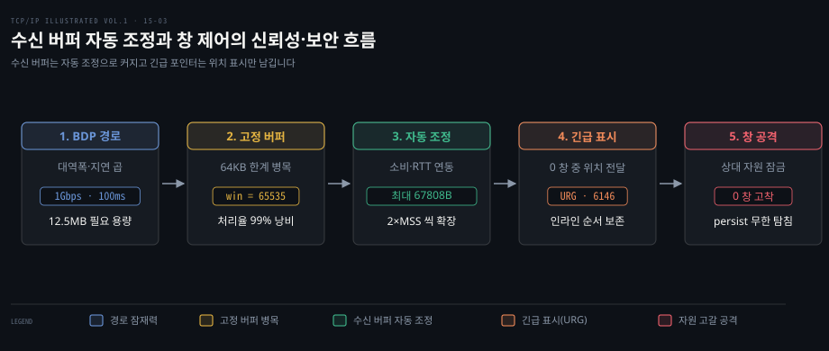
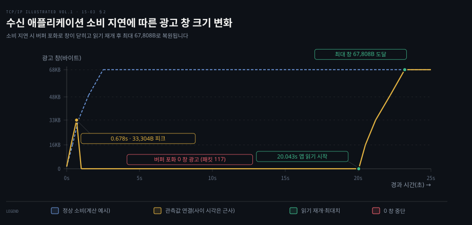
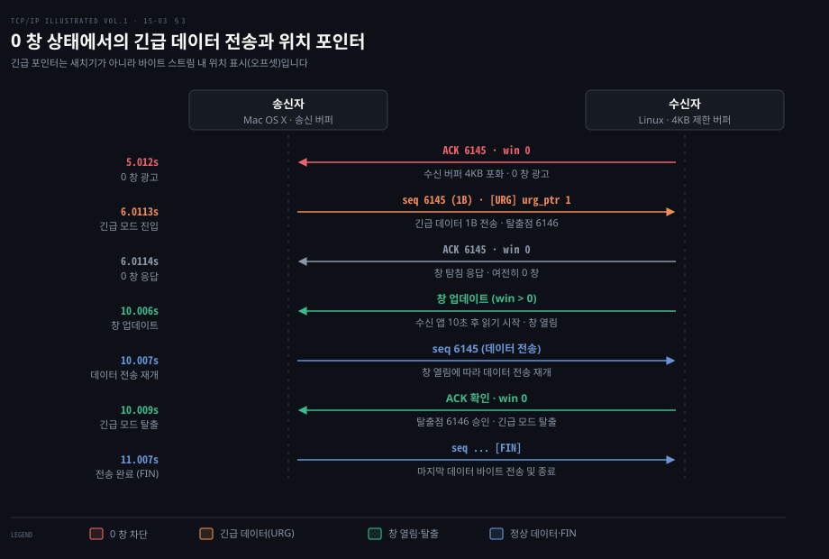

# 수신 버퍼는 자동 조정으로 커지고 긴급 포인터는 쓰지 않는다

---

> 지연이 길고 대역폭이 넓은 경로에서는 수신 버퍼 자동 조정이 창을 동적으로 키워 대역폭 낭비를 막고, 긴급 포인터는 새치기 채널이 아닌 바이트 위치 표시일 뿐이며 현대 명세에서는 사용이 권장되지 않습니다.

## 핵심 요약

> 정적 소켓 버퍼의 한계는 커널 자동 조정이 해결하고, 0 창 상태에서 나가는 긴급 표시는 스트림 내 위치만 남기며, 창 크기를 악용한 자원 고갈 공격은 시스템 자원을 방어하는 강제 종료 정책으로 차단합니다.

장거리 고속 네트워크에서 정적으로 고정된 수신 버퍼는 대역폭의 대부분을 놀리는 심각한 성능 저하를 부릅니다. 왕복 시간이 100ms 인 1Gbps 경로에서 기본 64KB 창만 사용하면 최대 처리율이 수백 KB/s 로 묶여 링크 용량의 99%를 낭비합니다. 그렇다고 모든 소켓에 수십 메가바이트의 버퍼를 고정 할당하면 수만 개의 동시 연결을 다루는 서버의 시스템 메모리가 순식간에 고갈됩니다. 현대 운영체제는 연결의 왕복 시간과 애플리케이션 소비 속도를 관측하여 창을 동적으로 키우는 자동 조정을 기본으로 탑재합니다.

한편 TCP 헤더의 URG 플래그와 긴급 포인터는 데이터를 일반 흐름보다 먼저 보내는 대역 외 채널로 오해받기 쉽습니다. 하지만 실제로는 바이트 스트림 안에 인라인으로 실려 전송되며 긴급 데이터의 끝 위치를 알리는 오프셋 표시에 불과합니다.

0 창 상태에서도 긴급 데이터는 창 탐침 세그먼트에 실려 전달될 수 있습니다. 그러나 과거 규격 간 해석 충돌과 방화벽 등 미들박스의 플래그 변조 문제가 만연했습니다. 이에 따라 현행 RFC 9293 은 신규 애플리케이션의 긴급 메커니즘 사용 자제를 권고(SHOULD NOT)하면서도 프로토콜 스택 차원의 구현 의무(MUST-30)는 유지합니다.

나아가 TCP 흐름 제어의 윈도 관리 절차는 자원 고갈을 유도하는 공격 수단으로 악용될 수 있습니다. 0 창이나 극소 창을 고의로 광고하여 송신 측의 송신 버퍼와 persist 타이머를 무한정 붙잡아 두는 수법은 피해 시스템의 커널 소켓 메모리를 고갈시키는 심각한 위협이 됩니다. 현대 리눅스는 소켓별 타임아웃과 고아 소켓 회수 정책을 마련하여 이러한 교착 공격으로부터 운영체제 자원을 보호합니다.

## 학습 목표

> 이 편을 읽고 나면 다음을 설명할 수 있습니다.

1. 대역폭·지연 곱이 큰 경로에서 고정 수신 버퍼가 유발하는 처리율 낭비와 대용량 정적 할당의 메모리 부하를 정량적으로 계산할 수 있습니다.
2. 리눅스 커널의 수신 버퍼 자동 조정이 RTT 와 애플리케이션 읽기 속도를 측정하여 창 크기를 단계적으로 확장하는 원리를 설명할 수 있습니다.
3. 리눅스 6.6 커널에서 `tcp_adv_win_scale` 이 폐기되고 동적 패킷 오버헤드 산정 방식으로 전환된 기술적 배경을 규명할 수 있습니다.
4. 긴급 포인터가 대역 외 전송이 아닌 인라인 위치 오프셋인 이유와 현행 RFC 9293 에서 신규 사용을 권고하지 않게(SHOULD NOT) 된 역사적 배경을 분석할 수 있습니다.
5. 타르핏과 persist 타이머 취약점을 악용한 창 관리 기반 자원 고갈 공격의 메커니즘과 현대 운영체제의 방어 전략을 대비할 수 있습니다.

고속 경로의 BDP 잠재력을 온전히 활용하기 위해 수신 버퍼 자동 조정이 창을 동적으로 확장하며, 인라인 위치 표시자인 긴급 포인터와 0 창을 악용한 자원 고갈 공격에 대한 시스템 방어 체계가 연결의 신뢰성을 완성합니다.

## 1. 빠르고 먼 경로를 채우려면 수신 버퍼가 커야 한다

> 대역폭이 넓고 지연이 긴 장거리 고속 경로에서는 수신 버퍼가 충분히 커야 파이프라인을 꽉 채울 수 있지만, 버퍼를 고정으로 크게 잡으면 메모리 자원이 낭비됩니다.

### 대역폭·지연 곱과 작은 수신 버퍼의 병목

TCP 송신자가 확인 응답을 받지 않고 네트워크에 띄워 둘 수 있는 데이터의 양은 상대방이 허용한 수신 창 크기에 의해 엄격히 제한됩니다. 네트워크 파이프라인을 쉬지 않고 가득 채우기 위해 필요한 최소 창 크기는 연결의 대역폭과 왕복 시간을 곱한 **대역폭·지연 곱**으로 결정됩니다. 이 개념의 이론적 기초와 윈도 스케일 옵션의 협상 절차는 [컴퓨터 네트워킹 하향식 접근: 흐름 제어와 혼잡](../cntd_computer-networking-top-down/03-04.흐름%20제어와%20연결%20관리,%20그리고%20혼잡.md) 및 [13-02](./13-02.TCP%20옵션은%2040바이트%20안에서%20능력과%20한계를%20알린다.md) 에서 다루었습니다.

과거 16비트 TCP 헤더의 최대 표현 한계였던 64KB(65,535바이트) 창을 사용하는 환경을 가정해 보겠습니다. 왕복 시간(RTT)이 약 100ms 에 달하는 미국 대륙 횡단 경로에서 1Gbps 네트워크 링크를 사용할 때, 네트워크 파이프를 가득 채우는 데 필요한 데이터 용량은 다음과 같이 계산됩니다.

$$\text{BDP} = 1\,\text{Gbps} \times 100\,\text{ms} = 10^9\,\text{bps} \times 0.1\,\text{s} = 10^8\,\text{bits} = 12.5\,\text{MB}$$

이론적으로 1초당 약 130MB 에 달하는 전송 능력을 갖춘 링크임에도 불구하고 수신 버퍼가 64KB 로 제한되어 있다면 실제 얻을 수 있는 최대 처리율은 처참하게 떨어집니다.

$$\text{최대 처리율} \le \frac{65{,}535\,\text{bytes}}{0.1\,\text{s}} \approx 655{,}000\,\text{B/s}\;(\text{약 } 640\,\text{KiB/s})$$

전체 가용 대역폭 중 불과 0.5% 만 사용하고 나머지 99% 이상의 전송 용량을 고스란히 버리게 되는 셈입니다. 윈도 스케일 옵션을 켜고 충분히 큰 수신 버퍼를 확보하는 것만으로도 처리율이 100배 이상 폭발적으로 뛰어오르는 이유가 바로 여기에 있습니다.

### 정적 대용량 버퍼의 치명적 낭비

그렇다면 운영체제가 모든 TCP 소켓에 대해 처음부터 수십 메가바이트 크기의 대용량 버퍼를 고정으로 할당해 두면 이 문제가 간단히 해결될까요? 현실에서는 오히려 심각한 시스템 재앙을 부릅니다.

첫째 물리 메모리의 극심한 낭비입니다. 웹 서버나 API 게이트웨이와 같은 현대 인터넷 서버는 수천에서 수십만 개의 TCP 연결을 동시에 유지합니다. 만약 각 소켓마다 12.5MB 의 수신 버퍼를 정적으로 고정 할당한다면 연결 1만 개만 맺어져도 순수 소켓 버퍼로만 125GB 이상의 물리 RAM 이 증발합니다. 대다수의 연결은 작은 요청과 응답을 주고받는 짧은 수명의 트래픽이거나 모바일 망처럼 지연과 대역폭이 작은 환경인데, 여기에 일괄적으로 초대형 버퍼를 묶어두는 것은 자원 낭비의 극치입니다.

둘째 버퍼블로트와 지연 시간의 폭증입니다. 수신 측 애플리케이션의 처리 속도가 느린 상태에서 버퍼만 무작정 거대하게 열어두면, 송신자가 쏟아부은 수십 메가바이트의 데이터가 수신 커널 큐에 수 초 동안 머무르며 지연 시간이 치솟게 됩니다.

따라서 애플리케이션 개발자가 소켓 버퍼 크기를 수동으로 지정하는 것에 의존하지 않고, 운영체제 커널이 연결의 실제 경로 특성과 데이터 소비 속도를 실시간으로 추적하여 필요한 만큼만 버퍼를 늘려주는 **수신 버퍼 자동 조정** 메커니즘이 필연적으로 등장하게 되었습니다.

## 2. Linux 는 수신 버퍼를 연결마다 자동으로 키운다

> 리눅스 커널은 연결의 RTT 와 애플리케이션 읽기 속도를 측정하여 소켓 버퍼를 동적으로 확장하며, 애플리케이션이 읽기를 멈추면 창 성장을 즉시 동결합니다.

### 자동 조정의 측정 원리와 창 확장 메커니즘

수신 버퍼 자동 조정의 핵심 목표는 송신자의 전송 속도를 억제하지 않으면서도 수신 호스트의 메모리 사용량을 최소한으로 유지하는 것입니다. 이를 위해 커널은 수신자가 광고하는 창 크기를 송신자의 혼잡 창 성장 속도보다 항상 한발 앞서도록 조절합니다.

리눅스 커널은 데이터가 도착할 때마다 확인 응답(ACK)을 회신하면서 광고 창 크기를 이전 값에서 $2 \times \text{MSS}$ 씩 키워 나갑니다. 이는 송신자가 느린 시작 단계에서 ACK 를 받을 때마다 혼잡 창을 키워 최대 2개의 풀 사이즈 세그먼트를 쏟아내는 전송 패턴에 발을 맞추기 위함입니다. 수신 메모리에 여유가 있는 한 광고 창은 언제나 송신자가 보낼 수 있는 바이트 한도를 넉넉하게 상회하므로 송신자는 네트워크 용량의 한계까지 전송 속도를 끌어올릴 수 있습니다.

또한 Linux 2.6.11 은 `tcp_rcv_space_adjust` 를 통해 애플리케이션이 RTT 한 번 동안 읽어 간 바이트 수를 재서 버퍼를 키웠습니다. 이때 수신 측 RTT 추정은 Dynamic Right-Sizing 에 기반하며, RTT 추정치가 줄어도 버퍼를 줄이지 않았습니다. 현재 커널도 같은 함수로 동작하며 버퍼를 키울 때 `tcp_rcvbuf_grow` 를 부릅니다.

### 애플리케이션 소비 지연과 0 창 붕괴 실측

자동 조정은 수신 애플리케이션이 데이터를 제때 읽어 큐를 비워줄 때만 정상 작동합니다. 애플리케이션이 소비를 멈추면 커널 버퍼가 가득 차면서 자동 조정 곡선은 급격히 반전됩니다.

실제 캡처 실험을 살펴보겠습니다. 대용량 창과 윈도 스케일을 활성화한 송신자가 데이터를 전송하고, 리눅스 2.6.11 수신자는 수신 버퍼 자동 조정을 켠 상태에서 애플리케이션이 20초 동안 읽기 작업을 수행하지 않도록 지연을 걸었습니다. 연결 수립 직후 초기 창 크기는 1460바이트였으며 초기 MSS 는 1412바이트, 윈도 스케일 시프트 값은 2(최대 256KB)로 협상되었습니다.

데이터 전송이 시작되자 리눅스 수신자는 ACK 를 반환할 때마다 $2 \times \text{MSS}$ 인 2824바이트씩 광고 창을 공격적으로 키웠습니다. 광고 창 값은 10712, 13536, 16360, 19184 바이트로 규칙적으로 계단식 상승을 이어갔습니다.

그러나 애플리케이션이 20초간 전혀 데이터를 읽지 않았기 때문에 수신 버퍼는 순식간에 차올랐습니다. 0.678초 시점에 광고 창은 33,304바이트로 정점을 찍은 직후 성장을 멈추고 반전되었습니다. 남은 버퍼 공간이 소진되면서 수신 창 광고는 패킷 117에서 0바이트로 완전히 닫혔습니다. 이후 송신자는 persist 타이머를 가동하여 주기적인 창 탐침을 보냈고 수신자는 여전히 버퍼가 가득 찼다는 0 창 ACK 로 응답했습니다.

20.043초에 이르러 수신 애플리케이션이 마침내 읽기 작업을 시작하자 즉시 창 업데이트 세그먼트가 발송되었습니다. 버퍼 공간이 비워지면서 창 크기는 다시 ACK 마다 $2 \times \text{MSS}$ 씩 수직 상승하였고, 궁극적으로 이 연결의 최고치인 **67,808바이트**까지 안전하게 도달했습니다.

위 도식의 파란 점선은 애플리케이션이 지연 없이 즉시 소비했을 때의 이론적 곡선(계산 예시: 초기 1460B 시작 추세)입니다. 실선은 관측값(0.678초 33,304바이트, 0 창, 20.043초 재개, 최대 67,808바이트)을 연결한 근사 흐름입니다.

### 리눅스 시스템 튜너블과 6.6 커널의 패러다임 전환

리눅스 커널의 수신 버퍼 자동 조정 동작은 `sysctl` 파라미터로 세밀하게 통제됩니다. 시스템 전역 네트워크 튜너블의 상세한 설정 방법은 [시스템 성능 분석: 네트워크 튜닝](../systems-performance/10-03.네트워크%20—%20방법론·실험·튜닝.md) 에서 다루며, 본 절에서는 수신 버퍼와 직결된 핵심 변수를 짚어봅니다.

첫째 `net.ipv4.tcp_rmem` 은 최소값, 기본값, 최대값의 세 정수 벡터로 구성됩니다.
- **최소값(min)**: 메모리 압박이 보통 수준(moderate)일 때도 각 TCP 소켓에 보장되는 최소 버퍼 크기이며 기본값은 4096바이트(4KB)입니다.
- **기본값(default)**: 소켓 생성 시 초기에 부여되는 수신 버퍼 크기로 과거 87,380바이트에서 현대 리눅스는 131,072바이트(128KB)를 기본으로 사용하여 초기 창 65,535바이트를 확보합니다.
- **최대값(max)**: 자동 조정을 통해 확장될 수 있는 소켓 버퍼의 절대 상한선입니다. 시스템의 물리 RAM 용량에 따라 자동으로 수십 메가바이트(최대 32MB 등)까지 동적 설정됩니다. 단 애플리케이션이 `setsockopt()` 로 `SO_RCVBUF` 를 직접 호출하여 버퍼를 고정하면 해당 소켓의 커널 자동 조정 기능은 즉시 꺼지며 이 상한선도 무시됩니다.

둘째 `net.ipv4.tcp_moderate_rcvbuf` 는 수신 버퍼 자동 조정의 활성화 여부를 결정하는 불리언 플래그로 기본값은 1(활성)입니다.

셋째 버퍼 메모리 중 패킷 헤더 오버헤드를 제외하고 실제 수신 창으로 광고할 공간의 비율을 지정하던 `net.ipv4.tcp_adv_win_scale` 변수입니다. 과거 기본값은 1이었으며 이는 전체 버퍼의 절반($2^{-1} = 50\%$)을 광고 창에 배정하고 나머지 50% 를 커널 `sk_buff` 구조체 및 패킷 메타데이터 오버헤드로 남겨두는 방식이었습니다.

그러나 최신 네트워크 인터페이스 카드(NIC) 드라이버가 MTU 1500 트래픽에 대해 페이지 단위(order-0 page)로 메모리를 통째로 할당하는 방식으로 진화하면서 문제가 발생했습니다. 정적인 50% 분할 공식은 실제 메모리 사용량을 과대 혹은 과소 평가하여, 수신 버퍼가 부족해 패킷을 병합·정리하는 고비용의 커널 `tcp_collapse` 연산과 지연 시간 스파이크를 초래했습니다.

이 문제를 해결하기 위해 리눅스 6.6 커널에서 에릭 뒤마제(Eric Dumazet)의 [커밋 dfa2f0483360](https://github.com/torvalds/linux/commit/dfa2f0483360) 을 통해 `tcp_adv_win_scale` 은 공식적으로 **폐기(Obsolete)**되었습니다. 현대 리눅스는 시스템 전역의 정적 비율 대신 소켓마다 유입되는 실제 패킷의 유효 페이로드 대 실제 할당 메모리 비율(`skb->len / skb->truesize`)을 동적으로 측정하여, 수신 창 스케일링 계수를 소켓별로 최적화합니다.

## 3. 긴급 포인터는 바이트 흐름에 위치 표시만 남긴다

> TCP 긴급 메커니즘은 데이터를 새치기하여 전송하는 대역 외 채널이 아니며, 바이트 스트림 안에 인라인으로 실려 긴급 데이터의 끝 위치를 알리는 오프셋 표시에 불과합니다.

### 긴급 메커니즘의 오해와 본질

버클리 소켓 API 의 `MSG_OOB` 플래그 때문에 많은 엔지니어가 TCP 의 긴급 데이터를 별도의 전용 통로를 타고 일반 데이터보다 먼저 도착하는 **대역 외 데이터**로 오해하곤 합니다.

하지만 TCP 는 결코 물리적이거나 논리적인 독립 우회로를 제공하지 않습니다. 긴급 데이터는 일반 데이터와 완전히 동일하게 TCP 송신 버퍼에 적재되며 정확히 기록된 순서 번호의 순서대로 바이트 스트림 안에 나란히 섞여 전송됩니다. TCP 세그먼트 헤더에 달라지는 점은 단 두 가지뿐입니다. 제어 플래그의 **URG 비트**가 1로 설정되고 16비트 **긴급 포인터** 필드에 특정 바이트 오프셋 값이 실립니다.

수신 TCP 는 URG 비트가 1인 세그먼트를 수신하면 소켓 계층에 예외 신호를 발생시켜 애플리케이션이 긴급 모드에 진입했음을 알립니다. 수신 측 프로세스는 `select()` 시스템 콜의 예외 세트 등을 통해 이를 감지하고 긴급 데이터를 소비할 준비를 갖춥니다.

### 포인터 해석의 갈등과 역사적 종결

긴급 포인터가 가리키는 대상이 정확히 어디인가를 두고 수십 년간 심각한 혼선이 이어졌습니다.

1981년 최초의 TCP 규격인 RFC 793 은 17쪽에서 긴급 포인터가 긴급 데이터 다음 바이트(첫 번째 비긴급 바이트)를 가리킨다고 기술한 반면, 56쪽에서는 마지막 바이트(`SND.NXT-1`)를 가리키도록 서술하여 규격 자체에 모순이 있었습니다.

$$\text{다음 바이트 방식(탈출 지점)} = \text{SEG.SEQ} + \text{SEG.UP}$$

이후 RFC 1011 과 1989년의 RFC 1122 는 17쪽 설명이 잘못되었다고 판단하여 긴급 포인터가 **긴급 데이터의 마지막 바이트**를 가리킨다고 정리했습니다.

$$\text{RFC 1122 해석} = \text{SEG.SEQ} + \text{SEG.UP} - 1$$

그러나 규격의 정리에도 불구하고 BSD 계열을 비롯한 대다수의 실제 운영체제 스택은 이미 RFC 793 17쪽의 '다음 바이트' 방식을 구현하여 널리 배포된 뒤였습니다. 결국 2011년 [RFC 6093](https://www.rfc-editor.org/rfc/rfc6093) 은 실제 구현 관행을 수용하여 긴급 포인터가 긴급 데이터 다음 바이트(첫 비긴급 바이트)를 가리키도록 명세를 공식 개정했습니다. 2022년의 현행 통합 규격인 [RFC 9293](https://www.rfc-editor.org/rfc/rfc9293) §3.8.5 역시 긴급 포인터는 반드시 긴급 데이터 바로 다음 바이트의 순서 번호를 가리켜야 한다고 규정(MUST-62)하고 있습니다.

그러나 방화벽과 NAT 등 수많은 중간 라우팅 장비(미들박스)가 URG 비트를 임의로 삭제하거나 오프셋을 변조하는 문제가 인터넷 전반에 만연해 있었습니다. 이에 따라 현행 명세 RFC 9293 은 **신규 애플리케이션 계층 프로토콜은 TCP 긴급 메커니즘을 사용해서는 안 된다(SHOULD NOT, SHLD-13)**고 못 박았습니다. 과거 Telnet 의 인터럽트(`Ctrl+C`)나 FTP 의 전송 중단 신호처럼 레거시 호환성을 위해 스택 차원의 지원은 유지되지만, 현대 시스템에서 우선순위 제어가 필요하다면 별도의 독립된 제어용 TCP 연결을 맺는 것이 정석입니다.

### 0 창 상태에서의 긴급 세그먼트 전송 실측

긴급 메커니즘의 독특한 동작 중 하나는 수신 창이 완전히 닫힌 0 창 상태에서도 긴급 데이터를 담은 세그먼트가 네트워크로 발송될 수 있다는 점입니다.

수신 버퍼를 4KB 로 제한하고 10초 지연 후 1초마다 데이터를 읽도록 설정한 리눅스 수신자와 Mac OS X 송신자 사이의 실측 캡처를 분석해 보겠습니다. 송신 애플리케이션은 1024바이트를 1초 간격으로 쓰다가 7번째 쓰기 직전에 1바이트의 긴급 데이터(`MSG_OOB`)를 소켓에 기록했습니다.

5.012초 시점에 수신 버퍼 4KB 가 가득 차면서 수신자는 `ACK 6145, win 0` 세그먼트를 송신자에게 전달했습니다. 송신 창이 완전히 닫혔음에도 불구하고 송신 측 TCP 는 애플리케이션의 긴급 데이터 쓰기 요청을 받아 긴급 모드로 진입했습니다.

6.0113초에 송신자는 1바이트 페이로드를 실은 창 탐침 세그먼트를 발송하였으며, 이 세그먼트의 헤더에는 URG 플래그가 설정되어 있었습니다.
- 세그먼트 순서 번호: 6145
- 긴급 포인터 값: 1
- 탈출 지점(Exit Point): $6145 + 1 = \mathbf{6146}$

순서 번호 6145 바이트가 1바이트 긴급 데이터 자체이며, 긴급 포인터 1이 더해진 6146 은 긴급 모드가 종료되는 첫 비긴급 바이트의 순서 번호(탈출 지점)입니다. 수신자는 버퍼가 여전히 비지 않았으므로 6.0114초에 `ACK 6145, win 0` 으로 회신했습니다.

10.006초에 이르러 수신 애플리케이션이 데이터를 읽기 시작하자 창 업데이트 세그먼트가 도착하여 데이터 전송이 재개되었습니다. 그러나 10.009초에 다시 0 창 광고가 도착하며 전송이 잠시 멈춥니다. 다만 이 10.009초 세그먼트의 확인 응답이 긴급 포인터(6146)까지 확인했으므로 송신자는 긴급 모드를 완전히 빠져나왔습니다. 이후 연결의 마지막 데이터 바이트는 11.007초의 FIN 세그먼트에 실려 전달되었습니다.

위 시퀀스 도식에서 확인되듯 긴급 데이터는 0 창으로 전송이 중단된 상황에서도 창 탐침의 형태로 유효하게 전달되어 상대방에게 긴급 상황의 발생을 알리는 역할을 수행했습니다.

## 4. 작은 창은 상대의 자원을 오래 붙잡는 공격이 된다

> 공격자가 고의로 극소 크기의 창이나 0 창을 광고하면 송신자의 소켓 메모리와 타이머 자원이 장시간 묶여 심각한 서비스 거부(DoS) 상태로 이어집니다.

### 윈도 관리를 악용한 자원 고갈 공격

TCP 흐름 제어는 수신자가 자신의 버퍼 여유에 따라 창 크기를 결정하도록 전권을 부여합니다. 하지만 이 규칙의 맹점을 파고들면 적은 비용으로 상대방 서버의 시스템 자원을 고갈시키는 강력한 공격 수단이 됩니다.

상대방이 작은 창을 열어줄 때마다 송신자는 데이터를 한 번에 보내지 못하고 아주 잘게 쪼개어 보내거나 전송을 멈추고 대기해야 합니다. 이 과정에서 송신 호스트는 데이터를 송신 버퍼에 오랫동안 유지해야 하고, 커널의 타이머와 전송 제어 블록(TCB) 자원을 회수하지 못한 채 붙잡혀 있게 됩니다.

이러한 메커니즘을 이용한 대표적인 공격 방식에는 웜 트래픽을 지연시키기 위해 고안된 **타르핏(Tarpit)** 기법과, 0 창 상태를 영구화하여 서버 메모리를 말려 죽이는 **persist 타이머 공격**이 있습니다.

| 비교 항목 | LaBrea 타르핏 (Tarpit) | Persist 타이머 공격 (Sockstress / NKiller2 / VU#723308) |
| :--- | :--- | :--- |
| **목적** | 악성 웜 전파 지연 (공격 트래픽 역공) | 서버 서비스 거부 (시스템 자원 고갈 DoS) |
| **핵심 기법** | 3-way 핸드셰이크 후 극소 창(Small Window) 유지 또는 침묵 | 핸드셰이크 직후 지속적인 0 창(Zero Window) 광고 |
| **공격자 자원 소모** | 상태를 최소화하여 수동적 연결 유지 | 클라이언트 SYN 쿠키 기법으로 로컬 상태 거의 0 |
| **피해 측 증상** | 송신 윈도가 극도로 좁아져 전송 지연 극대화 | 무한 persist 창 탐침 루프와 소켓 버퍼 메모리 고갈 |
| **주요 희생 자원** | 웜 감염 호스트의 아웃바운드 소켓 스레드 | 서버의 커널 연결 테이블(TCB) 및 물리 RAM |

### 타르핏 기법: 공격 트래픽을 진흙탕에 빠뜨리기

LaBrea 로 대표되는 타르핏 기법은 원래 2000년대 초반 코드레드(Code Red)나 님다(Nimda) 같은 무작위 스캐닝 웜의 확산을 막기 위해 방어자 진영에서 개발한 능동 방어 수단이었습니다.

타르핏 호스트는 미사용 IP 주소로 들어오는 SYN 패킷을 가로채 3-way 핸드셰이크를 정상적으로 완료합니다. 연결이 수립되자마자 타르핏은 상대방에게 극소 크기의 윈도(예: 수 바이트)를 광고하거나 데이터에 대한 응답을 의도적으로 지연시킵니다.

감염된 웜 호스트는 TCP 연결이 정상 유지되고 있다고 판단하므로 타임아웃을 내지 못하고 데이터를 바이트 단위로 찔끔거리며 보내거나 대기 큐에 갇히게 됩니다. 하나의 연결을 수십 분에서 수 시간 동안 질질 끌며 웜의 스레드와 소켓 자원을 잠식함으로써 다른 정상 호스트로의 감염 시도 자체를 억제하는 효과를 냅니다.

### Persist 타이머 공격: 무한 탐침을 악용한 서버 고갈

반면 2009년 Phrack 66호에 발표된 persist 타이머 공격(ithilgore 의 NKiller2)과 2008년의 Sockstress 는 서버를 쓰러뜨리기 위해 악의적으로 고안된 치명적인 DoS 공격입니다. 미국 CERT 는 이를 취약점 노트 VU#723308 로 등록하여 persist 조건을 악용한 공격 방어책을 다루었습니다.

공격자는 희생자 서버에 TCP 연결을 맺은 직후 수신 창 크기로 즉시 0을 광고합니다. 서버는 전송할 응답 데이터가 있음에도 창이 닫혔으므로 데이터를 보내지 못하고 persist 타이머를 가동하여 주기적으로 1바이트 창 탐침을 전송합니다.

공격자는 서버가 보내오는 창 탐침에 대해 버퍼가 여전히 0이라는 ACK 응답만을 기계적으로 회신합니다. 더욱 치명적인 점은 공격자가 클라이언트 측 SYN 쿠키 기법을 적용하여 자신의 로컬 시스템에서는 소켓 상태를 전혀 보관하지 않는다는 사실입니다. 최소한의 패킷 생성만으로 희생자 서버 쪽에 수만 개의 유효 연결을 유지시키고, 서버가 각 연결마다 커널 버퍼와 persist 타이머를 계속 유지하도록 강제합니다. 수만 개의 소켓 버퍼가 RAM 을 잠식하면서 서버는 신규 정상 접속을 받지 못하고 뻗어버립니다.

### 운영체제의 자원 방어 체계

RFC 규격의 문자 그대로를 따르면 0 창 탐침은 상대방이 살아있는 한 영원히 반복되어야 합니다. 그러나 이 원칙을 맹신하면 persist 타이머 공격에 무방비로 노출됩니다.

[15-02](./15-02.수신%20창은%20송신을%20붙잡고%200%20창은%20persist%20타이머가%20다시%20연다.md) 에서 정리했듯이 현대 리눅스 커널은 정상적인 소켓에 대해 0 창 ACK 응답이 돌아올 때마다 탐침 카운터를 리셋하지만, 좀비 연결에 자원이 잠기는 것을 막기 위해 다중 방어선을 운용합니다.
- `TCP_USER_TIMEOUT` 소켓 옵션을 통해 미확인 데이터나 전송 중단 상태가 지정된 시간 이상 지속되면 연결을 강제로 단절합니다.
- 애플리케이션이 이미 닫았지만(`close()`) 커널에 연결이 남아있는 고아 소켓(`SOCK_DEAD`)에 대해서는 `tcp_orphan_retries` 상한을 엄격히 적용하여 시스템 자원을 회수합니다.
- 시스템에 메모리가 부족해지면 커널은 고아 소켓부터 강제 종료하여 자원을 회수합니다(`tcp_out_of_resources`).

패킷 분석 관점에서 이러한 비정상 0 창 광고와 연속 탐침 패턴을 진단하는 실무 기법은 [와이어샤크 패킷 분석: TCP가 어긋날 때](../paw_packet-analysis-wireshark/03-02.TCP가%20어긋날%20때.md) 에서 확인할 수 있습니다.

## 면접 대비

> 아래 질문에 답하면서 버퍼 자동 조정의 동적 확장 공식과 긴급 포인터 규격의 본질을 함께 설명해 보세요.

1. BDP 가 큰 고속 장거리 통신에서 고정 크기의 대용량 버퍼를 할당하지 않고 자동 조정을 사용하는 이유는 무엇인가요?
2. 리눅스 수신 버퍼 자동 조정은 수신 창 크기를 어떤 기준으로 키우며, 애플리케이션이 읽기를 멈추면 왜 0 창이 발생하나요?
3. 리눅스 6.6 커널에서 시스템 전역 파라미터인 `tcp_adv_win_scale` 이 폐기된 기술적 배경은 무엇인가요?
4. TCP 긴급 포인터는 왜 진정한 대역 외 데이터가 아니며, 현행 RFC 9293 에서 신규 사용이 권장되지 않는 이유는 무엇인가요?
5. Persist 타이머를 악용한 공격(Sockstress)의 메커니즘과 일반적인 SYN 플러딩 공격과의 차이점은 무엇인가요?

## 정답 (자답 후 펼치기)

> 위 §면접 대비의 질문에 먼저 스스로 답한 뒤 읽으세요.

### 정답 1 — 동시 연결 메모리 보존과 버퍼블로트 방지

모든 소켓에 수십 메가바이트의 버퍼를 고정 할당하면 수만 개의 동시 세션을 유지하는 서버에서 물리 RAM 이 즉시 고갈됩니다. 또한 애플리케이션 소비가 느린 연결에 대형 버퍼가 주어지면 패킷이 큐에 체류하며 지연 시간이 치솟는 버퍼블로트가 일어납니다. 자동 조정은 연결의 실제 RTT 와 처리량을 지속 관측하여 활성 대용량 전송에만 필요한 만큼 버퍼를 동적으로 배정함으로써 메모리 효율성과 전송률을 동시에 달성합니다.

### 정답 2 — ACK 당 2 MSS 확장과 버퍼 포화

리눅스는 송신 측 느린 시작의 윈도 증가에 보조를 맞추기 위해 ACK 마다 광고 창을 $2 \times \text{MSS}$ 씩 확장하여 광고 창이 항상 송신 혼잡 창보다 앞서도록 유도합니다. 그러나 애플리케이션이 데이터를 소비하지 않으면 커널 수신 큐에 데이터가 누적되어 물리 버퍼 한계에 도달합니다. 남은 수신 공간이 고갈되면 커널은 패킷 드롭을 방지하기 위해 광고 창 크기를 0으로 줄여 전송을 일시 중단시킵니다.

### 정답 3 — 페이지 단위 NIC 할당과 동적 오버헤드 측정

과거 `tcp_adv_win_scale` 은 버퍼의 50% 를 정적으로 오버헤드 공간으로 떼어두었습니다. 하지만 최신 NIC 드라이버가 MTU 1500 패킷마다 페이지 단위 메모리를 통째로 할당하면서 정적 공식이 메모리 사용량을 왜곡하여 잦은 `tcp_collapse` 와 지연 스파이크를 유발했습니다. 이에 리눅스 6.6 은 전역 sysctl 을 폐기하고 소켓별 실제 패킷의 유효 데이터 대 할당 메모리 비율(`skb->len / skb->truesize`)을 동적으로 계산하도록 개편했습니다.

### 정답 4 — 인라인 바이트 스트림과 미들박스 비호환

긴급 데이터는 우회로를 타지 않고 일반 바이트 스트림 안에 정확한 순서 번호 순으로 실려 전송되며 긴급 포인터는 첫 비긴급 바이트의 위치 오프셋을 알릴 뿐입니다. 과거 RFC 793 과 1122 간의 포인터 가리킴 위치 상충으로 구현 간 혼선이 컸습니다. 나아가 방화벽이나 NAT 등 중간 네트워크 장비(미들박스)가 URG 플래그를 변조하거나 삭제하는 문제가 만연하여 현행 RFC 9293 은 신규 애플리케이션이 긴급 메커니즘을 사용하지 말라고(SHOULD NOT) 강력히 권고하고 있습니다.

### 정답 5 — 비대칭 자원 소모와 영구 persist 탐침 고착

SYN 플러딩은 연결 수립 단계에서 미완료 큐를 채우는 공격인 반면, persist 타이머 공격은 3-way 핸드셰이크를 완전히 맺은 뒤 지속적으로 0 창을 광고하는 기법입니다. 공격자는 클라이언트 SYN 쿠키를 활용해 자신의 소켓 상태를 거의 유지하지 않으면서, 피해 서버가 완성된 소켓 버퍼를 유지한 채 주기적으로 1바이트 창 탐침을 무한정 전송하게 만들어 서버의 커널 메모리와 TCB 자원을 고갈시킵니다.

## 참고 자료

> 본문의 수신 버퍼 자동 조정, 긴급 메커니즘 및 윈도 공격 분석은 2판 원문과 현행 RFC 및 리눅스 커널 구현을 대조하여 검증했습니다.

- Kevin R. Fall · W. Richard Stevens, 《TCP/IP Illustrated, Volume 1: The Protocols》, 2nd ed., Ch.15 §15.5.4–15.8, ISBN 978-0-321-33631-6.
- [RFC 9293: Transmission Control Protocol (TCP) Specification](https://www.rfc-editor.org/rfc/rfc9293) — §3.8.5 긴급 정보 전달, §3.8.6 창 관리.
- [RFC 6093: On the Implementation of the TCP Urgent Mechanism](https://www.rfc-editor.org/rfc/rfc6093) — 긴급 포인터 해석의 역사적 상충 해결 및 신규 사용 금지 권고.
- [RFC 1122: Requirements for Internet Hosts -- Communication Layers](https://www.rfc-editor.org/rfc/rfc1122) — §4.2.2.4 긴급 포인터 처리.
- [RFC 793: Transmission Control Protocol](https://www.rfc-editor.org/rfc/rfc793) — §3.1 헤더 포맷 및 긴급 포인터 원형 정의.
- [Linux Kernel Documentation: ip-sysctl.rst](https://github.com/torvalds/linux/blob/master/Documentation/networking/ip-sysctl.rst) — `tcp_rmem`, `tcp_moderate_rcvbuf`, `tcp_adv_win_scale`.
- [Linux Kernel Commit dfa2f0483360](https://github.com/torvalds/linux/commit/dfa2f0483360) — `tcp: get rid of sysctl_tcp_adv_win_scale` (Eric Dumazet, Linux 6.6).
- [US-CERT Vulnerability Note VU#723308](https://www.kb.cert.org/vuls/id/723308) — TCP may keep its offered receive window closed indefinitely (RFC 1122), 2009-11-23.

## 관련 문서

> 슬라이딩 윈도와 0 창 탐침의 기초 원리를 확인하고, 상위 계층 버퍼링 및 시스템 성능 튜닝으로 연결합니다.

- [12-01. TCP 신뢰성](./12-01.TCP%20의%20신뢰성은%20재전송·번호·창으로%20만든다.md) — 슬라이딩 윈도와 확인 응답 구조의 기초 정본입니다.
- [13-02. TCP 옵션](./13-02.TCP%20옵션은%2040바이트%20안에서%20능력과%20한계를%20알린다.md) — 16비트 한계를 극복하는 윈도 스케일 옵션의 협상과 스케일 팩터 계산입니다.
- [15-01. 지연 ACK 와 Nagle](./15-01.작은%20세그먼트는%20지연%20ACK%20와%20Nagle%20알고리즘이%20묶어%20보낸다.md) — 상호작용 세그먼트 전송과 지연 ACK 의 상호작용 원리입니다.
- [15-02. 수신 창과 persist 타이머](./15-02.수신%20창은%20송신을%20붙잡고%200%20창은%20persist%20타이머가%20다시%20연다.md) — 0 창 교착 방지와 persist 타이머 탐침 메커니즘의 기초 정본입니다.
- [컴퓨터 네트워킹 하향식 접근: 흐름 제어와 혼잡](../cntd_computer-networking-top-down/03-04.흐름%20제어와%20연결%20관리,%20그리고%20혼잡.md) — 대역폭·지연 곱과 수신 윈도 수식의 이론적 기초입니다.
- [시스템 성능 분석: 네트워크 튜닝](../systems-performance/10-03.네트워크%20—%20방법론·실험·튜닝.md) — 리눅스 커널의 소켓 버퍼 튜닝과 전역 네트워크 파라미터 분석입니다.
- [와이어샤크 패킷 분석: TCP가 어긋날 때](../paw_packet-analysis-wireshark/03-02.TCP가%20어긋날%20때.md) — 실전 패킷 트레이스에서 ZeroWindow 경고와 윈도 탐침 흐름을 진단하는 가이드입니다.
