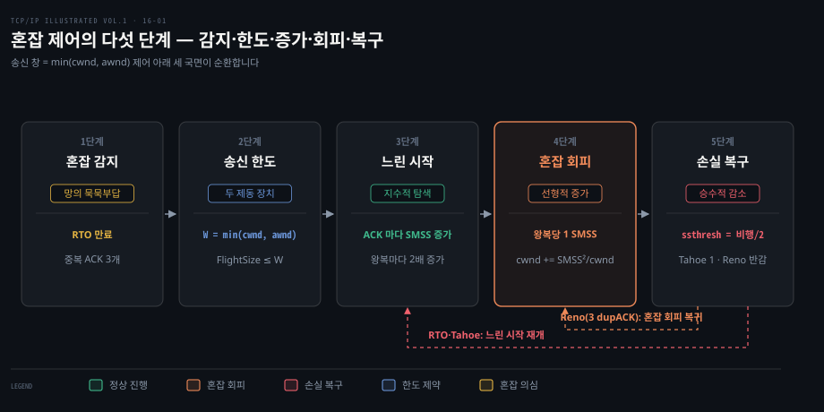
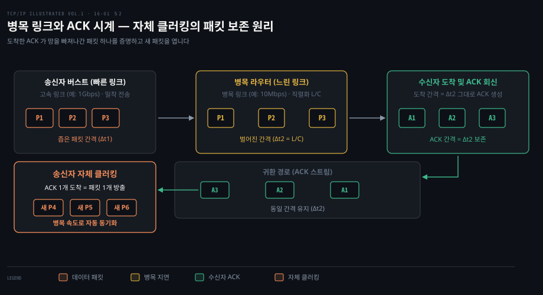
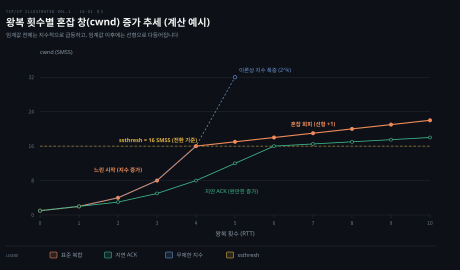
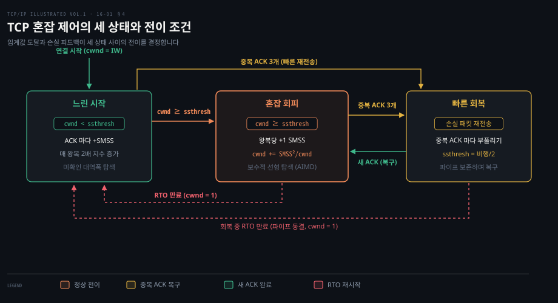
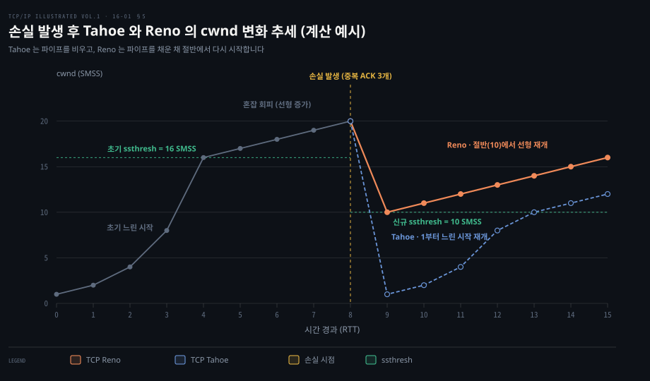

# 혼잡 창은 느린 시작으로 키우고 혼잡 회피로 다듬는다

---

> 수신자 버퍼를 보호하는 흐름 제어와 망의 병목 링크를 보호하는 혼잡 제어는 별개의 제동 장치입니다. TCP 는 패킷 손실을 혼잡의 간접 단서로 삼아, 느린 시작으로 망의 수용량을 탐색하고 혼잡 회피로 점진적 증가를 유지하며, 손실 발생 시 전송률을 절반으로 낮춰 망의 붕괴를 막습니다.

## 핵심 요약

> 이 편의 중심 생각은 송신자가 망 내부의 명시적 통보 없이도 패킷 손실과 왕복 ACK 시계를 통해 최적의 전송률에 스스로 동기화된다는 것입니다.

송신자는 수신자가 알려준 광고 창과 망의 상태를 추정한 혼잡 창 가운데 더 작은 쪽으로 실제 송신량을 제한합니다. 연결 초기에는 대역폭을 알 수 없으므로 작은 초기 창에서 출발해 매 왕복 시간마다 창을 두 배로 늘리는 느린 시작을 수행합니다. 임계값에 도달하면 망의 파이프라인을 교란하지 않도록 왕복당 한 세그먼트만 늘리는 보수적인 혼잡 회피로 전환합니다.

패킷 손실이 드러나면 TCP 는 망의 가용 용량을 재평가합니다. 타임아웃은 파이프라인 전체가 멎었음을 뜻하므로 처음부터 느린 시작을 다시 밟지만, 세 개의 중복 ACK 는 패킷이 여전히 흐르고 있음을 뜻하므로 빠른 회복을 거쳐 절반의 창 크기에서 즉시 전송을 이어갑니다.

혼잡 감지부터 송신 한도 제어, 느린 시작, 혼잡 회피, 손실 복구로 이어지는 다섯 단계 순환 구조입니다.

## 학습 목표

> 이 편을 읽고 나면 다음을 설명할 수 있습니다.

1. 수신자 광고 창과 혼잡 창의 차이를 이해하고, 실제 송신 한도가 둘 중 작은 값으로 결정되는 이유를 설명할 수 있습니다.
2. 병목 링크의 직렬화 지연이 ACK 간격을 벌리고 이 간격이 송신자의 새 패킷 전송을 조절하는 ACK 시계 메커니즘을 설명할 수 있습니다.
3. 느린 시작의 초기 창 결정 기준과 매 왕복마다 혼잡 창이 두 배로 급증하는 지수적 증가 원리 및 지연 ACK 와 적정 바이트 계수의 영향을 분석할 수 있습니다.
4. 느린 시작 임계값이 결정되는 원리와 혼잡 회피의 가산적 증가 수식 유도 과정을 설명할 수 있습니다.
5. 3개 중복 ACK 발생 시 Tahoe 와 Reno 의 빠른 회복 동작 차이를 비교하고 대역폭-지연 곱 환경에서의 성능 영향을 서술할 수 있습니다.

## 1. TCP 는 손실로 혼잡을 짐작하고 송신 창을 둘 중 작은 쪽으로 정한다

> 망 내 라우터가 혼잡 상태를 직접 알려주지 않으므로, TCP 는 패킷 손실을 혼잡 신호로 해석하고 수신자 광고 창과 혼잡 창 중 작은 값으로 송신량을 제한합니다.

데이터 전송 경로에 위치한 중간 라우터 버퍼가 한계에 다다르면 패킷이 버려집니다. 하지만 전통적인 IP 망은 상태를 유지하지 않는 비연결형 구조이므로, 라우터가 송신자에게 혼잡 상태를 능동적으로 통보하지 않습니다. 송신자는 망의 내부 사정을 직접 들여다볼 방법이 없습니다.

큐잉 이론에 따르면 라우터에 유입되는 장기 도착률이 라우터가 내보내는 장기 송출률을 초과할 경우 중간 버퍼는 한계 없이 차오릅니다. 버퍼가 고갈된 라우터는 들어오는 패킷을 버릴 수밖에 없으며, 이를 방치하면 여러 TCP 연결이 동시에 재전송을 쏟아부어 유효 처리량이 급락하는 **혼잡 붕괴**(congestion collapse)가 발생합니다. 불타는 집에 기름을 붓는 격이 되므로 송신 측의 감속이 불가피합니다.

TCP 는 패킷 손실을 망이 겪는 혼잡의 간접 증거로 채택했습니다. 유선 통신망에서는 선로의 비트 오류율이 극히 낮기 때문에, 패킷이 사라졌다면 대다수 라우터 버퍼의 넘침 때문이라고 추론할 수 있습니다. 다만 전파 간섭이나 이동성으로 손실이 잦은 무선 통신망에서는 이 가정이 어긋나 성능 저하의 원인이 되기도 합니다.

송신자의 전송 속도를 억제하는 장치는 두 가지 층위로 동작합니다. 첫째는 수신자의 수신 버퍼 넘침을 막는 흐름 제어이고, 둘째는 중간 경로 라우터들의 버퍼 넘침을 막는 혼잡 제어입니다. 흐름 제어의 기본 원리와 동작은 [03-04](../cntd_computer-networking-top-down/03-04.흐름%20제어와%20연결%20관리,%20그리고%20혼잡.md) 에 정리되어 있습니다.

수신자가 응답 헤더의 창 크기 필드로 알려오는 허용량을 **광고 창**(awnd, advertised window)이라고 부릅니다. 반면 송신자가 망의 가용 수용량을 자체적으로 계산해 유지하는 변수를 **혼잡 창**(cwnd, congestion window)이라고 부릅니다. 송신자가 한 번에 전송할 수 있는 실제 유효 창 $W$ 는 두 제약의 최솟값으로 결정됩니다.

$$W = \min(\text{cwnd}, \text{awnd})$$

송신자는 확인응답을 받지 못한 채 망에 머무는 데이터 총량, 즉 **비행 크기**(FlightSize, flight size)를 항상 $W$ 이하로 제한해야 합니다. 비행 크기는 송신자가 망에 주입했으나 아직 누적 ACK 로 확인받지 못한 바이트 수입니다.

| 개념 | 영문 약어 | 관리 주체 | 결정 근거 | 보호 대상 |
|---|---|---|---|---|
| 광고 창 | awnd | 수신자 | 수신 소켓 버퍼의 남은 여유 공간 | 수신 측 프로세스 및 수신 버퍼 |
| 혼잡 창 | cwnd | 송신자 | 패킷 손실 및 왕복 ACK 피드백 추정 | 중간 경로 라우터 및 스위치 버퍼 |
| 유효 창 | W | 송신자 | $\min(\text{cwnd}, \text{awnd})$ | 수신자와 중간 네트워크 전체 |
| 비행 크기 | FlightSize | 송신자 | 송신 완료 바이트 - 확인응답 바이트 | 망 내부 파이프라인 점유량 |

송신자가 달성해야 하는 이상적인 유효 창 크기는 경로의 **대역폭-지연 곱**(BDP, Bandwidth-Delay Product)입니다. BDP 는 병목 링크 대역폭과 왕복 시간(RTT)의 곱으로, 파이프라인을 비우지 않고 가득 채우는 최적의 데이터양입니다. $W$ 가 BDP 보다 작으면 링크가 유휴 상태에 빠져 대역폭을 낭비하고, BDP 를 지나치게 초과하면 라우터 버퍼에 불필요한 대기열만 쌓여 왕복 지연이 급증합니다.

## 2. ACK 시계는 병목이 내보낸 간격대로 다음 패킷을 보낸다

> 송신자는 별도의 전송 타이머가 없어도 병목 링크가 벌려놓은 ACK 도착 간격을 신호 삼아 망의 속도에 맞춰 새 패킷을 주입합니다.

송신자는 경로 중간에 위치한 가장 좁은 병목 링크의 용량이 몇 Mbps 인지 알지 못합니다. 마이크로초 단위의 정밀 하드웨어 타이머로 패킷 송출 간격을 일일이 제어하지도 않습니다. 그런데도 안정 상태의 TCP 가 병목 링크를 넘치게 하지 않고 일정한 속도를 유지하는 비결은 무엇일까요?

그 해답은 반재콥슨이 제시한 **패킷 보존 원리**(principle of conservation of packets)에 있습니다. 파이프라인이 가득 찬 정상 상태에서는 망에서 기존 패킷 하나가 완전히 빠져나갔을 때에만 새 패킷 하나를 주입해야 네트워크가 안정적으로 유지됩니다. 물리 법칙에서 에너지가 보존되듯, 망 내부에 존재하는 패킷 총량이 일정하게 유지되는 상태입니다.

송신자가 초고속 링크를 통해 패킷들을 연속해서 내보내면 패킷들은 시간 축에서 조밀하게 붙어서 전송됩니다. 그러나 이 패킷들이 저속 병목 링크를 통과할 때 직렬화 지연이 발생합니다. 패킷 크기를 $L$, 병목 링크 대역폭을 $C$ 라고 하면 패킷 하나를 전송하는 데 $L / C$ 의 시간이 걸리므로, 병목을 빠져나온 패킷들의 간격은 $L / C$ 만큼 벌어집니다.

수신자는 병목 링크가 늘려놓은 시간 간격대로 패킷을 차례로 수신합니다. 수신자가 각 패킷에 대해 즉시 확인응답(ACK)을 회신하면, 반대 방향 링크를 타고 돌아오는 ACK 스트림 역시 동일한 $L / C$ 시간 간격을 유지합니다.

송신자에게 ACK 가 도착했다는 사실은 두 가지를 증명합니다. 첫째, 보냈던 패킷 하나가 수신자에게 무사히 도착해 망을 빠져나갔다는 사실입니다. 둘째, 그 패킷이 병목 링크를 통과할 때 발생한 시간 간격 정보입니다. 송신자는 ACK 하나가 들어올 때마다 새 패킷 하나를 내보냄으로써 병목 링크의 처리 속도에 완벽하게 일치하는 전송 리듬을 형성합니다.

이처럼 들어오는 ACK 신호의 박자에 맞춰 다음 패킷을 내보내는 메커니즘을 **ACK 시계**(ACK clock) 또는 **자체 클러킹**(self-clocking)이라고 부릅니다. 송신자는 복잡한 타이머 없이도 ACK 도착 사건 자체를 클록 삼아 망의 처리 속도에 자연스럽게 동기화됩니다.

빠른 링크에서 밀착되어 출발한 패킷이 병목 라우터에서 직렬화 지연을 거치며 벌어지고, 수신자가 회신한 ACK 역시 같은 간격을 유지하여 송신자의 새 패킷 전송 주기를 결정합니다.

## 3. 느린 시작은 ACK 마다 창을 늘려 왕복마다 두 배가 된다

> 연결 초기에는 가용 용량을 알 수 없으므로, 작은 초기 창에서 출발하여 매 왕복 시간마다 창 크기를 두 배로 급증시키는 느린 시작으로 망을 탐색합니다.

새 연결이 맺어졌을 때 송신자가 수신자의 커다란 광고 창 크기만큼 단숨에 패킷을 쏟아붓는다면 어떻게 될까요? 아직 병목 대역폭이나 지연 시간을 전혀 모르는 상태에서 패킷 무리를 폭발적으로 투입하면, 중간 라우터 큐가 즉각 넘쳐 대규모 패킷 손실과 재전송이 뒤따릅니다.

**느린 시작**(Slow Start)은 망의 미확인 수용량을 안전하게 시험하고 앞서 살펴본 ACK 시계를 최초로 구동하기 위해 도입되었습니다. '느린'이라는 명칭은 임의의 대용량 버스트를 한 번에 보내지 않고 작은 창에서 시작한다는 뜻일 뿐, 실제 창 크기의 증가 속도는 지수적(exponential)으로 가파르게 늘어납니다.

연결이 시작될 때 전송하는 최초의 세그먼트 수를 **초기 창**(IW, Initial Window)이라고 부릅니다. 최초 표준에서는 IW 가 1 SMSS(Sender Maximum Segment Size)였습니다. 이후 RFC 5681 은 세그먼트 크기에 따라 다음과 같은 기준을 정했습니다.

- $\text{SMSS} > 2190$ 바이트: $\text{IW} = 2 \times \text{SMSS}$ (최대 2개 세그먼트)
- $1095 < \text{SMSS} \le 2190$ 바이트: $\text{IW} = 3 \times \text{SMSS}$ (최대 3개 세그먼트)
- $\text{SMSS} \le 1095$ 바이트: $\text{IW} = 4 \times \text{SMSS}$ (최대 4개 세그먼트)

이 기준에 따르면 일반적인 이더넷 MTU 환경($\text{SMSS} = 1460$ 바이트)에서 초기 창은 3 SMSS 가 됩니다. 그러나 현대 인터넷은 웹 페이지 자원이 단일 RTT 안에 전송되기를 요구합니다. 이에 맞춰 실험 [RFC 6928](https://www.rfc-editor.org/rfc/rfc6928) 은 $\text{IW} = \min(10 \times \text{MSS}, \max(2 \times \text{MSS}, 14600\text{ B}))$, 즉 약 10 세그먼트를 제안했고 Linux 는 이를 기본값으로 씁니다.

현재 Linux 커널은 [`include/net/tcp.h`](https://github.com/torvalds/linux/blob/master/include/net/tcp.h) 소스 코드에 `TCP_INIT_CWND` 매크로를 10으로 정의하고 있습니다. 현대의 클라이언트와 서버는 연결 수립 직후 첫 왕복에서 10개의 세그먼트를 즉시 전송함으로써 느린 시작의 초기 램프업 지연을 대폭 단축합니다.

느린 시작 상태에서 새로운 유효 ACK 가 도착할 때마다 혼잡 창은 다음과 같이 갱신됩니다.

$$\text{cwnd} \leftarrow \text{cwnd} + \min(N, \text{SMSS})$$

여기서 $N$ 은 도착한 ACK 가 새롭게 확인해 준 바이트 수입니다. 만약 각 패킷마다 1개씩 ACK 가 회신된다면, 1개 패킷 송신 후 1개 ACK 가 도착해 cwnd 가 2가 되고, 다음 왕복에서 2개 패킷을 보내 2개 ACK 를 받아 cwnd 가 4가 됩니다. $k$ 번째 왕복 시간(RTT)이 지난 후 사용 가능한 창은 $W = \text{IW} \times 2^k$ 로 두 배씩 폭발적으로 늘어납니다.

수신자가 매 패킷마다 응답하지 않고 두 패킷당 한 번만 ACK 를 보내는 지연 ACK(delayed ACK)를 사용하면 증가 속도가 둔화됩니다. 2개 패킷을 보냈는데 1개의 ACK 만 돌아오면 cwnd 는 1 SMSS 만 증가하므로, 매 왕복당 창 크기가 2배가 아니라 약 1.5배로 완만해집니다.

이를 보완하기 위해 Linux 수신자는 연결 초기나 패킷 순서 어긋남 시 **quickack** 모드를 켭니다. 커널 함수 `tcp_enter_quickack_mode()`([`net/ipv4/tcp_input.c`](https://github.com/torvalds/linux/blob/master/net/ipv4/tcp_input.c))는 최대 16개 세그먼트까지 지연 없이 즉각 ACK 합니다. 상한값 `TCP_MAX_QUICKACKS`([`include/net/tcp.h`](https://github.com/torvalds/linux/blob/master/include/net/tcp.h))를 두어 상대 송신자의 느린 시작이 지연 ACK 로 늦어지는 것을 방지합니다. 지연 ACK 의 상세한 메커니즘은 [03-05](../cntd_computer-networking-top-down/03-05.혼잡을%20어떻게%20다스리는가.md) 에서 다루는 고전 TCP 원리와 궤를 같이합니다.

패킷 개수만을 기준으로 cwnd 를 늘리면 보안 허점이 생깁니다. 악의적인 수신자가 1개 세그먼트를 1바이트 단위로 쪼개 수많은 ACK 를 연속 회신하는 **ACK 분할 공격**(ACK division attack)을 감행하면, 송신자의 cwnd 가 비정상적으로 급증해 망을 마비시킬 수 있습니다.

[RFC 3465](https://www.rfc-editor.org/rfc/rfc3465) 는 수신된 패킷 개수가 아니라 실제 확인된 *바이트 수*를 엄밀히 대조하여 cwnd 를 늘리는 **적정 바이트 계수**(ABC, Appropriate Byte Counting)를 제안했습니다. ABC 는 1바이트짜리 쪼개진 ACK 가 들어와도 그에 비례한 작은 분량만 cwnd 에 더함으로써 비정상적인 창 팽창을 원천 차단합니다.

초기 창에서 출발한 혼잡 창의 증가 곡선입니다(계산 예시: IW=1, ssthresh=16). 표준 복합 경로는 임계값 도달 전까지 지수적으로 급증하다가 임계값 이후 선형으로 완만해집니다.

## 4. 혼잡 회피는 왕복마다 한 세그먼트만 늘리고 ssthresh 가 둘을 가른다

> 혼잡 창이 임계값에 도달하면 지수적 폭증을 멈추고 왕복당 1 SMSS 씩 선형으로 증가하는 혼잡 회피로 전환하며, 손실 발생 시 임계값은 비행 크기의 절반으로 재설정됩니다.

느린 시작의 지수적 증가는 빈 파이프라인을 빠르게 채우는 장점이 있지만, 임계점 없이 방치하면 순식간에 라우터 버퍼를 가득 채우고 막대한 패킷 손실을 초래합니다. TCP 는 어느 지점에서 지수 탐색을 멈추고 신중한 접근으로 전환할까요?

이 분기점을 가르는 기준이 **느린 시작 임계값**(ssthresh, Slow Start Threshold)입니다. 연결 수립 초기에는 망의 한계를 알 수 없으므로 ssthresh 를 임의의 충분히 큰 값(수신자 광고 창 크기 이상)으로 설정해 느린 시작으로 출발합니다.

- $\text{cwnd} < \text{ssthresh}$: 느린 시작을 수행하여 지수적으로 창을 키웁니다.
- $\text{cwnd} > \text{ssthresh}$: **혼잡 회피**(Congestion Avoidance)를 수행하여 선형적으로 창을 키웁니다.
- $\text{cwnd} = \text{ssthresh}$: 두 알고리즘 중 어느 것을 써도 무방하며 일반적으로 혼잡 회피를 적용합니다.

혼잡 회피는 가용 대역폭이 조금 더 남아 있을 가능성을 타진하되, 급격한 트래픽 유입으로 다른 연결의 큐를 무너뜨리지 않도록 신중하게 동작합니다. 매 왕복 시간(RTT)마다 약 1개 세그먼트(1 SMSS)만 증가하도록 설계되었습니다.

수식으로는 중복되지 않은 유효 ACK 가 도착할 때마다 다음과 같이 갱신합니다.

$$\text{cwnd}_{t+1} = \text{cwnd}_t + \frac{\text{SMSS} \times \text{SMSS}}{\text{cwnd}_t}$$

이 수식이 왕복당 1 SMSS 증가로 이어지는 원리는 간단합니다. 현재 창 크기가 $k$ 개의 세그먼트($\text{cwnd} = k \times \text{SMSS}$)라고 가정하겠습니다. 1 RTT 동안 송신자는 $k$ 개의 세그먼트를 내보내고, 이에 대응하여 $k$ 개의 ACK 가 도착합니다.

각 ACK 가 도착할 때마다 cwnd 는 다음과 같이 분수만큼 늘어납니다.

$$\frac{\text{SMSS} \times \text{SMSS}}{k \times \text{SMSS}} = \frac{1}{k} \times \text{SMSS}$$

한 왕복 시간 동안 총 $k$ 개의 ACK 가 순차적으로 도착하므로, 왕복 시간 전체에 걸쳐 누적된 증가량은 다음과 같습니다.

$$\sum_{i=1}^{k} \left(\frac{1}{k} \times \text{SMSS}\right) = k \times \left(\frac{1}{k} \times \text{SMSS}\right) = 1 \times \text{SMSS}$$

ACK 가 들어올 때마다 분모의 cwnd 가 미세하게 커지므로 엄밀하게는 약간의 하위 선형성을 띠지만, 실질적으로는 시간 축에서 매 RTT 당 1 SMSS 씩 정직하게 더해지는 선형 증가(**가산적 증가**, Additive Increase)를 달성합니다.

패킷 손실이 감지되면 TCP 는 기존의 최적 창 추정치가 너무 컸다고 판단하고 ssthresh 를 갱신합니다. RFC 5681 에 규정된 ssthresh 갱신 공식은 다음과 같습니다.

$$\text{ssthresh} = \max\left(\frac{\text{FlightSize}}{2}, 2 \times \text{SMSS}\right)$$

여기서 주목해야 할 핵심은 cwnd 가 아니라 **FlightSize**(비행 크기)의 절반을 취한다는 점입니다. 왜 cwnd 의 절반으로 줄이지 않을까요?

송신 애플리케이션이 보낼 데이터가 부족해 실제로는 10개 세그먼트만 전송했거나, 수신자의 광고 창이 작아 망에 10개 세그먼트만 진입한 상태를 가정하겠습니다. 이때 송신자의 cwnd 변수는 과거의 기록 때문에 100 SMSS 로 높게 유지되어 있을 수 있습니다.

망에서 손실이 발생했다면, 그것은 10개 세그먼트가 진입한 부하 때문에 일어난 사건입니다. 만약 cwnd 의 절반인 50 SMSS 로 ssthresh 를 낮춘다면, 망이 감당하지 못한 실제 부하(10개)보다 훨씬 높은 수치를 차기 임계값으로 삼는 오류를 범하게 됩니다. 따라서 망 내부에서 실제로 확인되지 않은 데이터 총량인 FlightSize 를 기준으로 절반을 책정해야 안전합니다. 하한값인 $2 \times \text{SMSS}$ 는 임계값이 지나치게 0으로 수렴하여 파이프라인이 마비되는 현상을 방지합니다.

느린 시작과 혼잡 회피, 빠른 회복 사이의 상태 전이 경로입니다. 임계값 도달 시 선형 탐색으로 전이하며, 중복 ACK 3개나 RTO 타임아웃 피드백에 따라 복구 상태로 갈라집니다.

## 5. Tahoe 는 손실마다 처음부터, Reno 는 빠른 회복으로 절반에서 다시 시작한다

> 초기 TCP Tahoe 는 어떤 손실이든 창을 1로 떨어뜨렸지만, TCP Reno 는 3개 중복 ACK 를 파이프라인 보존의 신호로 해석하여 창을 절반으로 유지한 채 복구를 완수합니다.

대역폭이 넓고 지연 시간이 긴 고속 통신망(large BDP)에서 패킷 단 하나가 누락되었다고 해서 전체 전송을 1개 패킷부터 다시 시작한다면 대역폭 활용률이 심각하게 떨어집니다. BSD UNIX 계열의 발전 과정에서 이 문제를 해결하기 위해 고안된 알고리즘이 Tahoe 와 Reno 입니다.

1988년 4.3BSD-Tahoe 의 **TCP Tahoe** 는 손실의 종류를 가리지 않았습니다. RTO 타이머 만료로 인한 손실이든, 3개 중복 ACK 로 인한 빠른 재전송이든 상관없이 ssthresh 를 $\text{FlightSize} / 2$ 로 낮춘 뒤 cwnd 를 즉각 1 SMSS 로 추락시켰습니다.

Tahoe 는 손실이 나면 무조건 처음부터 느린 시작을 다시 밟았습니다. 창이 1에서 출발해 ssthresh 까지 다시 도달하는 수 RTT 동안 고속 회선 파이프는 텅 비어버렸고, 유효 처리량은 곤두박질쳤습니다.

1990년에 등장한 4.3 BSD **TCP Reno** 는 손실을 감지한 방식에 따라 망의 상태가 완전히 다르다는 점을 꿰뚫어 보았습니다.

RTO 만료는 수신자로부터 아무런 응답도 돌아오지 않는 침묵 상태를 뜻하므로, 파이프라인 전체가 마비된 심각한 정체입니다. 이때는 cwnd 를 1 SMSS 로 떨어뜨리고 느린 시작으로 파이프를 다시 채우는 것이 타당합니다. 재전송 타이머 만료와 RTO 측정 원리는 [14-02](./14-02.손실은%20타이머보다%20ACK%20와%20SACK%20으로%20빨리%20찾는다.md) 에서 다룬 바 있습니다.

반면 3개의 중복 ACK 가 도착했다는 것은 정반대의 신호입니다. 앞선 세그먼트 하나가 빠졌을 뿐, 그 뒤에 보낸 3개의 세그먼트는 수신자에게 무사히 도착해 수신 버퍼에 들어갔기 때문에 중복 ACK 가 연달아 회신된 것입니다. 망의 파이프라인에 패킷이 여전히 흐르고 있다는 강력한 증거입니다.

Reno 는 패킷 보존 원리를 복구 단계에도 확장한 **빠른 회복**(Fast Recovery)을 도입했습니다. RFC 5681 에 표준화된 빠른 회복 절차는 4단계로 진행됩니다.

1. **임계값 갱신 및 재전송**: 3번째 중복 ACK 수신 시 $\text{ssthresh} = \max(\text{FlightSize} / 2, 2 \times \text{SMSS})$ 로 갱신하고 누락된 세그먼트를 즉시 재전송합니다.
2. **창 부풀리기(Window Inflation)**: $\text{cwnd} = \text{ssthresh} + 3 \times \text{SMSS}$ 로 설정합니다. 중복 ACK 3개는 이미 3개의 패킷이 망을 빠져나갔음을 입증하므로, 그만큼 창을 인위적으로 넓혀 여유 공간을 만듭니다.
3. **추가 중복 ACK 처리**: 복구가 진행되는 동안 추가 중복 ACK 가 들어올 때마다 $\text{cwnd} \leftarrow \text{cwnd} + 1 \text{ SMSS}$ 로 창을 계속 부풀립니다. 만약 새로 부풀려진 유효 창이 비행 크기보다 커지면, 송신자는 복구 중에도 새로운 데이터를 망으로 추가 송신할 수 있습니다.
4. **창 오므리기(Window Deflation)**: 재전송된 패킷을 확인해 주는 새로운 유효 ACK 가 도착하면, 인위적으로 부풀렸던 창을 거두고 $\text{cwnd} = \text{ssthresh}$ 로 설정한 뒤 곧바로 혼잡 회피로 복귀합니다.

| 구분 | 손실 감지 수단 | ssthresh 변경 | 복구 시작 시점 cwnd | 복구 중 동작 | 복구 완료 후 상태 |
|---|---|---|---|---|---|
| **TCP Tahoe** | RTO 또는 중복 ACK 3 | $\max(\text{FlightSize}/2, 2)$ | 1 SMSS 로 즉각 추락 | cwnd=1 부터 느린 시작 재개 | cwnd 가 ssthresh 도달 시 혼잡 회피 |
| **TCP Reno** (타임아웃) | RTO 만료 | $\max(\text{FlightSize}/2, 2)$ | 1 SMSS 로 즉각 추락 | cwnd=1 부터 느린 시작 재개 | cwnd 가 ssthresh 도달 시 혼잡 회피 |
| **TCP Reno** (빠른 재전송) | 중복 ACK 3개 | $\max(\text{FlightSize}/2, 2)$ | $\text{ssthresh} + 3 \text{ SMSS}$ 로 부풀림 | 중복 ACK 마다 cwnd 1씩 부풀림 | 새 ACK 수신 시 cwnd=ssthresh 로 복귀 |
| **현대 Linux** | RACK-TLP([RFC 8985](https://www.rfc-editor.org/rfc/rfc8985), 중복 ACK 문턱은 보조) | 알고리즘별 감축 | 비례 속도 감소(PRR) 적용 | [RFC 9937](https://www.rfc-editor.org/rfc/rfc9937)(실험판 RFC 6937 대체)에 따른 부드러운 전송 | CUBIC 혼잡 제어로 점진적 회복 |

Reno 가 보여주는 이러한 동작 특성을 **가산적 증가와 승수적 감소**(AIMD, Additive Increase Multiplicative Decrease)라고 부릅니다. 혼잡 회피 중에는 1씩 천천히 더하고, 손실을 만나면 절반으로 곱해 줄이는 균형 감각입니다. 시스템 전반의 네트워크 아키텍처 관점에서의 혼잡 제어 분류는 [10-02](../systems-performance/10-02.네트워크%20—%20아키텍처.md) 에서 조망할 수 있습니다.

다만 Reno 의 고전적인 창 부풀리기와 오므리기는 단일 윈도 안에서 여러 패킷이 동시에 손실되었을 때 파이프라인이 꼬이거나 불필요한 재전송 버스트를 유발하는 한계를 보였습니다.

현재 Linux 커널은 Reno 식의 인위적 창 부풀리기 대신 **PRR**(Proportional Rate Reduction, [RFC 9937](https://www.rfc-editor.org/rfc/rfc9937), 실험판 RFC 6937 을 대체) 알고리즘을 기본 탑재하고 있습니다. PRR 은 수신된 ACK 에 비례하여 복구 중 패킷 송출 속도를 매끄럽게 제어하며, 커널 소스 [`net/ipv4/tcp_input.c`](https://github.com/torvalds/linux/blob/master/net/ipv4/tcp_input.c) 의 `tcp_cwnd_reduction()` 에 구현되어 있습니다.

또한 현대 Linux 의 기본 혼잡 제어 알고리즘은 AIMD 선형 증가 대신 3차 함수 곡선으로 고속 대역폭을 채우는 **CUBIC**([RFC 9438](https://www.rfc-editor.org/rfc/rfc9438))을 채택하고 있습니다. 커널 소스는 [`net/ipv4/tcp_cubic.c`](https://github.com/torvalds/linux/blob/master/net/ipv4/tcp_cubic.c) 입니다.

동일한 손실 발생 시점(RTT 8, cwnd=20, ssthresh=10) 이후 두 알고리즘의 궤적 비교입니다(계산 예시). Tahoe 는 바닥인 1로 추락해 느린 시작을 거치지만, Reno 는 절반인 10에서 즉시 혼잡 회피를 재개합니다.

## 면접 대비

1. TCP 가 네트워크의 혼잡 상태를 라우터의 명시적 통보 대신 패킷 손실로 추론하게 된 네트워크 구조적 이유는 무엇입니까?
2. 송신 창 크기를 결정하는 수식 $W = \min(\text{cwnd}, \text{awnd})$ 에서 흐름 제어와 혼잡 제어의 책임 분리와 대역폭-지연 곱(BDP)의 관계를 설명해 주십시오.
3. 느린 시작(Slow Start)은 이름과 달리 왜 지수적으로 증가하며, 초기 창(IW)을 과거 1 SMSS 에서 현대 Linux 처럼 10 SMSS 로 상향 조정한 기술적 배경은 무엇입니까?
4. 손실 발생 시 느린 시작 임계값(ssthresh)을 갱신할 때 `cwnd / 2` 대신 `FlightSize / 2` 를 사용하는 결정적 이유는 무엇입니까?
5. 3개 중복 ACK 발생 시 TCP Tahoe 와 TCP Reno 의 복구 메커니즘 차이점과, Reno 에서 빠른 회복(Fast Recovery) 중 창 부풀리기(Window Inflation)가 필요한 이유를 설명해 주십시오.

## 정답 (자답 후 펼치기)

### 정답 1 — 종단간 원칙과 비연결형 IP 망의 단순성

인터넷 프로토콜(IP) 계층은 복잡한 상태를 중간 라우터가 유지하지 않고 오직 패킷 전달에만 집중하는 단순한 비연결형 최선형(best-effort) 구조로 설계되었습니다.

라우터가 모든 TCP 연결의 상태를 추적하고 혼잡 피드백을 개별 송신자에게 보내도록 하면 코어 네트워크의 확장성과 처리 성능이 심각하게 저하됩니다. 따라서 지능과 제어의 책임을 종단 호스트에 두는 종단간 원칙(End-to-End Principle)에 따라, 송신 TCP 가 패킷 손실(타임아웃 또는 중복 ACK)이라는 외부 관측 결과를 통해 망 내부의 버퍼 넘침을 간접 추론하도록 설계되었습니다. 유선망에서는 전송 에러율이 극히 낮아 손실을 곧 혼잡으로 간주할 수 있었습니다.

### 정답 2 — 수신자와 망 보호의 이원화 및 파이프라인 최적화

흐름 제어와 혼잡 제어는 보호하는 대상과 제어 주체가 완전히 다릅니다.

- **광고 창(awnd)**: 수신자가 소켓 수신 버퍼의 잔여 용량을 헤더에 실어 통보하는 값으로, 수신 측 애플리케이션의 처리 지연으로 인한 버퍼 넘침을 막는 흐름 제어의 수단입니다.
- **혼잡 창(cwnd)**: 송신자가 망의 패킷 손실 및 RTT 변동을 관측하여 자체 계산하는 값으로, 중간 라우터들의 큐 넘침과 혼잡 붕괴를 막는 혼잡 제어의 수단입니다.

송신자는 둘 중 더 작은 값으로 실제 송신 가능 창 $W$ 를 제한함으로써, 수신자와 중간 네트워크 중 어느 한쪽도 과부하에 빠지지 않도록 보장합니다. 최적의 $W$ 는 경로의 대역폭과 왕복 지연의 곱인 BDP 와 일치해야 하며, 이를 초과하면 전송률 향상 없이 라우터 큐잉 지연(버퍼블로트)만 늘어납니다.

### 정답 3 — ACK 시계 기동과 웹 트랜잭션의 단일 RTT 완료 요구

느린 시작은 알 수 없는 경로 용량을 안전하게 탐색하고, 망을 통과한 패킷 간격으로 송신 간격을 조율하는 ACK 시계를 최초로 형성하기 위해 고안되었습니다.

송신자는 매 정상 ACK 를 받을 때마다 cwnd 를 1 SMSS 씩 늘립니다. 왕복 1회 동안 전송된 모든 세그먼트에 대해 ACK 가 돌아오면, 보낸 패킷 수만큼 cwnd 가 추가되므로 매 RTT 마다 창 크기가 2배($1 \to 2 \to 4 \to 8 \dots$)로 급증하는 지수적 폭증을 이룹니다.

과거에는 회선 속도가 느려 1 SMSS 로 신중하게 시작했으나, 현대 인터넷 트래픽의 상당수를 차지하는 웹 객체(HTTP 요청/응답)는 크기가 수 킬로바이트에서 십수 킬로바이트 수준으로 작습니다. 초기 창이 1~3 SMSS 이면 단순한 웹 페이지 하나를 내려받는 데도 여러 차례의 RTT 를 소모해야 했습니다. 이에 따라 실험 [RFC 6928](https://www.rfc-editor.org/rfc/rfc6928) 제안과 Linux 커널(`TCP_INIT_CWND = 10`)은 초기 창을 약 10 세그먼트(최대 14,600바이트)로 확대하여 대다수 단기 웹 요청을 추가 지연 없이 1 RTT 안에 완결할 수 있도록 개선했습니다.

### 정답 4 — 실제 망 점유 부하의 대변

애플리케이션이 전송할 데이터가 적었거나(application-limited) 수신자의 광고 창 제한으로 인해 실제 망에 투입되어 확인받지 못한 데이터 총량(FlightSize)이 cwnd 보다 훨씬 작을 수 있습니다.

예를 들어 cwnd 는 100 SMSS 였지만 송신자가 보낸 데이터가 10 SMSS 에 불과한 상태에서 손실이 발생했다면, 병목 라우터 큐를 넘치게 만든 실제 네트워크 부하는 100이 아니라 10입니다. 만약 이때 cwnd 를 기준으로 절반인 50 SMSS 를 차기 임계값으로 잡는다면, 망이 수용하지 못했던 실제 크기(10)보다 다섯 배나 높은 수치를 기준점으로 삼아 차후 재진입 시 즉각적인 재혼잡을 유발하게 됩니다. 따라서 망 내부 파이프라인에 실제 머물렀던 비행 크기의 절반을 취해야 정확한 수용 한계를 반영할 수 있습니다.

### 정답 5 — 파이프라인 보존 여부에 따른 차이와 패킷 보존 원리 적용

손실 감지 신호에 따라 네트워크 파이프라인의 잔존 상태가 근본적으로 다릅니다.

- **TCP Tahoe**: 3개 중복 ACK 를 수신해도 ssthresh 를 절반으로 낮춘 뒤 cwnd 를 무조건 1 SMSS 로 추락시켰습니다. 파이프라인 전체를 비우고 1부터 느린 시작을 다시 밟아야 하므로 고속 대용량 망에서 심각한 대역폭 낭비를 낳았습니다.
- **TCP Reno**: 3개 중복 ACK 는 앞선 1개 패킷이 누락되었을 뿐 뒤따른 3개 패킷이 수신자에게 무사히 도착해 버퍼링되었음을 뜻하므로, 파이프라인에 패킷이 여전히 흐르고 있음을 확인합니다. 이에 따라 cwnd 를 절반 수준인 ssthresh 로 낮추되 느린 시작으로 떨어지지 않고 빠른 회복에 진입합니다.

Reno 가 빠른 회복에서 $\text{cwnd} = \text{ssthresh} + 3 \text{ SMSS}$ 로 창을 부풀리고 추가 중복 ACK 마다 1씩 더 늘리는 이유는 패킷 보존 원리를 유지하기 위함입니다. 중복 ACK 가 1개 도착할 때마다 패킷 1개가 망을 완전히 빠져나가 수신 버퍼에 들어갔음을 의미하므로, 망에서 나간 패킷만큼 창을 일시적으로 넓혀주어야 송신자가 새로운 패킷을 내보내 ACK 시계를 꺼뜨리지 않고 유지할 수 있습니다. 복구가 끝나면 인위적 팽창을 걷어내고 원래의 절반 크기에서 곧바로 혼잡 회피를 재개합니다.

## 참고 자료

- Kevin R. Fall, W. Richard Stevens, 《TCP/IP Illustrated, Vol. 1》 2nd ed., Addison-Wesley, 2011, Ch.16, §16.1–16.2.5.
- [RFC 5681: TCP Congestion Control](https://www.rfc-editor.org/rfc/rfc5681) — 초기 창 계산식, 느린 시작, 혼잡 회피, 빠른 재전송 및 빠른 회복 표준 명세.
- [RFC 6928: Increasing TCP's Initial Window](https://www.rfc-editor.org/rfc/rfc6928) — 초기 혼잡 창 약 10 세그먼트(최대 14,600 B) 제안(Experimental).
- [RFC 8985: The RACK-TLP Loss Detection Algorithm for TCP](https://www.rfc-editor.org/rfc/rfc8985) — RACK 기반 시간 기반 손실 감지 및 꼬리 손실 프로브(TLP) 명세.
- [RFC 3465: TCP Congestion Control with Appropriate Byte Counting (ABC)](https://www.rfc-editor.org/rfc/rfc3465) — 바이트 단위 계산을 통한 ACK 분할 공격 방어.
- [RFC 9937: Proportional Rate Reduction (PRR)](https://www.rfc-editor.org/rfc/rfc9937) — Reno 창 부풀리기를 대체하는 표준 트랙 비례 속도 감소 알고리즘(실험판 RFC 6937 대체).
- [RFC 9293: Transmission Control Protocol (TCP)](https://www.rfc-editor.org/rfc/rfc9293) — 현대 TCP 종합 표준 규격.
- [RFC 9438: CUBIC for Fast and Long-Distance Networks](https://www.rfc-editor.org/rfc/rfc9438) — 현대 Linux 기본 혼잡 제어 CUBIC 표준.
- [Linux 커널 문서 Documentation/networking/ip-sysctl.rst](https://github.com/torvalds/linux/blob/master/Documentation/networking/ip-sysctl.rst) — `tcp_recovery` 의 RACK-TLP 손실 감지 및 중복 ACK 문턱 휴리스틱 명세.
- [Linux 커널 헤더 include/net/tcp.h](https://github.com/torvalds/linux/blob/master/include/net/tcp.h) — `TCP_INIT_CWND 10` 및 `TCP_MAX_QUICKACKS 16` 정의.
- [Linux 커널 소스 net/ipv4/tcp_input.c](https://github.com/torvalds/linux/blob/master/net/ipv4/tcp_input.c) — 수신자 `tcp_enter_quickack_mode()` 및 PRR 구현 `tcp_cwnd_reduction()`.

## 관련 문서

- [14-02.손실은 타이머보다 ACK 와 SACK 으로 빨리 찾는다](./14-02.손실은%20타이머보다%20ACK%20와%20SACK%20으로%20빨리%20찾는다.md) — RTO 측정과 타임아웃 재전송, 3개 중복 ACK 와 빠른 재전송.
- [03-05.혼잡을 어떻게 다스리는가](../cntd_computer-networking-top-down/03-05.혼잡을%20어떻게%20다스리는가.md) — 혼잡 제어의 세 가지 기본 원리와 Classic TCP AIMD 이론.
- [03-04.흐름 제어와 연결 관리, 그리고 혼잡](../cntd_computer-networking-top-down/03-04.흐름%20제어와%20연결%20관리,%20그리고%20혼잡.md) — 수신자 광고 창을 통한 흐름 제어와 연결 수립/종료.
- [10-02.네트워크 — 아키텍처](../systems-performance/10-02.네트워크%20—%20아키텍처.md) — 시스템 관점의 네트워크 계층과 혼잡 제어 알고리즘 특성.
