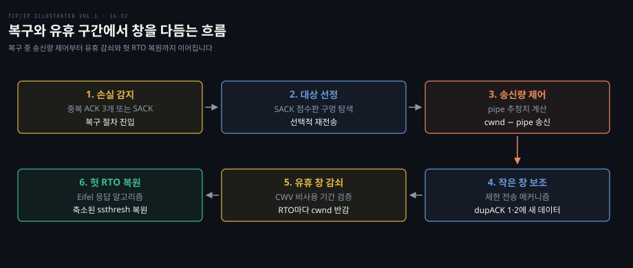
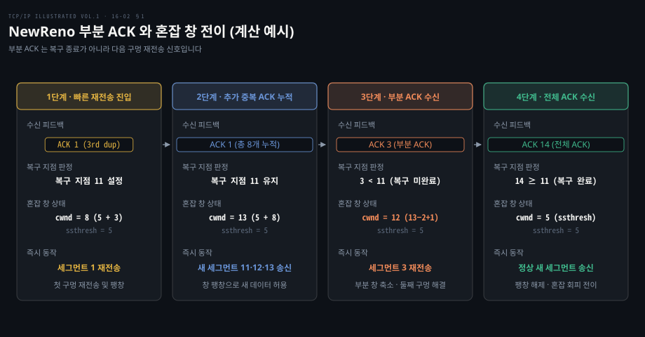
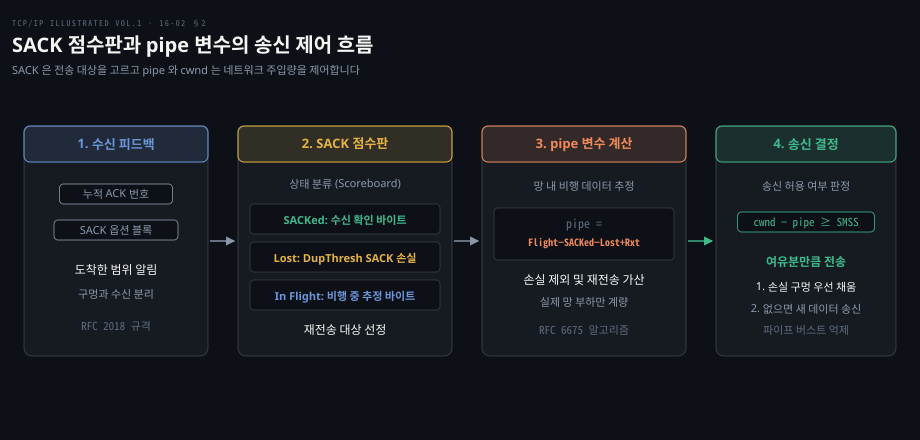
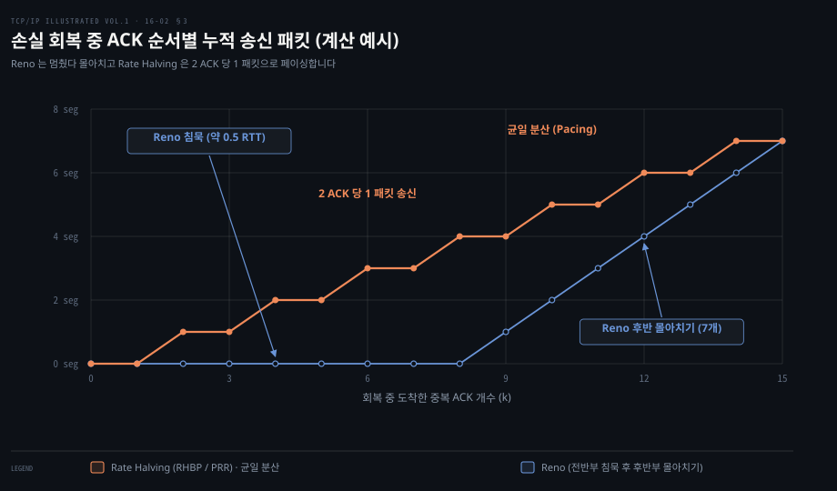
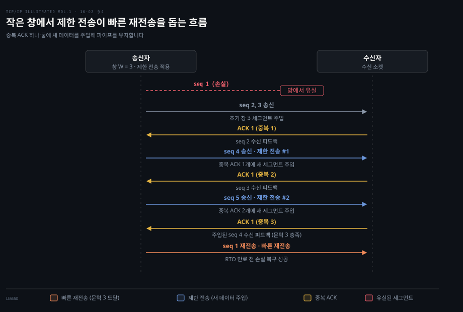
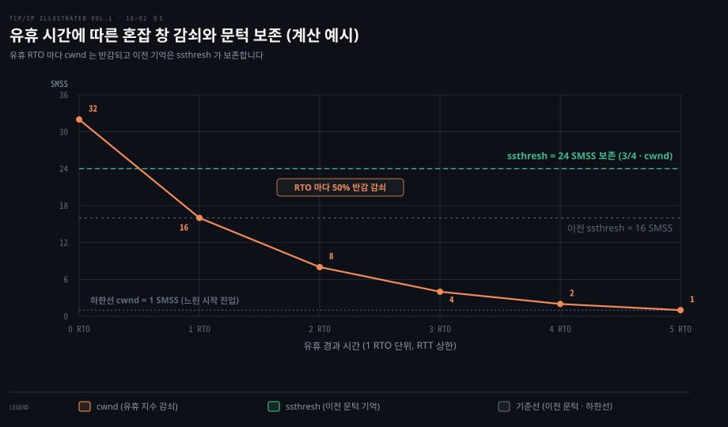

# 복구 중 혼잡 창은 NewReno·SACK·제한 전송이 다듬고 헛 RTO 는 되돌린다

---

> 손실 복구 중 혼잡 창은 손실 개수와 파이프 여유량에 맞춰 세밀하게 조절되어야 하며 쉬고 있던 연결의 창은 감쇠시키고 지연 급증에 속은 헛 RTO 는 이전 상태로 되돌립니다.


## 핵심 요약

> 이 편의 중심 생각은 손실 복구와 전송 중단 상황에서 혼잡 창과 전송량 추정을 정밀하게 분리해 다듬는 것입니다.

전통적인 빠른 복구는 한 창 안에서 여러 패킷이 손실되었을 때 부분 ACK 에 속아 일찍 복구를 끝내고 타이머 만료로 떨어지는 결함을 안고 있었습니다. NewReno 는 복구 지점을 도입해 모든 구멍이 메워질 때까지 복구를 유지하고, SACK 은 점수판과 파이프 변수를 통해 무엇을 보낼지와 얼마나 보낼지를 분리합니다.

작은 창에서 중복 ACK 가 부족해 복구가 멈추는 위험은 제한 전송이 새 데이터를 주입해 막아 줍니다. 연결이 유휴 상태에 들어갔을 때는 혼잡 창 검증이 비사용 기간에 비례해 창을 줄여 돌발 버스트를 예방합니다. 경로 지연 급증으로 패킷 손실 없이 타이머만 터진 헛 RTO 가 밝혀지면 Eifel 응답이 축소된 임계치를 이전 상태로 안전하게 복원합니다.


## 학습 목표

> 이 편을 읽고 나면 다음을 설명할 수 있습니다.

1. NewReno 가 부분 ACK 를 만났을 때 혼잡 창을 유지하며 다음 구멍을 메우는 방식을 설명할 수 있습니다.
2. SACK 환경에서 파이프 변수가 망 내 비행 데이터를 추정하고 송신 허용량을 통제하는 원리를 설명할 수 있습니다.
3. Reno 의 전송 침묵 문제를 해결하기 위한 전송률 반감과 현대 리눅스의 PRR 페이싱을 비교할 수 있습니다.
4. 작은 창에서 제한 전송이 중복 ACK 하나와 둘에 반응해 빠른 재전송을 유도하는 과정을 설명할 수 있습니다.
5. 유휴 연결에서 혼잡 창 검증의 감쇠 규칙과 Eifel 응답의 창 복원 절차를 설명할 수 있습니다.



손실이 확인되면 SACK 과 파이프로 재전송 대상과 주입량을 통제하고 작은 창은 제한 전송으로 보조합니다. 쉬던 연결은 감쇠하며 지연에 속은 RTO 는 이전 상태로 복구됩니다.


## 1. NewReno 는 부분 ACK 에도 복구를 끝내지 않고 창을 유지한다

> 한 창 안에서 패킷 여럿이 유실되었을 때 첫 구멍만 메우는 부분 ACK 가 돌아와도 NewReno 는 복구를 끝내지 않고 창 팽창을 유지하며 다음 손실을 재전송합니다.

전통적인 Reno 의 빠른 복구는 단일 패킷 손실을 가정하고 설계되었습니다. 만약 한 왕복 시간 안에서 패킷 둘 이상이 동시에 손실되면 심각한 문제가 발생합니다. 첫 번째 손실 패킷이 재전송되어 수신자에게 도착하면 수신자는 첫 구멍은 메웠지만 두 번째 구멍 직전까지의 바이트를 가리키는 ACK 를 보냅니다. [14-02](./14-02.손실은%20타이머보다%20ACK%20와%20SACK%20으로%20빨리%20찾는다.md) §2 에서 다룬 **부분 ACK**(partial ACK)가 바로 이것입니다.

Reno 는 새로운 데이터가 확인되었다는 이유로 빠른 복구를 즉시 끝내 버립니다. 그 결과 중복 ACK 로 팽창되어 있던 혼잡 창이 슬로스타트 임계치 크기로 꺼지게 됩니다.

망 안에는 아직 확인되지 않은 두 번째 손실 패킷이 남아 있지만 전송 가능한 혼잡 창 여유가 부족해 송신자는 새 데이터를 보내지 못하고 침묵합니다. 결국 수신자 쪽에서 중복 ACK 세 개가 더 이상 만들어지지 못해 긴 재전송 타이머(RTO)가 터지고 맙니다. 연결은 불필요하게 1 SMSS 의 느린 시작으로 추락해 처리량이 급감합니다.

[RFC 6582](https://www.rfc-editor.org/rfc/rfc6582) 로 표준화된 NewReno 는 빠른 재전송에 들어갈 때 당시 송신자가 보낸 가장 높은 순서 번호를 **복구 지점**(recovery point)으로 기억해 둡니다.

```pseudocode
recovery point = SND.NXT
```

수신자가 보낸 ACK 번호가 이 복구 지점 이상으로 전진하기 전까지 도착하는 모든 ACK 는 부분 ACK 로 판정됩니다. NewReno 송신자는 부분 ACK 를 받더라도 빠른 복구를 끝내지 않습니다. 대신 확인된 바이트 수만큼 혼잡 창을 줄이면서 새 패킷 전송을 이어갈 수 있도록 창을 유지하고 부분 ACK 가 새로 드러낸 구멍의 세그먼트를 곧바로 다시 보냅니다.



위 계산 예시에서 초기 창 10개, 즉 세그먼트 1~10 중 1번과 3번이 손실되었습니다. 빠른 재전송 진입 시 복구 지점은 11로 설정되고 ssthresh 는 5, 임시 팽창된 cwnd 는 8로 설정되어 세그먼트 1을 재전송합니다. 이후 망에 남아 있던 6~10번이 도착하며 중복 ACK 가 5개 더 쌓여 cwnd 가 11·12·13 으로 커질 때마다 새 세그먼트 11·12·13 을 하나씩 내보냅니다.

세그먼트 1이 도착했을 때 반환된 ACK 3 은 복구 지점 11보다 작으므로 부분 ACK 입니다. NewReno 는 복구를 종료하지 않고 다음 구멍인 세그먼트 3을 즉시 재전송합니다. 이때 혼잡 창은 확인된 2개 세그먼트만큼 축소하고 새 데이터 1개를 보전하여 `cwnd = 13 − 2 + 1 = 12` 로 다듬습니다([RFC 6582](https://www.rfc-editor.org/rfc/rfc6582) 부분 창 축소).

이후 세그먼트 3이 도착해 주입되었던 세그먼트 11~13까지 모두 확인하는 전체 ACK 14 가 돌아오면 비로소 빠른 복구가 정상 종료되고 cwnd 는 ssthresh 인 5로 꺼져 혼잡 회피로 넘어갑니다. 구멍마다 1 RTT 씩 걸리기는 하지만 타이머 만료 없이 모든 손실을 연속으로 복구해 냅니다.


## 2. SACK 은 무엇을 보낼지, pipe 와 cwnd 는 얼마나 보낼지 정한다

> 선택적 확인응답으로 비어 있는 구멍들을 한꺼번에 재전송하면 네트워크에 급격한 버스트가 쏟아지므로, 파이프 변수와 혼잡 창을 분리해 전송 시점과 수량을 엄격히 통제해야 합니다.

선택적 확인응답으로 비어 있는 수신 구멍들을 모두 파악했더라도, 빠진 세그먼트들을 한꺼번에 재전송하면 네트워크에 급격한 패킷 버스트가 쏟아집니다. [14-02](./14-02.손실은%20타이머보다%20ACK%20와%20SACK%20으로%20빨리%20찾는다.md) §3 의 SACK 옵션은 구멍의 위치를 알려 줄 뿐 언제 얼마나 보내야 안전한지까지 통제하지는 못하기 때문입니다. 수신 윈도우가 넉넉하다고 해서 빠진 데이터를 일시에 밀어 넣으면 병목 라우터의 버퍼가 넘쳐 연쇄 손실이 터집니다.

따라서 SACK 환경에서는 **무엇을 보낼지**와 **언제 얼마나 보낼지**를 명확하게 분리해야 합니다.

전통적인 Reno 는 혼잡 창 크기 자체로 재전송 여부와 전송 시점을 한데 섞어 다루었습니다. 반면 [RFC 6675](https://www.rfc-editor.org/rfc/rfc6675) 의 SACK 혼잡 제어는 네트워크에 현재 떠 있는 데이터양을 나타내는 **파이프 변수**(`pipe`)를 따로 두고 통제합니다.

`pipe` 는 송신자가 전송했거나 재전송한 패킷 중 망 안에 여전히 머물고 있다고 추정되는 바이트의 합입니다. SACK 점수판에서 그 위로 DupThresh 개 이상의 SACK 구간이 확인되어 손실로 판정된 바이트와 이미 수신 확인된 바이트는 제외합니다. 다만 손실로 판정되었더라도 이미 재전송한 세그먼트는 다시 망을 비행 중이므로 `pipe` 에 합산합니다([RFC 6675](https://www.rfc-editor.org/rfc/rfc6675)).

```pseudocode
pipe = (미확인 비손실 바이트) + (재전송 바이트)
```



송신자는 수신 윈도우 여유가 충분할 때 다음 조건을 만족하는 순간에만 패킷을 보냅니다.

```pseudocode
cwnd − pipe ≥ SMSS
```

혼잡 창 `cwnd` 는 네트워크에 머물 수 있는 전체 데이터의 상한선을 규정합니다. 실제 망 내 부하는 `pipe` 로 별도 계량됩니다.

`cwnd − pipe` 만큼의 여유 공간이 생겼을 때 송신자는 점수판의 구멍을 메우는 재전송 세그먼트를 최우선으로 내보냅니다. 남은 여유가 있다면 새 데이터를 주입합니다. 이로써 다중 손실이 발생해도 패킷이 쏟아져 들어가는 현상을 완벽히 억제합니다.


## 3. FACK 과 rate halving 은 회복 중 송신을 고르게 편다

> 손실 직후 창을 절반으로 깎으면 0.5 RTT 동안 송신이 멎었다가 후반부에 몰아서 나가므로, 전송률 반감은 중복 ACK 둘마다 패킷 하나를 보내 전송을 고르게 폅니다.

Reno 계열 알고리즘은 빠른 재전송에 진입하는 순간 혼잡 창을 절반으로 깎습니다. 그 결과 망에 남아 있는 데이터의 절반이 ACK 로 빠져나갈 때까지 송신자는 아무런 패킷도 내보내지 못합니다. 대략 0.5 RTT 동안 송신이 완전히 멎는 초기 침묵이 발생합니다.

0.5 RTT 가 지난 뒤에야 남은 절반의 시간 동안 허용된 데이터를 한꺼번에 몰아서 전송합니다. 이러한 몰아치기 전송은 다음 RTT 로 넘어가면서도 지속적인 버스트를 형성해 라우터 버퍼를 불필요하게 괴롭힙니다.

이 문제를 해결하기 위해 제시된 기법이 **전방 확인응답**(FACK)과 **전송률 반감**(rate halving)입니다. FACK 은 SACK 정보를 이용해 수신자에게 도달한 가장 높은 순서 번호를 추적하여 비행 데이터 크기를 정밀하게 추정합니다.

전송률 반감은 손실 구간에서 0.5 RTT 동안 전송을 멈추는 대신 **중복 ACK 2개가 돌아올 때마다 새 패킷 1개를 전송**합니다.



위 계산 예시에서 초기 창 16개 중 1개가 유실되어 목표 혼잡 창이 8개로 줄어드는 1 RTT 회복 과정을 비교했습니다. 이때 도착하는 중복 ACK 는 최대 15개입니다. Reno 는 앞쪽 8개의 중복 ACK 동안 송신을 멈췄다가 9번째부터 도착하는 ACK 마다 하나씩, RTT 후반부에 총 7개를 몰아서 보냅니다.

반면 전송률 반감은 2 ACK 마다 1 패킷씩 균일한 기울기(0.5)로 전송을 분산합니다. 회복 기간이 끝났을 때 망으로 나간 총 데이터양은 절반 수준으로 균형을 맞추되 전송 구간 전체에 패킷이 고르게 펴져 버스트가 사라집니다.

현재 리눅스는 패킷 재정렬에 취약했던 FACK 을 커널 4.15 커밋 [`713bafea9292`](https://github.com/torvalds/linux/commit/713bafea92920103cd3d361657406cf04d0e22dd) 로 완전히 제거했습니다. 손실 판정은 시간 기반 추적인 [RFC 8985 RACK](https://www.rfc-editor.org/rfc/rfc8985) 이 맡고, 전송률 반감의 자리는 실험판 RFC 6937 을 대체한 [RFC 9937 비례적 속도 감소(PRR)](https://www.rfc-editor.org/rfc/rfc9937) 이 이어받아 기본 동작으로 쓰입니다. 손실 판정 원리는 [RACK 랩](../../project/gonet-lab/02-02.TCP%20는%20손실을%20어떻게%20판정하나%20-%20중복%20ACK%20문턱·RACK·TLP.md) §3 에서 상세히 볼 수 있습니다.


## 4. 제한 전송은 중복 ACK 하나·둘에도 새 세그먼트를 보낸다

> 창 크기가 3개 이하일 때는 하나만 유실돼도 중복 ACK 셋이 모이지 못하므로, 제한 전송은 중복 ACK 하나와 둘에도 새 패킷을 보내 빠른 재전송을 유도합니다.

빠른 재전송이 시작되려면 기본적으로 중복 ACK 세 개(dupthresh = 3)가 모여야 합니다. 그러나 전송 윈도우가 작거나 데이터 전송이 끝나 가는 상황에서는 네트워크에 떠 있는 세그먼트 수가 세 개 이하에 불과합니다.

세그먼트 3개를 보낸 상태(cwnd = 3 SMSS)에서 1번 세그먼트가 유실되면 수신자에게 무사히 도착하는 세그먼트는 2번과 3번 둘뿐입니다. 수신자가 만들 수 있는 중복 ACK 도 2번과 3번 도착에 따른 두 개뿐입니다. 3번째 중복 ACK 는 결코 도달하지 못합니다. 송신자는 빠른 재전송을 띄우지 못한 채 침묵하고 수백 밀리초에 달하는 긴 RTO 가 만료되고 나서야 느린 시작으로 복구합니다.

[RFC 3042](https://www.rfc-editor.org/rfc/rfc3042) 의 **제한 전송**(limited transmit)은 이 문제를 단순하고 우아하게 해결합니다. 송신 버퍼에 아직 보내지 않은 데이터가 남아 있다면 첫 번째와 두 번째 중복 ACK 가 도착했을 때 각각 1 SMSS 크기의 새 세그먼트를 네트워크에 전송할 수 있도록 허용합니다.

주의할 점은 이때 혼잡 창 `cwnd` 자체를 늘리는 것이 아니라는 점입니다. 수신자에게 무사히 세그먼트 하나가 도착해 중복 ACK 가 나왔다는 사실은 네트워크에서 패킷 하나가 성공적으로 빠져나갔다는 확실한 증거입니다. 따라서 새 세그먼트 하나를 파이프에 채워 넣어도 망 전체의 혼잡도는 증가하지 않습니다.



위 그림처럼 초기 창 3(세그먼트 1–3)에서 1번 세그먼트가 유실되어 2번 도착으로 첫 중복 ACK 가 오면 송신자는 새 세그먼트 4를 전송합니다. 3번 도착으로 두 번째 중복 ACK 가 오면 새 세그먼트 5를 주입합니다. 새로 주입된 세그먼트 4가 도착하면서 비로소 세 번째 중복 ACK 가 발생합니다.

결국 송신자는 세 번째 중복 ACK 를 확보하여 재전송 타이머 만료 전에 빠른 재전송을 가동하는 데 성공합니다. [RFC 5681](https://www.rfc-editor.org/rfc/rfc5681) 은 제한 전송을 모든 TCP 송신자의 권장 동작으로 통합했습니다.


## 5. 쉬고 있던 연결의 창은 그대로 믿지 않는다 (CWV)

> 애플리케이션이 전송을 쉬는 동안 과거의 혼잡 창을 유지하면 재개 시 버스트가 터지므로, CWV 는 유휴 시간에 비례해 창을 줄이고 이전 창 크기는 임계치에 보존합니다.

지속적으로 데이터를 주고받는 TCP 연결은 1 RTT 마다 돌아오는 ACK 피드백을 통해 네트워크의 최신 혼잡 상태를 추정할 수 있습니다. 그러나 대용량 파일 전송 후 긴 휴식에 들어간 웹 브라우저나 HTTP keep-alive 연결처럼 전송이 한동안 멈추는 경우가 흔합니다.

이때 오랜 기간 동안 커져 있던 대형 혼잡 창을 그대로 보관하고 있으면 위험합니다. 전송이 재개되는 순간 송신자는 최신 상태가 검증되지 않은 거대한 창 크기만큼 패킷을 한꺼번에 망으로 쏟아붓습니다. 쉬는 사이에 다른 연결들이 망을 점유했을 가능성이 높아 버스트 손실이 발생하기 쉽습니다.

[RFC 2861](https://www.rfc-editor.org/rfc/rfc2861) 의 **혼잡 창 검증**(CWV)은 마지막 전송 후 1 RTO 이상의 유휴 기간이 지나면 혼잡 창을 점진적으로 감쇠시킵니다.

- **임계치 갱신**: 감쇠 전의 창 상태를 기억하기 위해 `ssthresh` 를 다음과 같이 보존합니다.
  ```pseudocode
  ssthresh = max(ssthresh, (3/4) * cwnd)
  ```
- **혼잡 창 감쇠**: 유휴 시간이 흐르는 동안 경과한 1 RTO(RFC 2861 에서 RTT 의 상한으로 간주)마다 혼잡 창을 절반으로 줄입니다.
  ```pseudocode
  cwnd = max(1 SMSS, cwnd / 2)
  ```

만약 완전히 쉬는 것이 아니라 애플리케이션이 창의 일부만 쓰고 있는 상태라면 실제로 사용된 창의 크기를 `W_used` 로 기록한 뒤 `cwnd = (cwnd + W_used) / 2` 로 조절합니다.



위 계산 예시처럼 cwnd = 32 SMSS 인 연결이 유휴 상태에 빠지면 ssthresh 는 24 SMSS 로 보존된 채 cwnd 가 경과 RTO 마다 16, 8, 4, 2, 1 로 반감됩니다. 이후 애플리케이션이 다시 전송을 시작하면 1 SMSS 부터 안전하게 느린 시작을 수행하되 24 SMSS 까지 빠르게 치고 올라갈 수 있습니다.

실험 [RFC 7661](https://www.rfc-editor.org/rfc/rfc7661) 은 RFC 2861 을 대체하며, 송신률이 들쭉날쭉한 애플리케이션을 위해 pipeACK 로 실제 사용량을 측정하고 최대 5분의 비검증 구간 동안은 cwnd 를 깎지 않도록 개선했습니다. 다만 리눅스의 `net.ipv4.tcp_slow_start_after_idle` sysctl 설정(기본값 1)은 여전히 RFC 2861 에 따라 유휴 후 느린 시작으로 되돌립니다.


## 6. Eifel 응답은 헛 RTO 뒤 줄인 창을 되돌린다

> 무선 핸드오버나 급격한 지연 스파이크로 인해 패킷 손실이 전혀 없음에도 타이머가 먼저 터지는 헛 RTO 가 발생하면, Eifel 응답은 부당하게 깎인 임계치와 혼잡 창을 안전하게 복원합니다.

무선 핸드오버나 일시적인 버퍼블로트로 인해 RTT 가 순간적으로 치솟으면 실제로는 패킷이 사라지지 않았음에도 재전송 타이머가 먼저 만료될 수 있습니다. 이를 **헛 RTO**(spurious RTO)라고 부릅니다. [14-03](./14-03.재전송은%20지연과%20재정렬에도%20속을%20수%20있다.md) 에서 다룬 DSACK, Eifel 탐지, F-RTO 등은 수신된 첫 ACK 의 타임스탬프나 SACK 정보를 확인해 이 RTO 가 거짓이었음을 사후 판정합니다.

그러나 탐지만으로는 부족합니다. 이미 RTO 가 터지면서 TCP 는 ssthresh 를 비행 크기의 절반으로 깎고 cwnd 를 1로 떨어뜨렸기 때문입니다. 아무런 패킷 손실이 없었음에도 송신자는 가파른 전송률 저하를 겪어야 합니다.

[RFC 4015](https://www.rfc-editor.org/rfc/rfc4015) 로 표준화된 **Eifel 응답 알고리즘**(The Eifel Response Algorithm)은 헛 RTO 가 판명되었을 때 이 축소 동작을 취소하여 이전 상태로 복원합니다.

### 복원 절차

RTO 가 만료되어 변수들을 수정하기 직전 송신자는 당시 상태를 임시 변수에 저장해 둡니다([RFC 4015](https://www.rfc-editor.org/rfc/rfc4015)).

```pseudocode
pipe_prev = max(flight size, ssthresh)
```

혼잡 회피 중이었으면 당시 비행 크기(`flight size`)를, 느린 시작 중이었으면 `ssthresh` 를 `pipe_prev` 에 기억해 둡니다.

이후 탐지 알고리즘이 헛 RTO 임을 확인하고 첫 ACK 가 도착하면 다음 세 단계를 수행합니다.

1. **ECN-Echo 검사**: 수신된 ACK 에 ECN-Echo 플래그가 켜져 있다면 복원을 중단합니다. 지연 급증뿐 아니라 실제 네트워크 혼잡 신호가 섞여 있었다면 창을 되돌리는 것이 위험하기 때문입니다.
2. **혼잡 창 안전 설정**: 다음 공식으로 `cwnd` 를 복원합니다.
   ```pseudocode
   cwnd = flight size + min(bytes_acked, IW)
   ```
   상태가 불확실한 망에 갑작스러운 폭탄을 던지지 않도록 초기 창(IW)을 초과하지 않는 안전한 범위 내에서만 즉시 전송을 허용합니다.
3. **임계치 복원**: 이전 기억을 담아 둔 `pipe_prev` 로 `ssthresh` 를 되돌립니다.
   ```pseudocode
   ssthresh = pipe_prev
   ```

| 변수 | RTO 발생 직후 (오인 상태) | Eifel 응답 복원 후 (헛 RTO 확인) |
|---|---|---|
| `ssthresh` | `max(flight size / 2, 2 SMSS)` 로 축소 | `pipe_prev` (RTO 직전 상태로 복원) |
| `cwnd` | `1 SMSS` (또는 `IW`) 로 추락 | `flight size + min(bytes_acked, IW)` 로 복원 |
| 전송 모드 | 1 SMSS 부터 느린 시작 | 새 데이터는 IW 이내만 즉시 허용하고 ssthresh 는 이전 값으로 돌려 곧 원래 속도 회복 |

Eifel 응답 덕분에 TCP 는 일시적인 무선 지연이나 스파이크 뒤에도 ssthresh 를 되돌려 느린 시작 없이 곧 원래 속도로 돌아갈 수 있습니다.


## 면접 대비

> 아래 질문에 답하면서 복구와 유휴 구간에서 혼잡 제어 변수들이 어떻게 움직이는지 설명해 보세요.

1. NewReno 가 부분 ACK 를 만났을 때 Reno 와 달리 빠른 복구를 끝내지 않는 이유는 무엇인가요?
2. SACK 환경에서 전송 대상을 고르는 것과 전송량을 정하는 것을 분리해야 하는 이유는 무엇이며, `pipe` 변수는 어떻게 쓰이나요?
3. 손실 회복 시 Reno 가 0.5 RTT 동안 송신을 멈추는 이유는 무엇이고, 현대 리눅스는 이를 어떤 알고리즘으로 해결하나요?
4. 송신 창이 3개 세그먼트 이하로 작을 때 중복 ACK 셋이 모이지 못하는 문제를 제한 전송은 어떻게 해결하나요?
5. 연결이 한동안 유휴 상태였을 때 혼잡 창을 그대로 유지하면 안 되는 이유와, Eifel 응답이 헛 RTO 뒤 창을 되돌리는 안전장치는 무엇인가요?


## 정답 (자답 후 펼치기)

> 위 면접 대비 질문에 먼저 스스로 답한 뒤 읽어 보세요.

### 정답 1 — 복구 지점과 다중 손실 연속 해결

Reno 는 부분 ACK 를 받으면 손실이 모두 해결된 것으로 오인하고 빠른 복구를 종료해 팽창된 cwnd 를 꺼뜨립니다. 그 결과 망에 남은 두 번째 손실 패킷을 위한 중복 ACK 가 부족해 타이머 만료로 떨어집니다. NewReno 는 빠른 재전송 진입 시의 송신 순서 번호로 복구 지점을 설정하고 ACK 가 복구 지점에 도달할 때까지 복구를 유지하며 매 부분 ACK 마다 다음 구멍을 즉시 재전송하여 RTO 없이 복구를 완수합니다.

### 정답 2 — 버스트 억제와 pipe 기반 송신 판정

수신 창 여유만 보고 SACK 에 표시된 여러 구멍을 한꺼번에 재전송하면 급격한 버스트가 발생해 라우터 버퍼가 넘칩니다. 따라서 SACK 점수판은 빠진 세그먼트 위치만 식별하고 실제 전송량은 망 내 비행 바이트를 추정한 `pipe` 변수와 `cwnd` 의 차이(`cwnd − pipe ≥ SMSS`)로 엄격히 통제해야 합니다.

### 정답 3 — 초기 침묵 버스트와 PRR 페이싱

Reno 는 손실 시 cwnd 를 즉시 반감하므로 비행 데이터의 절반이 ACK 로 빠져나갈 때까지 약 0.5 RTT 동안 전송을 멈췄다가 후반부에 몰아서 보냅니다. 이를 개선한 전송률 반감은 2 중복 ACK 마다 1 패킷을 보내 1 RTT 전체에 고르게 분산합니다. 현대 리눅스는 과거의 FACK 을 걷어내고 시간 기반 손실 탐지인 RACK(RFC 8985)과 비례적 속도 감소인 PRR(RFC 9937, 과거 실험판 RFC 6937 대체)을 기본으로 사용하여 전송을 매끄럽게 페이싱합니다.

### 정답 4 — 작은 창에서의 새 데이터 주입

비행 패킷이 세 개(또는 데이터 전송 말기)에 불과하면 패킷 하나가 손실되었을 때 돌아오는 중복 ACK 가 최대 2개뿐이어서 문턱 3개를 넘지 못해 타임아웃에 빠집니다. 제한 전송은 첫 번째와 두 번째 중복 ACK 수신 시 아직 보내지 않은 새 세그먼트를 하나씩 망에 주입함으로써 이들이 수신되어 세 번째 중복 ACK 를 반환하도록 유도해 RTO 전에 빠른 재전송을 가동시킵니다.

### 정답 5 — 유휴 버스트 예방과 ECN 확인 기반 안전 복원

유휴 연결의 옛 cwnd 를 그대로 믿으면 전송 재개 시 현재 망 상태와 맞지 않는 거대한 버스트가 쏟아져 패킷이 대거 유실됩니다. CWV 는 유휴 시간에 비례해 창을 반감 감쇠시키고 `ssthresh` 에 이전 상태를 기억해 둡니다. 반대로 헛 RTO 로 부당하게 창이 깎였을 때는 Eifel 응답이 `ssthresh` 를 이전 `pipe_prev` 로 복원합니다. 이때 수신된 ACK 에 ECN-Echo 플래그가 켜져 있으면 실제 혼잡 위험이 있으므로 복원을 즉시 취소하는 안전장치를 둡니다.


## 참고 자료

> 본문 작성에 참고한 원서 16장과 표준 RFC 규격입니다.

- Kevin R. Fall · W. Richard Stevens, 《TCP/IP Illustrated, Volume 1: The Protocols》, 2nd ed., Ch.16 §16.3–16.4, ISBN 978-0-321-33631-6.
- [RFC 6582: The NewReno Modification to TCP's Fast Recovery Algorithm](https://www.rfc-editor.org/rfc/rfc6582).
- [RFC 6675: A Conservative Loss Recovery Algorithm Based on Selective Acknowledgment (SACK) for TCP](https://www.rfc-editor.org/rfc/rfc6675).
- [RFC 9937: Proportional Rate Reduction (PRR)](https://www.rfc-editor.org/rfc/rfc9937) (실험판 RFC 6937 대체).
- [RFC 6937: Proportional Rate Reduction for TCP](https://www.rfc-editor.org/rfc/rfc6937) (Experimental).
- [RFC 3042: Enhancing TCP's Loss Recovery Using Limited Transmit](https://www.rfc-editor.org/rfc/rfc3042).
- [RFC 7661: Updating TCP Congestion Window Validation](https://www.rfc-editor.org/rfc/rfc7661).
- [RFC 4015: The Eifel Response Algorithm for TCP](https://www.rfc-editor.org/rfc/rfc4015).
- [RFC 8985: The RACK-TLP Loss Detection Algorithm for TCP](https://www.rfc-editor.org/rfc/rfc8985).


## 관련 문서

> 앞선 손실 판정 기법과 다른 혼잡 제어 주제로 이어지는 문서들입니다.

- [14-02. 손실 탐지](./14-02.손실은%20타이머보다%20ACK%20와%20SACK%20으로%20빨리%20찾는다.md) — 부분 ACK 와 SACK 옵션의 수신 피드백 원리입니다.
- [14-03. 재전송 모호성](./14-03.재전송은%20지연과%20재정렬에도%20속을%20수%20있다.md) — 헛 RTO 를 판별하는 Eifel 탐지와 DSACK 원리입니다.
- [16-01. 기본 혼잡 제어](./16-01.혼잡%20창은%20느린%20시작으로%20키우고%20혼잡%20회피로%20다듬는다.md) — 느린 시작과 혼잡 회피의 기초입니다.
- [RACK 손실 판정 랩](../../project/gonet-lab/02-02.TCP%20는%20손실을%20어떻게%20판정하나%20-%20중복%20ACK%20문턱·RACK·TLP.md) — 현대 리눅스의 RACK 시간 기반 탐지 실습입니다.
- [하향식 네트워크 혼잡 제어](../cntd_computer-networking-top-down/03-05.혼잡을%20어떻게%20다스리는가.md) — 혼잡 제어의 거시적 원리와 흐름입니다.
