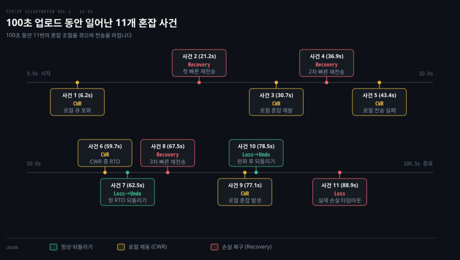
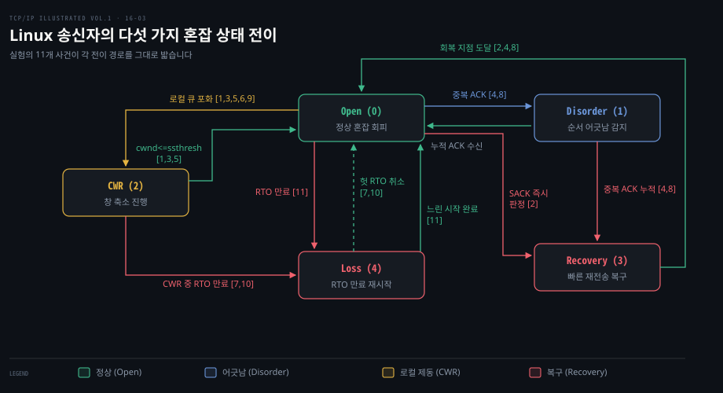
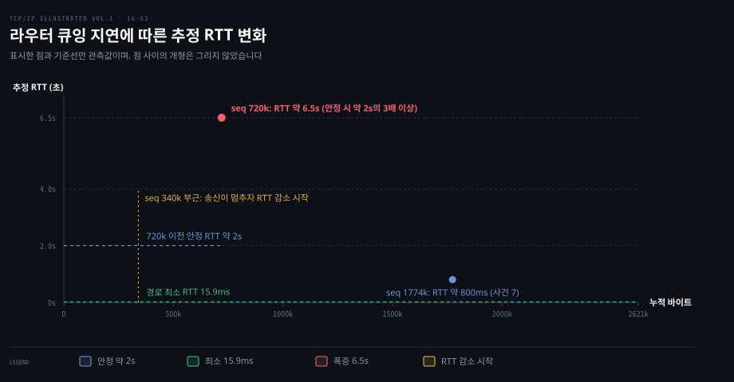
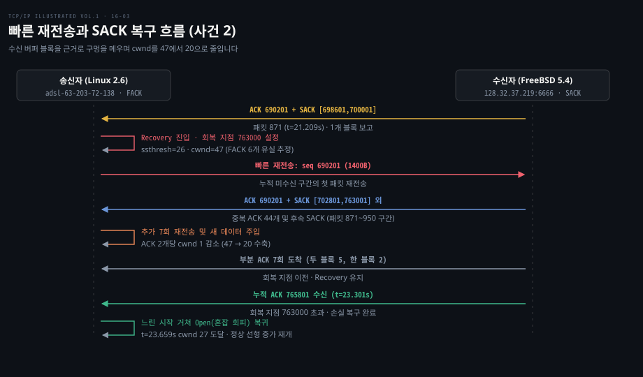
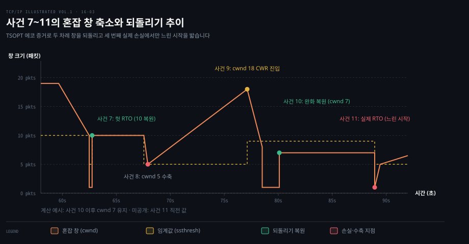

# 업로드 한 건의 혼잡 창은 다섯 상태를 오가며 줄고 되돌아온다

---

> 2.5MB 파일 전송 트레이스를 따라가며 Linux 송신자가 Open·Disorder·CWR·Recovery·Loss 다섯 상태를 오가며 혼잡 창을 깎고 되돌리는 실제 100초의 궤적을 해부합니다.

## 핵심 요약

> 이 편의 중심 생각은 송신자가 망의 혼잡뿐 아니라 송신 시스템 내부의 큐 포화까지 감지하여 상태 머신을 전이시키고, 패킷 손실 없는 상황에서도 창을 줄이며, 잘못 판단한 타임아웃은 이전 상태로 온전히 되돌린다는 것입니다.

실제 네트워크 전송에서는 단순한 교과서적 수식대로만 혼잡 창이 오르내리지 않습니다. 대역폭 지연 곱이 큰 경로에서 송신 어플리케이션이 잠시 멈췄다 대량의 데이터를 한꺼번에 쏟아내면, 패킷은 라우터에 도달하기도 전에 송신 호스트 내부의 패킷 스케줄러 큐에서 먼저 버려집니다. 이때 송신자는 패킷 유실이 망에서 발생하지 않았더라도 창 축소 상태로 들어가 전송률을 완만하게 깎습니다.

손실이 발생했을 때는 SACK 옵션이 제공하는 수신 버퍼 블록 정보와 순서 번호 구멍을 조합하여 단 하나의 왕복 시간 안에 여러 패킷을 찾아내 다시 보냅니다. 만약 재전송 타이머가 만료되었더라도 돌아온 확인 응답의 타임스탬프를 대조해 그것이 지연에 불과했음이 밝혀지면, 깎였던 혼잡 창과 임계값을 즉시 복원하되 버스트 분출을 막는 완화 절차를 밟습니다. 이 모든 동작은 커널 내부의 엄격한 다섯 가지 혼잡 제어 상태 머신 위에서 질서 있게 수행됩니다.


## 학습 목표

> 이 편을 읽고 나면 다음을 설명할 수 있습니다.

1. 대량 전송 트레이스 통계에서 총 처리율과 유효 전송률의 차이를 계산하고 재전송의 비용을 파악할 수 있습니다.
2. Linux 송신자가 혼잡 상태를 Open·Disorder·CWR·Recovery·Loss 다섯으로 나누는 기준과 상태 전이 조건을 설명할 수 있습니다.
3. 송신자 로컬 큐 포화로 발생하는 로컬 혼잡의 메커니즘과 stretch ACK이 혼잡 창 갱신에 미치는 영향을 분석할 수 있습니다.
4. SACK 블록과 비행 크기 추정식을 통해 빠른 재전송과 다중 손실 복구가 진행되는 과정을 추적할 수 있습니다.
5. 타임스탬프 에코 증거로 헛 재전송 타임아웃을 판정하고 혼잡 창 완화 규칙을 적용해 이전 창 크기로 안전하게 되돌리는 절차를 설명할 수 있습니다.



100초 동안 2.5MB 파일을 올리는 단 한 번의 연결 안에서 11번의 혼잡 조절 사건이 일어납니다. 로컬 큐 포화로 인한 CWR 상태 진입부터 망 손실에 맞선 SACK 빠른 재전송이 차례로 전개됩니다.

지연으로 빚어진 타임아웃을 증거에 따라 원상태로 복원하는 되돌리기와 마지막 실제 손실에 따른 느린 시작까지 다섯 상태의 전이 경로가 고스란히 펼쳐집니다.


## 1. 실험 하나를 tcptrace 요약부터 읽는다

> 2.5MB 파일을 상향 DSL 회선으로 전송할 때 송수신자가 주고받은 패킷 수와 재전송 통계는 물리적 병목과 손실 복구의 비용을 명확한 숫자로 보여 줍니다.

물리 회선의 대역폭이 300Kb/s일 때 응용 프로그램의 체감 속도는 왜 그보다 낮게 측정됩니까? 단위 시간당 전송량과 순수 유효 데이터량의 괴리는 어디에서 비롯됩니까?

2005년 Linux 2.6 송신자에서 FreeBSD 5.4 수신자로 대용량 데이터를 전송하는 실험을 살펴봅니다. 송신 경로는 상향 약 300Kb/s의 DSL 회선이며 17개의 라우터 홉이 있고 물리적 최소 RTT는 15.9ms입니다.

수신자에서는 대형 소켓 버퍼를 확보하기 위해 다음 명령으로 수신 프로그램을 실행했습니다.
```bash
FreeBSD% sock -i -r 32768 -R 233016 -s 6666
```
이 설정은 소켓 수신 버퍼로 228KB(233,016바이트)를 잡고 응용 계층이 32KB 단위로 읽도록 지정한 것입니다. 송신자에서는 2.5MB의 대용량 데이터를 전송하기 위해 다음 명령을 실행했습니다.
```bash
Linux% sock -n20 -i -w 131072 -S 262144 128.32.37.219 6666
```
이 명령은 256KB의 대형 송신 버퍼를 사용해 131,072바이트 덩어리 20개, 즉 총 2,621,440바이트(2.5MB)를 쏟아붓습니다. 송신 호스트에서 `tcpdump`로 수집한 패킷 트레이스 파일을 `tcptrace` 분석 도구로 집계하면 연결의 전모가 수치로 드러납니다.

| 분석 항목 | 송신자 → 수신자 (a → b) | 수신자 → 송신자 (b → a) |
| :--- | :--- | :--- |
| 전체 패킷 수 | 1,903개 | 1,272개 |
| ACK 플래그 패킷 수 | 1,902개 | 1,272개 (전부 ACK) |
| 순수 ACK (데이터 없음) | 2개 (SYN+ACK에 대한 ACK, 마지막 ACK) | 1,270개 |
| SACK 옵션 포함 패킷 수 | 0개 | 79개 |
| 고유 전송 바이트 | 2,621,440바이트 (2.5MB) | 0바이트 |
| 총 전송 바이트 | 2,659,240바이트 | 0바이트 |
| 재전송 바이트 및 패킷 | 37,800바이트 (27개 패킷) | 0바이트 |
| 최대 광고 창 (awnd) | 5,808바이트 | 233,016바이트 |
| 초기 혼잡 창 (IW) | 2,800바이트 (2개 패킷) | - |
| 데이터 송신 소요 시간 | 99.631초 (전체 경과 100.476초) | - |
| 총 처리율 (throughput) | 26,466 B/s (약 212Kb/s) | 0 Bps |
| 유효 전송률 (goodput) | 26,090 B/s (약 209Kb/s) | 0 Bps |

이 통계에서 **처리율(throughput)**은 망을 통과한 총 2,659,240바이트를 전체 시간 100.476초로 나눈 값으로 약 212Kb/s입니다. 반면 **유효 전송률(goodput)**은 중복 없이 응용 프로그램에 도달한 고유 2,621,440바이트만을 나눈 값으로 약 209Kb/s에 그칩니다. 27개 패킷에 달하는 37,800바이트의 재전송이 발생하면서 약 3Kb/s의 대역폭 손실이 빚어졌습니다.

수신자의 광고 창은 233,016바이트로 유지되어 대역폭 지연 곱을 훨씬 상회하므로 수신 버퍼 부족으로 인한 병목은 전혀 없었습니다. 병목은 순수하게 300Kb/s로 제한된 DSL 링크와 경로상의 버퍼 축적, 그리고 송신자가 혼잡 제어를 수행하며 조절한 혼잡 창의 한계에서 비롯되었습니다. 이러한 패킷 시퀀스 분석 방법은 [Wireshark 패킷 분석 03-02 §5](../paw_packet-analysis-wireshark/03-02.TCP가%20어긋날%20때.md)에서 다루는 시퀀스-시간 그래프 분석과 일치합니다.


## 2. Linux 송신자는 혼잡 상태를 다섯으로 나눈다

> Linux 커널은 수신되는 ACK 신호와 시스템 내부 이벤트에 따라 연결 상태를 다섯 가지 상태 머신으로 엄격히 분류하여 혼잡 창을 관리합니다.

송신자는 왜 망 상태를 단순한 수치 증가나 감소로만 다루지 않고 이산적인 상태 머신으로 나누어 통제합니까? 단편적 연산만으로는 로컬 큐 포화, 경미한 재정렬, 심각한 유실, 헛 타임아웃처럼 성격이 완전히 다른 네트워크 사건에 맞춤 대응할 수 없기 때문입니다. 커널 헤더 [`include/uapi/linux/tcp.h`](https://github.com/torvalds/linux/blob/master/include/uapi/linux/tcp.h)에 정의된 `enum tcp_ca_state`가 바로 그 중추입니다.

```c
enum tcp_ca_state {
    TCP_CA_Open = 0,
    TCP_CA_Disorder = 1,
    TCP_CA_CWR = 2,
    TCP_CA_Recovery = 3,
    TCP_CA_Loss = 4
};
```

이 업로드 실험에서 송신자가 거친 다섯 상태는 다음과 같은 명확한 의미와 전이 규칙을 가집니다.

1. **`TCP_CA_Open` (0)**: 정상 전송 상태입니다. 미확인 패킷이 순서대로 승인되고 있으며 순서 어긋남이나 손실 의심이 없습니다. 혼잡 창(cwnd)은 [16-01](./16-01.혼잡%20창은%20느린%20시작으로%20키우고%20혼잡%20회피로%20다듬는다.md)에서 살펴본 대로 느린 시작이나 혼잡 회피 규칙에 따라 매 RTT마다 확장됩니다.
2. **`TCP_CA_Disorder` (1)**: 패킷 순서 어긋남 감지 상태입니다(사건 4·8). 중복 ACK가 1~2개 도착하거나 SACK 옵션이 붙었지만 아직 손실 임계치에 도달하지 않았을 때 진입합니다. 송신자는 망의 패킷 보존 원칙에 따라 도착하는 ACK 하나당 새 패킷 하나를 내보내는 제한 전송 방식으로 동작합니다.
3. **`TCP_CA_CWR` (2)**: 혼잡 창 축소 상태입니다(사건 1·3·5·6·9). 손실이 없더라도 로컬 큐 포화나 ECN-Echo를 감지하면 진입합니다. ssthresh를 절반으로 낮추고 도착하는 ACK 2개당 cwnd를 1씩 줄입니다. cwnd가 새 ssthresh에 도달하면 Open 상태로 복귀합니다.
4. **`TCP_CA_Recovery` (3)**: 빠른 재전송 복구 상태입니다(사건 2·4·8). 중복 ACK가 누적되거나 SACK 정보를 통해 손실이 확실시될 때 진입합니다. 손실된 첫 패킷을 즉시 빠른 재전송하고 당시 송신된 최고 순서 번호를 회복 지점으로 설정합니다. 복구 중에는 비행 크기를 계산하며 재전송을 통제하고 회복 지점을 넘어서는 누적 ACK가 올 때까지 Recovery 상태를 유지합니다.
5. **`TCP_CA_Loss` (4)**: 재전송 타이머 만료 상태입니다(사건 7·10·11). ACK 피드백이 끊겨 최후의 보루인 RTO가 터졌을 때 진입합니다. 송신자는 수신자가 SACK 정보를 철회했을 가능성을 대비해 기존 SACK 지식을 모두 무효화하고 cwnd를 1로 강등한 뒤 느린 시작으로 다시 출발합니다.



CWR 상태는 망에서 실제로 패킷이 유실되지 않았는데도 왜 창을 줄입니까? 송신 속도가 경로의 병목 처리량이나 로컬 큐의 배출 능력을 초과했기 때문입니다. 버퍼가 꽉 차서 패킷이 버려질 때까지 방치하면 대규모 손실과 RTO 만료라는 치명적인 성능 저하로 이어집니다. 따라서 송신자는 드롭이 발생하기 전에 선제적으로 전송률을 깎아 큐를 비워 냅니다.

당시 Linux 2.6 커널은 CWR과 Recovery 상태에서 들어오는 ACK 2개당 1패킷씩 cwnd를 깎는 전통적인 rate-halving 알고리즘을 사용했습니다. 현대 Linux 커널은 이보다 진보하여 버스트를 억제하고 목표 창 크기로 부드럽게 전송률을 유도하는 비례 전송률 감축(PRR, [RFC 9937](https://www.rfc-editor.org/rfc/rfc9937), 실험판 RFC 6937 대체)을 기본 엔진으로 사용합니다. 또한 고정된 3개의 중복 ACK 문턱 대신 패킷 송신 타임스탬프를 기반으로 순서 어긋남과 손실을 정밀하게 가려내는 RACK-TLP([RFC 8985](https://www.rfc-editor.org/rfc/rfc8985))를 기본 탑재하고 있습니다.


## 3. 느린 시작 뒤 송신이 멈추고 로컬 혼잡이 창을 줄인다

> 송신 응용 프로그램이 일시 정지 후 데이터를 몰아칠 때 하위 계층 드라이버 큐가 넘치는 로컬 혼잡이 일어나며, 비정상적으로 큰 구간을 승인하는 stretch ACK은 혼잡 창을 급격히 끌어내립니다.

송신 어플리케이션이 멈췄다 대량의 데이터를 쏟아부을 때 패킷은 왜 송신 컴퓨터 안에서 먼저 사라집니까? 비정상적으로 큰 구간을 승인하는 ACK은 혼잡 창을 어떻게 요동치게 만듭니까?

연결 수립 직후 Linux 송신자는 초기 혼잡 창 IW=2(2,800바이트)로 느린 시작을 전개합니다. FreeBSD 수신자는 지연 ACK 정책에 따라 세그먼트 1개와 2개를 번갈아 승인하므로 평균적으로 3개 세그먼트 송신당 2개의 ACK가 반환됩니다. ACK가 돌아올 때마다 송신 창이 전진함과 동시에 cwnd가 지수적으로 증가하여 세그먼트가 2~3개씩 무리지어 네트워크로 주입됩니다.

시각 5.486초에 순서 번호 341601 세그먼트를 보낸 시점에 미확인 데이터량이 최대치인 137,200바이트(98개 패킷)에 달했습니다. 송신자의 혼잡 창 역시 98 패킷이었습니다. 일시 정지 직전 마지막으로 송신된 세그먼트는 344400번이었습니다. 그런데 이 직후 송신 어플리케이션이 잠시 데이터 전송을 멈춥니다.

어플리케이션이 멈춰 있는 동안 수신자로부터 11개의 ACK가 순차적으로 도착했습니다. 마지막 ACK는 순서 번호 233800까지 수신되었음을 알려 왔고 남아 있는 미확인 데이터량은 110,600바이트(79 패킷)로 줄어들었습니다. 시각 6.204초, 잠에서 깬 송신자는 열려 있는 혼잡 창 한도에 따라 19개 패킷을 일시에 네트워크로 밀어 넣으려 시도했습니다.

그러나 실제로 송신 인터페이스를 통과한 패킷은 6.2초 무렵 8개(마지막 순서 번호 355600)에 불과했습니다. 나머지 11개 패킷은 어디로 사라진 것입니까? Linux 시스템의 패킷 스케줄러 상태를 조회하면 그 원인이 드러납니다.
```bash
Linux% tc -s -d qdisc show dev ppp0
qdisc pfifo_fast 0: bands 3 priomap 1 2 2 2 1 2 0 0 1 1 1 1 1 1 1 1
Sent 122569547 bytes 348574 pkts (dropped 2, overlimits 0 requeues 0)
```
출력에서 `dropped 2`가 핵심입니다. 송신 호스트 커널의 패킷 스케줄링 큐(`pfifo_fast`)가 TCP 계층이 한꺼번에 쏟아낸 19개 패킷 버스트를 감당하지 못하고 하위 네트워크 인터페이스 큐에서 패킷을 떨어뜨린 것입니다.

이것이 바로 **로컬 혼잡(local congestion)**입니다. 이 패킷 탈락은 원격 라우터나 망 선로가 아니라 송신 컴퓨터 내부의 TCP 하위 계층에서 일어났습니다. 더욱이 TCP 아래이지만 패킷 캡처 지점보다 위인 큐(qdisc)에서 버려져 캡처에 도달하지 못했기 때문에 트레이스에 흔적이 없습니다.

Linux TCP는 이 하위 계층 송신 실패를 감지하자마자 즉시 CWR 상태로 전이합니다.
- 임계값 ssthresh를 절반인 49 패킷으로 삭감합니다.
- 혼잡 창 cwnd는 87 패킷으로 재설정됩니다.
- CWR 상태에 머물며 들어오는 ACK 2개당 cwnd를 1씩 깎는 rate-halving을 실행합니다.

전송률 삭감이 진행되던 중 시각 8.362초에 특이한 ACK가 도착합니다. 직전 ACK가 313601번이었는데, 새로 온 ACK는 순서 번호 317801번을 가리키고 있었습니다. 단 한 번의 ACK로 세그먼트 3개 분량인 4,200바이트가 한 번에 승인된 것입니다. 이를 **stretch ACK**이라고 부릅니다. 지연 ACK 정책의 통상적인 2개 한도를 넘어 3개 이상을 묶어 승인하는 이 현상은 대개 반대 방향 선로에서 이전 ACK 패킷 하나가 유실되었을 때 발생합니다.



Linux CWR 상태의 핵심 갱신 규칙은 비행 크기 연동입니다.
$$\text{cwnd} = \min(\text{flight size} + 1, \, \text{cwnd}_{\text{reduced}})$$

평상시의 점진적 축소 외에도 stretch ACK이 들어와 비행 데이터량이 68에서 65로 급감하자 cwnd는 68에서 66으로 단번에 떨어졌습니다. 이처럼 비행 크기와 연동된 CWR 상태는 시각 9.370초에 cwnd가 ssthresh 49 패킷에 도달하면서 종료되고 연결은 정상 상태로 복귀했습니다.

이 과정에서 RTT 궤적은 큐잉 지연의 본질을 보여 줍니다. 물리적 선로의 최소 RTT는 15.9ms에 불과했지만 초반 전송 속도가 DSL 상향 한도를 웃도는 약 500Kb/s에 달해 경로상 라우터 버퍼가 가득 찼습니다. 그러다 순서 번호 340,000 부근에서 송신자가 일시 정지하자 큐가 빠져나가며 RTT가 급락했습니다. 큐를 채우면 RTT가 늘어나고 송신을 멈추면 큐가 비워져 RTT가 줄어드는 병목 버퍼의 동역학이 관측된 것입니다.


## 4. 빠른 재전송과 SACK 복구가 구멍을 메운다

> 심각한 망 혼잡으로 패킷 손실이 터졌을 때 송신자는 SACK 블록 정보를 활용해 비행 크기를 정밀 계산하고 Recovery 상태에서 다중 손실을 신속하게 메웁니다.

라우터 버퍼가 넘쳐 여러 패킷이 사라졌을 때 송신자는 단 하나의 중복 ACK로 어떻게 손실을 직감합니까? SACK 블록은 다중 유실을 어떻게 한 왕복 시간 안에 수습합니까?

시각 9.37초에 CWR을 벗어난 TCP는 혼잡 회피 상태에서 약 2.0초의 안정적인 RTT를 유지하며 순항했습니다. 그러나 시각 17.232초, 순서 번호 720,000 부근에 도달하자 경로상에 극심한 네트워크 혼잡이 형성되었습니다. 측정 RTT는 안정치 2.0초의 3배가 넘는 6.5초까지 폭증했습니다. 버퍼가 완전히 포화된 라우터는 결국 패킷을 버리기 시작했고 연결은 첫 번째 망 패킷 유실을 맞이합니다.

시각 21.209초, 송신자는 패킷 871번을 수신합니다. 이 패킷은 누적 ACK 번호가 690201이면서 SACK 블록 `[698601, 700001]`을 담고 있는 중복 ACK였습니다. 이때 송신자가 마지막으로 보낸 최고 순서 번호는 763000이었고 당시 cwnd는 52 패킷이었습니다.

송신자는 단 하나의 중복 ACK만으로 즉시 Recovery 상태에 진입합니다(사건 2).
- ssthresh를 이전 cwnd의 절반인 26 패킷으로 낮춥니다.
- 복구 완료 기준선인 **회복 지점(recovery point)**을 당시 최고 순서 번호인 763000으로 고정합니다.
- 순서 번호 690201의 세그먼트(1,400바이트)를 즉시 빠른 재전송합니다.

손실 복구 중 혼잡 창을 얼마로 잡아야 합니까? 망 내부에 실제로 남아 있는 유효 패킷 수를 알아내기 위해 Linux는 다음 비행 크기 공식을 적용합니다.
$$\text{flight size} = \text{packets\_outstanding} + \text{packets\_retransmitted} - \text{packets\_removed}$$

여기서 각 항의 계산은 다음과 같습니다.
1. $\text{packets\_outstanding}$: 누적 ACK로 확인되지 않은 전체 패킷 수로 52 패킷입니다.
2. $\text{packets\_retransmitted}$: 아직 재전송되지 않았으므로 0입니다.
3. $\text{packets\_removed}$: 망을 이미 빠져나간 패킷의 추정치입니다. SACK 블록으로 수신자 버퍼에 보관된 패킷은 1개입니다. 여기에 당시 Linux 커널의 기본값이었던 FACK(Forward Acknowledgment) 규칙이 적용됩니다. SACK 블록 앞쪽의 빈 구멍 6개 패킷은 이미 망에서 유실되어 사라진 것으로 간주합니다. 따라서 제거된 패킷 추정치는 7개 패킷입니다.

따라서 비행 크기는 $52 + 1 - 7 = 46$ 패킷으로 산출되며, cwnd는 `flight size + 1 = 47` 패킷으로 설정됩니다.



시각 21.2초부터 21.7초 사이에 패킷 871부터 950에 걸쳐 SACK을 실은 ACK가 이어졌습니다. 연결 전체에서 SACK 옵션을 실은 ACK는 총 79개였습니다. 수신자 버퍼에는 `[698601, 700001]` 외에도 최대 43패킷에 달하는 거대한 두 번째 블록 `[702801, 763001]`이 형성되었습니다. 송신자는 수신 버퍼 정보를 바탕으로 구멍 난 구간을 골라 총 8번의 재전송을 단행했습니다.

Recovery 상태에서도 rate-halving이 적용되어 도착하는 ACK 2개당 cwnd가 1씩 감소했습니다. 누적 ACK 690201을 반복하는 44개의 중복 ACK와 회복 지점(763000) 미만의 번호를 담은 7개의 부분 ACK(두 블록 5개, 한 블록 2개)가 처리되는 동안 cwnd는 47에서 20까지 수축했습니다. 마침내 시각 23.301초, 회복 지점을 완전히 넘어서는 누적 ACK 765801번이 도착하자 Recovery 상태가 종결되었습니다. 종료 시점의 cwnd는 20, ssthresh는 26이었으므로 송신자는 느린 시작을 거쳐 시각 23.659초에 cwnd=27에 도달하며 정상 상태로 복귀했습니다.

이후에도 전송은 여러 혼잡 사건을 차례로 통과합니다.
- **사건 3 (30.745초)**: cwnd=31에서 로컬 큐 포화로 CWR 재진입. cwnd=30, ssthresh=15 설정 후 34.759초에 종료.
- **사건 4 (36.914초)**: 시각 36.878초 패킷 1366 도착으로 Disorder에 들어간 뒤 36.912초 패킷 1368로 Recovery에 진입했습니다. 패킷 1369 빠른 재전송을 단행하고 ssthresh를 16에서 8로 낮췄습니다. 회복 지점은 1134000으로 설정되었습니다. 시각 37.455초 ACK 1134001이 도착하여 복구를 마쳤으며 종료 시 cwnd=4, ssthresh=8로 느린 시작을 시작했습니다.
- **사건 5 (43.356초)**: ACK 1359401 수신 후 후속 패킷 전송 중 로컬 혼잡으로 CWR에 재진입하여 ssthresh=8, cwnd=15가 되었습니다. CWR 중 2차 전송 실패로 ssthresh가 한때 12가 되었고, 최종적으로 cwnd=7, ssthresh=8로 탈출했습니다.
- **사건 6 (59.652초)**: 로컬 혼잡으로 cwnd=19, ssthresh=10 상태에서 CWR 재진입. 그러나 이 CWR 감축은 뒤이어 터진 타임아웃에 의해 중단됩니다.

NewReno가 단일 왕복 시간당 구멍 하나씩만 복구하던 한계를 벗어나 SACK과 FACK이 결합하여 다중 손실을 일사불란하게 메운 것입니다. SACK의 기본 구조와 복구 원리는 [14-02](./14-02.손실은%20타이머보다%20ACK%20와%20SACK%20으로%20빨리%20찾는다.md) 및 [16-02](./16-02.복구%20중%20혼잡%20창은%20NewReno·SACK·제한%20전송이%20다듬고%20헛%20RTO%20는%20되돌린다.md)에서 자세히 살펴볼 수 있습니다. 최신 Linux 커널은 패킷 재정렬 환경에서 손실을 과대평가하는 FACK의 결함을 극복하기 위해 RACK-TLP를 공식 대체재로 채택하고 있습니다.


## 5. 타임아웃이 나고, 헛것으로 판정되면 창을 되돌린다

> 지연으로 촉발된 헛 재전송 타임아웃은 타임스탬프 에코 증거를 통해 즉시 무효화되고 혼잡 창을 되돌리며, 갑작스러운 패킷 분출을 방지하기 위해 혼잡 창 완화 절차가 적용됩니다.

모든 확인 응답이 끊겨 재전송 타이머가 만료되었을 때, 송신자는 패킷 유실이 실제가 아니라 일시적 지연이었음을 어떻게 입증하고 깎인 혼잡 창을 이전 크기로 되돌립니까? 빠른 재전송으로 해결되지 않는 혼잡 상황에서는 재전송 타이머가 만료됩니다. 시각 62.486초, 마지막 ACK를 받은 뒤 약 1.58초가 흐른 시점에 RTO(1.57초)가 만료되며 순서 번호 1773801 세그먼트의 재전송이 발생했습니다(패킷 2157, 사건 7). 당시 추정 RTT는 800ms 수준이었습니다.

타이머가 만료되면 TCP는 즉시 Loss 상태로 떨어집니다.
- 혼잡 창 cwnd를 1로 떨어뜨립니다.
- ssthresh를 5로 깎습니다.
- 수신자가 버퍼 부족으로 기존 SACK 데이터를 폐기했을 가능성을 배제할 수 없으므로 기존 SACK 정보를 강제로 모두 무효화합니다.

그런데 불과 271ms 뒤인 시각 62.757초, 순서 번호 1775201을 승인하는 ACK가 도착했습니다(패킷 2158). 이 ACK에 담긴 TCP 타임스탬프 옵션(TSOPT)을 분석하면 다음과 같은 사실이 확인됩니다.
- 패킷 2157 재전송 세그먼트의 송신 타임스탬프(TSV): `17155274`
- 새로 도착한 패킷 2158 ACK의 타임스탬프 에코(TSER): `17152514`

ACK가 메아리쳐 온 TSER(`17152514`)이 재전송 패킷을 보낼 때 찍었던 TSV(`17155274`)보다 훨씬 앞선 과거의 시점이었습니다. 이것은 무엇을 증명합니까? 지금 도착한 ACK는 방금 보낸 재전송 패킷에 대한 응답이 아니라, 타임아웃이 터지기 전에 보냈던 원래 패킷이 네트워크 지연을 겪고 뒤늦게 수신자에 닿아 생성된 ACK라는 결정적 증거입니다.



따라서 이 타임아웃은 실제 손실이 아니라 일시적 지연으로 발생한 헛 타임아웃입니다. 송신자는 타임스탬프로 헛 RTO를 탐지([RFC 3522](https://www.rfc-editor.org/rfc/rfc3522))하고 Eifel과 비슷한 응답([RFC 4015](https://www.rfc-editor.org/rfc/rfc4015))으로 되돌립니다. cwnd와 ssthresh를 타임아웃 직전 값인 10으로 온전히 복원하고 Loss 상태에서 즉시 정상 상태로 복귀하여 혼잡 회피를 이어 갑니다.

Linux 커널 소스 [`net/ipv4/tcp_input.c`](https://github.com/torvalds/linux/blob/master/net/ipv4/tcp_input.c)에는 되돌리기 판정 함수군이 구현되어 있습니다. 판정은 `tcp_try_undo_recovery`·`tcp_try_undo_loss`·`tcp_try_undo_dsack`·`tcp_try_undo_partial`이 내립니다. 실제 창 크기와 ssthresh 복원은 `tcp_undo_cwnd_reduction`이 수행합니다. 손실 판정이 오심임을 입증하는 D-SACK이나 타임스탬프가 확인되면 커널은 즉시 이전 창 크기로 복원합니다.

이후 연결은 다음과 같은 사건들을 차례로 거칩니다.
- **사건 8 (67.550초)**: 패킷 2179로 Disorder에 진입한 뒤 패킷 2182로 Recovery에 들어갔습니다. 순서 번호 1789201을 빠르게 다시 보냈습니다. ssthresh는 5로 줄었고 cwnd는 5까지 수축했습니다. 시각 67.916초 패킷 2197이 도착해 복구를 마쳤습니다.
- **사건 9 (77.121초)**: cwnd=18에서 로컬 혼잡으로 CWR에 재진입해 ssthresh=9가 되었습니다. cwnd는 비행 크기 연동으로 먼저 줄고 ACK 수신으로 1 더 줄어 8이 된 시점에 타임아웃으로 중단되었습니다.
- **사건 10 (78.515초)**: 순서 번호 2175601에 대해 두 번째 RTO 만료 재전송이 일어났습니다. 당시 TSV는 17171306이었고 cwnd=1, ssthresh=9였습니다. 그러나 시각 80.093초 TSER 17169948을 담은 패킷 2641이 도착하면서 다시 헛 RTO로 판정되었습니다.

사건 10에서 되돌리기를 수행할 때 송신자는 중요한 안전장치를 가동합니다. 타임아웃 이전의 cwnd는 8이었습니다. 당시 미확인 상태로 비행 중인 데이터는 5,600바이트(4패킷)였습니다. 만약 cwnd를 타임아웃 전 수치인 8로 즉시 점프시키면 송신자는 남은 여유분인 4개 패킷을 네트워크로 일시에 쏟아붓게 됩니다. 이 돌발적인 버스트 분출은 병목 버퍼를 다시 무너뜨려 연쇄 손실을 부를 수 있습니다.

이를 방지하기 위해 Linux는 **혼잡 창 완화(Congestion Window Moderation)**를 적용합니다. 단일 ACK 수신에 반응하여 내보낼 수 있는 최대 패킷 수를 `maxburst = 3`으로 제한하고 cwnd를 다음 공식으로 설정합니다.
$$\text{cwnd} = \text{flight size} + \text{maxburst} = 4 + 3 = 7$$

cwnd를 8 대신 7로 완만하게 복원함으로써 버스트 충격을 완충한 것입니다.

마지막 사건은 실제 손실이었습니다.
- **사건 11 (88.929초)**: 순서 번호 2185401 세그먼트에 대해 세 번째 RTO가 만료되었습니다. 이번에는 뒤이어 도착한 ACK 어디에도 헛 타임아웃을 증명할 타임스탬프 증거가 없었습니다. 송신자는 이 타임아웃을 되돌릴 수 없었으며, Loss 상태에서 ssthresh=5, cwnd=1로 순수한 느린 시작을 밟아 나갔습니다.
- 시각 89.434초, cwnd가 지수적으로 성장해 ssthresh 5 패킷에 도달하자 혼잡 회피로 전환되었습니다.
- 시각 99.757초 송신자가 FIN을 내보내고, 13개의 수신자 ACK와 FIN 교환을 거쳐 시각 100.476초 최종 ACK가 오가며 2.5MB 전송의 100초 대장정이 완수되었습니다.


## 면접 대비

> 이 편에서 다룬 핵심 개념을 기술 면접 질문과 답으로 점검합니다.

1. 네트워크 전송 분석에서 처리율(throughput)과 유효 전송률(goodput)의 차이는 무엇이며, 대용량 업로드에서 두 지표의 격차가 벌어지는 근본 원인은 무엇입니까?
2. Linux TCP의 혼잡 제어 상태 머신에서 CWR 상태는 패킷 손실이 발생하지 않았는데도 왜 혼잡 창을 축소합니까?
3. 송신 호스트 내부의 패킷 스케줄러에서 발생하는 로컬 혼잡(local congestion)은 일반적인 망 손실과 어떻게 다르며, tcpdump 패킷 트레이스에 직접 잡히지 않는 이유는 무엇입니까?
4. SACK 복구 및 CWR 상태에서 stretch ACK이 도착했을 때 혼잡 창은 어떤 규칙에 의해 갱신됩니까?
5. RTO 타이머 만료 후 수신된 ACK에서 어떤 정보를 근거로 스퓨리어스 타임아웃을 판정하며, 창을 복원할 때 혼잡 창 완화(moderation) 절차가 필요한 이유는 무엇입니까?


## 정답 (자답 후 펼치기)

> 각 질문의 핵심 키워드와 상세 해설입니다.

### 정답 1 — 처리율과 유효 전송률의 차이
처리율(throughput)은 재전송 패킷과 헤더를 포함해 물리 선로를 통과한 단위 시간당 전체 데이터 전송률을 뜻하며, 유효 전송률(goodput)은 중복 없이 응용 계층에 순수하게 도달한 고유 데이터의 단위 시간당 전송률을 뜻합니다. 두 지표의 격차를 벌리는 핵심 요인은 망 혼잡으로 인한 패킷 유실과 재전송 오버헤드입니다. 본 실험에서 총 전송 바이트(2,659,240B) 중 37,800바이트(27개 패킷)의 재전송이 발생하면서 처리율(212Kb/s) 대비 유효 전송률(209Kb/s)이 약 3Kb/s 낮게 측정되었습니다.

### 정답 2 — CWR 상태의 선제적 창 축소 이유
CWR(Congestion Window Reducing) 상태는 로컬 큐 포화 또는 ECN-Echo 플래그처럼 버퍼가 가득 차기 시작했음을 알리는 신호를 받았을 때 진입합니다. 패킷이 실제로 유실될 때까지 송신 속도를 유지하면 버퍼 오버플로로 인한 대규모 패킷 드롭과 RTO 만료가 발생하여 연결 성능이 심각하게 추락합니다. 따라서 CWR 상태는 손실이 터지기 전에 선제적으로 ssthresh를 반감하고 들어오는 ACK 2개당 cwnd를 1씩 줄이는 전송률 반감(rate-halving)을 수행하여 경로상 대기 큐를 부드럽게 비워 냅니다.

### 정답 3 — 로컬 혼잡의 발생 위치와 캡처 비가시성
로컬 혼잡은 송신 호스트 내부의 하위 계층에서 TCP 계층이 방출한 패킷 버스트 속도를 물리 드라이버 배출 속도가 따라가지 못해 큐가 넘쳐 패킷이 폐기되는 현상입니다. TCP 아래이지만 패킷 캡처 시설이 가로채는 지점보다 위인 패킷 스케줄러(qdisc) 계층에서 발생하므로 캡처 시설에 아예 도달하지 못해 드롭 사실이 트레이스에 직접 나타나지 않습니다. 이는 `tc -s -d qdisc show`와 같은 커널 통계 명령어로만 확인됩니다.

### 정답 4 — stretch ACK과 CWR 창 연동 메커니즘
stretch ACK은 2개 세그먼트를 초과하는 크기를 단번에 승인하는 ACK로, 주로 반대 방향 경로에서 이전 ACK가 유실되었을 때 발생합니다. CWR 상태에서 Linux는 ACK 2개당 cwnd를 1씩 줄이는 것 외에도 매 ACK 수신마다 혼잡 창을 비행 중인 미확인 데이터량과 연동시킵니다. 이때 사용하는 공식은 cwnd = min(flight size + 1, cwnd_reduced)입니다. stretch ACK이 도착하면 미확인 데이터량이 급격히 줄어들므로 cwnd 역시 단번에 2패킷 이상 급격하게 수축되어 버스트 위험을 억제합니다.

### 정답 5 — 타임스탬프 기반 되돌리기와 버스트 완화
타임스탬프 옵션이 켜져 있을 때 RTO 재전송 후 도착한 첫 ACK의 타임스탬프 에코(TSER)가 재전송 송신 시각(TSV)보다 이전 시점을 가리키면 유효한 증거가 됩니다. 해당 ACK가 재전송 패킷이 아니라 타임아웃 전 이미 보냈던 원래 패킷에 대한 응답임이 증명되기 때문입니다. 이를 근거로 송신자는 헛 타임아웃을 선언하고 cwnd와 ssthresh를 이전 값으로 복원합니다. 이때 이전 cwnd로 한 번에 복귀하면 당시 미확인 패킷 수와의 차이만큼 대량의 패킷이 일시에 쏟아져 나오는 버스트가 발생할 수 있습니다. 이를 막기 위해 Linux는 단일 ACK당 최대 송신 허용량을 maxburst로 제한하고 cwnd = flight size + maxburst로 완만하게 복원하는 혼잡 창 완화 절차를 수행합니다.


## 참고 자료

- Kevin R. Fall, W. Richard Stevens, 《TCP/IP Illustrated, Volume 1: The Protocols》 2nd ed., Addison-Wesley, 2011, Chapter 16 §16.5.
- [RFC 5681: TCP Congestion Control](https://www.rfc-editor.org/rfc/rfc5681)
- [RFC 3522: The Eifel Detection Algorithm for TCP](https://www.rfc-editor.org/rfc/rfc3522)
- [RFC 4015: The Eifel Response Algorithm for TCP](https://www.rfc-editor.org/rfc/rfc4015)
- [RFC 9937: Proportional Rate Reduction for TCP](https://www.rfc-editor.org/rfc/rfc9937) (실험판 [RFC 6937](https://www.rfc-editor.org/rfc/rfc6937) 대체)
- [RFC 8985: The RACK-TLP Loss Detection Algorithm for TCP](https://www.rfc-editor.org/rfc/rfc8985)
- [Linux 커널 소스: include/uapi/linux/tcp.h (enum tcp_ca_state)](https://github.com/torvalds/linux/blob/master/include/uapi/linux/tcp.h)
- [Linux 커널 소스: net/ipv4/tcp_input.c (tcp_try_undo_*)](https://github.com/torvalds/linux/blob/master/net/ipv4/tcp_input.c)


## 관련 문서

- [16-01.혼잡 창은 느린 시작으로 키우고 혼잡 회피로 다듬는다.md](./16-01.혼잡%20창은%20느린%20시작으로%20키우고%20혼잡%20회피로%20다듬는다.md)
- [16-02.복구 중 혼잡 창은 NewReno·SACK·제한 전송이 다듬고 헛 RTO 는 되돌린다.md](./16-02.복구%20중%20혼잡%20창은%20NewReno·SACK·제한%20전송이%20다듬고%20헛%20RTO%20는%20되돌린다.md)
- [14-02.손실은 타이머보다 ACK 와 SACK 으로 빨리 찾는다.md](./14-02.손실은%20타이머보다%20ACK%20와%20SACK%20으로%20빨리%20찾는다.md)
- [14-03.재전송은 지연과 재정렬에도 속을 수 있다.md](./14-03.재전송은%20지연과%20재정렬에도%20속을%20수%20있다.md)
- [Wireshark 패킷 분석: 03-02.TCP가 어긋날 때.md](../paw_packet-analysis-wireshark/03-02.TCP가%20어긋날%20때.md)
