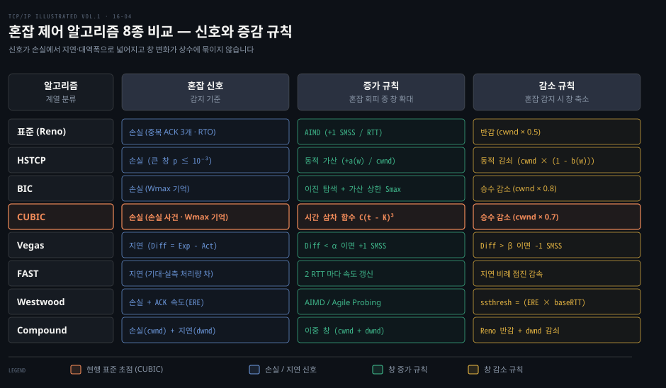
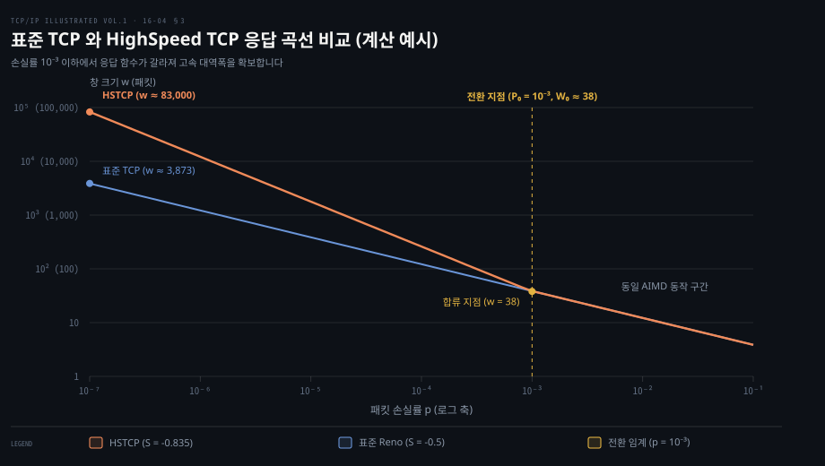
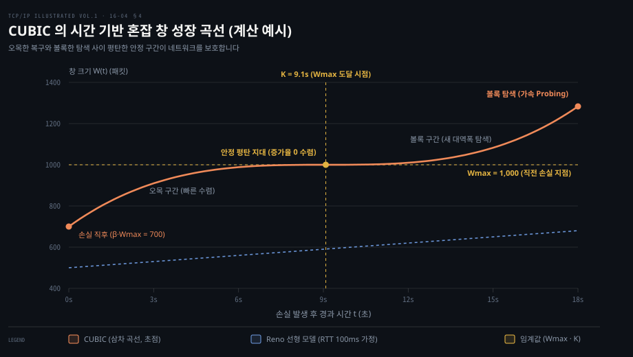
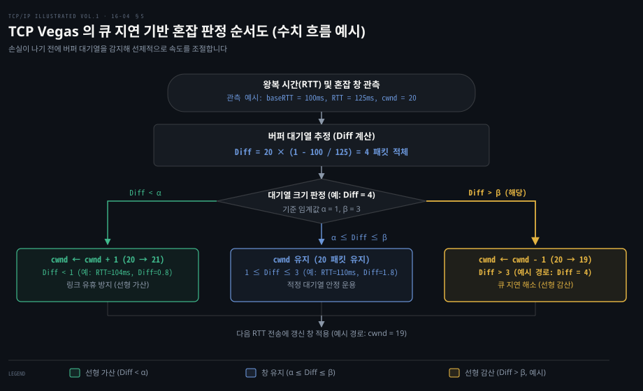

# 고속 망과 지연 기반 혼잡 제어는 창 증가 규칙과 혼잡 신호를 바꾼다

---

> 전통적인 손실 기반 혼잡 제어는 대역폭-지연 곱이 큰 고속 망에서 대역폭을 채우지 못하는 한계에 부딪힙니다. 현대 TCP 는 연결 간 혼잡 상태 공유, 고속 전송을 위한 비선형 창 증가, 그리고 패킷 손실 전에 버퍼 대기열을 감지하는 지연 기반 기법을 통해 전송 효율과 공정성을 개선합니다.

## 핵심 요약

> 이 편의 중심 생각은 네트워크 대역폭이 비약적으로 증가함에 따라 고정된 가산 증가·승수 감소 규칙과 단순 패킷 손실 신호만으로는 병목 링크를 효율적으로 활용할 수 없다는 것입니다.

표준 TCP 는 손실률의 제곱근에 반비례하는 처리량 한계 탓에 고속 대용량 망에서 파이프라인을 온전히 채우지 못합니다. 이에 대응하여 HighSpeed TCP 는 창 크기에 비례하는 동적 증감 함수를 도입했습니다. BIC 는 이진 탐색으로 가용 대역폭을 추적했고, CUBIC 은 시간의 삼차 함수를 채택해 왕복 시간 차이에 따른 불공정성을 완화했습니다.

한편 패킷 손실 이전에 라우터 버퍼에 패킷이 쌓이면서 나타나는 왕복 시간 증가를 감지하는 지연 기반 혼잡 제어도 발전했습니다. TCP Vegas 와 FAST 는 큐잉 지연을 단서로 선제적 감속을 수행하며, Compound TCP 는 손실 기반 창과 지연 기반 창을 결합해 기존 흐름과의 공존성을 확보했습니다.



표준 Reno 부터 현대 CUBIC 및 지연 기반 알고리즘까지 혼잡 신호와 창 증감 규칙의 진화 격자입니다.


## 학습 목표

> 이 편을 읽고 나면 다음을 설명할 수 있습니다.

1. 동일 목적지로 향하는 여러 TCP 연결이 시간적 공유와 앙상블 공유를 통해 과거 혼잡 메트릭을 재사용하는 원리를 설명할 수 있습니다.
2. TCP 친화성의 정의와 표준 AIMD 응답 함수가 고속 대용량 망에서 유효 처리량을 제약하는 수식적 배경을 증명할 수 있습니다.
3. HighSpeed TCP 의 창 비례 증감 함수 및 제한된 느린 시작이 버퍼 충격을 완충하는 방식을 분석할 수 있습니다.
4. BIC 의 이진 탐색 원리와 CUBIC 의 시간 기반 삼차 함수가 왕복 시간 독립성과 안정적 대역폭 탐색을 달성하는 구조를 설명할 수 있습니다.
5. 지연 기반 알고리즘인 Vegas, FAST, Westwood, Compound TCP 의 메커니즘을 비교하고 지연 기반 흐름이 손실 기반 흐름과 경쟁할 때 겪는 대역폭 불공정성(치우침)의 원인을 설명할 수 있습니다.


## 1. 같은 목적지로 가는 연결은 혼잡 상태를 나눠 쓸 수 있다

> 새로 열리는 연결마다 좁은 초기 창과 느린 시작을 되풀이하면 이미 검증된 고속 경로의 용량을 즉시 활용하지 못하고 대기 시간이 늘어납니다.

개별 TCP 연결이 독립적으로 동작하면 새로 열리는 모든 연결은 좁은 초기 창에서 출발하여 느린 시작을 거쳐야 합니다. 동일한 호스트 사이를 오가는 트래픽이라면 경로상의 병목 링크와 지연 특성 및 가용 대역폭을 공유할 가능성이 큽니다. 그럼에도 매번 바닥부터 왕복 시간을 측정하고 임계값을 더듬어 찾는 것은 네트워크 자원과 사용자 응답 시간 모두에 낭비가 됩니다.

이러한 문제를 해결하기 위해 제시된 개념이 **TCP 제어 블록 상호의존성**(TCP Control Block Interdependence)입니다. 이 메커니즘은 상태를 나누는 시점에 따라 두 가지로 구분됩니다.

- **시간적 공유**(temporal sharing): 이미 종료되어 `CLOSED` 상태가 된 과거 연결의 경로 측정값을 보관했다가, 동일 목적지로 새로 생성되는 연결의 초기 파라미터로 넘겨주는 방식입니다.
- **앙상블 공유**(ensemble sharing): 동일한 호스트 쌍 사이에서 현재 동시에 활성화되어 있는 여러 연결이 혼잡 창, 슬로 스타트 임계값, 왕복 시간 정보를 실시간으로 상호 참조하고 나누어 쓰는 방식입니다.

초기 표준인 [RFC 2140](https://www.rfc-editor.org/rfc/rfc2140) 은 이러한 제어 블록 공유의 개념적 틀을 정의했습니다. 나아가 [RFC 3124](https://www.rfc-editor.org/rfc/rfc3124) 는 TCP 뿐 아니라 UDP 기반 실시간 스트리밍 등 다양한 프로토콜이 운영체제 차원에서 경로 손실률, 혼잡 수준, RTT 를 통합 학습할 수 있도록 **혼잡 관리자**(Congestion Manager) 아키텍처를 제안했습니다.

[RFC 2140](https://www.rfc-editor.org/rfc/rfc2140) 을 대체한 정보성(Informational) 문서 [RFC 9040](https://www.rfc-editor.org/rfc/rfc9040) 은 현대 환경에 맞추어 시간적·앙상블 공유의 초기화 및 갱신 규칙을 체계화했습니다. NAT 나 동적 IP 재할당 환경에서 목적지 IP 만으로 상태를 공유하면 잘못된 경로 정보가 전달될 수 있다는 점과, 악의적인 캐시 오염으로 동일 목적지의 다른 연결 성능을 떨어뜨리는 서비스 거부(DoS) 공격 위험을 경고합니다.

Linux 커널은 이 개념을 **목적지 메트릭**(destination metrics)으로 구현하여 운용합니다. 과거 2.6 시절에는 라우팅 서브시스템의 목적지 캐시에 메트릭을 보관했습니다. 커널 3.6 에서 라우팅 캐시가 제거된 이후에는 TCP 메트릭 전용 해시 테이블(`tcp_metrics_hash`, `ip tcp_metrics` 명령으로 조회)에 보존합니다. TCP 연결이 `CLOSED` 상태로 전이할 때 커널은 다음 메트릭을 보존합니다.

1. 평활 왕복 시간(`srtt`) 및 RTT 분산(`rttvar`)
2. 경로 패킷 재정렬 추정치(`reordering`)
3. 혼잡 창(`cwnd`)과 느린 시작 임계값(`ssthresh`)

현재 Linux 커널은 연결 종료 시 RTT·rttvar·reordering·cwnd·ssthresh 메트릭을 저장합니다. 그러나 기본 설정인 [tcp_no_ssthresh_metrics_save](https://github.com/torvalds/linux/blob/master/Documentation/networking/ip-sysctl.rst)=1 에서는 이전 ssthresh 를 다시 쓰지 않습니다. 캐시된 RTT 도 첫 RTO 계산에만 쓰이고, 캐시된 cwnd 는 잠긴(locked) 경로에서만 창의 상한(`snd_cwnd_clamp`)으로 쓰이고 초기 창으로는 쓰이지 않습니다. 반면 재정렬 추정치(reordering)는 새 연결에 그대로 적용됩니다. 따라서 일반적인 환경의 새 연결이 느린 시작을 건너뛰지는 않으며 초기 창부터 안전하게 출발합니다.

전체 메트릭 저장을 완전히 끄려면 커널 파라미터 [net.ipv4.tcp_no_metrics_save](https://github.com/torvalds/linux/blob/master/Documentation/networking/ip-sysctl.rst) 를 1 로 설정합니다. 네트워크 성능 측정 실험처럼 매 연결마다 독립적인 초기 상태를 강제해야 하는 환경에서는 이 값을 1 로 설정하여 과거 메트릭의 간섭을 배제합니다.


## 2. TCP 친화성은 손실률에 대한 처리량 식으로 잰다

> 새로운 전송 프로토콜이 망의 대역폭을 독점해 기존 표준 TCP 흐름을 굶주리게 만들면 인터넷 전체의 협력적 전송 균형이 무너집니다.

공용 라우터를 거치는 여러 흐름은 한정된 대역폭을 동적으로 나누어 씁니다. 만약 어떤 새로운 프로토콜이 패킷 손실에 반응해 속도를 줄이지 않거나 지나치게 공격적으로 전송량을 늘린다면, 표준 TCP 흐름들은 일방적으로 대역폭을 빼앗기게 됩니다. 이러한 불공정성을 방지하기 위해 정립된 기준이 **TCP 친화성**(TCP friendliness)입니다.

프로토콜 설계자들에게 공존 가이드라인을 제공하기 위해 연구자들은 표준 TCP 의 전송률을 수식으로 모형화했습니다. 이것이 **TCP 친화적 전송률 제어**(TFRC, [RFC 5348](https://www.rfc-editor.org/rfc/rfc5348))입니다. TFRC 는 급격한 창 톱니파 진동 대신 안정적인 전송 프로파일을 유지해야 하는 스트리밍 응용을 위해 설계되었습니다.

TFRC 는 다음 응답 함수로 전송률 상한 $X$ (바이트/초)를 계산합니다.

$$X = \frac{s}{R \sqrt{\frac{2b p}{3}} + t_{RTO} \left(3 \sqrt{\frac{3bp}{8}}\right) p (1 + 32p^2)}$$

각 변수의 물리적 의미는 다음과 같습니다.

- $s$: 세그먼트 크기 (바이트 단위)
- $R$: 왕복 시간 (초 단위)
- $p$: 전송 패킷 대비 손실 사건의 비율
- $t_{RTO}$: 재전송 타이머 만료 시간 (권장값은 $4R$)
- $b$: 단일 ACK 가 승인하는 최대 패킷 수 (권장값은 1)

이 전송률 한도는 혼잡 회피 단계에서 동작하는 가산 증가·승수 감소(AIMD) 원리에서 유도할 수 있습니다. 임의의 증가 계수 $a$ 와 감소 계수 $b$ 를 적용한 일반화된 AIMD 식은 다음과 같습니다.

$$cwnd_{t+1} = cwnd_t + \frac{a}{cwnd_t}$$

위 식은 유효 ACK 도착 시의 가산 증가를 나타냅니다. 반면 손실 감지 시의 승수 감소는 다음과 같습니다.

$$cwnd_{t+1} = cwnd_t - b \cdot cwnd_t$$

이 제어식 아래에서 TCP 가 달성하는 RTT 당 평균 전송 패킷 수 $w$ 는 다음 공식으로 수렴합니다.

$$w = \sqrt{\frac{a(2-b)}{2b}} \cdot \frac{1}{\sqrt{p}}$$

표준 Reno 는 RTT 당 1 세그먼트를 늘리고($a = 1$) 손실 시 창을 절반으로 줄입니다($b = 0.5$). 수치 대입을 통해 다음 **단순화된 표준 TCP 응답 함수**를 얻을 수 있습니다.

$$w = \sqrt{\frac{1 \cdot (2 - 0.5)}{2 \cdot 0.5}} \cdot \frac{1}{\sqrt{p}} = \sqrt{\frac{1.5}{p}} \approx \frac{1.22}{\sqrt{p}}$$

이 응답 함수는 TCP 의 평균 창 크기가 손실률 $p$ 의 제곱근에 반비례함을 명확히 보여줍니다. 그러나 이 제곱근 역비례 관계는 대역폭-지연 곱(BDP)이 거대한 고속 대용량 망에서 치명적인 물리적 한계를 드러냅니다.

구체적인 수치 예시를 통해 문제를 살펴보겠습니다. 세그먼트 크기가 1,500바이트(약 12,000비트)이고 왕복 시간(RTT)이 100ms인 네트워크 환경에서 10Gbps 대역폭의 링크를 완전히 활용하고자 합니다. 이 파이프라인을 가득 채우기 위해 필요한 BDP 와 혼잡 창 $w$ 는 다음과 같습니다.

$$\text{BDP} = 10\text{ Gbps} \times 0.1\text{ s} = 1\text{ Gb} = 125\text{ MB}$$
$$w = \frac{125\text{ MB}}{1,500\text{ B}} \approx 83,333\text{ 패킷}$$

이 목표 창 크기 $w = 83,333$ 을 표준 TCP 응답 함수 $w \approx 1.22 / \sqrt{p}$ 에 대입하여 역산하면 필요한 패킷 손실률 $p$ 가 계산됩니다.

$$83,333 \approx \frac{1.22}{\sqrt{p}} \implies \sqrt{p} \approx 1.464 \times 10^{-5} \implies p \approx 2.14 \times 10^{-10}$$

즉 10Gbps 링크를 온전히 채우려면 약 50억 개의 패킷을 전송하는 동안 단 1개의 패킷 손실만 허용되어야 합니다. 10Gbps 로 패킷 50억 개를 보내는 데는 약 6,000초(1시간 40분)가 걸립니다. 즉 1시간 40분 동안 손실이 한 번만 허용되는 셈입니다. 현실의 장거리 광케이블과 스위치 장비에서 비트 오류나 미세한 버퍼 흔들림 없이 $10^{-10}$ 수준의 손실률을 1시간 40분 동안 지속하는 것은 불가능에 가깝습니다.

설상가상으로 손실이 단 한 번이라도 발생하여 $cwnd$ 가 절반인 41,666 패킷으로 줄어들면, RTT 당 1 패킷씩 선형 증가하는 표준 AIMD 규칙으로는 원래 창 크기로 복구하는 데 41,666 번의 RTT(약 4,166초, 즉 1시간 9분)가 소요됩니다. 결국 표준 TCP 는 고속 망에서 파이프라인 용량을 거의 채우지 못한 채 바닥에서 기어 다니게 됩니다. 고속 망을 지원하기 위해 응답 함수 자체를 근본적으로 뜯어고쳐야 하는 이유가 여기에 있습니다.


## 3. HSTCP 는 창이 클 때 응답 함수를 바꾼다

> 패킷 손실 후 이전 대역폭으로 복귀하는 데 한 시간 넘게 걸린다면 초고속 기가비트 회선을 깔아두고도 대역폭의 극히 일부만 쓰게 됩니다.

표준 TCP 가 고속 망에서 대역폭을 낭비하는 원인은 고정된 증가량 $a = 1$ 과 고정된 감소율 $b = 0.5$ 에 있습니다. [RFC 3649](https://www.rfc-editor.org/rfc/rfc3649) 에 정의된 **HighSpeed TCP**(HSTCP)는 혼잡 창의 크기에 따라 증가 계수 $a$ 와 감소율 $b$ 를 동적으로 조정하는 접근법을 취합니다.

HSTCP 는 로그-로그 평면에서 두 기준점을 설정하여 응답 함수의 기울기를 설계했습니다.

- 저속 기준점: $P_0 = 10^{-3}, W_0 = 38$ — 손실률이 0.1% 이상이고 창이 38 세그먼트 이하인 영역에서는 표준 TCP 와 동일하게 동작합니다.
- 고속 기준점: $P_1 = 10^{-7}, W_1 = 83,000$ — 10Gbps 링크를 포화시키는 대규모 창 환경입니다.

두 점을 잇는 로그 평면의 직선 기울기 $S$ 는 다음과 같이 결정됩니다.

$$S = \frac{\log W_1 - \log W_0}{\log P_1 - \log P_0} \approx \frac{4.919 - 1.580}{-7 - (-3)} \approx -0.835$$

[RFC 3649](https://www.rfc-editor.org/rfc/rfc3649) 는 이 두 기준점으로 기울기를 정해 $w = 0.12 / p^{0.835}$ ($S \approx -0.835$)를 채택했습니다. 초기 발표 곡선에서는 $(0.0015, 31)$ 과 $S = -0.82$ 를 사용했습니다. 표준 TCP 의 기울기 $-0.5$ 보다 가파르므로 손실률이 낮아질수록 창 크기가 폭발적으로 늘어납니다.



손실률 $10^{-3}$ 이하 고속 구간에서 HSTCP 가 표준 응답 곡선에서 갈라져 나와 창 크기를 비약적으로 확장합니다.

이를 수식적으로 뒷받침하기 위해 HSTCP 는 매 유효 ACK 수신 시와 손실 감지 시의 증감 함수를 현재 혼잡 창 $w$ 의 함수로 정의합니다.

$$cwnd_{t+1} = cwnd_t + \frac{a(cwnd_t)}{cwnd_t}$$

손실 감지 시의 동적 감소식은 다음과 같습니다.

$$cwnd_{t+1} = cwnd_t - b(cwnd_t) \cdot cwnd_t$$

여기서 감소율 $b(w)$ 는 창이 커질수록 0.5 에서 0.1 까지 점진적으로 줄어듭니다. 즉 초대형 창에서는 패킷 손실이 발생해도 창을 절반으로 깎지 않고 10% 만 깎아 회복 충격을 최소화합니다. 반대로 가산 증가 함수 $a(w)$ 는 창이 커질수록 $w = 38$ 에서 1, $w = 83,000$ 에서 72 까지 커져 손실 후 목표 창까지 단시간에 복귀합니다.

### 제한된 느린 시작은 초대형 창의 폭발을 막는다

창 크기가 수천~수만 패킷에 이르는 고속 망에서는 느린 시작 단계 또한 심각한 위험을 내포합니다. RTT 마다 창을 두 배로 늘리는 지수적 증가는 작은 창에서는 유용하지만, 창이 8,000 패킷에서 16,000 패킷으로 급증할 경우 단 하나의 RTT 동안 8,000 개의 잉여 패킷이 네트워크에 한꺼번에 쏟아져 들어옵니다. 이는 라우터 버퍼의 급격한 넘침과 대규모 패킷 폐기를 초래합니다.

[RFC 3742](https://www.rfc-editor.org/rfc/rfc3742) 는 이를 제어하기 위해 **제한된 느린 시작**(Limited Slow Start)을 규정했습니다. 이 기법은 `max_ssthresh` 라는 새로운 제어 임계값(권장 초기값: 100 패킷)을 도입하여 다음과 같이 동작합니다.

```pseudocode
if (cwnd <= max_ssthresh) {
    cwnd = cwnd + 1 SMSS           /* 표준 느린 시작: 지수적 증가 */
} else {
    K = int(cwnd / (0.5 * max_ssthresh))
    cwnd = cwnd + int((1 / K) * SMSS) /* 제한된 느린 시작: RTT당 최대 max_ssthresh/2 증가 */
}
```

`cwnd` 가 `max_ssthresh` 를 초과하면 매 RTT 당 증가량이 최대 `max_ssthresh / 2` 세그먼트(예: 50 패킷)로 제한됩니다. 지수적 폭증을 선형적 완충 단계로 전환함으로써 대규모 파이프라인 환경에서도 버퍼에 충격을 주지 않고 안전하게 작업 혼잡 창을 탐색할 수 있습니다.


## 4. BIC 는 이진 탐색으로, CUBIC 은 시간의 삼차 함수로 창을 키운다

> 서로 다른 왕복 시간을 가진 연결들이 공용 링크에서 경쟁할 때 RTT 가 짧은 연결이 대역폭을 독점하면 지리적으로 먼 사용자는 지속적인 성능 저하를 겪습니다.

HSTCP 는 대형 BDP 망의 처리량을 끌어올렸지만, RTT 가 서로 다른 연결들이 링크를 공유할 때 발생하는 **RTT 불공정성**(RTT unfairness)을 직접 해결하지 못했습니다. 표준 TCP 와 대역폭 확장형 TCP 모두 RTT 가 짧은 흐름이 더 자주 ACK 피드백을 받아 창을 훨씬 빠르게 불리기 때문에 긴 RTT 흐름의 대역폭을 잠식합니다.

### BIC-TCP 의 이진 탐색 원리

이 문제를 해결하기 위해 고안된 **BIC-TCP**(Binary Increase Congestion Control)는 Linux 커널 2.6.8 부터 기본 혼잡 제어로 채택되었습니다. BIC 의 핵심 아이디어는 패킷 손실이 일어난 직전 창 크기 $W_{max}$ 와 손실 직후 축소된 창 크기 $W_{min}$ 사이에 최적의 가용 대역폭이 존재한다고 가정하는 것입니다.

손실이 나면 BIC 는 창을 $\beta$ 배로 줄이고, 그 뒤 RTT 마다 $W_{min}$ 과 $W_{max}$ 의 중간점인 $W_{mid}$ 를 목표로 창을 키웁니다. 다만 한 번에 $S_{max}$ 이상은 올리지 못하도록 가산 증가로 완충하다가 목표까지 남은 거리가 $S_{max}$ 미만이 되면 본격적인 **이진 탐색 증가**(binary search increase)로 전환합니다.

1. $W_{max}$ 에 근접할수록 탐색 간격이 절반씩 줄어들므로 창 증가 속도가 완만해집니다. 이를 통해 직전 병목 지점 주변에서 시스템이 안정적으로 평형을 이룹니다.
2. 탐색 폭이 너무 클 경우 버퍼를 위협할 수 있으므로 1회 점프 한도를 상수 $S_{max}$ 로 제한하는 **가산적 증가**(additive increase)를 병행합니다.
3. $W_{max}$ 를 안전하게 넘어서도 손실이 발생하지 않으면 새로운 대역폭 여유가 생겼다고 판단하고 대칭적인 역방향 이진 탐색인 **최대 탐색**(max probing) 모드로 진입하여 다음 한계를 찾아 나섭니다.

### CUBIC 의 시간 기반 삼차 함수 모델

BIC 는 뛰어난 성능을 입증했으나 이진 탐색과 가산 증가 및 최대 탐색으로 나뉘는 알고리즘 구조가 복잡했습니다. 이를 단일한 수학 함수로 우아하게 일반화한 알고리즘이 바로 **CUBIC** 입니다. CUBIC 의 기본 동작과 원리는 [컴퓨터 네트워킹 하향식 접근 03-05 3절](../cntd_computer-networking-top-down/03-05.혼잡을%20어떻게%20다스리는가.md) 에 상세히 다루어져 있으므로, 여기서는 시간 기반 삼차 곡선 모델과 현행 상수에 집중합니다. CUBIC 은 Linux 2.6.18 부터 현재까지 기본 혼잡 제어로 널리 쓰이고 있으며, [RFC 8312](https://www.rfc-editor.org/rfc/rfc8312) 를 거쳐 표준 트랙 문서인 [RFC 9438](https://www.rfc-editor.org/rfc/rfc9438)(2023) 로 제정되었습니다.

CUBIC 의 핵심적인 특징은 창 성장 함수를 ACK 도착 빈도가 아니라 **벽시계 시간**(wall-clock time)의 삼차 함수로 정의했다는 점입니다.

$$W_{cubic}(t) = C(t - K)^3 + W_{max}$$

여기서 각 변수와 상수의 의미는 다음과 같습니다.

- $t$: 마지막 패킷 손실 사건 이후 경과한 시간 (초 단위)
- $W_{max}$: 마지막 패킷 손실 시점의 혼잡 창 크기
- $C$: CUBIC 스케일링 상수 (RFC 9438 기준 권장값은 0.4)
- $\beta_{cubic}$: 승수적 감소 인자 (손실 감지 시 축소율)
- $K$: 창 크기가 축소된 시작점에서 다시 $W_{max}$ 까지 회복하는 데 걸리는 시간

회복 시간 $K$ 는 다음 공식으로 결정됩니다.

$$K = \sqrt[3]{\frac{W_{max}(1 - \beta_{cubic})}{C}}$$

과거 초기 문헌에서는 $\beta_{cubic} = 0.8$ 로 기술되기도 했습니다. 하지만 현행 표준 [RFC 9438](https://www.rfc-editor.org/rfc/rfc9438) 과 Linux 커널 [net/ipv4/tcp_cubic.c](https://github.com/torvalds/linux/blob/master/net/ipv4/tcp_cubic.c) 소스 코드에서는 `beta = 717` (1,024 기준 약 0.7)을 기본값으로 사용합니다. 즉 현행 Linux 의 CUBIC 은 손실 발생 시 창을 30% 감축합니다.



손실 직후 오목한 복구와 변곡점의 안정 평탄 지대 및 볼록한 탐색 가속을 나타내는 CUBIC 곡선입니다.

오목·평탄·볼록 세 구간의 의미는 [컴퓨터 네트워킹 하향식 접근 03-05 3절](../cntd_computer-networking-top-down/03-05.혼잡을%20어떻게%20다스리는가.md) 을 참조합니다. 위 그림은 $C=0.4$, $\beta_{cubic}=0.7$, $W_{max}=1{,}000$ 일 때 $K \approx 9.1$ 초임을 보여 줍니다.

### RTT 독립성과 공정성 보장

CUBIC 에서 $t$ 는 실제 흐름의 경과 시간(초)입니다. 따라서 RTT 가 10ms 인 연결이든 100ms 인 연결이든 동일한 경과 시간 $t$ 에서는 동일한 목표 창 크기 $W(t)$ 를 갖습니다. 창 증가 속도가 ACK 피드백 루프의 회전 속도에 종속되지 않으므로 서로 다른 RTT 를 갖는 흐름 사이의 대역폭 공유가 상당히 공정해집니다.

또한 CUBIC 은 창이 작은 저속 망에서 표준 Reno TCP 보다 불리해지는 현상을 막기 위해 **Reno 친화 영역**을 둡니다. RFC 9438 은 ACK 마다 기준 증가 계수 $\alpha_{cubic}$ 를 적용하여 Reno 추정 창 $W_{est}$ 를 다음과 같이 갱신합니다.

$$\alpha_{cubic} = 3 \cdot \frac{1 - \beta_{cubic}}{1 + \beta_{cubic}}$$

$$W_{est} = W_{est} + \alpha_{cubic} \cdot \frac{segments\_acked}{cwnd}$$

과거 RFC 8312 시절에는 시간 경과에 따른 닫힌 수식 $W_{tcp} = W_{max} \cdot \beta_{cubic} + \alpha_{cubic} \cdot \frac{t}{RTT}$ 로 산출했습니다. 만약 CUBIC 계산 창 크기가 $W_{est}$ 보다 작다면 CUBIC 공식을 대신해 $W_{est}$ 를 채택하여 전통적 망에서의 처리량을 방어합니다.

Linux 커널은 플러그형 혼잡 제어 인프라를 통해 알고리즘을 관리합니다. 현재 시스템의 기본 알고리즘은 `net.ipv4.tcp_congestion_control` 에 기록되며(기본값: `cubic`), 사용 가능한 모듈 목록은 `net.ipv4.tcp_available_congestion_control` 로 확인할 수 있습니다.


## 5. 지연 기반 제어는 큐가 차기 전에 속도를 늦춘다

> 라우터 버퍼가 100% 가득 차 패킷이 버려질 때까지 속도를 줄이지 않으면 불필요한 패킷 폐기와 막대한 큐잉 지연이 상시 발생합니다.

지금까지 살펴본 Reno, HSTCP, BIC, CUBIC 은 모두 패킷 손실을 주된 혼잡 신호로 삼는 **손실 기반**(loss-based) 알고리즘입니다. 손실 기반 기법은 라우터 버퍼가 가득 차서 패킷이 버려져야만 비로소 감속을 시작합니다. 이는 상시적인 큐잉 지연과 패킷 지터, 즉 **버퍼블로트**(bufferbloat) 현상을 유발합니다.

반면 **지연 기반**(delay-based) 혼잡 제어는 패킷 손실이 일어나기 전, 중간 큐에 패킷이 쌓이면서 왕복 시간(RTT)이 증가한다는 물리적 사실에 주목합니다. 최소 전파 지연과 현재 관측 지연의 차이를 측정하면 라우터 버퍼가 얼마나 차 있는지 실시간으로 추정할 수 있습니다.

### TCP Vegas 의 큐 점유량 추정과 AIAD 제어

1994년 로렌스 브락모와 래리 피터슨이 발표한 **TCP Vegas** 는 최초로 널리 검증된 지연 기반 TCP 입니다. Vegas 의 개념적 배경과 버퍼 감지 원리는 [컴퓨터 네트워킹 하향식 접근 03-05 3절](../cntd_computer-networking-top-down/03-05.혼잡을%20어떻게%20다스리는가.md) 에서 다루며, 여기서는 RTT 측정치에 따른 큐 점유량 계산과 AIAD 제어 수식에 집중합니다. Vegas 는 연결 동안 관측된 가장 작은 RTT 를 무부하 상태의 전파 지연으로 보고 `baseRTT` 에 저장합니다. 그리고 매 RTT 마다 기대 처리량($Expected$)과 실제 처리량($Actual$)을 계산합니다.

$$Expected = \frac{cwnd}{baseRTT}$$

실제 관측된 처리량은 다음과 같습니다.

$$Actual = \frac{cwnd}{RTT_{measured}}$$

이 두 값의 차이에 `baseRTT` 를 곱하면 현재 중간 라우터 버퍼에 대기열로 쌓여 있는 패킷의 수($Diff$)가 계산됩니다.

$$Diff = (Expected - Actual) \times baseRTT = cwnd \cdot \left(1 - \frac{baseRTT}{RTT_{measured}}\right)$$

Vegas 는 두 개의 임계값 $\alpha = 1, \beta = 3$ 을 기준으로 혼잡 창을 선형 조절합니다.

$Diff$ 가 $\alpha$ 미만이면 창을 1 세그먼트 늘립니다. $\beta$ 를 넘으면 1 세그먼트 줄이고, 그 사이에서는 유지합니다. 아래 순서도가 이 판정을 따라갑니다.

증가와 감소가 모두 1 세그먼트 단위로 이루어지므로 Vegas 는 가산 증가·가산 감소(AIAD) 방식으로 동작합니다.



매 왕복 시간마다 큐 대기열 추정치 $Diff$ 를 $\alpha$ 및 $\beta$ 와 비교하여 창을 가산 증감하거나 유지하는 Vegas 판정 논리입니다.

### 손실 기반 흐름과 경쟁 시 겪는 대역폭 불공정성

Vegas 는 단독 환경에서 패킷 손실을 거의 일으키지 않고 안정적인 전송을 수행합니다. 그러나 인터넷 실환경에서 Reno 나 CUBIC 같은 손실 기반 흐름과 동일한 병목 링크를 공유할 때 치명적인 약점을 드러냅니다.

손실 기반 흐름은 버퍼가 터질 때까지 창을 밀어붙여 라우터 버퍼를 가득 채웁니다. 이때 RTT 가 늘어나면 Vegas 는 버퍼 대기열 $Diff$ 가 $\beta$ 를 초과한 것으로 보고 스스로 창을 줄입니다. 결국 표준 TCP 가 큐를 채우는 만큼 Vegas 가 감속하므로, 링크 대역폭이 손실 기반 TCP 쪽으로 일방적으로 치우치는 **대역폭 불공정성**(unfair bias)이 발생합니다. 또한 경로 재라우팅으로 물리적 전파 지연 자체가 길어졌을 때 이를 큐 지연으로 오인해 전송률을 복구하지 못하는 한계도 지닙니다.

### 지연 기반 변형들의 진화

이러한 한계를 극복하기 위해 다양한 후속 알고리즘이 등장했습니다.

- **FAST TCP**: Vegas 를 고속 망에 맞게 확장했습니다([Wei 외, FAST TCP, 2006](https://doi.org/10.1109/TNET.2006.886335)). 기대 처리량과 실측 처리량의 차이에 비례해 2 RTT 마다 속도 페이싱(rate pacing)으로 창을 갱신합니다. 측정 지연이 임계값보다 크게 낮으면 공격적으로 창을 키웁니다. 지연이 늘어나면 완만하게 조절하여 안정성을 확보합니다.
- **TCP Westwood / Westwood+**: 송신자가 돌아오는 ACK 의 도착 속도와 패킷 크기를 관측하여 가용 대역폭(ERE)을 상시 측정합니다. 패킷 손실이 발생했을 때 무조건 창을 절반으로 깎지 않고, 추정된 대역폭-지연 곱($ERE \times baseRTT$)을 새 $ssthresh$ 로 설정합니다. 특히 무선 통신망처럼 선로 노이즈에 의한 비혼잡성 손실이 잦은 환경에서 창의 급격한 위축을 방지하여 뛰어난 성능을 발휘합니다.
- **Compound TCP**(CTCP): 손실 기반 창 $cwnd$ 와 지연 기반 창 $dwnd$ 를 병렬로 운용하여 유효 창 $W = \min(cwnd + dwnd, awnd)$ 를 계산합니다. 지연이 안정적일 때는 $dwnd$ 를 공격적으로 키워 고속 전송을 달성하고, 버퍼 대기열 추정치가 임계값 $\gamma$(기본 30 패킷)를 넘으면 $dwnd$ 를 $\zeta \cdot diff$ 만큼 줄이며, 0 아래로는 내려가지 않습니다. $dwnd = 0$ 이 되면 표준 TCP 처럼 동작하므로 지연 기반의 신속성과 기존 손실 기반 흐름과의 공존성을 동시에 확보했습니다.

### 운영체제 기본값과 최신 모델 기반 제어의 흐름

운영체제 진영의 기본 혼잡 제어 채택 흐름은 다음과 같습니다.

- **Linux**: Linux 2.6.18 이후부터 현재까지 **CUBIC** 이 커널 기본값입니다.
- **Windows**: Windows Server 2019 부터 마이크로소프트는 **CUBIC** 을 공식 기본 혼잡 제어 공급자로 채택했습니다([Microsoft 네트워킹 블로그](https://techcommunity.microsoft.com/t5/networking-blog/top-10-networking-features-in-windows-server-2019-8-a-faster/ba-p/339749)). 이전의 레거시 CTCP 는 기본값에서 제외되었습니다.

한편 단순 손실 감지나 단순 RTT 지연 관측의 한계를 모두 넘어서기 위해 구글이 개발한 **BBR**([IETF draft-ietf-ccwg-bbr](https://datatracker.ietf.org/doc/draft-ietf-ccwg-bbr/))이 등장했습니다. BBR 은 병목 대역폭과 최소 전파 지연을 독립적인 상태 머신으로 번갈아 측정하여 최적의 동작점을 추적하는 **모델 기반**(model-based) 제어를 수행합니다. BBR 의 동작 원리와 상태 천이 수식은 [컴퓨터 네트워킹 하향식 접근 03-05 3절](../cntd_computer-networking-top-down/03-05.혼잡을%20어떻게%20다스리는가.md) 에 상세히 정리되어 있습니다.


## 면접 대비

1. 동일 호스트에서 동일 목적지로 향하는 연결들이 혼잡 상태를 공유하는 시간적 공유와 앙상블 공유의 차이는 무엇이며, Linux 커널은 이를 어떻게 지원합니까?
2. 표준 Reno TCP 의 응답 함수가 $w \approx 1.22 / \sqrt{p}$ 로 수렴하는 수식적 배경을 밝히고, 10Gbps 대역폭-지연 곱 환경에서 이 공식이 왜 심각한 처리량 병목을 초래하는지 설명하세요.
3. HighSpeed TCP 가 일반 TCP 와 차별화되는 응답 함수의 특징은 무엇이며, 제한된 느린 시작(Limited Slow Start)이 대형 혼잡 창 환경에서 필수적인 이유는 무엇입니까?
4. CUBIC 이 혼잡 창 성장 함수를 왕복 시간(RTT)이 아닌 실제 경과 시간 $t$ 의 삼차 함수로 구성한 이유와, 오목 영역·안정 평탄 지대·볼록 영역의 물리적 역할을 설명하세요.
5. TCP Vegas 가 버퍼 대기열을 추정하는 수식 원리를 설명하고, 이 지연 기반 알고리즘이 인터넷 상에서 CUBIC 이나 Reno 같은 손실 기반 알고리즘과 경쟁할 때 대역폭 불공정성(치우침)에 빠지는 메커니즘을 서술하세요.


## 정답 (자답 후 펼치기)

### 정답 1 — 시간적 공유, 앙상블 공유, Linux 목적지 메트릭

시간적 공유는 과거에 종료된 연결의 경로 메트릭을 보관했다가 동일 목적지의 새 연결에 초기값으로 물려주는 기법입니다([RFC 9040](https://www.rfc-editor.org/rfc/rfc9040)). 반면 앙상블 공유는 현재 동시에 열려 있는 복수의 활성 연결들이 실시간으로 혼잡 창과 RTT 정보를 공유하고 동기화하는 기법입니다.

Linux 커널은 이를 목적지 메트릭으로 구현합니다. 과거 2.6 시절에는 라우팅 캐시에 두었으나 현재 커널은 TCP 메트릭 전용 테이블(`ip tcp_metrics`)에 보존합니다.

연결 종료 시 srtt, rttvar, cwnd, ssthresh 등을 저장합니다. 그러나 기본 설정(`tcp_no_ssthresh_metrics_save=1`)에서는 ssthresh 를 다시 쓰지 않고 캐시된 RTT 도 첫 RTO 계산에만 씁니다. 따라서 일반적인 새 연결이 느린 시작을 건너뛰지는 않습니다. 커널 파라미터 `net.ipv4.tcp_no_metrics_save` 를 1 로 설정하면 연결 종료 시 메트릭 저장 자체를 끌 수 있습니다.

### 정답 2 — 표준 AIMD 응답 함수와 고속 BDP 망의 스케일링 한계

혼잡 회피 중 ACK 마다 $+a/cwnd$ 증가하고 손실 시 $b \cdot cwnd$ 감소하는 일반화된 AIMD 제어에서 평균 창 크기는 $w = \sqrt{\frac{a(2-b)}{2b}} \cdot \frac{1}{\sqrt{p}}$ 로 유도됩니다. 표준 Reno 는 $a = 1, b = 0.5$ 이므로 $w = \sqrt{1.5 / p} \approx 1.22 / \sqrt{p}$ 가 됩니다.

10Gbps, RTT 100ms, 세그먼트 1,500바이트 환경에서 BDP 파이프라인을 가득 채우려면 $w \approx 83,333$ 패킷이 필요합니다. 공식에 대입하면 $83,333 \approx 1.22 / \sqrt{p}$ 로부터 $p \approx 2.14 \times 10^{-10}$ 이라는 극단적으로 낮은 손실률이 요구됩니다. 즉 10Gbps 대역폭에서도 50억 패킷(약 1시간 40분 전송 분량)을 전송하는 동안 단 1개의 손실만 허용되어야 링크 포화가 유지됩니다. 또한 1회 손실 시 반감된 41,666 패킷 창을 회복하는 데 약 70분이 걸리는 치명적인 스케일링 결함이 발생합니다.

### 정답 3 — HighSpeed TCP 의 동적 증감 함수와 제한된 느린 시작

HighSpeed TCP([RFC 3649](https://www.rfc-editor.org/rfc/rfc3649))는 작은 창에서는 표준 TCP 와 동일하게 동작하지만 대형 창 영역에서는 기울기 $S \approx -0.835$ 의 가파른 응답 함수($w = 0.12 / p^{0.835}$)를 따릅니다. 이를 위해 창 크기가 커질수록 증가 가산치 $a$ 는 $w = 38$ 의 1 에서 $w = 83,000$ 의 72 까지 늘어나고 감소율 $b$ 는 0.5 에서 0.1 까지 줄어들어 손실 후 신속한 대역폭 복귀를 실현합니다.

제한된 느린 시작([RFC 3742](https://www.rfc-editor.org/rfc/rfc3742))은 창이 수만 패킷에 달할 때 매 RTT 마다 창이 2배로 폭증하여 수천~수만 패킷이 라우터 버퍼로 일시에 쏟아져 버퍼 넘침을 일으키는 참사를 방지합니다. 임계값 `max_ssthresh` 초과 시 매 RTT 당 증가량을 최대 `max_ssthresh / 2` 세그먼트로 제한하여 급격한 버퍼 충격을 완충합니다.

### 정답 4 — CUBIC 의 시간 삼차 함수와 물리적 세 구간

표준 트랙 문서 [RFC 9438](https://www.rfc-editor.org/rfc/rfc9438) 에 정의된 CUBIC 은 창 성장 함수를 $W(t) = C(t - K)^3 + W_{max}$ 로 모델링합니다. 시간 변수 $t$ 를 초 단위의 실제 경과 시간으로 설정함으로써 왕복 시간이 서로 다른 연결들이 링크를 공유할 때 짧은 RTT 흐름이 긴 RTT 흐름의 대역폭을 독점하는 불공정성을 근본적으로 제거했습니다.

- 오목 영역 ($t < K$): 손실 후 직전 최대치 $W_{max}$ 를 향해 빠르게 회복하되, 접근할수록 증가율을 0 에 수렴시켜 버퍼 압박을 줄입니다.
- 안정 평탄 지대 ($t \approx K$): 변곡점 부근에서 창 크기를 거의 수평으로 유지하여 패킷 손실 없이 네트워크 최대 가용 처리량을 장시간 안정적으로 뽑아냅니다.
- 볼록 영역 ($t > K$): $W_{max}$ 를 안전하게 통과한 후 추가 여유 대역폭을 탐색하기 위해 창 증가를 점진적으로 가속합니다.

현행 RFC 9438 및 Linux 커널은 $C = 0.4$, $\beta_{cubic} = 0.7$ 을 표준으로 채택하고 있습니다.

### 정답 5 — TCP Vegas 의 큐 추정 원리와 손실 기반 흐름과의 경쟁 치우침

TCP Vegas 는 최소 전파 지연 `baseRTT` 와 현재 측정 지연 `RTT` 를 이용해 큐에 쌓인 패킷 수 $Diff = cwnd \cdot (1 - baseRTT / RTT)$ 를 계산합니다. $Diff < \alpha$ 이면 $cwnd$ 를 1 증가시키고 $Diff > \beta$ 이면 $cwnd$ 를 1 감소시키며 그 사이에서는 창을 유지하는 AIAD 방식으로 손실 이전에 버퍼블로트를 방지합니다.

그러나 동일 링크에서 버퍼가 100% 터질 때까지 창을 밀어붙이는 손실 기반(Reno, CUBIC) 흐름과 경쟁할 경우, 손실 기반 흐름이 라우터 버퍼를 가득 채워 RTT 를 늘려 놓습니다. Vegas 는 이를 자신의 큐잉 지연으로 오인하여 창을 줄이게 되며, 결국 손실 기반 흐름에 대역폭을 크게 빼앗기고 일방적인 대역폭 치우침(unfair bias)을 겪게 됩니다.


## 참고 자료

- 《TCP/IP Illustrated, Volume 1: The Protocols》 2nd ed. (Kevin R. Fall · W. Richard Stevens, Addison-Wesley, 2011) Ch.16 §16.6–16.9
- [RFC 9040 — TCP Control Block Interdependence](https://www.rfc-editor.org/rfc/rfc9040)
- [RFC 5348 — TCP Friendly Rate Control (TFRC): Protocol Specification](https://www.rfc-editor.org/rfc/rfc5348)
- [RFC 3649 — HighSpeed TCP for Large Congestion Windows](https://www.rfc-editor.org/rfc/rfc3649)
- [RFC 3742 — Limited Slow-Start for TCP with Large Congestion Windows](https://www.rfc-editor.org/rfc/rfc3742)
- [RFC 9438 — CUBIC for Fast and Long-Distance Networks](https://www.rfc-editor.org/rfc/rfc9438)
- [Linux Kernel source: net/ipv4/tcp_cubic.c](https://github.com/torvalds/linux/blob/master/net/ipv4/tcp_cubic.c)
- [Linux Kernel documentation: Documentation/networking/ip-sysctl.rst](https://github.com/torvalds/linux/blob/master/Documentation/networking/ip-sysctl.rst)
- [Microsoft Networking Blog: Top 10 Networking Features in Windows Server 2019 #8](https://techcommunity.microsoft.com/t5/networking-blog/top-10-networking-features-in-windows-server-2019-8-a-faster/ba-p/339749)
- [IETF CCWG: BBR Congestion Control draft-ietf-ccwg-bbr](https://datatracker.ietf.org/doc/draft-ietf-ccwg-bbr/)


## 관련 문서

- [16-01. 혼잡 창은 느린 시작으로 키우고 혼잡 회피로 다듬는다](./16-01.혼잡%20창은%20느린%20시작으로%20키우고%20혼잡%20회피로%20다듬는다.md)
- [03-05. 혼잡을 어떻게 다스리는가](../cntd_computer-networking-top-down/03-05.혼잡을%20어떻게%20다스리는가.md)
- [10-02. 네트워크 — 아키텍처](../systems-performance/10-02.네트워크%20—%20아키텍처.md)
