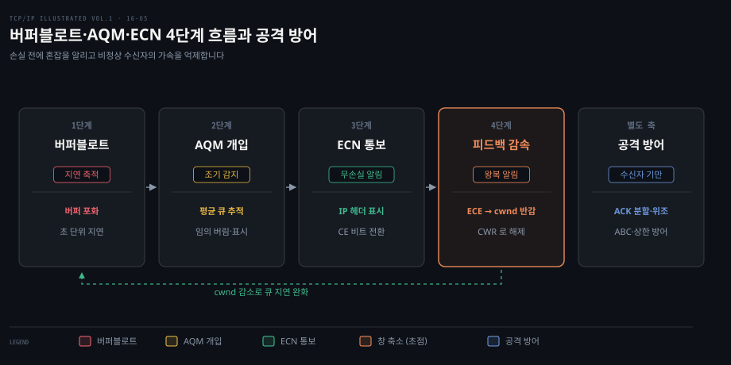
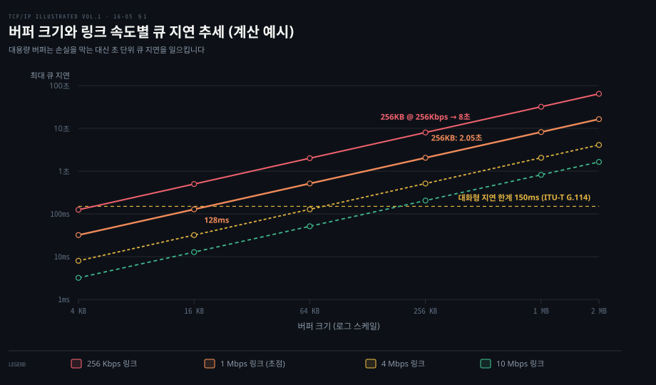
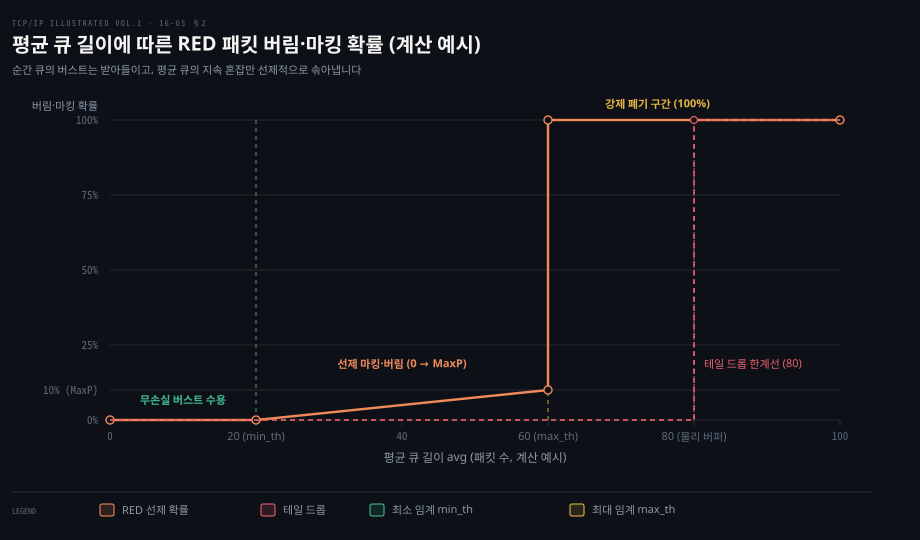
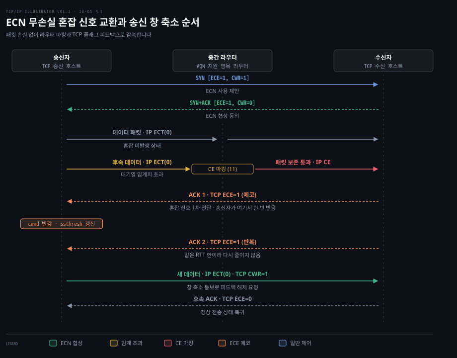
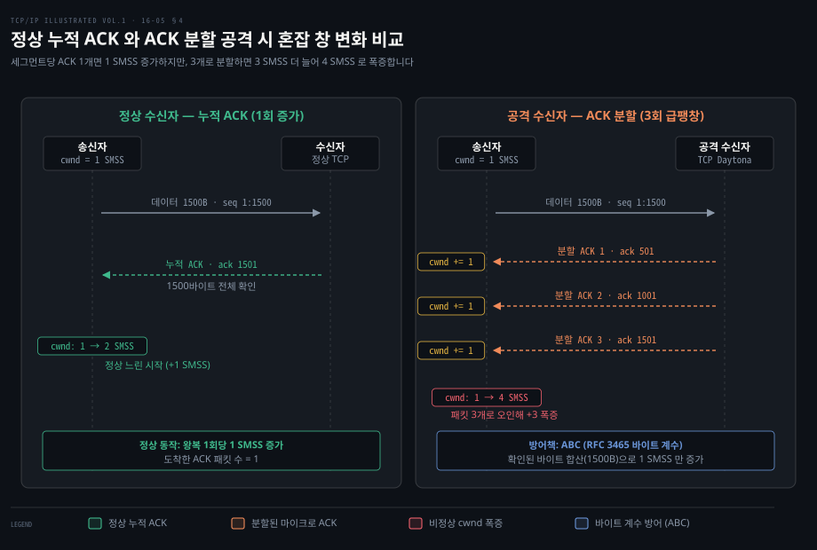

# 큐가 길면 지연이 늘고 AQM 과 ECN 은 손실 전에 혼잡을 알린다

---

> 망 장비의 버퍼가 지나치게 커지면 패킷 손실은 줄어들지만 대기열 지연이 초 단위로 누적되는 버퍼블로트가 발생합니다. 능동 대기열 관리와 명시적 혼잡 통보는 손실 전에 혼잡을 감지해 전송률을 늦추며, 바이트 단위 계수는 ACK 를 쪼개 창을 부풀리는 공격을 막습니다.

## 핵심 요약

> 이 편의 중심 생각은 네트워크 병목에서 패킷을 잃고 나서야 뒤늦게 반응하는 전통적 혼잡 제어의 한계를 극복하기 위해, 라우터가 대기열 상태를 선제적으로 감지하고 패킷 손실 없이 종단 호스트와 명시적으로 신호를 주고받아 지연 폭증을 억제한다는 것입니다.

메모리 가격이 저렴해지면서 상용 라우터와 가정용 게이트웨이에 수 메가바이트 단위의 거대한 패킷 버퍼가 탑재되었습니다. 그러나 전통적인 TCP 가 병목 링크의 버퍼를 가득 채우는 동작을 지속하면, 혼잡의 유일한 지표인 패킷 손실이 몇 초 뒤에야 전달되어 대화형 애플리케이션의 응답성이 파괴됩니다. 이를 해결하기 위해 라우터는 대기열을 사후적으로 비우는 대신 능동적으로 관리하는 AQM 을 도입했고, RED 는 평균 큐 길이를 기반으로 패킷을 선제적으로 솎아내는 기준을 제시했습니다.

ECN 은 한 걸음 더 나아가 패킷을 전혀 버리지 않고도 라우터가 IP 헤더의 2비트를 활용해 혼잡 발생을 알릴 수 있도록 만들었습니다. 수신자는 이 표시를 확인 응답 헤더의 ECE 플래그로 되돌려 보내고, 송신자는 실제 패킷 손실이 일어난 것과 동일하게 혼잡 창을 절반으로 낮춘 뒤 CWR 플래그로 피드백을 종료합니다. 아울러 수신자가 전송 속도를 부당하게 끌어올리기 위해 ACK 시계를 왜곡하는 분할·위조·낙관적 ACK 공격의 원리와, 분할은 바이트 단위 계수로, 위조는 복구 중 미확인 데이터 상한으로 막는 방어까지 함께 살펴봅니다.

버퍼블로트로 인한 지연 누적에서 출발하여 AQM 의 선제 감지, ECN 의 무손실 신호 교환, 송신자 감속으로 이어지는 4단계 흐름과, 별도 축인 악의적 수신자 공격 방어입니다.

## 학습 목표

> 이 편을 읽고 나면 다음을 설명할 수 있습니다.

1. 버퍼블로트 현상의 발생 원인을 링크 대역폭과 버퍼 용량의 관계식으로 도출하고 대화형 트래픽에 미치는 악영향을 설명할 수 있습니다.
2. RED 알고리즘이 순간 큐 길이 대신 평균 큐 길이를 사용하는 이유와 세 가지 핵심 매개변수의 역할을 서술할 수 있습니다.
3. CoDel, PIE, FQ-CoDel 등 현대 AQM 메커니즘의 차이점과 Linux 기본 큐잉 규율의 동작을 설명할 수 있습니다.
4. ECN 의 IP 2비트 및 TCP 플래그를 통한 협상 및 피드백 신호 교환 순서를 추적하고 현대 L4S 및 Linux 설정의 역할을 설명할 수 있습니다.
5. ACK 분할, 중복 ACK 위조, 낙관적 ACK 공격이 혼잡 제어의 어떤 가정을 악용하는지 분석하고 적정 바이트 계수 등의 방어책을 설명할 수 있습니다.

## 1. 버퍼가 클수록 손실 대신 지연이 쌓인다

> 메모리가 풍부한 상용 장비가 패킷을 버리지 않고 무작정 큐에 쌓아두면, 손실 신호 전달이 수 초 동안 지연되어 대화형 통신 품질이 파괴됩니다.

네트워크 장비의 메모리가 부족하면 버퍼 넘침으로 인한 패킷 손실이 잦아집니다. 그렇다면 버퍼를 수 메가바이트 이상으로 넉넉하게 늘리면 전송 신뢰성과 체감 성능이 모두 향상되어야 마땅할 것 같습니다. 그러나 실제 인터넷 환경에서는 반대로 메모리를 무작정 키운 상용 장비 때문에 통신 성능이 극심하게 악화되는 현상이 관측되었습니다. 이 역설적인 문제를 **버퍼블로트**(bufferbloat)라고 부릅니다.

병목 라우터의 큐가 한계까지 찼을 때 패킷이 겪는 최대 큐잉 지연 시간은 버퍼 용량을 링크 대역폭으로 나눈 값과 같습니다.

$$\text{큐잉 지연 시간} = \frac{\text{버퍼 바이트} \times 8}{\text{링크 송출 대역폭}}$$

버퍼 크기는 바이트 단위이고 링크 송출 대역폭은 bps 단위입니다. 가정용 브로드밴드 네트워크 실측 연구에 따르면 케이블과 DSL 의 업로드 대역폭은 대체로 256Kb/s 에서 4Mb/s 사이에 분포합니다. 동시에 시중의 저가형 공유기와 모뎀 장비에는 16KB 에서 256KB 에 달하는 패킷 버퍼가 탑재되어 있었습니다.

이 수치를 공식에 대입해 보면 지연 누적의 심각성이 곧바로 드러납니다. 256Kb/s 업로드 회선에 물린 장비의 256KB 버퍼가 가득 차면 큐를 빠져나가는 데만 무려 8초의 시간이 걸립니다. 대역폭이 1Mb/s 로 올라가더라도 256KB 버퍼는 약 2.05초의 대기열 지연을 유발합니다. 버퍼를 1MB 나 2MB 로 키운 장비에서는 업로드 지연이 수십 초 단위까지 치솟습니다.

국제전기통신연합 G.114 권고에 따르면 음성 통화나 대화형 웹 검색, 온라인 게임 같은 실시간 애플리케이션이 양호한 체감 품질을 유지하려면 단방향 지연이 150ms 이하여야 합니다. 16KB 수준의 작은 버퍼는 1Mb/s 링크에서도 지연이 128ms 에 그쳐 이 기준을 충족하지만 수백 킬로바이트를 넘어서는 순간 150ms 한계선을 아득히 넘어섭니다.

손실 기반 혼잡 제어를 사용하는 표준 TCP 송신자는 병목 큐가 완전히 넘쳐서 패킷이 버려지기 전까지는 혼잡 창을 계속 키웁니다. 대용량 파일 전송이나 백업 작업이 진행 중이라면 병목 링크의 거대한 버퍼는 항상 가득 찬 상태로 유지됩니다. 이때 뒤따라 들어온 웹 요청이나 DNS 질의 패킷은 큐 맨 뒤에 갇혀 수 초 동안 빠져나가지 못합니다. 버퍼의 목적은 일시적 버스트를 완충하는 것인데 실제로는 손실 신호의 도달만 늦추는 거대한 댐으로 변질된 셈입니다.

버퍼블로트의 일반적 원리와 BDP 기반 버퍼 사이징 이론은 [04-02](../cntd_computer-networking-top-down/04-02.줄은%20어디에%20서고%20누가%20먼저%20나가는가.md) 5절에 정리되어 있습니다. 여기서는 큐 지연을 측정하고 계산한 추세를 도식으로 대조합니다.

로그-로그 좌표계에서 버퍼 용량이 16KB 에서 2MB 로 커짐에 따라 링크 속도별 큐잉 지연이 초 단위로 급증하는 양상입니다. 저속 업링크일수록 150ms 대화형 임계선을 조기에 이탈합니다.

## 2. RED 는 평균 큐 길이로 미리 버린다

> 라우터가 큐 포화 상태를 기다리지 않고 평균 큐 길이에 비례해 패킷을 선제적으로 폐기하거나 표시함으로써 전역 동기화와 지연 급증을 억제합니다.

전통적인 인터넷 라우터는 대기열 관리에 소극적이었습니다. 버퍼 공간이 남아 있으면 선입선출 방식으로 큐에 넣고, 공간이 완전히 고갈되면 새로 도착한 패킷을 무조건 버리는 테일 드롭 방식을 취했습니다.

테일 드롭 방식에서는 버퍼가 가득 차는 순간 여러 TCP 연결의 패킷이 동시에 무더기로 폐기됩니다. 그 결과 모든 송신자가 한꺼번에 혼잡 창을 반으로 줄이고 잠시 후 일제히 전송률을 높이는 **전역 동기화**(global synchronization)가 되풀이되어 링크 이용률이 널뛰기를 뜁니다.

이러한 수동적 큐 관리의 한계를 극복하기 위해 라우터가 능동적으로 버퍼와 패킷 전송 일정을 조율하는 기법을 **능동 대기열 관리**(AQM, Active Queue Management)라고 부릅니다. IETF 는 일찍이 RFC 2309 를 거쳐 [RFC 7567](https://www.rfc-editor.org/rfc/rfc7567) 을 통해 인터넷 라우터에 AQM 배포를 강력히 권고했습니다.

대표적 고전 메커니즘이 Floyd 와 Jacobson 이 제안한 RED 게이트웨이입니다. RED 는 패킷이 도착할 때마다 현재 순간 큐 길이가 아니라 시간에 따른 평균 큐 길이를 지수 이동 가중 평균으로 계산합니다.

$$avg \leftarrow (1 - w_q) \times avg + w_q \times q$$

순간 큐 길이를 쓰지 않고 평균 큐 길이를 산출하는 까닭은 트래픽 특성 때문입니다. 단기 버스트가 일시적으로 몰려와 큐가 잠깐 높아진 것은 지속적인 정체가 아니므로 불필요하게 패킷을 버리지 않고 정상 완충해야 합니다. 반면 장기적이고 지속적인 과부하가 닥쳤을 때는 평균 큐 길이가 서서히 상승하므로, 이때를 포착해 선제적으로 신호를 보내기 위함입니다. 가중치 $w_q$ 는 작은 값으로 설정합니다. Floyd·Jacobson(1993) 논문은 0.001 이상을 권하며, ns 시뮬레이터 기본값은 0.002 입니다.

RED 는 세 가지 핵심 매개변수로 동작합니다.

- **최소 임계값**($min_{th}$): 평균 큐 길이가 이 값보다 작으면 아무 패킷도 버리지 않습니다. 일시적 버스트를 흡수하는 구간입니다.
- **최대 임계값**($max_{th}$): 평균 큐 길이가 최소 임계값과 최대 임계값 사이에 위치하면, 패킷을 버리거나 표시할 임시 확률 $p_b$ 를 선형으로 늘립니다.
- **최대 확률**($max_p$): 평균 큐 길이가 최대 임계값에 도달했을 때 적용되는 상한 확률입니다. 1993 논문의 시뮬레이션은 0.02 를 썼고, Floyd 는 이후 0.1 을 권했습니다([RED: Discussions of Setting Parameters](https://www.icir.org/floyd/REDparameters.txt)).

$$p_b = max_p \times \frac{avg - min_{th}}{max_{th} - min_{th}}$$

RED 는 패킷들이 뭉쳐서 폐기되는 현상을 막기 위해 마지막 폐기 이후 통과한 패킷 수를 반영하여 최종 확률 $p = \frac{p_b}{1 - \text{count} \times p_b}$ 로 보정합니다. 만약 평균 큐 길이가 최대 임계값을 초과하면 혼잡이 극심한 상태이므로 패킷을 100% 확률로 폐기하거나 표시하여 테일 드롭으로 이어지는 것을 막습니다. 시스코의 WRED 처럼 IP 패킷의 DSCP 우선순위 값에 따라 서로 다른 $min_{th}$, $max_{th}$ 임계값을 두는 변형도 상용 스위치에 널리 도입되었습니다.

평균 큐 길이가 $min_{th}$ 미만일 때는 손실 없이 버스트를 수용하며 두 임계값 사이에서는 $max_p$ 까지 선형으로 확률을 높입니다. $max_{th}$ 를 초과하면 강제 폐기로 전환하여 테일 드롭을 방지합니다.

그러나 RED 는 대역폭과 왕복 시간에 따라 매개변수들을 정밀하게 튜닝하기가 까다롭다는 약점을 안고 있었습니다. 이에 따라 현대 네트워크에서는 큐의 바이트 수가 아니라 지연 시간 자체를 직접 다루는 차세대 AQM 이 표준화되었습니다.

- **CoDel**(Controlled Delay, [RFC 8289](https://www.rfc-editor.org/rfc/rfc8289)): 큐에 쌓인 패킷 수 대신 패킷이 버퍼에 머문 체류 시간의 최소치를 추적합니다. 체류 시간이 목표치 5ms 를 100ms 이상 지속적으로 초과하면 정체된 큐로 판단하고 패킷 폐기 간격을 좁혀갑니다.
- **PIE**(Proportional Integral controller Enhanced, [RFC 8033](https://www.rfc-editor.org/rfc/rfc8033)): 제어공학의 비례-적분 제어기를 차용하여 현재 큐잉 지연과 지연의 변화율을 기반으로 패킷 폐기 확률을 주기적으로 재산출합니다. 케이블 모뎀 표준인 DOCSIS 3.1 에 기본 AQM 으로 채택되었습니다.
- **FQ-CoDel**([RFC 8290](https://www.rfc-editor.org/rfc/rfc8290)): 플로우별 해시 분리와 CoDel 알고리즘을 결합했습니다. 대용량 다운로드 플로우와 단기 대화형 플로우가 서로 다른 큐에 담기므로 대용량 트래픽이 큐를 채우더라도 웹과 게임 패킷은 빈 큐를 통해 지연 없이 즉시 통과합니다.

커널 기본값은 pfifo_fast 이며, systemd 기반 배포판은 `net.core.default_qdisc = fq_codel` 로 바꿉니다([net.rst](https://github.com/torvalds/linux/blob/master/Documentation/admin-guide/sysctl/net.rst), [50-default.conf](https://github.com/systemd/systemd/blob/main/sysctl.d/50-default.conf)). 이는 호스트 자신의 송신 큐에서 버퍼블로트를 억제합니다.

## 3. ECN 은 버리지 않고 표시해 송신자를 늦춘다

> 중간 라우터가 IP 헤더에 혼잡 발생을 마킹하고 수신자가 이를 TCP ACK 로 에코하면, 패킷 손실 없이 송신자의 혼잡 창을 절반으로 감속시킵니다.

패킷을 선제적으로 폐기하여 대기열 지연을 억제하더라도, 패킷 손실 방식은 재전송 오버헤드와 애플리케이션 지연을 완전히 피하지 못합니다. 패킷 손실이 발생하면 수신 측 애플리케이션은 누락된 세그먼트가 다시 올 때까지 대기해야 하므로 지연이 발생합니다. 패킷을 버리지 않고도 네트워크 혼잡 상태를 송신자에게 전달할 수는 없을까요? 이 문제를 해결하기 위해 도입된 기법이 [RFC 3168](https://www.rfc-editor.org/rfc/rfc3168) 에 정의된 **명시적 혼잡 통보**(ECN, Explicit Congestion Notification)입니다.

ECN 은 IP 계층과 TCP 계층의 협력으로 작동합니다. IP 헤더 2비트의 네 상태 정의와 전이 모델은 [03-05](../cntd_computer-networking-top-down/03-05.혼잡을%20어떻게%20다스리는가.md) 4절에 정리되어 있습니다. 현대 명세에서는 ECT(1) 코드포인트가 L4S 전용 식별자로 쓰이며, 여기서는 끝점 간의 협상 및 신호 교환 절차에 집중합니다.

TCP 헤더 플래그 필드에서는 8번 비트와 9번 비트가 배정되었습니다.

- **ECE**(ECN-Echo): 수신자가 CE 가 표시된 IP 패킷을 받았음을 송신자에게 알리는 피드백 플래그
- **CWR**(Congestion Window Reduced): 송신자가 ECE 를 수신하고 혼잡 창을 줄였음을 수신자에게 알리는 해제 플래그

연결 수립 단계에서 양 끝점은 [RFC 3168 §6.1.1](https://www.rfc-editor.org/rfc/rfc3168) 에 따라 3방향 핸드셰이크의 처음 두 패킷으로 ECN 지원 여부를 협상합니다. 클라이언트는 SYN 패킷에 ECE 와 CWR 비트를 모두 1로 켠 ECN-setup SYN 으로 ECN 사용을 제안합니다. 서버가 ECN 을 지원한다면 SYN+ACK 패킷에 ECE 비트만 켜고 CWR 은 끈 ECN-setup SYN-ACK 로 화답합니다. 클라이언트가 이 패킷을 받으면 협상이 끝납니다.

데이터가 흐를 때 송신자는 IP 헤더에 ECT(0)을 실어 내보냅니다. 지속적인 대기열 증가를 감지한 AQM 라우터는 패킷을 버리지 않고 IP 헤더의 ECN 비트만 CE 로 덮어쓴 뒤 그대로 전달합니다.

CE 마킹 패킷을 전달받은 수신자는 혼잡을 송신자에게 되돌려줄 의무가 있습니다. 수신자는 이후 송신자에게 회신하는 모든 ACK 세그먼트에 ECE 플래그를 1로 켜서 전송합니다.

수신자가 ECE 플래그를 한 번만 보내지 않고 매 ACK 마다 반복해서 켜는 까닭은 TCP ACK 의 비신뢰성 때문입니다. 순수 ACK 패킷은 유실되어도 재전송되지 않으므로, 단 한 번만 보낸 ECE 신호가 도중에 사라지면 송신자는 망의 정체 상태를 전혀 알지 못하게 됩니다. 따라서 송신자가 감속 조치를 취했다는 명시적 답을 줄 때까지 수신자는 ECE 를 계속 유지합니다.

ECE 플래그가 켜진 ACK 를 받은 송신자는 패킷 유실을 감지했을 때와 동일하게 혼잡 창과 느린 시작 임계값을 절반으로 낮춥니다. 단, 패킷 자체가 사라진 것은 아니므로 빠른 재전송은 실행하지 않습니다.

송신자는 동일한 왕복 시간 안에 도착한 여러 ECE 에 대해 창을 거듭 줄이지 않고 1회만 반응합니다. 창을 축소한 송신자는 수신자에게 이를 알리기 위해 새로 보내는 데이터 패킷에 CWR 플래그를 1로 설정합니다. 수신자가 CWR 패킷을 받으면 비로소 다음 ACK 부터 ECE 플래그를 끄고 정상 통신으로 복귀합니다.

송신자, 라우터, 수신자 3자 간의 ECN 협상과 CE 마킹, ECE 반복 피드백, cwnd 축소 및 CWR 통보로 이어지는 전체 상호작용 순서입니다.

ECN 의 기본 신호 규약은 [03-05](../cntd_computer-networking-top-down/03-05.혼잡을%20어떻게%20다스리는가.md) 4절과 [10-02](../systems-performance/10-02.네트워크%20—%20아키텍처.md) 1절에도 정리되어 있습니다. 최근 RFC 들에서는 ECN 의 활용 반경이 한층 넓어졌습니다.

- **DCTCP**(Data Center TCP, [RFC 8257](https://www.rfc-editor.org/rfc/rfc8257)): 데이터센터 스위치의 얕은 버퍼에서 즉시 CE 를 마킹하고, 수신자가 매 패킷마다 정밀하게 피드백을 전달하여 송신자가 마킹 비율에 비례해 cwnd 를 유연하게 조절합니다.
- **L4S**(Low Latency, Low Loss, and Scalable Throughput, [RFC 9330](https://www.rfc-editor.org/rfc/rfc9330)): 표준 트랙 [RFC 8311](https://www.rfc-editor.org/rfc/rfc8311) 로 제약을 풀고 [RFC 9331](https://www.rfc-editor.org/rfc/rfc9331) 이 ECT(1) 을 식별자로 정했습니다. 얕은 표시 임계로 큐 지연과 손실을 크게 줄입니다.
- **Linux 커널의 tcp_ecn 매개변수**([ip-sysctl.rst](https://github.com/torvalds/linux/blob/master/Documentation/networking/ip-sysctl.rst)):
  - `0`: 비활성화
  - `1`: 나가는 연결에서 ECN 을 요청하고 들어오는 요청도 받음
  - `2` (현대 Linux 기본값): 들어오는 요청만 ECN 으로 수락하고 나가는 연결에서는 요청하지 않음
  - `3`~`5`: 정확한 수치 피드백을 제공하는 AccECN 변형 모드 지원

## 4. 수신자가 ACK 를 속이면 송신자가 빨라진다

> 수신자가 확인 응답 패킷을 잘게 쪼개거나 가짜 중복 ACK 를 쏟아부으면, 송신자의 패킷 도착 기반 혼잡 제어 가정이 무너져 전송 창이 비정상적으로 폭증합니다.

TCP 혼잡 제어는 수신자가 네트워크 상태와 수신 바이트를 정직하게 보고한다는 전제에 의존하지만, 이 가정은 악의적인 수신자 앞에서 쉽게 무너집니다. 수신자가 자신의 전송률을 부당하게 끌어올리기 위해 확인 응답을 조작하면, 송신자는 망의 상태를 오판하여 감속하지 못하고 데이터를 과도하게 밀어 넣게 됩니다. 수신자가 ACK 메커니즘을 속이면 혼잡 제어의 안전장치가 어떻게 무력화될까요?

과거에 존재했던 대표적인 혼잡 제어 취약점은 ICMP Source Quench 메시지였습니다. RFC 1122 는 호스트가 Source Quench 를 수신하면 반드시 TCP 전송 속도를 낮추어야 한다고 규정했습니다. 악의적 공격자는 IP 출발지를 위조하여 표적 호스트에 가짜 Source Quench 를 전송함으로써 연결을 손쉽게 마비시킬 수 있었습니다. 이에 따라 [RFC 1812](https://www.rfc-editor.org/rfc/rfc1812) 가 라우터의 Source Quench 생성을 권장하지 않게 했고(SHOULD NOT), [RFC 6633](https://www.rfc-editor.org/rfc/rfc6633) 이 호스트가 받으면 조용히 버리도록(MUST silently discard) 정하여 완전히 폐기되었습니다.

더 정교한 위협은 Savage 등이 TCP Daytona 변형을 통해 실증한 **비정상 수신자**(misbehaving receiver) 공격입니다. 클라이언트가 웹 서버로부터 경쟁자보다 훨씬 빠르게 데이터를 내려받기 위해 송신자의 혼잡 제어 가정을 악용하는 세 가지 공격 기법이 알려져 있습니다.

### 1. ACK 분할 공격 (ACK Division)

전통적인 TCP 규격은 느린 시작 단계에서 ACK 패킷이 도착할 때마다 혼잡 창을 1 SMSS 씩 기계적으로 증가시켰습니다. 즉 ACK 필드가 몇 바이트를 확인해 주었는지가 아니라, "ACK 패킷 1개가 망을 빠져나와 도착했다"는 사건 자체에 반응한 것입니다.

공격 수신자는 1500바이트 크기의 세그먼트 하나를 수신한 뒤, 이에 대해 정상적인 단일 누적 ACK 를 보내는 대신 500바이트 범위를 가리키는 ACK 세 개로 쪼개어 연달아 회신합니다. 송신자는 세 개의 독립적인 ACK 패킷이 도착한 것으로 인식하여 단 한 번의 왕복 시간 동안 혼잡 창을 3 SMSS 늘려 1 에서 4 SMSS 로 키웁니다. 세그먼트 하나를 바이트 단위까지 잘게 나누면 ACK 수만큼 cwnd 가 늘어납니다.

이 공격의 정석적인 방어 수단은 [RFC 3465](https://www.rfc-editor.org/rfc/rfc3465) 의 적정 바이트 계수(ABC)입니다. 송신자가 패킷 도착 건수가 아니라 확인된 실제 데이터 바이트 수를 누적 계산하여 혼잡 창을 올립니다. 현재 Linux 는 [tcp_cong.c](https://github.com/torvalds/linux/blob/master/net/ipv4/tcp_cong.c) 처럼 완전히 확인된 세그먼트 수인 acked 만큼만 cwnd 를 늘리므로 한 세그먼트를 쪼갠 ACK 들은 창을 키우지 못합니다.

동일한 1500바이트 세그먼트에 대해 정상 수신자는 창을 1 SMSS 늘리는 반면, 3개로 나눈 ACK 는 창을 3 SMSS 늘려 1 에서 4 SMSS 로 만듭니다.

### 2. 중복 ACK 위조 공격 (DupACK Spoofing)

Reno 계열의 빠른 회복 메커니즘은 중복 ACK 가 도착할 때마다 1개의 패킷이 네트워크를 빠져나가 수신 버퍼에 도달했다고 가정하고 혼잡 창을 1 SMSS 씩 임시로 부풀립니다.

공격 수신자는 경미한 패킷 손실이나 순서 바뀜이 발생했을 때, 실제로 데이터가 오지 않았음에도 불구하고 수십에서 수백 개의 위조된 중복 ACK 를 즉시 생성하여 송신자에게 폭격하듯 퍼붓습니다. 송신자는 빠른 회복 중에 창이 천문학적으로 팽창하여 방대한 양의 새 데이터를 한꺼번에 쏟아붓게 됩니다.

이 공격은 송신자가 복구 중 내보낼 미확인 데이터 양에 상한을 두어 방어하며, 근본적으로는 중복 ACK 를 보낸 세그먼트와 짝지을 넌스가 필요합니다. 타임스탬프 옵션은 연결마다 끌 수 있어 확실한 방어가 되지 못합니다. 빠른 회복 중 전송량 조절은 [16-02](./16-02.복구%20중%20혼잡%20창은%20NewReno·SACK·제한%20전송이%20다듬고%20헛%20RTO%20는%20되돌린다.md) 및 [RFC 9937](https://www.rfc-editor.org/rfc/rfc9937) 을 참조합니다.

### 3. 낙관적 ACK 공격 (Optimistic ACKing)

TCP 는 수신자가 패킷을 실제로 받은 뒤에만 ACK 를 보낸다고 믿으며, 그 왕복 시간으로 망의 전송 지연을 측정합니다.

공격 수신자는 패킷이 병목 링크를 통과하기도 전에, 심지어 송신자가 패킷을 막 내보낸 직후에 다음 기대 순서 번호를 추측하여 가짜 ACK 를 앞질러 회신합니다. 송신자는 왕복 지연이 거의 0 에 가깝다고 착각하여 ACK 시계를 광속으로 회전시키며 혼잡 창을 한계치까지 확장합니다. 누락된 데이터는 상위 계층인 HTTP 범위 요청 등으로 재요청하여 벌충합니다.

이 공격을 방어하려면 송신자가 전송하는 세그먼트의 크기를 무작위로 불규칙하게 섞어 수신자가 다음 순서 번호를 정확히 예측하지 못하게 만들거나, 누적 넌스를 부여해 헤더 합산 검증을 통과하지 못한 조기 ACK 를 폐기해야 합니다.

## 면접 대비

1. 대용량 패킷 버퍼를 장착한 라우터가 도리어 네트워크 성능을 떨어뜨리는 버퍼블로트의 기저 원인과, 이를 유발하는 전통적 손실 기반 TCP 의 구조적 한계를 설명해 주십시오.
2. 능동 대기열 관리의 대표 알고리즘인 RED 가 순간 큐 길이가 아닌 지수 이동 가중 평균 큐 길이를 기준으로 패킷을 폐기·마킹하는 이유와 핵심 매개변수 3가지의 역할을 설명해 주십시오.
3. CoDel 과 PIE 알고리즘이 기존 RED 의 한계를 극복하기 위해 패킷 대기열 크기가 아닌 어떤 물리량을 측정 기준으로 삼았는지 비교하고, FQ-CoDel 의 격리 원리를 설명해 주십시오.
4. 명시적 혼잡 통보에서 3방향 핸드셰이크를 통한 기능 협상 과정과, 지속적 혼잡 발생 시 라우터-수신자-송신자 간에 플래그 교환 순서를 단계별로 서술해 주십시오.
5. 비정상 수신자가 수행하는 ACK 분할 공격의 메커니즘을 송신자 혼잡 제어의 가정 측면에서 분석하고, 이를 방어하기 위한 적정 바이트 계수의 동작 원리를 설명해 주십시오.

## 정답 (자답 후 펼치기)

### 정답 1 — 대역폭 대비 과도한 버퍼링과 손실 지연 피드백 루프

버퍼블로트는 라우터나 게이트웨이에 회선 대역폭에 비해 지나치게 큰 버퍼가 탑재되어, 병목 링크가 포화되었을 때 수 초에 달하는 대기열 지연이 누적되는 현상입니다.

전통적인 TCP 혼잡 제어는 패킷 손실을 혼잡의 유일한 지표로 간주합니다. 송신자는 손실이 발생할 때까지 혼잡 창을 계속해서 키우므로 병목 링크의 버퍼는 지속적으로 가득 찬 상태를 유지합니다.

큐잉 지연 시간은 버퍼 용량을 링크 대역폭으로 나눈 값에 비례합니다. 256Kb/s 회선에서 256KB 버퍼가 포화되면 8초 동안 패킷이 갇히게 됩니다. 이로 인해 송신자에게 혼잡 신호가 도달하는 시간 자체가 수 초 뒤로 밀려나 피드백 루프가 마비되고, 대화형 트래픽의 지연 허용 한계선인 150ms 를 크게 초과하여 서비스가 불능에 빠집니다.

### 정답 2 — 일시적 버스트 수용과 조기 솎아내기

단기적인 트래픽 버스트는 병목 링크가 구조적 정체에 빠지지 않았더라도 순간적으로 큐를 채울 수 있습니다. 순간 큐 길이를 기준으로 삼으면 이러한 일시적 버스트마다 패킷을 버려 불필요한 처리량 저하를 낳습니다.

RED 는 지수 이동 가중 평균을 산출함으로써 일시적 버스트는 손실 없이 통과시키고, 장기적이고 지속적인 혼잡으로 평균 큐가 상승할 때만 선제적으로 개입합니다.

- **$min_{th}$ (최소 임계값)**: 평균 큐가 이 값보다 작으면 폐기 확률이 0 이며, 버스트를 안전하게 수용합니다.
- **$max_{th}$ (최대 임계값)**: 평균 큐가 최소와 최대 임계값 사이에 머물면 확률 $p$ 를 0 에서 $max_p$ 까지 선형 증가시켜 패킷을 무작위로 솎아냅니다.
- **$max_p$ (최대 확률)**: 임계값 도달 시의 기준 확률이며, 평균 큐가 최대 임계값을 넘어서면 전량 폐기로 전환하여 버퍼 완전 고갈과 테일 드롭 전역 동기화를 막습니다.

### 정답 3 — 체류 시간 기반 직접 제어와 플로우 공정 격리

RED 는 큐의 패킷 개수를 기준으로 삼았기 때문에 대역폭과 왕복 시간에 따라 매개변수 튜닝이 까다로웠습니다.

- **CoDel**: 패킷 수가 아닌 패킷이 버퍼에 머문 **체류 시간**(sojourn time)을 직접 측정합니다. 100ms 측정 구간 동안 최소 체류 시간이 목표치 5ms 를 지속적으로 넘으면 큐에 지속적 정체가 발생한 것으로 판정하고 패킷을 드롭합니다.
- **PIE**: 제어공학의 비례-적분 제어기를 차용하여 현재 큐잉 지연과 지연의 변화 속도를 종합해 드롭 확률을 주기적으로 갱신합니다.
- **FQ-CoDel**: 위 지연 제어 알고리즘에 **공정 큐잉**(Fair Queueing)을 결합했습니다. 트래픽 플로우를 5-tuple 해시로 서로 다른 독립 큐로 분리하여 스케줄링합니다. 대용량 다운로드 플로우가 특정 큐를 채우더라도, 단기 대화형 패킷은 비어 있는 별도 큐에 배정되어 지연 없이 즉시 전송됩니다.

### 정답 4 — 협상, 무손실 마킹, 신뢰성 있는 에코 및 CWR 해제

ECN 은 패킷 손실 없이 종단 간에 혼잡 상태를 알리는 기제이며 다음 순서로 동작합니다.

1. **핸드셰이크 협상**: 클라이언트가 SYN 에 `ECE=1, CWR=1` 을 설정하여 제안하고, 서버가 SYN+ACK 에 `ECE=1, CWR=0` 으로 응답하여 기능 사용에 합의합니다.
2. **데이터 송출 및 CE 마킹**: 송신자는 IP 헤더에 `ECT(0)` 을 켜서 패킷을 보냅니다. 지속적 정체를 겪는 AQM 라우터는 패킷을 버리지 않고 IP 헤더를 `CE` 로 변경하여 수신자에게 넘깁니다.
3. **수신자 ECE 반복 에코**: CE 를 관측한 수신자는 이후 송신자에게 보내는 모든 ACK 헤더에 `ECE=1` 플래그를 실어 보냅니다. ACK 유실로 신호가 증발하는 것을 막기 위해 감속 통보가 올 때까지 매 ACK 마다 반복합니다.
4. **송신자 감속 및 CWR 통보**: 송신자는 ECE 수신 시 손실과 동일하게 cwnd 와 ssthresh 를 절반으로 줄입니다. 동일 RTT 당 1회만 반응하며, 감속 후 새 데이터 패킷에 `CWR=1` 플래그를 설정하여 보냅니다.
5. **ECE 종료**: 수신자는 CWR 패킷을 수신한 뒤 다음 ACK 부터 `ECE=0` 으로 되돌려 정상 상태로 복귀합니다.

### 정답 5 — 패킷 도착 기반 가정 악용과 바이트 단위 회계 방어

전통적인 TCP 느린 시작 알고리즘은 ACK 가 확인한 데이터의 양과 무관하게, "ACK 패킷 1개가 도착했다"는 사건 자체에 반응하여 혼잡 창을 1 SMSS 씩 올렸습니다.

ACK 분할 공격은 이 허점을 찔러 수신자가 1개의 세그먼트를 받은 뒤 이를 500바이트씩 3개의 독립된 ACK 로 쪼개어 보냅니다. 송신자는 패킷 3개가 도착한 것으로 오인하여 한 왕복 만에 cwnd 를 3 SMSS 늘려 1 에서 4 SMSS 로 폭증시키며 망의 수용량을 가로챕니다.

**적정 바이트 계수**(ABC, RFC 3465)는 혼잡 창 증가 기준을 패킷 도착 횟수가 아닌 수신자가 확인해 준 **실제 바이트 수**로 전환합니다. 쪼개진 ACK 가 오더라도 확인된 바이트의 누적 총합이 1 SMSS 에 도달할 때까지는 창을 1 SMSS 이상 늘리지 않으므로, 패킷 분할 트릭을 원천적으로 무력화합니다.

## 참고 자료

- Kevin R. Fall, W. Richard Stevens, 《TCP/IP Illustrated, Volume 1: The Protocols》 2nd ed., Addison-Wesley, 2011, Chapter 16, §16.10–16.13.
- [RFC 3168: The Addition of Explicit Congestion Notification (ECN) to IP](https://www.rfc-editor.org/rfc/rfc3168) — IP 및 TCP 헤더를 통한 ECN 명세.
- [RFC 7567: IETF Recommendations on Active Queue Management](https://www.rfc-editor.org/rfc/rfc7567) — RFC 2309 를 대체한 현대 AQM 권고안.
- [RFC 8289: Controlled Delay Active Queue Management (CoDel)](https://www.rfc-editor.org/rfc/rfc8289) — 체류 시간 기반 AQM 표준.
- [RFC 8290: The Flow Queue CoDel Packet Scheduler (FQ-CoDel)](https://www.rfc-editor.org/rfc/rfc8290) — 플로우 공정 분리와 CoDel 결합 규격.
- [RFC 8033: Proportional Integral Controller Enhanced (PIE) AQM](https://www.rfc-editor.org/rfc/rfc8033) — 제어이론 기반 DOCSIS 3.1 채택 AQM.
- [RFC 8311: Relaxing Restrictions on Explicit Congestion Notification (ECN) Experimentation](https://www.rfc-editor.org/rfc/rfc8311) — ECN 제약 완화.
- [RFC 9330: Low Latency, Low Loss, and Scalable Throughput (L4S) Architecture](https://www.rfc-editor.org/rfc/rfc9330) — 차세대 초저지연 L4S 아키텍처.
- [RFC 9331: The Explicit Congestion Notification (ECN) Protocol for Low Latency, Low Loss, and Scalable Throughput (L4S)](https://www.rfc-editor.org/rfc/rfc9331) — L4S 프로토콜 규격.
- [RFC 9332: Dual-Queue Coupled Active Queue Management (AQM) for Low Latency, Low Loss, and Scalable Throughput (L4S)](https://www.rfc-editor.org/rfc/rfc9332) — 결합 대기열 AQM 규격.
- [RFC 6633: Deprecation of ICMP Source Quench Messages](https://www.rfc-editor.org/rfc/rfc6633) — ICMP Source Quench 공식 폐기.
- [RFC 3465: TCP Congestion Control with Appropriate Byte Counting (ABC)](https://www.rfc-editor.org/rfc/rfc3465) — 바이트 단위 계산을 통한 ACK 분할 공격 방어.
- [RFC 9937 — Proportional Rate Reduction (PRR)](https://www.rfc-editor.org/rfc/rfc9937) — 빠른 회복 중 전송량 조절(RFC 6937 대체).
- [Linux 커널 문서 Documentation/networking/ip-sysctl.rst](https://github.com/torvalds/linux/blob/master/Documentation/networking/ip-sysctl.rst) — `net.ipv4.tcp_ecn` 설정 정의.
- [Linux 커널 문서 Documentation/admin-guide/sysctl/net.rst](https://github.com/torvalds/linux/blob/master/Documentation/admin-guide/sysctl/net.rst) — default_qdisc 와 pfifo_fast 기본값.
- [systemd sysctl.d/50-default.conf](https://github.com/systemd/systemd/blob/main/sysctl.d/50-default.conf) — 배포판 수준의 net.core.default_qdisc = fq_codel 설정.
- [RED: Discussions of Setting Parameters](https://www.icir.org/floyd/REDparameters.txt) — Sally Floyd, 1997, w_q·max_p 권고.
- Sally Floyd, Van Jacobson, "Random Early Detection Gateways for Congestion Avoidance", IEEE/ACM Transactions on Networking, 1(4), August 1993.
- Stefan Savage et al., "TCP Congestion Control with a Misbehaving Receiver", ACM CCR, 1999 (TCP Daytona).

## 관련 문서

- [16-01.혼잡 창은 느린 시작으로 키우고 혼잡 회피로 다듬는다](./16-01.혼잡%20창은%20느린%20시작으로%20키우고%20혼잡%20회피로%20다듬는다.md) — 손실 기반 혼잡 제어의 기본 원리와 느린 시작·혼잡 회피.
- [16-02.복구 중 혼잡 창은 NewReno·SACK·제한 전송이 다듬고 헛 RTO 는 되돌린다](./16-02.복구%20중%20혼잡%20창은%20NewReno·SACK·제한%20전송이%20다듬고%20헛%20RTO%20는%20되돌린다.md) — 빠른 재전송과 빠른 회복, SACK 기반 파이프 복구와 PRR.
- [04-02.줄은 어디에 서고 누가 먼저 나가는가](../cntd_computer-networking-top-down/04-02.줄은%20어디에%20서고%20누가%20먼저%20나가는가.md) — 입력·출력 포트 큐잉, 버퍼블로트와 BDP 기반 버퍼 사이징 원리.
- [03-05.혼잡을 어떻게 다스리는가](../cntd_computer-networking-top-down/03-05.혼잡을%20어떻게%20다스리는가.md) — 혼잡 제어 원리와 Classic TCP, ECN 2비트 4상태 전이 모델.
- [10-02.네트워크 — 아키텍처](../systems-performance/10-02.네트워크%20—%20아키텍처.md) — 시스템 관점의 네트워크 아키텍처, DCTCP 및 DSCP/ECN 연계.
