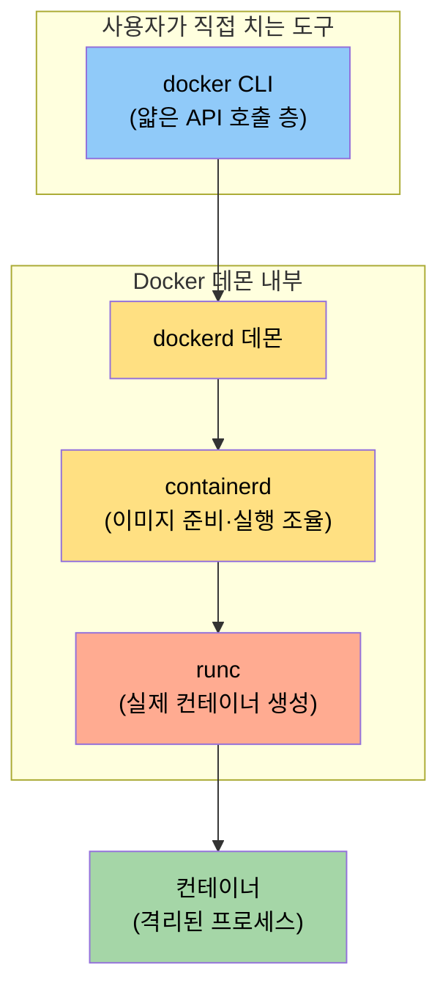
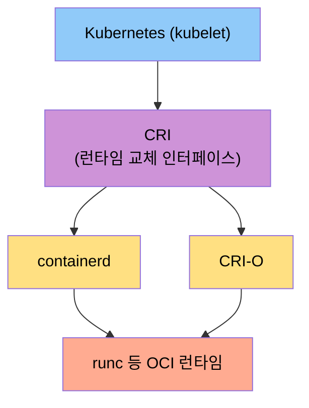
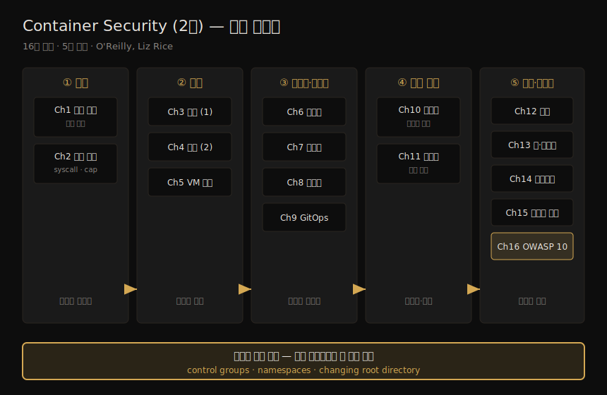

# Container Security (2판) — 책 개요와 학습 로드맵
---
> 이 책은 컨테이너가 리눅스 커널 기능의 조합으로 어떻게 만들어지는지를 파고들어, 그 위에서 보안 위험을 스스로 판단할 수 있는 멘탈 모델을 길러 주는 책입니다. control groups·namespaces·root 디렉토리 변경이라는 세 기둥에서 출발해 이미지·공급망·런타임·통신까지 16개 챕터로 올라갑니다. 이 노트는 각 챕터 본문에 들어가기 전, 책 전체가 어디로 향하는지를 먼저 잡아 두는 지도입니다.

컨테이너 보안 자료는 "이렇게 설정하라"는 단계별 매뉴얼이 흔합니다. 저자 Liz Rice는 그 방식을 일부러 피합니다. 모든 애플리케이션·환경·조직에 두루 들어맞는 단일 정답은 없다고 보기 때문입니다. 그래서 이 책은 "무엇을 하라(what)"가 아니라 **"왜 그렇게 동작하는가(why)"** 에 무게를 둡니다. 컨테이너가 내부에서 어떻게 만들어지고 어떻게 통신하는지를 이해하면, 내 환경의 위험을 내가 직접 평가할 수 있다는 전제입니다.

이 첫 노트의 목적은 단 하나입니다. 뒤따라올 챕터별 학습 노트를 읽기 전에, **16개 챕터가 어떤 큰 줄기로 묶이는지**와 **컨테이너를 떠받치는 기초 메커니즘**을 머릿속에 넣어 두는 것입니다. 그래야 개별 주제(예: seccomp, 이미지 스캔)가 전체에서 어디쯤 위치하는지 알고 읽을 수 있습니다.

## 1. 이 책이 답하려는 질문

> 운영·보안·DevOps·개발자 각자의 자리에서 던지는 "내 컨테이너 배포는 안전한가?"가 출발점입니다. 답을 외우는 책이 아니라, 답을 스스로 내릴 수 있는 사고틀을 주는 책입니다.

조직들이 확장성과 회복력을 얻으려고 컨테이너와 오케스트레이션으로 옮겨 가면서, 보안 질문도 자리마다 다른 모습으로 나타납니다. 운영·보안·DevOps 팀이라면 "우리가 구성한 이 배포가 안전한지 어떻게 아는가"를 묻습니다. 전통적인 서버·VM 보안 경험이 있는 보안 전문가라면 "기존 지식을 컨테이너 환경에 어떻게 옮겨 적용하는가"를 고민합니다. 개발자라면 "컨테이너화한 내 애플리케이션을 더 안전하게 만들려면 무엇을 생각해야 하는가"를 묻습니다.

이 책은 그 질문들에 직접 답을 주는 대신, 답을 만들 재료를 줍니다. 컨테이너를 배포할 때 내부에서 무슨 일이 벌어지는지 이해시키고, 위험을 키우는 나쁜 관행에 빠지지 않도록 돕는 쪽입니다. 저자가 머리말에서 분명히 선을 긋는 부분이기도 합니다. 한 권의 "보안 설정 설명서"를 기대한 독자에게는 이 책이 맞지 않을 수 있습니다.

이 책의 독자상은 분명합니다. 직함이 개발자든 보안 담당자든 운영자든 관리자든, **동작 원리를 파고드는 것을 즐기고 리눅스 터미널에서 시간 보내는 것을 좋아하는** 사람에게 맞습니다. 컨테이너에 어느 정도 익숙하고 Docker나 Kubernetes를 한 번쯤 만져 봤다는 정도를 전제하지만, 내부 동작까지 알 필요는 없습니다. 그 내부가 바로 이 책이 채워 줄 내용이기 때문입니다.

## 2. application container와 system container

> 이 책이 다루는 대상은 "애플리케이션 컨테이너"입니다. 전체 리눅스 배포판을 VM처럼 돌리는 "시스템 컨테이너"와는 운영 철학이 다르지만, 둘을 만드는 기초 메커니즘은 같습니다.

컨테이너라는 한 단어 안에 성격이 다른 두 갈래가 있습니다. 이 차이를 먼저 잡아야 뒤에 나올 "프로덕션에서 SSH 금기" 같은 권고가 왜 나오는지 이해됩니다.

**애플리케이션 컨테이너(application container)** 는 Kubernetes·Docker 같은 시스템에서 비즈니스 애플리케이션을 돌리는 데 쓰입니다. 애플리케이션 실행에 꼭 필요한 만큼의 최소 코드만 담은 **불변(immutable) 컨테이너**를 권장합니다. 이 책이 다루는 주된 대상이 바로 이쪽입니다.

**시스템 컨테이너(system container)** 는 Linux Containers 프로젝트의 LXC·LXD가 대표적입니다. 전체 리눅스 배포판을 통째로 돌리며 가상 머신에 가깝게 다룹니다. 그래서 시스템 컨테이너에 SSH로 접속하는 것은 지극히 정상으로 여겨집니다.

이 구분이 보안에서 갈리는 지점은 SSH 접근입니다. 프로덕션의 애플리케이션 컨테이너에 SSH로 들어가려 하면 보안 전문가들이 의아한 눈으로 봅니다(그 이유는 책 본문에서 다룹니다). 컨테이너를 "최소·불변"으로 두는 철학과, 살아 있는 컨테이너에 손을 넣어 바꾸는 행위가 정면으로 부딪치기 때문입니다.

> 두 갈래는 운영 방식이 달라도 토대는 같습니다. 애플리케이션 컨테이너든 시스템 컨테이너든, 만드는 데 쓰는 기본 메커니즘은 control groups·namespaces·root 디렉토리 변경입니다. 그래서 이 책으로 다진 기초는 두 진영의 접근 차이를 살펴볼 때도 든든한 출발점이 됩니다.

## 3. 컨테이너는 리눅스 커널 기능의 조합

> 컨테이너는 마법이 아니라 리눅스 커널 기능 몇 가지를 묶은 결과물입니다. 그래서 컨테이너 보안은 리눅스 호스트를 지키는 메커니즘을 거의 그대로 적용하는 일입니다.

이 책의 출발선이자 가장 중요한 전제입니다. 컨테이너는 **리눅스 커널의 기능을 조합해서** 만들어집니다. 핵심 재료는 세 가지입니다. **control groups(cgroups)** 로 자원을 제한하고, **namespaces** 로 프로세스가 보는 세계를 격리하며, **root 디렉토리 변경**으로 파일시스템 시야를 가둡니다. 이 책의 Chapter 3·4가 이 구성 요소를 직접 해부하며, 컨테이너가 실제로 무엇이고 서로 얼마나 격리되어 있는지를 보여 줍니다.

여기서 보안 관점의 결론이 자연스럽게 따라옵니다. 컨테이너를 지키는 일은 리눅스 호스트(이 책은 VM과 베어메탈 서버를 묶어 "호스트"라 부릅니다)를 지킬 때 쓰는 메커니즘을 상당 부분 그대로 쓰는 일입니다. 그래서 이 책은 각 메커니즘이 호스트에서 어떻게 동작하는지 먼저 설명하고, 그것이 컨테이너에 어떻게 적용되는지를 보여 주는 순서를 택합니다. 숙련된 시스템 관리자라면 일부 절을 건너뛰고 컨테이너 고유 정보로 바로 갈 수 있습니다.

초판이 나온 2020년 이후 5년 사이에 컨테이너 생태계는 크게 바뀌었고, 기초 메커니즘 자체도 진화했습니다. 2판은 이 변화를 반영합니다.

| 변화 영역 | 초판(2020) 무렵 | 2판(현재) |
|----------|----------------|-----------|
| user namespace | 거의 쓰이지 않음 | 흔하게 사용 |
| rootless 컨테이너 | 개념 단계 | 현실로 자리 잡음 |
| cgroups 버전 | v1 중심 | v2로 이동 |
| 공급망 보안 | 별도 분야 아님 | SolarWinds 사태 후 독립 분야로 |
| GitOps | 용어 등장(2018) | 폭넓게 채택 |
| 런타임 보안·네트워킹 | 도구 산발적 | eBPF가 대표 기술로 부상 |

> 한 가지 경고가 있습니다. Apple Containerization 같은 일부 "컨테이너" 구현은 위 세 기둥과는 **다른 기술로 워크로드를 격리**합니다. 이 차이는 책을 끝까지 읽으면 구분할 수 있게 됩니다. 같은 이름을 쓴다고 같은 메커니즘이라고 가정하지 않는 태도가 보안에서 중요합니다.

## 4. 컨테이너를 실행하는 방법

> 우리가 치는 `docker` 명령은 얇은 껍데기일 뿐, 실제 일은 그 아래 계층이 합니다. 이 실행 계층을 알아야 "내가 정말 무엇을 돌리고 있는가"를 보안 관점에서 따질 수 있습니다.

많은 사람에게 컨테이너를 직접 돌리는 경험은 Docker가 전부입니다. Docker는 사용하기 쉬운 도구 묶음을 제공해 컨테이너 사용을 대중화했습니다. 터미널에서 `docker` 명령으로 컨테이너와 이미지를 다루는 그 경험입니다.

그런데 이 `docker` 도구 자체는 **API 호출을 넘기는 얇은 층**입니다. 무거운 일은 그 뒤의 데몬이 처리합니다. 데몬 안에는 컨테이너를 돌릴 때 호출되는 **containerd** 가 있습니다(Docker가 2017년 CNCF에 기증). containerd는 실행할 이미지가 제자리에 있는지 확인한 뒤, 실제로 컨테이너를 만들어 내는 **runc** 를 호출합니다. 원한다면 containerd나 runc를 직접 불러 컨테이너를 손수 돌릴 수도 있습니다.

이 계층 구조를 그림으로 보면 "docker 명령 하나"가 실은 여러 단계를 거친다는 사실이 한눈에 들어옵니다.

Kubernetes는 한 단계 더 추상화합니다. **CRI(Container Runtime Interface)** 라는 인터페이스를 두고, 그 아래에서 사용자가 원하는 런타임을 고르게 합니다. 오늘날 가장 널리 쓰이는 선택지는 앞서 본 **containerd** 와, Red Hat에서 출발해 CNCF에 기증된 **CRI-O** 입니다.

`docker` CLI가 유일한 선택지는 아닙니다. Red Hat의 **podman** 은 데몬 의존성을 없애려는 의도로 출발한 도구입니다. 이 책의 예제는 여러 컨테이너 도구를 섞어 쓰는데, 구현체가 여럿이어도 많은 기능을 공유한다는 사실을 보여 주기 위해서입니다. Kubernetes가 지배적 오케스트레이터로 자리 잡았지만, AWS ECS·Fargate, Azure Container Instances, Google Cloud Run 같은 관리형 플랫폼도, 로컬 개발·CI·소규모 배포에서 Docker·Podman도 여전히 폭넓게 쓰입니다.

> 다시 한번 Apple Containerization을 주의해야 합니다. 이미지 포맷은 Docker와 같고 CLI도 비슷하지만, 격리 메커니즘이 다릅니다. 그래서 이 책의 여러 예제는 Apple Containerization으로 돌리면 같게 동작하지 않습니다. "도구가 비슷해 보인다"가 "내부가 같다"를 뜻하지 않는다는 점을 실행 단계에서부터 새겨 둘 필요가 있습니다.

## 5. 16개 챕터 학습 로드맵

> 어느 챕터가 무엇을 다루는지의 지도입니다. 16개 챕터는 다섯 갈래로 묶입니다. 위협을 정의하고, 컨테이너의 정체를 해부하고, 이미지·공급망을 지키고, 격리를 강화하고, 통신과 런타임을 방어하는 흐름입니다.

16개 챕터를 다섯 갈래로 묶어 한 장에 펼치면 책의 척추가 한눈에 들어옵니다. 모든 챕터가 맨 아래의 리눅스 커널 기초(§3에서 본 세 기둥) 위에 선다는 점도 함께 보입니다.

아래 표는 머리말의 "What This Book Covers"가 밝힌 각 챕터의 범위입니다. 기술 세부 내용은 해당 챕터 본문을 받아 별도 노트로 채울 예정이며, 이 표는 그 자리를 잡아 두는 골격입니다.

| Ch | 제목(주제) | 그룹 | 다루는 범위 |
|----|-----------|------|------------|
| 1 | 위협 모델과 공격 벡터 | 토대 | 컨테이너 배포에 영향을 주는 위협 모델·공격 벡터, 전통 배포 보안과 다른 점 |
| 2 | 핵심 리눅스 메커니즘 | 토대 | 시스템 콜·capability 등 컨테이너에 동원되는 커널 기초 개념 |
| 3 | 컨테이너의 구성 (1) | 해부 | 컨테이너를 이루는 리눅스 구성 요소, 컨테이너가 실제로 무엇인지 |
| 4 | 컨테이너의 구성 (2) | 해부 | 컨테이너 간 격리 수준, 기본 구현의 한계 |
| 5 | VM 격리와의 비교 | 해부 | 컨테이너 격리와 가상 머신 격리의 차이 |
| 6 | 컨테이너 이미지 | 이미지·공급망 | 이미지의 내용물, 보안을 고려한 이미지 빌드 |
| 7 | 공급망 보안 | 이미지·공급망 | 이미지와 그 내용물이 변조되지 않도록 하는 모범 사례 |
| 8 | 알려진 취약점 식별 | 이미지·공급망 | 알려진 소프트웨어 취약점을 가진 이미지 탐지(불변성 전제) |
| 9 | 불변성과 GitOps | 이미지·공급망 | 불변성을 한 단계 더 밀어붙인 GitOps 배포의 보안 이점 |
| 10 | 컨테이너 하드닝 | 격리 강화 | Chapter 4 기본 구현을 넘어선 선택적 리눅스 보안 강화, 격리 변형 기법 |
| 11 | 위험한 오설정 | 격리 강화 | 흔하지만 위험한 잘못된 설정으로 격리가 깨지는 경우 |
| 12 | 컨테이너 간 통신 | 통신·런타임 | 컨테이너가 통신하는 방식, 연결을 보안 강화에 활용하는 법 |
| 13 | 키와 인증서 | 통신·런타임 | 컴포넌트가 서로를 식별하고 안전한 연결을 맺는 키·인증서 기초 |
| 14 | 런타임 자격증명 전달 | 통신·런타임 | 인증서·자격증명을 런타임에 안전하게(또는 위험하게) 전달하는 법 |
| 15 | 런타임 보안 도구 | 통신·런타임 | 컨테이너 특성을 활용해 런타임 공격을 막는 보안 도구 |
| 16 | OWASP Top 10 | 통신·런타임 | OWASP 상위 10대 위험을 컨테이너 관점에서 다루기(일부는 컨테이너 여부와 무관) |

> 묶음을 보면 책의 논리가 보입니다. 먼저 위협을 정의하고(1~2), 컨테이너의 정체와 격리 한계를 해부한 뒤(3~5), 이미지와 공급망을 지키고(6~9), 격리를 강화·점검하고(10~11), 마지막으로 통신·자격증명·런타임을 방어합니다(12~16). "무엇을 막을지"를 먼저 정하고 "무엇이 격리를 깨는지"로 내려가는 순서입니다.

## 6. Kubernetes와 이 책의 경계

> 오늘날 컨테이너 사용자 다수가 Kubernetes 위에 있지만, 이 책은 Kubernetes 보안 전체를 다루지 않습니다. 초점은 그 아래 컨테이너 계층, 즉 "데이터 플레인"입니다.

컨테이너를 쓰는 사람 대부분이 Kubernetes 오케스트레이터 아래에서 일합니다. 오케스트레이터는 여러 워크로드를 머신 클러스터에서 자동으로 돌리는 역할을 하며, 이 책에도 이 개념을 기본으로 깔고 가는 대목이 있습니다. 다만 저자는 의도적으로 **컨테이너 계층에서 작동하는 개념**에 머무릅니다. Kubernetes로 치면 "데이터 플레인"입니다.

Kubernetes 워크로드가 컨테이너 안에서 돌기 때문에 이 책은 Kubernetes 보안과 깊이 관련됩니다. 하지만 Kubernetes나 클라우드 네이티브 배포 보안 전체를 망라하지는 않습니다. 컨트롤 플레인 구성 요소의 설정·사용처럼 이 책 범위 밖 주제는 Kubernetes 공식 문서의 최신 보안 고려사항 목록을 참고하라고 안내합니다.

이 경계를 알아 두면 학습 동선이 분명해집니다. 이 노트 시리즈는 컨테이너 자체의 메커니즘과 위협에 집중하고, 컨트롤 플레인·클러스터 운영 보안은 별도 영역(예: `08_cloud/kubernetes`)에서 다룹니다.

## 7. 학습 전제와 환경

> 리눅스 명령줄과 컨테이너 기본 사용에 익숙하다는 전제로, 그 아래에서 무슨 일이 벌어지는지를 파고듭니다. 실습은 Ubuntu 24.04 VM 기준입니다.

이 책을 제대로 활용하려면 다음이 전제됩니다.

1. `ps`·`grep` 같은 기본 리눅스 명령줄 도구에 익숙해야 합니다.
2. `kubectl`·`docker` 같은 도구로 컨테이너 애플리케이션을 일상적으로 다뤄 봤어야 합니다.
3. "레지스트리에서 이미지를 pull한다", "컨테이너를 run한다" 같은 용어를 이해하면 됩니다. 그 내부 동작까지는 몰라도 괜찮습니다.

이 책의 묘미는 후자의 도구(`kubectl`·`docker`)를 쓸 때 실제로 무엇이 벌어지는지를 전자의 도구(`ps`·`grep`)로 들여다보며 설명하는 데 있습니다. 예제가 많고, 저자는 직접 따라 해 보기를 권합니다.

| 항목 | 기준 |
|------|------|
| 실습 환경 | 리눅스 머신 또는 VM |
| 저자 작성 환경 | Ubuntu 24.04 가상 머신 |
| 호환성 | 다른 배포판·로컬/클라우드 VM에서도 유사 결과 기대 |
| 운영체제 범위 | 리눅스 호스트 위의 리눅스 컨테이너 중심(타 OS는 한두 번 언급) |

예제 코드와 샌드박스 환경, 학습 점검용 퀴즈는 책 동반 사이트와 O'Reilly 온라인 플랫폼에서 제공됩니다. 피드백·정오표는 `containersecurity.tech`에서 받습니다.

## 8. 학습 점검 — 백지 복기

> 이 노트를 덮고 다음 질문에 입으로 답해 봅니다. 막히는 항목이 다음 챕터에서 먼저 채워야 할 빈칸입니다.

1. 컨테이너를 만드는 리눅스 커널 기능 **세 가지**를 들고, 각각이 무엇을 격리·제한하는지 한 문장씩 말해 봅니다.
2. 애플리케이션 컨테이너와 시스템 컨테이너의 차이를 한 문장으로 설명하고, 프로덕션 애플리케이션 컨테이너에 SSH가 권장되지 않는 이유를 연결해 봅니다.
3. `docker run` 한 줄을 쳤을 때 **docker CLI → 데몬 → containerd → runc → 컨테이너** 로 이어지는 호출 순서를 빈 종이에 그려 봅니다.
4. Kubernetes가 런타임을 교체할 수 있게 해 주는 인터페이스 이름과, 그 아래 흔히 쓰이는 런타임 두 가지를 말해 봅니다.
5. 2판에서 새로 흔해진 변화(user namespace·rootless·cgroups v2·eBPF) 중 하나를 골라, 왜 보안에 의미가 있는지 한 문장으로 설명해 봅니다.

> 답이 막힌 항목은 부끄러워할 일이 아니라 이정표입니다. 이 노트의 역할은 정확히 그 빈칸의 위치를 알려 주는 것까지입니다.

## 9. 다음 단계

> 이 지도를 펼친 뒤에는 그룹 순서대로 챕터 본문을 받아 노트를 채웁니다.

이 노트는 책의 골격만 잡은 지도입니다. 실제 기술 내용은 각 챕터 본문을 받아 채워야 합니다. 작성 순서는 책 구조를 그대로 따릅니다.

1. **토대 (Ch 1~2)**: 위협 모델과 핵심 리눅스 메커니즘 — 나머지 전부의 바탕입니다.
2. **해부 (Ch 3~5)**: 컨테이너의 구성과 격리, VM과의 비교 — 컨테이너의 정체를 봅니다.
3. **이미지·공급망 (Ch 6~9)**: 이미지·공급망·취약점·GitOps — 무엇을 돌리는지를 지킵니다.
4. **격리 강화 (Ch 10~11)**: 하드닝과 오설정 — 격리를 단단히 하고 깨지는 지점을 점검합니다.
5. **통신·런타임 (Ch 12~16)**: 통신·키·자격증명·런타임 도구·OWASP — 살아 움직이는 컨테이너를 방어합니다.

## 관련 문서

> 이 책은 "보안 관점"에서 컨테이너를 봅니다. 기존 02_os의 커널 메커니즘 노트가 같은 재료(namespace·cgroup·user namespace)를 "운영 관점"에서 다루므로, 같은 메커니즘이 양쪽에서 나오면 서로 교차참조합니다.

- [02_os/ MOC](../README.md) — OS 공통 기반 전체 지도
- [02_os/kernel/ MOC](../kernel/README.md) — K8s 운영 관점에서 본 커널 메커니즘. 본서 Chapter 3·4의 구성 요소와 직접 겹칩니다
- [01-05.namespace 실습 — 8가지 격리와 unshare](../kernel/01-05.namespace%20실습%20—%208가지%20격리와%20unshare.md) — namespace를 손으로 만들어 보는 실습. 본서 Chapter 3·4의 격리 메커니즘 대응편
- [01-02.cgroup v2 깊이](../kernel/01-02.cgroup%20v2%20깊이.md) — 자원 제한 메커니즘. 본서가 강조하는 cgroups v2 이동과 직결
- [01-07.OverlayFS와 user namespace — Netflix UID 격리](../kernel/01-07.OverlayFS와%20user%20namespace%20—%20Netflix%20UID%20격리.md) — user namespace·rootless의 운영 사례. 본서 2판의 핵심 변화와 맞물림
- [10_security/ MOC](../../10_security/README.md) — 인증·암호·OWASP·위협 모델링. 본서 Chapter 13·14(키·인증서)·16(OWASP)과 시선을 나눠 가짐
