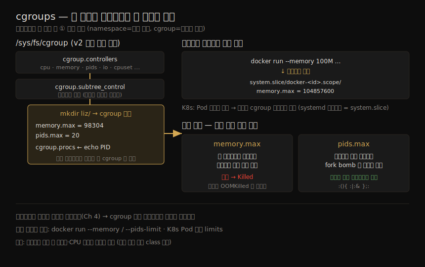

# 제어 그룹(cgroups) — 자원 제한과 격리
---
> cgroups 는 컨테이너를 이루는 기초 building block 의 하나로, 한 무리의 프로세스가 쓸 수 있는 메모리·CPU·네트워크 I/O 같은 자원을 제한합니다. 보안 관점에서 잘 조율된 cgroup 은 한 프로세스가 자원을 독차지해 다른 프로세스를 굶기지 못하게 막습니다 — 메모리 누수든 의도적 자원 고갈 공격이든. 프로세스 개수 상한으로 fork bomb 도 막을 수 있습니다. 컨테이너는 평범한 리눅스 프로세스로 돌기 때문에(Ch 4), cgroup 으로 컨테이너별 자원을 제한할 수 있습니다.

이 장은 컨테이너를 떠받치는 세 기둥(cgroups · namespaces · root 디렉토리 변경) 중 첫 번째 — **자원 제한** — 을 다룹니다. namespace 가 프로세스의 *시야* 를 격리한다면, cgroup 은 프로세스가 *쓸 수 있는 양* 을 제한합니다. 이 구분이 보안에서 중요합니다. 시야 격리만으로는 한 컨테이너가 호스트의 CPU·메모리를 전부 먹어 다른 컨테이너를 마비시키는 것을 막지 못하기 때문입니다.

직전 노트(시스템 콜·권한)가 "프로세스가 무엇을 할 수 있는가"를 다뤘다면, 이 노트는 "프로세스가 얼마나 쓸 수 있는가"를 다룹니다. 둘 다 컨테이너 격리의 토대이고, namespace(다음 장)와 합쳐져 컨테이너를 완성합니다.

> 버전 주의: 오늘날 대부분의 배포판은 **cgroups v2** 를 씁니다. Kubernetes 와 주요 컨테이너 런타임이 모두 v2 를 쓰며, 이 노트도 v2 기준입니다. v1 은 자원 유형마다 별도 계층을 뒀지만, v2 는 **단일 통합 계층(unified hierarchy)** 으로 모든 자원 유형을 관리합니다. 옛 문헌에 v1 참조가 남아 있을 수 있습니다.

이 장의 흐름 — 파일시스템 계층에서 cgroup 을 만들고·프로세스를 할당하고·한계를 정하면, 런타임이 그것을 자동화하고, 그 결과 자원 고갈·fork bomb 공격을 막는 — 을 한 장으로 정리하면 다음과 같습니다.




## 1. cgroup 컨트롤러 — 자원 유형별 관리자

> cgroup 은 `/sys/fs/cgroup` 아래 파일시스템으로 표현됩니다. 컨트롤러 하나가 한 자원 유형(cpu·memory·pids 등)을 관리하고, 부모에서 켜져야 자식에서도 켤 수 있습니다.

cgroup 은 리눅스 파일시스템의 `/sys/fs/cgroup` 마운트 지점 아래에 표현됩니다. cgroup 을 다루는 일은 이 마운트 지점 아래의 파일·디렉토리를 읽고 쓰는 것입니다. 어떤 컨트롤러를 쓸 수 있는지는 `cgroup.controllers` 가 보여 줍니다.

```bash
root@vm:/sys/fs/cgroup# cat cgroup.controllers
cpuset cpu io memory hugetlb pids rdma misc
```

각 컨트롤러는 프로세스가 소비할 수 있는 자원 한 유형을 관리합니다. `cpu` 컨트롤러는 cgroup 안 프로세스의 CPU 사용을, `memory` 컨트롤러는 접근 가능한 메모리를 관리합니다.

컨트롤러가 효력을 가지려면 컨트롤러 이름을 `cgroup.subtree_control` 파일에 써서 켜야 합니다. 그리고 **부모 cgroup 에서 켜진 컨트롤러만 자식 cgroup 에서 켤 수 있습니다.** 실행 중인 모든 리눅스 프로세스는 정확히 하나의 cgroup 에 속하며, 한 cgroup 의 모든 멤버 프로세스 ID 는 그 그룹의 `cgroup.procs` 파일에 나열됩니다.

| 핵심 파일 | 역할 |
|-----------|------|
| `cgroup.controllers` | 이 머신에서 쓸 수 있는 컨트롤러 목록 |
| `cgroup.subtree_control` | 자식에 적용할 컨트롤러를 켜는 곳(부모가 켜져 있어야 함) |
| `cgroup.procs` | 이 그룹에 속한 프로세스 ID 목록 |
| `memory.max` | 메모리 상한(기본 `max` = 무제한) |
| `memory.current` | 현재 메모리 사용량 |
| `pids.max` | 프로세스 개수 상한 |


## 2. cgroup 만들기와 설정

> `/sys/fs/cgroup` 아래 디렉토리를 만들면 cgroup 이 생기고, 커널이 매개변수·통계 파일을 자동으로 채웁니다. 상한은 해당 파일에 값을 써서 정합니다.

`/sys/fs/cgroup` 아래에 하위 디렉토리를 만들면 cgroup 이 생성되고, 커널이 그 그룹의 매개변수·통계를 나타내는 파일들로 디렉토리를 자동으로 채웁니다. 일부 파일은 한계를 정하는 매개변수를, 일부는 현재 사용량 통계를 담습니다.

```bash
root@vm:/sys/fs/cgroup# mkdir liz
root@vm:/sys/fs/cgroup/liz# cat memory.max
max                        # 기본값: 무제한
```

`max` 는 이 cgroup 의 메모리가 제한되지 않았다는 뜻입니다 — 한계를 지정하지 않으면 기본값입니다. **프로세스가 무제한 메모리를 쓸 수 있으면 같은 호스트의 다른 프로세스를 굶길 수 있습니다.** 애플리케이션의 메모리 누수로 무심코 일어날 수도, 메모리 누수를 악용해 일부러 최대한 많은 메모리를 먹는 자원 고갈 공격일 수도 있습니다.

상한을 정하려면 해당 매개변수 파일에 값을 쓰면 됩니다. 바이트 단위로 메모리 상한을 100000 으로 두면, 페이지 크기에 맞춰 내림된 값이 적용됩니다.

```bash
root@vm:/sys/fs/cgroup/liz# echo 100000 > memory.max
root@vm:/sys/fs/cgroup/liz# cat memory.max
98304                      # 페이지 크기로 내림
```

> 메모리·기타 자원에 상한을 두면 이런 종류의 공격 효과를 줄이고, 다른 프로세스가 평소대로 동작하도록 보장할 수 있습니다.


## 3. 프로세스를 cgroup 에 할당

> 새 프로세스는 부모의 cgroup 에 속합니다. 프로세스 ID 를 `cgroup.procs` 에 써서 다른 그룹으로 옮길 수 있습니다. 상한을 넘기면 그 프로세스는 종료됩니다.

cgroup 의 프로세스 집합은 `cgroup.procs` 파일에 나열됩니다. 새 cgroup 은 프로세스가 없어 이 파일이 비어 있습니다. 프로세스를 시작하면 부모의 cgroup 에 합류하지만, 프로세스 ID 를 옮기려는 그룹의 `cgroup.procs` 파일에 쓰면 그 그룹으로 이동시킬 수 있습니다.

```bash
root@vm:/sys/fs/cgroup/liz# echo 29903 > cgroup.procs   # 셸의 PID
root@vm:/sys/fs/cgroup/liz# cat /proc/29903/cgroup
0::/liz                    # 이제 liz cgroup 소속
```

이 셸은 메모리가 100kB 도 안 되게 제한된 `liz` cgroup 의 멤버가 됐습니다. 너무 빠듯해서 셸 안에서 `ls` 를 돌리는 것만으로도 한계를 넘깁니다.

```bash
$ ls
Killed                     # 메모리 한계 초과 시 프로세스 종료
```

프로세스가 메모리 한계를 넘으려 하면 종료됩니다. 이것이 cgroup 이 자원 한계를 *강제* 하는 방식입니다.


## 4. 컨테이너의 cgroup — 런타임이 자동으로 만든다

> 직접 cgroup 파일을 만질 필요 없이, 컨테이너 런타임이 컨테이너마다 cgroup 을 자동으로 만듭니다. `docker run --memory 100M` 한 줄이 cgroup 의 `memory.max` 로 번역됩니다.

시스템 관리자가 cgroup 을 직접 만들 이유가 있을 수 있지만, 컨테이너를 쓸 때는 **컨테이너 런타임이 이 일을 대신해 줍니다.** 워크로드에 할당할 자원만 지정하면 됩니다. Docker 는 컨테이너마다 cgroup 을 자동으로 만들며, systemd 드라이버를 쓰면 계층이 다음과 같습니다.

```
/sys/fs/cgroup/system.slice/
└── docker-<container_id>.scope/
    ├── memory.max
    ├── cpu.max
    ├── pids.max
    └── cgroup.procs
```

`system.slice` 는 cgroup 이 **systemd 드라이버**로 관리되고 있음을 나타냅니다(Kubernetes 의 권장 기본 드라이버). 대안인 cgroupfs 드라이버는 cgroup 이 파일시스템 계층의 다른 위치에 생긴다는 차이만 있습니다.

100MiB(104,857,600 바이트) 메모리 상한으로 컨테이너를 돌리면, Docker 가 cgroup 메커니즘으로 이 한계를 강제하는 것을 직접 볼 수 있습니다.

```bash
root@vm:~# docker run --rm --memory 100M -d alpine sleep 10000
root@vm:/sys/fs/cgroup# cat system.slice/docker-68fb...scope/memory.max
104857600                  # docker --memory 100M 이 그대로 번역됨
root@vm:/sys/fs/cgroup# cat system.slice/docker-68fb...scope/cgroup.procs
19824                      # sleep 프로세스가 이 cgroup 의 멤버
```

> Kubernetes 에서는 Pod 명세로 Pod 와 개별 컨테이너에 메모리·CPU 한계를 정합니다. Pod 가 뜨면 그 한계가 호스트의 cgroup 설정으로 번역됩니다. 컨테이너 사용자는 cgroup 파일을 직접 만지지 않고, 실행 시점에 한계만 선언하면 됩니다.


## 5. fork bomb 막기 — 프로세스 개수 상한

> fork bomb 는 프로세스가 폭발적으로 늘어 머신을 마비시키는 공격입니다. `pids.max` 로 cgroup 안 프로세스 개수를 제한하면, 폭탄이 그 cgroup 안에 갇혀 다른 프로세스는 멀쩡합니다.

**fork bomb** 는 프로세스가 또 프로세스를 만들어 자원 사용이 기하급수로 폭증해 머신을 무력화하는 공격입니다(위험하니 마비를 감당할 수 없는 시스템에서는 시도하지 말 것). 메모리 상한 대신 프로세스 개수 상한을 두면 막을 수 있습니다.

```bash
root@vm:/sys/fs/cgroup/liz# echo max > memory.max     # 메모리 제한 해제
root@vm:/sys/fs/cgroup/liz# echo 20 > pids.max        # 프로세스 20개로 제한
root@vm:/sys/fs/cgroup/liz# echo $$ > cgroup.procs    # 현재 셸 추가
root@vm:/sys/fs/cgroup/liz# cat pids.current
2                          # 셸 + 그 안에서 도는 cat
```

`pids.current` 가 2 인 이유는, 명시적으로 추가한 셸과, 그 셸 안에서 도는 `cat`(부모 cgroup 을 상속)이기 때문입니다. 이제 bash 에서 fork bomb 을 돌리면 cgroup 한계 때문에 곧 프로세스 생성이 실패합니다.

```bash
root@vm:/sys/fs/cgroup/liz# :(){ :|:& };:
# bash: fork: retry: Resource temporarily unavailable
```

터미널은 이 메시지로 가득 차지만, **머신의 다른 프로세스는 멀쩡히 돕니다.** 한계가 없었다면 다른 작업까지 멈췄을 것입니다. cgroup 의 kill 기능으로 폭탄을 끝낼 수 있습니다(폭탄을 시작한 셸도 함께 죽습니다).

```bash
root@vm:/sys/fs/cgroup/liz# echo 1 > cgroup.kill      # 그룹의 모든 프로세스 종료
```

### fork bomb 구문 해부

`:(){ :|:& };:` 가 어떻게 동작하는지는 보안과 직접 관계는 없지만 흥미로운 구문입니다.

1. `:() {...}` — `:`(콜론, bash 에서 유효한 함수 이름) 함수를 정의.
2. 본문 `:|:&` — 각 `:` 는 함수 호출. 함수가 자신을 호출해 출력을 또 다른 자기 호출로 파이프하고, `&` 로 그 두 번째 호출을 백그라운드로. 파이프와 백그라운드 실행은 각각 새 프로세스를 만들므로, **한 번 호출에 두 프로세스가 생깁니다.**
3. `;` — 함수 정의 끝.
4. 마지막 `:` — 방금 정의한 함수 호출 → cgroup 프로세스 한계에 닿을 때까지 기하급수 연쇄.

> cgroup 을 직접 만지는 대신, `docker run --pids-limit` 으로 프로세스 한계를 설정할 수 있습니다. 집필 시점 Kubernetes 에서는 Kubelet 설정으로 Pod 당 최대 프로세스를 정하는데, 이 한계는 개별 Pod 가 아니라 노드의 모든 Pod 에 적용됩니다.


## 6. 학습 점검 — 백지 복기

> 이 노트를 덮고 입으로 답해 봅니다. 막히는 항목이 다음 장에서 먼저 채울 빈칸입니다.

1. cgroup 과 namespace 가 각각 무엇을 격리·제한하는지, 둘의 차이를 한 문장으로 구분해 봅니다.
2. cgroups v1 과 v2 의 핵심 차이(별도 계층 vs 단일 통합 계층)를 말해 봅니다.
3. 컨트롤러가 효력을 가지려면 무엇을 해야 하고, "부모에서 켜져야 자식에서 켤 수 있다"가 무슨 뜻인지 설명해 봅니다.
4. 프로세스를 다른 cgroup 으로 옮기는 방법과, `memory.max` 를 넘긴 프로세스에 무슨 일이 생기는지 말해 봅니다.
5. `docker run --memory 100M` 이 호스트의 어느 파일로 번역되는지, `system.slice` 가 무엇을 뜻하는지 설명해 봅니다.
6. fork bomb 을 cgroup 으로 막는 원리(`pids.max`)와, 막았을 때 머신의 다른 프로세스가 왜 멀쩡한지 연결해 봅니다.

> 답이 막힌 항목은 이정표입니다. 이 노트의 역할은 그 빈칸의 위치를 알려 주는 것까지입니다.


## 다음 단계

> 자원 제한(cgroup)을 봤으니, 다음 장에서 나머지 두 기둥 — namespace 와 root 디렉토리 변경 — 으로 컨테이너를 완성합니다.

이 장은 cgroup 이 서로 다른 리눅스 프로세스에 가용 자원을 제한하는 방식을 봤습니다. 컨테이너가 아니어도 cgroup 을 쓸 수 있지만, Docker·Kubernetes 같은 런타임이 편리한 인터페이스를 제공해 실행 시점에 한계를 정하면 cgroup 이 그것을 강제합니다.

자원 제한은 과도한 자원 소비로 배포를 교란해 정상 애플리케이션을 굶기는 부류의 공격을 막아 줍니다. 컨테이너 애플리케이션을 돌릴 때 메모리·CPU 한계를 정하는 것이 권장됩니다(출처: 본 장 Summary).

다음 장(Ch 4)은 컨테이너를 이루는 나머지 조각 — namespace 와 root 디렉토리 변경 — 을 다루며, "호스트의 root 와 컨테이너의 root 가 같다"는 결론으로 이어집니다.


## 관련 문서

> 이 장은 cgroup 을 "보안 관점"(자원 고갈·fork bomb 방어)에서 봅니다. 같은 메커니즘을 운영 관점에서 깊이 다루는 SSOT 는 02_os/kernel 의 cgroup 노트입니다.

- [02-01.리눅스 시스템 콜·권한·Capabilities](./02-01.리눅스%20시스템%20콜·권한·Capabilities.md) — "무엇을 할 수 있는가"(권한). 이 장은 "얼마나 쓸 수 있는가"(자원)로 짝을 이룸
- [00-00.책 개요와 학습 로드맵](./00-00.책%20개요와%20학습%20로드맵.md) — 16챕터 전체 지도
- [02_os/kernel/01-02.cgroup v2 깊이](../kernel/01-02.cgroup%20v2%20깊이.md) — cgroup v2 통합 계층·컨트롤러의 운영 관점 SSOT. 이 장이 보안 측면만 다룬 메커니즘의 깊은 설명
- [02_os/kernel/01-06.cgroup 사례 — Endowus OOMKilled](../kernel/01-06.cgroup%20사례%20—%20Endowus%20OOMKilled.md) — `memory.max` 초과 시 종료(이 장 §3 의 `Killed`)가 실제 운영에서 OOMKilled 로 드러난 사례
