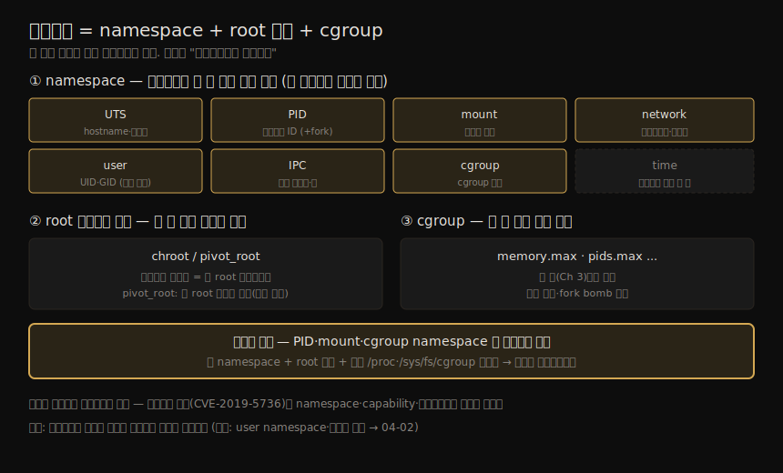
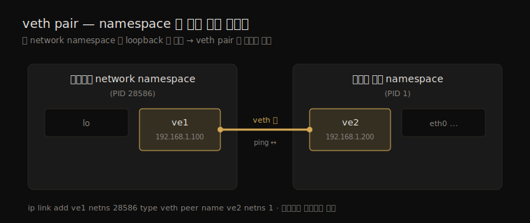

# 컨테이너 격리 (1) — namespace와 root 디렉토리 변경
---
> 컨테이너가 실제로 어떻게 동작하는지를 밝히는 장입니다. 컨테이너는 namespace 와 chroot, 그리고 앞 장의 cgroup 으로 만들어진 리눅스 구성물입니다. cgroup 이 프로세스가 *쓸 수 있는 양* 을 제한한다면, namespace 는 프로세스가 *볼 수 있는 것* 을 제한합니다. 안에서 보면 VM 처럼 보이지만 컨테이너는 VM 이 아니며, 이 차이를 이해해야 컨테이너를 둘러싼 보안 경계의 강도를 스스로 가늠할 수 있습니다.

`docker exec` 로 컨테이너에 들어가 `ps` 를 치면 컨테이너 안 프로세스만 보이고, 자체 네트워크 스택과 호스트와 무관한 root 디렉토리를 가진 듯합니다. 이 모든 것이 이 장에서 파고들 리눅스 기능으로 이뤄집니다. 표면상 VM 과 닮았어도 컨테이너는 VM 이 아니며(Ch 5 에서 비교), 둘을 대조할 줄 아는 것이 전통적 보안 수단이 컨테이너에서 어디까지 통하고 어디서 컨테이너 전용 도구가 필요한지를 가르는 열쇠입니다.

이 노트는 Chapter 4 의 전반부 — namespace 의 개념과 시야 격리 종류들, 그리고 chroot 로 root 를 바꾸는 메커니즘 — 을 다룹니다. user namespace 의 보안 심화와 Pod 공유·호스트 관점·결론은 짝 노트(04-02)가 잇습니다.

> 주의: 개념 자체는 단순하지만, 이 구성물들이 커널의 다른 기능과 맞물리는 방식은 복잡합니다. 컨테이너 탈출 취약점(예: runc·LXC 양쪽에서 발견된 CVE-2019-5736)은 namespace·capability·파일시스템이 상호작용하는 미묘한 지점에서 비롯됐습니다.

컨테이너를 이루는 세 메커니즘 — namespace 8종(볼 수 있는 것) + root 변경(보이는 파일) + cgroup(쓸 수 있는 자원) — 의 결합을 한 장으로 정리하면 다음과 같습니다.




## 1. namespace — 프로세스가 보는 것을 제한

> cgroup 이 자원을 제어한다면 namespace 는 *볼 수 있는 것* 을 제어합니다. 프로세스를 namespace 에 넣으면 그 프로세스에 보이는 자원을 격리할 수 있습니다.

namespace 의 기원은 Plan 9 운영체제로 거슬러 올라갑니다. 당시 대부분의 OS 는 파일의 단일 "name space" 를 가졌지만, Plan 9 에서는 각 프로세스 그룹이 자기만의 name space — 그 그룹이 볼 수 있는 파일 계층 — 를 가졌습니다. 리눅스 최초의 namespace 는 2002년 커널 2.4.19 의 mount namespace 였고, 지금은 여러 종류를 지원합니다.

| namespace | 무엇을 격리 |
|-----------|------------|
| UTS | 프로세스가 인식하는 hostname·도메인 이름 |
| PID | 프로세스 ID |
| mount | 마운트 지점 |
| network | 네트워크 인터페이스·라우팅 테이블 |
| user | 사용자·그룹 ID |
| IPC | 프로세스 간 통신(공유 메모리·메시지 큐) |
| cgroup | cgroup 계층 시야 |
| time | `CLOCK_MONOTONIC`·`CLOCK_BOOTTIME` |

프로세스는 각 유형마다 정확히 하나의 namespace 에 속합니다. 시스템 시작 시 각 유형의 namespace 가 하나씩 있고, 추가로 만들어 프로세스를 배정할 수 있습니다. `lsns` 로 볼 수 있습니다.

```bash
$ sudo lsns        # root(sudo)로 봐야 완전한 그림이 나온다
        NS TYPE   NPROCS    PID USER COMMAND
4026531836 pid         3 848409 liz  -bash
4026531840 net         3 848409 liz  -bash
...
```

> `lsns` 는 `/proc` 에서 정보를 읽으며, 비-root 사용자에게는 불완전한 정보를 줄 수 있습니다. 완전한 그림을 보려면 root(또는 sudo)로 실행해야 합니다.

이제 namespace 로 "컨테이너처럼 동작하는 것" 을 어떻게 만드는지를 종류별로 봅니다. 핵심 도구는 `unshare` 입니다 — man 페이지대로 "부모로부터 일부 namespace 를 분리(unshare)한 채 프로그램을 실행" 합니다. 부모 프로세스를 복제(fork)해 자식을 만들되, 자식에게 자기만의 namespace 를 주는 것입니다.


## 2. UTS·PID·mount — 컨테이너의 기본 시야 만들기

> hostname, 프로세스 목록, 마운트를 각각 격리하는 세 namespace 입니다. PID·mount 는 단독으로는 부족하고 root 디렉토리 변경·`/proc` 마운트와 결합해야 컨테이너처럼 동작합니다.

### UTS — hostname 격리

UTS namespace 는 프로세스가 인식하는 hostname 을 머신과 독립적으로 바꿉니다. 컨테이너가 자기 ID 를 hostname 으로 갖는 이유입니다.

```bash
liz@myhost:~$ sudo unshare --uts sh
$ hostname experiment      # 새 UTS namespace 안에서만 바뀜
$ exit
liz@myhost:~$ hostname
myhost                     # 호스트는 그대로
```

### PID — 프로세스 ID 격리 (단독으로는 부족)

PID namespace 는 보이는 프로세스 ID 집합을 제한합니다. 그런데 `--pid` 만 주면 첫 명령 뒤로 "Cannot fork" 가 납니다. man 페이지가 단서를 줍니다 — `--fork` 로 프로그램을 `unshare` 의 자식으로 띄워야 새 PID namespace 가 제대로 동작합니다.

```bash
liz@myhost:~$ sudo unshare --pid --fork sh    # --fork 필요
```

하지만 `--fork` 를 줘도 새 namespace 안에서 `ps -eaf` 를 치면 **호스트의 모든 프로세스가 보입니다.** `ps` 가 `/proc` 의 가상 파일을 읽기 때문입니다. `/proc` 의 각 숫자 디렉토리가 프로세스 ID 에 대응하므로, namespace 안 프로세스만 보이게 하려면 별도의 `/proc` 이 필요하고, `/proc` 은 root 바로 아래라 **root 디렉토리를 바꿔야** 합니다(§3).

### mount — 마운트 격리

컨테이너가 호스트와 같은 마운트를 다 갖기를 원하지 않습니다. mount namespace 가 이 분리를 줍니다. 새 mount namespace 의 bind 마운트는 호스트에서 보이지 않습니다.

```bash
liz@myhost:~$ sudo unshare --mount sh
$ mount --bind source target   # 이 namespace 안에서만 보임
```

PID 와 마찬가지로, 완전히 격리된 마운트 집합을 얻으려면 새 mount namespace + 새 root 파일시스템 + 새 `proc` 마운트를 결합해야 합니다. `docker run -v <host>:<container>` 의 호스트 디렉토리 마운트도 컨테이너마다 mount namespace 가 있어 다른 컨테이너에서 보이지 않습니다.


## 3. root 디렉토리 변경 — chroot 와 pivot_root

> 컨테이너는 호스트 파일시스템 전체가 아니라 그 부분집합만 봅니다. root 디렉토리가 컨테이너 생성 시 바뀌기 때문입니다. chroot 는 현재 프로세스의 root 를 다른 위치로 옮겨, 그보다 위는 접근할 수 없게 합니다.

`chroot` 는 현재 프로세스의 root 디렉토리를 파일시스템의 다른 위치로 옮깁니다. 일단 chroot 하면 새 root 보다 위 계층의 어떤 것에도 접근할 수 없습니다 — 파일시스템에서 root 보다 위로는 갈 수 없기 때문입니다. chroot 는 디렉토리만 바꾸는 게 아니라 명령도 실행하며, 명령을 안 주면 셸로 폴백합니다.

빈 디렉토리로 chroot 하면 실패합니다 — 새 root 안에 `/bin/bash` 도 `ls` 도 없기 때문입니다. **실행하려는 명령의 파일이 새 root 안에 있어야 합니다.** 이것이 "진짜" 컨테이너에서 일어나는 일입니다. 컨테이너는 컨테이너 이미지로 인스턴스화되고, 그 이미지가 컨테이너가 보는 파일시스템을 담습니다. 실행 파일이 그 안에 없으면 컨테이너는 그것을 찾아 돌릴 수 없습니다.

```bash
liz@myhost:~$ sudo chroot alpine sh     # alpine 루트fs 를 새 root 로
/ $ ls
bin  etc  lib  ...                       # alpine/bin 이 / 가 됨
/ $ whoami
root
```

요약하면 chroot 는 프로세스의 root 를 말 그대로 "바꿉니다". 바꾼 뒤 그 프로세스와 자식은 새 root 보다 아래의 파일·디렉토리만 접근할 수 있습니다.

> chroot 보다 정교한 `pivot_root` 가 있습니다. 컨테이너 런타임 구현을 보면 대개 후자를 씁니다 — 보안상 이점 때문입니다. `pivot_root` 는 mount namespace 를 활용해 **옛 root 를 마운트 해제** 하므로 그 mount namespace 안에서 더는 접근할 수 없습니다. 반면 chroot 는 옛 root 가 마운트 지점을 통해 여전히 접근 가능하게 남습니다. 이 장은 더 친숙한 chroot 로 설명하지만, 핵심은 "컨테이너는 자기 root 디렉토리를 가져야 한다" 입니다.

### namespace 와 root 변경 결합 — 컨테이너처럼 동작

PID namespace + root 변경 + `proc` 마운트를 결합하면 비로소 `ps` 가 namespace 안 프로세스만 보여 줍니다.

```bash
liz@myhost:~$ sudo unshare --pid --fork chroot alpine sh
/ $ mount -t proc proc proc      # 독립 /proc 채우기
/ $ ps
PID   USER     TIME  COMMAND
  1   root     0:00  sh           # namespace 안 프로세스만!
  5   root     0:00  ps
```

`unshare --pid --fork --mount-proc bash` 로 이 과정을 한 번에 줄일 수도 있습니다.


## 4. network·IPC·cgroup·time namespace

> 나머지 네 namespace 입니다. network 는 인터페이스·라우팅을, IPC 는 공유 메모리·메시지 큐를, cgroup 은 cgroup 시야를 격리합니다. time 은 컨테이너 시스템이 거의 쓰지 않습니다.

### network — 인터페이스·라우팅 격리

network namespace 는 컨테이너에 자체 네트워크 인터페이스·라우팅 테이블 시야를 줍니다. 처음엔 loopback 인터페이스만 있어 통신할 수 없습니다. 바깥과 잇는 길을 주려면 **가상 이더넷 쌍(veth pair)** 을 만듭니다 — 컨테이너 namespace 와 호스트 기본 namespace 를 잇는 비유적 케이블의 두 끝입니다.

```bash
# 호스트에서: PID 28586 의 namespace 와 호스트(PID 1)를 veth 로 연결
liz@myhost:~$ sudo ip link add ve1 netns 28586 type veth peer name ve2 netns 1
```

양쪽 끝을 `up` 시키고 IPv4 주소를 양쪽에 부여하면 컨테이너↔호스트 ping 이 됩니다. 이 라우팅 정보는 호스트의 IP 라우팅 테이블과 독립적입니다(상세는 Ch 12). 두 namespace 를 잇는 veth pair 의 구조는 다음과 같습니다.



> `unshare --net` 은 익명(anonymous) network namespace 를 만들며, `ip netns list` 출력에는 나타나지 않습니다.

### IPC — 공유 메모리·메시지 큐 격리

두 프로세스가 같은 공유 메모리·메시지 큐 식별자에 접근하려면 같은 IPC namespace 의 멤버여야 합니다. 보통 컨테이너끼리 서로의 공유 메모리에 접근하길 원치 않으므로 각자의 IPC namespace 를 줍니다. 자체 IPC namespace 를 가진 프로세스는 `ipcs` 로 호스트의 IPC 객체를 보지 못합니다.

### cgroup — cgroup 시야 격리

cgroup namespace 는 cgroup 파일시스템에 대한 chroot 같은 것으로, 프로세스가 자기 cgroup 보다 위 계층의 cgroup 설정을 보지 못하게 합니다. `/proc/self/cgroup` 이 namespace 안에서는 root 레벨(`0::/`)로 보입니다. 단, `/sys/fs/cgroup` 을 올바로 보려면 PID namespace 와 함께 mount namespace·root 변경이 필요합니다 — `/proc` 과 같은 이치입니다.

### time — 컨테이너는 거의 안 쓴다

time namespace 는 프로세스가 자기 `CLOCK_MONOTONIC`·`CLOCK_BOOTTIME` 을 조정해 부팅 시각이 다른 것처럼 보이게 합니다. 시스템 간 무중단 프로세스 이전(migration)이 목적입니다. 다만 분산 시스템에서 컨테이너마다 시각이 다르면 로그·메트릭 조율이 복잡해지고, 공격자가 악성 행위를 과거·미래로 위장할 여지가 생깁니다. 그래서 **이 namespace 를 쓰는 컨테이너 시스템은 알려진 바 없습니다.**


## 5. 학습 점검 — 백지 복기

> 이 노트를 덮고 입으로 답해 봅니다. 막히는 항목이 다음 노트에서 먼저 채울 빈칸입니다.

1. cgroup 과 namespace 가 각각 "무엇을" 제어하는지 한 문장으로 구분해 봅니다.
2. `unshare --pid` 만으로는 왜 부족하고 `--fork` 가 왜 필요한지 설명해 봅니다.
3. 새 PID namespace 안에서 `ps -eaf` 가 호스트 전체 프로세스를 보이는 이유와, 그 해결(독립 `/proc` → root 변경)을 연결해 봅니다.
4. chroot 가 빈 디렉토리로는 실패하는 이유가, "진짜" 컨테이너가 이미지에서 만들어지는 것과 어떻게 같은 원리인지 말해 봅니다.
5. chroot 와 pivot_root 의 보안 차이(옛 root 접근 가능 여부)를 설명해 봅니다.
6. network namespace 가 처음 loopback 만 갖는 이유와 veth pair 가 무엇을 잇는지 그려 봅니다.

> 답이 막힌 항목은 이정표입니다.


## 다음 단계

> namespace 종류와 chroot 결합을 봤으니, 짝 노트에서 보안의 핵심인 user namespace 와 호스트 관점으로 넘어갑니다.

이 노트는 namespace 8종과 chroot 로 프로세스의 시야를 격리하는 방법을 봤습니다. 앞 장의 cgroup 과 합치면 "컨테이너" 를 만드는 데 필요한 모든 것을 이해한 셈입니다.

짝 노트(04-02)는 가장 보안 의미가 큰 **user namespace**(컨테이너 root 를 호스트 비-root 로 매핑), Kubernetes Pod 의 namespace 공유, 그리고 호스트 관점에서 본 컨테이너 — "호스트의 root 와 컨테이너의 root 가 같다" 는 결론 — 을 다룹니다.


## 관련 문서

> 이 노트는 namespace 를 "보안 관점"에서 봅니다. 같은 메커니즘의 실습·운영 관점 SSOT 는 02_os/kernel 의 namespace 노트입니다.

- [03-01.제어 그룹(cgroups) — 자원 제한과 격리](./03-01.제어%20그룹(cgroups)%20—%20자원%20제한과%20격리.md) — 자원 제한(쓸 수 있는 양). 이 노트의 namespace(볼 수 있는 것)와 함께 컨테이너를 이룸
- [04-02.컨테이너 격리 (2) — user namespace·Pod·호스트 관점](./04-02.컨테이너%20격리%20(2)%20—%20user%20namespace·Pod·호스트%20관점.md) — 짝 노트. user namespace 보안 심화와 결론
- [02_os/kernel/01-05.namespace 실습 — 8가지 격리와 unshare](../kernel/01-05.namespace%20실습%20—%208가지%20격리와%20unshare.md) — 8가지 namespace 를 `unshare` 로 직접 만드는 실습 SSOT
- [02_os/kernel/01-03.마운트 네임스페이스와 propagation](../kernel/01-03.마운트%20네임스페이스와%20propagation.md) — §2 mount namespace 의 propagation 깊은 설명
