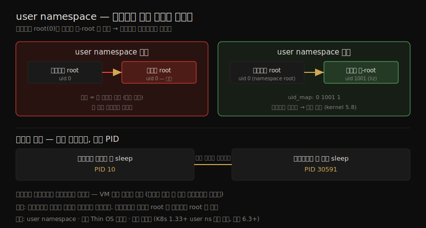
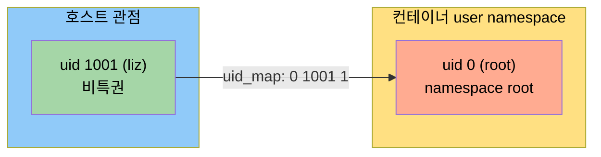
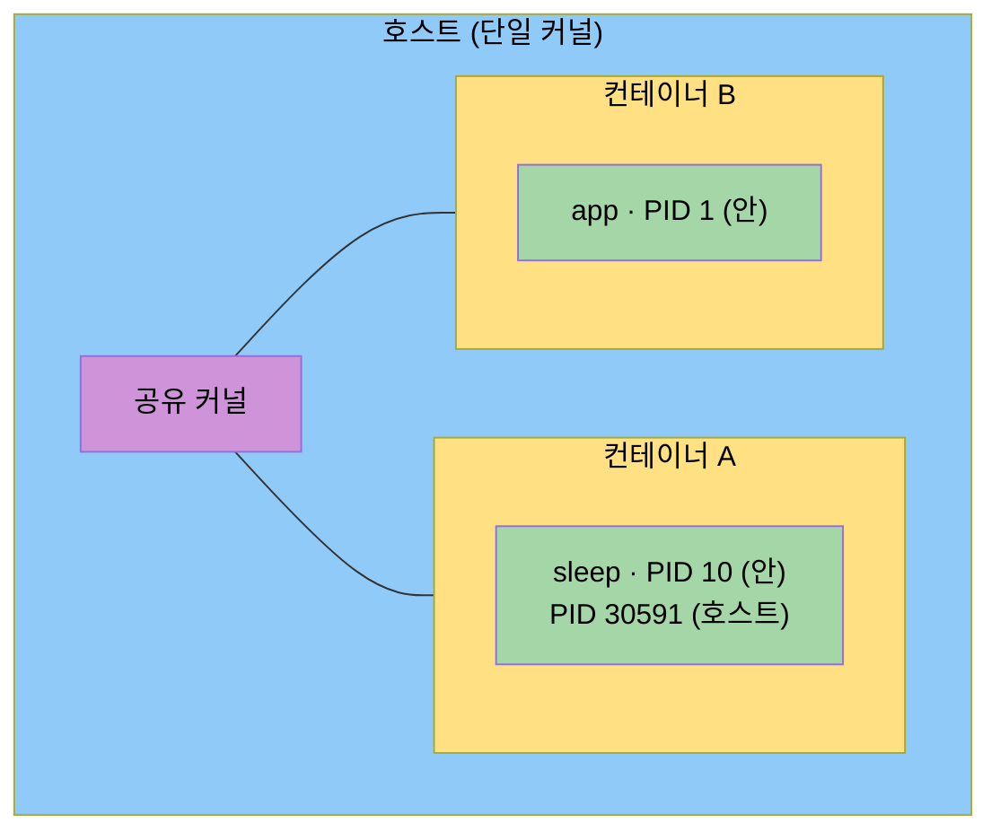

# 컨테이너 격리 (2) — user namespace·Pod·호스트 관점
---
> 컨테이너 격리에서 보안적으로 가장 중요한 조각인 user namespace 를 다룹니다. user namespace 는 컨테이너 안의 root(ID 0)를 호스트의 비-root 신원으로 매핑합니다 — 컨테이너 안에서는 root 로 돌되, 탈출한 공격자는 호스트에서 비특권 신원을 갖게 됩니다. 이어서 Kubernetes Pod 가 어떤 namespace 를 공유하는지, 그리고 호스트 관점에서 컨테이너가 무엇인지를 봅니다. 결론은 하나입니다 — 컨테이너는 호스트의 커널을 공유하는 평범한 프로세스이고, 기본적으로 호스트의 root 와 컨테이너의 root 는 같은 것입니다.

짝 노트(04-01)가 namespace 8종과 chroot 로 컨테이너의 시야를 격리하는 방법을 봤다면, 이 노트는 그중 보안 무게가 가장 큰 **user namespace** 에서 출발합니다. user namespace 는 컨테이너 root 를 호스트 비-root 로 떼어 놓아, 컨테이너 탈출이 곧 호스트 장악으로 이어지는 사슬(01-01 §4)을 끊을 수 있는 거의 유일한 namespace 입니다.

이 노트는 Chapter 4 의 후반부 — user namespace, Pod 의 namespace 공유, 호스트 관점의 컨테이너, 호스트 머신 모범 관행 — 을 다루며, 이 책의 토대 그룹을 마무리하는 결론으로 이어집니다.

> 결론 미리보기: 컨테이너는 이름과 달리 "컨테이너화된 프로세스" 라 부르는 편이 정확합니다. 호스트에서 도는 리눅스 프로세스이고, 호스트의 커널을 공유합니다(Ch 5 에서 VM 과 비교).

user namespace 가 공격 사슬을 어떻게 끊는지, 그리고 같은 프로세스가 호스트·컨테이너에서 다른 PID 로 보이는 결론을 한 장으로 정리하면 다음과 같습니다.




## 1. user namespace — 컨테이너 root 를 호스트 비-root 로

> user namespace 는 namespace 안팎의 사용자·그룹 ID 를 다르게 매핑합니다. 핵심 이점은 컨테이너 안의 root(0)를 호스트의 비-root 신원으로 매핑하는 것입니다. 탈출한 공격자가 호스트에서 비특권 신원을 갖게 되므로 보안상 큰 이점입니다.

user namespace 는 namespace 안에서 쓰는 사용자·그룹 ID 를 바깥과 다르게 매핑합니다. PID 처럼 사용자·그룹은 호스트에 여전히 존재하되 namespace 안에서 다른 ID 로 매핑됩니다. **핵심 이점은 컨테이너 안의 root ID 0 을 호스트의 비-root 신원으로 매핑하는 것입니다.** 소프트웨어는 컨테이너 안에서 root 로 돌 수 있지만, 컨테이너를 탈출해 호스트로 나간 공격자는 비-root·비특권 신원을 갖습니다. 컨테이너를 오설정해 탈출이 쉬워져도(Ch 11), user namespace 가 있으면 한 번의 실수가 곧 호스트 장악으로 직결되지 않습니다.

대개 새 namespace 를 만들려면 root 가 필요하지만(그래서 Docker 데몬이 root 로 돕니다), **user namespace 는 예외** 입니다. 비특권 사용자가 만들 수 있고, 안에서는 `nobody`(65534)로 시작합니다.

```bash
liz@myhost:~$ unshare --user bash
nobody@myhost:~$ id
uid=65534(nobody) gid=65534(nogroup) ...
```

안팎 ID 매핑은 `/proc/<pid>/uid_map` 에 둡니다. 세 필드는 **(자식 관점의 최저 ID, 대응하는 호스트 최저 ID, 매핑할 ID 개수)** 입니다. `liz`(호스트 ID 1001)를 컨테이너 안 root(0)로 매핑하려면 `0 1001 1` 을 씁니다.

```bash
liz@myhost:~$ sudo echo '0 1001 1' > /proc/31196/uid_map
nobody@myhost:~$ id
uid=0(root) gid=65534(nogroup) ...     # 안에서는 root
```



### namespace root 는 호스트 전권이 아니다 (kernel 5.8)

매핑 후 프로세스가 컨테이너 안에서 root 가 돼도, **호스트 관점에서는 비특권 `liz` 로 돕니다.** 커널 5.8 에서 중요한 변화가 있었습니다 — 자식 프로세스의 root 가 더는 호스트 전역의 root 권한을 자동으로 얻지 못하고, 그저 "namespace root" 일 뿐입니다.

```bash
nobody@myhost:~$ sleep 100             # 컨테이너 안 root 가 실행
# 호스트의 다른 터미널에서:
liz@myhost:~$ ps -fC sleep
UID   PID  ...  CMD
liz  84714 ...  sleep 100              # 호스트에선 비특권 liz
```

이 비특권 사용자는 `CAP_SYS_ADMIN` 이 없어 새 UTS namespace 조차 못 만듭니다. 다만 커널은 user namespace 와 함께 다른 namespace 를 만드는 "one-shot" 방식을 허용합니다 — `unshare --user --uts` 처럼. 그래도 추가 capability 가 주어지지는 않아 hostname 변경은 여전히 막힙니다.

권한 있는 사용자(`sudo`)로 만들면 안의 사용자는 `nobody` 이고, 호스트 UID 0 을 namespace UID 0 으로 잇는 명시적 매핑이 필요합니다. `--map-root-user` 옵션이 이를 편하게 해 줍니다.

```bash
liz@myhost:~$ sudo unshare --user --uts --map-root-user bash
root@myhost:~# cat /proc/$$/uid_map
         0          0          1        # 0→0 매핑
root@myhost:~# hostname new             # 이제 변경 가능
```

> user namespace 지원은 Kubernetes 1.33 부터 기본 활성(커널 6.3+ 필요)이고, containerd·runc 최신 버전이 지원하며 Docker 는 `--userns-remap` 으로 켭니다. 컨테이너를 root 로 돌리면 컨테이너 안 root 권한을 얻기 쉽지만, user namespace 로 자동 root 를 막는 것도 쉽습니다 — "진짜" root(호스트 관점 root)로 돌 컨테이너가 줄어드는 보안 이점입니다. 비특권 사용자로 돌리며 컨테이너 안에서 root 를 얻는 것은 더 까다로운데, 이를 **rootless 컨테이너** 라 하며 Ch 11 에서 다룹니다.


## 2. Kubernetes Pod 와 namespace 공유

> Pod 는 하나 이상의 컨테이너 묶음입니다. 각 컨테이너는 자기 root 파일시스템을 갖지만, namespace 로 완전히 격리되지는 않습니다 — Pod 안 컨테이너들은 일부 namespace 를 공유합니다.

Pod 안 컨테이너들은 각자 root 파일시스템을 가져 의존성 집합을 따로 둘 수 있지만, namespace 로 서로 완전히 격리되지는 않습니다.

| 공유 namespace | 결과 |
|----------------|------|
| network (항상 공유) | 같은 IP 주소, `localhost` 로 통신 가능 |
| IPC (항상 공유) | UNIX 도메인 소켓·공유 메모리로 통신 가능 |
| PID (선택적 공유) | 설정하면 서로의 프로세스를 보고 시그널을 보낼 수 있음 |

> 이 공유가 01-01 §5 에서 본 "같은 Pod 의 컨테이너는 namespace 가 달라도 컨테이너 격리로만 보호된다" 는 말의 메커니즘입니다. network·IPC 를 공유하므로 Pod 안 컨테이너는 의도적으로 가깝게 묶입니다. 같은 Pod 안에서는 격리보다 협력이 목적이라는 점을 기억해 두면 좋습니다.


## 3. 호스트 관점의 컨테이너 — 같은 프로세스, 다른 PID

> 컨테이너는 호스트에서 도는 리눅스 프로세스입니다. 호스트와 컨테이너에서 PID 가 다르게 보이지만, 둘은 같은 프로세스를 가리킵니다. 이 사실이 컨테이너와 VM 의 근본적 차이입니다.

컨테이너 안에서 `sleep` 을 돌리고 양쪽에서 보면, 같은 프로세스가 다른 PID 로 나타납니다.

```bash
# 컨테이너 안 (자체 PID namespace)
root@ab6ea36fce8e:/$ ps
  PID TTY      TIME CMD
   10 pts/0    00:00:00 sleep         # 낮은 번호

# 호스트에서
$ ps -C sleep
  PID TTY      TIME CMD
30591 pts/0    00:00:00 sleep         # 높은 번호 — 같은 프로세스!
```

PID 가 둘이지만 **둘은 같은 하나의 프로세스** 입니다. 호스트 관점에서 번호가 더 높을 뿐입니다. 두 PID 가 같은 프로세스를 가리킨다는 사실을 붙잡는 것이 컨테이너의 격리 수준을 이해하는 열쇠입니다. 이 사실이 컨테이너와 VM 의 근본적 차이입니다 — **컨테이너 프로세스는 호스트에서 보입니다.** 호스트에 접근한 공격자는, 특히 root 권한이 있으면, 그 호스트의 모든 컨테이너를 관찰·간섭할 수 있습니다(Ch 11 에서 탈출 경로를 다룹니다).




## 4. 컨테이너 호스트 머신 — 모범 관행

> 컨테이너와 호스트가 커널을 공유하므로, 호스트가 뚫리면 그 위 모든 컨테이너가 잠재적 피해자입니다. 그래서 컨테이너는 전용 호스트에서 돌리고, Thin OS·불변 인프라로 공격 표면을 줄이는 것이 권장됩니다.

호스트가 침해되면 — 특히 공격자가 root 나 (Docker 의 `docker` 그룹 멤버 같은) 상승된 권한을 얻으면 — 그 위 모든 컨테이너가 피해자가 될 수 있습니다. 그래서 컨테이너 애플리케이션은 전용 호스트(VM 이든 베어메탈이든)에서 돌리는 것이 강력히 권장되며, 이유는 대부분 보안입니다.

1. **사람의 접근 최소화**: 오케스트레이터로 컨테이너를 돌리면 사람이 호스트에 접근할 일이 거의 없습니다. 다른 앱을 안 돌리면 호스트의 사용자 신원이 아주 적어, 관리가 쉽고 무단 로그인 시도를 포착하기 쉽습니다.
2. **Thin OS**: 컨테이너 실행에 필요한 구성 요소만 담은 경량 배포판(Flatcar·Talos·Bottlerocket)으로 호스트 공격 표면을 줄입니다. 구성 요소가 적을수록 취약점 가능성도 줄어듭니다(Ch 8).
3. **불변(immutable) 인프라**: 클러스터의 모든 호스트가 같은 설정을 공유하면 프로비저닝을 자동화하기 쉽고, 호스트를 불변으로 다룰 수 있습니다. 업그레이드가 필요하면 패치하지 않고 — 클러스터에서 빼내 새로 설치한 머신으로 교체합니다. 불변으로 다루면 침입을 탐지하기 쉬워집니다(Ch 8).

> Thin OS 도 설정을 완전히 없애지는 못합니다. 모든 호스트에 컨테이너 런타임(containerd)과 오케스트레이터 코드(kubelet)가 돌고, 이들에는 보안에 영향을 주는 설정이 많습니다. CIS(Center for Internet Security)가 Docker·Kubernetes·Linux 의 모범 설정 벤치마크를 냅니다. 엔터프라이즈에서는 호스트의 취약점·우려 설정을 보고하고, 호스트 수준 로그인·시도에 로그·알림을 주는 컨테이너 보안 솔루션을 찾으면 좋습니다.


## 5. 결론 — 컨테이너란 무엇인가

> 컨테이너를 만드는 세 가지 리눅스 커널 메커니즘으로 정리합니다. namespace(볼 수 있는 것 제한) · root 변경(보이는 파일 제한) · cgroup(쓸 수 있는 자원 제어). 한 호스트의 모든 컨테이너는 같은 커널을 공유하고, 기본적으로 전부 root 로 돕니다.

이 장(04-01·04-02)으로 컨테이너가 무엇인지 알게 됐습니다. 프로세스의 호스트 자원 접근을 제한하는 세 가지 커널 메커니즘은 다음과 같습니다.

| 메커니즘 | 제한하는 것 |
|----------|------------|
| namespace | 컨테이너 프로세스가 **볼 수 있는 것**(예: 격리된 PID 집합) |
| root 디렉토리 변경 | 컨테이너가 볼 수 있는 **파일·디렉토리 집합** |
| cgroup | 컨테이너가 접근할 수 있는 **자원** |

한 워크로드를 다른 워크로드로부터 격리하는 것은 컨테이너 보안의 중요한 측면입니다(01-01). **한 호스트의 모든 컨테이너는 같은 커널을 공유합니다.** 다중 사용자 시스템도 같지만, 거기서는 관리자가 각 사용자의 권한을 제한하고 결코 모두에게 root 를 주지 않습니다. 그런데 컨테이너는 — 적어도 집필 시점 — **기본적으로 전부 root 로 돌며**, namespace·바뀐 root·cgroup 이 주는 경계에 의존해 서로 간섭을 막습니다. 이 경계를 강화하는 방법은 Ch 10 에서, VM 격리와의 비교는 Ch 5 에서 다룹니다.


## 6. 학습 점검 — 백지 복기

> 이 노트를 덮고 입으로 답해 봅니다.

1. user namespace 의 핵심 보안 이점을, "컨테이너 탈출 사슬"(01-01 §4)을 끊는다는 관점에서 설명해 봅니다.
2. `uid_map` 의 세 필드 `0 1001 1` 이 각각 무슨 뜻인지 말해 봅니다.
3. kernel 5.8 이후 "namespace root" 가 호스트 전권과 어떻게 다른지, `sleep` 예시로 설명해 봅니다.
4. Kubernetes Pod 안 컨테이너들이 공유하는 namespace 셋(network·IPC·선택적 PID)과 그 결과를 말해 봅니다.
5. 같은 `sleep` 프로세스가 컨테이너에선 PID 10, 호스트에선 30591 로 보이는 것이 컨테이너와 VM 의 근본 차이와 어떻게 연결되는지 설명해 봅니다.
6. 컨테이너를 전용 Thin OS 호스트·불변 인프라로 돌리는 세 가지 보안 이유를 들어 봅니다.

> 답이 막힌 항목은 이정표입니다.


## 다음 단계

> 컨테이너의 정체를 알았으니, 다음 장에서 VM 격리와 비교해 두 격리의 상대적 강도를 봅니다.

이 장으로 토대 그룹(Ch 1~4)이 끝났습니다. 다음 장(Ch 5)은 VM 이 어떻게 동작하는지를 파고들어, 컨테이너 간 격리와 VM 간 격리의 상대적 강도를 — 특히 보안의 렌즈로 — 견주게 합니다. "왜 VM 은 강한 격리이고 컨테이너는 약한 경계인가" 의 답이 거기 있습니다.


## 관련 문서

> 이 노트는 user namespace 를 "보안 관점"에서 봅니다. UID 매핑의 운영 사례 SSOT 는 02_os/kernel 노트입니다.

- [04-01.컨테이너 격리 (1) — namespace와 root 디렉토리 변경](./04-01.컨테이너%20격리%20(1)%20—%20namespace와%20root%20디렉토리%20변경.md) — 짝 노트. namespace 8종과 chroot 메커니즘
- [01-01.컨테이너 보안 위협 — 위협 모델·공격 벡터·보안 원칙](./01-01.컨테이너%20보안%20위협%20—%20위협%20모델·공격%20벡터·보안%20원칙.md) — §1 이 끊는 "컨테이너 탈출 → 호스트 root" 공격 사슬의 원본
- [02_os/kernel/01-07.OverlayFS와 user namespace — Netflix UID 격리](../kernel/01-07.OverlayFS와%20user%20namespace%20—%20Netflix%20UID%20격리.md) — UID 매핑으로 컨테이너 root 와 호스트 비-root 를 분리하는 운영 사례 SSOT
