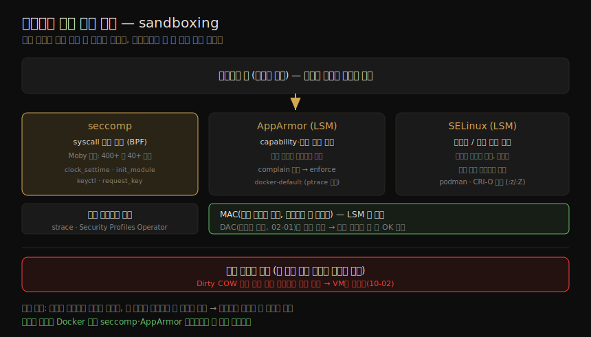

# 격리 강화 (1) — seccomp·AppArmor·SELinux
---
> 컨테이너(3·4장)는 같은 호스트의 워크로드를 어느 정도 분리하지만, 더 단단하게 격리하는 도구가 따로 있습니다. 접근법은 둘입니다 — 서로를 *모르게* 격리하거나(컨테이너·VM), 한 워크로드가 다른 워크로드를 알더라도 *할 수 있는 행동을 제한* 하거나입니다. 후자, 즉 앱이 자원에 제한적으로만 접근하게 가두는 것을 sandboxing 이라 합니다. 이 노트는 컨테이너에 *프로파일을 적용해* 행동을 좁히는 세 기법 — seccomp·AppArmor·SELinux — 을 다룹니다.

이 노트는 Chapter 10 의 전반부입니다. ④ 격리 강화 그룹의 첫 절반으로, 일반 컨테이너에 보안 메커니즘을 *덧대* 기본 격리를 보강하는 쪽입니다. 컨테이너와 VM *사이* 또는 VM 격리를 쓰는 gVisor·Kata·마이크로VM·unikernel 은 짝 노트(10-02)가 다룹니다.

앱을 컨테이너로 돌리면 컨테이너 자체가 sandboxing 의 편리한 대상이 됩니다. 컨테이너를 시작할 때 그 안에서 무슨 앱 코드가 돌아야 하는지 알고 있으므로, 앱이 탈취돼 평소 행동 밖의 코드를 돌리려 하면 sandboxing 으로 그 코드가 할 수 있는 일을 좁힐 수 있습니다.

> 전제: syscall·DAC·capabilities(02-01)가 여기서 통제 대상입니다. seccomp 는 syscall 을, AppArmor·SELinux 는 capability·파일 접근을 제한합니다. 런타임에 갱신·적용하는 eBPF 기반 sandboxing 은 Chapter 15 입니다.


## 1. seccomp — syscall 집합을 제한

> seccomp(secure computing mode)는 앱이 호출할 수 있는 system call 집합을 제한하는 메커니즘입니다. 2005년 처음 도입됐을 때는 모드 전환 후 `sigreturn`·`exit`·(이미 열린 fd 에 대한)`read`/`write` 만 허용해, 신뢰할 수 없는 코드를 안전히 돌릴 수 있었지만 너무 제한적이어서 쓸모 있는 일도 거의 못 했습니다.

2012년 추가된 **seccomp-bpf** 가 이를 실용적으로 바꿨습니다. Berkeley Packet Filter 로, 프로세스에 적용된 seccomp 프로파일에 근거해 특정 syscall 허용 여부를 판단합니다. 프로세스마다 자기 프로파일을 가질 수 있습니다.

> BPF seccomp 필터는 syscall opcode 와 인자를 보고 판단합니다. 엄밀히는 매칭 시 에러 반환·프로세스 종료·tracer 호출 등을 지정할 수 있지만, 컨테이너 세계의 대부분 용도에서는 *허용 또는 에러 반환* 이므로 "어떤 syscall 을 허용·거부할지 목록"으로 생각하면 됩니다.

컨테이너 앱이 정상 상황에서 호출할 이유가 거의 없는 syscall 이 여럿 있어, seccomp 가 유용합니다.

| 차단 대상 | 이유 |
|----------|------|
| `clock_adjtime`·`clock_settime` | 컨테이너 앱이 호스트 시계를 바꿀 일이 없음 |
| `create_module`·`delete_module`·`init_module` | 커널 모듈 변경을 원치 않으면 불필요 |
| `request_key`·`keyctl` | 리눅스 커널 keyring 은 namespace 화되지 않음 → 컨테이너 호출을 막는 편이 좋음 |

Docker 기본 seccomp 프로파일(Moby 오픈소스)은 400여 개 syscall 중 40개 이상(위 예 포함)을 차단하며, 대다수 앱에 악영향이 없습니다. 특별한 이유가 없으면 좋은 기본값입니다. Kubernetes 는 1.22 부터 `podSecurityContext` 의 `seccompProfile` 을 지원하고, `RuntimeDefault` 옵션은 런타임 기본 프로파일(containerd 는 Moby/Docker 프로파일)을 씁니다.

#### 앱별 맞춤 프로파일

이상적으로는 앱마다 필요한 syscall 만 정확히 허용하는 맞춤 프로파일이 있어야 합니다. 만드는 방법은 다음과 같습니다.

| 방법 | 내용 |
|------|------|
| `strace` | 앱이 호출하는 모든 syscall 을 추적해 프로파일 생성·검증(Jess Frazelle 의 Docker 기본 프로파일 작업 사례) |
| Security Profiles Operator | Kubernetes 에서 앱이 쓴 syscall 을 기록해 프로파일로 적용. seccomp·AppArmor·SELinux 모두 생성 |
| 상용 도구 | 워크로드를 관찰해 맞춤 seccomp 프로파일을 자동 생성 |

> 주의: syscall 은 계속 진화합니다. 이 책 1판 이후 약 100개가 커널에 추가됐습니다. 개발자는 보통 syscall 을 직접 짜지 않고 언어 라이브러리가 추상화하므로, 라이브러리 업그레이드가 드러나지 않게 다른 syscall 을 쓸 수 있습니다. 엄격한 프로파일이 정당하게 쓰이는 새 syscall 을 막을 수 있으니, 호스트 OS 가 새 커널로 올라가면 프로파일도 갱신해야 할 수 있습니다.


## 2. AppArmor — 실행 파일에 프로파일 결속

> AppArmor(Application Armor)는 커널에서 활성화할 수 있는 여러 LSM(Linux Security Module) 중 하나입니다. 머신에서 쓸 수 있는 LSM 은 `/sys/kernel/security/lsm` 으로 확인합니다. AppArmor 프로파일은 실행 파일에 결속돼, 그 파일이 capability·파일 접근 권한 측면에서 무엇을 할 수 있는지 정합니다(02-01).

Docker·containerd·CRI-O 등 여러 런타임이 AppArmor 를 지원합니다.

#### MAC vs DAC

AppArmor 같은 LSM 은 **MAC(mandatory access control)** 을 구현합니다. MAC 은 중앙 관리자가 설정하며, 한번 설정되면 다른 사용자가 통제를 수정하거나 타인에게 넘길 수 없습니다. 반면 리눅스 파일 권한은 **DAC(discretionary access control)** 입니다 — 내 계정이 파일을 소유하면 (MAC 으로 덮이지 않는 한) 남에게 접근을 줄 수도, 실수 방지를 위해 내 계정조차 못 쓰게 할 수도 있습니다. MAC 은 개별 사용자가 뒤집을 수 없는 방식으로 관리자에게 훨씬 세밀한 통제를 줍니다.

AppArmor 의 **complain 모드** 에서는 프로파일을 어긴 동작이 로그로 남습니다. 이 로그로 프로파일을 다듬어 새 위반이 안 보일 때까지 가고, 그 시점에 *강제(enforce)* 로 전환합니다.

```bash
# 프로파일을 /etc/apparmor.d 에 두고 로드
$ sudo apparmor_parser /etc/apparmor.d/<profile>
# 로드된 프로파일 확인
$ sudo apparmor_status

# 프로파일을 적용해 컨테이너 실행
$ docker run --security-opt="apparmor:<profile name>" ...
```

> Docker 는 기본 AppArmor 프로파일을 적용해 컨테이너 안 `ptrace` 같은 동작을 막습니다. 이 프로파일은 데몬 시작 시 *메모리에서* 구성돼 `apparmor_parser` 로 전달되므로 `/etc/apparmor.d` 에는 안 보입니다. 적용된 프로파일은 `docker inspect <ID>` 의 `"AppArmorProfile": "docker-default"` 로 확인합니다. Kubernetes Pod 에는 annotation 으로 적용하며, Security Profiles Operator 가 워크로드별 프로파일을 만들어 적용할 수 있습니다.


## 3. SELinux — 라벨 기반 도메인·타입 통제

> SELinux(Security-Enhanced Linux)는 또 다른 LSM 으로, 미국 NSA 프로젝트에 뿌리를 두고 지금은 Red Hat 이 주로 유지하는 오픈소스입니다. Red Hat 계열(RHEL·Fedora·CentOS Stream)을 쓴다면 이미 활성화돼 있을 가능성이 큽니다. 프로세스가 파일·다른 프로세스와 어떻게 상호작용할 수 있는지 제약합니다.

각 프로세스는 SELinux **도메인**(프로세스가 도는 맥락) 아래에서 돌고, 모든 파일은 **타입** 을 갖습니다. `ls -lZ`·`ps -Z` 로 SELinux 정보를 봅니다.

DAC 권한(02-01)과의 핵심 차이는, **SELinux 권한이 사용자 신원과 무관하게 전적으로 라벨로 기술된다는 점** 입니다. 다만 둘은 함께 작동해, 어떤 동작이 허용되려면 DAC 와 SELinux 양쪽 모두가 허용해야 합니다.

정책을 강제하려면 머신의 모든 파일에 SELinux 정보가 라벨링돼야 합니다. 정책은 특정 도메인의 프로세스가 특정 타입의 파일에 어떤 접근을 갖는지를 규정합니다. 실무적으로는 앱이 *자기 파일에만* 접근하게 제한하고 다른 프로세스의 접근을 막을 수 있어, 앱이 탈취돼도 DAC 라면 허용했을 범위까지 영향을 좁힙니다. AppArmor 처럼 위반을 강제 대신 로그만 남기는 모드도 있습니다.

> 효과적인 SELinux 프로파일을 손으로 만들려면 정상·에러 경로에서 앱이 접근할 파일을 깊이 알아야 해, 앱 개발자에게 맡기는 편이 낫습니다(일부 벤더가 제공). SELinux 는 podman·CRI-O 와 긴밀히 통합돼, 각 컨테이너가 자기 SELinux 도메인에서 돌고 볼륨에 `:z`/`:Z` 플래그로 자동 재라벨링할 수 있습니다.


## 4. 세 기법의 공통 한계 — 공유 커널

> seccomp·AppArmor·SELinux 는 모두 프로세스 행동을 *저수준에서* 단속합니다. 필요한 syscall·capability 집합을 정확히 담은 완전한 프로파일을 만드는 일은 어렵고, 앱의 작은 변경이 프로파일의 큰 변경을 요구할 수 있습니다.

세 기법이 앱→커널 경로의 어디를 단속하는지, 그리고 공통 한계가 무엇인지 한 장으로 정리하면 다음과 같습니다.



프로파일을 앱 변화에 맞춰 유지하는 운영 부담이 커, 느슨한 프로파일을 쓰거나 아예 꺼 버리는 경향이 생깁니다. 앱별 프로파일을 만들 여력이 없다면, Docker 의 기본 seccomp·AppArmor 프로파일이 쓸 만한 가드레일이 됩니다.

다만 이 보호들이 *사용자 공간* 앱의 행동을 제한할 뿐, **커널은 여전히 공유** 된다는 점이 중요합니다. **Dirty COW** 처럼 커널 자체의 취약점은 — 그 취약점에 닿는 모든 실행 경로를 우연히 다 막지 않는 한 — 이 도구들로 막히지 않습니다.

> 이 한계가 다음 노트의 출발점입니다. 공유 커널을 떠나 컨테이너마다 자기 커널을 두는(또는 syscall 을 사용자 공간에서 재구현하는) gVisor·Kata·마이크로VM 이 10-02 의 주제입니다.


## 5. 학습 점검

> 이 노트의 핵심을 스스로 떠올려 봅니다. 답이 막히면 해당 섹션으로 돌아가 확인합니다.

- sandboxing 의 두 접근(서로 모르게 격리 vs 행동 제한)을 구분하고, 컨테이너가 왜 sandbox 의 편리한 단위인지 설명해 봅니다. (→ 도입, §1)
- 2005년 원조 seccomp 가 왜 쓸모없었고, seccomp-bpf 가 무엇을 바꿨는지 말해 봅니다. (→ §1)
- 컨테이너 앱이 호출할 이유가 없어 차단하는 syscall 예를 세 가지 들어 봅니다. (→ §1)
- MAC 과 DAC 의 차이를 한 문장으로 구분하고, SELinux 권한이 DAC 와 어떻게 함께 작동하는지 설명해 봅니다. (→ §2, §3)
- seccomp·AppArmor·SELinux 가 공통으로 막지 못하는 것이 무엇이고(Dirty COW), 그것이 왜 다음 단계로 이어지는지 말해 봅니다. (→ §4)
