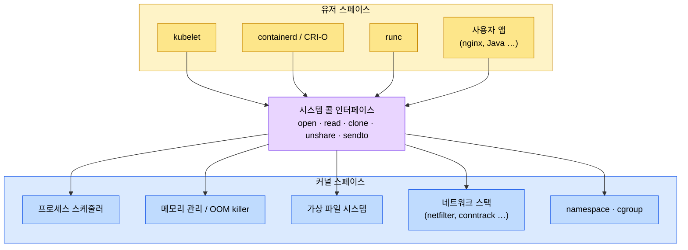
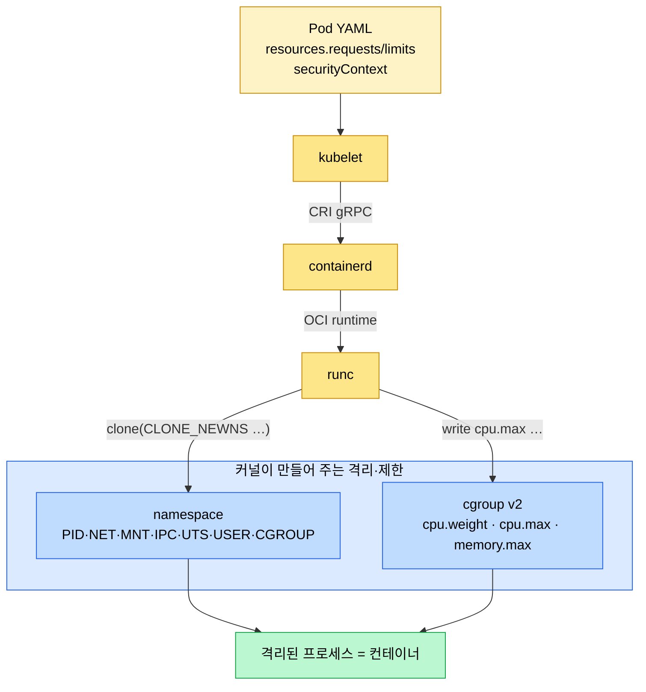
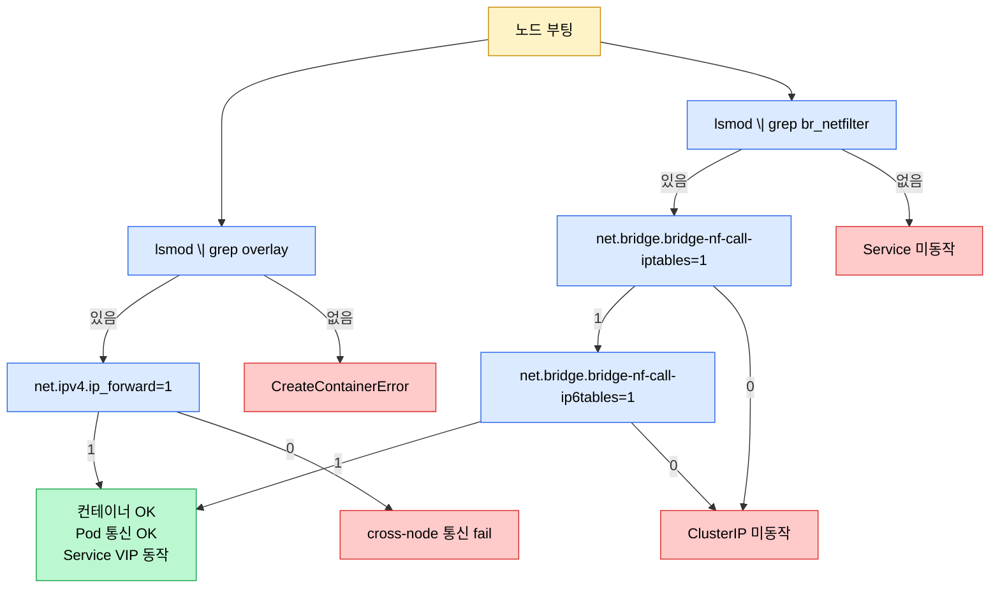

# 커널과 컨테이너
---
> Kubernetes는 지시자고 Linux 커널은 실행자다. Pod, CPU 리미트, OOMKilled, 컨테이너 이미지 마운트, 네트워크 격리는 모두 커널의 namespace, cgroup, VFS, 시스템 콜, /proc 위에서 일어난다. 이 문서는 K8s 추상이 어디로 내려가는지 한 단계 아래에서 본다.


## 학습 목표
> "kubectl apply 한 줄이 커널 어느 자료구조까지 닿는가"를 추적할 수 있게 만든다.

이 장에서 확인할 목표는 다음과 같다:

1. **유저 스페이스**와 **커널 스페이스** 분리 이유와 시스템 콜 인터페이스의 역할을 설명할 수 있다.
2. **커널 코어 7대 영역(스케줄러·메모리·VFS·네트워크 스택·IPC·LSM·블록·디바이스)**이 컨테이너 동작에서 어떤 책임을 맡는지 구분할 수 있다.
3. namespace와 cgroup의 차이를 "격리"와 "제한"으로 분리해서 설명할 수 있다.
4. K8s 노드가 컨테이너를 띄우려면 부팅 시 어떤 커널 모듈과 sysctl이 준비돼 있어야 하는지 체크리스트로 확인할 수 있다.
5. `requests.cpu`/`limits.memory` 같은 K8s 사양이 cgroup의 어느 파일로 내려가는지 매핑할 수 있다.


## 1. 유저 스페이스와 커널 스페이스
> 모든 K8s 컴포넌트는 유저 스페이스에서 돌고, 실제 동작은 시스템 콜을 타고 커널 스페이스로 내려간다.

Linux는 메모리를 두 영역으로 나눈다. 

1. **유저 스페이스**에는 `kubelet`, `containerd`, `CoreDNS`, `Ingress Controller`, 그리고 사용자가 만든 앱이 있다. 
2. **커널 스페이스**에는 프로세스 스케줄러, 메모리 관리, VFS, 네트워크 스택, namespace, cgroup이 있다. 

두 영역 사이의 유일한 통로가 시스템 콜 인터페이스다.

분리 이유는 두 가지다. 

1. **첫째는 보안이다**. 유저 스페이스가 직접 하드웨어를 조작할 수 있다면 어떤 프로세스도 다른 프로세스의 메모리를 읽거나 디스크를 망가뜨릴 수 있다. 
2. **둘째는 안정성이다.** nginx가 크래시하면 그 프로세스만 죽지만, 커널이 크래시하면 노드 전체가 NotReady로 빠지고 그 위에 떠 있던 Pod 전부가 다른 노드로 재스케줄된다(커널 패닉).

K8s 맥락에서 이 분리가 의미하는 바는 단순하다. kubelet이 "Pod를 만들어 줘"라고 결정해도 직접 만들지는 않는다. kubelet은 containerd에 gRPC 호출을 보내고, containerd는 runc를 호출하고, runc는 `clone`/`unshare` 같은 시스템 콜로 커널에 namespace 생성과 cgroup 설정을 요청한다. K8s 컴포넌트는 전부 유저 스페이스 데몬이고, "실제로 격리된 프로세스를 띄우는 일"은 커널이 한다.




## 2. 시스템 콜
> 컨테이너의 격리는 결국 몇 개의 시스템 콜에서 시작한다.

최신 커널 기준으로 시스템 콜은 약 460개 있다. 인프라 엔지니어가 전부 외울 필요는 없지만, 컨테이너와 직결되는 것들은 분리해서 알아 두면 디버깅과 보안 설계에 곧장 쓰인다.

| 시스템 콜 | 용도 | 컨테이너 관점 |
|-----------|------|---------------|
| `open` / `read` / `write` | 파일 IO | `cat /proc/cpuinfo`, 컨테이너 로그 출력 |
| `clone` | 새 프로세스 생성 | 플래그(`CLONE_NEWNS`, `CLONE_NEWPID` …)로 namespace 분리 |
| `unshare` | 자기 자신 namespace 분리 | 컨테이너 격리의 핵심 |
| `setns` | 기존 namespace에 진입 | `nsenter`, `kubectl debug` |
| `sendto` / `recvfrom` | 네트워크 IO | 모든 Pod 트래픽 |
| `mount` / `pivot_root` | 파일 시스템 마운트 | 이미지 레이어 합성, rootfs 전환 |

컨테이너 런타임은 `strace -e clone,unshare runc` 같은 명령으로 추적해 보면 컨테이너 생성 시점에 정확히 이 호출들이 찍힌다.

K8s 보안 측면에서 이 460개는 공격 표면이다. 

- nginx 같은 워크로드가 컨테이너 안에서 `init_module`이나 `keyctl` 같은 위험한 시스템 콜을 자유롭게 부를 수 있다면, 취약점을 통해 컨테이너 탈출(container escape)이 일어나 노드 전체가 넘어간다. 
- 그래서 Pod의 `securityContext`나 `seccompProfile`로 시스템 콜 화이트리스트를 강제하는 것이 표준 패턴이다. 보안 정책 자체의 운영은 [10-02 RBAC과 보안](../../09_cloud/kubernetes/10-02.RBAC%EA%B3%BC%20%EB%B3%B4%EC%95%88.md)에서 다룬다.


## 3. 커널 코어 7대 영역
> 컨테이너에서 발생하는 거의 모든 현상은 이 일곱 영역 중 하나로 환원된다.

커널 코어는 부팅 시 컴파일 바이너리에 내장돼 있어 modprobe로 떼었다 붙였다 할 수 없다. 이 중 하나라도 빠지면 부팅 자체가 안 된다.

| 영역 | 책임 | K8s 연결 |
|------|------|----------|
| 프로세스 스케줄러 | CPU 시간을 프로세스에게 가중치/상한으로 분배 | `requests.cpu` → `cpu.weight`, `limits.cpu` → `cpu.max` (CPU throttling) |
| 메모리 관리 | RAM 할당·회수, OOM killer | `limits.memory` → `memory.max`, 초과 시 OOMKilled |
| VFS (가상 파일 시스템) | ext4·overlay·proc·sysfs를 통일된 인터페이스로 | 컨테이너 이미지 레이어 합성, `/proc`·`/sys` 노출 |
| 네트워크 스택 | TCP/UDP, IP, netfilter, conntrack | 모든 Pod 통신, kube-proxy의 nftables 규칙 |
| IPC | 공유 메모리, 세마포어, 시그널 | 같은 Pod 컨테이너끼리는 IPC namespace 공유, 다른 Pod와는 격리 |
| LSM·seccomp | 파일·자원 접근 제어, 시스템 콜 차단 | SELinux/AppArmor + Pod `seccompProfile` |
| 블록 레이어·디바이스 모델 | 디스크 IO 스케줄링, GPU 같은 장치 노출 | CSI 드라이버, Device Plugin (GPU/SR-IOV) |

- 이 표를 머릿속에 두면 K8s 장애 대부분이 어느 영역의 문제인지 빠르게 좁혀진다. 
- CPU throttling은 스케줄러 영역, OOMKilled는 메모리 관리 영역, "Pod가 안 뜬다"가 ImagePullBackOff면 VFS·블록 레이어, "Pod끼리는 되는데                                                                                                                                                                                                                                                                                                                                                                                                                                                                                                                                                                                                                                                                                                                                                                                                                 Service가 안 된다"는 네트워크 스택. CPU·메모리 운영 디테일은 [10-03 자원 관리](../../09_cloud/kubernetes/10-03.%EC%9E%90%EC%9B%90%20%EA%B4%80%EB%A6%AC.md)와 짝을 이뤄 보면 좋다.


## 4. 네임스페이스와 cgroup
> **namespace**는 "무엇을 볼 수 있는가"를, **cgroup**은 "얼마나 쓸 수 있는가"를 격리한다.

**네임스페이스(namespace)는 프로세스에게 독립된 세계를 보여 준다**. 

- 컨테이너 안에서 PID가 1번이어도 호스트에서는 평범한 수천 번대 프로세스로 보인다. 
- 네임스페이스는 7종이 있다(PID, NET, MNT, IPC, UTS, USER, CGROUP). 각각이 프로세스 트리, 네트워크 스택, 마운트 포인트, IPC 객체, 호스트네임, 사용자 ID, cgroup 계층을 격리한다.

**cgroup(control group)은 자원 사용량을 제한하고 회계한다**. 

- CPU 가중치, CPU 상한, 메모리 상한, IO 대역폭이 전부 cgroup 파일에 적힌 숫자다. 
- K8s 1.35부터 cgroup v2가 필수다. v2는 단일 트리 구조에 컨트롤러를 붙이는 방식이라 v1의 컨트롤러별 분리 트리보다 일관된다.

두 메커니즘 모두 커널 코어에 컴파일 내장된 기능이다. modprobe로 로드하지 않으며, 필수 영역이라 빠질 수 없다. 컨테이너의 정의를 한 줄로 줄이면 "namespace로 격리되고 cgroup으로 제한된 Linux 프로세스"다.




## 5. 커널 모듈
> overlay와 br_netfilter는 K8s 노드를 띄우기 전에 반드시 로드돼 있어야 하는 두 모듈이다.

코어와 달리 모듈은 부팅 후 동적으로 붙였다 뗐다 할 수 있다. `lsmod`로 현재 로드된 목록을 보고, `modprobe <name>`으로 적재하며, `modinfo <name>`으로 메타데이터를 본다.

K8s가 의존하는 두 모듈은 명확하다.

- `overlay` — 컨테이너 이미지는 우분투 베이스, 라이브러리, 앱이 여러 레이어로 쌓인 구조다. overlay 파일 시스템이 그 레이어를 하나로 합성해 단일 rootfs로 보여 준다. 모듈이 로드돼 있지 않으면 containerd가 이미지 레이어를 합치지 못하고 `CreateContainerError`로 실패한다.
- `br_netfilter` — Linux bridge를 통과하는 트래픽이 기본적으로는 iptables 규칙을 거치지 않는다. 이 모듈이 로드돼야 브리지 트래픽이 강제로 netfilter 훅을 타고, kube-proxy가 심어 둔 DNAT 규칙으로 Service VIP가 실제 Pod IP로 변환된다. 없으면 Service가 작동하지 않는다.

K8s 노드 부팅 스크립트에 `modprobe overlay`와 `modprobe br_netfilter`가 빠지지 않는 이유다. 이 모듈이 노드 운영 중에 풀리는 일은 거의 없지만, 이미지 빌드를 잘못해 모듈이 빠진 커널로 부팅한 경우 같은 사고는 종종 본다.


## 6. /proc 가상 파일 시스템
> /proc은 디스크에 0바이트인데도 텍스트로 모든 커널 상태를 보여 준다.

`du -sh /proc`을 찍어 보면 0이 나온다. 그런데 `cat /proc/cpuinfo`나 `cat /proc/meminfo`는 풍부한 텍스트를 출력한다. 이 모순이 procfs의 본질이다.

procfs는 디스크에 저장된 파일이 아니라 커널이 RAM에 들고 있는 자료구조를 "파일처럼 보이게" 노출하는 가상 파일 시스템이다. `cat`이 `read` 시스템 콜을 부르는 순간 커널이 그 시점의 내부 상태(예: CPU 정보, 메모리 통계)를 텍스트로 렌더링해 돌려준다.

`strace -e openat,read,write cat /proc/cpuinfo`를 돌려 보면 흐름이 명확하다.

1. `openat(AT_FDCWD, "/proc/cpuinfo", O_RDONLY) = 3` — 커널이 fd 3을 돌려준다.
2. `read(3, "processor : 0 …", 8192) = 2360` — 커널이 RAM 상태를 그 자리에서 직렬화해 2360바이트를 채운다.
3. `write(1, "processor : 0 …", 2360) = 2360` — 그 텍스트를 stdout으로 흘려보낸다.

K8s 운영자에게 procfs가 중요한 이유는 두 가지다.

1. 첫째, 노드 진단 명령 대부분이 procfs를 읽는다 — `top`, `free`, `ps`, `lsof` 모두 `/proc/<pid>/...`를 파싱한다. 
2. 둘째, sysctl(`/proc/sys/...`)가 K8s가 의존하는 커널 파라미터의 진입점이다(다음 절).

`/proc/<pid>/ns/`에는 그 프로세스가 속한 namespace의 inode 번호가 심볼릭 링크로 노출된다. 두 컨테이너의 `ns/net` inode가 같으면 같은 네트워크 namespace고, 다르면 격리돼 있다 — Pod 안 컨테이너끼리는 같고, Pod끼리는 다르다는 것이 한 줄로 검증된다.


## 7. K8s 노드 필수 커널 파라미터
> 다섯 가지가 모두 만족돼야 컨테이너가 정상적으로 뜨고 Service가 작동한다.

kubeadm·kubespray가 노드 부팅 시 강제하는 항목이다. 하나라도 빠지면 그 즉시 어떤 K8s 기능이 깨지는지 매핑해 둔다.

| 항목 | 검증 명령 | 기대값 | 실패 시 증상 |
|------|-----------|--------|--------------|
| `overlay` 모듈 | `lsmod \| grep overlay` | 출력 있음 | 컨테이너 생성 시 `CreateContainerError` |
| `br_netfilter` 모듈 | `lsmod \| grep br_netfilter` | 출력 있음 | Service VIP가 Pod로 안 풀림(브리지가 iptables를 안 거침) |
| IPv4 forwarding | `cat /proc/sys/net/ipv4/ip_forward` | `1` | 다른 노드의 Pod로 가는 패킷이 drop돼 cross-node Pod 통신 실패 |
| 브리지 → iptables | `cat /proc/sys/net/bridge/bridge-nf-call-iptables` | `1` | DNAT 미적용으로 ClusterIP가 안 풀림 |
| 브리지 → ip6tables | `cat /proc/sys/net/bridge/bridge-nf-call-ip6tables` | `1` | IPv6 트래픽에서 동일한 증상 |

순서도 의미가 있다. 모듈이 먼저 로드돼야 sysctl 항목 자체가 procfs에 생긴다 — `br_netfilter`가 없으면 `/proc/sys/net/bridge/` 디렉토리가 존재하지 않고, 거기에 sysctl을 설정하려 하면 그대로 실패한다. 그래서 cloud-init이나 systemd unit이 모듈 로드를 sysctl 적용 앞 단계에 둔다.

K8s 네트워킹 측면의 디버깅 시퀀스는 [01-01 네트워킹 기초](../networking/01-01.%EB%84%A4%ED%8A%B8%EC%9B%8C%ED%82%B9%20%EA%B8%B0%EC%B4%88.md) 8절에서 이어진다.




## 8. K8s 사양에서 cgroup까지
> Pod YAML의 숫자가 cgroup의 어느 파일로 내려가는지 한 번에 본다.

cgroup v2가 K8s 1.35부터 필수가 되면서 매핑이 깔끔해졌다. Pod 사양과 cgroup 파일 경로를 옆에 두면 OOMKilled나 throttling이 났을 때 어디를 읽어야 하는지 곧장 보인다.

| Pod 사양 | cgroup v2 파일 | 의미 |
|----------|----------------|------|
| `resources.requests.cpu: 500m` | `cpu.weight` | CPU 경합 시 가중치(500m → 약 weight 5의 비례 환산). CPU 여유가 있으면 더 써도 됨 |
| `resources.limits.cpu: 1` | `cpu.max` | CPU 절대 상한. 초과 시 throttling, `kubectl top`에서 throttle 누적 확인 가능 |
| `resources.requests.memory: 256Mi` | (스케줄링 힌트) | cgroup에는 직접 매핑되지 않음. kube-scheduler의 노드 선택에 사용 |
| `resources.limits.memory: 512Mi` | `memory.max` | 메모리 절대 상한. 초과 순간 OOM killer가 컨테이너 종료 → `OOMKilled` |
| `securityContext.seccompProfile` | (커널 seccomp filter) | 시스템 콜 화이트리스트. 위반 시 `EPERM` 또는 프로세스 종료 |
| `securityContext.capabilities.drop` | (커널 capabilities bitmap) | 루트 프로세스의 권한 축소 |

장애 시 추적 순서는 단순하다. `kubectl describe pod`로 종료 사유(`OOMKilled`, `Error`)를 확인한 뒤, 노드에서 해당 Pod의 cgroup 경로(`/sys/fs/cgroup/kubepods.slice/...`)를 찾아 `memory.max`, `memory.current`, `cpu.stat`의 throttle 카운터를 본다. K8s가 보여 주는 한 줄 사유 뒤에 실제로 어떤 cgroup 파일이 한계를 넘었는지 가 진짜 답이다.

`MemTotal`과 물리 RAM이 다르다는 점도 운영에서 자주 걸린다. 4GiB 인스턴스의 `/proc/meminfo`를 보면 `MemTotal`은 약 3.74GiB로 찍힌다. 차이는 부팅 시 커널이 자기 운영을 위해 떼어 둔 영역이다. 그래서 노드의 allocatable 계산은 `MemTotal`에서 system-reserved와 kube-reserved를 또 빼고 시작한다. swap은 K8s가 메모리 관리 예측 가능성을 위해 끄는 것이 표준이다(1.22부터 베타 swap 지원이 들어왔지만 운영 기본값은 여전히 off).


## 9. strace로 본 runc create
> "kubectl apply 한 줄"이 시스템 콜로 어떻게 풀리는지 한 번 추적하면, 앞 1~8절이 한 흐름으로 묶인다.

containerd가 OCI 런타임 `runc`를 호출해 컨테이너를 만들 때 일어나는 시스템 콜 시퀀스는 다음과 같다. 추적 명령은 다음 한 줄로 충분하다.

```bash
strace -f -e trace=clone3,unshare,setns,mount,pivot_root,prctl,seccomp,execve \
       -o /tmp/runc.trace runc create --bundle /run/containerd/.../config <id>
```

핵심 흐름을 syscall 단위로 정리하면 다음 표가 된다.

| 단계 | 시스템 콜 | 의미 |
|------|-----------|------|
| 1. 새 프로세스 + namespace 생성 | `clone3({flags=CLONE_NEWNS\|CLONE_NEWUTS\|CLONE_NEWIPC\|CLONE_NEWPID\|CLONE_NEWNET, ...})` | 마운트·UTS·IPC·PID·NET namespace를 한 번에 분리한 자식 프로세스 생성 |
| 2. 마운트 ns 격리 강화 | `mount("", "/", NULL, MS_REC\|MS_PRIVATE, NULL)` | 자식 마운트 트리를 부모로부터 private로 분리 (propagation 설계) |
| 3. rootfs 준비 | `mount("/var/lib/.../rootfs", "/var/lib/.../rootfs", NULL, MS_BIND\|MS_REC, NULL)` | 이미지 레이어 합성 결과물을 bind |
| 4. 추가 마운트 | `mount("proc", "/proc", "proc", ...)` 등 | `/proc`, `/sys`, `/dev` 등 컨테이너 표준 마운트 |
| 5. 루트 전환 | `pivot_root("/var/lib/.../rootfs", ".pivot_root")` | 컨테이너 rootfs를 새 `/`로 만들고 옛 root를 옆에 둠 |
| 6. 옛 root unmount | `umount2(".pivot_root", MNT_DETACH)` | 호스트 파일 시스템 자취 제거 |
| 7. capabilities 축소 | `prctl(PR_CAP_AMBIENT, ...)`, `capset(...)` | Pod `securityContext.capabilities.drop` 적용 |
| 8. seccomp filter 등록 | `seccomp(SECCOMP_SET_MODE_FILTER, ...)` | Pod `securityContext.seccompProfile`에 정의된 syscall 화이트리스트 적용 |
| 9. cgroup 진입 | `write("/sys/fs/cgroup/.../cgroup.procs", "<pid>")` | systemd 위임 트리의 컨테이너 cgroup에 자기 PID 등록 |
| 10. 사용자 진입점 실행 | `execve("/usr/sbin/nginx", ...)` | 컨테이너 main process 시작, 이 시점부터 PID 1 |

이 시퀀스에서 1~6은 §4(namespace)와 §3(VFS)을 묶고, 7~8은 §2(syscall) 보안 측면, 9는 §3 표의 cgroup 매핑(다음 단계의 [01-02 cgroup v2 깊이](./01-02.cgroup%20v2%20%EA%B9%8A%EC%9D%B4.md))과 §7(필수 sysctl)이 사전 조건을 만족했어야 동작한다. 그러니까 K8s 컨테이너 동작은 본 문서가 다룬 영역이 한 줄로 이어진 결과다.

마운트 propagation이 미세하게 어긋나면 2~5 사이에서 sub-mount 가시성이 어긋나 CSI 같은 시나리오가 깨진다. 이 부분은 [01-03 마운트 네임스페이스와 propagation](./01-03.%EB%A7%88%EC%9A%B4%ED%8A%B8%20%EB%84%A4%EC%9E%84%EC%8A%A4%ED%8E%98%EC%9D%B4%EC%8A%A4%EC%99%80%20propagation.md)에서 별도로 다룬다.


## 다음 단계
> 한 단계 위(K8s 추상)와 같은 단계(다른 Linux 영역)로 흩어진다.

K8s 측면의 패킷 흐름은 [Pod 네트워크와 Linux 기반](../../09_cloud/kubernetes/04-02.Pod%20%EB%84%A4%ED%8A%B8%EC%9B%8C%ED%81%AC%EC%99%80%20Linux%20%EA%B8%B0%EB%B0%98.md)에서 본 문서의 namespace·VFS·시스템 콜이 실제로 어떻게 결합되는지 보여 준다. 같은 카테고리 안에서는 [01-01 Linux 네트워킹 기초](../networking/01-01.%EB%84%A4%ED%8A%B8%EC%9B%8C%ED%82%B9%20%EA%B8%B0%EC%B4%88.md)가 본 문서 6절(`/proc`)과 7절(`bridge-nf-call-iptables`)의 sysctl 항목을 깊게 다룬다.


## 관련 문서
> Linux 카테고리 안과 K8s 카테고리의 짝 문서를 함께 둔다.

- [Linux 네트워킹 기초](../networking/01-01.%EB%84%A4%ED%8A%B8%EC%9B%8C%ED%82%B9%20%EA%B8%B0%EC%B4%88.md) — 네트워크 namespace·veth·netfilter·conntrack
- [Pod 네트워크와 Linux 기반](../../09_cloud/kubernetes/04-02.Pod%20%EB%84%A4%ED%8A%B8%EC%9B%8C%ED%81%AC%EC%99%80%20Linux%20%EA%B8%B0%EB%B0%98.md) — K8s 측에서 본 같은 메커니즘
- [자원 관리](../../09_cloud/kubernetes/10-03.%EC%9E%90%EC%9B%90%20%EA%B4%80%EB%A6%AC.md) — Requests/Limits, QoS, allocatable 계산
- [RBAC과 보안](../../09_cloud/kubernetes/10-02.RBAC%EA%B3%BC%20%EB%B3%B4%EC%95%88.md) — Pod Security Standards, seccomp, capabilities 운영
