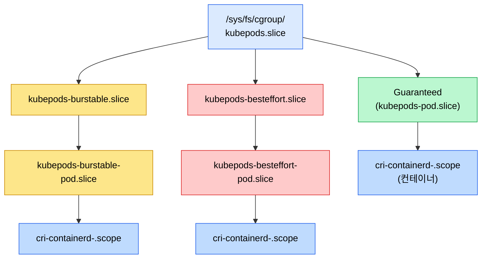
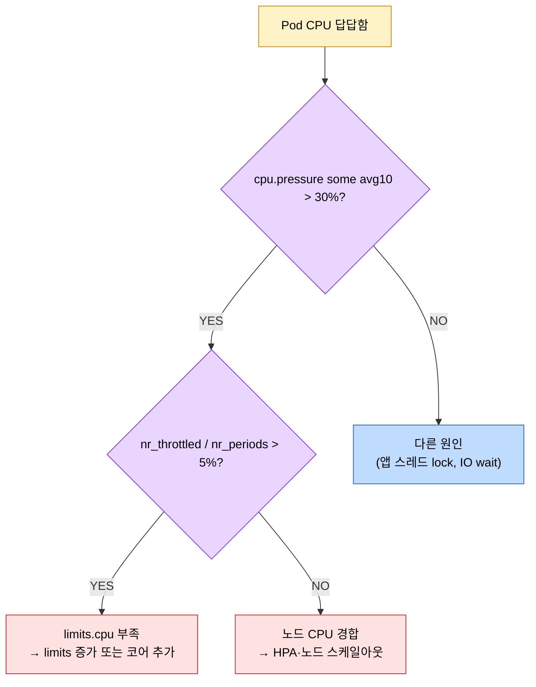

# cgroup v2 깊이
---
> Pod의 `requests`/`limits` 한 줄이 cgroup의 어느 파일에 어떻게 쓰이는지, throttling/OOMKilled가 났을 때 어디를 읽어야 하는지를 단일 트리 구조 위에서 정리한다. K8s 1.25 GA, 1.35 필수.


## 학습 목표
> cgroup v2의 인터페이스 파일을 직접 읽고 K8s의 자원 운영 결정과 매칭할 수 있게 만든다.

이 장에서 확인할 목표는 다음과 같다:

1. cgroup v2가 v1과 어떻게 다른지(단일 트리, 통합 인터페이스)를 설명할 수 있다.
2. cpu·memory·io 컨트롤러의 핵심 인터페이스 파일을 읽고 의미를 해석할 수 있다.
3. PSI(Pressure Stall Information)로 자원 경합을 시간 창 단위로 진단할 수 있다.
4. K8s `kubepods.slice` 트리에서 Guaranteed/Burstable/BestEffort QoS가 어떤 위치에 매핑되는지 그릴 수 있다.
5. throttling, OOMKilled, IO 정체 같은 운영 사고를 cgroup 파일을 직접 읽어 좁혀 들어갈 수 있다.


## 1. v1과 v2 — 무엇이 바뀌었는가
> v1은 컨트롤러마다 별도 트리, v2는 단일 트리에 컨트롤러를 켜고 끄는 구조다.

v1에서는 `/sys/fs/cgroup/cpu`, `/sys/fs/cgroup/memory`, `/sys/fs/cgroup/blkio`처럼 컨트롤러마다 독립된 트리가 있었다. 같은 프로세스가 컨트롤러별로 서로 다른 cgroup에 속할 수 있었고, 도구가 그 다중 소속을 일일이 추적해야 했다. v2는 `/sys/fs/cgroup` 하나만 두고 그 안의 디렉토리가 동시에 여러 컨트롤러의 단위가 된다.

핵심 인터페이스 파일은 다음과 같다.

| 파일 | 의미 |
|------|------|
| `cgroup.procs` | 이 cgroup에 속한 프로세스 PID 목록 |
| `cgroup.subtree_control` | 자식 cgroup이 활성화할 컨트롤러 (`+cpu +memory +io` 형식) |
| `cgroup.events` | populated 상태 변화 (last process leaves) |
| `cgroup.type` | `domain` 또는 `threaded` |
| `<controller>.<key>` | 컨트롤러별 설정·통계 (예: `cpu.max`, `memory.events`) |

"no-internal-process" 규칙도 함께 기억한다. 자식 cgroup이 있는 cgroup은 직접 프로세스를 가질 수 없다(threaded 타입 예외). 이 규칙 덕분에 자원 회계가 트리 안에서 충돌 없이 합산된다.

K8s 1.25에서 GA가 됐고 1.35부터는 cgroup v2가 필수다. v1 hybrid 모드는 더 이상 검증 대상이 아니다.


## 2. 컨트롤러별 핵심 파일
> cpu·memory·io 세 컨트롤러가 K8s 운영에서 가장 자주 본다.

### cpu

| 파일 | 의미 | K8s 매핑 |
|------|------|----------|
| `cpu.weight` | 1~10000 가중치, 기본 100 | `requests.cpu` (밀리코어 → weight 환산) |
| `cpu.max` | `<quota> <period>` 마이크로초. `max <period>`면 무제한 | `limits.cpu` |
| `cpu.stat` | `usage_usec`, `nr_periods`, `nr_throttled`, `throttled_usec` 누적 | throttling 진단 |
| `cpu.pressure` | PSI 시간 창 (다음 절) | 경합 강도 |

`cpu.weight`는 경합이 일어났을 때만 의미가 있다. 여유가 있으면 `requests` 이상도 쓴다. `cpu.max`가 진짜 상한이고, 초과 순간 throttled로 잡힌다.

### memory

| 파일 | 의미 | K8s 매핑 |
|------|------|----------|
| `memory.max` | 절대 상한 (바이트 또는 `max`) | `limits.memory` |
| `memory.high` | soft 상한, 넘으면 reclaim 압박 강해짐 | (K8s는 보통 미설정) |
| `memory.low` | reclaim 보호선 | (K8s는 보통 미설정) |
| `memory.current` | 현재 사용량 | 모니터링 |
| `memory.events` | `low`, `high`, `max`, `oom`, `oom_kill` 카운터 | OOMKilled 추적 |
| `memory.stat` | anon/file/kernel 분해 | 메모리 누수 분류 |
| `memory.pressure` | PSI | 정체 강도 |

`memory.max`는 hard limit이라 초과 순간 OOM killer가 cgroup 안에서 가장 큰 프로세스를 종료한다. K8s는 이 종료를 컨테이너 종료 사유 `OOMKilled`로 보고한다.

### io

| 파일 | 의미 |
|------|------|
| `io.max` | 디바이스별 read/write IOPS 또는 bytes/sec 상한 |
| `io.weight` | 비율 기반 분배 |
| `io.stat` | rbytes/wbytes/rios/wios 누적 |
| `io.pressure` | PSI |

K8s는 io 컨트롤러를 자동 매핑하지 않는다. 디스크 경쟁이 문제라면 노드 단위에서 systemd Slice unit이나 BPF로 걸어 두는 패턴이 흔하다.


## 3. PSI — Pressure Stall Information
> "지금 자원이 부족한가"를 시간 창 단위로 한 줄에 보여 준다.

cpu.pressure, memory.pressure, io.pressure 파일은 다음 형태다.

```
some avg10=12.34 avg60=10.0 avg300=8.0 total=123456789
full avg10=2.0  avg60=1.5  avg300=0.7 total=12345678
```

`some`은 한 task라도 자원을 기다리느라 stall된 시간 비율, `full`은 모든 task가 stall된 시간 비율이다. avg10은 직전 10초 평균, avg60·avg300은 1분·5분 평균. K8s 운영에서는 다음처럼 쓴다.

- `cpu.pressure`의 `some avg10`이 50% 넘게 지속 → CPU 경합 (HPA 또는 노드 추가)
- `memory.pressure`의 `full avg60` 의미 있게 잡힘 → reclaim에 시간을 쓰는 중, OOM 임박
- `io.pressure`의 `some avg300` 누적 → 디스크 IO 병목

Kubelet의 eviction signal에 PSI 기반 임계값이 들어가 있고(1.32부터 베타), HPA의 External metric으로 PSI를 끌어와 스케일링 시그널로 쓰는 사례도 있다.


## 4. delegation과 systemd 통합
> kubelet은 보통 systemd를 cgroup 드라이버로 쓴다. 그 결과가 `kubepods.slice`다.

kubelet은 `--cgroup-driver=systemd`(권장)나 `--cgroup-driver=cgroupfs`로 동작한다. systemd 모드에서 kubelet은 직접 `/sys/fs/cgroup`을 만지지 않고, systemd에 transient slice unit 생성을 요청한다. systemd가 만든 단위가 `kubepods.slice`고 그 안에 Pod별 sub-slice가 들어간다.

위임(delegation)은 v2의 핵심 모델이다. 부모 cgroup(systemd 관리)이 자식(kubepods.slice)에게 `cgroup.subtree_control`로 컨트롤러 활성화를 위임한다. 이 위임이 없으면 kubelet이 Pod cgroup의 cpu.max를 쓸 권한 자체가 없다.

```bash
# kubepods.slice 위치
ls /sys/fs/cgroup/kubepods.slice/
cat /sys/fs/cgroup/kubepods.slice/cgroup.subtree_control
# 출력 예: cpu memory pids io
```


## 5. kubepods.slice 트리 — QoS 매핑
> Guaranteed, Burstable, BestEffort 세 QoS 클래스가 트리 위치로 갈린다.

K8s가 만드는 cgroup 구조는 다음 형태다.



QoS 분류 규칙은 단순하다.

- **Guaranteed**: 모든 컨테이너의 모든 리소스(cpu·memory)에 `requests == limits`
- **Burstable**: requests만 있거나 requests < limits
- **BestEffort**: requests/limits 모두 없음

같은 노드 메모리 압박이 오면 BestEffort가 가장 먼저 evict되고, 다음이 Burstable, 마지막이 Guaranteed다. cgroup 위치 자체가 그 우선순위를 표현한다.

특정 Pod의 cgroup을 찾는 한 줄은 다음과 같다.

```bash
POD_UID=$(kubectl get pod my-pod -o jsonpath='{.metadata.uid}')
find /sys/fs/cgroup -name "*${POD_UID//-/_}*"
```


## 6. throttling 분석
> `cpu.stat`만 한 번 더 읽으면 "이 컨테이너가 throttling 당했는가"가 명확하다.

```bash
cat /sys/fs/cgroup/kubepods.slice/.../cpu.stat
# usage_usec 12345678
# user_usec 11000000
# system_usec 1345678
# nr_periods 5000
# nr_throttled 312
# throttled_usec 4500000
```

해석은 단순하다. `nr_throttled / nr_periods`가 throttling 비율, `throttled_usec`이 누적 정체 시간. 6.2% 이상 throttled가 지속되면 그 Pod는 limits를 늘려야 한다.



throttled가 보이면 cpu.max 자체가 부족한 것이고, 그렇지 않은데 PSI가 높으면 노드 전체 경합 문제다.


## 7. OOM 분석
> `memory.events`의 `oom_kill` 카운터가 OOMKilled의 진실이다.

`kubectl describe pod`가 `OOMKilled`라고 알려 줘도, 정확히 cgroup의 어느 한계가 깨졌는지는 cgroup 파일을 봐야 안다.

```bash
cat memory.events
# low 0
# high 0
# max 0
# oom 12
# oom_kill 1
```

- `oom_kill`이 1 이상이면 cgroup 내부 OOM killer가 동작했다 → 컨테이너의 `limits.memory` 부족
- `oom_kill`은 0인데 `oom`이 누적된다 → 메모리 압박은 있었지만 killer까지 안 갔다(reclaim으로 회피)
- 노드 OOM은 cgroup OOM과 다르다 — 노드 전체 메모리 부족이면 dmesg에 `Out of memory: Killed process ...`가 찍히고, kubelet의 SystemOOM 이벤트로도 잡힌다

`memory.stat`로 anon, file, kernel 메모리를 분해해 보면 누수 원인 분류가 쉽다.

```bash
grep -E "^(anon|file|kernel|slab) " memory.stat
```

`file`이 큰데 `anon`이 작으면 페이지 캐시가 쌓인 것뿐이고, `anon`이 한계까지 차면 진짜 누수다.


## 8. 운영 시퀀스 정리
> Pod가 자원 문제를 일으킬 때 cgroup을 어떻게 읽는지 한 번에 본다.

1. `kubectl describe pod`로 종료 사유와 컨테이너 ID 확인
2. 노드에서 Pod UID로 cgroup 디렉토리 찾기 (`find /sys/fs/cgroup -name "*<UID>*"`)
3. CPU 문제: `cpu.stat` 읽고 `nr_throttled`, `cpu.pressure` 확인
4. 메모리 문제: `memory.events`의 `oom_kill`, `memory.stat`, `memory.pressure` 확인
5. IO 문제: `io.stat`, `io.pressure` 확인
6. 노드 측 OOM이면 `dmesg | grep -i "killed process"` 추가 확인
7. 결론에 따라 `requests`/`limits` 조정 또는 노드 스케일

K8s 자원 정책 자체는 [10-03 자원 관리](../../09_cloud/kubernetes/10-03.%EC%9E%90%EC%9B%90%20%EA%B4%80%EB%A6%AC.md)에서 설계 측면을 다룬다.


## 다음 단계
> 컨테이너의 다른 한 축인 마운트 네임스페이스로 넘어간다.

- 컨테이너의 마운트 격리: [01-03 마운트 네임스페이스와 propagation](./01-03.%EB%A7%88%EC%9A%B4%ED%8A%B8%20%EB%84%A4%EC%9E%84%EC%8A%A4%ED%8E%98%EC%9D%B4%EC%8A%A4%EC%99%80%20propagation.md)
- 같은 카테고리 상위 정리: [01-01 커널과 컨테이너](./01-01.%EC%BB%A4%EB%84%90%EA%B3%BC%20%EC%BB%A8%ED%85%8C%EC%9D%B4%EB%84%88.md) §3·§4
- K8s 측면 운영: [자원 관리](../../09_cloud/kubernetes/10-03.%EC%9E%90%EC%9B%90%20%EA%B4%80%EB%A6%AC.md)


## 관련 문서
> cgroup이 위치하는 트리와 그 위에서 K8s가 만들어 내는 추상을 함께 둔다.

- [커널과 컨테이너](./01-01.%EC%BB%A4%EB%84%90%EA%B3%BC%20%EC%BB%A8%ED%85%8C%EC%9D%B4%EB%84%88.md) — namespace·cgroup 개요
- [자원 관리](../../09_cloud/kubernetes/10-03.%EC%9E%90%EC%9B%90%20%EA%B4%80%EB%A6%AC.md) — Requests/Limits, QoS, allocatable 운영
- [모니터링과 트러블슈팅](../../09_cloud/kubernetes/10-01.%EB%AA%A8%EB%8B%88%ED%84%B0%EB%A7%81%EA%B3%BC%20%ED%8A%B8%EB%9F%AC%EB%B8%94%EC%8A%88%ED%8C%85.md) — 노드 단위 진단
