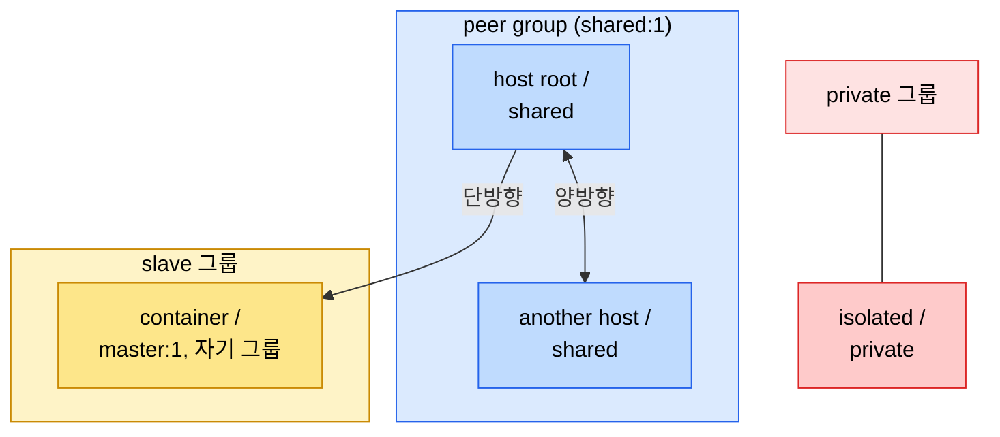
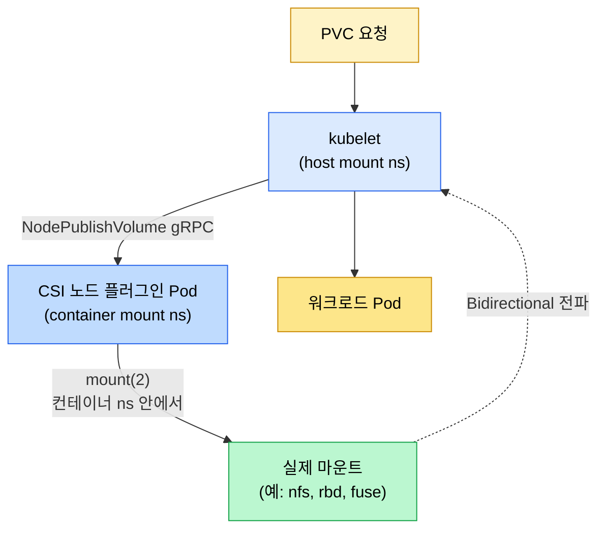

# 마운트 네임스페이스와 propagation
---
> 컨테이너 안에서 `mount`했는데 호스트가 못 보거나, Pod를 지웠는데 호스트에 마운트가 남거나, CSI 드라이버가 PVC를 못 붙이는 사고는 거의 다 propagation 설정 미스에서 나온다. 4개의 propagation 타입과 K8s `mountPropagation` 옵션을 한 번에 정리한다.


## 학습 목표
> 마운트 네임스페이스 격리 모델 위에서 K8s 볼륨 운영 사고를 추적할 수 있게 만든다.

이 장에서 확인할 목표는 다음과 같다:

1. 마운트 네임스페이스(`CLONE_NEWNS`)가 무엇을 격리하는지 설명할 수 있다.
2. propagation 4가지(private/shared/slave/unbindable)와 peer group 개념을 구분할 수 있다.
3. K8s `mountPropagation` 옵션 3종(None/HostToContainer/Bidirectional)이 어느 propagation 타입에 대응하는지 매핑할 수 있다.
4. CSI 드라이버가 왜 Bidirectional propagation을 요구하는지 설명할 수 있다.
5. mount leak, host volume invisible, PVC stuck 같은 운영 사고를 propagation 관점에서 좁힐 수 있다.


## 1. 마운트 네임스페이스
> 각 네임스페이스는 자기만의 마운트 트리를 갖는다. unshare(CLONE_NEWNS)로 분리한다.

마운트 네임스페이스는 `struct mnt_namespace`로 표현되며, 안에 마운트 포인트들의 트리를 들고 있다. `unshare(CLONE_NEWNS)`나 `clone(CLONE_NEWNS)` 시점에 부모의 마운트 트리가 복제돼 자식 네임스페이스의 초기 상태가 된다. 이 시점부터 자식이 만든 새 마운트는 propagation 규칙이 허용하지 않는 한 부모에 보이지 않고, 부모의 마운트도 자식에 보이지 않는다.

```bash
unshare --mount --propagation private bash    # 새 마운트 ns 진입
mount -t tmpfs none /mnt                      # 자식만 보임
cat /proc/self/mountinfo | grep /mnt          # 자식: 보임
# 다른 셸(부모 ns)에서: cat /proc/<orig_pid>/mountinfo | grep /mnt → 안 보임
```

`/proc/self/mountinfo`의 각 줄에 propagation 타입이 적혀 있다. 형식은 다음과 같다.

```
36 35 98:0 /mnt /var/lib/foo rw,relatime shared:1 - ext4 /dev/sda1 rw
                                            ^^^^^^^^
                                            propagation flag
```

`shared:N`은 peer group ID, `master:N`은 slave 관계의 master, 아무 표시도 없으면 private다.


## 2. propagation 4가지
> private/shared/slave/unbindable. 이 네 가지가 마운트가 네임스페이스 사이에서 어떻게 전파되는지 결정한다.

| 타입 | mount(2) flag | 의미 |
|------|---------------|------|
| **private** | `MS_PRIVATE` | 어디로도 전파되지 않는다. 자식이든 부모든 영향 없음 |
| **shared** | `MS_SHARED` | peer group 내 모든 멤버에게 양방향 전파 |
| **slave** | `MS_SLAVE` | master로부터 단방향 수신만 한다 |
| **unbindable** | `MS_UNBINDABLE` | bind mount 자체가 불가능 (private + bind 차단) |

systemd 기본 정책이 `shared`라서 `/`은 보통 shared로 시작한다. 컨테이너 런타임은 격리를 위해 컨테이너 진입 직전 `mount --make-rprivate /`로 자식 네임스페이스의 모든 마운트를 private로 바꾼다(별도 옵션이 없다면).

```bash
findmnt -o TARGET,PROPAGATION /
# TARGET PROPAGATION
# /      shared
mount --make-private /tmp
findmnt -o TARGET,PROPAGATION /tmp
# /tmp   private
```


## 3. peer group과 전파 규칙
> shared·slave는 "peer group" 개념 위에 동작한다.

같은 peer group ID(`shared:1` 등)에 속한 마운트들은 서로 동등하다. 한쪽에서 sub-mount를 만들면 같은 그룹의 모두에게 동일한 sub-mount가 자동 생성된다. slave는 group 멤버가 아니라 외부 청취자로, master에서 일어난 sub-mount 변경만 받아 적용한다(반대 방향 전파 없음).



전파 규칙을 한 줄씩 정리하면 다음과 같다.

- **shared → shared**: 같은 peer group이면 양방향. 한쪽에서 마운트한 sub-mount가 다른 멤버에 즉시 보임
- **shared → slave**: master(shared)에서 일어난 변경만 slave가 받아 적음. slave 쪽에서 만든 마운트는 master에 안 보임
- **shared/slave → private**: 전파 없음
- **unbindable**: bind mount 자체가 차단(보안 격리 강화)


## 4. K8s mountPropagation 매핑
> Pod의 `volumeMounts[*].mountPropagation` 세 옵션이 propagation 타입에 일대일 대응한다.

| K8s 옵션 | 커널 propagation | 의미 | 사용 사례 |
|----------|------------------|------|----------|
| `None` (기본) | private | 호스트와 컨테이너의 마운트가 서로 무관 | 일반 Volume |
| `HostToContainer` | rslave (recursive slave) | 호스트가 마운트한 것을 컨테이너가 본다 (단방향) | NFS·CIFS 같은 네트워크 마운트가 호스트에서 일어날 때 |
| `Bidirectional` | rshared (recursive shared) | 양방향 전파, 컨테이너가 마운트해도 호스트가 본다 | CSI 드라이버, FUSE 드라이버 |

기본값이 `None`(private)인 이유는 보안 격리다. 컨테이너 안에서 마운트한 가짜 디바이스가 호스트로 새는 것을 막는다. `Bidirectional`은 `securityContext.privileged: true`가 같이 있어야 허용된다 — 양방향 전파가 곧 호스트 마운트 트리에 쓰는 권한이기 때문이다.

```yaml
spec:
  containers:
    - name: csi-driver
      securityContext:
        privileged: true        # Bidirectional 전제 조건
      volumeMounts:
        - name: plugin-dir
          mountPath: /var/lib/kubelet/plugins
          mountPropagation: Bidirectional
```


## 5. CSI 드라이버가 Bidirectional을 요구하는 이유
> kubelet이 호스트에서 마운트해야 하는데, 실제 마운트는 CSI 컨테이너 안에서 일어난다. 이 모순의 해법이 양방향 전파다.

CSI 모델에서 PVC 한 개가 Pod에 붙는 흐름은 다음과 같다.



CSI 드라이버는 별도 Pod로 떠 있고, 자기 마운트 네임스페이스가 따로 있다. 그 컨테이너 안에서 `mount(2)`를 호출해 실제 PVC를 마운트하지만, 그 결과를 kubelet의 호스트 마운트 트리(`/var/lib/kubelet/pods/<UID>/volumes/`)에서도 보여야 워크로드 Pod에 bind할 수 있다. Bidirectional 전파가 그 다리를 놓는다.

`mountPropagation: Bidirectional`이 빠지면 CSI 드라이버는 기능적으로 마운트하지만 kubelet에는 보이지 않고, PVC가 `MountVolume.SetUp failed` 또는 영원히 `Pending`으로 남는다.


## 6. 자주 보는 사고 패턴
> 운영에서 막히는 지점은 거의 정해져 있다.

### 6-1. Pod 삭제 후 호스트에 마운트가 남음 (mount leak)

증상: Pod는 사라졌는데 `mount | grep /var/lib/kubelet/pods/<UID>`가 살아 있다. 디스크 공간이 회수되지 않는다.

원인: 컨테이너 런타임이 마운트를 host ns에 생성했는데(주로 잘못된 propagation 설정으로) Pod 종료 시 unmount 시그널이 전달되지 않음. 또는 `MS_SHARED`가 아닌 곳에서 만들었는데 부모가 unmount를 모름.

대처: `umount`로 정리하고 propagation 설정을 점검. CSI 드라이버라면 `NodeUnpublishVolume`이 정상 호출되는지, kubelet 로그에서 cleanup 실패가 없는지 본다.

### 6-2. 호스트의 변경이 컨테이너에 안 보임

증상: HostPath로 마운트한 디렉토리에 호스트가 새 파일을 넣었는데 컨테이너가 못 본다.

원인: `mountPropagation`이 `None`(private)이어서 컨테이너가 호스트의 후속 마운트를 못 받는다. (파일 변경 자체는 보이지만 새 sub-mount는 안 보인다.)

대처: `mountPropagation: HostToContainer`로 변경. inotify로 파일 변경 감지가 필요하면 같은 옵션이 정답.

### 6-3. CSI PVC가 영원히 Pending

증상: PVC `Bound`인데 Pod가 `ContainerCreating`에서 멈춤. `kubectl describe pod`에 `MountVolume.SetUp failed`.

원인: CSI 노드 플러그인 Pod의 `mountPropagation`이 빠져 있거나 `privileged`가 없음. 또는 노드 호스트 시스템의 `/`이 `shared`가 아니라 `private`에서 시작된 경우.

대처: CSI Pod 매니페스트에 `mountPropagation: Bidirectional` + `privileged: true` 확인. 호스트에서 `findmnt -o TARGET,PROPAGATION /`로 root가 shared인지 확인.


## 7. 디버깅 명령
> propagation 문제는 한 번에 보는 명령이 정해져 있다.

```bash
# 현재 ns의 마운트 트리 + propagation
findmnt -o TARGET,SOURCE,FSTYPE,PROPAGATION

# 특정 PID의 마운트 트리
cat /proc/<PID>/mountinfo

# 특정 Pod cgroup의 컨테이너 PID 찾기 (앞 문서 참고)
ls /sys/fs/cgroup/kubepods.slice/.../<container>.scope/cgroup.procs

# Pod의 마운트 ns inode와 호스트 비교
ls -l /proc/<container_PID>/ns/mnt
ls -l /proc/1/ns/mnt    # 호스트 init
# inode 다르면 격리, 같으면 호스트 ns 공유 (privileged DaemonSet 패턴)

# kubelet 마운트 위치
ls /var/lib/kubelet/pods/<UID>/volumes/
```

`/proc/<pid>/mountinfo`의 `shared:`/`master:` 표기를 직접 읽는 것이 가장 명확하다. K8s API의 `mountPropagation` 값과 실제 커널 표기가 일치하는지 매칭해 보면 설정이 의도대로 들어갔는지 검증된다.


## 다음 단계
> 같은 카테고리의 자원 관리 측면(cgroup)과 K8s 스토리지 운영 문서로 이어진다.

- 자원 격리의 다른 축: [01-02 cgroup v2 깊이](./01-02.cgroup%20v2%20%EA%B9%8A%EC%9D%B4.md)
- 컨테이너 일반 모델: [01-01 커널과 컨테이너](./01-01.%EC%BB%A4%EB%84%90%EA%B3%BC%20%EC%BB%A8%ED%85%8C%EC%9D%B4%EB%84%88.md) §4
- K8s 스토리지 측면: [03-01 스토리지와 상태](../../09_cloud/kubernetes/03-01.%EC%8A%A4%ED%86%A0%EB%A6%AC%EC%A7%80%EC%99%80%20%EC%83%81%ED%83%9C.md)


## 관련 문서
> mount namespace는 컨테이너 격리의 한 축이고, K8s 스토리지가 그 위에 얹힌다.

- [커널과 컨테이너](./01-01.%EC%BB%A4%EB%84%90%EA%B3%BC%20%EC%BB%A8%ED%85%8C%EC%9D%B4%EB%84%88.md) — namespace 7종 개요
- [cgroup v2 깊이](./01-02.cgroup%20v2%20%EA%B9%8A%EC%9D%B4.md) — 자원 격리 축
- [스토리지와 상태](../../09_cloud/kubernetes/03-01.%EC%8A%A4%ED%86%A0%EB%A6%AC%EC%A7%80%EC%99%80%20%EC%83%81%ED%83%9C.md) — K8s Volume·PV·PVC·CSI
