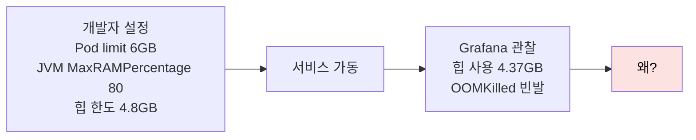
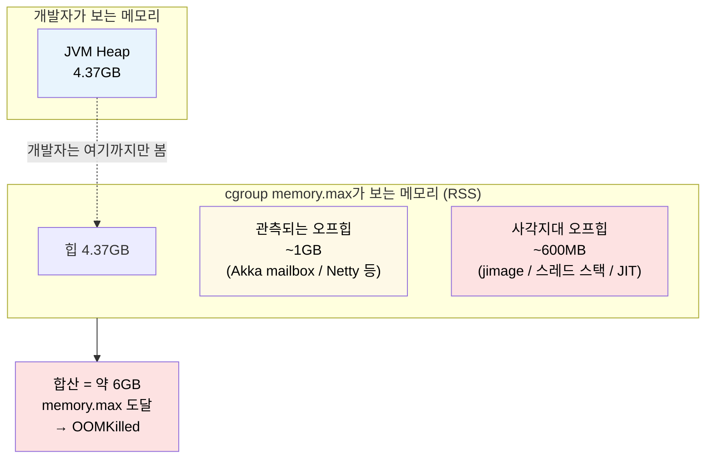
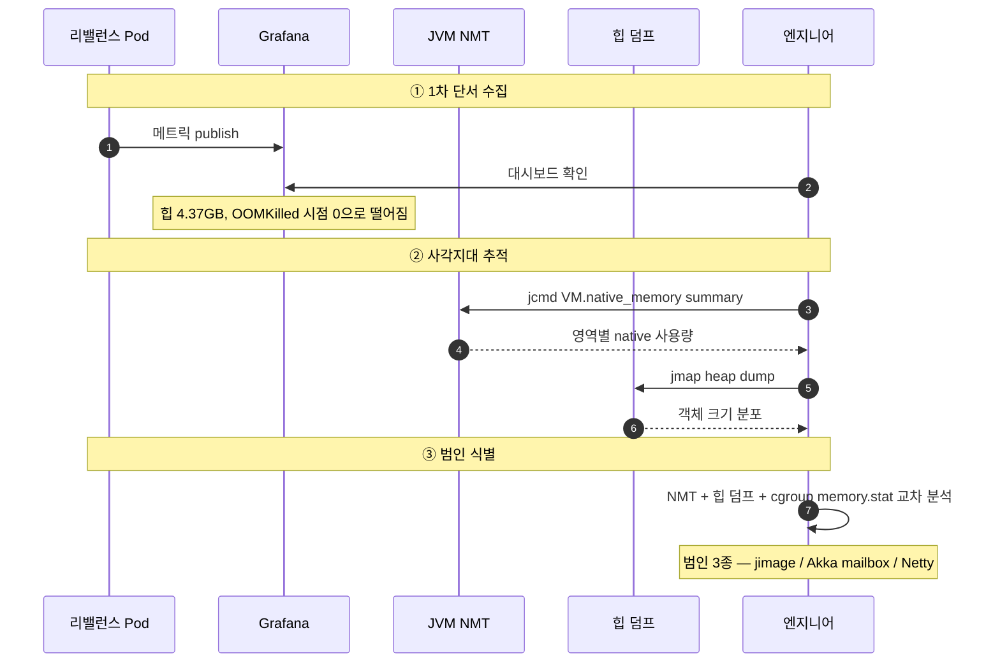
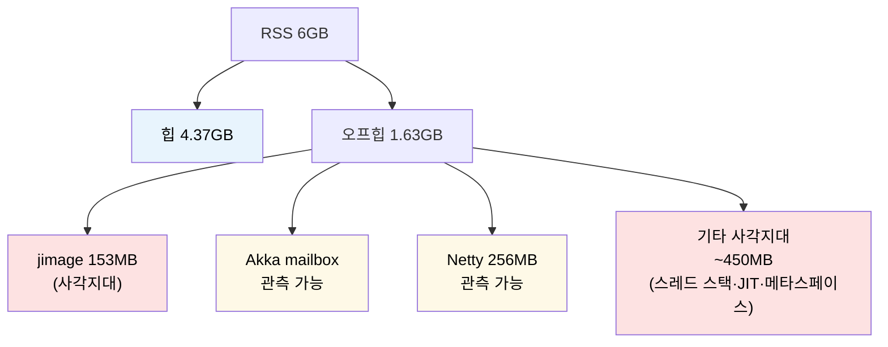
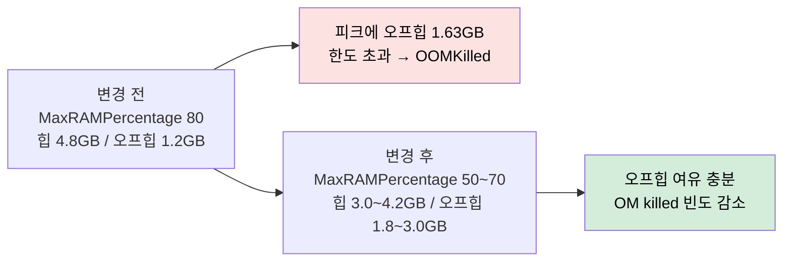
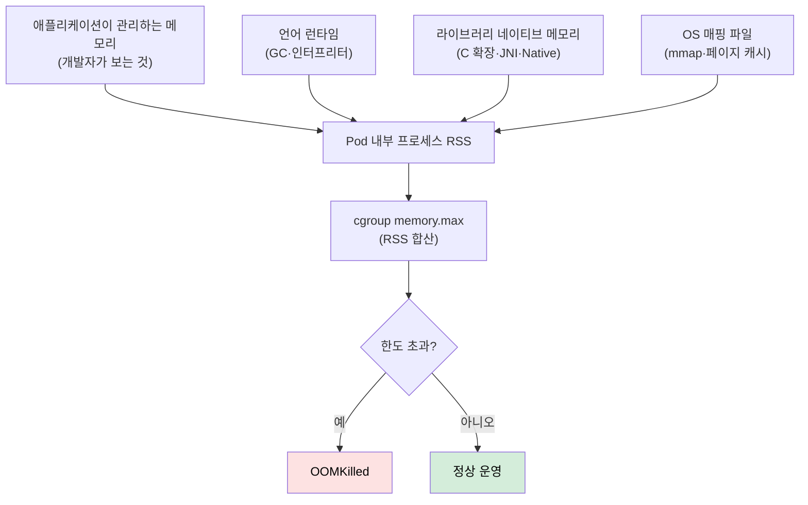
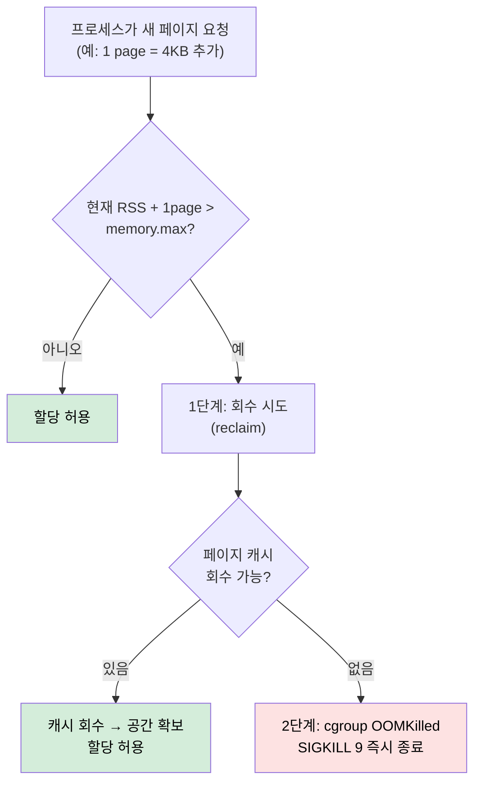

# cgroup 사례 — Endowus OOMKilled
---
> Endowus는 Pod에 6GB를 넉넉히 줬는데도 JVM Scala+Akka 서비스가 끊임없이 OOMKilled로 재시작됐다. JVM 힙은 4.37GB, MaxRAMPercentage 80%로 안전선 안에 들어 있었는데 왜? 답은 cgroup이 보는 메모리(RSS)와 개발자가 보는 메모리(힙)가 다르다는 한 가지 사실에 있었다. 이 글은 그 추적 과정을 단서 → 가설 → 증거 → 범인 → 해결 순서로 따라가며 컨테이너 메모리 한도 산정의 일반 원칙을 끌어낸다.

## 학습 목표

> 본 사례를 끝까지 따라가면 다음 3가지를 설명할 수 있다.

1. JVM `MaxRAMPercentage`만 보고 Pod limit을 정하면 왜 OOMKilled가 나는지를 cgroup `memory.max`의 RSS 기준으로 설명한다.
2. RSS = 힙 + 오프힙 + 사각지대 구성을 도구별로(NMT, 힙 덤프, Grafana) 어떻게 추적하는지 흐름을 그린다.
3. 본인이 운영하는 임의 언어(Go·Python·Node 등) Pod에 같은 점검을 적용할 수 있는 체크리스트를 만든다.

## 사건 개요

> 싱가포르 자산 관리 플랫폼 Endowus의 2023-12 포스트모템 사례다. 30개 마이크로서비스, JVM Scala+Akka, K8s + Prometheus + Grafana — 어느 회사에도 흔한 표준 인프라에서 일어난 장애다.

문제 서비스는 "리밸런스(rebalance)" — 고객 포트폴리오를 자동으로 리밸런싱하는 핵심 마이크로서비스다. 중요도가 높아 Pod에 메모리 6GB를 넉넉하게 할당했다. 그러나 Grafana 대시보드에는 OOMKilled가 반복적으로 찍히고 Pod가 계속 재시작됐다.

자바 입장에서는 힙 한도 4.8GB 안에서 4.37GB만 썼으니 안전하다. 그런데 cgroup은 Pod 전체를 강제 종료했다. 모순처럼 보이지만 답은 단순하다.

## 첫 단서 — 1.63GB의 행방

> 컨테이너 한도 6GB에서 힙 4.37GB를 빼면 1.63GB가 어딘가에서 쓰이고 있다. 그 어딘가가 사고의 출발점이다.

뺄셈으로 가설을 좁힌다. 6GB - 4.37GB = **1.63GB**. JVM이 직접 관리하지 않는 영역, 자바에서는 이걸 "오프힙(off-heap)"이라고 부른다. 힙 바깥에 존재하는 메모리라는 뜻이다.

오프힙이 어디서 잡히는지 일반화하면 다음과 같다.

| 영역 | 누가 잡는가 | 모니터링 가시성 |
|------|-------------|----------------|
| 힙 | JVM heap allocator | Grafana JVM exporter로 보임 |
| 메타스페이스 | JVM 클래스 로더 | 일부 보임 |
| 스레드 스택 | 스레드 수 × 1MB | 거의 안 보임 |
| JIT 코드 캐시 | JVM JIT compiler | 일부 보임 |
| Direct ByteBuffer | NIO·Netty | 부분 보임 |
| 라이브러리 네이티브 메모리 | C 라이브러리·바이트 코드 외 | 안 보임 |
| jimage(JDK 9+) | java.base 모듈 리소스 | 안 보임 |

오프힙의 모니터링 가시성은 영역마다 다르다. 모니터링 화면에 보이는 오프힙을 다 더해도 약 1GB. 1.63GB - 1GB = **600MB가 완전한 사각지대**에 숨어 있다.

## cgroup이 보는 메모리와 JVM 힙의 차이

> 핵심 한 줄: cgroup `memory.max`는 RSS(Resident Set Size, 프로세스가 실제 점유한 물리 메모리 페이지)를 본다. JVM 힙은 그 부분집합일 뿐이다.

cgroup은 페이지 단위로 RSS를 합산한다. 힙·메타스페이스·스레드 스택·JIT 캐시·네이티브 버퍼·jimage가 모두 RSS 안에 들어간다. JVM은 자기가 관리하는 힙만 보고 "안전하다"고 판단했지만 cgroup은 그 외 모든 페이지를 더해 한도를 강제했다.

cgroup이 어느 페이지를 합산하는지는 [`01-02.cgroup v2 깊이.md`](./01-02.cgroup%20v2%20깊이.md) 의 "memory controller" 섹션에 정리되어 있다. 본 문서는 그 위에서 사례를 본다.

## 증거 수집 — NMT와 힙 덤프

> 기본 모니터링(Grafana) 만으로는 600MB 사각지대를 못 찾는다. JVM이 직접 제공하는 Native Memory Tracking(NMT)과 힙 덤프 분석으로 커널 레벨까지 파고들어야 한다.

Endowus 팀이 사용한 도구 셋과 각 도구가 답하는 질문을 정리한다.

| 도구 | 답하는 질문 | 위치 |
|------|-------------|------|
| Grafana JVM exporter | "지금 힙은 얼마인가" | 대시보드 |
| `jcmd VM.native_memory summary` | "JVM이 자기 관리 영역으로 보고하는 네이티브 메모리는?" | JVM 옵션 `-XX:NativeMemoryTracking=summary` 필요 |
| `jmap`/`jstack` 힙 덤프 | "어느 객체·스레드가 무거운가" | JVM 프로세스에 접속 |
| `/proc/<pid>/smaps` | "OS 입장에서 본 RSS 분포" | 컨테이너 내부 |
| cgroup `memory.stat` | "cgroup이 합산한 메모리 항목별 분포" | `/sys/fs/cgroup/.../memory.stat` |

NMT 결과와 힙 덤프를 결합하니 사각지대 600MB의 정체가 드러났다.

## 범인 셋 — jimage / Akka / Netty

> 사각지대 600MB와 관측된 1GB의 정체를 모두 분해한다.

### 범인 1 — jimage Reader 153MB

JDK 9부터 `java.base` 등 표준 모듈을 단일 `lib/modules` 파일로 묶었다. JVM이 부팅 시 이 파일을 메모리 매핑(`mmap`)해서 읽는다. JVM이 자기 힙으로 관리하지 않는 영역이라 Grafana JVM exporter에 1바이트도 안 찍힌다. RSS에는 153MB가 그대로 합산된다.

### 범인 2 — Akka mailbox 28MB

Akka는 액터 간 메시지 큐를 mailbox로 관리한다. 기본 mailbox 버퍼는 256KB인데 Endowus는 28MB로 과도하게 늘려 잡았다. 최악의 경우 mailbox가 최대 개수(128)에 도달하면 오프힙이 28 × 128 = **3.6GB**까지 팽창 가능했다. 평균 운영에서는 그 정도까지 안 갔지만 피크에서 큰 비중을 차지했다.

### 범인 3 — Cassandra Netty 8코어 × 16버퍼 = 256MB

Cassandra DB와 통신할 때 Netty가 CPU 코어 수에 비례해 네트워크 버퍼를 미리 할당한다. 8코어 환경에서 코어당 16버퍼 × 16MB = **256MB**가 앱 구동 직후부터 통째로 점유됐다. 부하와 무관하게 깔리는 고정 비용이다.

각 범인의 가시성·기여도를 표로 정리한다.

| 범인 | 크기 | 모니터링 가시성 | 평소 대응 |
|------|------|----------------|-----------|
| jimage Reader | 153MB | 0 (완전 사각지대) | JDK 버전 인지, 일정 오프힙 여유 확보 |
| Akka mailbox | 최대 3.6GB | 부분 보임 | 버퍼 크기 256KB 기본값 유지, 늘릴 때 누적 영향 계산 |
| Netty 버퍼 | 256MB | 부분 보임 | 코어 수 × 버퍼 수로 고정 비용 산정 |

## 해결과 일반화

> Endowus는 힙 한도를 80% → 50~70%로 보수적으로 낮춰 오프힙 여유를 30~50% 확보했다. 추가로 Akka mailbox 크기를 합리적 수준으로 줄였다.

Endowus의 포스트모템은 마지막에 "OOMKilled, at least for now"라고 적었다. 자신감 있는 표현이긴 하지만 "근본 해결은 워크로드 변화에 따라 계속 재산정해야 한다"는 인식도 깔려 있다. 한 번의 설정으로 영구히 안전한 limit은 없다.

### 일반화 — 어느 언어든 같다

이 사례의 진짜 교훈은 자바·Akka에 국한되지 않는다. 어느 언어든 다음 구조는 동일하다.

각 언어의 대응 항목 예시는 다음과 같다.

| 언어 | 사각지대 후보 |
|------|---------------|
| Java | jimage·스레드 스택·JIT·NIO Direct·메타스페이스·JNI |
| Go | runtime mheap reservation·`MADV_DONTNEED` 지연 반환·CGO 호출 시 C 힙 |
| Python | C 확장(NumPy·Pandas)·GIL 스레드 스택·`mmap` 데이터 파일 |
| Node | V8 heap 외 buffer pool·libuv 스레드 풀 |

## RSS 페이지 단위 — cgroup의 실제 검사 로직

> cgroup이 OOMKilled를 발동시키는 시점은 "한도 초과 즉시"가 아니다. 한 단계 더 거친다.

페이지 캐시가 있으면 cgroup이 먼저 그것을 해제하고 한도 안에서 살아남는다. K8s 노드는 보통 swap이 off라 캐시도 부족하면 즉시 SIGKILL이다. 이게 OOMKilled에 `exit code 137`이 찍히는 이유 — 128 + 9(SIGKILL) = 137.

cgroup OOMKilled는 **노드 OOM과 다르다**. 노드 메모리가 부족한 게 아니라 해당 Pod의 `memory.max`만 도달한 상태이므로 다른 Pod는 영향을 받지 않는다.

## 검증된 점

> 본 사례에서 학습할 만큼 충분히 입증된 부분.

- cgroup `memory.max`는 RSS 합산값을 본다. 개발자가 보는 힙은 그 부분집합이다.
- exit code 137 = 128 + 9(SIGKILL). cgroup OOMKilled의 표지다.
- 페이지 캐시 회수가 1단계 완충 역할을 한다. swap off 환경에서 캐시도 없으면 바로 SIGKILL이다.
- jimage·스레드 스택·JIT 캐시는 일반 JVM 모니터링에 안 찍힌다. NMT가 답이다.

## 우려되는 점

> 본 사례를 그대로 일반화할 때 주의할 부분.

- "MaxRAMPercentage 50~70%" 는 Endowus 환경에서의 답이다. 워크로드별로 오프힙 비중이 다르므로 한 번 NMT로 측정하고 결정한다.
- Akka·Netty 라이브러리 기본값이 시간이 흐르면 바뀐다. 라이브러리 업그레이드 후 다시 측정한다.
- Native Memory Tracking은 5~10% 성능 오버헤드가 있다. 프로덕션 상시 켜기보다는 진단 시 일시 활성화한다.

## 체크리스트 — Pod 메모리 limit 산정 시 봐야 할 5가지

| # | 항목 | 검증 방법 |
|---|------|-----------|
| 1 | RSS 기준의 진짜 메모리 사용량 측정 | `/proc/<pid>/smaps` 또는 cgroup `memory.current` |
| 2 | 오프힙 비중 산정 | NMT summary + 힙 덤프 비교 |
| 3 | 라이브러리 네이티브 메모리 후보 식별 | Netty·JNI·CGO·C 확장 코드 베이스 검색 |
| 4 | mmap 매핑 파일 점검 | jimage·로그 파일·DB 파일 매핑 여부 |
| 5 | swap·페이지 캐시 정책 확인 | 노드 `swapaccount=1` 여부, kubelet swap 설정 |

## 함께 보기

- [`./01-02.cgroup v2 깊이.md`](./01-02.cgroup%20v2%20깊이.md) — cgroup v2 단일 트리·컨트롤러·PSI·throttling/OOM 분석
- [`./01-04.cgroup 파일시스템 실습.md`](./01-04.cgroup%20파일시스템%20실습.md) — `/sys/fs/cgroup` 트리에서 Pod별 디렉토리 찾기, `memory.max`/`cpu.max` 매핑
- [`./01-07.OverlayFS와 user namespace — Netflix UID 격리.md`](./01-07.OverlayFS와%20user%20namespace%20—%20Netflix%20UID%20격리.md) — 같은 강의 시리즈, 컨테이너 세 번째 기둥
- [`../../08_cloud/kubernetes/10-03.자원 관리.md`](../../08_cloud/kubernetes/10-03.자원%20관리.md) — Pod requests/limits 결정 패턴
- [`../../08_cloud/kubernetes/10-05.OOMKilled 사례 분석.md`](../../08_cloud/kubernetes/10-05.OOMKilled%20사례%20분석.md) — 같은 Endowus 사례를 K8s 운영자 관점(requests/limits 매핑·QoS·대시보드 운영)에서 풀이. 본 문서가 커널 메커니즘(RSS 합산·페이지 단위 reclaim·exit 137) 중심이라면 그쪽은 처방·일반화 운영 원칙 중심
