# OverlayFS와 user namespace — Netflix UID 격리
---
> Netflix는 컨테이너 탈출 방어를 위해 user namespace + ID map을 도입했다. 안전해진 줄 알았는데, 50레이어짜리 컨테이너 100개를 동시에 띄우니 노드가 30초 이상 멈춰 버렸다. 범인은 OverlayFS lowerdir 마운트가 만든 글로벌 락 폭주였다. 이 글은 보안 격리가 어떻게 인프라 마비로 번졌는지, 그리고 어떻게 풀었는지를 단서 → 분해 → 하드웨어 원인 → 해결 순서로 따라간다.

## 학습 목표

> 본 사례를 끝까지 따라가면 다음 4가지를 설명할 수 있다.

1. user namespace + ID map이 컨테이너 탈출을 어떻게 막는지, 그 대신 어떤 비용을 만드는지 트레이드오프를 설명한다.
2. OverlayFS lowerdir/upperdir/merged 구조와 컨테이너 1개당 200번 가까운 마운트 시스템 콜이 어떻게 발생하는지 흐름을 그린다.
3. 마운트 글로벌 락 + 스핀 대기 + NUMA + LLC 캐시 토폴로지가 결합해 노드 마비가 왜 일어났는지 다섯 단계로 설명한다.
4. Linux 커널 6.3+의 recursive bind mount가 어떻게 마운트 호출을 33배 줄이는지 비유로 설명한다.

## 사건 개요

> Netflix 기술 블로그 "Maintaining Metrics: Scaling Containers on Modern CPU"가 다룬 사례. AWS R5 Metal 인스턴스에서 컨테이너 100개·이미지 레이어 50개를 동시에 띄우자 노드가 30초 이상 멈췄다.

문제 환경의 노드 스펙은 다음과 같다.

| 항목 | 값 |
|------|-----|
| 인스턴스 | AWS R5 Metal (bare metal) |
| 물리 코어 | 46개 |
| 논리 프로세서 | 96개 (하이퍼스레딩 2배) |
| 캐시 토폴로지 | 모든 코어가 단일 LLC 공유 (중앙 집중) |
| 런타임 | kubelet + containerd + user namespace |

장애 트리거 조건은 명확하다. **컨테이너 100개 이상 동시 기동 + 각 컨테이너 이미지 레이어 50개 이상**. 이 조합에서 노드가 다음 순서로 무너졌다.

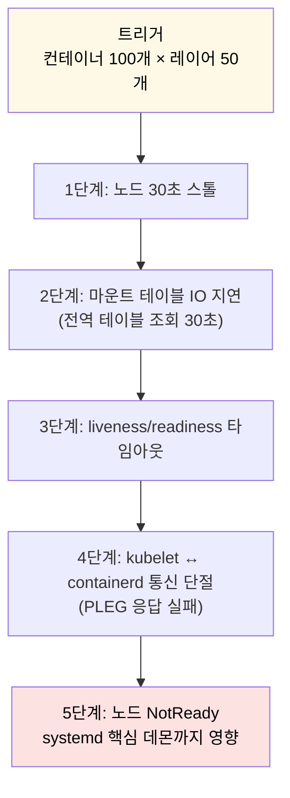

겉으로 보기에는 "컨테이너 기동 지연"이지만 실제는 호스트 OS 자체가 멈춘 인프라 장애였다. 단서를 찾기 위해 Netflix 엔지니어들은 어디부터 봤을까.

## 단서 — user namespace + ID map의 보안 의도

> 사고를 이해하려면 Netflix가 왜 user namespace를 도입했는지부터 봐야 한다. 보안 의도가 마운트 호출 폭주의 출발점이기 때문이다.

기존 환경은 virtualkubelet + Docker 조합이었고, **모든 컨테이너가 호스트와 같은 UID 풀**을 공유했다.

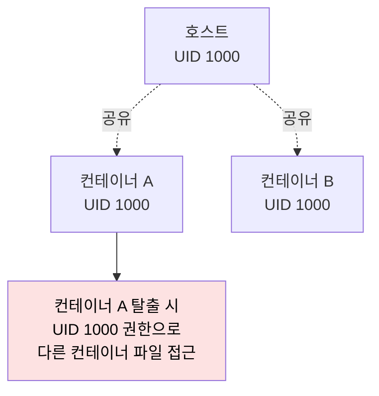

이 구조에서 한 컨테이너가 취약점으로 탈출하면 호스트의 UID 1000 권한으로 다른 컨테이너의 파일까지 접근 가능했다. Netflix는 이를 막기 위해 user namespace를 도입했다.

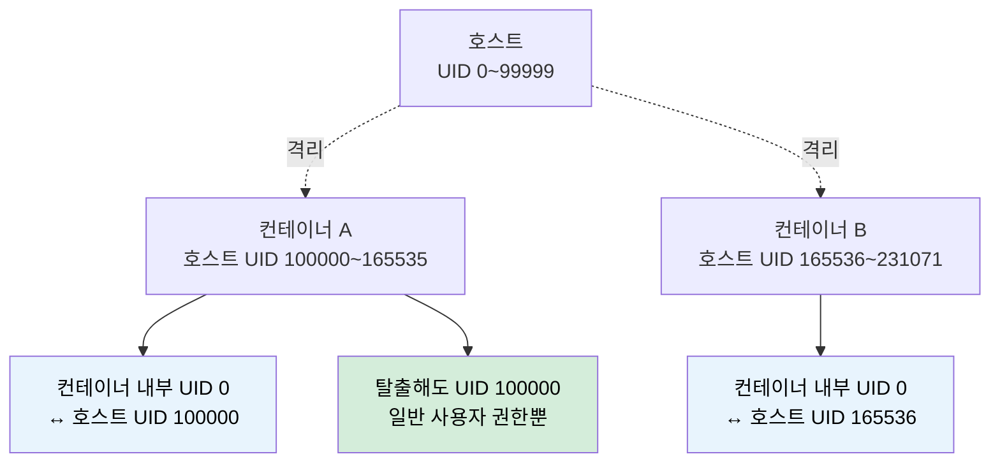

컨테이너 안에서 UID 0(root)으로 실행되더라도 호스트 입장에서는 UID 100000번의 일반 사용자다. 탈출해도 호스트 root 권한을 얻을 수 없다. Linux는 컨테이너당 65,536개씩 UID 범위를 통째로 나눠 준다.

이 보안 격리는 "ID map"이라는 메커니즘이 만든다. 디스크의 원본 파일 UID는 그대로 두되, 컨테이너가 인식할 때만 매핑된 UID로 보여준다. **여기서 OverlayFS 마운트 비용이 시작된다.**

## 분해 — 컨테이너 1개당 마운트 호출은 몇 번인가

> ID map이 적용되면 OverlayFS 조립 절차에 마운트 호출이 누적된다. 컨테이너 1개당 약 200번의 시스템 콜이 발생한다는 게 Netflix가 발견한 충격적 사실이다.

OverlayFS의 기본 구조부터 정리한다.

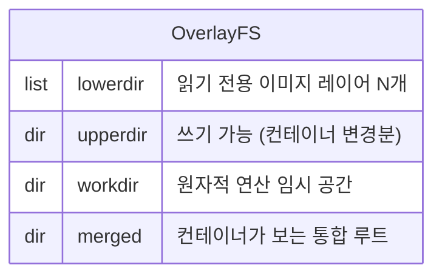

lowerdir에 이미지 레이어 N개를 쌓고, upperdir에 컨테이너의 쓰기 변경을 담고, merged 디렉토리가 컨테이너의 `/` 가 된다. ID map까지 적용되면 각 lowerdir 레이어의 UID를 호스트 → 컨테이너 매핑으로 변환해야 한다.

레이어 50개짜리 컨테이너 1개를 기동할 때 마운트 절차는 다음과 같다.

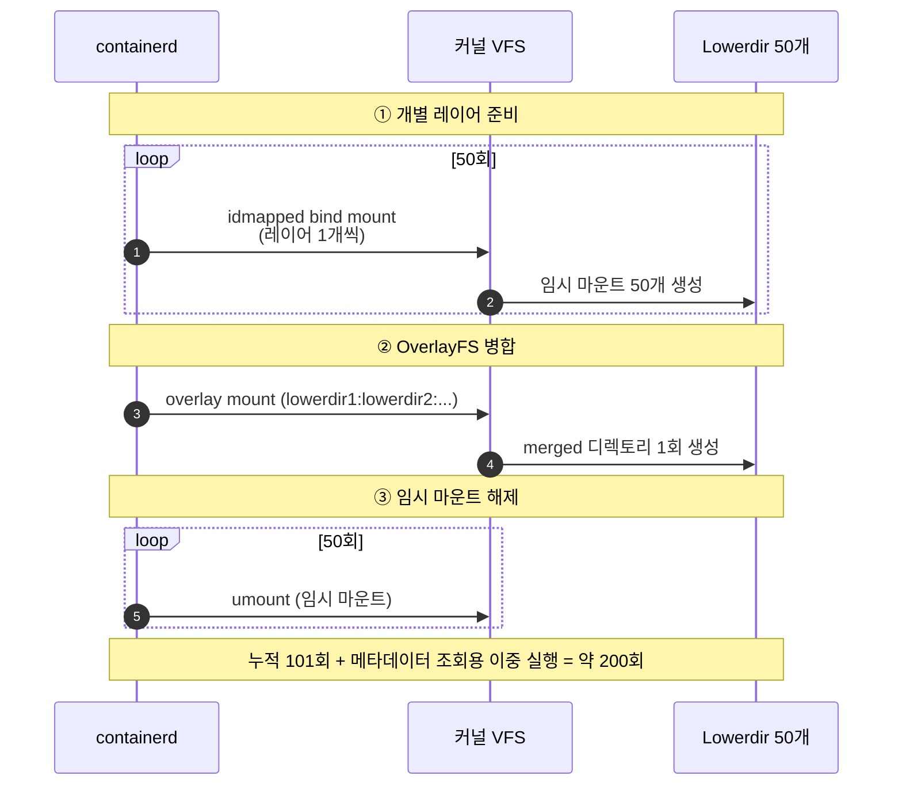

조립(50) + 병합(1) + 해제(50) = **101회**가 한 번. 컨테이너 기동 과정에서 메타데이터 조회용으로 한 번, 실제 구동용으로 한 번 — 이중 실행이라 **컨테이너 1개당 약 200회**가 된다.

여기에 컨테이너 100개를 동시에 곱하면 **20,000번**의 마운트 시스템 콜이다.

## 글로벌 락 — 왜 단일 자물쇠 하나가 노드 전체를 멈추나

> 마운트 테이블은 시스템 전역 자원이라 단일 락이 걸려 있다. 20,000번의 마운트 요청이 단일 락에 몰리면 46개 CPU 코어 중 1개만 작업하고 나머지 45개가 스핀 대기에 갇힌다.

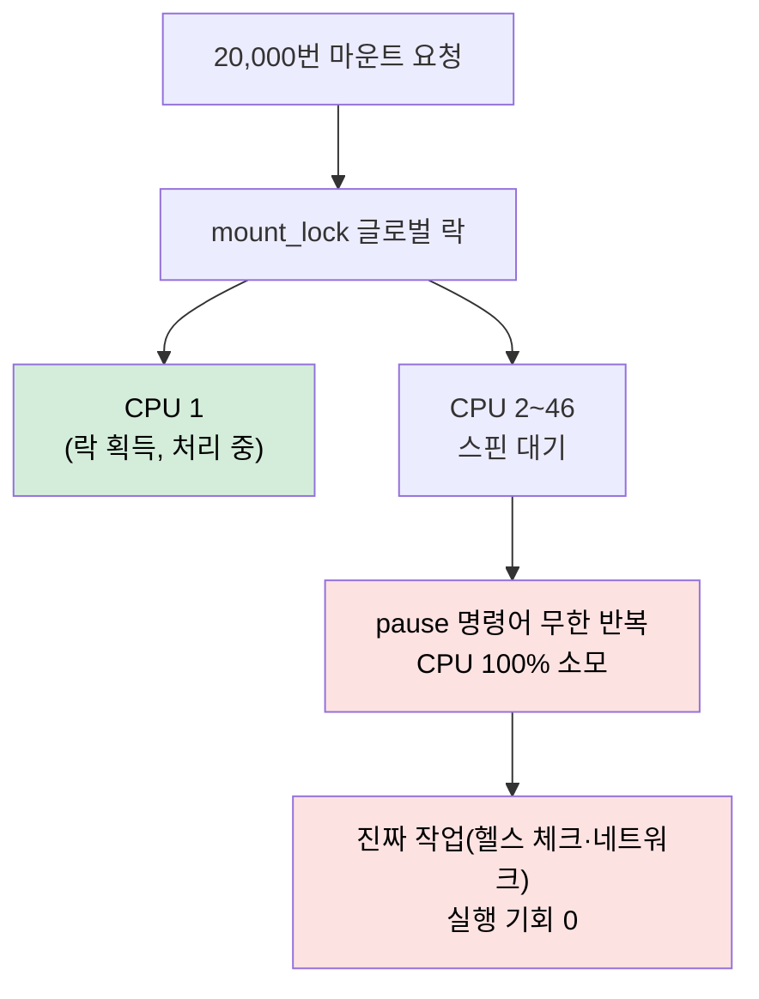

여기서 자연스러운 질문이 떠오른다. **"락이 잠겨 있으면 스레드를 재웠다가 깨우면 되지 않나? 왜 CPU를 100% 낭비하는 스핀을 쓰나?"**

답은 **문맥 교환 비용**이다.

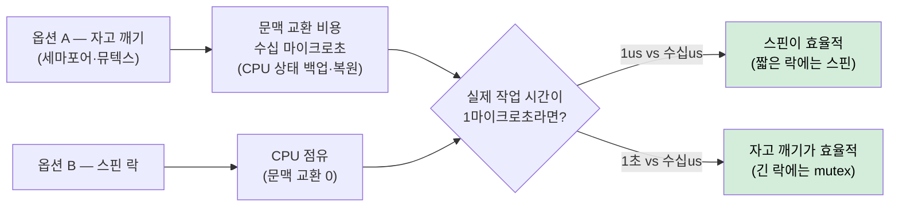

마운트 테이블 갱신은 원래 1마이크로초 안에 끝나는 매우 짧은 작업이다. 문맥 교환 한 번이 수십 마이크로초인데, 짧은 락을 위해 문맥 교환을 하면 "배보다 배꼽이 큰" 구조가 된다. 그래서 커널은 짧은 락을 스핀으로 설계했다.

**스핀의 전제는 "락이 극도로 짧게 유지된다"이다.** Netflix가 마주한 비극은 그 전제가 깨졌다는 점이다. 락 유지 시간이 1us 아니라 30초까지 늘어나면 스핀이 정확히 재앙이 된다.

## 하드웨어 토폴로지 — 왜 어떤 인스턴스는 버텼나

> 같은 20,000번 마운트 폭주가 일어났는데 일부 최신 인스턴스는 버텼다. 차이는 NUMA, 하이퍼스레딩, LLC 캐시 토폴로지에 있었다.

Netflix 엔지니어가 지목한 하드웨어 원인 3가지.

### 원인 1 — NUMA (Non-Uniform Memory Access)

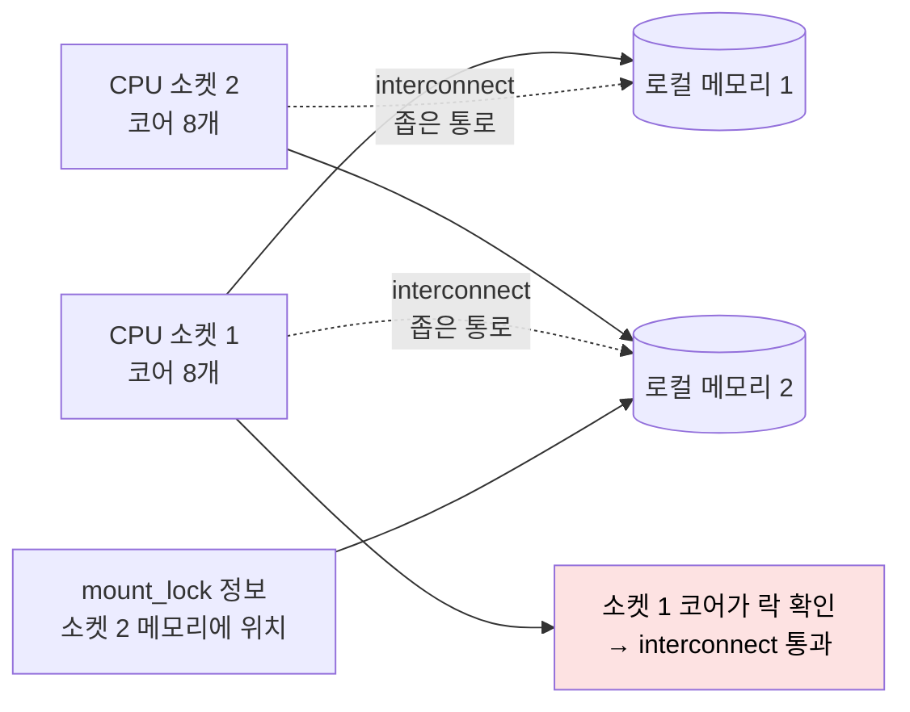

mount_lock 정보가 어느 CPU 소켓의 로컬 메모리에 있느냐에 따라 다른 소켓의 코어들이 좁은 interconnect를 통과해야 한다. 20,000번의 확인 요청이 좁은 통로에 몰리면 교통 체증이다.

### 원인 2 — 하이퍼스레딩의 역효과

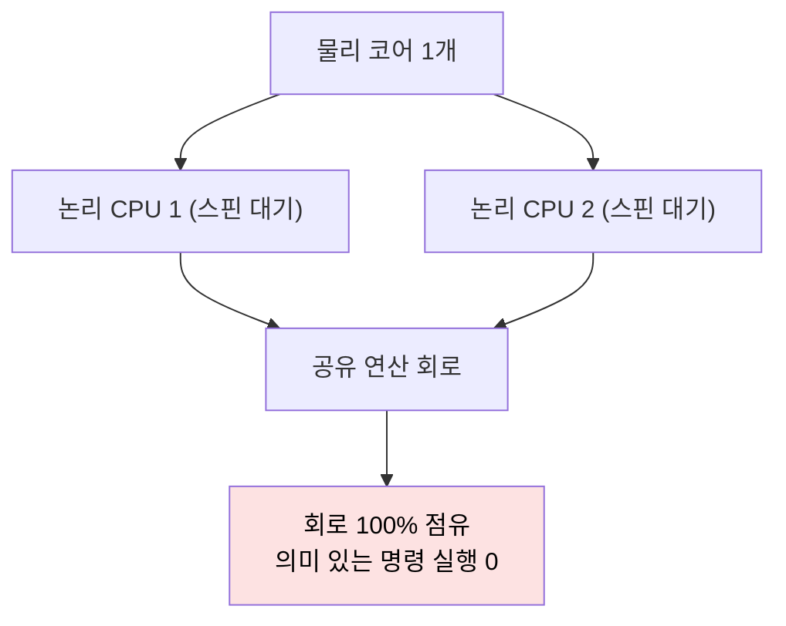

하이퍼스레딩은 물리 코어 1개를 논리 CPU 2개로 분할한다. 두 논리 CPU가 별개로 보이지만 하드웨어 레벨에서는 **공유 연산 회로**를 통한다. 둘 다 스핀 대기에 빠지면 공유 회로에 의미 없는 락 확인이 100% 몰려 정상 명령이 실행되지 못한다.

### 원인 3 — LLC 캐시 토폴로지

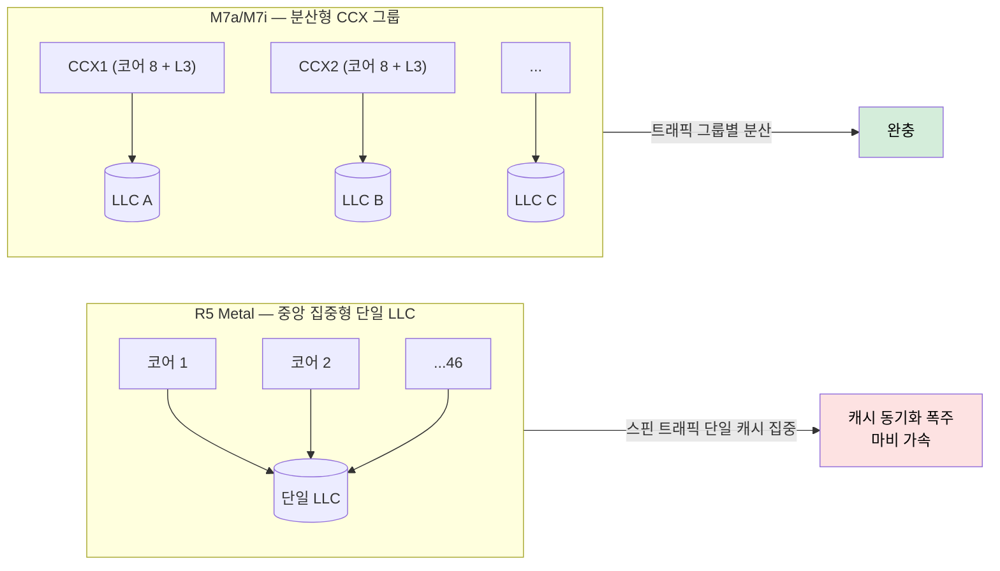

R5 Metal은 모든 코어가 단일 LLC를 공유하는 중앙 집중형이다. 스핀 트래픽이 그 LLC 한 곳에 집중되면 캐시 동기화가 폭주한다. 반면 M7a/M7i는 CCX(Core Complex)라는 8코어 + 전용 L3 단위로 분산되어 있어 락 경합 트래픽이 그룹별로 격리된다.

Netflix의 1차 대응은 분산형 캐시 구조의 최신 인스턴스로 워크로드를 이전하는 임시 조치였다. 다만 마운트 호출 수 자체를 줄이는 게 근본 해결이었다.

## 해결 — Linux 6.3 recursive bind mount

> Netflix는 리눅스 커널 6.3에서 도입된 recursive bind mount 기능으로 마운트 호출 수를 33배 줄였다. 비유하자면 "서류 50장에 일일이 도장 찍기"를 "서류철 겉면에 도장 한 번"으로 바꾼 것이다.

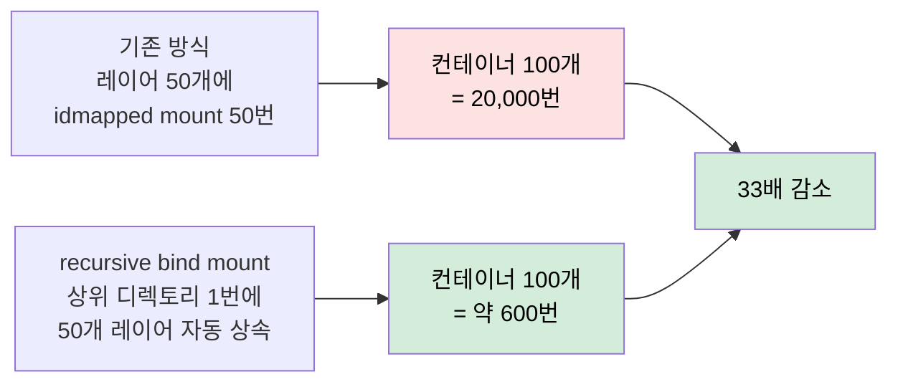

recursive bind mount는 상위 디렉토리 1번의 ID map 설정을 하위 50개 레이어에 자동으로 상속시킨다. 마운트 시스템 콜이 레이어 수에 비례하지 않고 컨테이너당 고정 1회로 줄어든다.

## 5단계 나비 효과 정리

> 보안 강화로 시작된 작은 결정이 어떻게 거대한 인프라 장애로 번졌는지 5단계로 압축한다.

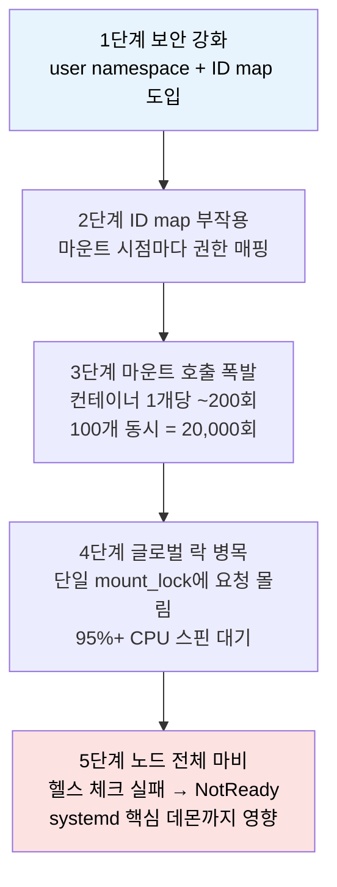

이 다섯 단계가 보여주는 일반 원칙은 다음과 같다. **보안 격리는 공짜가 아니다.** 더 강한 격리는 더 많은 커널 자원 추적을 만들고, 추적은 결국 락 경합으로 누적된다. 격리 도입 시 그 비용을 미리 측정해야 한다.

## 컨테이너 이미지 레이어는 왜 이렇게 많은가

> 50개라는 레이어 수가 비정상이 아니다. Dockerfile 명령어 한 줄이 레이어 1개를 만든다.

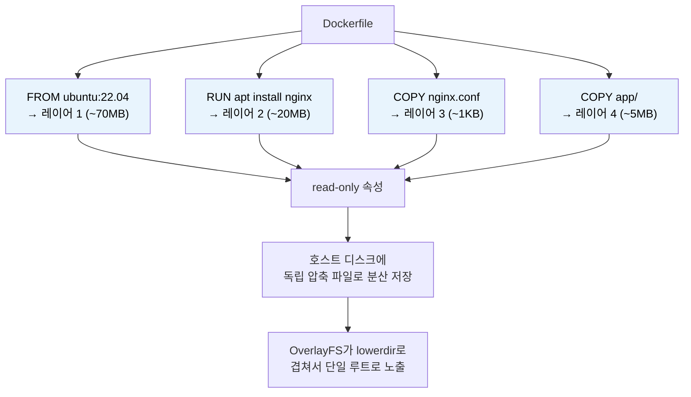

대형 애플리케이션의 Dockerfile은 의존성·도구·빌드 단계를 반영해 명령어 수가 늘어난다. 50레이어가 결코 과한 숫자가 아니다.

## 검증된 점

> 본 사례에서 충분히 입증된 부분.

- user namespace + ID map은 컨테이너 탈출 후 권한 상승을 막는 강한 격리 메커니즘이다.
- OverlayFS lowerdir 마운트가 ID map과 결합하면 컨테이너 1개당 ~200회의 마운트 시스템 콜이 발생한다.
- 마운트 글로벌 락 + 스핀 대기는 "짧은 락" 전제가 깨지면 즉시 노드 마비로 번진다.
- LLC 캐시 토폴로지(중앙 집중 vs 분산)는 스핀 경합 시 소프트웨어 부하를 하드웨어가 어떻게 흡수하느냐를 가른다.
- Linux 6.3 recursive bind mount는 마운트 호출 수를 레이어 수와 독립시켜 33배 감소를 만든다.

## 우려되는 점

> 본 사례를 일반화할 때 주의할 부분.

- 커널 6.3 미만 환경에서는 recursive bind mount를 못 쓴다. 이미지 레이어 수 자체를 줄이는 Dockerfile 최적화가 우선 대응이다.
- "컨테이너 100개 동시 기동"은 보통 노드 부팅 직후나 재배포 시점에만 발생한다. 정상 운영에서는 마운트 폭주가 안 보이지만, 일제 재시작 시나리오는 반드시 테스트해야 한다.
- 하드웨어 토폴로지 차이는 클라우드 인스턴스 타입 변경만으로 해결되지만 비용이 증가한다.

## 체크리스트 — user namespace 도입 시 검토할 5가지

| # | 항목 | 검증 방법 |
|---|------|-----------|
| 1 | 커널 버전 6.3 이상인가 | `uname -r` 확인 |
| 2 | 컨테이너 이미지 평균 레이어 수 | `docker history <image>` 또는 `crane manifest` |
| 3 | 일제 기동 시나리오의 마운트 호출 수 | `perf trace -e mount` 또는 `bpftrace mount_*` |
| 4 | 노드 LLC 캐시 토폴로지 | `lscpu --extended=CPU,SOCKET,L3` |
| 5 | NUMA 노드 수와 mount_lock 위치 | `numactl --hardware` + 락 추적 |

## 함께 보기

- [`./01-01.커널과 컨테이너.md`](./01-01.커널과%20컨테이너.md) — 유저/커널 스페이스, 시스템 콜, namespace·cgroup·proc 전반
- [`./01-03.마운트 네임스페이스와 propagation.md`](./01-03.마운트%20네임스페이스와%20propagation.md) — private/shared/slave/unbindable 4종, K8s mountPropagation
- [`./01-05.namespace 실습 — 8가지 격리와 unshare.md`](./01-05.namespace%20실습%20—%208가지%20격리와%20unshare.md) — `unshare`로 user namespace 직접 만들기
- [`./01-06.cgroup 사례 — Endowus OOMKilled.md`](./01-06.cgroup%20사례%20—%20Endowus%20OOMKilled.md) — 같은 강의 시리즈, 컨테이너 두 번째 기둥
