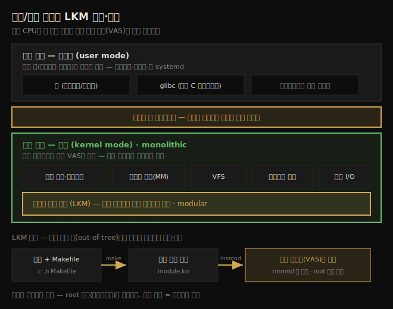
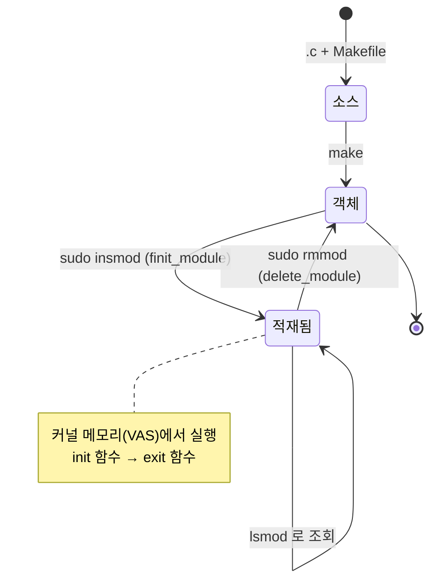

# 첫 커널 모듈 (1) — 커널 아키텍처와 LKM
---
> LKM(Loadable Kernel Module)은 커널 소스 트리 밖에서 커널 코드를 빌드해 런타임에 끼웠다 뺐다 하는 프레임워크입니다. 디바이스 드라이버 개발이 대표적 용도입니다. 모던 CPU의 두 특권 레벨이 가상 주소 공간을 유저 공간(비특권)과 커널 공간(특권)으로 나누고, 유저 앱은 시스템 콜로만 커널에 진입합니다. 모듈은 커널 코드로서 커널 특권으로 실행됩니다.

이 노트부터 섹션 2 — 본격적인 커널 개발 — 로 들어갑니다. 앞선 두 챕터(Ch 2~3)가 커널을 빌드하는 법이었다면, 여기서는 커널 기능을 LKM 프레임워크로 직접 작성합니다. 실무·산업 현장의 커널 프로젝트 대부분이 이 방식입니다.

이 노트는 커널 아키텍처 기초(유저/커널 공간·시스템 콜·monolithic), LKM 프레임워크의 개념, 그리고 첫 "Hello, world" 모듈을 작성·빌드·적재·제거하는 것까지 다룹니다. printk 로깅 심화와 모듈 Makefile 은 짝 노트(04-02)로 넘깁니다. 아래 종합도가 이 노트의 척추 — 유저/커널 공간 분리와 LKM 빌드·적재 흐름 — 입니다.




## 1. 유저 공간과 커널 공간

> 모던 CPU는 최소 두 특권 레벨을 지원합니다. OS 는 안정성·보안을 위해 가상 주소 공간(VAS)을 유저 공간(비특권)과 커널 공간(특권)으로 나눕니다.

모던 마이크로프로세서는 최소 두 특권 레벨에서 코드 실행을 지원합니다. x86[-64] 는 4개의 ring 레벨, AArch64(ARMv8)는 4개의 exception 레벨(EL0~EL3)을 가집니다. OS 는 보안·안정성을 위해 이 중 최소 둘을 써서 VAS 를 둘로 가릅니다.

1. **유저 공간**: 앱이 비특권 user mode 로 실행됩니다. 모든 프로세스·스레드(브라우저·에디터·셸·systemd)가 여기 있습니다.
2. **커널 공간**: 커널과 그 컴포넌트(드라이버·네트워킹·I/O·커널 모듈)가 특권 kernel mode 로 실행됩니다. OS 특권으로 무엇이든 할 수 있습니다.

> 핵심: 이 특권 레벨은 **하드웨어 기능**이며, root 로 실행하는지(소프트웨어)와 다릅니다. 다만 커널 특권으로 실행하는 것은 사실상 root 로 실행하는 것과 같다고 볼 수 있습니다.

### 라이브러리와 시스템 콜 API

유저 앱은 API 로 일합니다. 라이브러리는 API 의 모음이고, 모든 유저 모드 앱은 한 중요한 라이브러리 — **glibc(GNU 표준 C 라이브러리)** — 에 자동 링크됩니다. 다만 **라이브러리는 유저 모드에만 있습니다** — 커널은 이 유저 모드 라이브러리를 쓰지 않습니다.

라이브러리 API 예: `printf(3)`, `malloc(3)`, `free(3)`. 그런데 유저 프로세스는 유저 공간에 갇혀 있는데 어떻게 커널에 접근할까요? 답은 **시스템 콜**입니다. 시스템 콜은 유저 공간이 커널에 접근하는 **유일한 합법 진입점**입니다 — 비특권 user mode 에서 특권 kernel mode 로 전환하는 내장 능력을 가집니다.

시스템 콜 예: `fork(2)`, `execve(2)`, `open(2)`, `read(2)`, `write(2)`, `socket(2)`.

> man 페이지 섹션: 라이브러리 API 는 section 3, 시스템 콜 API 는 section 2 입니다.


## 2. 커널 공간 컴포넌트와 monolithic 구조

> Linux 커널은 monolithic 아키텍처입니다 — 모든 컴포넌트가 커널 VAS 를 공유합니다. 동시에 LKM 으로 기능을 끼웠다 뺐다 할 수 있어 modular 하기도 합니다.

Linux 커널은 몇 개의 주요 서브시스템과 여러 컴포넌트로 이뤄집니다.

| 서브시스템 | 역할 |
|-----------|------|
| 코어 커널 | 프로세스/스레드 생성·소멸, CPU 스케줄링, 동기화, signaling, timer, 인터럽트, namespace, cgroup, 모듈 지원, crypto |
| 메모리 관리(MM) | 커널·프로세스 VAS 설정·유지 |
| VFS | 실제 파일시스템(ext4·vfat·ntfs 등) 위의 추상층 |
| 블록 I/O | 파일시스템부터 블록 디바이스 드라이버까지 I/O 경로 |
| 네트워크 프로토콜 스택 | RFC 충실 구현(TCP/IP 등) |
| IPC | 메시지 큐·공유 메모리·세마포어 |
| 사운드 | 오디오(펌웨어·드라이버·코덱) |
| 가상화 | KVM(Kernel-based Virtual Machine) |

여기에 arch별 코드, 커널 초기화, 보안 프레임워크, 여러 디바이스 드라이버가 더해집니다.

Linux 커널은 **monolithic 아키텍처**(microkernel 의 반대)입니다 — 위 모든 컴포넌트가 커널 VAS(커널 세그먼트)에 함께 살며 공유합니다. 또한 이 주소 공간들은 **가상** 주소 공간입니다. 커널은 MMU·TLB 같은 하드웨어 블록을 써서 페이지 단위로 가상 페이지를 물리 페이지 프레임에 매핑합니다 — 커널은 마스터 페이징 테이블로, 살아있는 각 프로세스는 개별 페이징 테이블로 매핑합니다.


## 3. LKM 프레임워크 — 왜 모듈인가

> 커널에 기능을 더하는 한 방법은 소스를 고쳐 재빌드·재부팅하는 것이지만, 매 변경마다 그러기는 비효율적입니다. LKM 은 커널 소스 밖에서 코드를 빌드해 런타임에 적재·제거하는 더 깔끔한 방법입니다.

커널에 기능(새 드라이버·파일시스템·I/O 스케줄러)을 더하는 한 방법은 소스 트리를 고쳐 설정·빌드·테스트·배포하는 것입니다. 단순해 보이지만, 아무리 작은 변경도 매번 커널 이미지를 재빌드하고 시스템을 재부팅해야 합니다. 더 깔끔한 방법이 LKM 프레임워크입니다.

LKM 은 커널 코드를 보통 소스 트리 **밖(out-of-tree)**에서 컴파일해, 생성된 "모듈 객체"를 커널 메모리(커널 VAS)에 끼워(insert) 실행시키고, 일을 마치면 빼는(remove) 방법입니다.

1. 모듈 소스(C 소스·헤더·Makefile)는 `make` 로 커널 모듈로 빌드됩니다. 모듈은 **바이너리 객체 파일**이지 실행 파일이 아닙니다.
2. 모던 커널에서 모듈 파일은 `.ko`(kernel object) 확장자입니다(2.4 이전은 `.o`).
3. 빌드된 `.ko` 를 런타임에 살아있는 커널에 끼워 커널의 일부로 만듭니다.

> 모든 커널 기능이 LKM 으로 제공되진 않습니다. 코어 CPU 스케줄러, 메모리 관리, signaling, timer, 인터럽트 관리 같은 핵심은 커널 안에서만 개발됩니다. 또한 모듈은 전체 커널 API·데이터의 부분집합에만 접근할 수 있습니다.

LKM 의 이점은 다음과 같습니다.

1. **생산성**: 매번 재설정·재빌드·재부팅 없이, 코드만 고쳐 재빌드하고 옛 모듈을 빼고 새 버전을 끼웁니다.
2. **동적 제품 구성**: 가격대별로 다른 기능을 모듈로 제공하거나, 진단·디버그 로그를 동적으로 생성합니다(Kprobes 등).

> 이 능력 덕분에 Linux 커널은 순수 monolithic 이 아니라 **modular 하기도** 합니다. 다만 모듈도 커널 코드라 시스템 크래시를 일으킬 수 있어, 격리된 VM 에서 작업하는 게 유리합니다.

### 커널 소스 트리 안의 모듈

사실 모듈 객체는 낯설지 않습니다. Ch 3 에서 커널 빌드 시 `M` 으로 표시한 설정이 모듈로 빌드돼 `/lib/modules/$(uname -r)/` 에 설치됐습니다.

```bash
$ find /lib/modules/$(uname -r)/ -name "*.ko" | wc -l
6189
```

배포판 커널에는 6천 개 넘는 모듈이 있습니다 — 배포자는 사용자가 어떤 하드웨어를 쓸지 미리 모르므로, 커널 이미지를 비대하게 만들지 않으면서 방대한 하드웨어를 지원하는 수단이 모듈입니다. (앞서 `localmodconfig` 로 빌드한 커스텀 6.1.25 는 70여 개뿐입니다.)

모듈 정보는 `modinfo` 로, 메모리에 적재된 모듈은 `lsmod` 로 봅니다.

```bash
$ lsmod | grep e1000
e1000                             159744  0
$ modinfo .../e1000.ko
license:         GPL v2
description:     Intel(R) PRO/1000 Network Driver
[ … ]
```


## 4. 첫 Hello, world 모듈

> 모듈은 main() 이 아니라 `module_init()`/`module_exit()` 매크로로 진입·종료점을 지정합니다. init 함수는 `0/-E` 규약(성공 0, 실패 시 음수 errno)을 따릅니다.

LKM 프레임워크를 따르는 최소 Hello, world 코드입니다.

```c
// ch4/helloworld_lkm/helloworld_lkm.c
#include <linux/init.h>
#include <linux/module.h>
MODULE_AUTHOR("<insert your name here>");
MODULE_DESCRIPTION("LKP2E book:ch4/helloworld_lkm: hello, world, our first LKM");
MODULE_LICENSE("Dual MIT/GPL");
MODULE_VERSION("0.2");
static int __init helloworld_lkm_init(void)
{
    printk(KERN_INFO "Hello, world\n");
    return 0;    /* success */
}
static void __exit helloworld_lkm_exit(void)
{
    printk(KERN_INFO "Goodbye, world! Climate change has done us in...\n");
}
module_init(helloworld_lkm_init);
module_exit(helloworld_lkm_exit);
```

작아 보이지만 짚을 게 많습니다.

### 커널 헤더

유저 공간 C 와 달리 **커널 헤더**를 include 합니다. 컴파일러는 `/lib/modules/$(uname -r)/build/` 의 `build` 소프트 링크를 따라 헤더를 찾습니다. 이 링크는 `linux-headers` 패키지가 푼 **제한된** 커널 소스 트리(`/usr/src/...`)를 가리킵니다 — 모듈 빌드에 필요한 헤더·Makefile 만 들었습니다.

### 모듈 매크로

`MODULE_FOO()` 매크로("module stuff")는 소스 없이도 `modinfo` 가 정보를 전합니다.

1. `MODULE_AUTHOR()`: 작성자
2. `MODULE_DESCRIPTION()`: 기능 설명
3. `MODULE_LICENSE()`: 라이선스
4. `MODULE_VERSION()`: 로컬 버전 문자열

### 진입·종료점

모듈은 커널 코드라 `main()` 이 없습니다. 진입·종료점은 매크로로 지정합니다.

```c
module_init(helloworld_lkm_init);   // 진입점
module_exit(helloworld_lkm_exit);   // 종료점
```

생성자/소멸자 쌍처럼 생각할 수 있습니다(엄밀히는 아니지만). 둘 다 `static` 이라 이 모듈에 private 합니다.

### 0/-E 반환 규약

init 함수는 `int` 를 반환하며 **0/-E 규약**을 따릅니다.

1. 성공 시 정수 `0` 반환.
2. 실패 시 유저 공간 `errno` 에 넣고 싶은 값의 **음수**를 반환.

예를 들어 메모리 할당 실패 시입니다.

```c
ptr = kmalloc(87, GFP_KERNEL);
if (!ptr) {
    pr_warning("%s():%s():%d: kmalloc failed! Out of memory\n", __FILE__, __func__, __LINE__);
    return -ENOMEM;
}
return 0;   /* success */
```

`-ENOMEM` 을 반환하면 glibc 의 glue 코드가 -1 을 곱해 `errno` 를 `ENOMEM` 으로 설정하고, `insmod` 가 호출한 `finit_module()` 시스템 콜이 -1(실패)을 반환합니다. errno 코드 목록은 `include/uapi/asm-generic/errno-base.h` 등에 있습니다.

> 포인터를 반환하려면 `ERR_PTR()` 로 정수를 포인터로 위장하고, `IS_ERR()` 로 에러를 검사하고, `PTR_ERR()` 로 값을 꺼냅니다(모두 `include/linux/err.h`).

### __init 과 __exit

`__init`/`__exit` 은 메모리 최적화 링커 속성입니다. `__init` 은 init 코드를 `init.text` 섹션에 둡니다 — init 함수는 초기화 시 딱 한 번 쓰이고, 호출 후 그 코드·데이터는 `free_initmem()` 으로 해제됩니다. `__exit` 도 비슷하게, 정리 함수 호출 후 메모리가 해제됩니다(모듈에서만 의미 있음).


## 5. 모듈 조작 — 빌드·적재·조회·제거

> `make` 로 빌드하고, `sudo insmod` 로 적재하고, `lsmod` 로 조회하고, `sudo rmmod` 로 제거합니다. 모듈 (un)load 는 보안상 root(또는 CAP_SYS_MODULE)만 가능합니다.

모듈은 소스에서 메모리 적재를 거쳐 제거까지 다음 상태를 거칩니다.



### 빌드

모듈 폴더에서 `make` 로 빌드합니다. 반드시 `make`(제공된 Makefile)를 쓰고, `gcc` 를 직접 부르지 않습니다.

```bash
cd <book-code-dir>/ch4/helloworld_lkm
make
# → helloworld_lkm.ko 생성
```

### 적재(insmod)

모듈을 커널 메모리에 끼우는 것을 "insert" 라 합니다. `insmod` 는 내부적으로 `finit_module()` 시스템 콜을 호출합니다.

```bash
$ insmod ./helloworld_lkm.ko
insmod: ERROR: could not insert module: Operation not permitted
$ sudo insmod ./helloworld_lkm.ko    # root 로 성공
$ echo $?
0
```

root 가 필요한 이유는 분명합니다 — 커널에 코드를 끼우는 것은 사실상 root 보다도 강력합니다(커널 특권으로 실행). 아무나 가능하면 악성 코드를 OS 수준에 심을 수 있습니다.

`insmod` 가 실패하는 경우는 다음과 같습니다.

1. `CONFIG_MODULES` 가 y 가 아님(모듈 지원 없이 빌드됨).
2. root 가 아니거나 `CAP_SYS_MODULE` 능력 없음(errno=EPERM).
3. `/proc/sys/kernel/modules_disabled` 가 1.
4. 같은 이름 모듈이 이미 적재됨(errno=EEXISTS).

### 조회(lsmod)와 출력 확인

적재 후 출력은 `dmesg` 로 봅니다(GUI 모드에서는 printk 가 직접 안 보임).

```bash
$ sudo dmesg | tail -n2
[39884.691954] Hello, world
```

`lsmod` 로 메모리의 모듈을 봅니다. 출력은 3열(+선택 4열)입니다 — 이름 / 바이트 크기 / 사용 카운트 / (의존 모듈).

```bash
$ lsmod | head
helloworld_lkm         16384  0
[...]
```

### 제거(rmmod)

```bash
$ sudo rmmod helloworld_lkm
$ dmesg | tail -n2
[39884.691954] Hello, world
[40280.138269] Goodbye, world! Climate change has done us in...
```

`rmmod` 인자는 경로가 아니라 모듈 **이름**입니다. 내부적으로 `delete_module()` 시스템 콜을 호출합니다. 실패 경우는 권한 부족(EPERM), 모듈이 사용 중(사용 카운트 양수, EBUSY), exit 루틴 미지정 등입니다.

> `lsmod`/`rmmod`/`insmod`/`modinfo`/`modprobe`/`depmod` 는 모두 단일 `kmod` 유틸리티로의 심볼릭 링크입니다(busybox 처럼).


## 다음 단계

> 첫 모듈을 만들고 돌렸으니, 다음 노트에서 printk 로깅을 깊이 다루고 모듈 Makefile 을 이해합니다.

여기까지 커널 아키텍처 기초와 LKM 프레임워크를 잡고, Hello world 모듈을 빌드·적재·조회·제거했습니다. 다음 노트는 로깅과 빌드 구조를 깊이 봅니다.

1. **printk 로깅 심화**: 로그 레벨, `pr_*()` 매크로, dynamic debug, rate limiting, printk indexing.
2. **모듈 Makefile**: `obj-m`, Kbuild 재귀 빌드, `-C $(KDIR) M=$(PWD)` 의 의미.


## 관련 문서

> 이 노트는 LKM 기초편입니다. printk·Makefile 은 짝 노트가, 커널 빌드 배경은 앞 챕터가 다룹니다.

- [04-02.첫 커널 모듈 (2) — printk 로깅과 Makefile](./04-02.첫%20커널%20모듈%20(2)%20—%20printk%20로깅과%20Makefile.md) — 로깅 심화·빌드 구조 (짝 노트)
- [03-01.커널 빌드 (3) — 빌드·모듈 설치·initramfs·GRUB](./03-01.커널%20빌드%20(3)%20—%20빌드·모듈%20설치·initramfs·GRUB.md) — 모듈이 설치되는 `/lib/modules/` 배경
- [00-00.책 개요와 학습 로드맵](./00-00.책%20개요와%20학습%20로드맵.md) — 3섹션·13챕터 전체 지도
- [../kernel/01-01.커널과 컨테이너](../kernel/01-01.커널과%20컨테이너.md) — 유저/커널 스페이스·시스템 콜의 K8s 운영 관점 대응편
