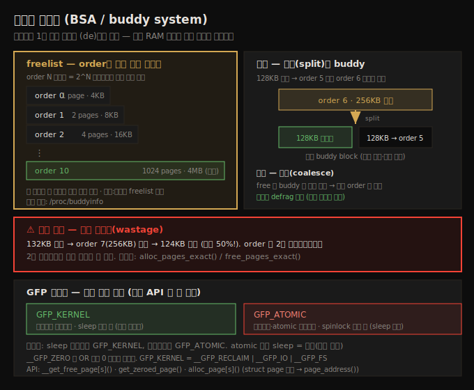
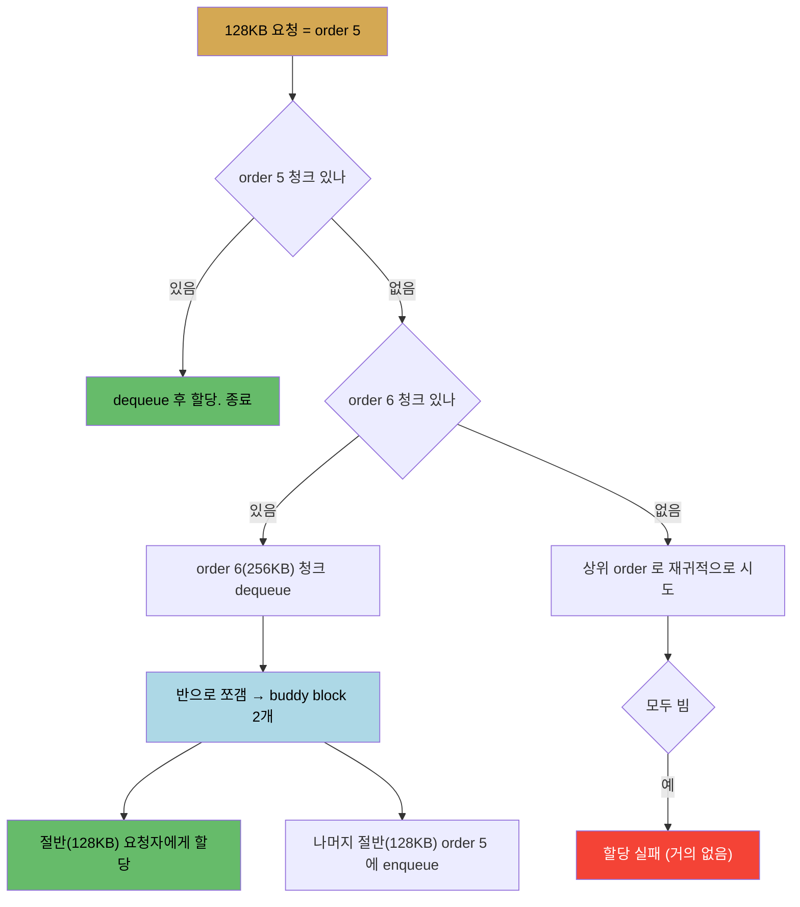

# 메모리 할당 (1) — 페이지 할당자와 GFP 플래그
---
> 페이지 할당자(Page Allocator, BSA)는 리눅스에서 물리 메모리를 실제로 (de)할당하는 1차 엔진입니다. buddy system 알고리즘으로 자유 페이지 프레임을 order별 freelist(2^order 페이지짜리 물리 연속 청크의 이중 연결 리스트)에 조직합니다. 할당 시 적합한 order 가 비면 상위 order 청크를 둘로 쪼개고(buddy block), 해제 시 buddy 를 찾아 병합해 메모리를 defrag 합니다. 최대 한 번에 4MB 까지 받을 수 있으나, 2의 거듭제곱이 아닌 크기는 내부 단편화로 크게 낭비됩니다.

앞 3부작(07-01~03)에서 가상·물리 메모리의 *구조*를 봤습니다. 이제 그 메모리를 커널 모듈이 *실제로 할당하고 해제하는* 방법으로 들어갑니다. 리눅스의 모든 RAM (de)할당은 결국 페이지 할당자를 거칩니다. 핵심 커널 서브시스템도, 모듈·디바이스 드라이버 같은 비핵심 코드도 마찬가지입니다.

이 노트는 그 1차 엔진인 페이지 할당자의 내부 알고리즘(buddy system)과 노출 API, 그리고 모든 할당 API 의 첫 인자인 GFP 플래그를 다룹니다. 아래 종합도가 척추 — freelist 구조, 분할·병합, 내부 단편화, GFP 플래그 — 입니다.




## 1. 페이지 할당자란 — 1차 엔진과 slab 의 관계

> 물리 메모리를 실제로 (de)할당하는 유일한 길이 페이지 할당자(BSA)입니다. slab 할당자는 그 위에 layered 되어 페이지 할당자의 약점을 보완하지만, 결국 메모리는 페이지 할당자에서 옵니다.

리눅스의 1차 (de)할당 엔진은 **페이지 할당자(Page Allocator, PA)**, 다른 이름으로 **BSA(Buddy System Allocator)**입니다. 내부적으로 buddy system 알고리즘을 써서 자유 RAM 청크를 조직합니다.

페이지 할당자만 있는 건 아닙니다. 그 위에 **slab 할당자**(slab cache)가 layered 됩니다(다음 노트 08-02 의 주제). 하지만 물리 메모리를 *실제로* (de)할당하는 유일한 길은 페이지 할당자입니다. slab 도 결국 페이지 할당자에서 메모리를 받습니다.

처음부터 분명히 할 점은 다음과 같습니다.

1. 메모리 관리 서브시스템 자신(과 극소수 arch 특화 코드)을 제외한 모든 커널 컴포넌트는 결국 페이지 할당자로 메모리를 (de)할당합니다. 모듈·드라이버도 포함입니다.
2. slab 과 페이지 할당자는 모두 커널 가상 주소 공간에 살며, 유저 공간에서 직접 접근할 수 없습니다.
3. 페이지 할당자가 메모리를 얻는 페이지 프레임은 커널의 lowmem 영역, 즉 direct-mapped RAM 영역입니다.
4. 유저 공간의 `malloc()` 계열은 페이지·slab 할당자로 *직접* 매핑되지 않습니다. 간접적으로 연결됩니다(demand paging — 다음 챕터 주제).
5. 커널 메모리는 swap 되지 않습니다(non-swappable). 초기 리눅스 설계 결정으로, 성능을 위해 디스크로 swap out 되지 않습니다. 유저 공간 페이지는 기본 swap 가능하며 `mlock()`/`mlockall()` 로 바꿀 수 있습니다.


## 2. buddy system freelist 의 조직

> 페이지 할당자의 핵심 메타데이터는 freelist 입니다. order 0 ~ MAX_ORDER-1 의 이중 연결 리스트 배열이며, order N 리스트는 2^N 페이지짜리 물리 연속 청크를 담습니다. 노드:존마다 별도 freelist 를 둡니다.

buddy system 알고리즘의 핵심은 **freelist** 라는 1차 내부 메타데이터입니다. 이중 연결 순환 리스트들을 가리키는 포인터 배열이며, 배열 인덱스를 **order** 라 부릅니다 — 2를 거듭제곱할 지수입니다. 배열 길이는 0 부터 `MAX_ORDER-1` 까지입니다.

`MAX_ORDER` 값은 arch 의존적입니다. x86 과 ARM 에서 11, Itanium 같은 대형 시스템에서는 17 입니다. x86·ARM 에서 order(인덱스)는 0~10 범위이고, 각 order N 의 리스트는 2^N 페이지짜리 물리 연속 청크를 담습니다. 페이지 크기 4KB 가정 시 11개 리스트(0~10)는 다음 크기를 갖습니다.

| order | 페이지 수 | 청크 크기 |
|-------|----------|----------|
| 0 | 2^0 = 1 | 4KB |
| 1 | 2^1 = 2 | 8KB |
| 2 | 2^2 = 4 | 16KB |
| 3 | 2^3 = 8 | 32KB |
| ⋮ | ⋮ | ⋮ |
| 10 | 2^10 = 1024 | 4MB |

각 청크는 그 자체로 물리 연속 RAM 임이 보장됩니다. 또한 한 order 의 청크 크기는 항상 이전 order 의 두 배입니다(2의 거듭제곱이니 당연합니다).

현재 freelist 상태는 `/proc/buddyinfo` 의사 파일로 요약해 볼 수 있습니다. 1GB RAM Ubuntu VM 예시:

```
Node 0, zone   DMA     35  ...
Node 0, zone DMA32    ...  678(order 3)  ...
```

`zone XXX` 뒤 숫자들은 order 0, 1, 2, …, MAX_ORDER-1 리스트 각각의 자유(물리 연속) 페이지 프레임 청크 개수입니다. 예를 들어 node 0, zone DMA, order 0 에 35 면 4KB 청크 35개, node 0, zone DMA32, order 3 에 678 이면 32KB(2^3=8페이지) 청크 678개가 그 리스트에 있다는 뜻입니다.

커널은 **노드:존마다** freelist 를 따로 둡니다. NUMA 시스템에서 메모리를 할당하는 자연스러운 방식입니다. 할당 요청이 오면 요청 스레드가 실행 중인 노드의 freelist 를 우선 고르고, 그 존이 부족하면 fallback 리스트로 다른 freelist 를 시도합니다.

> 실제 레이아웃은 더 복잡합니다. 2.6.24 커널부터 각 freelist 는 페이지 migration type(unmovable·movable·reclaimable·CMA·isolate)별로 최대 6개 freelist 로 더 쪼개집니다. 단편화를 줄이기 위한 것입니다. 4 노드·3 존 시스템이면 4×3=12 freelist, 여기에 migration type 까지 곱하면 최대 6×12=72 개의 freelist 가 시스템 전역에 존재합니다. 상세 뷰는 `/proc/pagetypeinfo`(root 필요)에서 볼 수 있습니다.


## 3. 할당 동작 — 분할(split)과 buddy block

> 적합한 order 리스트가 비면 상위 order 청크를 둘로 쪼개 buddy block 을 만듭니다. 절반은 요청자에게 주고 절반은 하위 order 에 넣습니다. buddy block 은 같은 크기에 물리 인접한 블록입니다.

디바이스 드라이버가 128KB 를 요청하는 경우로 (개념적으로) 동작을 봅니다.

1. 요청 크기를 페이지 단위로 환산: 128KB / 4KB = 32 페이지.
2. 32 를 얻으려면 2를 몇 제곱해야 하는지 계산: log₂32 = 5. 따라서 order 5 리스트가 딱 이 크기(2^5 페이지 = 128KB)를 갖습니다.
3. 적합한 노드:존 freelist 의 order 5 리스트를 확인. 청크가 있으면 dequeue 해 할당하고 종료.

order 5 가 비어 있으면(null) 흥미로운 일이 벌어집니다.



청크를 반으로 쪼갤 수 있는 이유는 모든 청크가 물리 연속임이 보장되기 때문입니다. 쪼개면 두 절반이 생기고, 각각을 **buddy block** 이라 합니다 — 그래서 이 알고리즘 이름이 buddy system 입니다. 정확히는 2의 거듭제곱 크기를 쓰므로 binary buddy system 이며, buddy block 은 "같은 크기이고 물리 인접한 블록"으로 정의됩니다.

실제 코드 구현은 더 복잡·최적화돼 있습니다. zoned buddy allocator 의 심장은 `mm/page_alloc.c:__alloc_pages()` 입니다(6.1.25 기준).

**해제 시 병합** — 드라이버가 나중에 128KB 청크를 free 하면, 알고리즘은 order 로 보아 order 5 에 속함을 계산합니다. 하지만 무작정 enqueue 하기 전에 buddy block 을 찾습니다. 찾으면 둘을 더 큰 블록(256KB)으로 병합해 order 6 에 enqueue 합니다. 메모리를 defrag 한 것입니다.


## 4. 내부 단편화 — buddy system 의 결정적 약점

> 2의 거듭제곱이 아닌 크기를 요청하면 더 큰 청크를 받아 큰 낭비가 생깁니다. 132KB 요청에 256KB 가 할당되면 124KB(약 50%)가 낭비됩니다. 완화책은 alloc_pages_exact() / free_pages_exact() 쌍입니다.

편리한 2의 거듭제곱 크기를 요청하면 매끄럽게 처리됩니다. 그렇지 않으면 문제입니다.

드라이버가 132KB 를 요청한다고 합시다. 할당자는 요청보다 적게 줄 수 없으니 더 많이 줍니다 — order 7 의 256KB 청크입니다. 소비자는 256KB 중 앞 132KB 만 보고 쓰고, 나머지 124KB 는 낭비됩니다(거의 50%!). 이것이 **내부 단편화(internal fragmentation, wastage)**이며 binary buddy system 의 치명적 약점입니다.

완화책이 있습니다. 2008년 Timur Tabi(Freescale)가 기여한 패치로 추가된 API 쌍입니다.

```c
#include <linux/gfp.h>
void *alloc_pages_exact(size_t size, gfp_t gfp_mask);
void free_pages_exact(void *virt, size_t size);
```

`alloc_pages_exact()` 의 첫 인자 `size` 는 바이트 단위입니다. 이 API 의 구현은 단순하고 영리합니다. 먼저 `__get_free_pages()` 로 요청을 "평소처럼" 전부 할당한 뒤(즉 256KB), 지정된 크기(132KB) 너머의 불필요한 페이지를 루프 돌며 free 합니다. 결과적으로 132KB~256KB 구간의 미사용 메모리가 풀려 낭비가 크게 줄어듭니다. 단 할당된 메모리는 여전히 물리 연속이며, 한 번에 할당 가능한 양은 `MAX_ORDER` 제한을 받습니다.

`free_pages_exact()` 는 `alloc_pages_exact()` 로 할당한 메모리만 해제하는 데 써야 하며, 첫 인자는 매칭되는 alloc 의 반환값(할당 메모리 포인터)입니다.


## 5. 페이지 할당자 API

> __get_free_page[s](), get_zeroed_page(), alloc_page[s]() 가 할당 API 입니다. 모두 첫 인자는 GFP 플래그, 둘째는 order 입니다. alloc_page[s]() 는 struct page 포인터를 반환하므로 page_address() 로 KVA 로 변환해야 합니다.

페이지 할당자 API 는 low-level (de)allocator 루틴이라고도 합니다. 모든 프로토타입은 `include/linux/gfp.h` 에 있습니다.

| API | 동작 | 반환 |
|-----|------|------|
| `__get_free_page(gfp)` | 정확히 1 페이지. 내용 random. `__get_free_pages(gfp, 0)` 래퍼 | KVA(kernel logical address) |
| `__get_free_pages(gfp, order)` | 2^order 물리 연속 페이지. 내용 random | KVA |
| `get_zeroed_page(gfp)` | 정확히 1 페이지. 0 으로 초기화 | KVA |
| `alloc_page(gfp)` | 1 페이지. 내용 random. `alloc_pages(gfp, 0)` 래퍼 | **struct page \*** |
| `alloc_pages(gfp, order)` | 2^order 물리 연속 페이지. 내용 random | **struct page \*** |

주의할 점은 `alloc_page()`·`alloc_pages()` 가 할당 메모리 시작 포인터가 아니라 그 메모리의 `struct page` 메타데이터 구조 포인터를 반환한다는 것입니다. 실제 메모리 시작 포인터는 `page_address()` API 로 얻습니다.

```c
pg_ptr1 = alloc_page(GFP_KERNEL);
gptr4 = page_address(pg_ptr1);   // struct page * → KVA
```

물리 연속성을 검증하려면 각 페이지의 물리 주소와 PFN(Page Frame Number)을 출력해 봅니다. PFN 은 단순히 인덱스(페이지 번호)로, 물리 주소 8192 의 PFN 은 2(8192/4096)입니다. 책의 `klib.c:show_phy_pages()` 라이브러리 루틴은 가상 주소를 `virt_to_phys()` 로 물리 주소로 바꾸고 `PHYS_PFN()` 으로 PFN 을 구해, PFN 이 1씩 연속인지로 물리 연속성을 확인합니다.

> ⚠️ 보안: 커널 주소를 출력할 때는 `%pK` 포맷 지정자를 써야 합니다(해시값 출력). 실제 주소를 보여주는 `%px` 는 학습 목적에만 쓰고 프로덕션에서는 쓰지 않습니다.

**해제 API** — 할당했으면 반드시 해제해 누수를 막습니다.

| API | 동작 |
|-----|------|
| `free_page(addr)` | 단일 페이지 해제. `__free_pages(addr, 0)` 래퍼 |
| `free_pages(addr, order)` | 다중 페이지 해제. `__free_pages()` 래퍼. 첫 인자는 메모리 시작 포인터 |
| `__free_pages(page, order)` | 실제 작업 루틴. 첫 인자는 **struct page \*** |

일반적으로 `__foo()` 내부 루틴 대신 `foo()` 래퍼를 호출합니다. 래퍼는 동기화·유효성 검사를 거치는 반면 `__foo()` 는 속도를 위해 검사를 건너뛰기 때문입니다.


## 6. GFP 플래그 — 할당 동작 제어

> 모든 할당 API 의 첫 인자입니다. 황금률: 프로세스 컨텍스트에서 sleep 안전하면 GFP_KERNEL, 인터럽트·atomic·spinlock 보유로 sleep 불가능하면 GFP_ATOMIC. 이를 어기면 머신이 멈추거나 커널이 죽습니다.

GFP 는 Get Free Page 의 약자입니다. 모듈·드라이버 개발자에게 결정적인 플래그는 둘뿐입니다(나머지는 내부용).

1. **`GFP_KERNEL`**: 프로세스 컨텍스트에서 실행 중이고 sleep 해도 안전할 때.
2. **`GFP_ATOMIC`**: sleep 이 불안전할 때(인터럽트 등 atomic 컨텍스트). spinlock 보유 시 필수.

이 규칙을 어기면 — atomic 컨텍스트에서 sleep 하면 — 머신 전체가 멈추거나 커널이 죽거나 무작위 오작동이 일어납니다.

**"sleep 안전"의 의미** — blocking 호출은 호출 스레드가 어떤 이벤트를 기다리며 sleep 상태로 들어가는 호출입니다(예: 유저 공간 `sleep()`, `read()`). sleep 중인 스레드는 CPU run queue 에서 빠져 wait queue 로 가며, 스케줄 후보조차 아닙니다. 커널 모드에서 이런 blocking 기능을 호출하는 것은 **프로세스 컨텍스트이고 sleep 안전할 때만** 허용됩니다. spinlock 보유는 sleep 불안전, mutex lock 보유는 sleep 가능입니다. atomic·인터럽트 컨텍스트에서 blocking 호출은 버그입니다.

내가 atomic 컨텍스트인지 미리 알려면: 커널 설정의 `CONFIG_DEBUG_ATOMIC_SLEEP`("Sleep inside atomic section checking")을 켜고, `in_task()`·`in_atomic()` 매크로로 판별합니다. 본질적으로 스레드를 sleep 시키는 것은 `schedule()` 호출이며, `schedule()` 은 sleep 안전한 컨텍스트에서만 호출해야 합니다.

> **LDV 규칙**: spinlock 보유 중 blocking 할당 금지("Using a blocking memory allocation when spinlock is held"). spinlock 을 쥔 동안에는 `GFP_ATOMIC` 만 써야 합니다. 위반하면 불안정·암묵적 deadlock 위험이 있습니다.

**`__GFP_ZERO`** 를 OR 하면 0 초기화 메모리를 받습니다(`GFP_KERNEL|__GFP_ZERO`). 좋은 관행입니다.

내부용 플래그도 있습니다. 메모리 회수를 위한 `__GFP_IO`(물리 I/O 시작 가능), `__GFP_FS`(저수준 파일시스템 코드 호출 가능) 등입니다. 코드 레벨에서 두 핵심 플래그는 다음으로 정의됩니다.

```c
// include/linux/gfp_types.h
#define GFP_ATOMIC  (__GFP_HIGH|__GFP_ATOMIC|__GFP_KSWAPD_RECLAIM)
#define GFP_KERNEL  (__GFP_RECLAIM | __GFP_IO | __GFP_FS)
```

즉 `GFP_KERNEL` 은 메모리를 능동 회수하고 물리·파일시스템 I/O 를 시작할 수 있어, 요청 메모리를 얻을 확률이 높습니다.

> **LDV 규칙(추가)**: USB 디바이스 lock 보유 중에는 `GFP_KERNEL` 대신 `GFP_NOIO` 를 써야 합니다. `GFP_KERNEL` 은 I/O 를 시작할 수 있어, USB lock 사이에서 문제가 될 수 있기 때문입니다.


## 7. 페이지 할당자 — 장단점 요약

> 빠르고 물리 연속·cacheline 정렬을 보장하며 RAM 을 defrag 하지만, 내부 단편화가 클 수 있고 한 번에 4MB 가 상한입니다.

| 장점 | 단점 |
|------|------|
| 빠름 — 부팅 시 매핑된 identity-mapped RAM 사용, lowmem 영역이라 페이지 테이블 설정 불필요 | **내부 단편화(낭비)가 너무 클 수 있음** (1차 문제) |
| 물리 연속 + CPU cacheline 정렬 메모리 보장 | 할당 granularity 가 페이지 — 128바이트 요청에 4KB 할당 |
| buddy block 병합으로 RAM defrag (외부 단편화 완화) | 한 번에 최대 4MB(MAX_ORDER=11·4KB 페이지 가정) |
| 알고리즘 시간 복잡도 O(log n) | |

따라서 결론은 이렇습니다. 필요한 메모리가 크고 2의 거듭제곱에 가까우면 페이지 할당자를, 작으면(1페이지 미만) slab 할당자를 씁니다. slab 은 다음 노트(08-02)의 주제입니다.


## 자주 받는 오해

1. "kmalloc 같은 slab API 만 쓰면 페이지 할당자와 무관하다"고 생각하지만, slab 은 페이지 할당자 위에 layered 되어 결국 메모리를 페이지 할당자에서 받습니다. 8KB 초과 요청은 그대로 페이지 할당자로 위임되어 같은 내부 단편화를 겪습니다.
2. "유저 공간 `malloc()` 이 곧 커널의 `kmalloc()` 을 부른다"고 생각하지만, 직접 매핑이 아닙니다. demand paging 을 통해 간접적으로만 연결됩니다.
3. "최대 4MB 를 요청하면 항상 받는다"고 생각하지만, 그렇지 않습니다. 그 시점 freelist 에 물리 연속 4MB 청크가 있어야 합니다. 오래 가동된 시스템은 단편화로 상위 order 청크가 하위 order 로 내려가 있을 확률이 높습니다(`/proc/buddyinfo` 로 확인).


## 면접에서 받을 만한 질문

1. **buddy system 은 어떻게 동작하나요?** → freelist 는 order 0~MAX_ORDER-1 의 이중 연결 리스트 배열이고, order N 은 2^N 페이지짜리 물리 연속 청크를 담습니다. 요청 크기를 order 로 환산해 해당 리스트를 보고, 비면 상위 order 청크를 둘로 쪼개(buddy block) 절반을 줍니다. 해제 시 buddy 를 찾아 병합해 defrag 합니다. 예를 들어 128KB(order 5) 요청 시 order 5 가 비면 order 6(256KB)을 쪼개 128KB 둘로 만듭니다.
2. **페이지 할당자의 가장 큰 약점은?** → 내부 단편화입니다. 2의 거듭제곱이 아닌 크기를 요청하면 더 큰 청크를 받습니다. 132KB 요청 시 256KB 가 할당되어 124KB(약 50%)가 낭비됩니다. 완화책으로 `alloc_pages_exact()`/`free_pages_exact()` 쌍이 있어, 평소처럼 할당한 뒤 초과분을 free 합니다.
3. **GFP_KERNEL 과 GFP_ATOMIC 은 언제 쓰나요?** → 프로세스 컨텍스트에서 sleep 안전하면 `GFP_KERNEL`, 인터럽트·atomic 컨텍스트거나 spinlock 을 쥐어 sleep 불가능하면 `GFP_ATOMIC` 입니다. atomic 컨텍스트에서 sleep 하면 머신이 멈추거나 커널이 죽습니다. spinlock 보유 중에는 반드시 `GFP_ATOMIC` 을 써야 하지만, mutex 보유 중에는 blocking 이 허용됩니다.
4. **alloc_pages() 가 반환하는 것은?** → 할당 메모리 시작 포인터가 아니라 그 메모리의 `struct page` 메타데이터 구조 포인터입니다. 실제 KVA 를 얻으려면 `page_address()` 로 변환해야 합니다. `__get_free_pages()` 같은 다른 API 는 바로 KVA 를 반환하므로 혼동하지 않도록 주의합니다.


## 관련 문서

- [상위 MOC](../README.md) — 커널 개발자 관점 리눅스 내부 인덱스
- [08-02. 메모리 할당 (2) — slab 할당자와 kmalloc 낭비](./08-02.메모리 할당 (2) — slab 할당자와 kmalloc 낭비.md) — 짝 노트. page 위에 layered 된 slab 캐시와 kmalloc 의 실제 낭비
- [07-03. 메모리 관리 (3) — 물리 메모리와 NUMA](./07-03.메모리 관리 (3) — 물리 메모리와 NUMA.md) — 페이지 프레임·노드:존·direct-map 의 기반 개념
