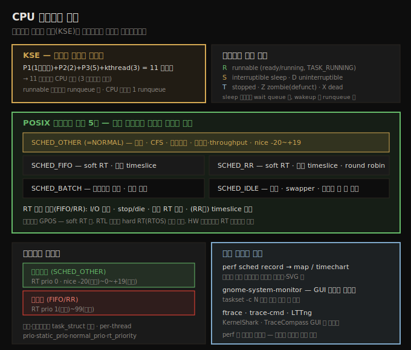

# CPU 스케줄러 (1) — 스케줄링 기초와 흐름 시각화
---
> 리눅스에서 스케줄링의 단위(KSE, Kernel Schedulable Entity)는 프로세스가 아니라 **스레드**입니다. 모든 스레드는 정의된 상태(R·S·D·T·Z·X)를 오가며, runnable(R) 스레드만 CPU 코어당 하나씩 있는 runqueue 에 올라 CPU 를 경쟁합니다. POSIX 정책 5종 — `SCHED_OTHER`(기본·CFS·nice -20~+19), `SCHED_FIFO`/`SCHED_RR`(soft real-time 1~99), `SCHED_BATCH`, `SCHED_IDLE` — 중 모든 스레드는 정확히 하나에 속합니다. 코어별로 어느 스레드가 도는지는 `perf sched`·gnome-system-monitor·ftrace 로 시각화합니다.

앞 챕터들에서 메모리 관리·할당을 다뤘으니, 이제 또 하나의 핵심 OS 주제 — CPU(task) 스케줄링 — 으로 들어갑니다. OS 수준에서 스케줄링이 어떻게 동작하는지 이해하면 커널/드라이버 개발자뿐 아니라 유저 공간 앱의 시스템 아키텍트로서도 더 나은 판단을 하게 됩니다.

이 노트는 스케줄링을 이해하는 데 필요한 배경 — KSE 개념, 프로세스 상태 머신, POSIX 정책, 우선순위 — 과, CPU 코어에서 스레드가 실행되는 흐름을 눈으로 보는 도구들을 다룹니다. 아래 종합도가 척추 — KSE, 상태 머신, POSIX 정책 5종, 우선순위 스케일, 시각화 도구 — 입니다.




## 1. KSE — 스케줄 단위는 프로세스가 아니라 스레드

> 모든 OS 는 스케줄링을 합니다. 그런데 무엇을 스케줄하는가? 리눅스의 KSE 는 스레드입니다. 스케줄링은 스레드 단위로 수행되며, 프로세스 단위가 아닙니다.

06-01·06-02 에서 봤듯이, 살아있는 모든 (유저 모드) 스레드는 task 구조(`struct task_struct`)와 유저·커널 두 스택을 갖습니다. 커널 스레드는 task 구조와 커널 스택만 갖습니다.

모든 OS 는 task 스케줄링을 해야 합니다. 핵심 질문은 — 스케줄링이 작용하는 "객체"는 무엇인가? 곧 KSE(Kernel Schedulable Entity)는 무엇인가? 리눅스에서 **KSE 는 프로세스가 아니라 스레드**입니다(모든 프로세스는 최소 1개 스레드를 가집니다). 따라서 스케줄링은 스레드 granularity 에서 수행됩니다.

예로 이해합니다. CPU 코어 1개에 유저 프로세스 P1(1스레드)·P2(2스레드)·P3(5스레드)와 커널 스레드 3개가 있으면, 총 (1+2+5+3) = 11 스레드입니다. 이들이 모두 runnable 이면 단일 코어를 두고 **11 스레드가 경쟁**합니다 — 3 프로세스 + 3 커널 스레드가 아닙니다. 더 현실적으로는 11 중 4개가 runnable(runqueue 에 있고 실행하려 함), 나머지 7개는 다른 상태(sleeping·stopped)라 스케줄러 후보가 아닙니다.

> KSE 가 스레드이므로, 스케줄링 문맥에서는 (거의) 항상 스레드를 말합니다. 편하면 머릿속에서 "프로세스"로 바꿔 읽어도 됩니다.


## 2. 프로세스 상태 머신

> 모든 스레드는 정의된 상태들을 오갑니다 — R(runnable), S(interruptible sleep), D(uninterruptible sleep), T(stopped), Z(zombie), X(dead). runnable 스레드만 runqueue 에 올라 CPU 후보가 됩니다.

리눅스의 모든 스레드는 정의된 상태들을 순환하며, 이를 인코딩하면 상태 머신이 됩니다(`ps` 가 표시하는 문자).

| 상태 | 의미 |
|------|------|
| **R** | Ready-to-run 또는 Running (runnable) — `TASK_RUNNING` |
| **S** | Interruptible Sleep — `TASK_INTERRUPTIBLE`, 신호로 깨움 |
| **D** | Uninterruptible Sleep — `TASK_UNINTERRUPTIBLE`, 신호 무시 |
| **T** | Stopped (suspended/frozen) |
| **Z** | Zombie (defunct) — 죽었으나 부모가 wait 안 함 (transient) |
| **X** | Dead |

`fork()`/`clone()`/`pthread_create()` 로 스레드가 태어나 OS 가 완전히 탄생했다고 판단하면, 스레드를 **runnable(R)** 상태로 만들어 스케줄러에 알립니다. R 상태는 실제로 코어에서 실행 중이거나 ready-to-run 입니다 — 둘 다 **runqueue** 라는 자료구조에 enqueue 됩니다. 리눅스는 CPU 코어당 runqueue 하나를 유지하며, ready-to-run 과 actually running 을 구분하지 않고 둘 다 R 로 표시합니다(task 구조의 `__state` 멤버에 값을 설정).

sleep 상태 스레드는 **wait queue** 에 enqueue 됩니다 — 이벤트를 기다리는(blocking call 안의) 곳입니다. 기다리던 이벤트가 발생하면 OS 가 wakeup 해, wait queue 에서 dequeue 하고 runqueue 에 enqueue 합니다. 단 즉시 실행되는 게 아니라 runnable 이 되어 스케줄러 후보가 됩니다.

> 흔한 오해: OS 가 runqueue 1개·wait queue 1개를 유지한다고 생각하지만, 커널은 **CPU 코어당 runqueue 1개**를 유지합니다. wait queue 는 드라이버(와 커널)가 만들어 쓰므로 개수가 무제한입니다. 모든 `fork()` 는 대응하는 `wait*()` 가 필요합니다(zombie 방지) — 리눅스는 zombie 의 부모를 죽이면 zombie 도 reap 됩니다.


## 3. POSIX 스케줄링 정책 5종

> POSIX 는 최소 3개 정책을 요구하고, 리눅스는 그 이상을 scheduling class 설계로 구현합니다. 모든 스레드는 정확히 하나의 정책에 속하며(런타임 변경 가능), 정책마다 우선순위 스케일이 다릅니다.

scheduling policy 는 대략 scheduling algorithm 과 같습니다. POSIX 표준은 최소 3개를 요구하고, 리눅스는 scheduling class 라는 강력한 설계로 이를 포함해 더 많이 구현합니다(다음 노트 10-02 주제). 모든 스레드는 어느 한 순간 정확히 하나의 정책에 속합니다(런타임 변경 가능).

| 정책 | 핵심 | 우선순위 스케일 |
|------|------|----------------|
| `SCHED_OTHER` (`SCHED_NORMAL`) | 항상 기본 · 비실시간 · CFS 가 구동 · 동기는 공정성과 throughput | RT prio 0 · nice -20(최고)~0~+19(최저) |
| `SCHED_RR` | soft RT · 유한 timeslice(기본 100ms) · 같은 우선순위끼리 round robin | RT prio 1(최저)~99(최고) |
| `SCHED_FIFO` | soft RT · 사실상 무한 timeslice · RR 보다 aggressive | RR 과 동일 |
| `SCHED_BATCH` | 비대화형 배치 잡 · 적은 선점 | nice -20~+19 |
| `SCHED_IDLE` | 최저 · PID 0 swapper(per-CPU idle 스레드) · 아무도 CPU 안 쓸 때만 | 모두보다 낮음(+19 보다도) |

여기서 real-time 은 soft(또는 firm) real-time 이지 RTOS 의 hard real-time 이 아닙니다. 리눅스는 GPOS(범용 OS)이지 RTOS 가 아닙니다. 단 외부 RTL 패치(Linux Foundation 지원)로 hard real-time RTOS 로 전환할 수 있습니다(다음 챕터 주제).

**FIFO 양보 조건**(IFF): ① I/O 블록(sleep) ② stop/die ③ 상위 RT 스레드가 runnable(선점). RR 은 여기에 ④ timeslice 만료가 추가됩니다.

FIFO 와 RR 의 차이입니다.

1. FIFO 는 사실상 무한 timeslice, RR 은 유한 timeslice(`/proc/sys/kernel/sched_rr_timeslice_ms`, 기본 100ms).
2. 같은 우선순위에서 RR 은 round robin(다른 RR 에 CPU 양보), FIFO 는 선점된 task 가 다시 다음 실행 대상이 되어 같은 우선순위의 다른 task 가 CPU 를 못 받습니다. 그래서 FIFO 사용 시 같은 우선순위에 스레드를 두는 것을 피해야 합니다.

> 중요: OS 에서 하드웨어(와 소프트웨어) 인터럽트는 항상 SCHED_FIFO 스레드(커널·유저)보다 우선하며 선점합니다.


## 4. 스레드 우선순위 스케일

> 비실시간 스레드(SCHED_OTHER)는 RT prio 0 으로 실시간 스레드와 경쟁조차 못 하며, nice(-20~+19)로 구분됩니다. 실시간 스레드는 RT prio 1~99 로 구분됩니다.

우선순위 스케일은 낮은 것에서 높은 것 순으로 단순합니다.

1. **비실시간(SCHED_OTHER)**: real-time priority 가 0 — 실시간 스레드와 경쟁조차 못 합니다(같은 운동장이 아님). 비실시간끼리는 (옛 UNIX 식) **nice 값**으로 구분합니다 — -20(최고)~0(기본)~+19(최저).
2. **실시간(SCHED_FIFO/SCHED_RR)**: real-time priority 가 1(최저)~99(최고). 비선점 단일 코어 커널에서 RT prio 99 의 FIFO 스레드가 무한 루프를 돌면 사실상 머신을 멈춥니다(단 인터럽트는 이마저 선점).

scheduling policy 는 task 구조의 scheduling class 멤버로 (느슨히) 지정되고, 정책·우선순위(static nice, RT prio)도 task 구조 멤버입니다(`prio`·`static_prio`·`normal_prio`·`rt_priority`). scheduling class 는 배타적이라 한 스레드는 어느 순간 하나의 class 에만 속합니다.

> 많은 배포판이 autogroups(`CONFIG_SCHED_AUTOGROUP`)를 켭니다. 포그라운드 터미널 프로세스의 대화형 응답을 빠르게 해 주며, 켜지면 전통적 nice 개념이 그대로 쓰이지 않고 내부적으로 cgroups 를 leverage 합니다. 또 모던 커널엔 RT/RR 보다 우선인 stop-sched·deadline class 도 있습니다(다음 노트).


## 5. 흐름 시각화 — perf·gnome-system-monitor·ftrace

> 어느 스레드가 어느 코어에서 도는지는 여러 도구로 시각화합니다. perf sched 로 텍스트·SVG 타임라인을, gnome-system-monitor 로 GUI 코어별 사용률을, ftrace·LTTng 로 커널 흐름을 봅니다.

멀티코어에서 스레드는 여러 코어에서 동시 실행됩니다. 어느 스레드가 어느 코어에서 도는지를 보는 방법이 여럿 있습니다.

**gnome-system-monitor (GUI)** — 코어별 사용률을 GUI 로 봅니다. CPU-bound 인 `yes` 유틸을 `taskset -c N` 으로 특정 코어에 고정해 실행하면(예: `taskset -c 2 yes >/dev/null &`), 각 코어에서 100% 로 도는 것이 보입니다. `nproc` 로 코어 수(0부터)를 확인하고, `pkill yes` 로 종료합니다.

**perf sched (텍스트·그래픽)** — CPU 프로파일링의 강력한 도구입니다. 이벤트를 먼저 record 합니다.

```
sudo perf sched record [command]    # 인자 없으면 시스템 전역, ^C 로 종료
```

`perf.data` 가 생기면 두 방식으로 봅니다.

1. **텍스트 map**: `sudo perf sched map` — 컬럼은 CPU 코어(0부터), Timestamp, Legend(각 스레드에 2글자 이름) 순입니다. 한 줄에 여러 스레드가 보이면 그 코어들에서 **동시 실행**된 것입니다(`*` 는 컨텍스트 스위치 발생).
2. **그래픽 SVG**: `sudo perf timechart -i ./perf.data` — `output.svg` 를 생성해 브라우저·벡터 뷰어로 봅니다(파란색 = Running). `-I` 로 디스크 I/O·네트워크 이벤트만 기록할 수도 있습니다.

> `perf` 는 커널과 강결합되어 있어, 커스텀 커널이면 그 소스 트리(`tools/perf/`)에서 직접 빌드해야 합니다. `perf top`(`--sort comm,dso` 등)으로 무엇이 CPU 를 먹는지도 봅니다. `perf data convert --to-ctf` 로 CTF 포맷 변환 후 Trace Compass 로 분석할 수 있습니다.

**그 외 도구**: ftrace(커널 함수 추적)·trace-cmd(ftrace front-end)·LTTng(커널·유저 추적)가 콘솔 기반이고, KernelShark(ftrace/trace-cmd GUI)·TraceCompass(LTTng·CTF GUI)가 GUI 기반입니다. 간단한 Bash 함수(`ps -eLF | awk '{ if($5==N) print $0}'`)로 코어 N 에서 도는 스레드를 볼 수도 있습니다.


## 자주 받는 오해

1. "스케줄링은 프로세스 단위"라고 생각하지만, 리눅스의 KSE 는 스레드입니다. 3 프로세스(스레드 1+2+5)가 있으면 8 스레드가 각자 스케줄 단위로 CPU 를 경쟁합니다.
2. "OS 는 runqueue 1개·wait queue 1개를 유지한다"고 생각하지만, runqueue 는 **CPU 코어당 1개**이고 wait queue 는 드라이버·커널이 만들어 무제한입니다.
3. "비실시간 스레드도 nice 를 높이면 실시간 스레드와 경쟁할 수 있다"고 생각하지만, SCHED_OTHER 는 RT prio 0 이라 실시간 스레드(1~99)와 같은 운동장이 아닙니다. nice 는 비실시간끼리의 구분일 뿐입니다.
4. "RT prio 99 FIFO 스레드는 무엇으로도 멈출 수 없다"고 생각하지만, 하드웨어·소프트웨어 인터럽트는 RT 스레드도 선점합니다. 리눅스는 RTOS 가 아니라 GPOS 입니다.


## 면접에서 받을 만한 질문

1. **리눅스의 스케줄 단위(KSE)는 무엇인가요?** → 프로세스가 아니라 스레드입니다. 모든 스레드는 자신의 task 구조를 갖고 스레드 granularity 에서 스케줄됩니다. 예를 들어 5스레드 프로세스 하나는 5개의 스케줄 단위로 CPU 를 경쟁하며, 그중 runnable 인 것만 runqueue 에 올라 후보가 됩니다.
2. **프로세스 상태 머신의 상태들을 설명해 주세요.** → R(runnable, 실행 중/ready), S(interruptible sleep, 신호로 깨움), D(uninterruptible sleep, 신호 무시), T(stopped), Z(zombie, 죽었으나 부모가 wait 안 함), X(dead)입니다. runnable 만 runqueue 에, sleep 은 wait queue 에 있고 wakeup 시 runqueue 로 옮겨집니다.
3. **SCHED_FIFO 와 SCHED_RR 의 차이는?** → 둘 다 soft real-time(prio 1~99)이지만, FIFO 는 사실상 무한 timeslice 라 선점되면 다시 다음 실행 대상이 되어 같은 우선순위의 다른 task 가 CPU 를 못 받습니다. RR 은 유한 timeslice(기본 100ms)로 같은 우선순위끼리 round robin 합니다. 그래서 FIFO 는 같은 우선순위에 여러 스레드를 두는 것을 피해야 합니다.
4. **비실시간 스레드의 우선순위는 어떻게 정하나요?** → SCHED_OTHER 스레드는 RT prio 가 0 이라 실시간 스레드와 경쟁하지 못하고, nice 값(-20 최고 ~ 0 기본 ~ +19 최저)으로 서로 구분합니다. nice 는 CFS 가 vruntime 가중에 사용합니다.
5. **어느 스레드가 어느 코어에서 도는지 어떻게 확인하나요?** → `perf sched record` 로 이벤트를 기록한 뒤 `perf sched map`(텍스트 타임라인)이나 `perf timechart`(SVG)로 봅니다. GUI 로는 gnome-system-monitor 의 코어별 사용률을, 커널 흐름은 ftrace·trace-cmd·LTTng(+ KernelShark/TraceCompass GUI)로 시각화합니다.


## 관련 문서

- [상위 MOC](../README.md) — 커널 개발자 관점 리눅스 내부 인덱스
- [10-02. CPU 스케줄러 (2) — 모듈식 스케줄링 클래스와 CFS](./10-02.CPU 스케줄러 (2) — 모듈식 스케줄링 클래스와 CFS.md) — 5개 sched class·CFS vruntime·rb-tree·dynamic timeslice
- [06-02. 프로세스와 스레드 (2) — task 구조와 current](./06-02.프로세스와 스레드 (2) — task 구조와 current.md) — task_struct·current·컨텍스트 판별의 기반
