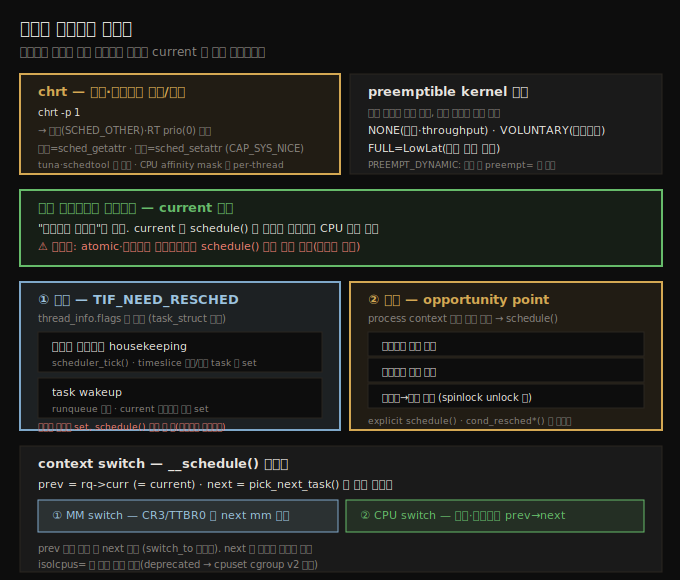
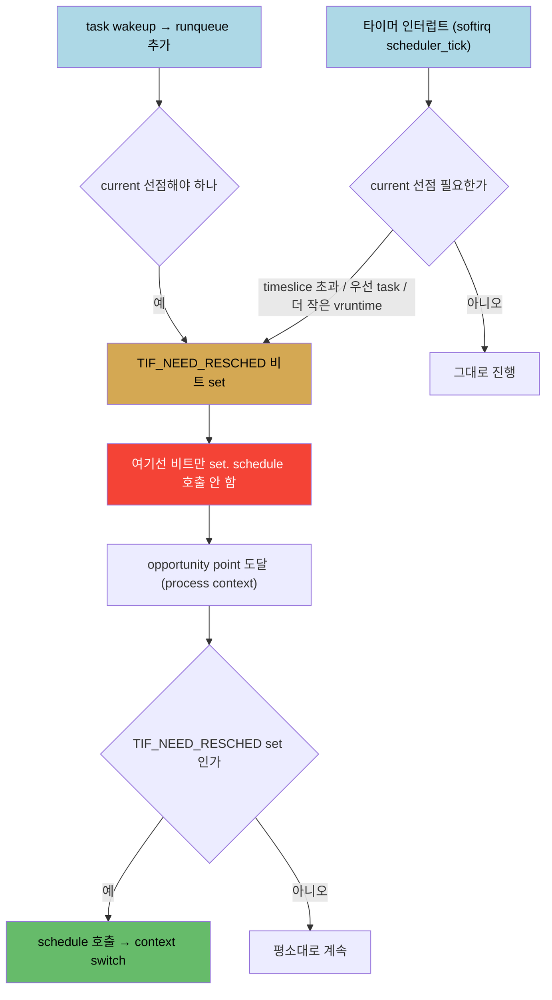

# CPU 스케줄러 (3) — 정책 질의와 선점·스케줄러 진입점
---
> `chrt` 로 스레드의 스케줄링 정책·우선순위를 질의·설정합니다(`sched_getattr`/`sched_setattr` 시스템콜). 선점 가능 커널은 `CONFIG_PREEMPT` 로 빌드하며 NONE(서버)·VOLUNTARY(데스크톱)·FULL(LowLat) 모드가 있고, `PREEMPT_DYNAMIC` 로 부팅 시 `preempt=` 파라미터로 선택합니다. 스케줄러 코드는 별도 스레드가 아니라 **`current` 자신**이 실행하며, atomic·인터럽트 컨텍스트에서는 `schedule()`을 절대 부르지 않습니다. `TIF_NEED_RESCHED` 비트는 타이머 housekeeping·task wakeup 때 **설정**되고, 시스템콜·인터럽트 복귀 같은 process context opportunity point 에서 **확인**되어 `schedule()`을 호출합니다.

앞 노트(10-02)에서 코어 스케줄러가 클래스를 순회하는 구조를 봤습니다. 이 노트는 (1) 임의 스레드의 정책·우선순위를 명령행으로 질의하는 법, 그리고 (2) 선점 가능 커널과, "누가·언제 스케줄러 코드를 실행하는가"라는 핵심 질문(`TIF_NEED_RESCHED` 비트의 설정·확인)·컨텍스트 스위치를 다룹니다.

아래 종합도가 척추 — chrt 질의, preemptible kernel 모드, current 가 실행, TIF_NEED_RESCHED 설정/확인, context switch — 입니다.




## 1. chrt — 스케줄링 정책·우선순위 질의

> chrt 로 임의 스레드의 정책·우선순위를 질의·설정합니다. 질의는 sched_getattr, 설정은 sched_setattr 시스템콜로 이뤄지며 설정에는 CAP_SYS_NICE 가 필요합니다.

10-01 에서 봤듯이 정책·우선순위는 per-thread 로 할당되며 기본은 `SCHED_OTHER`·RT prio 0 입니다. `ps -A`(또는 `ps -LA` 로 모든 스레드)는 스레드를 보여 주지만 정책·우선순위는 안 보여 줍니다. 이를 질의하는 도구가 `chrt` 입니다.

```
$ chrt -p 1
pid 1's current scheduling policy: SCHED_OTHER
pid 1's current scheduling priority: 0
```

PID 1(보통 systemd)은 `SCHED_OTHER`(CFS 구동)·RT prio 0(비실시간)입니다. 시스템의 모든 스레드를 순회하며 정책·우선순위를 보면 다음을 알 수 있습니다.

1. `ps -LA` 로 모든 스레드의 PID·TID 를 잡습니다. PID 는 커널 TGID, TID 는 커널 PID 의 유저 공간 대응입니다.
2. PID 와 TID 가 같고 한 번만 나오면 단일 스레드 프로세스, PID 가 여러 TID 로 반복되면 멀티스레드(그 TID 들이 worker 스레드)입니다.
3. 대부분 스레드는 비실시간(SCHED_OTHER)이고, soft RT(FIFO/RR)는 소수, deadline·stop-sched 는 드뭅니다.

주의할 점입니다.

1. `SCHED_RESET_ON_FORK` 플래그를 정책에 OR 하면 자식이 특권 정책을 상속하지 못하게 막습니다(보안).
2. nice 값은 SCHED_OTHER·batch·idle 에만 유효합니다(-20~+19).
3. **CPU affinity mask**(16진수)도 per-thread 속성으로, 스레드가 스케줄될 수 있는 코어를 지정합니다. 예: `0x3f` = `0011 1111` 이면 6코어 모두에서 실행 가능합니다.

정책·우선순위 변경은 root(또는 `CAP_SYS_NICE` capability)가 필요한 민감한 작업입니다. `chrt` 는 질의에 `sched_getattr()`, 설정에 `sched_setattr()` 시스템콜을 씁니다(`strace chrt -p 1` 로 확인). `tuna`(GUI/콘솔)·`schedtool` 도 정책·우선순위·affinity·IRQ affinity 를 질의·설정합니다.

> RT prio 99 FIFO 스레드가 항상 CPU 를 독점하지는 않습니다 — 대개 sleep 상태이다가, 커널이 깨우면 높은 우선순위 덕에 거의 즉시 코어를 얻어 필요한 만큼 실행하고 다시 잡니다(RTOS 의 보장·결정성은 없지만 비슷한 거동).


## 2. preemptible kernel — 커널이 스스로를 선점

> 유저 모드 선점은 모든 OS 가 지원하지만, 커널은 기본적으로 비선점이라 스스로를 선점하지 못합니다. CONFIG_PREEMPT 로 선점 가능 커널을 빌드하며 NONE·VOLUNTARY·FULL 세 모드가 있습니다.

단일 코어에서 유저 공간 `while(1);` 프로그램을 돌려도 GUI 시계는 계속 갑니다 — OS 스케줄러가 CPU-hogger 를 선점하기 때문입니다(CFS 가 큰 vruntime 을 쌓아 페널티). 이것이 **유저 모드 선점**으로, 모든 모던 OS 가 지원합니다.

그런데 커널 모듈에서 같은 `while(1)` 을 돌리면 단일 코어 시스템이 멈춥니다. 대부분 OS 커널은 기본적으로 **비선점**이라 스스로를 선점하지 못하기 때문입니다. 이는 실시간 스레드 스케줄링에 악영향을 줍니다 — 고우선순위 스레드가 runnable 인데 커널이 비선점 구역의 긴 루프에 갇히면 못 돕니다(옛날 BKL 이 이런 문제를 일으켰고 2.6.39 에서 제거).

`CONFIG_PREEMPT` 빌드 옵션으로 선점 가능 커널을 만듭니다. 세 모드가 있습니다.

| 모드 | 특성 |
|------|------|
| `CONFIG_PREEMPT_NONE` | 전통 · throughput 지향(서버) · 가끔 긴 지연 · `cond_resched()` 지점만 선점 |
| `CONFIG_PREEMPT_VOLUNTARY` | 데스크톱 · 명시적 선점 지점(`cond_resched`·`might_sleep`) 추가 · 낮은 latency · 배포판 기본인 경우 많음 |
| `CONFIG_PREEMPT` | LowLat · 거의 전체 커널 선점 가능 · 가장 낮은 latency(평균 수십~수백 μs) · 약간의 throughput·오버헤드 손실 |

**PREEMPT_DYNAMIC**(5.12+): 부팅 시 `preempt=` 파라미터로 선점 거동을 선택합니다 — `preempt=none`(=NONE)·`preempt=voluntary`(≈VOLUNTARY)·`preempt=full`(=PREEMPT, 기본). 배포판이 `CONFIG_PREEMPT` 로 빌드한 단일 커널 이미지를 배포하되, 사용자가 부팅 시 서버/데스크톱/full 거동을 고를 수 있게 합니다(`uname -a` 에 `PREEMPT_DYNAMIC` 표시).


## 3. 누가 스케줄러 코드를 실행하나 — current 자신

> 흔한 오해와 달리 "스케줄러 스레드"는 없습니다. monolithic OS 인 리눅스에서 스케줄링은 current 가 직접 실행하며, current 가 스스로를 CPU 에서 내리고 다른 스레드로 context switch 합니다. atomic·인터럽트 컨텍스트에서는 schedule() 을 절대 부르지 않습니다.

미묘하지만 핵심인 오해 — 주기적으로 도는 "스케줄러"라는 커널 스레드가 있다고 상상하는 것 — 은 틀렸습니다. monolithic OS 인 리눅스에서 스케줄링은 **현재 커널 모드에서 코드를 실행 중인 process context, 곧 `current` 자신**이 수행합니다.

스케줄링 코드는 항상 `current` 가 실행합니다(06-02 의 `current` 참조). 황금률 하나 — **스케줄러는 어떤 atomic 컨텍스트(인터럽트 포함)에서도 절대 실행되면 안 됩니다.** atomic·인터럽트 컨텍스트 코드는 non-blocking·atomic 으로, 중단 없이 완료되어야 합니다. 그래서 `schedule()` 을 거기서 부르는 것은 말이 안 됩니다(호출자를 sleep 시키는 코드 경로가 어떻게 atomic 일 수 있나요?).

마찬가지로 atomic 컨텍스트에서 `GFP_KERNEL` 로 `kmalloc()` 을 부르는 것도 틀립니다(block 할 수 있으니). `GFP_ATOMIC` 은 괜찮습니다(08-01 §6). 또 선점 가능 커널에서 schedule 코드가 도는 동안 커널 선점은 비활성화됩니다.

> 요약: 코어 task 스케줄링 코드(`[__]schedule()` 과 그것이 부르는 모든 것)는 process context 에서, 곧 스스로를 CPU 에서 내리고 다른 스레드로 context switch 할 `current` 가 실행합니다. 그리고 "never call schedule() in atomic/interrupt context" 규칙이 있습니다.


## 4. schedule() 은 언제 도나 — TIF_NEED_RESCHED 의 설정과 확인

> CPU 를 공정히 나누려면 스케줄러 자신이 주기적으로 돌아야 합니다. 하지만 타이머 인터럽트에서 schedule() 을 직접 부를 수는 없습니다(atomic). 대신 TIF_NEED_RESCHED 비트를 설정하고, process context 의 opportunity point 에서 확인해 schedule() 을 부릅니다.

CPU 를 공정히 나누려면 스케줄러 자신이 주기적으로 돌아야 합니다. 자연스러운 방법은 타이머 인터럽트 핸들러에서 스케줄러를 부르는 것입니다 — 타이머는 `CONFIG_HZ` 회/초 fire 합니다. 하지만 §3 의 황금률 — atomic/인터럽트 컨텍스트에서 schedule() 금지 — 때문에 타이머 인터럽트 안에서 직접 부를 수 없습니다.

해법은 `thread_info` 구조의 `flags` 비트 하나, **`TIF_NEED_RESCHED`** 를 쓰는 것입니다. `thread_info` 는 arch 의존 per-thread 구조로 작고(24바이트), 모던 커널에서 `CONFIG_THREAD_INFO_IN_TASK=y` 시 task 구조 안에 있습니다. `TIF_NEED_RESCHED` 비트가 set 이면 "ASAP 재스케줄 필요"를 뜻합니다.

전체 흐름은 **설정**과 **확인** 두 부분입니다.



**① 설정 — TIF_NEED_RESCHED 가 set 되는 경우**:

1. **타이머 인터럽트 housekeeping**: 매 타이머 인터럽트(timer softirq `scheduler_tick()`)마다 스케줄러 housekeeping 을 합니다. current 선점이 필요하면 비트를 set 합니다(단 비트만 set, schedule() 호출 안 함). 선점 판단 조건은 — current 가 effective timeslice(`min_granularity_ns`)를 충분히 초과했나 / 새로 깨어난 task 가 더 높은 우선순위인가 / rb-tree 에 current 보다 작은 vruntime task 가 있나(current 가 더는 최좌측 leaf 가 아닌가).
2. **task wakeup**: 깨어난 task 가 runqueue 에 추가될 때, current 를 선점해야 하면 비트를 set 합니다.

두 경우 모두 인터럽트 컨텍스트에서 실행되지만 문제없습니다 — schedule() 을 여기서 부르지 않고 비트만 set 해 "ASAP 재스케줄 필요"를 알리기 때문입니다.

**② 확인 — opportunity point 에서 비트 확인 후 schedule()**:

비트 확인과 schedule() 호출은 **process context 에서만**, 그리고 커널 코드에 뿌려진 특정 "opportunity point" 에서만 일어납니다(`need_resched()` 헬퍼로).

1. 시스템콜 복귀 경로 — 유저가 시스템콜로 커널 모드에 들어왔다 돌아갈 때, `EXIT_TO_USER_MODE_WORK` 에 `_TIF_NEED_RESCHED` 가 포함되어 set 이면 `schedule()` 호출.
2. 인터럽트 복귀 경로 — 하드웨어 인터럽트 처리 후 선점 가능으로 돌아갈 때.
3. 비선점→선점 전환 — `preempt_enable()` 호출 시(예: spinlock unlock).
4. 명시적/암묵적 `schedule()` 호출, `cond_resched*()` 호출.


## 5. context switch — __schedule() 안에서

> __schedule() 안에서 prev=current, next=pick_next_task() 가 고른 스레드입니다. current 가 스케줄러 코드를 실행해 스스로를 내리고 next 로 switch 합니다. switch 는 MM switch(CR3/TTBR0)와 CPU switch(스택·레지스터) 두 단계입니다.

`__schedule()` 은 `prev`·`next` 두 task 포인터를 가집니다. `prev = rq->curr`(= `current`)이고, `next` 는 context switch 할 다음 스레드입니다. **`current` 가 스케줄러 코드를 실행해, 스스로를 previous 라 부르고, 그 클래스의 pick-next-task 알고리즘을 돌린 뒤, next 로 context switch 해 스스로를 프로세서에서 내립니다.**

```c
static void __sched notrace __schedule(unsigned int sched_mode)
{
    struct task_struct *prev, *next;
    [ ... ]
    prev = rq->curr;                        // 이것이 current!
    next = pick_next_task(rq, prev, &rf);    // 객체지향식으로 다음 task 픽
    clear_tsk_need_resched(prev);
    clear_preempt_need_resched();
    if (likely(prev != next)) {              // 다른 스레드로 switch 가 likely
        rq = context_switch(rq, prev, next, &rf);
    }
}
```

`context_switch()` 는 두 arch 특화 단계로 switch 합니다.

1. **MM switch**: arch 레지스터를 `next` 의 메모리 디스크립터(`mm_struct`)로 전환합니다 — x86 은 CR3, ARM(AArch32)은 TTBR0. mm_struct 에서 페이징 테이블 베이스를 볼 수 있어, MMU 가 next 실행 시 next 의 페이징 테이블로 주소 변환을 합니다.
2. **CPU switch**: `prev` 의 스택·CPU 레지스터 상태를 저장하고 `next` 의 것을 복원합니다(`switch_to()` 매크로). next 가 멈췄던 곳에서 재개합니다.

> 코어 스케줄러의 모든 진입점은 `kernel/sched/core.c:__schedule()` 앞 주석에 정리되어 있습니다. 또 `isolcpus=` 커널 파라미터로 특정 코어를 SMP 밸런싱·스케줄링에서 격리할 수 있으나, 이제 deprecated 이고 cpuset cgroup v2 컨트롤러가 권장됩니다(다음 챕터 주제).


## 자주 받는 오해

1. "주기적으로 도는 '스케줄러' 커널 스레드가 있다"고 생각하지만, 없습니다. monolithic OS 인 리눅스에서 스케줄링은 `current` 가 직접 실행하며 스스로를 CPU 에서 내립니다.
2. "타이머 인터럽트에서 schedule() 을 부른다"고 생각하지만, atomic/인터럽트 컨텍스트라 부를 수 없습니다. 대신 `TIF_NEED_RESCHED` 비트만 set 하고, process context 의 opportunity point 에서 확인해 호출합니다.
3. "커널은 항상 스스로를 선점할 수 있다"고 생각하지만, 기본은 비선점입니다. `CONFIG_PREEMPT`(또는 `PREEMPT_DYNAMIC` + `preempt=full`)로 빌드·부팅해야 거의 전체 커널이 선점 가능해집니다.
4. "TIF_NEED_RESCHED 가 set 되면 즉시 schedule() 이 호출된다"고 생각하지만, set 은 인터럽트 컨텍스트에서도 되지만 호출은 process context 의 다음 opportunity point(시스템콜·인터럽트 복귀, preempt_enable 등)에서만 일어납니다.


## 면접에서 받을 만한 질문

1. **스케줄러 코드는 누가 실행하나요?** → 별도의 "스케줄러 스레드"가 아니라 `current` 자신입니다. monolithic OS 인 리눅스에서 현재 커널 모드 코드를 실행 중인 process context 가 `__schedule()` 을 실행해, 스스로를 prev 로 삼고 next 로 context switch 하며 자신을 CPU 에서 내립니다.
2. **왜 타이머 인터럽트에서 직접 schedule() 을 안 부르나요?** → atomic/인터럽트 컨텍스트에서는 블로킹·재스케줄이 금지된 황금률 때문입니다. 대신 타이머 softirq(`scheduler_tick`)에서 선점이 필요하면 `TIF_NEED_RESCHED` 비트만 set 하고, process context 의 opportunity point(시스템콜·인터럽트 복귀, `preempt_enable`)에서 확인해 `schedule()` 을 부릅니다.
3. **preemptible kernel 의 세 모드는?** → `CONFIG_PREEMPT_NONE`(서버·throughput, cond_resched 지점만 선점), `CONFIG_PREEMPT_VOLUNTARY`(데스크톱, 명시적 선점 지점 추가), `CONFIG_PREEMPT`(LowLat, 거의 전체 커널 선점)입니다. `PREEMPT_DYNAMIC`(5.12+)이면 부팅 시 `preempt=none|voluntary|full` 로 선택합니다.
4. **context switch 의 두 단계는?** → ① MM switch — arch 레지스터(x86 CR3, ARM TTBR0)를 next 의 `mm_struct` 로 전환해 MMU 가 next 의 페이징 테이블로 변환하게 합니다. ② CPU switch — `switch_to()` 매크로로 prev 의 스택·레지스터를 저장하고 next 의 것을 복원해 next 가 멈췄던 곳에서 재개합니다.
5. **chrt 는 내부적으로 어떻게 동작하나요?** → 정책·우선순위는 커널 VAS 의 task 구조에 있으므로 시스템콜을 씁니다 — 질의는 `sched_getattr()`, 설정은 `sched_setattr()`(`CAP_SYS_NICE` 필요)입니다. `strace chrt -p 1` 로 `sched_getattr` 호출을 확인할 수 있습니다.


## 관련 문서

- [상위 MOC](../README.md) — 커널 개발자 관점 리눅스 내부 인덱스
- [10-02. CPU 스케줄러 (2) — 모듈식 스케줄링 클래스와 CFS](./10-02.CPU 스케줄러 (2) — 모듈식 스케줄링 클래스와 CFS.md) — 클래스 순회·CFS·vruntime·timeslice
- [06-02. 프로세스와 스레드 (2) — task 구조와 current](./06-02.프로세스와 스레드 (2) — task 구조와 current.md) — current·thread_info·컨텍스트 판별의 기반
