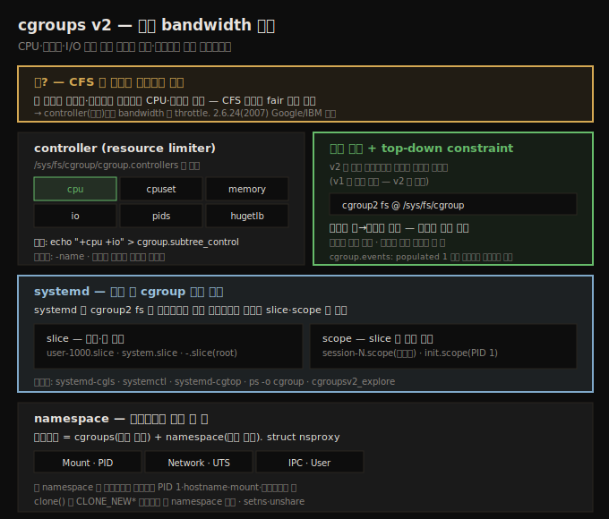

# CPU 스케줄러 (5) — cgroups v2
---
> **cgroups**(control groups)는 CPU·메모리·I/O 등 자원의 bandwidth 를 그룹 단위로 할당·제한하는 커널 기능입니다. CFS 가 진짜로 공정하지 않은 문제(한 유저가 스레드를 남발하면 자원 독점)를 풉니다. cgroups v2 는 모든 컨트롤러를 **단일 계층**에 마운트하며 `/sys/fs/cgroup` 의 `cgroup2` 의사 파일시스템으로 노출합니다. 컨트롤러(`cpu`·`memory`·`io`·`pids` 등)는 `cgroup.subtree_control` 에 `+name`/`-name` 을 써서 자식에 활성/비활성합니다(top-down constraint). systemd 가 부팅 시 **slice**(유저·앱 묶음)와 **scope**(터미널 세션 등)로 cgroup 을 자동 구성합니다. 컨테이너는 cgroups + namespace 의 결합입니다.

앞 노트(11-01)에서 affinity·정책을 봤습니다. 이 노트는 또 하나의 강력한 스케줄링 관련 주제 — **cgroups v2** — 를 다룹니다. CFS 가 "완전히 공정"하다 했지만, 한 유저가 스레드·메모리를 남발하면 그렇지 않다는 문제에서 출발합니다.

아래 종합도가 척추 — cgroups 가 푸는 문제, 컨트롤러, 단일 계층·top-down, systemd slice/scope, namespace — 입니다.




## 1. cgroups 란 — CFS 의 불완전한 공정성을 푼다

> CFS 가 "완전히 공정"하다 해도, 한 유저가 스레드·메모리를 남발하면 자원을 독점합니다. cgroups 는 controller(자원)별로 bandwidth 를 throttle 해 그룹 단위로 공정하게 분배합니다.

리눅스 서버에 10명이 로그인하면 프로세서 시간이 (대략) 공정하게 나뉩니다. 하지만 한 유저가 루프에서 CPU 집약 스레드를 마구 spawn 하면(거기에 메모리까지 크게 할당하면), CFS 의 CPU bandwidth 분배는 더는 공정하지 않습니다 — 그 계정이 CPU(와 메모리·I/O)를 독점합니다.

이를 해결하려고 한도에 도달하면 자원을 throttle 하는 정밀한 솔루션이 필요했고, Google·IBM 엔지니어가 **control groups(cgroups)** 를 2.6.24(2007)에 넣었습니다. cgroups 는 admin(또는 root)이 다양한 자원, 곧 **controller** 의 bandwidth 를 세밀하게 할당·관리하게 합니다. CPU 뿐 아니라 메모리·블록 I/O bandwidth 등을 분할·할당·모니터링할 수 있습니다.

앞 예의 10명을 모두 한 cgroup 에 넣고 CPU controller 를 켜면, CPU 경쟁 시 각 프로세스에 정말 공정한 몫이 갑니다. 또는 시스템을 여러 cgroup(빌드용·브라우저용·VM용 등)으로 나눠 CPU·메모리·I/O 를 세밀하게 할당할 수 있습니다 — 현대 배포판이 systemd 로 자동으로 하는 일입니다(임베디드·Android 포함).

cgroups 는 커널 기능이라 설정(`make menuconfig` → General setup | Control Group support)으로 켭니다. systemd 를 쓰는 최신 시스템은 기본 활성입니다. 2.6.24 이래 발전해, 4.5 에서 **cgroups v2**(Tejun Heo)가 production-ready 가 됐습니다(옛것은 v1·legacy). 둘이 함께 존재할 수 있으나 v2 가 권장이며, 이 노트는 v2 에 집중합니다.


## 2. controller — 자원 limiter

> controller 는 주어진 자원을 cgroup 계층에 분배하는 커널 컴포넌트입니다. cpu·cpuset·memory·io·pids·hugetlb 등이 있고, /sys/fs/cgroup/cgroup.controllers 로 가용 목록을 확인합니다.

cgroup controller 는 주어진 자원(CPU cycle·메모리·I/O bandwidth 등)을 cgroup 과 그 후손에 분배하는 커널 컴포넌트입니다 — 자원 limiter 입니다. cgroups v2 의 주요 controller 입니다.

| controller | 제어 대상 | since |
|------------|----------|-------|
| `cpu` | CPU bandwidth(cycles) | 4.15 |
| `cpuset` | CPU affinity·메모리 노드 배치(대형 NUMA 에 유용) | 5.0 |
| `memory` | 메모리(RAM) 사용 | 4.5 |
| `io` | I/O 자원 분배 | 4.5 |
| `pids` | cgroup 내 프로세스 수 hard limit(fork bomb 방지) | 4.5 |
| `hugetlb` | cgroup 당 huge pages 사용 제한 | 5.6 |

가용 controller 는 다음으로 확인합니다.

```
$ cat /sys/fs/cgroup/cgroup.controllers
cpuset cpu io memory hugetlb pids rdma misc
```

> 정확히 보이는 목록은 커널 설정에 따릅니다. `pids` controller 는 fork bomb(무한 루프 안의 `fork()` DoS)을 막는 데 유용합니다. cgroups 는 `/sys/fs/cgroup` 에 마운트되는 전용 pseudo 파일시스템(v2 는 타입이 `cgroup2`)으로 유저 공간에 노출됩니다.


## 3. 단일 계층과 controller 활성/비활성 — top-down constraint

> v2 는 모든 controller 를 단일 계층에 마운트합니다. controller 는 cgroup.subtree_control 에 +name/-name 을 써서 자식에 활성/비활성합니다. 자원은 위→아래로 분배되어, 부모가 가진 것만 자식에 줄 수 있습니다.

v2 에서는 모든 controller 가 **단일 계층(트리)** 에 마운트됩니다(v1 은 여러 계층이 가능했고, systemd 가 부팅 시 `cgroup2` fs 를 `/sys/fs/cgroup` 에 auto-mount).

```
$ mount | grep cgroup2
cgroup2 on /sys/fs/cgroup type cgroup2 (rw,nosuid,...)
```

`/sys/fs/cgroup` 아래에는 파일과 폴더가 있습니다.

1. **파일**(`cgroup.controllers`·`cpu.pressure` 등)은 cgroup2 **interface 파일**입니다. `cgroup.*` 는 core interface, `cpu.*`/`memory.*` 등은 controller interface 입니다.
2. **폴더**가 곧 cgroup 입니다(systemd 가 기본 생성).

`cgroup.controllers` 목록에 controller 가 있어도 **활성은 아닙니다**(기본은 모두 비활성). 활성하려면 `cgroup.subtree_control` 에 `+<name>` 을, 비활성하려면 `-<name>` 을 씁니다(즉시 자식에 효과).

```
echo "+cpu +io -memory" > cgroup.subtree_control    # cpu·io 활성, memory 비활성
```

> **top-down constraint**: 자원은 위→아래로 분배되며, **부모로부터 분배받은 자원만 자식에 더 분배**할 수 있습니다. 곧 비-root `cgroup.subtree_control` 는 부모의 그것에 활성된 controller 만 담을 수 있고, 자식이 켜고 있으면 부모는 끌 수 없습니다.

core interface 파일 몇 가지입니다.

| 파일 | 의미 |
|------|------|
| `cgroup.events` | read-only · `populated`(0/1, 살아있는 프로세스 존재 여부)·`frozen`(0/1) |
| `cgroup.procs` | cgroup 에 속한 프로세스 PID 목록(여기에 PID 를 쓰면 마이그레이션) |
| `cgroup.threads` | cgroup 에 속한 스레드 PID 목록 |
| `cgroup.kill` | write-only · 1 을 쓰면 cgroup 트리 전체에 SIGKILL |

`populated` 가 1 일 때만 그 cgroup 을 파고들 가치가 있습니다(빈 cgroup 은 skip). 모든 interface 의 상세는 공식 커널 문서가 SSOT 이며, 작업 시 반드시 참조합니다.


## 4. cgroup 계층 안 — 중첩과 마이그레이션

> cgroup 은 중첩됩니다(폴더 안 폴더). 프로세스를 cgroup 에 넣으려면 그 PID 를 cgroup.procs 에 씁니다(cut-paste 처럼 원래 cgroup 에서 제거). resource-constraining 은 subtree_control 에 controller 가 활성됐을 때만 작동합니다.

cgroup 은 중첩됩니다 — cgroup 이 cgroup 을 담고, 그것이 또 cgroup 을 담습니다(폴더 안 폴더). systemd 가 부팅 시 만드는 `init.scope` cgroup 을 보면 커널이 많은 pseudo 파일·interface 로 채웁니다.

```
$ cat /sys/fs/cgroup/init.scope/cgroup.procs
1
```

`cgroup.procs` 는 그 cgroup 에 속한 프로세스 PID 목록입니다 — `init.scope` 엔 PID 1(systemd 자신)만 있습니다. 프로세스를 다른 cgroup 으로 **마이그레이션**하려면 그 PID 를 대상 cgroup 의 `cgroup.procs` 에 씁니다(cut-paste 처럼 원래 cgroup 에서 암묵 제거, 적절한 권한 필요).

`system.slice` 같은 cgroup 아래에는 더 많은 cgroup(폴더)이 있습니다(중첩). 단 cgroup 의 자원 제약 기능은 그 cgroup 또는 부모의 `cgroup.subtree_control` 에 관련 controller 가 활성됐을 때만 작동합니다.

> 단일 값 pseudo 파일을 한눈에 볼 때는 `grep . <file-spec>/*` 가 편리합니다 — 파일명과 값을 함께 보여 줍니다(예: `grep . init.scope/cpu.*` 로 CPU controller interface 전체 확인).


## 5. systemd 와 cgroups — slice·scope 로 자동 구성

> 수동 cgroup 관리는 부담이라, systemd 가 부팅 시 cgroup 을 자동 구성합니다. slice 는 유저·앱 묶음, scope 는 slice 내 추가 분할(터미널 세션 등)입니다. 모든 새 프로세스가 적절한 slice·scope 에 배치됩니다.

수동 cgroup 관리는 daunting 한 작업이라, systemd 가 부팅 시 cgroup 생성·관리를 떠맡아 프로세스를 논리적으로 묶습니다. 두 artifact 를 씁니다.

1. **slice**: 특정 유저의 모든 프로세스, 또는 자원이 함께 관리되는 앱(프로세스) 묶음. 예: `user-1000.slice`(UID 1000 유저)·`system.slice`·root slice `-.slice`.
2. **scope**: slice 의 추가 논리 분할. 예: 터미널 창의 모든 프로세스를 묶는 `session-N.scope`·PID 1 의 `init.scope`.

slice 이름은 dash 로 path 를 나타냅니다 — `foo-bar.slice` 는 `foo.slice` 안에, 그것은 root `-.slice` 안에 있습니다. systemd 는 boot-time scope·service 유닛을 적절한 slice 에 배정하고, 로그인하는 모든 유저를 `user.slice` 아래 slice 로 봅니다.

시각화 도구입니다.

| 도구 | 용도 |
|------|------|
| `systemd-cgls` | cgroup 계층을 프로세스·커맨드라인과 함께 트리로 표시(인자로 특정 cgroup 지정 가능) |
| `systemctl` | slice·scope 유닛 타입을 조회 |
| `systemd-cgtop` | cgroup 별 자원 사용을 top 처럼 실시간 표시(단 *Accounting 이 켜져야 데이터 완전) |
| `ps -eo pid,user,cgroup,args` | 각 프로세스가 속한 cgroup 표시(커널 스레드는 cgroup 없음) |

새 프로세스(예: `vim`)를 실행하면 systemd 가 그것을 적절한 slice·scope(예: 내 `user-1000.slice`)에 자동 배치해 추적·관리하고, 그 slice 의 자원 제약이 적용됩니다. systemd 가 없는 시스템에서는 cgroup 관리가 사용자 몫이며, `cgcreate`/`cgexec`/`cgclassify`(libcgroup) 같은 도구를 씁니다.

> 기본 동작을 바꾸려면 ① service 유닛 파일 직접 편집, ② `systemctl set-property`, ③ drop-in 파일 세 방법이 있습니다. service 유닛은 `Slice=`·`Delegate=`·`TasksMax=` 같은 지시어로 cgroup 거동을 정합니다.


## 6. namespace — 컨테이너의 다른 한 축

> 컨테이너는 cgroups(자원 제한)와 namespace(자원 격리)의 결합입니다. namespace 로 커널이 자원을 분할해, 한 namespace 의 프로세스가 자기만의 PID 1·hostname·mount·네트워크를 봅니다.

컨테이너(Docker·LXC·Kubernetes)는 두 커널 기술 — **cgroups**(자원 제한)와 **namespace**(자원 격리) — 의 결합입니다. namespace(`struct nsproxy`)로 커널이 자원을 분할해, 한 namespace 의 프로세스 집합은 어떤 값을, 다른 namespace 는 다른 값을 봅니다.

예로 두 컨테이너가 깨끗이 격리되려면 각자 PID 1·2…를 봐야 하고, 각자의 hostname·mount(`/proc` 등)·네트워크 인터페이스를 가져야 합니다. 커널은 namespace 마다 global namespace 를 유지합니다.

| namespace | 제공 |
|-----------|------|
| Mount | 자기만의 파일시스템 레이아웃(다른 ns 의 `/proc` 내용이 다름) |
| PID | 프로세스 격리(각 ns 가 PID 1 을 가짐) |
| Network | 네트워크 격리 |
| UTS | 도메인명·hostname 격리 |
| IPC | 공유 메모리·메시지 큐·세마포어 격리 |
| User | UID 격리(다른 ns 가 같은 UID/GID 가능) |

`clone()` 시스템콜(`pthread_create` 가 내부 사용)의 `CLONE_NEW*` 플래그(`CLONE_NEWPID`·`CLONE_NEWNS`·`CLONE_NEWNET` 등)로 새 namespace 에 프로세스를 만듭니다. `setns()`·`unshare()`·`ioctl_ns()` 도 관련 시스템콜입니다.


## 자주 받는 오해

1. "CFS 가 완전히 공정하니 cgroups 는 불필요하다"고 생각하지만, 한 유저가 스레드·메모리를 남발하면 CFS 만으로는 공정하지 않습니다. cgroups 가 controller 별로 bandwidth 를 throttle 해 그룹 단위 공정성을 보장합니다.
2. "`cgroup.controllers` 에 보이는 controller 는 활성 상태"라고 생각하지만, 가용 목록일 뿐 기본은 모두 비활성입니다. `cgroup.subtree_control` 에 `+name` 을 써야 자식에 활성됩니다.
3. "자식 cgroup 에 아무 controller 나 활성할 수 있다"고 생각하지만, top-down constraint 때문에 부모가 활성한 controller 만 자식에 활성할 수 있습니다.
4. "컨테이너는 가벼운 VM 일 뿐"이라고 생각하지만, 본질은 cgroups(자원 제한) + namespace(자원 격리) 두 커널 기술의 결합입니다.


## 면접에서 받을 만한 질문

1. **cgroups 는 어떤 문제를 푸나요?** → CFS 가 스레드 단위로 공정해도, 한 유저가 CPU 집약 스레드를 남발하면 CPU·메모리·I/O 를 독점합니다. cgroups 는 controller(자원)별로 bandwidth 를 할당·throttle 해, 그룹 단위로 자원을 공정하게 분배합니다. 2.6.24 에 도입됐고 4.5 에서 v2 가 production-ready 가 됐습니다.
2. **cgroups v2 의 controller 는 어떻게 활성하나요?** → `cgroup.controllers` 가 가용 목록이지만 기본은 모두 비활성입니다. `cgroup.subtree_control` 에 `+<name>`(활성)·`-<name>`(비활성)을 쓰면 즉시 자식에 효과가 갑니다. top-down constraint 로 부모가 활성한 controller 만 자식에 활성할 수 있습니다.
3. **systemd 의 slice 와 scope 는?** → slice 는 유저나 앱 묶음의 자원을 관리하는 단위(`user-1000.slice`·`system.slice`·root `-.slice`)이고, scope 는 slice 내 추가 분할(터미널 세션의 `session-N.scope`·PID 1 의 `init.scope`)입니다. systemd 가 부팅 시 모든 프로세스를 적절한 slice·scope 에 자동 배치합니다.
4. **프로세스를 다른 cgroup 으로 어떻게 옮기나요?** → 대상 cgroup 의 `cgroup.procs` 에 그 프로세스의 PID 를 씁니다. cut-paste 처럼 원래 cgroup 에서 암묵적으로 제거되며, 적절한 권한(root 또는 권한 매칭)이 필요합니다.
5. **컨테이너는 어떤 커널 기술로 구현되나요?** → cgroups(자원 제한)와 namespace(자원 격리)의 결합입니다. namespace(Mount·PID·Network·UTS·IPC·User)로 각 컨테이너가 자기만의 PID 1·hostname·mount·네트워크를 보고, cgroups 로 CPU·메모리 등 자원 사용을 제한합니다. `clone()` 의 `CLONE_NEW*` 플래그로 새 namespace 를 만듭니다.


## 관련 문서

- [상위 MOC](../README.md) — 커널 개발자 관점 리눅스 내부 인덱스
- [11-01. CPU 스케줄러 (4) — CPU affinity와 정책·우선순위 설정](./11-01.CPU 스케줄러 (4) — CPU affinity와 정책·우선순위 설정.md) — per-thread affinity·정책 설정
- [11-03. CPU 스케줄러 (6) — cgroups CPU 제약과 RTOS](./11-03.CPU 스케줄러 (6) — cgroups CPU 제약과 RTOS.md) — cgroups CPU 제약 실습·RTL 전환
