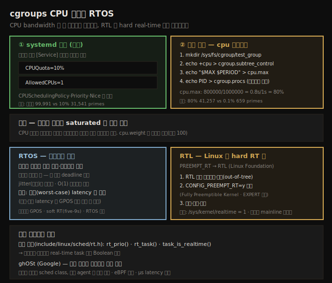
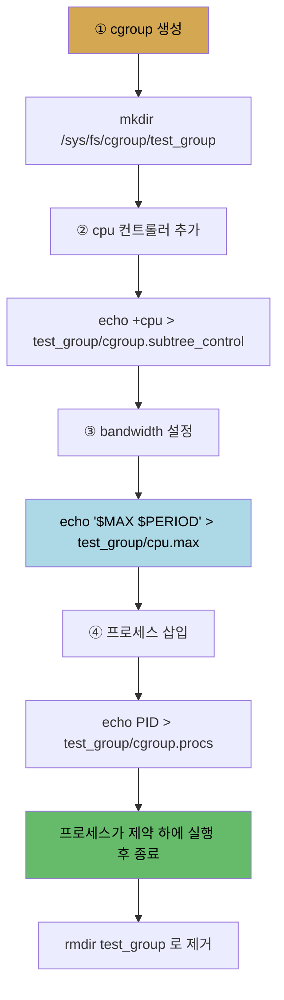

# CPU 스케줄러 (6) — cgroups CPU 제약과 RTOS
---
> cgroups v2 로 CPU bandwidth 를 두 방식으로 제약합니다. **systemd 방식**은 서비스 유닛에 `CPUQuota`·`AllowedCPUs` 를 지정해 부팅 시 자동 적용합니다. **수동 방식**은 `/sys/fs/cgroup` 에 디렉토리를 만들어 cgroup 을 생성하고, `+cpu` 를 `subtree_control` 에 써 컨트롤러를 추가하고, `cpu.max` 에 `$MAX $PERIOD` 를 써 bandwidth 를 설정하고(예: `800000/1000000` = 80%), `cgroup.procs` 에 PID 를 써 프로세스를 삽입합니다. 제약은 CPU 가 **saturated** 일 때만 의미가 있습니다. **RTOS** 는 결정성(낮은 jitter·예측 가능)이 핵심이며, 리눅스는 GPOS 지만 **RTL**(PREEMPT_RT) 패치로 hard real-time 으로 전환합니다.

앞 노트(11-02)에서 cgroups v2 의 구조를 봤습니다. 이 노트는 그것을 *실제로 적용해* CPU bandwidth 를 제약하는 두 방식과, 리눅스를 hard real-time OS(RTOS)로 전환하는 RTL, 그리고 기타 스케줄러 관련 주제(ghOSt 등)를 다룹니다.

아래 종합도가 척추 — systemd 방식, 수동 cpu.max 방식, saturated 일 때만 의미, RTOS 결정성, RTL 전환 — 입니다.




## 1. systemd 방식 — CPUQuota·AllowedCPUs

> systemd 는 cgroups 위의 추상화처럼 작동해, 서비스 유닛에 CPUQuota·AllowedCPUs 를 지정해 자원 제약을 쉽게 겁니다. 부팅 시 자동 적용되며 정책·우선순위·nice·affinity 도 지시어로 설정합니다.

systemd 는 cgroups 위의 추상화 계층처럼 작동해, admin 이 cgroup 에 자원 제약을 쉽게 걸게 합니다. service 유닛 파일(`<foo>.service`)은 `[Unit]`·`[Service]`·`[Install]` 섹션으로 나뉘고, `[Service]` 의 `ExecStart=` 로 실행할 앱을 지정합니다.

`[Service]` 섹션의 CPU 관련 지시어입니다.

| 지시어 | 의미 |
|--------|------|
| `CPUQuota=10%` | 최대 할당 CPU 시간(프로세서 cycle) 비율 |
| `AllowedCPUs=1` | 실행 가능한 최대 코어 수 |
| `CPUSchedulingPolicy=fifo` | CPU 스케줄링 정책 |
| `CPUSchedulingPriority=83` | (RT) 우선순위 |
| `Nice=-20` | nice 값(NORMAL 정책에만) |

상세는 `systemd.resource-control(5)`·`systemd.exec(5)` man 페이지가 SSOT 입니다.

**검증 실험** — 2~max 의 소수를 3초간 생성하는 프로그램으로 효과를 봅니다.

1. **무제약 + SCHED_FIFO·prio 83**: `svc1_primes_normal.service` 로 실행하면 약 **99,991** 까지 소수 생성.
2. **CPUQuota 10% + 1코어 + SCHED_OTHER·prio 0**: `svc2_primes_lowcpu.service` 로 실행하면 **31,541** 까지만 — 첫 경우가 약 70% 더 생성. cgroups 제약의 효과를 입증합니다.

> `systemctl status <unit>` 로 상태·출력을, `systemctl show <unit>` 로 모든 설정을 봅니다. 메모리 제약은 `MemoryHigh`·`MemoryMax` 로 거는데, 한도를 breach 하면 OOM killer(또는 systemd-oomd)가 cgroup task 를 죽입니다(09-03 §6).


## 2. 수동 방식 — cpu.max 로 직접 제약

> 수동으로 cgroup 을 만들어 CPU 를 제약합니다. 디렉토리 생성으로 cgroup 을 만들고, +cpu 를 subtree_control 에 써 컨트롤러를 추가하고, cpu.max 에 $MAX $PERIOD 를 써 bandwidth 를 설정하고, cgroup.procs 에 PID 를 써 프로세스를 삽입합니다.

수동으로 cgroups v2 계층에 새 cgroup 을 만들고 CPU controller 로 bandwidth 상한을 설정합니다(모두 root 필요). `mount | grep cgroup` 출력에 `type cgroup2` 가 있으면 v2 입니다.



핵심은 3단계 `cpu.max` 입니다. read-write 두 값 파일로 `$MAX $PERIOD`(마이크로초) 형식입니다 — cgroup 의 모든 프로세스가 `$PERIOD` 마다 최대 `$MAX` 만큼 실행됩니다. 기본은 `max 100000`(100% 사용).

```
$MAX = 800000, $PERIOD = 1000000  →  1초 중 0.8초 = 80% CPU 사용
```

4단계는 프로세스 PID 를 `cgroup.procs` 에 쓰는 것입니다(controller 없이는 제약이 적용되지 않음 — 11-02 §3).

**검증 실험** — 소수 생성기를 5초간 실행하며 bandwidth 만 바꿉니다.

1. **80% bandwidth**(`cpu.max 800000 1000000`): 소수를 **41,257** 까지 생성.
2. **0.1% bandwidth**(`cpu.max 1000 1000000`): 소수를 단 **659** 까지만! cgroups v2 CPU controller 의 효과를 명확히 입증합니다.

> `cpu.weight`(기본 100)로 cgroup 내 프로세스의 CPU 분배 가중치를 조정할 수 있습니다. 같은 값이면 모두 동등하게 받고, 값을 달리할 때만 의미가 생깁니다. systemd 없는 시스템은 `cgcreate`/`cgexec` 등으로 수동 관리합니다.


## 3. 핵심 — 제약은 자원이 saturated 일 때만 의미

> CPU controller 의 제약은 CPU 코어가 포화될 때만 적용됩니다. 포화되지 않으면 프로세스는 원하는 만큼 자유롭게 CPU 를 씁니다.

CPU resource controller(와 일반적으로 다른 controller)의 핵심 포인트입니다 — 지정한 제약은 해당 자원(CPU 코어)이 **saturated(포화)** 일 때만 의미가 있고 적용됩니다. 그렇지 않으면 프로세스는 원하는 만큼 자유롭게 CPU 를 씁니다. 합리적입니다 — 경쟁이 없는데 굳이 제한할 이유가 없습니다.

그래서 10장 Figure 10.1 맨 위에 "cgroups v2" 계층이 있던 것입니다. cgroups 는 리눅스 커널의 fabric 에 깊이 박혀, CPU 를 비롯한 여러 자원의 할당(bandwidth/utilization)을 프로그래밍할 수 있고, 따라서 CPU 스케줄링에 큰 영향을 줍니다.


## 4. RTOS — 결정성이 핵심

> RTOS 는 빠름이 아니라 결정성(예측 가능·일관성·낮은 jitter)이 핵심입니다. 응답이 느려도 항상 deadline 을 보장해야 합니다. 목표는 최악(worst-case) latency 를 낮추는 것입니다.

mainline 리눅스는 RTOS 가 아니라 **GPOS**(범용 OS, Windows·macOS·Unix 처럼)입니다. RTOS 에서는 hard real-time 특성이 작용해 — 올바른 결과뿐 아니라 deadline 이 있고, 매번 그것을 지킨다고 보장해야 합니다.

핵심은 **결정성(determinism)** 입니다. 오해와 달리, 응답이 항상 빠를 필요는 없습니다(수 μs 가 아니라 수십 ms 일 수도). 중요한 건 시스템이 **신뢰성 있고 예측 가능**하며, 같은 방식으로 일관되게 동작해 항상 deadline 을 지키는 것입니다. 요구 시간으로부터의 변동을 **jitter** 라 하며, RTOS 는 jitter 를 최소화합니다(GPOS 는 jitter 가 크게 출렁입니다). 그래서 알고리즘을 가능한 한 O(1) 시간 복잡도로 설계합니다.

또 다른 목표는 latency·delay 감소입니다 — 정확히는 **최악(worst-case) latency** 를 허용 수준으로 낮추는 것입니다(아이러니하게 최소·평균 latency 는 GPOS 보다 나쁠 수 있습니다).

mainline 리눅스는 RTOS 가 아니지만 성능이 뛰어나, **soft real-time OS**(deadline 을 best effort 로 대부분 — "five-9s", 99.999% — 지킴)로 충분히 자격이 있습니다. 하지만 군사·운송·로보틱스·통신·공장 자동화·증권 거래소·의료 전자 같은 **hard real-time** 도메인은 RTOS 가 필요해, plain vanilla 리눅스로는 부족합니다.


## 5. RTL — 리눅스를 hard real-time 으로 전환

> 리눅스는 GPOS 지만, Thomas Gleixner 등이 만든 RTL(PREEMPT_RT) out-of-tree 패치를 적용하고 CONFIG_PREEMPT_RT=y 로 빌드하면 hard real-time OS(RTOS)로 돕니다. 확인은 /sys/kernel/realtime = 1 입니다.

Thomas Gleixner 등이 오랫동안 vanilla 리눅스를 hard RTOS 로 만드는 작업을 해 왔습니다. 2.6.18(2006) 이래 리눅스를 RTOS 로 전환하는 out-of-tree 패치가 있습니다. 옛 이름은 PREEMPT_RT 였고, 2015(4.1+)부터 Linux Foundation 이 인수해 **RTL(Real-Time Linux) Collaborative Project** 로 개명했습니다(co-kernel 방식인 Xenomai·RTAI 와 혼동 금지).

"왜 mainline 에 안 들어갔나?" — 사실 RTL 작업의 상당 부분(스케줄링·mutex/spinlock·lockdep·threaded IRQ·PI·tracing)은 이미 mainline 에 병합됐습니다. mainline 병합이 RTL 의 주 목표이며 (집필 시점) 거의 다 왔습니다. Linus 가 리눅스를 GPOS 로 설계했기에 RTOS 전용 invasive 기능은 신중히 병합합니다.

**전환 절차**(x86_64, 6.x 기준)입니다.

1. 주어진 stable 커널의 RTL 패치 세트를 다운로드(`mirrors.edge.kernel.org/pub/linux/kernel/projects/rt/`).
2. 패치를 추출·적용해 커널 소스 트리에 patch.
3. `make menuconfig` → General Setup | Preemption Model 에서 네 번째 선택지 **Fully Preemptible Kernel (Real-Time)** 선택(`CONFIG_PREEMPT_RT=y`). 안 보이면 `CONFIG_EXPERT`(General Setup | Configure standard kernel features)를 먼저 켭니다.
4. 평소처럼 빌드·설치(`sudo make modules_install && sudo make install`)·부팅.

확인입니다.

```
$ uname -a
Linux fedora 6.1.46-rt14-rc1 #1 SMP PREEMPT_RT [...] x86_64 GNU/Linux
$ cat /sys/kernel/realtime
1
```

`/sys/kernel/realtime` 가 1 이면 real-time 커널(RTL)입니다. `PREEMPT_RT` 가 켜지면 dynamic preemption 모델은 꺼집니다(10-03 §2).

> 단 OS 를 RTL 로 돌리는 것만으로는 부족합니다 — 애플리케이션도 시간 임계 영역을 real-time 가이드라인에 맞게 신중히 설계·작성해야 합니다.


## 6. 기타 — 커널 헬퍼와 ghOSt

> 커널 헬퍼 rt_prio·rt_task·task_is_realtime 으로 real-time task 인지 판별합니다. Google 의 ghOSt 는 스케줄링 정책을 유저 공간에 위임하는 시스템입니다.

real-time task 판별에 유용한 커널 헬퍼입니다(`include/linux/sched/rt.h`).

| 헬퍼 | 동작 |
|------|------|
| `rt_prio()` | 우선순위를 인자로 받아 real-time task 인지 Boolean 반환 |
| `rt_task()` | task 구조 포인터의 우선순위로 판별(`rt_prio()` 래퍼) |
| `task_is_realtime()` | task 의 스케줄링 정책으로 판별 |

**ghOSt(Google)** — NUMA chiplet·GPU/TPU/DPU 가속기·클라우드 워크로드(μs 스케줄링 latency)가 기존 스케줄러를 압박하는 상황에서, Google 이 제안한 시스템입니다. 스케줄링 정책을 유저 공간에 빠르고 유연하게 위임합니다. 커널 코드(대체로 안정적인 custom sched class)와 유저 공간 코드(정책 결정하는 agent 프로세스)로 구성되며, eBPF 로 코드 경로를 가속합니다. μs latency·throughput·에너지 효율 등 다양한 목표를 노립니다(집필 시점 실험 단계).


## 자주 받는 오해

1. "cgroups CPU 제약은 항상 적용된다"고 생각하지만, CPU 코어가 saturated(포화)일 때만 의미가 있습니다. 경쟁이 없으면 프로세스는 제약과 무관하게 원하는 만큼 CPU 를 씁니다.
2. "RTOS 는 응답이 항상 빨라야 한다"고 생각하지만, 핵심은 빠름이 아니라 결정성입니다. 응답이 수십 ms 라도 항상 deadline 을 지키고 jitter 가 작으면 RTOS 자격이 있습니다.
3. "vanilla 리눅스도 RTOS 다"라고 생각하지만, GPOS 입니다. soft real-time(five-9s)으로 충분히 뛰어나지만 hard real-time 보장은 RTL(`CONFIG_PREEMPT_RT`) 패치를 적용해야 합니다.
4. "RTL 커널만 쓰면 real-time 시스템이 완성된다"고 생각하지만, 애플리케이션도 시간 임계 영역을 real-time 가이드라인에 맞게 설계·작성해야 합니다.


## 면접에서 받을 만한 질문

1. **cgroups v2 로 CPU 를 제약하는 두 방식은?** → ① systemd 방식 — service 유닛에 `CPUQuota=10%`·`AllowedCPUs=1` 을 지정해 부팅 시 자동 적용. ② 수동 방식 — `/sys/fs/cgroup` 에 디렉토리로 cgroup 을 만들고, `+cpu` 를 `subtree_control` 에 쓰고, `cpu.max` 에 `$MAX $PERIOD`(예: `800000 1000000` = 80%)를 쓰고, `cgroup.procs` 에 PID 를 씁니다.
2. **cpu.max 의 형식과 의미는?** → `$MAX $PERIOD`(마이크로초)입니다. cgroup 의 모든 프로세스가 `$PERIOD` 마다 최대 `$MAX` 만큼 실행됩니다. `800000 1000000` 이면 1초 중 0.8초 = 80% CPU 사용입니다. 기본 `max 100000` 은 100% 입니다.
3. **cgroups 제약은 언제 적용되나요?** → 자원(CPU 코어)이 saturated(포화)일 때만입니다. 경쟁이 없으면 프로세스는 제약과 무관하게 자유롭게 자원을 씁니다. 굳이 제한할 이유가 없기 때문입니다.
4. **RTOS 의 핵심 특성은?** → 결정성(determinism)입니다. 응답이 빠른 것보다, 예측 가능하고 일관되게 동작해 항상 deadline 을 지키며 jitter 를 최소화하는 것이 핵심입니다. 목표는 최악(worst-case) latency 를 낮추는 것이고(최소·평균은 GPOS 보다 나쁠 수 있음), 알고리즘은 O(1) 을 지향합니다.
5. **리눅스를 hard real-time 으로 어떻게 만드나요?** → RTL(PREEMPT_RT) out-of-tree 패치를 다운로드·적용하고, `CONFIG_PREEMPT_RT=y`(Fully Preemptible Kernel)로 설정해 빌드·부팅합니다. `/sys/kernel/realtime` 가 1 이면 real-time 커널입니다. 단 OS 전환만으로는 부족하고 애플리케이션도 real-time 가이드라인에 맞게 설계해야 합니다.


## 관련 문서

- [상위 MOC](../README.md) — 커널 개발자 관점 리눅스 내부 인덱스
- [11-02. CPU 스케줄러 (5) — cgroups v2](./11-02.CPU 스케줄러 (5) — cgroups v2.md) — 컨트롤러·계층·systemd slice/scope 의 기반
- [09-03. 메모리 할당 (5) — demand paging과 OOM killer](./09-03.메모리 할당 (5) — demand paging과 OOM killer.md) — cgroups 메모리 제약과 OOM 의 연결
