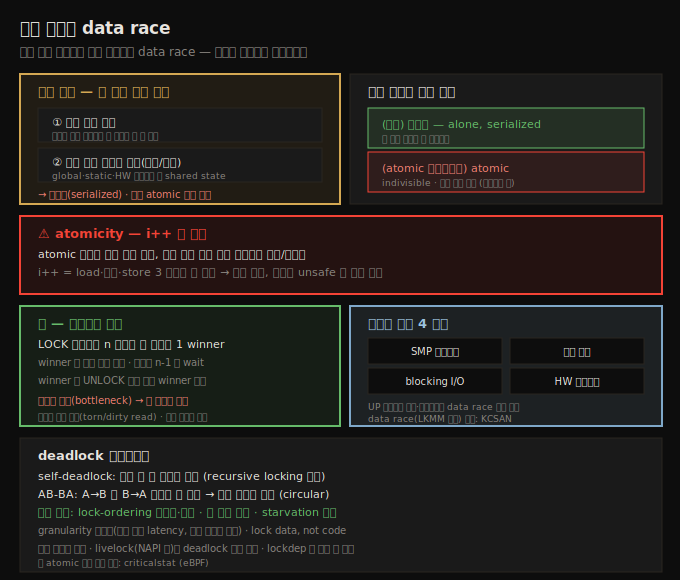

# 커널 동기화 (1) — 임계 구역과 data race
---
> **임계 구역(critical section)**은 두 조건을 모두 만족하는 코드 경로입니다 — ① 병렬 실행 가능, ② 공유 쓰기 데이터에 접근(읽기/쓰기). 따라서 **배타적으로**(한 번에 한 스레드만, serialized), 때로 **atomic**(중단 없이 완료)하게 실행되어야 합니다. 보호하지 않으면 **data race**(결과가 timing 에 따라 달라지는 버그)가 발생합니다. atomicity 는 단일 머신 명령이나 워드 크기 정렬 데이터의 읽기/쓰기만 보장되어, `i++` 조차 위험합니다. **락**은 한 스레드만 winner 로 진입시키고 나머지는 unlock 을 기다리게 해 직렬화합니다. 동시성 우려 원인은 SMP·선점 커널·blocking I/O·하드웨어 인터럽트 넷이며, deadlock 은 lock-ordering 등 가이드라인으로 막습니다.

CPU 스케줄링을 봤으니, 이제 — 때로 복잡할 수밖에 없는 — 커널 동기화로 들어갑니다. 둘 이상의 스레드(일반적으로 코드 경로)가 공유 쓰기 데이터에 함께 작업할 때마다 동기화(상호 배제)가 필요합니다. 없으면 race 가 일어나 결과를 예측할 수 없습니다(data race). 순수 코드(r-x)는 문제없지만, 공유 쓰기 데이터를 다루는 순간 각별히 조심해야 합니다.

이 노트는 임계 구역·배타성·atomicity·data race 의 개념, 동시성 우려가 생기는 네 원인, 그리고 락의 기본 개념과 deadlock 가이드라인을 다룹니다. 아래 종합도가 척추 — 임계 구역 두 조건, atomicity, 락 동작, 동시성 원인, deadlock — 입니다.

## 1. 임계 구역 — 두 조건과 실행 요구

> 임계 구역은 두 조건을 모두 만족하는 코드입니다 — 병렬 실행 가능하고, 공유 쓰기 데이터에 접근합니다. 따라서 항상 배타적으로, atomic 컨텍스트면 atomic 하게 실행되어야 합니다.

**임계 구역**은 다음 두 조건을 *모두* 만족하는 코드 경로입니다.

1. **병렬 실행 가능** — 동시에 여러 스레드가 이 코드를 돌 수 있습니다.
2. **공유 쓰기 데이터(shared state)에 접근** — 읽기 그리고/또는 쓰기를 합니다.

따라서 임계 구역은 정의상 병렬성으로부터 보호가 필요합니다. 곧 배타적으로, 때로 atomic 하게 실행되어야 합니다.

- **배타적(exclusively)**: 어느 순간 정확히 한 스레드만 임계 구역 코드를 실행합니다(serialized). 데이터 안전을 위해서입니다.
- **atomic**: indivisible — 중단 없이 완료까지 실행됩니다.

둘 이상의 스레드가 임계 구역을 동시 실행하면 버그이며, race condition(data race)이라 합니다. 임계 구역을 *식별*하고 *보호*하는 것은 올바른 소프트웨어의 암묵적 요구입니다. 보호는 (상대적으로) 쉽지만, 모든 임계 구역을 정확히 식별하는 것이 마스터해야 할 기술입니다.

판별 예입니다.

| 코드 | 병렬 가능? | 공유 쓰기? | 임계 구역? |
|------|-----------|-----------|-----------|
| 지역 변수 `nok += 10*PI` | O | X (스택의 사본) | **아니오** |
| 드라이버 write 의 `mydrv->sensor2 = 1` | O | O (global) | **예** |
| 모듈 init 의 `glob += 14` | X (단 한 번 실행) | O | **아니오** |

> 안전한 예외(암묵적 보호): ① 지역 변수(스택에 있어 스레드마다 별개), ② 다른 컨텍스트에서 절대 병렬 실행될 수 없는 코드(모듈 init/cleanup 은 insmod/rmmod 시 정확히 한 번만 직렬 실행), ③ 진짜 상수·읽기 전용 데이터.

## 2. atomicity — i++ 도 위험하다

> atomic 보장은 단일 머신 명령이나 워드 크기 정렬 데이터의 읽기/쓰기뿐입니다. i++ 조차 load·증가·store 여러 명령일 수 있어 가정하면 안 됩니다.

atomic operation 은 indivisible 한 연산입니다. 모던 프로세서에서 일반적으로 atomic 으로 보장되는 것은 둘뿐입니다.

1. 단일 머신 언어 명령의 실행.
2. 프로세서 워드 크기(보통 32·64비트) 안의 정렬된 primitive 데이터에 대한 읽기/쓰기. 64비트 시스템에서 32·64비트 정수 읽기/쓰기는 atomic 이 보장되어, torn/dirty 결과를 보지 않습니다. 단 32비트 프로세서가 64비트 항목을 다루면 atomic 이 아니라 torn read/write 가 될 수 있습니다.

> 주의: 모던 고도 최적화 컴파일러·하드웨어에서는 이 "진리"마저 항상 성립하지 않을 수 있습니다 — load/store tearing 등을 쓸 수 있기 때문입니다(LWN "Who's afraid of a big bad optimizing compiler?").

**고전 사례 — global i++** — 가능한 동시 코드 경로에서 global 정수 `i` 를 증가시키는 것입니다. 안전할까요? 짧은 답은 "아니오, 보호해야 합니다"입니다. 임계 구역이기 때문입니다(가능한 동시 경로에서 공유 쓰기 데이터 접근). 안전 여부는 둘에 달렸습니다.

1. `foo()` 코드 경로가 배타적 실행을 보장받는가.
2. 증가 연산이 진짜 atomic(indivisible)인가.

이것은 프로세서 ISA 와 컴파일러가 결정합니다. ISA 가 단일 명령 정수 증가를 갖고 컴파일러가 그것을 쓰면 atomic 입니다. x86 같은 CISC 는 최적화 레벨 2 이상에서 atomic 이 되곤 하지만, ARM 같은 RISC 는 늘 그렇지 않습니다. 최적화 없으면 `i++` 가 load·증가·store 3 명령이 되어 atomic 이 아닙니다(중간에 컨텍스트 스위치 가능).

결론은 — **가정할 수 없으니, 기본은 `i++` 를 unsafe(non-atomic)로 보고 보호**합니다. (단 정수 연산엔 mutex·spinlock 보다 효율적인 `atomic_t`/`refcount_t` 가 있습니다 — 13장 주제.)

## 3. 락 — 직렬화로 임계 구역을 보호

> 락은 병렬성을 없애 임계 구역을 직렬화합니다. LOCK 을 시도하는 n 스레드 중 정확히 한 winner 가 임계 구역을 실행하고, 나머지는 unlock 을 기다립니다. 병렬성을 잃어 bottleneck 이 되므로 락을 최소화합니다.

동시성을 무력화하려면 임계 구역의 병렬성을 없애 코드 흐름을 직렬화해야 합니다. 흔한 기법이 **락**입니다.

락의 기본 전제 — 락 경합 시(n 스레드가 LOCK 시도) 정확히 한 스레드만 성공합니다. 이 스레드가 **winner**(owner)로, 락 API 를 non-blocking 으로 보고 임계 구역을 배타적으로 실행합니다. 나머지 n-1 **loser** 는 UNLOCK 을 기다립니다(이 UNLOCK 은 winner 가 임계 구역을 끝낼 때 수행). unlock 되면 남은 loser 들이 다음 winner 를 두고 경쟁하고, 이것이 n 스레드가 모두 순차 획득할 때까지 반복됩니다.

락은 병렬성을 없애 직렬화하므로 (꽤 가파른) 오버헤드를 만듭니다 — funnel(깔때기)의 좁은 목처럼 한 번에 한 스레드만 통과합니다. 따라서 아키텍트로서 **락을 최소화**하도록 설계해야 합니다.

> 핵심: ① **읽기도 보호**해야 합니다 — 워드 크기 안 정렬 데이터가 아니면, 읽기만으로도 torn/dirty read(stale·불일치 데이터)가 날 수 있습니다. ② **같은 데이터는 항상 같은 락**으로 보호합니다 — lockA 로 X 를 보호한다면 어디서든 X 접근 시 lockA 를 써야 하며, 다른 곳에서 lockB 를 쓰면 보호가 안 됩니다.

유저 공간에서는 진짜 atomic 한 코드를 쓸 수 없지만(SCHED_FIFO·prio 99 로 근접만 가능), 커널 공간에서는 **spinlock** 으로 진짜 atomic 한 코드를 쓸 수 있습니다.

## 4. data race 의 형식적 정의 — LKMM 과 KCSAN

> LKMM(Linux-Kernel Memory Model)은 data race 를 형식적으로 정의합니다 — 같은 위치 접근, 적어도 하나는 store, 적어도 하나는 plain access, 다른 CPU, 동시 실행. KCSAN 이 이 정의로 data race 를 검출합니다.

메모리 일관성의 형식 모델이 **LKMM(Linux-Kernel Memory Model)**입니다. 두 종류의 접근을 봅니다.

1. **plain access**: C 문장으로 하는 일반 접근(`i++`·`y = 42-x`).
2. **marked access**: atomicity 를 암묵 보장하는 특수 접근 — `READ_ONCE()`(읽기)·`WRITE_ONCE()`(쓰기)·`atomic_*()`·`refcount_*()`·`smp_load_acquire()` 등.

LKMM 의 data race 정의입니다. 두 메모리 접근이 다음을 모두 만족하면 data race 입니다.

1. 같은 위치(location)에 접근하고,
2. 적어도 하나가 store 이고,
3. 적어도 하나가 plain access 이고,
4. 다른 CPU(또는 같은 CPU 의 다른 스레드)에서 일어나고,
5. 동시에(concurrently) 실행됩니다.

(1·2 만 만족하면 "conflict", 1~4 면 "race candidate" — 실제 race 는 5 의 동시성에 달림.)

이 정의로 data race 를 검출하는 도구가 **KCSAN(Kernel Concurrency Sanitizer)**입니다.

> 주의: "그럼 항상 marked access 를 써서 data race 를 없애면?" — 그러지 마세요. marked access 는 커널 내부용이거나 race 를 알지만 신경 안 쓸 때(예: 네트워크 통계 카운터)만 씁니다. marked access 를 쓰면 KCSAN 이 data race 를 못 잡습니다. 대부분은 plain C 접근을 유지하세요. 또 marked access 는 atomic load/store 는 보장하나 memory ordering 은 보장하지 않습니다(memory barrier 필요 — 13장).

## 5. 동시성 우려의 네 원인

> 커널 코드에서 동시성·임계 구역이 생기는 원인은 넷입니다 — SMP 멀티코어, 선점 커널, blocking I/O, 하드웨어 인터럽트. UP 시스템도 선점·인터럽트로 data race 가 날 수 있습니다.

임계 구역을 보려면 어디서 동시성 우려가 생기는지 알아야 합니다. 네 원인입니다.

| 원인 | 시나리오 |
|------|----------|
| **SMP 멀티코어**(`CONFIG_SMP=y`) | P1(코어 0)·P2(코어 2)가 동시에 드라이버 read 를 돌며 같은 공유 데이터 작업 → data race |
| **선점 커널**(`CONFIG_PREEMPTION=y`) | P1 이 임계 구역 안일 때 커널이 P1 을 선점해 P2 로 전환 → 단일 코어(UP)에서도 위험 |
| **blocking I/O** | P1 이 임계 구역 안에서 blocking call 을 만나 sleep(`schedule()`) → P2 가 같은 경로 실행, 데이터가 중간 상태이거나 P1 복귀 시 바뀌어 있음 |
| **하드웨어 인터럽트** | P1 이 임계 구역 안일 때 인터럽트 발생 → 인터럽트 핸들러가 같은 공유 데이터를 다루면 data race |

UP(단일 코어) 시스템도 안전하지 않습니다 — 선점·인터럽트·트랩·예외·신호로 data race 가 날 수 있습니다. 대부분 제품이 멀티코어로 가고 있으니 동시성 제어는 필수입니다.

> 인터럽트 원인의 핵심 질문: 인터럽트 핸들러(top half·bottom half)가 자신이 방금 인터럽트한 프로세스 컨텍스트와 **같은 공유 쓰기 데이터**를 다루는가? 그렇다면 data race 입니다(보통 spinlock 으로 보호). 아니라면 임계 구역이 아닙니다.

## 6. deadlock 과 락 가이드라인

> deadlock 은 전진이 불가능한 상태입니다. self-deadlock(쥔 락 재획득)·AB-BA(순환 대기)가 대표 유형입니다. 핵심 규칙은 lock-ordering 문서화·준수, 쥔 락만 해제, starvation 방지입니다.

**deadlock** 은 전진(progress)이 불가능한 상태로, 프로세스·커널이 무한 hang 합니다. 대표 유형입니다.

1. **self-deadlock**(단일 락, process): 이미 쥔 락을 재획득 시도 → 락이 잠겨 있어 unlock 을 기다리지만, unlock 할 주체가 자신이라 영원히 대기. (recursive locking 으로 풀 수 있으나 보통 비활성·금지.)
2. **AB-BA**(다중 락, process): CPU 0 의 thread A 가 lock A 획득 후 lock B 시도, CPU 1 의 thread B 가 lock B 획득 후 lock A 시도 → 서로 영원히 대기(circular). AB-BC-CA 로 확장 가능.
3. **단일 락, process+인터럽트**(spinlock 용): P1 이 lock A 를 쥔 채 같은 코어에서 인터럽트 발생, 인터럽트가 lock A 를 spin → P1 이 CPU 를 못 돌려받아 unlock 못 함 → self-deadlock. 해결: 락 획득 시 local core 인터럽트 마스킹(spinlock `_irq` 변형).

락 가이드라인입니다.

1. **granularity** 적절히 — 임계 구역이 너무 길면 latency, 락이 너무 적으면 경합, 너무 많으면 복잡도. 어느 락이 어느 데이터를 보호하는지 명확히(보통 락을 보호 데이터 구조체 안에 멤버로 둠).
2. **owner 만 해제** — 쥔 락만 unlock, 재획득 금지(recursive locking 회피).
3. **lock-ordering** 이 결정적 — 락을 항상 같은 순서로 획득하도록 문서화·준수(해제 순서는 무관). 잘못된 순서가 deadlock 의 흔한 원인.
4. **starvation 방지** — 쥔 락을 충분히 빨리 해제.
5. **단순하게** — 복잡한 락 시나리오를 피함. lock data, not code.

> livelock(상태가 running 인 채 전진 불가, 예: 인터럽트 storm)도 deadlock 만큼 치명적입니다(네트워크 드라이버는 NAPI 폴링으로 완화). 긴 atomic 임계 구역은 `criticalstat`(eBPF)로, deadlock 은 lockdep(13장)이 거의 다 잡습니다.

## 자주 받는 오해

1. "읽기만 하는 코드는 보호가 필요 없다"고 생각하지만, 두 조건(병렬 가능 + 공유 쓰기 데이터)을 만족하면 임계 구역입니다. 워드 크기 안 정렬 데이터가 아니면 읽기만으로도 torn/dirty read 가 날 수 있습니다.
2. "`i++` 는 한 연산이니 atomic 하다"고 생각하지만, ISA·컴파일러에 따라 load·증가·store 여러 명령일 수 있습니다. 가정하지 말고 기본은 보호합니다.
3. "UP(단일 코어) 시스템은 동시성 우려가 없다"고 생각하지만, 선점·하드웨어 인터럽트·트랩·신호로 data race 가 날 수 있습니다.
4. "data race 를 없애려면 항상 marked access(`READ_ONCE` 등)를 쓰면 된다"고 생각하지만, 그러면 KCSAN 이 data race 를 못 잡습니다. 대부분은 plain C 접근을 유지하고 락으로 보호합니다.

## 면접에서 받을 만한 질문

1. **임계 구역이란?** → 두 조건을 모두 만족하는 코드 경로입니다 — ① 병렬 실행 가능, ② 공유 쓰기 데이터(global·static·HW 레지스터 등)에 접근. 따라서 배타적으로(한 번에 한 스레드만), atomic 컨텍스트면 atomic 하게 실행되어야 하며, 보호하지 않으면 data race 가 발생합니다.
2. **atomicity 는 무엇이 보장되나요?** → 단일 머신 언어 명령, 또는 프로세서 워드 크기 안의 정렬된 primitive 데이터에 대한 읽기/쓰기뿐입니다. `i++` 조차 ISA·컴파일러에 따라 load·증가·store 여러 명령일 수 있어 atomic 이 아닐 수 있으므로, 가정하지 말고 보호해야 합니다.
3. **락은 어떻게 동작하나요?** → 경합 시 n 스레드 중 정확히 한 winner 가 락을 얻어 임계 구역을 배타적으로 실행하고, 나머지 n-1 loser 는 unlock 을 기다립니다. winner 가 unlock 하면 남은 loser 가 다음 winner 를 경쟁합니다. 병렬성을 잃어 bottleneck 이 되므로 락을 최소화해야 합니다.
4. **LKMM 의 data race 정의는?** → 두 메모리 접근이 ① 같은 위치, ② 적어도 하나가 store, ③ 적어도 하나가 plain access, ④ 다른 CPU(또는 다른 스레드), ⑤ 동시 실행을 모두 만족하면 data race 입니다. KCSAN 이 이 정의로 검출합니다.
5. **커널에서 동시성 우려가 생기는 원인은?** → 네 가지입니다 — SMP 멀티코어, 선점 커널(`CONFIG_PREEMPTION`), blocking I/O(임계 구역 안에서 sleep), 하드웨어 인터럽트. UP 시스템도 선점·인터럽트로 data race 가 날 수 있습니다.

## 관련 문서

- [상위 MOC](../README.md) — 커널 개발자 관점 리눅스 내부 인덱스
- [12-02. 커널 동기화 (2) — mutex와 spinlock 선택](./12-02.커널 동기화 (2) — mutex와 spinlock 선택.md) — 어느 락을 언제 쓰는가와 mutex 사용
- [10-03. CPU 스케줄러 (3) — 정책 질의와 선점·스케줄러 진입점](./10-03.CPU 스케줄러 (3) — 정책 질의와 선점·스케줄러 진입점.md) — 선점·atomic 컨텍스트의 기반
