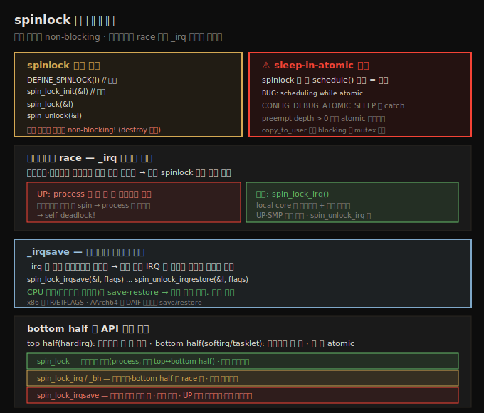
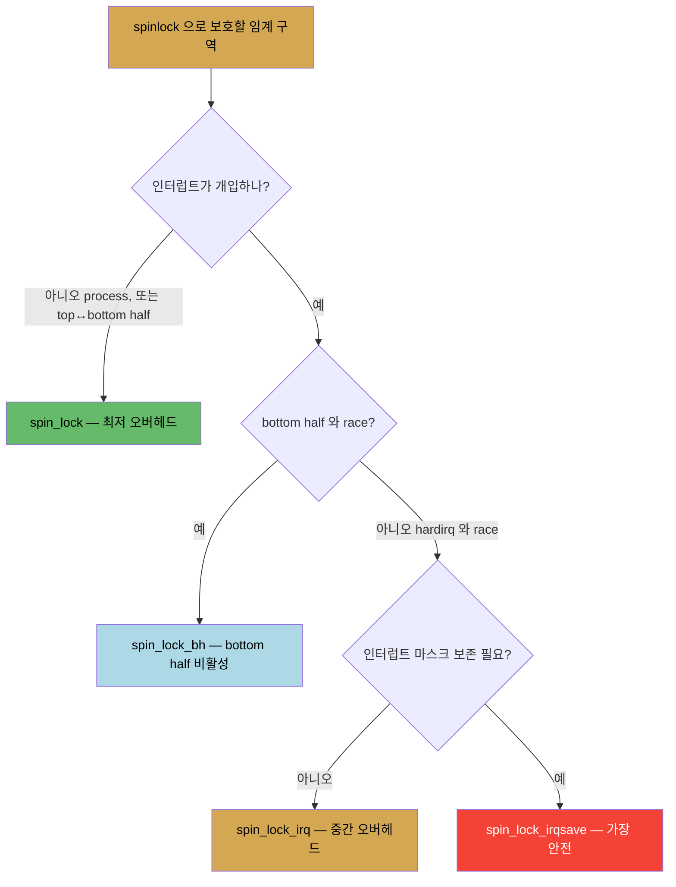

# 커널 동기화 (3) — spinlock과 인터럽트
---
> **spinlock** 은 `spinlock_t` 타입으로 `DEFINE_SPINLOCK`/`spin_lock_init` 로 초기화하고 `spin_lock`/`spin_unlock` 으로 (un)lock 합니다. 임계 구역은 반드시 **non-blocking** 이어야 합니다 — atomic 컨텍스트에서 sleep(`schedule`)하면 `BUG: scheduling while atomic` 이 발생합니다(`CONFIG_DEBUG_ATOMIC_SLEEP` 이 catch). 프로세스 컨텍스트와 인터럽트 핸들러가 같은 공유 데이터를 다루면 **같은 spinlock** 으로 보호해야 합니다. UP 에서는 process 가 락을 쥔 채 인터럽트가 같은 락을 spin 하면 self-deadlock 이므로 `spin_lock_irq`(인터럽트+선점 마스킹)를 씁니다. 인터럽트 마스크를 보존하려면 `spin_lock_irqsave`/`irqrestore` 를, bottom half 와 race 하면 `spin_lock_bh` 를 씁니다.

앞 노트(12-02)에서 mutex 와 spinlock 의 선택 기준을 봤습니다. 이 노트는 spinlock 의 구체적 사용과, 가장 까다로운 부분 — 인터럽트가 개입할 때의 락(`_irq`/`_irqsave`/`_bh`) — 을 다룹니다.

아래 종합도가 척추 — spinlock 기본, sleep-in-atomic 버그, 인터럽트 self-deadlock 과 `_irq`, `_irqsave`, bottom half·API 선택 요약 — 입니다.




## 1. spinlock 기본 사용

> spinlock 은 spinlock_t 타입으로 DEFINE_SPINLOCK(정적)·spin_lock_init(동적)로 초기화하고 spin_lock/spin_unlock 으로 (un)lock 합니다. 임계 구역은 반드시 non-blocking 이어야 합니다.

모든 spinlock API 는 `#include <linux/spinlock.h>` 가 필요합니다. mutex 처럼 사용 전 unlocked 상태로 초기화합니다. spinlock 은 `spinlock_t` typedef 로 표현됩니다.

```c
spinlock_t lock;
spin_lock_init(&lock);       // 동적
DEFINE_SPINLOCK(lock);       // 정적 — 선언+초기화
```

mutex 처럼 보호 대상 (global) 데이터 구조체 안에 spinlock 을 멤버로 두는 것이 좋습니다. 커널의 `struct file` 이 좋은 예로, `f_lock` spinlock 이 일부 멤버를, `f_pos_lock` mutex 가 seek 위치를 보호합니다(한 구조체에 여러 락이 흔함).

```c
void spin_lock(spinlock_t *lock);
<< ... 임계 구역 ... >>
void spin_unlock(spinlock_t *lock);
```

> spinlock 에는 mutex 의 `mutex_destroy()` 같은 destroy API 가 없습니다. 그리고 spinlock 을 쓴다는 것은 그것이 보호하는 임계 구역(lock~unlock)이 **반드시 non-blocking** 코드라는 뜻입니다. 한 구조체에 mutex 와 spinlock 을 함께 두기도 합니다 — mutex 는 blocking 가능한 임계 구역, spinlock 은 non-blocking/atomic 임계 구역 보호용입니다. blocking API(`copy_to_user` 등)를 부르는 임계 구역은 반드시 mutex 로만 보호합니다.


## 2. sleep-in-atomic 버그 — 실증

> spinlock 을 쥔 채 schedule() 같은 blocking call 을 부르면 BUG: scheduling while atomic 이 발생합니다. CONFIG_DEBUG_ATOMIC_SLEEP 이 켜진 debug 커널이 이를 잡고 preempt depth 를 표시합니다.

절대 하면 안 되는 것 하나는 atomic·인터럽트 컨텍스트에서 sleep(block)하는 것입니다. 실증해 봅니다 — 모듈 파라미터 `buggy` 가 1 이면 spinlock 임계 구역 안에서 `schedule_timeout()`(내부적으로 `schedule()` 호출, sleep)을 부르도록 합니다.

```c
spin_lock(&ctx->spinlock);
strscpy(ctx->oursecret, kbuf, ...);
if (1 == buggy) {
    set_current_state(TASK_INTERRUPTIBLE);
    schedule_timeout(1*HZ);   /* spinlock 쥔 채 blocking call! 버그 */
}
spin_unlock(&ctx->spinlock);
```

이를 **debug 커널**(`CONFIG_DEBUG_ATOMIC_SLEEP=y` 등 켜진 커스텀 커널)에서 write 시스템콜로 트리거하면 커널이 버그를 잡아 진단을 덤프합니다.

```
BUG: scheduling while atomic: rdwr_test_secre/3066/0x00000002
```

해석 — `atomic:` 뒤는 프로세스 이름·PID, 그리고 `preempt_count()`(preempt depth)입니다. preempt depth 는 spinlock 획득 시 증가·해제 시 감소하는 카운터로, 양수(여기 2)면 atomic·비선점 코드 경로임을 증명합니다.

진단에는 **call stack** 이 따라옵니다. 읽는 팁입니다.

1. **아래에서 위로** 읽습니다(write 시스템콜 → `ksys_write` → `vfs_write` → 드라이버 write → `schedule_timeout` → `schedule` → `__schedule`).
2. **`?` 로 시작하는 프레임은 무시**합니다 — 이전 스택 사용의 잔재(questionable)일 가능성이 큽니다. 스택 메모리는 호출마다 할당/해제하지 않고 페이지가 소진될 때만 새로 fault-in 되며, 성능상 프레임을 매번 지우지 않아 잔재가 남습니다.

> 이 버그는 `CONFIG_DEBUG_ATOMIC_SLEEP` 이 켜져 잡힙니다(Kernel Hacking 메뉴). 1판에서는 표준 distro 커널이 못 잡았으나, 최근 커널은 이 옵션이 명시적으로 설정 안 돼도 `scheduling while atomic` 을 잡습니다(커널 개선). 이 옵션은 프로덕션에서도 켜 두면 좋습니다. (LDV 규칙: spinlock 을 두 번 획득·미획득 해제·이중 해제 금지.)


## 3. 인터럽트와 race — 세 시나리오

> 프로세스 컨텍스트의 spinlock 임계 구역 중 인터럽트가 발생하면, 핸들러가 같은 공유 데이터를 같은 spinlock 으로 다룰 때 문제가 됩니다. 시나리오는 직렬 실행(안전), 인터리브(self-deadlock 위험), 마스크 보존 셋입니다.

드라이버 read 메서드에 non-blocking 임계 구역이 있어 spinlock 으로 보호한다고 합시다. read 임계 구역 중 디바이스 하드웨어 인터럽트가 발생하면? 인터럽트는 모든 것을 선점하므로 핸들러가 read 를 선점합니다. 문제 여부는 핸들러와 read 가 무엇을 다루느냐에 달렸습니다.

1. 핸들러가 지역 변수만 → 무관, race 없음.
2. 핸들러가 read 와 다른 공유 데이터 → race 없음(단 핸들러도 자기 임계 구역은 별도 spinlock 으로 보호).
3. **핸들러가 read 와 같은 공유 데이터** → data race! 이 경우 둘 다 **같은 spinlock** 으로 보호해야 효과가 있습니다(인터럽트 컨텍스트라 mutex 는 불가).

3번을 세 시나리오로 봅니다. read 와 핸들러가 같은 spinlock `slock` 을 쓴다고 합시다.

**시나리오 1 — 직렬 실행**: 인터럽트가 read 임계 구역 *후*(또는 전)에 발생 → 운 좋게 문제없음. 하지만 운에 의존할 수 없습니다.

**시나리오 2 — 인터리브**: 인터럽트가 read 임계 구역 *도중* 발생.

- **UP(단일 코어)**: 핸들러가 read 를 선점해 같은 `slock` 획득을 시도 → 이미 잠겨 spin. 하지만 락을 쥔 read 의 process context 가 인터럽트에 선점돼 unlock 을 못 함 → 인터럽트가 영원히 spin → **self-deadlock!**
- **SMP(멀티코어)**: read 가 코어 1, 인터럽트가 코어 2 에서 발생 → 코어 2 가 spin 하다가 코어 1 의 read 가 unlock 하면 진행. 정상 동작. 단 read 와 핸들러가 같은 코어면 UP 과 같은 문제.


## 4. _irq 변형 — UP·SMP 모두 해결

> spin_lock_irq 는 local core 의 하드웨어 인터럽트와 선점을 마스킹해, 인터럽트와의 race 를 UP·SMP 모두에서 해결합니다.

시나리오 2 의 해결책은 — 인터럽트와 race 할 때 `_irq` 변형을 쓰는 것입니다.

```c
void spin_lock_irq(spinlock_t *lock);
void spin_unlock_irq(spinlock_t *lock);
```

`spin_lock_irq()` 는 **local core 의 하드웨어 인터럽트를 마스킹**(non-maskable 인 NMI 제외)합니다. 따라서 임계 구역 동안 local core 에서 인터럽트가 비활성되어 인터럽트로 인한 race 가 불가능해집니다(다른 코어에서 인터럽트가 나면 spinlock 이 정상 동작). 내부적으로 `local_irq_disable()` 과 `preempt_disable()` 을 불러, **하드웨어 인터럽트 마스킹의 부수 효과로 커널 선점도 비활성**됩니다.

```c
/* 올바른 사용 */
spin_lock_irq(&slock);
<< ... 임계 구역 (인터럽트+선점 마스킹됨) ... >>
spin_unlock_irq(&slock);
```

이제 `_irq` 변형 덕에 하드웨어 인터럽트가 read 임계 구역을 선점하는 것이 불가능해져 UP·SMP 모두 안전합니다.


## 5. _irqsave 변형 — 인터럽트 마스크 보존

> spin_lock_irq 는 모든 인터럽트를 켜버려, 누군가 일부 IRQ 를 막아둔 설정을 덮어쓸 위험이 있습니다. spin_lock_irqsave/irqrestore 는 CPU 상태(인터럽트 마스크)를 save·restore 해 기존 설정을 보존하는 가장 안전한 방식입니다.

아직 미묘한 문제가 남습니다. 복잡한 프로젝트에서 누군가 `disable_irq()` 로 일부 IRQ 를 *의도적으로 막아둔* 상태(예: 마스크 `0x8e`)라고 합시다. 그 뒤 다른 개발자가 read 임계 구역을 `spin_lock_irq()` 로 보호하면, 이 API 는 임계 구역 동안 모든 인터럽트를 끄고, unlock 시 **모든 인터럽트를 켜버립니다**(마스크가 `0xff` 로 잘못 "복원"됨) → 원래 `0x8e` 설정이 깨져 프로젝트가 망가질 수 있습니다.

해결책은 — CPU 상태를 가정하지 말고, **있는 그대로 save·restore** 하는 것입니다.

```c
unsigned long flags;
spin_lock_irqsave(&slock, flags);
<< ... 임계 구역 (CPU 상태 save, 인터럽트+선점 마스킹) ... >>
spin_unlock_irqrestore(&slock, flags);
```

`flags` 는 `unsigned long` 지역 변수로, arch 특화 CPU 레지스터(곧 인터럽트 마스크 상태)를 저장합니다. 원래 마스크가 `0x8e` 면 그대로 save·restore 되어 보존됩니다.

> x86 은 `[R/E]FLAGS`, AArch64 는 `DAIF`(Debug·Asynchronous serror·Interrupts·FIQ) 레지스터를 save/restore 합니다. `spin_lock_irqsave` 는 사실 API 가 아니라 매크로이며(가독성 위해 API 로 표기), `flags` 를 내부 갱신합니다.


## 6. bottom half 와 API 선택 요약

> top half(hardirq)는 인터럽트를 끈 채, bottom half(softirq/tasklet)는 켠 채 실행되지만 둘 다 atomic 입니다. bottom half 와 race 하면 spin_lock_bh 를 씁니다. API 는 오버헤드 순으로 spin_lock < _irq/_bh < _irqsave 입니다.

**인터럽트 처리 요약** — 핸들러는 non-blocking 으로 빠르게(보통 100μs 내) 끝내야 합니다. 일이 많으면 top half(hardirq, 최소 작업)와 bottom half(deferred, 나중 실행)로 나눕니다. top half 는 인터럽트를 끈 채, bottom half(tasklet/softirq)는 켠 채 실행되지만 **둘 다 인터럽트 컨텍스트**라 blocking 금지입니다. threaded handler(kthread, SCHED_FIFO·prio 50)는 blocking 이 허용됩니다.

**bottom half 와 락**:

1. 드라이버의 softirq/tasklet 이 top half(hardirq)와 race → 둘 다 일반 spinlock.
2. softirq/tasklet 이 process context 코드와 race → `spin_lock_bh()` — local core 의 bottom half 를 먼저 비활성한 뒤 락 획득(짝은 `spin_unlock_bh()`).



API 선택을 오버헤드 순으로 요약합니다.

| API | 언제 | 오버헤드 |
|-----|------|---------|
| `spin_lock`/`spin_unlock` | 인터럽트 무관(process, 또는 top↔bottom half) | 최저 |
| `spin_lock_irq` / `spin_lock_bh` | 하드웨어 인터럽트 / bottom half 와 race | 중간 |
| `spin_lock_irqsave` | 인터럽트 마스크 보존 필요(가장 안전) | (상대적) 높음 |

> 6.1 커널에서 사용 빈도는 `spin_lock` 10,200+, `spin_lock_irq` 3,800+, `spin_lock_irqsave` 15,500+, `spin_lock_bh` 4,400+ 로, 강한 변형 사용이 광범위합니다. UP 에서 spinlock API 는 spin 로직이 없고 인터럽트·선점 마스킹만 합니다(SMP 에서만 spin 동작). 단 이 세부는 구현이 숨기니, 노출 API 만 쓰면 UP/SMP 를 신경 쓸 필요가 없습니다. RTL(real-time) 커널에서는 spinlock 이 선점 가능한 "sleeping spinlock"(rt-mutex)으로 재구현됩니다.


## 자주 받는 오해

1. "spinlock 임계 구역에서 `copy_to_user()` 같은 호출을 써도 된다"고 생각하지만, 이들은 blocking(sleep 가능)이라 `BUG: scheduling while atomic` 을 유발합니다. blocking 임계 구역은 mutex 로만 보호합니다.
2. "spinlock 만 쓰면 인터럽트와의 race 가 자동 해결된다"고 생각하지만, UP 에서는 process 가 락을 쥔 채 인터럽트가 같은 락을 spin 하면 self-deadlock 입니다. 인터럽트와 race 할 때는 `spin_lock_irq` 변형으로 인터럽트를 마스킹해야 합니다.
3. "`spin_lock_irq` 와 `spin_lock_irqsave` 는 같다"고 생각하지만, `_irq` 는 unlock 시 모든 인터럽트를 켜버려 기존 마스크 설정을 덮어쓸 수 있습니다. `_irqsave` 는 CPU 상태를 save·restore 해 기존 설정을 보존합니다.
4. "UP 시스템에서 spinlock 은 무의미하다"고 생각하지만, UP 에서도 spinlock API 는 인터럽트·커널 선점을 마스킹하는 실질 효과가 있습니다(spin 로직만 없을 뿐).


## 면접에서 받을 만한 질문

1. **spinlock 임계 구역의 제약은?** → 반드시 non-blocking 이어야 합니다. spinlock 을 쥔 채 `schedule()`(또는 `copy_to_user`·`schedule_timeout` 같은 blocking call)을 부르면 `BUG: scheduling while atomic` 이 발생합니다. `CONFIG_DEBUG_ATOMIC_SLEEP` 이 켜진 debug 커널이 이를 잡고, preempt depth 가 양수임을 보여 줍니다.
2. **프로세스 컨텍스트와 인터럽트 핸들러가 같은 데이터를 다룰 때 어떻게 보호하나요?** → 둘 다 **같은 spinlock** 으로 보호해야 합니다(인터럽트 컨텍스트라 mutex 불가). 그리고 프로세스 컨텍스트 쪽은 `spin_lock_irq`(또는 `_irqsave`)를 써서 local core 의 인터럽트를 마스킹해야, 인터럽트가 락을 쥔 자신을 선점해 self-deadlock 되는 것을 막습니다.
3. **spin_lock_irq 가 하는 일은?** → local core 의 하드웨어 인터럽트(NMI 제외)와 커널 선점을 마스킹합니다(내부적으로 `local_irq_disable` + `preempt_disable`). 따라서 임계 구역 동안 인터럽트가 선점할 수 없어, 인터럽트와의 race 가 UP·SMP 모두에서 불가능해집니다.
4. **spin_lock_irq 와 spin_lock_irqsave 의 차이는?** → `_irq` 는 unlock 시 무조건 모든 인터럽트를 켭니다 — 누군가 일부 IRQ 를 막아둔 설정을 덮어쓸 위험이 있습니다. `_irqsave` 는 `flags` 변수에 CPU 상태(인터럽트 마스크)를 save 하고 `irqrestore` 가 복원해 기존 설정을 보존하므로 가장 안전합니다.
5. **spin_lock_bh 는 언제 쓰나요?** → 드라이버의 softirq/tasklet(bottom half) 임계 구역이 process context 코드와 race 할 때입니다. local core 의 bottom half 를 먼저 비활성한 뒤 락을 획득해, bottom half 가 process context 의 임계 구역을 선점하는 것을 막습니다.


## 관련 문서

- [상위 MOC](../README.md) — 커널 개발자 관점 리눅스 내부 인덱스
- [12-02. 커널 동기화 (2) — mutex와 spinlock 선택](./12-02.커널 동기화 (2) — mutex와 spinlock 선택.md) — 어느 락을 언제 쓰는가의 기반
- [12-01. 커널 동기화 (1) — 임계 구역과 data race](./12-01.커널 동기화 (1) — 임계 구역과 data race.md) — atomic 컨텍스트·deadlock 의 기반
