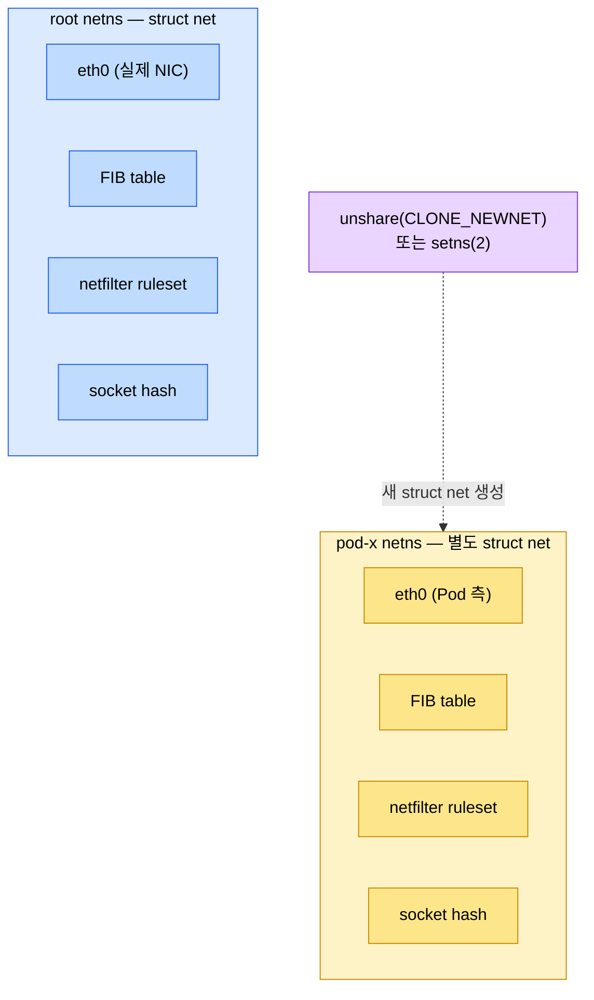
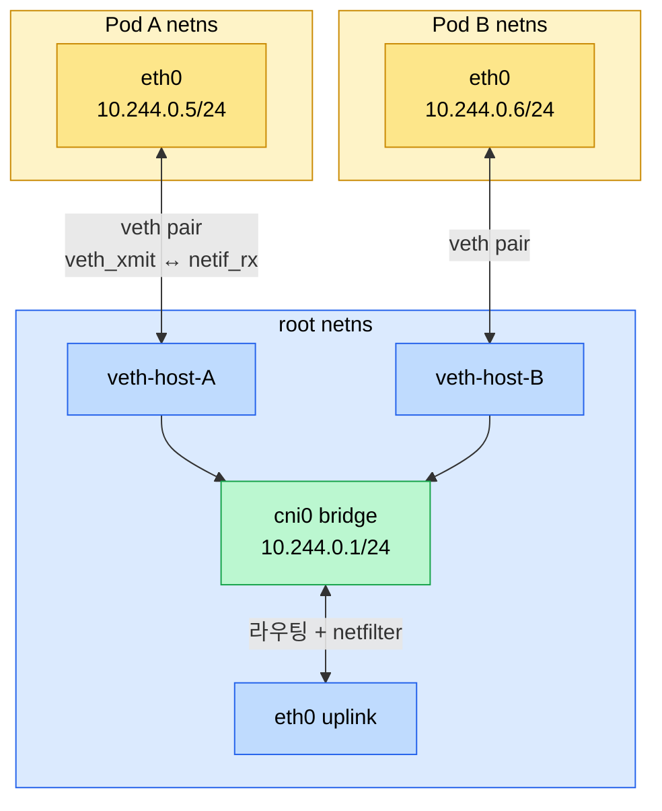
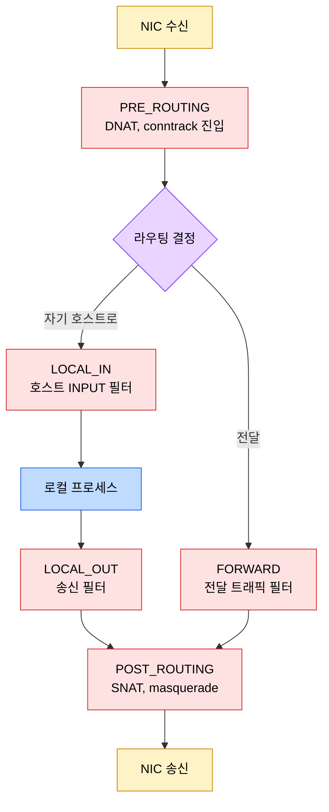
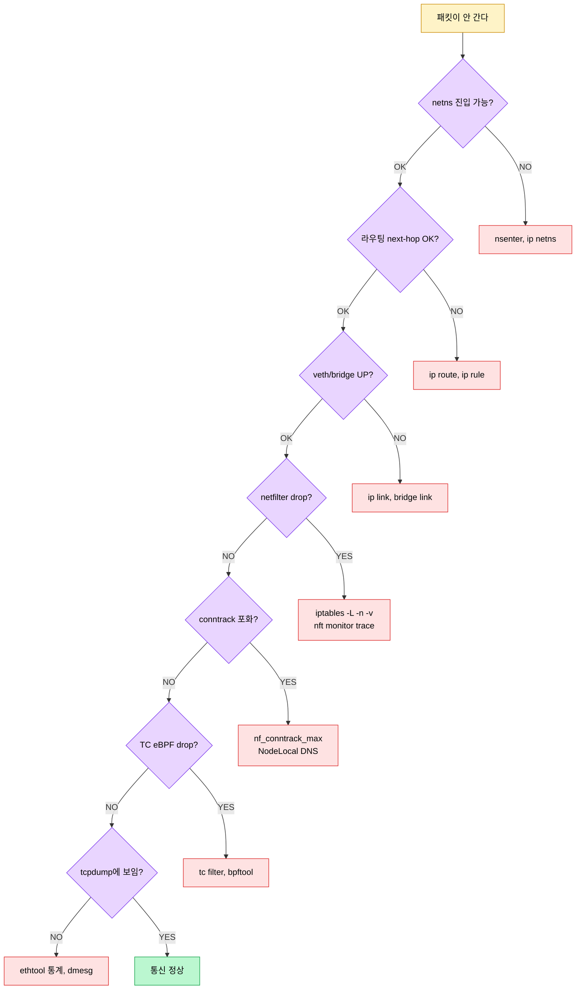

# 리눅스 네트워킹 기초

---
> Kubernetes 네트워킹 문서들이 "Pod에 IP가 붙고 노드 사이로 패킷이 간다"는 추상을 다룬다면, 이 문서는 그 한 칸 아래 — 커널이 어떤 자료구조와 hook으로 그 추상을 만드는지 — 를 정리한다. 컨테이너에 한정되지 않는 Linux 자체 메커니즘이며, 추상 어디가 깨졌을 때 어디를 봐야 하는지의 지도가 된다.


## 학습 목표
> Linux 커널이 제공하는 네트워크 자료구조와 hook을 알아 두면, K8s/CNI 추상이 깨졌을 때 어디로 내려가야 하는지 분명해진다.

이 문서에서 확인할 목표는 다음과 같다:

1. 네트워크 네임스페이스가 커널에서 어떤 단위로 격리되는지 설명할 수 있다.
2. veth pair의 전송 의미와 Linux bridge의 학습·전달 동작을 그릴 수 있다.
3. 라우팅 테이블이 main·local 같은 여러 테이블로 나뉜 구조와 policy routing(`ip rule`)을 활용할 수 있다.
4. netfilter hook 5개와 iptables/nftables가 그 위에 어떻게 얹히는지 설명할 수 있다.
5. conntrack 테이블이 만드는 상태 추적의 부수효과(SNAT 응답 매핑, NAT 일관성, 테이블 포화)를 진단할 수 있다.
6. TC qdisc와 eBPF 어태치 포인트(XDP, TC, kprobe)가 패킷 경로의 어디에 끼어드는지 매핑할 수 있다.


## 1. 네트워크 네임스페이스
> **네트워크 네임스페이스**는 인터페이스, 라우팅 테이블, ARP 캐시, netfilter ruleset, 포트 점유 상태를 통째로 격리한 커널 자료구조다. 컨테이너의 모든 네트워크 격리는 이 단일 메커니즘 위에 얹힌다.
>
> - "컴퓨터 안에 만든 작은 가상 네트워크 방"

일반적으로 한 리눅스 서버에는 기본 네트워크 공간이 하나 있습니다.

```bash
root 네트워크 공간
 ├─ eth0
 ├─ lo
 ├─ 라우팅 테이블
 ├─ ARP 캐시
 ├─ 방화벽 규칙
 └─ 사용 중인 포트 목록
```

그런데 컨테이너를 만들면, 리눅스는 컨테이너에게 별도의 네트워크 공간을 하나 줍니다.

```bash
root netns
 ├─ eth0
 ├─ 10.0.0.10
 └─ 8080 사용 중

pod-a netns
 ├─ eth0
 ├─ 10.244.1.5
 └─ 8080 사용 중

pod-b netns
 ├─ eth0
 ├─ 10.244.1.6
 └─ 8080 사용 중
```

- 각 네임스페이스는 자기만의 port를 사용하기 때문에 동일한 8080을 중복해서 쓸 수 있습니다.

### 무엇이 격리되는가

> `struct net` = 네트워크 네임스페이스 하나를 표현하는 커널 객체

```bash
struct net
 ├─ 네트워크 인터페이스 목록
 ├─ 라우팅 테이블
 ├─ ARP/NDP 캐시
 ├─ 방화벽 규칙
 ├─ 소켓 목록
 └─ 포트 사용 상태
```

- `struct net_device` 리스트(인터페이스), `struct fib_table`(라우팅), `struct neigh_table`(ARP/NDP), netfilter ruleset, 소켓 hash가 모두 들어 있다. 같은 네임스페이스 안에서만 이 자료구조가 공유된다.
- 두 프로세스가 서로 다른 네임스페이스에 들어 있으면 각자의 `struct net`에 별도 소켓 hash가 있고, 점유 충돌이 일어나지 않는다.

### 만들기와 들어가기

```bash
ip netns add demo                         # /var/run/netns/demo 생성
ip netns list
ip netns exec demo ip addr                # 그 네임스페이스에서 명령 실행
nsenter --net=/var/run/netns/demo bash    # 셸로 진입
```

- `ip netns add`는 내부적으로 `unshare(CLONE_NEWNET)` 또는 `setns(2)`를 호출해 새 `struct net`을 만든다. 
- `/var/run/netns/<이름>`은 그 네임스페이스에 대한 파일 디스크립터를 잡고 있는 마운트 포인트일 뿐이고, 실제 격리 단위는 커널 안의 `struct net` 객체다.

컨테이너 런타임은 보통 `/var/run/netns/`에 등록하지 않고 자기 프로세스가 잡고 있는 fd만으로 네임스페이스를 유지한다. K8s에서 Pause 컨테이너의 PID를 알면 `nsenter -t <PID> -n`으로 그 Pod의 네임스페이스에 들어갈 수 있다.

### 인터페이스 이동

인터페이스는 만들 때 root 네임스페이스에 속하지만, `ip link set <iface> netns <ns>`로 다른 네임스페이스로 이동할 수 있다. 이동하면 더 이상 원래 네임스페이스에서는 보이지 않는다. CNI가 veth pair의 한쪽을 Pod 네임스페이스로 옮기는 동작이 이 syscall이다.



격리된 두 `struct net`이 같은 8080 포트를 동시에 점유할 수 있는 이유가 이 그림이다. 소켓 hash가 따로 있기 때문에 충돌이 일어나지 않는다.


## 2. veth pair와 Linux bridge
> veth pair는 쌍으로 만들어지는 가상 네트워크 인터페이스입니다.
>
> - bridge는 root 네임스페이스에 있는 가상 L2 스위치다. 둘이 결합해 컨테이너의 외부 통로를 만든다.

### veth의 전송 의미

Pod는 자기만의 네트워크 네임스페이스 안에 있고, 바깥과 통신하기 위해서는 노드의 네트워크 공간과 연결되어야합니다.

```bash
# [Pod netns]                      [root netns]
eth0  <==== veth pair ====>  veth-host-A
```

- pod장에서는 eth0이 자신 네트워크 카드처럼 보이지만, 실제로는 veth pair의 한쪽 끝이다.

  

```bash
# veth0 와 veth1 이라는 가상 네트워크 카드 2개를 만들고, 둘을 서로 연결된 한 쌍으로 묶어라.
ip link add veth0 type veth peer name veth1

# veth_xmit = veth에서 패킷을 보내는 함수
# netif_rx = 네트워크 인터페이스가 패킷을 받은 것처럼 처리하는 함수
```

- 한쪽으로 송신된 패킷은 즉시 반대쪽의 수신 큐로 들어간다. 
- 가운데 transport는 없다. 커널 내부에서 보면 `veth_xmit`가 peer의 `netif_rx`를 직접 호출한다.

이 모델 때문에 veth는 매우 빠르지만, 패킷이 두 번의 softirq를 타며 CPU 캐시 미스가 날 수 있다. 대량 트래픽 환경에서는 veth 대신 macvlan 또는 ipvlan을 쓰는 패턴이 검토된다.

### bridge의 학습·전달

veth pair가 Linux bridge는 가상 스위치다.

```bash
# 현실 네트워크는 여러 컴퓨터를 스위치에 꼽음
PC A ─┐
PC B ─┼── [스위치]
PC C ─┘

# linux에는 여러 veth를 bridge에 꽃(여러 Pod를 같은 네트워크로 묶음)
[Pod A] eth0 <====> veth-host-A ─┐
                                 │
[Pod B] eth0 <====> veth-host-B ─┼── cni0 bridge
                                 │
[Pod C] eth0 <====> veth-host-C ─┘
```

- Linux bridge는 `struct net_bridge`로 표현되며, 안에 forwarding database(FDB)를 갖는다. 
- 같은 bridge에 꽂힌 인터페이스에서 source MAC을 본 적이 있으면 FDB에 학습되고, 다음 패킷이 그 MAC으로 향할 때 곧장 해당 포트로 전달된다.

```bash
bridge link show
bridge fdb show br cni0
ip -d link show br cni0
```

bridge는 STP(Spanning Tree Protocol)도 지원하지만 컨테이너 환경에서는 보통 비활성화한다. STP가 켜지면 노드를 다시 부팅했을 때 forwarding 시작 전 30초 정도 지연이 생긴다.

### CNI가 만드는 토폴로지

CNI 플러그인이 Pod 하나를 만들 때 일반적으로 다음 순서를 밟는다:

```bash
ip netns add pod-x
ip link add veth-host-x type veth peer name eth0 netns pod-x
ip link set veth-host-x master cni0
ip link set veth-host-x up
ip -n pod-x addr add 10.244.0.5/24 dev eth0
ip -n pod-x route add default via 10.244.0.1
```

bridge에 꽂힌 모든 veth는 같은 L2 도메인에 있으므로 ARP로 서로를 찾는다. 같은 노드 Pod 사이는 bridge 안에서 L2로 끝난다.

```bash
┌──────────────── Pod A netns ────────────────┐
│                                             │
│  App A                                      │
│   │                                         │
│ socket                                      │
│   │                                         │
│ eth0 (10.244.0.5)                           │
└───┼─────────────────────────────────────────┘
    │
    │ veth pair
    ▼
┌───┴──────────────── root netns ─────────────────────────────────────────────┐
│                                                                             │
│  veth-host-A ─────────┐                                                     │
│                       │                                                     │
│                       ▼                                                     │
│                 ┌───────────────┐                                           │
│                 │  cni0 bridge  │  ← 가상 L2 스위치                         │
│                 │               │                                           │
│                 │  FDB          │  ← MAC 주소 학습                          │
│                 └───────────────┘                                           │
│                       ▲                                                     │
│                       │                                                     │
│  veth-host-B ─────────┘                                                     │
│                                                                             │
└───┬─────────────────────────────────────────────────────────────────────────┘
    │
    │ veth pair
    ▼
┌───┴──────────────── Pod B netns ────────────────┐
│                                                 │
│ eth0 (10.244.0.6)                               │
│   │                                             │
│ socket                                          │
│   │                                             │
│  App B                                          │
│                                                 │
└─────────────────────────────────────────────────┘
```



- 같은 노드 두 Pod 통신은 `EA → VHA → BR → VHB → EB`로 끝난다. 다른 노드로 나갈 때만 `BR → UP`으로 라우팅 테이블이 결정해 보낸다.


## 3. 라우팅 테이블과 policy routing
> **Linux는 라우팅 테이블이 하나가 아니라 여러 개다.** 
>
> - `ip rule`이 어느 테이블을 볼지 결정하고, 각 테이블이 next-hop을 결정한다. 
> - 이 두 단계가 풀리지 않으면 Pod CIDR 라우팅 디버깅이 안 된다.

### main, local, default

기본 테이블은 세 개다. `local`(255)은 자기 노드 IP에 대한 항목, `main`(254)이 일반 라우팅, `default`(253)는 비어 있는 폴백이다. `ip route`만 치면 main 테이블만 보인다.

```bash
ip route show table main
ip route show table local       # 자기 IP 항목
ip route show table all         # 모든 테이블
```

K8s 환경에서 main 테이블에는 다음과 같은 항목이 박힌다:

```
default via 172.18.0.1 dev eth0
10.244.0.0/24 dev cni0 scope link    # 자기 노드 Pod CIDR
10.244.1.0/24 via 172.18.0.3 dev eth0 # 다른 노드 Pod CIDR
172.18.0.0/16 dev eth0 scope link
```

### policy routing — `ip rule`

여러 테이블을 분기시키려면 `ip rule`이 필요하다. 트래픽 출발지·목적지·인터페이스·firewall mark에 따라 다른 테이블을 보게 만든다.

```bash
ip rule list
# 0:  from all lookup local
# 32766: from all lookup main
# 32767: from all lookup default
```

`fwmark`로 분기시키는 패턴이 흔하다. iptables가 패킷에 mark를 박고, `ip rule`이 그 mark에 해당하는 테이블로 보낸다. Cilium은 자체 routing을 위해 이 패턴을 쓰며, MetalLB BGP 모드도 같은 방식으로 outbound 경로를 잡는다.

```bash
ip rule add fwmark 0x100 table 100
ip route add default via 192.168.50.1 table 100
iptables -t mangle -A OUTPUT -d 10.99.0.0/16 -j MARK --set-mark 0x100
```


## 4. netfilter와 iptables / nftables
> 패킷이 커널 네트워크 스택을 흐르며 거치는 다섯 hook이 netfilter다. iptables와 nftables는 이 hook 위에 룰을 얹는 두 표현이다.

### 5개의 hook

L3(IP) 레이어에서 패킷이 거치는 hook은 다음과 같다:

| Hook | 시점 | 흔한 용도 |
|------|------|----------|
| `NF_IP_PRE_ROUTING` | 패킷 수신 직후, 라우팅 결정 전 | DNAT, conntrack zone |
| `NF_IP_LOCAL_IN` | 라우팅이 "자기 호스트로" 결정 후 | 호스트 INPUT 필터 |
| `NF_IP_FORWARD` | 라우팅이 "전달"로 결정 후 | 노드를 거쳐 가는 트래픽 필터 |
| `NF_IP_LOCAL_OUT` | 자기 호스트가 송신할 때 | 송신 필터, OUTPUT mark |
| `NF_IP_POST_ROUTING` | 송신 직전, NIC 보내기 전 | SNAT, masquerade |

iptables의 `INPUT/OUTPUT/FORWARD/PREROUTING/POSTROUTING` 체인 이름이 이 hook과 일대일 대응이다.



K8s Service의 ClusterIP DNAT는 PRE_ROUTING에서, NodePort의 SNAT는 POST_ROUTING에서 일어난다. iptables 규칙이 어디 hook에 등록됐는지를 보면 그 규칙의 책임이 곧장 보인다.

### iptables — 체인과 테이블

iptables는 4개의 테이블(`filter`, `nat`, `mangle`, `raw`)을 가지고, 각 테이블이 일부 hook에 체인을 등록한다. 트래픽이 hook을 지날 때 테이블별 체인을 정해진 우선순위 순으로 평가한다.

| 테이블 | 우선순위 | 등록 hook |
|--------|----------|-----------|
| raw | -300 | PREROUTING, OUTPUT |
| mangle | -150 | 모든 hook |
| nat | -100 | PREROUTING, OUTPUT, POSTROUTING |
| filter | 0 | INPUT, FORWARD, OUTPUT |

```bash
iptables -t nat -L -n -v
iptables-save | grep KUBE-SERVICES | head
```

### nftables — 더 나은 표현

nftables는 같은 netfilter hook 위에서 표현을 더 효율적으로 다시 짠다. 핵심 차이는 셋(set)과 맵(map)이다. iptables는 규칙을 선형으로 평가해 규칙 수에 비례한 비용이 들지만, nftables는 set/map 안에서 해시 조회가 가능해 매칭 시간이 일정하다.

```bash
nft list ruleset
nft list table ip kube-proxy
```

K8s kube-proxy의 `nftables` 모드(1.31 beta, 1.33 GA)는 같은 KUBE-SERVICES 의미를 nft set/map으로 다시 적되 Service 수가 늘어도 매칭 비용이 일정하도록 만든다.

### 디버깅

규칙이 매칭되는지 알고 싶을 때는 LOG 타겟이나 `nftrace`를 쓴다.

```bash
iptables -t nat -A PREROUTING -d 10.96.50.20 -j LOG --log-prefix "MATCH: "
journalctl -kf | grep "MATCH:"

nft monitor trace
nft 'add rule inet filter input ip saddr 10.244.0.5 meta nftrace set 1'
```


## 5. conntrack — 연결 추적
> NAT를 쓰는 모든 노드는 conntrack 테이블을 갖는다. 한 흐름이 만들어지면 응답 패킷도 같은 NAT 변환을 받기 위해 추적이 필요하다. 이 테이블이 가득 차면 새 연결이 silently drop 된다.

### 무엇이 기록되는가

conntrack 엔트리는 5-tuple(src IP, dst IP, src port, dst port, protocol) 두 방향(original, reply)과 NAT 변환, 상태(NEW, ESTABLISHED, RELATED, INVALID), TTL을 갖는다. 새 연결은 PREROUTING의 raw 테이블에서 시작점을 만나고, ESTABLISHED 패킷은 이미 만들어진 엔트리를 바로 참조한다.

```bash
conntrack -L | head
conntrack -L -p tcp --dport 80
cat /proc/sys/net/netfilter/nf_conntrack_max
cat /proc/net/stat/nf_conntrack    # drop, insert_failed 통계
```

### K8s에서 자주 보이는 두 패턴

K8s Service의 ClusterIP DNAT가 일어나면 conntrack에 변환이 기록된다. 응답 패킷은 같은 5-tuple을 reply 방향에서 매칭해 자동으로 NAT를 거꾸로 풀어 클라이언트로 돌아간다. 이 자동 reverse가 없으면 클라이언트는 모르는 IP에서 응답을 받게 되어 패킷을 버린다.

NodePort/LoadBalancer + `externalTrafficPolicy: Cluster` 조합에서 SNAT가 추가로 일어난다. 이때도 conntrack이 응답을 노드 자신으로 돌려 와 다시 클라이언트로 풀어 주는 역할을 한다.

### 포화 문제

UDP는 ESTABLISHED 타임아웃이 짧지만 conntrack에 들어가는 양이 많다. CoreDNS 트래픽이 많은 클러스터에서는 conntrack 테이블이 포화되어 새 연결이 drop 되는 사례가 있다. 대처법은 두 가지다.

`nf_conntrack_max`를 올린다. 노드 메모리에 비례해 자동 계산되는데, 문제 환경에서는 수동으로 4배 정도 키워 본다.

```bash
sysctl -w net.netfilter.nf_conntrack_max=1048576
```

DNS 캐시(NodeLocal DNS Cache)를 도입해 노드 외부 conntrack 엔트리 발생 자체를 줄인다. K8s 04-05 NodeLocal DNS Cache 절이 이 패턴을 다룬다.


## 6. Traffic Control(TC)와 qdisc
> TC는 큐잉·셰이핑·필터링·policing을 담당하는 Linux 네트워크 계층의 또 다른 hook 지점이다. eBPF가 가장 흔하게 어태치되는 자리이기도 하다.

### qdisc 트리

각 인터페이스에는 outgoing qdisc(보통 `pfifo_fast` 또는 `fq_codel`)와 ingress qdisc가 따로 붙는다. qdisc 안에 class와 filter가 트리 형태로 쌓이고, filter가 패킷을 분류해 class로 보낸다.

```bash
tc qdisc show dev eth0
tc class show dev eth0
tc filter show dev eth0
```

ingress qdisc는 entry point 하나만 있는 특수한 qdisc다. eBPF/cls 기반 필터를 붙여 진입 패킷을 처리한다.

### TC eBPF — Cilium의 진입점

Cilium은 노드 인터페이스의 ingress와 egress 양쪽 TC hook에 eBPF 프로그램을 어태치한다. 이 프로그램이 Service VIP DNAT, NetworkPolicy 평가, Pod 식별, 메트릭 수집을 모두 수행한다. iptables/nftables를 거치지 않는 이유가 여기 있다.

```bash
tc filter show dev eth0 ingress
bpftool net show          # 모든 BPF 어태치 포인트
bpftool prog show          # 로드된 BPF 프로그램
```


## 7. eBPF — 핵심 메커니즘만
> eBPF는 별도 문서에서 깊게 다뤄도 좋은 주제지만, 네트워킹 진단에서 자주 쓰는 부분만 정리한다.

eBPF 프로그램은 verifier가 정적 분석으로 안전성을 확인한 뒤 JIT 컴파일되어 커널 hook에서 실행된다. 어태치 가능한 hook은 다음과 같다:

| 어태치 포인트 | 시점 | 용도 |
|--------------|------|------|
| XDP | NIC 드라이버 직후 | 가장 빠른 패킷 처리, DDoS 차단 |
| TC ingress/egress | qdisc 진입/송출 시 | Cilium의 주된 dataplane |
| cgroup connect/sendmsg | 소켓 syscall 시 | Service VIP socket-level 로드밸런싱 |
| kprobe / tracepoint | 커널 함수 호출 | Hubble의 L7 정보 수집 |

eBPF 맵은 커널과 유저스페이스가 공유하는 자료구조다. Cilium은 Service endpoint 테이블, NetworkPolicy 결정 트리, 연결 추적 정보를 맵에 담아 두고 dataplane이 O(1) 해시로 조회한다.

```bash
bpftool map show
bpftool prog dump xlated id <prog_id>
cat /sys/kernel/debug/tracing/trace_pipe   # bpf_trace_printk 출력
```

상세는 [eBPF와 Cilium](../../09_cloud/service-mesh/14-02.eBPF%EC%99%80%20Cilium.md) 본편을 본다.


## 8. 통합 디버깅 시퀀스
> "패킷이 안 가는데" 같은 막연한 증상을 만났을 때, 위 메커니즘을 따라 좁히는 순서를 정리해 둔다.

확인 순서는 다음과 같다:

1. 어느 네임스페이스에서 보내고 받는지 확인한다(`ip netns`, `nsenter -t <PID> -n`).
2. 출발 네임스페이스의 라우팅 테이블이 의도한 next-hop으로 보내고 있는지 본다(`ip route`, `ip rule`).
3. veth/bridge가 정상인지 확인한다(`ip link`, `bridge link`, `bridge fdb`).
4. netfilter가 drop 또는 reject 하지 않는지 본다(`iptables -L -n -v` 카운터, `nft monitor trace`).
5. conntrack에 흐름이 잡혔는지, 테이블이 포화 상태가 아닌지 확인한다(`conntrack -L`, `/proc/net/stat/nf_conntrack`).
6. TC ingress/egress eBPF가 패킷을 drop 하지 않는지, BPF 맵 상태가 정상인지 본다(`tc filter`, `bpftool prog show`, `bpftool map dump`).
7. 노드 NIC에서 실제 패킷이 보이는지 캡처해 확인한다(`tcpdump -i any -n`, ethtool 통계).




## 다음 단계
> 본 문서를 통해 잡은 Linux 기반 위에서 K8s 추상이 어떻게 동작하는지 다시 읽으면 디테일이 잘 보인다.

- Pod 네트워크의 K8s 측면: [Pod 네트워크와 Linux 기반](../../09_cloud/kubernetes/04-02.Pod%20%EB%84%A4%ED%8A%B8%EC%9B%8C%ED%81%AC%EC%99%80%20Linux%20%EA%B8%B0%EB%B0%98.md)
- 노드 사이 트래픽: [오버레이와 노드 간 트래픽](../../09_cloud/kubernetes/04-03.%EC%98%A4%EB%B2%84%EB%A0%88%EC%9D%B4%EC%99%80%20%EB%85%B8%EB%93%9C%20%EA%B0%84%20%ED%8A%B8%EB%9E%98%ED%94%BD.md)
- eBPF 디테일: [eBPF와 Cilium](../../09_cloud/service-mesh/14-02.eBPF%EC%99%80%20Cilium.md)
- 메시 통합 패턴: [Cilium과 Istio Ambient 통합 전략](../../09_cloud/service-mesh/14-05.Cilium%EA%B3%BC%20Istio%20Ambient%20%ED%86%B5%ED%95%A9%20%EC%A0%84%EB%9E%B5.md)


## 관련 문서
> Linux 네트워크 자체보다 한 단계 위(K8s, 메시)에서 본 자료를 함께 둔다.

- [네트워킹](../../09_cloud/kubernetes/04-01.%EB%84%A4%ED%8A%B8%EC%9B%8C%ED%82%B9.md) — Kubernetes 네트워킹 전체 지도
- [Pod 네트워크와 Linux 기반](../../09_cloud/kubernetes/04-02.Pod%20%EB%84%A4%ED%8A%B8%EC%9B%8C%ED%81%AC%EC%99%80%20Linux%20%EA%B8%B0%EB%B0%98.md) — Pause·netns·veth·CNI·kube-proxy
- [오버레이와 노드 간 트래픽](../../09_cloud/kubernetes/04-03.%EC%98%A4%EB%B2%84%EB%A0%88%EC%9D%B4%EC%99%80%20%EB%85%B8%EB%93%9C%20%EA%B0%84%20%ED%8A%B8%EB%9E%98%ED%94%BD.md) — VXLAN·BGP·MetalLB
- [eBPF와 Cilium](../../09_cloud/service-mesh/14-02.eBPF%EC%99%80%20Cilium.md) — eBPF 본편
