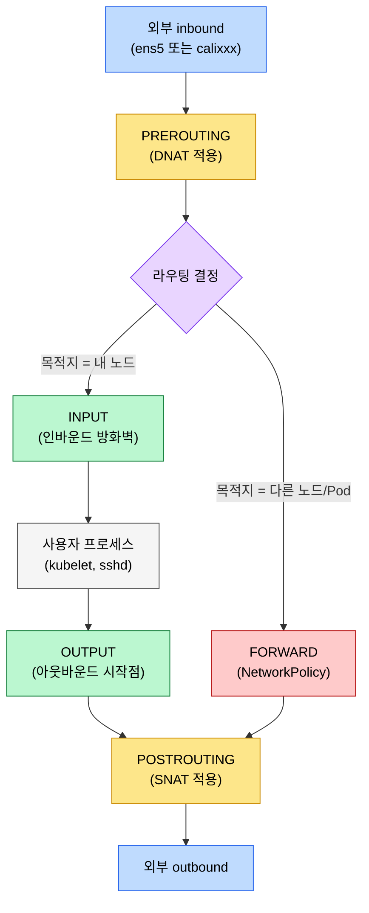
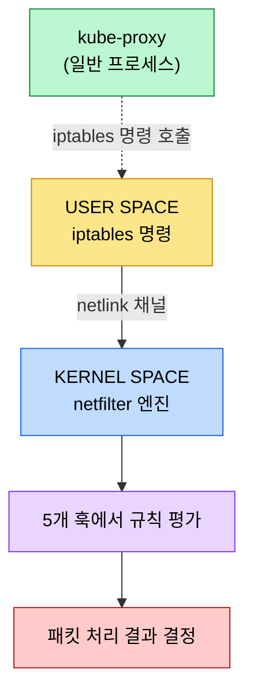
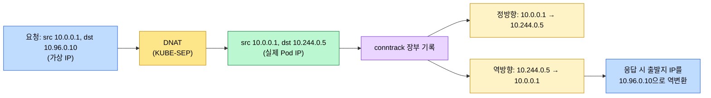
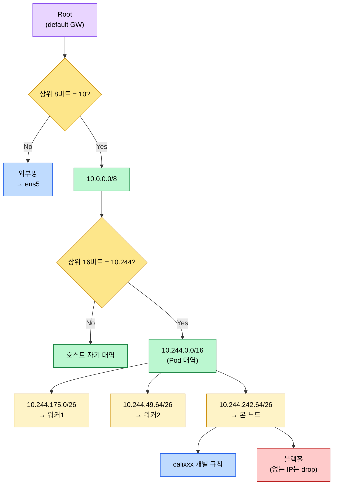
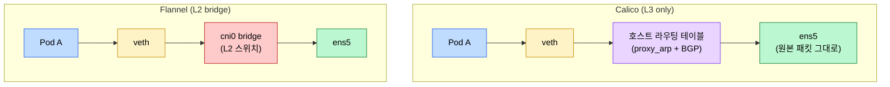

# K8s 패킷 여정 — netfilter·conntrack·라우팅

---
> 같은 메커니즘을 Linux 일반 관점이 아닌 Kubernetes 관점으로 따라가는 노트입니다. 클러스터 IP가 실제 Pod IP로 바뀌는 순간, Pod 사이 통신이 차단되는 순간, 외부로 나가는 SNAT가 일어나는 순간이 모두 커널 특정 훅에서 벌어집니다. 한 패킷이 노드에 들어와서 나갈 때까지 어느 훅을 지나고 어떤 장부에 기록되는지, 어디서 막히면 어떤 명령으로 잡는지를 정리합니다.


## 학습 목표

> netfilter 5훅을 머릿속 지도로 가지고, 장애 증상에서 곧장 점검 명령으로 내려갈 수 있게 합니다.

이 문서에서 확인할 목표는 다음과 같습니다.

1. 패킷이 노드 커널에 진입한 뒤 통과하는 5개 netfilter 훅의 순서를 그릴 수 있습니다.
2. iptables 명령과 netfilter 엔진이 사용자 공간과 커널 공간으로 분리된 이유를 설명할 수 있습니다.
3. conntrack 장부가 양방향으로 기록되는 의미와 UDP stream 120초 함정을 진단할 수 있습니다.
4. FIB 트리가 라우팅 결정을 어떻게 가속하며, 블랙홀 안전망이 왜 필요한지 설명할 수 있습니다.
5. Flannel과 Calico의 설계 철학 차이를 한 줄로 비교하고, RP filter가 정상 패킷을 떨어뜨리는 시나리오를 인식할 수 있습니다.


## 1. 외부 네트워크와 5개 netfilter 훅

> 호스트 커널 입장에서 "외부"는 물리 NIC만이 아니라 네트워크 네임스페이스 경계를 넘는 모든 트래픽입니다.

리눅스 커널 안에서 네트워크 패킷은 다섯 개의 검사 지점을 반드시 거치고, 이 지점을 netfilter 훅이라 부릅니다. Kubernetes의 Service, kube-proxy, NAT, CNI, NetworkPolicy도 전부 이 훅 위에서 동작하기 때문에 K8s 네트워크 디버깅의 출발점은 결국 어느 훅에서 무슨 일이 벌어졌는지를 따지는 일입니다.

### 1.1 외부의 정의

호스트 커널이 바라보는 "외부 inbound"는 두 갈래입니다. 하나는 물리 NIC `ens5`로 들어오는 표준 경로이고, 다른 하나는 같은 노드 안 Pod가 자기 veth(`calixxx`)를 거쳐 호스트 네임스페이스로 진입하는 경로입니다. Pod는 호스트와 격리된 자기만의 네트워크 네임스페이스를 가지므로, 호스트 커널 입장에서는 Pod에서 온 패킷도 명백한 외부 트래픽입니다. 이 개념이 흐릿하면 같은 노드 안 Pod 사이 통신에 왜 Service 가상 주소 변환이 그대로 적용되는지 이해할 수 없습니다.

### 1.2 다섯 훅의 흐름



PREROUTING은 라우팅 결정 이전에 패킷이 처음 닿는 문지기 자리이고, 이 위치 덕분에 목적지 주소를 바꾸는 DNAT가 자연스럽게 이 훅에 붙습니다. 라우팅 결정 후 패킷이 "내 노드 행"으로 분류되면 INPUT으로, "다른 노드/Pod 행"으로 분류되면 FORWARD로 갈라집니다. INPUT 훅에서는 외부 접근을 통제하는 인바운드 방화벽 검사가 주로 일어나고, 허가된 정책을 통과한 패킷만 사용자 프로세스 소켓에 전달됩니다.

응답 패킷이나 노드가 직접 시작한 outbound 트래픽은 OUTPUT 훅을 지나 POSTROUTING으로 모이며, 마지막에 SNAT가 출발지 주소를 호스트의 물리 주소로 바꿉니다. 결국 DNAT(목적지 변환)는 PREROUTING에, SNAT(출발지 변환)는 POSTROUTING에 자리잡는 이유는 단순합니다. 변환을 라우팅 전에 끝내야 다음 hop을 옳게 고를 수 있고, 송출 직전에 출발지를 바꿔야 외부망에서 응답이 돌아올 길을 확보합니다.

### 1.3 FORWARD 훅과 ip_forward 스위치

다른 노드나 Pod로 전달해야 할 패킷은 사용자 공간을 거치지 않고 커널 메모리 단에서 옆 NIC로 곧바로 토스됩니다. 이 고속 중계 파이프라인이 FORWARD 훅이고, NetworkPolicy도 여기서 패킷을 검사해 허용·차단을 결정합니다. 단, 커널 파라미터 `net.ipv4.ip_forward`가 1이어야 FORWARD가 활성화됩니다. 0으로 떨어지면 노드 자체가 패킷 전달을 거부하므로 Pod 사이 통신이 통째로 끊깁니다. 클러스터 전체 통신 단절을 진단할 때 가장 먼저 확인할 한 줄입니다.


## 2. iptables ↔ netfilter 분리 구조

> iptables는 규칙을 등록하는 인터페이스이고, 실제로 패킷을 처리하는 엔진은 커널 안 netfilter입니다.

### 2.1 두 영역의 책임 분리



사용자가 터미널에서 `iptables -A` 또는 `iptables -L`을 치는 자리가 user space이고, 이 명령을 받는 프로그램이 iptables 바이너리입니다. 중요한 점은 iptables가 패킷을 직접 만지지 않는다는 것입니다. 규칙을 등록·조회하는 인터페이스 역할만 수행하고, 받은 규칙 데이터는 netlink 채널을 통해 즉시 커널 안 netfilter로 내려갑니다. 규칙이 커널에 등록되기 전까지는 어떤 패킷에도 영향을 주지 않으므로, "명령 실행 = 규칙 활성화"라는 시점만 명확히 잡으면 됩니다.

### 2.2 kube-proxy의 정체

이 분리 구조의 가장 큰 함의는 kube-proxy입니다. kube-proxy는 특별한 컴포넌트가 아니라 iptables 명령을 호출해 netfilter 규칙을 등록하는 평범한 사용자 공간 프로그램입니다. Pod가 새로 뜨거나 사라질 때마다 kube-proxy가 규칙을 갱신하고, 실제 패킷 처리는 모든 노드의 커널 netfilter가 담당합니다. 이 분업 구조가 K8s 네트워킹의 뼈대입니다.

kube-proxy는 세 가지 모드를 지원하며, 호환성 때문에 현재도 iptables 모드가 기본값입니다. IPVS 모드는 대규모 서비스에서 규칙 평가 비용을 낮추고, nftables 모드는 새로 등장한 후속 표준입니다.

### 2.3 다섯 테이블과 세 체인 점프

netfilter는 규칙을 목적별로 다섯 테이블(`filter`, `nat`, `mangle`, `raw`, `security`)에 나눠 담는데, 실무에서 손댈 일은 `filter`와 `nat`에 집중됩니다. 통과·차단 결정과 주소 변환을 한 묶음에 섞으면 패킷당 평가해야 할 규칙이 비효율적으로 늘기 때문에, 처리 목적에 따라 분리해 둔 설계입니다. K8s NetworkPolicy는 `filter` 테이블에, ClusterIP의 가상 IP 로드밸런싱은 `nat` 테이블에 반영됩니다.

`nat` 테이블 위에 kube-proxy가 만들어 둔 체인 묶음은 세 단계로 점프합니다. `KUBE-SERVICES`가 가상 IP를 보고 Service별 `KUBE-SVC-*`로 분기하고, `KUBE-SVC-*`는 statistic random 모드로 백엔드 중 하나의 `KUBE-SEP-*`를 고르고, 마지막 `KUBE-SEP-*`에서 실제 DNAT가 일어나 목적지 IP가 Pod IP로 바뀝니다. Service는 별도 데몬이 아니라 이 세 체인 묶음의 실체일 뿐입니다.


## 3. conntrack 장부와 UDP TTL

> DNAT가 한 변환을 응답 패킷에서 되돌리려면 변환 사실을 기록한 장부가 필요하고, 그 장부가 conntrack입니다.

### 3.1 양방향 기록의 의미

DNAT는 목적지를 가상 IP에서 실제 Pod IP로 덮어쓰지만, 백엔드 Pod가 응답을 보낼 때 출발지를 다시 원래 가상 IP로 역변환해 줘야 클라이언트가 자기가 보낸 곳에서 답이 왔다고 인식합니다. 이 역변환의 근거가 conntrack 테이블이고, 한 항목은 무조건 두 방향으로 기록됩니다.



`conntrack -L` 출력의 한 줄을 잘 보면 src와 dst가 두 번 등장합니다. 한쪽은 정방향, 다른 쪽은 역방향이고, 양쪽이 같이 적혀 있어야 응답 패킷이 돌아왔을 때 커널이 이 장부만 보고 자동으로 원래 주소를 복원할 수 있습니다.

### 3.2 UDP의 두 가지 타임아웃

TCP는 FIN/RST 같은 종료 신호로 conntrack 항목을 빠르게 정리하지만, UDP는 종료 신호가 없어서 타이머가 0에 닿을 때까지 항목이 살아남습니다. UDP 기본 수명은 두 가지로 나뉩니다. 한쪽 방향 패킷만 봤거나 짧은 흐름이면 30초 후 사라지고(`nf_conntrack_udp_timeout`), 양방향 패킷이 모두 확인되어 `ASSURED` 플래그가 붙으면 stream 수명 120초(`nf_conntrack_udp_timeout_stream`)로 연장됩니다.

### 3.3 Cisco DNS 무한 타임아웃 사례

Cisco 실무 사례에서 일부 DNS 요청이 간헐적으로 사라지는 증상이 보고됐고, 원인은 conntrack의 stream 120초 갱신 로직이었습니다. 같은 출발지·포트로 30초 간격마다 패킷이 도착하면 stream TTL이 매번 120초로 재설정되어 항목이 영원히 사라지지 않습니다. 항목이 살아 있으니 새 흐름이라도 옛 매핑을 따라가 엉뚱한 백엔드로 향하거나 매핑 충돌로 drop이 발생합니다. iptables 규칙을 아무리 들여다봐도 증상이 잡히지 않는 이유는 문제가 규칙이 아니라 그 위의 conntrack에 있기 때문입니다.

이런 증상은 `dmesg | grep -i conntrack`로 커널 로그에서 테이블 포화 메시지와 drop 카운터를 확인하는 것이 첫 단추입니다. 평소엔 비어 있어야 정상이고, 카운터가 증가하면 `nf_conntrack_max` 상향이나 stream 타임아웃 조정을 검토합니다.


## 4. 라우팅 테이블·FIB·블랙홀

> DNAT으로 목적지 IP가 바뀐 뒤에도 "이 IP로 가려면 어느 인터페이스로 내보내야 하는가"를 매번 결정해야 하고, 그 결정이 라우팅입니다.

### 4.1 세 가지 시나리오

운영 관점에서 라우팅 결정은 세 시나리오로 압축됩니다. 첫째, 외부망으로 나가는 경우는 default 게이트웨이 규칙을 타고 물리 NIC `ens5`로 빠집니다. 둘째, 다른 노드의 Pod로 가는 경우는 그 Pod IP가 속한 노드의 물리 IP를 next hop으로 잡고 직접 던집니다. 셋째, 같은 노드 안 Pod로 가는 경우는 그 Pod와 연결된 개별 `calixxx` 인터페이스 규칙으로 내려갑니다.

Calico 환경에서 두 번째 시나리오가 특히 흥미롭습니다. Calico는 노드간 라우팅 테이블을 동기화해 두기 때문에, VXLAN 같은 무거운 캡슐화 없이 원본 패킷 그대로 옆 노드로 토스합니다. `ip route` 출력에서 `proto 80`으로 표시되는 줄이 Calico의 BGP 데몬이 만든 규칙이라는 뜻입니다.

### 4.2 블랙홀 안전망

`10.244.242.64/26` 같은 자기 노드 Pod 대역에 속하지만, 직전에 스케일인으로 사라져 `calixxx` 인터페이스가 없는 IP로 패킷이 들어오면 어떻게 될까요. 가장 구체적인 개별 규칙을 못 찾았으니 윗단의 `/26` 블랙홀 규칙으로 매칭되어 즉시 폐기됩니다. 이 안전망이 없다면 패킷이 default 게이트웨이로 빠져 옆 노드로 나가고, 옆 노드 라우팅 테이블도 같은 대역이라 다시 원래 노드로 돌려보내는 라우팅 루프가 발생합니다. 클러스터 전체 네트워크 대역폭을 마비시킬 수 있는 시나리오이므로 블랙홀 한 줄이 운영 안정성의 핵심입니다.

### 4.3 FIB 트리와 LPM

`ip route`로 보이는 텍스트 표는 사람을 위한 표시일 뿐이고, 커널은 이 규칙을 비트 단위 최적화 트리인 FIB(Forwarding Information Base)로 컴파일해 보관합니다. 운영 환경에서는 Pod가 스케일 아웃·인할 때마다 라우팅 규칙이 수천 개 단위로 동적 변동하는데, 텍스트 표를 순차 검색하면 패킷이 몰릴 때 CPU 병목이 생깁니다. FIB 트리는 Longest Prefix Match(LPM) 알고리즘으로 평균 네다섯 번의 비트 비교만 거치면 결정이 끝나므로, 규칙이 수천 개여도 나노초 단위 일정한 탐색 속도를 보장합니다.



CNI가 노드 하나의 라우팅 테이블에 수천 규칙을 부담 없이 박을 수 있는 근거가 이 트리 구조입니다. 운영 중 패킷이 어디로 빠질지 미리 확인하고 싶다면 `ip route get <IP>`로 커널 자체의 결정을 묻는 것이 가장 빠릅니다.


## 5. CNI(Flannel/Calico)와 핸즈온 실습

> Flannel은 거대한 가상 스위치 한 장으로 묶는 직관적 방식, Calico는 가상 스위치를 빼고 인터넷이 동작하듯 순수 L3 라우팅으로 처리하는 방식입니다.

### 5.1 두 CNI의 설계 철학



Flannel은 `cni0` 가상 브리지를 노드마다 두고 같은 노드 Pod를 묶는 익숙한 L2 구조이지만, 모든 패킷이 브리지를 거치며 연산 오버헤드가 생깁니다. Calico는 브리지 없이 Pod에서 출발한 패킷이 veth를 타자마자 proxy ARP를 통해 호스트 메인 라우팅 테이블에 즉시 편입됩니다. 같은 노드 Pod로 가든, 다른 노드 Pod로 가든 일관된 고속 경로를 거치는 것이 Calico의 장점입니다.

Calico에서 노드간 통신 시 VXLAN 같은 추가 캡슐화가 없다는 점이 운영상 중요합니다. 외부 포장이 없으니 네트워크 오버헤드가 거의 0에 가깝고, Pod가 만든 원본 패킷 그대로 다른 노드 NIC로 들어가 같은 패턴으로 타겟 Pod에 꽂힙니다.

### 5.2 proxy ARP의 역할

Pod 안에서 `ip route`를 보면 기본 게이트웨이가 `169.254.1.1`이라는 고정 가상 주소로 잡혀 있습니다. Pod가 이 게이트웨이의 MAC을 ARP로 묻는 순간 호스트의 `calixxx` 인터페이스가 자기 MAC으로 대신 응답하고, 이 동작이 proxy ARP입니다. 인터페이스의 `proxy_arp` 값이 1이어야 하고, 0이면 Pod 트래픽이 호스트 라우팅 테이블로 진입하지 못해 통신이 끊깁니다. Calico 환경 통신 장애에서 가장 먼저 점검할 한 값입니다.

### 5.3 RP filter 함정

RP(Reverse Path) filter는 들어온 인터페이스와 응답이 나갈 인터페이스가 같은지 검사해 스푸핑을 막는 보안 기능입니다. 값은 0(검증 안 함), 1(strict, 정확히 같아야 통과), 2(loose, 어디로든 응답 라우팅만 가능하면 통과) 세 가지가 있습니다. K8s는 라우팅 경로가 비대칭으로 흐르기 쉬워 strict 모드면 정상 패킷도 drop되므로, 기본값은 2(loose)로 둡니다.

증상은 미묘합니다. `tcpdump`로 노드 호스트에서 보면 패킷이 들어온 게 잡히는데 정작 Pod 안에는 도착하지 않습니다. `nstat | grep -i drop` 또는 `/proc/net/netstat`에서 drop 카운터가 트래픽 발생 시마다 늘어난다면 RP filter를 의심하고, 영향받는 인터페이스의 `rp_filter` 값을 1에서 2로 푸는 것이 해결책입니다.

### 5.4 핸즈온 9스텝 흐름

```mermaid
flowchart LR
    S1["1. Pod 배포<br/>ip route → 169.254.1.1"] --> S2["2. ip link<br/>calixxx 개수 = Pod 수"]
    S2 --> S3["3. iptables nat L<br/>KUBE-SERVICES"]
    S3 --> S4["4. KUBE-SVC<br/>random 0.5"]
    S4 --> S5["5. KUBE-SEP<br/>DNAT 적용"]
    S5 --> S6["6. conntrack L<br/>ASSURED 확인"]
    S6 --> S7["7. ip route get<br/>next hop 예측"]
    S7 --> S8["8. ip neigh<br/>ARP 캐시"]
    S8 --> S9["9. traceroute<br/>실측 검증"]

    style S1 fill:#bfdbfe,stroke:#2563eb,color:#000
    style S2 fill:#bfdbfe,stroke:#2563eb,color:#000
    style S3 fill:#fde68a,stroke:#ca8a04,color:#000
    style S4 fill:#fde68a,stroke:#ca8a04,color:#000
    style S5 fill:#fde68a,stroke:#ca8a04,color:#000
    style S6 fill:#e9d5ff,stroke:#7c3aed,color:#000
    style S7 fill:#bbf7d0,stroke:#15803d,color:#000
    style S8 fill:#bbf7d0,stroke:#15803d,color:#000
    style S9 fill:#fecaca,stroke:#b91c1c,color:#000
```



스텝별 명령과 확인 포인트는 다음과 같습니다.

```bash
# 1. Pod 안에서 게이트웨이 확인 (169.254.1.1)
kubectl exec -it probe -- ip route

# 2. 워커노드에서 calixxx 인터페이스 개수 확인
#    (호스트 네트워크가 아닌 Pod 수와 일치해야 함)
ip link | grep cali

# 3. KUBE-SERVICES에서 가상 IP가 어디로 점프하는지
iptables -t nat -L KUBE-SERVICES -n | grep 10.96.0.10

# 4. KUBE-SVC-* 의 random LB 확인 (statistic mode random probability 0.5)
SVC=$(iptables -t nat -L KUBE-SERVICES -n | grep 10.96.0.10 | awk '{print $1}')
iptables -t nat -L "$SVC" -n

# 5. KUBE-SEP-* 의 DNAT 규칙 (실제 Pod IP로 변환)
SEP=$(iptables -t nat -L "$SVC" -n | grep KUBE-SEP | head -1 | awk '{print $1}')
iptables -t nat -L "$SEP" -n

# 6. conntrack 장부 확인 (ASSURED 플래그, UDP 30/120초)
conntrack -L | head -5
cat /proc/sys/net/netfilter/nf_conntrack_udp_timeout
cat /proc/sys/net/netfilter/nf_conntrack_udp_timeout_stream

# 7. 어느 next hop과 인터페이스로 보낼지 커널에 물어보기
ip route get 10.244.242.66

# 8. ARP 캐시 상태 (REACHABLE 또는 PERMANENT)
ip neigh

# 9. 예측한 경로가 실제 그대로인지 traceroute로 검증
traceroute 10.244.242.66
```

핸즈온 8번에서 Calico의 VXLAN 항목은 일반 ARP와 달리 `PERMANENT`로 표시됩니다. 일반 ARP 캐시는 시간이 지나면 만료되지만, Calico는 노드간 통신이 ARP 타임아웃으로 끊기는 사고를 막기 위해 타 노드 Pod 대역의 next hop을 강제로 PERMANENT 항목으로 주입합니다. 핑 로스 장애에서 1순위로 살펴볼 값입니다.

### 5.5 실무 장애 두 시나리오

운영 중 가장 자주 마주치는 두 패턴은 다음과 같이 갈래를 잡습니다.

| 증상 | 의심 영역 | 점검 명령 | 판정 |
|------|----------|----------|------|
| ClusterIP 접속 타임아웃 | PREROUTING의 nat 규칙 (kube-proxy 미반영) | `iptables -t nat -L KUBE-SERVICES \| grep <vip>` | 규칙 없으면 kube-proxy 이슈, 규칙 있는데 `KUBE-SEP` 비면 엔드포인트 부재 |
| 일부 요청만 간헐적 사라짐 | conntrack stream TTL 갱신 함정 | `dmesg \| grep -i conntrack`, `conntrack -S` | drop·invalid 카운터 증가면 테이블 포화 또는 stream 무한 갱신 |

전자는 규칙 평가 계층의 문제이고, 후자는 그 위 상태 추적 계층의 문제입니다. 두 계층을 머릿속에서 구분해 두면 증상에서 곧장 점검 명령으로 내려갈 수 있습니다.


## 관련 문서

- [01-01.네트워킹 기초](./01-01.네트워킹%20기초.md) — Linux 일반 메커니즘 SSOT(netns·veth·bridge·conntrack·eBPF). 본 문서는 그 메커니즘을 K8s 시각으로 따라간 사례 노트입니다.
- [04-02.Pod 네트워크와 Linux 기반](../../08_cloud/kubernetes/02-02.Pod%20네트워크와%20Linux%20기반.md) — Pod 네트워킹의 상위 추상
- [04-03.오버레이와 노드 간 트래픽](../../08_cloud/kubernetes/02-03.오버레이와%20노드%20간%20트래픽.md) — Flannel/Calico 비교의 K8s 측 시각
