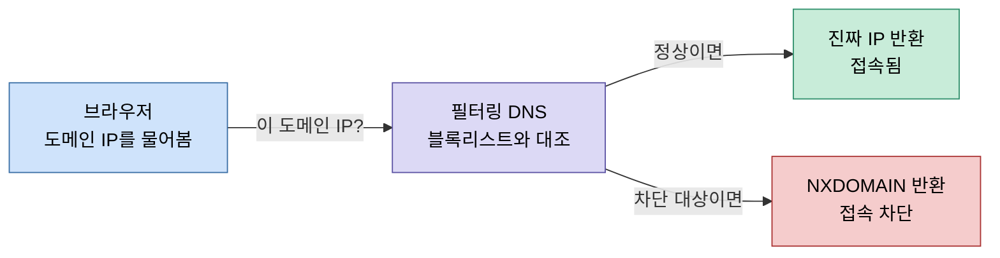

# DNS 필터링 차단
---
> 콘텐츠 차단 도구가 어떻게 특정 사이트를 막는지 계층별로 짚어 봅니다. 백엔드에서 서비스 디스커버리나 내부 도메인을 resolve할 때 보는 그 DNS가, 차단이라는 목적 앞에서는 "주소록 단계에서 거짓말하기"로 바뀝니다.

DNS 차단의 본질은 의외로 단순합니다. 사이트 서버를 공격하거나 패킷을 가로채는 게 아니라, 도메인을 IP로 바꿔 주는 주소록 단계에서 일부러 틀린 답을 주는 것입니다. 실제 서버는 멀쩡히 살아 있지만 브라우저가 가는 길의 주소를 못 찾게 만드는 셈입니다. 이 문서는 그 메커니즘을 DNS 기본부터 우회 마찰까지 일곱 단계로 풀어냅니다.

## 학습 목표

- DNS 차단이 왜 "서버 차단"이 아니라 "이름 해석 단계의 거짓말"인지 설명할 수 있습니다.
- NXDOMAIN 응답과 앱 기반 차단(OS 후킹)의 차이를 구분할 수 있습니다.
- DoH/DoT가 프라이버시 도구이면서 동시에 차단 우회 수단이 되는 이유를 이해합니다.
- 라우터 설정과 기기 설정이 적용 범위·우회 마찰에서 어떻게 갈리는지 판단할 수 있습니다.

## 1. DNS 기본 — 도메인을 IP로 바꾸는 주소록

브라우저는 `example.com` 같은 도메인 이름만으로는 통신하지 못합니다. 실제 통신은 IP 주소(예: `93.184.216.34`)로 이뤄지기 때문에, 접속 전에 반드시 "이 도메인의 IP가 뭐야?"를 누군가에게 물어봐야 합니다. 이 질문을 받아 답해 주는 주체가 DNS 리졸버(resolver)입니다.

백엔드 개발자에게는 낯선 과정이 아닙니다. 서비스 디스커버리에서 서비스 이름을 실제 엔드포인트로 풀거나, K8s 안에서 `my-service.default.svc.cluster.local`을 ClusterIP로 해석하는 과정과 본질이 같습니다. 평소 일반 사용자 환경에서는 ISP(통신사)가 운영하는 DNS가 이 답을 돌려줍니다.

핵심은 이 단계가 **모든 접속의 길목**이라는 점입니다. 어떤 사이트에 접속하든 IP를 먼저 알아야 하므로, 이 주소록을 장악하면 접속 자체를 통제할 수 있습니다. 차단 도구가 노리는 지점이 바로 여기입니다.

## 2. 차단의 본질 — NXDOMAIN, 주소록 단계의 거짓말

필터링 DNS(AdGuard, CleanBrowsing 등)는 들어온 도메인을 자기들의 블록리스트와 대조합니다. 정상 도메인이면 진짜 IP를 돌려주고, 차단 대상이면 진짜 IP 대신 "그런 도메인 없음"이라는 뜻의 **NXDOMAIN**(Non-Existent Domain) 응답이나 막힌 IP를 돌려줍니다. 그러면 브라우저는 갈 곳을 못 찾아 접속에 실패합니다. 차단 사이트의 서버는 그대로 살아 있지만, 가는 길의 주소록에서 그 항목을 지워 버린 것입니다.

전체 흐름을 그림으로 보면 분기 구조가 한눈에 들어옵니다.

이 방식이 앱 기반 차단과 결정적으로 갈리는 지점이 있습니다. BlockerX 같은 차단 앱은 OS 안에서 콘텐츠를 가로채 막습니다. 그래서 앱을 지우거나 권한을 끄면 우회됩니다. 반면 DNS 방식은 네트워크의 이름 해석 단계에서 막기 때문에, 어떤 브라우저를 쓰든 같은 DNS를 거치는 한 일괄 적용됩니다. 차단 지점이 OS 위쪽(앱)이냐 네트워크 길목(이름 해석)이냐의 차이입니다.

## 3. 카테고리 블록리스트 — 수백만 도메인 일괄 분류

차단할 사이트를 일일이 등록할 필요가 없는 이유가 여기 있습니다. 필터링 DNS는 수백만 개 도메인을 미리 카테고리(adult, malware, gambling 등)로 분류해 둔 거대한 블록리스트를 갖고 있습니다. 이 목록은 Hagezi, StevenBlack 같은 공개 데이터베이스를 기반으로 유지됩니다.

사용자는 "adult 카테고리 켜기" 같은 스위치 하나만 누르면 됩니다. 그러면 그 카테고리에 묶인 수백만 도메인이 한꺼번에 차단됩니다. 개별 사이트를 알 필요도, 새로 생기는 사이트를 따라잡을 필요도 없습니다. 블록리스트 관리자가 분류를 갱신하면 그 결과가 자동으로 반영되기 때문입니다. 이 카테고리 일괄 처리가 DNS 차단을 "가볍지만 광범위한" 도구로 만드는 핵심입니다.

## 4. Safe Search 강제 — forcesafesearch DNS 트릭

사이트를 막아도 구멍이 하나 남습니다. 검색 엔진입니다. 구글이나 유튜브 검색으로 성인 이미지가 그대로 뜨면 사이트 차단의 의미가 줄어듭니다. 그래서 일부 필터링 DNS는 "Family protection" 같은 모드에서 검색 엔진의 Safe Search를 강제합니다.

원리는 또 한 번의 DNS 트릭입니다. `google.com`을 물으면 평범한 구글 IP 대신 `forcesafesearch.google.com`이 가리키는 안전검색 전용 IP로 매핑해 버립니다. 구글 쪽에서 이 전용 호스트로 들어온 요청은 항상 Safe Search가 켜진 상태로 응답하도록 만들어 두었기 때문에, 사용자가 검색 설정을 어떻게 바꾸든 안전검색이 적용됩니다. 검색 엔진이 콘텐츠 유입 경로라는 점을 고려하면 중요한 보완책입니다. 다만 이 기능의 완성도는 제공자별 편차가 큽니다. 어떤 제공자는 주요 검색 엔진을 대부분 강제하는 반면, 어떤 제공자는 사실상 동작하지 않습니다.

## 5. 암호화 DNS (DoH/DoT) — 양날의 검

이 부분이 백엔드 관점에서 가장 흥미롭습니다. 원래 DNS 질의는 평문으로 UDP 53번 포트를 통해 오갑니다. 누구나 엿보거나 가로챌 수 있다는 뜻입니다. 이 약점을 막으려고 나온 것이 **DoH**(DNS over HTTPS)와 **DoT**(DNS over TLS)입니다. 이름 그대로 DNS 질의를 암호화해서 보냅니다. DoH는 HTTPS(443) 위에 실어 일반 웹 트래픽과 구분이 어렵게 만들고, DoT는 전용 TLS 연결(853)을 씁니다.

문제는 이 암호화가 차단 우회의 핵심이기도 하다는 점입니다. 크롬·파이어폭스 같은 브라우저는 자체 DoH 기능을 내장하고 있습니다. 이게 켜져 있으면 브라우저는 OS의 시스템 DNS 설정을 무시하고, 자기가 직접 암호화된 질의를 자신이 지정한 다른 DNS로 보냅니다. PC에 필터링 DNS를 걸어 놓아도 브라우저 DoH가 켜져 있으면 그 필터를 그냥 통과하는 셈입니다. 그래서 DNS 차단을 제대로 쓰려면 브라우저의 DoH를 꺼야 한다는 조건이 따라붙습니다. 프라이버시를 위한 기능이 동시에 부모 통제나 콘텐츠 필터를 무력화하는 도구가 되는, 전형적인 양날의 검입니다.

## 6. 적용 범위 — 라우터 vs 기기 설정

마지막 계층은 DNS를 어디에 설정하느냐입니다. 설정 위치에 따라 적용 범위와 우회 난이도가 갈립니다.

기기(PC)에만 설정하면 그 기기 하나만 필터링됩니다. 그리고 사용자가 마음먹으면 설정을 직접 되돌릴 수 있습니다. 반면 라우터에 설정하면 홈 와이파이에 연결된 모든 기기(폰, 태블릿, 콘솔, 스마트TV 등)가 자동으로 같은 필터를 거칩니다. 게다가 라우터 관리 화면에 들어가 설정을 바꾸려면 한 단계를 더 거쳐야 하므로 우회 마찰이 커집니다. 차단의 목적이 "물리적 봉쇄"가 아니라 "충동적 접근을 어렵게 만드는 것"이라면, 이 마찰 차이가 실질적인 효과를 좌우합니다.

## 7. 트레이드오프 정리 — "충동 마찰" 도구의 한계

DNS 차단의 트레이드오프는 명확합니다. 네트워크의 이름 해석 단계에서 막기 때문에 가볍고(앱 설치가 필요 없음), 광범위하며(전 기기 적용 가능), 무료 티어로도 쓸 수 있습니다. 그 대가로 우회 경로도 분명합니다. 사용자가 DNS 주소를 직접 바꾸거나, 브라우저 DoH를 켜거나, VPN을 쓰면 필터를 그대로 빠져나갑니다.

그래서 DNS 차단은 "결심한 우회"는 막지 못하고 "충동적 접근"의 마찰을 높이는 도구로 보는 편이 정확합니다. 작정하고 뚫으려는 사람 앞에서는 무력하지만, 순간의 충동을 막는 데는 충분히 유효합니다. 도구의 한계를 한계로 인정하고, 그 한계 안에서 무엇을 얻으려는지를 분명히 하는 것이 이 기술을 제대로 쓰는 방법입니다.

## 다음 단계

- DoH가 시스템 DNS를 우회하는 과정을 패킷 수준에서 추적해 보면 좋습니다. HTTPS(443)에 실린 DNS 질의가 일반 웹 트래픽과 어떻게 섞여 구분이 어려워지는지 확인할 수 있습니다.
- NXDOMAIN 응답과 차단 IP 리다이렉트(sinkhole)의 차이를 비교하면, 차단 페이지를 보여 줄지 조용히 실패시킬지의 설계 선택을 이해하게 됩니다.

## 관련 문서

- 이웃: [네트워킹 기초](./01-01.네트워킹%20기초.md) — DNS 이름 해석이 올라타는 Linux 네트워크 스택(netns·conntrack)의 하부 구조
