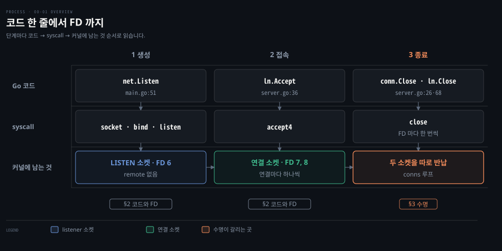
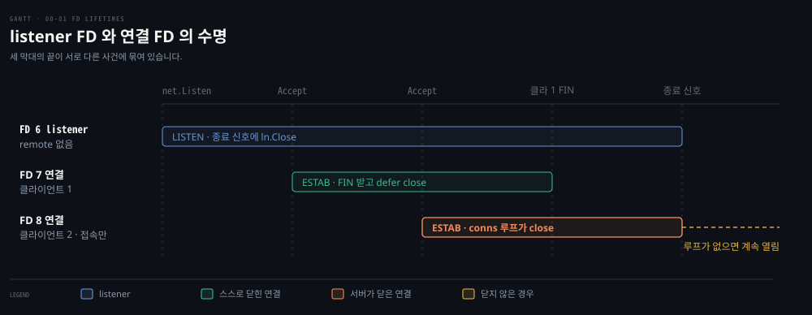

# listener 소켓과 연결 소켓

---

> gonet-lab Phase 0 의 두 질문, `net.Listen` 아래에서 무엇이 생기는가와 listener 소켓과 연결 소켓이 어떻게 다른가를 이 랩의 코드 위에서 답합니다. 개념 설명은 기존 노트 링크로 넘기고 여기서는 코드 줄마다 생기는 FD 와 두 소켓의 수명이 갈리는 자리를 다룹니다.

## 학습 목표와 범위

> 이 문서를 읽고 나면 gonet 서버의 `ss` 출력 세 줄을 보고 각 줄이 어느 코드 줄과 어느 syscall 에서 생겼고 언제 닫히는지 짚을 수 있어야 합니다.

| 목표 | 어떻게 확인하나 |
|---|---|
| `net.Listen` 한 줄이 Linux 에서 `socket` → `bind` → `listen` 으로 풀리고, 그 결과가 LISTEN 소켓 하나와 FD 하나라는 것을 설명합니다 | Phase 4 에서 도움 없이 답합니다 |
| listener 소켓과 연결 소켓을 세 축으로 비교합니다. remote 가 비었는가, 어느 syscall 이 FD 를 주는가, 언제 닫히는가입니다 | Phase 3 의 `ss`·`strace` 출력을 이 세 축으로 읽습니다 |
| 종료할 때 listener 와 별도로 열린 접속을 하나씩 닫아야 하는 이유를 예측합니다 | Phase 3 에서 접속만 걸어 둔 클라이언트를 붙인 채 서버를 끕니다 |

다루지 않는 것은 goroutine 이 `Accept` 에서 기다리는 동안 Go 런타임과 epoll 이 무엇을 하는가(랩 Phase 1 이후), SYN 큐와 accept 큐가 넘칠 때의 동작, TIME_WAIT, `SO_REUSEPORT` 입니다. 앞의 둘은 §1 의 기존 노트가 이미 설명합니다.

| 키워드 | 뜻 | 학습 포인트·연결 개념 | 어디서 |
|---|---|---|---|
| 4-tuple | 출발지 IP·포트와 목적지 IP·포트 네 값 | 커널이 세그먼트를 보낼 연결 소켓을 고르는 열쇠 | §1 |
| local·remote | 소켓 기준의 자기 주소와 상대 주소 | 패킷 기준의 출발지·목적지와 섞지 않음 | §1 |
| FD (file descriptor) | 프로세스가 커널 객체를 가리키는 작은 정수 | 비어 있는 가장 작은 번호가 재사용됨 | §2 |
| `accept4` | 플래그를 함께 받는 Linux 의 accept | Go 의 `Accept` 가 부르는 syscall · 연결마다 새 FD | §2 |
| listener 소켓 | `net.Listen` 이 만든 LISTEN 상태 소켓 | remote 가 비어 있음 · FD 한 번 생성 | §2 |
| 연결 소켓 | `Accept` 가 FD 를 붙여 돌려준 ESTAB 소켓 | local 은 listener 와 같고 remote 는 클라이언트 | §2 |
| `conns` 루프 | 종료 시 열린 접속을 하나씩 닫는 `server.go` 코드 | listener 를 닫아도 연결 소켓은 안 닫힘 | §3 |
| half-close (`CloseWrite`) | 쓰기 방향만 닫고 FIN 을 보내는 것 | 클라이언트가 먼저 끝내는 접속의 종료 경로 | §3 |

아래는 이 문서 전체를 FD 가 생기고 닫히는 순서로 이은 지도입니다. 열마다 Go 코드, 그 아래 syscall, 커널에 남는 것을 같은 자리에 두었고 맨 아래 칩이 그 단계를 다루는 절입니다.



생성과 접속 단계는 §2 의 표 한 장에 모여 있습니다. 종료 단계만 §3 으로 따로 떼었는데, 두 소켓의 수명이 갈리는 곳이 여기이기 때문입니다.


## 1. 개념은 기존 노트 세 편에 있습니다

> 두 소켓의 구분, syscall 순서, 대기열은 이미 다른 노트가 설명했으므로 여기서는 요지만 적고 읽을 절을 가리킵니다.

이 문서는 아래 개념을 안다고 보고 씁니다. 처음이면 표의 오른쪽 칸이 가리키는 절을 먼저 읽는 편이 빠릅니다.

| 개념 | 요지 | 읽을 곳 |
|---|---|---|
| 4-tuple 과 두 소켓 | 커널은 들어온 세그먼트를 (출발지 IP·포트, 목적지 IP·포트) 네 값이 맞는 연결 소켓으로 먼저 보냅니다. 맞는 것이 없을 때만 목적지 두 값만 맞춰 listener 로 보냅니다. 그래서 listener 가 받는 것은 연결마다 첫 SYN 하나뿐입니다 | [cntd 03-01](../../book/cntd_computer-networking-top-down/03-01.%ED%8A%B8%EB%9E%9C%EC%8A%A4%ED%8F%AC%ED%8A%B8%EB%8A%94%20%EB%AC%B4%EC%97%87%EC%9D%84%20%EB%8D%94%ED%95%98%EB%8A%94%EA%B0%80.md) §4 「듣는 소켓과 연결된 소켓」·「첫 SYN 만 듣는 소켓으로 갑니다」 |
| `net.Listen` 의 syscall | `socket` 이 FD 를 줍니다. `bind` 는 그 소켓에 local 주소를 붙여 예약하고 `listen` 은 들어오는 연결을 받는 역할과 대기열을 정합니다 | [networking-and-kubernetes 02-01](../../../08_cloud/book/networking-and-kubernetes/02-01.%EC%BB%A4%EB%84%90%EC%9D%B4%20%ED%8C%A8%ED%82%B7%EC%9D%84%20%EC%A3%BC%EA%B3%A0%EB%B0%9B%EB%8A%94%20%EC%9E%90%EB%A6%AC%20%E2%80%94%20%EC%86%8C%EC%BC%93%C2%B7%EC%9D%B8%ED%84%B0%ED%8E%98%EC%9D%B4%EC%8A%A4%C2%B7veth%C2%B7%EB%B8%8C%EB%A6%AC%EC%A7%80.md) §1 「strace 로 들여다보기」·「읽어내기」 |
| accept 큐와 backlog | handshake 는 커널이 끝냅니다. 끝난 연결은 accept 큐에 줄을 섭니다. `listen` 의 backlog 는 그 줄의 길이 상한입니다 | [systems-performance 10-02](../../book/systems-performance/10-02.%EB%84%A4%ED%8A%B8%EC%9B%8C%ED%81%AC%20%E2%80%94%20%EC%95%84%ED%82%A4%ED%85%8D%EC%B2%98.md) §4 「연결 큐가 둘인 까닭」 |
| `ss` 의 Recv-Q·Send-Q | LISTEN 줄에서는 대기열에 선 연결 수와 그 상한입니다. ESTAB 줄에서는 버퍼에 남은 바이트입니다 | [패킷이 사라지는 네 자리](../../../troubleshooting/_concepts/os-%ED%8C%A8%ED%82%B7%EC%9D%B4-%EC%82%AC%EB%9D%BC%EC%A7%80%EB%8A%94-%EB%84%A4-%EC%9E%90%EB%A6%AC.md) 「ss 의 두 컬럼은 상태에 따라 뜻이 바뀝니다」 |

이 랩의 관점에서 한 가지만 덧붙입니다. local 과 remote 는 소켓 기준 이름입니다. 패킷 기준의 출발지·목적지와 섞으면 같은 `127.0.0.1:8080` 이 서버 소켓에서는 local, 클라이언트 소켓에서는 remote 라는 점이 흐려집니다. 아래에서는 소켓 기준으로만 씁니다.


## 2. gonet 코드 줄마다 생기는 syscall 과 FD

> `net.Listen` 은 FD 를 한 번 만들고, `Accept` 는 부를 때마다 FD 를 하나씩 만듭니다. 그래서 서버 프로세스의 소켓 FD 수는 1 + 열린 접속 수입니다.

Go 코드에서는 FD 가 보이지 않습니다. `ln` 과 `conn` 은 Go 값이며 번호는 그 안에 감춰져 있습니다. 그런데 `ss` 나 `lsof` 는 번호로만 보여 줍니다. 관측 결과를 코드로 되짚으려면 어느 줄이 어느 번호를 만드는지를 알아야 합니다.

gonet 의 소켓 관련 줄을 Linux 기준 syscall 과 짝지으면 아래와 같습니다. 표의 syscall 이름과 인자는 go1.25.1 소스에서 확인했습니다.

| 코드 위치 | Linux syscall | 새 FD | 무엇이 생기거나 사라지나 |
|---|---|---|---|
| `main.go:51` `net.Listen("tcp", addr)` | `socket` → `bind` → `listen` | 1개 | LISTEN 상태의 listener 소켓. remote 는 비어 있습니다 |
| `server.go:36` `ln.Accept()` | `accept4` | 부를 때마다 1개 | 대기열에서 꺼낸 연결 소켓. local 은 listener 와 같고 remote 는 클라이언트입니다 |
| `server.go:68` `defer conn.Close()` | `close` | 없음 | 그 연결의 FD 가 반납됩니다 |
| `server.go:26` `ln.Close()` | `close` | 없음 | listener FD 가 반납됩니다. 연결 FD 는 그대로입니다 |
| `client.go:14` `d.DialContext(...)` | `socket` → `connect` | 1개 | 클라이언트 쪽 소켓. local 포트는 커널이 고릅니다 |
| `client.go:39` `tc.CloseWrite()` | `shutdown(SHUT_WR)` | 없음 | 쓰기 방향만 닫고 FIN 을 보냅니다. FD 는 남습니다 |

Go 는 syscall 에 세 가지를 덧붙입니다.

- `socket` 을 부를 때 `SOCK_NONBLOCK|SOCK_CLOEXEC` 를 함께 넘깁니다.[^go-socket]
- `Accept` 는 `accept` 가 아니라 같은 플래그를 받는 `accept4` 를 부릅니다.[^go-accept4]
- backlog 는 코드에 적지 않아도 Go 가 `/proc/sys/net/core/somaxconn` 을 읽어 넘깁니다.[^go-backlog]

논블로킹 플래그가 있는데도 `ln.Accept()` 가 goroutine 을 멈춰 세우는 것은 Go 런타임이 그 사이를 메우기 때문이고 그 이야기는 랩 Phase 1 의 몫입니다. macOS 에는 `accept4` 가 없어 Go 가 다른 경로를 타므로, syscall 이름은 Linux 에서 관측합니다.

FD 번호가 몇이 될지는 코드가 정하지 않습니다. 커널은 새 FD 로 그 프로세스에서 비어 있는 가장 작은 번호를 줍니다.[^socket2] 그래서 접속 순서대로 7, 8 을 받았더라도 7 이 먼저 닫힌 뒤 새 접속이 오면 7 이 다시 쓰입니다. 번호 자체보다 어느 번호가 LISTEN 이고 어느 번호가 ESTAB 인지를 읽어야 하는 이유입니다.


## 3. listener 를 닫아도 연결 소켓은 살아남습니다

> listener 소켓과 연결 소켓은 커널 안에서 별개의 객체라 수명도 따로입니다. listener 만 닫는 종료 코드는 새 접속만 막을 뿐 이미 붙은 접속은 그대로 남깁니다.

### 종료 신호가 Accept 에 닿지 않는 문제

`gonet listen` 을 Ctrl-C 로 끄면 `main.go` 는 그 신호를 `ctx` 취소로 바꿉니다. 문제는 그때 Accept 루프가 `ln.Accept()` 안에서 멈춰 있다는 점입니다. `Accept` 는 `ctx` 를 인자로 받지 않으므로 취소를 알아챌 방법이 없습니다.

`net.Listener` 의 계약이 길을 하나 열어 둡니다. listener 를 닫으면 막혀 있던 `Accept` 가 풀리면서 오류를 돌려줍니다.[^go-listener] `server.go` 는 이 계약을 `context.AfterFunc` 로 이어 `ctx` 가 끝나는 순간 listener 를 닫습니다.

```go
// server.go:25-32 — ctx 가 끝나면 listener 와 열린 접속을 모두 닫는다
stop := context.AfterFunc(ctx, func() {
	ln.Close()
	mu.Lock()
	for c := range conns {
		c.Close()
	}
	mu.Unlock()
})
```

`ln.Close()` 가 불리면 `server.go:36` 의 `Accept` 가 `net.ErrClosed` 로 돌아옵니다. `server.go:39` 는 그것을 정상 종료로 판정합니다. 여기까지가 listener 쪽 이야기입니다.

### 연결 소켓은 따로 닫아야 하는 이유

위 코드는 listener 를 닫고 나서 `conns` 에 등록된 접속을 하나씩 다시 닫습니다. listener 를 닫는 것만으로는 연결 소켓이 닫히지 않기 때문입니다. `accept(2)` 는 새 연결 소켓을 만들어 돌려줄 뿐 원래 소켓에는 영향을 주지 않는다고 적고,[^accept2] 그렇게 태어난 연결 소켓은 자기 FD 를 따로 가집니다. `close` 는 넘긴 FD 하나만 반납하므로, listener FD 를 닫는다고 연결 FD 가 따라 닫히지 않습니다.

이 둘째 루프를 빼면 어떻게 되는지는 접속만 걸어 두고 아무것도 보내지 않는 클라이언트를 떠올리면 보입니다. 그 접속의 핸들러는 `server.go:73` 의 `io.Copy` 에서 읽을 데이터를 기다립니다. listener 가 닫혀도 이 연결 소켓은 멀쩡하므로 `io.Copy` 는 끝나지 않습니다. 결국 `server.go:38` 의 `wg.Wait()` 가 영원히 돌아오지 않고 서버가 꺼지지 않습니다.

반대로 클라이언트가 먼저 끝내는 접속은 이 루프가 필요 없습니다. `gonet connect` 는 stdin 이 끝나면 `CloseWrite` 로 FIN 을 보냅니다. 서버의 `io.Copy` 는 그 FIN 을 EOF 로 받아 끝납니다. 그러면 `server.go:68` 의 `defer conn.Close()` 가 그 FD 를 닫습니다.

아래는 클라이언트 둘이 붙었을 때 세 FD 가 언제 생기고 언제 닫히는지를 시간 막대로 그린 도식입니다. FD 번호 6·7·8 은 설명을 위한 예시입니다.



맨 위 막대가 listener FD 이고 `net.Listen` 에서 종료 신호까지 이어집니다. 가운데 막대는 클라이언트 1 이 먼저 FIN 을 보내 스스로 닫힌 연결입니다. 맨 아래가 접속만 걸어 둔 클라이언트 2 입니다. 이 연결은 종료 신호 뒤 `conns` 루프가 닫아야 끝납니다. 그 루프가 없으면 점선처럼 계속 열려 있습니다. 세 막대의 끝이 서로 다른 사건에 묶여 있다는 것이 두 소켓의 수명이 따로라는 말의 뜻입니다.

`server.go:45-51` 이 등록 시점에 `ctx` 를 한 번 더 보는 것도 같은 이유입니다. 종료 신호가 `conns` 루프를 이미 지나간 직후에 `Accept` 가 연결 하나를 돌려주면, 그 연결은 루프가 보지 못한 채 남습니다. 그래서 등록하는 자리에서 이미 취소됐으면 바로 닫습니다.

### 테스트가 두 수명을 따로 검증합니다

`tcp_test.go` 의 두 테스트가 이 구분을 그대로 옮겼습니다. `TestServeStopsAcceptingOnCancel` 은 종료 뒤 같은 주소로 다시 접속이 되지 않는지를 봅니다. listener 쪽 수명입니다. `TestServeClosesActiveConnOnCancel` 은 접속만 걸어 둔 클라이언트를 붙인 채 종료하고 클라이언트의 `Read` 가 끝나는지와 `Serve` 가 반환하는지를 봅니다. 연결 쪽 수명입니다.


## 4. 접속마다 FD 하나, 접속 수가 곧 FD 수입니다

> 포트는 그대로여도 FD 와 커널 소켓은 접속 수만큼 늘어나며 FD 한도가 먼저 걸립니다.

연결 소켓은 `bind` 를 부르지 않고 listener 의 local 주소를 물려받습니다. 그래서 접속이 몇 개든 포트 8080 하나로 받습니다. 대신 접속 하나마다 커널에는 소켓이, 프로세스에는 FD 가 하나씩 더 생깁니다. 소켓마다 송수신 버퍼와 TCP 상태가 따로 있으므로 커널 메모리도 접속 수에 비례해 늘어납니다.

프로세스가 열 수 있는 FD 수에는 상한이 있습니다. 셸에서 `ulimit -n` 으로 보이는 soft limit 은 Go 프로그램에는 그대로 적용되지 않습니다. Go 는 시작할 때 soft limit 을 hard limit 바로 아래까지 스스로 올리기 때문입니다.[^go-rlimit] 그래서 실제 한도는 `/proc/<pid>/limits` 의 `Max open files` 로 봅니다. 2026-09-27 OrbStack `ubuntu` 에서는 soft·hard 모두 1,048,576 이었습니다.

gonet 서버의 소켓 FD 가 1 + 접속 수라는 §2 의 식을 여기에 대면 접속이 상한에 닿는 순간 `accept4` 가 새 FD 를 받지 못합니다. §3 의 접속만 걸어 두는 클라이언트가 문제가 되는 것도 이 때문입니다. 지금 서버에는 읽기 타임아웃이 없어서 그런 접속이 FD 와 goroutine 을 끝없이 붙잡습니다. Phase 0 계획서는 이 현상을 랩 Phase 1 의 첫 실험 대상으로 적어 두었습니다.

UDP 는 이 대가를 다른 곳에서 치릅니다. 소켓 하나로 여러 상대를 받는 대신 누구의 데이터인지를 애플리케이션이 가려야 합니다. 비교는 [cntd 03-01](../../book/cntd_computer-networking-top-down/03-01.%ED%8A%B8%EB%9E%9C%EC%8A%A4%ED%8F%AC%ED%8A%B8%EB%8A%94%20%EB%AC%B4%EC%97%87%EC%9D%84%20%EB%8D%94%ED%95%98%EB%8A%94%EA%B0%80.md) §4 「튜플 개수가 API 를 정합니다」와 §5 에 있고 이 랩에서는 Phase 2 에서 직접 짭니다.


## 관련 실습

> 2026-09-27 OrbStack `ubuntu`(커널 `7.0.14-orbstack`, go1.25.1)에서 학습자가 직접 실행한 결과입니다. §2·§3 의 주장은 모두 출력으로 확인됐고, 도중에 `client.go` 결함 하나가 드러났습니다.

- 실습 코드: `gonet-lab/cmd/gonet/main.go`, `gonet-lab/internal/tcp/`, 장애 주입 변형 `gonet-lab/experiments/phase0-no-conns-close/main.go`(`conns` 루프만 뺀 서버)
- 상세 절차: `gonet-lab/docs/03-01.gonet-lab-phase0-plan.md` §관측 명령, Linux 준비는 `gonet-lab/docs/02-01.orbstack-linux-setup.md`
- 실행 명령:
  - 서버: `sudo strace -f -e trace=openat,socket,bind,listen,accept4,close` 아래에서 실행
  - 소켓: `sudo ss -tanp '( sport = :8080 or dport = :8080 )'`
  - FD 표: `sudo ls -l /proc/<pid>/fd`
  - 종료 신호: strace 를 거치지 않도록 `sudo kill -INT <pid>` 로 직접 보냄

실제 결과는 실험별로 이렇습니다.

| 실험 | 실제 출력 | 확인한 것 |
|---|---|---|
| 1 `net.Listen` | `socket(AF_INET, …) = 4` → `bind(4, …8080)` → `listen(4, 4096)` 뒤 `accept4(4, …) = -1 EAGAIN` | 세 syscall 이 FD 하나를 공유합니다. 4096 은 `/proc/sys/net/core/somaxconn` 값과 같았습니다 |
| 1-C 접속 | `accept4(4, {…56598…}) = 5` 뒤 곧바로 `accept4 … EAGAIN` | 접속마다 새 FD, Accept 루프는 핸들러를 기다리지 않습니다 |
| 2 `ss` | LISTEN 1 줄(Peer `0.0.0.0:*`, Send-Q 4096), ESTAB 4 줄(서버 쪽 2, 클라이언트 쪽 2) | 한 머신 안이라 연결마다 양 끝 두 줄이 보입니다. 서버·클라이언트 프로세스가 모두 첫 소켓을 FD 4 로 가졌습니다 |
| 3 클라이언트 half-close | 서버 strace 에 `close(5)` 하나 | 서버는 그 연결의 FD 만 닫습니다. 먼저 닫힌 10 번이 다음 접속에 다시 쓰여 "비어 있는 가장 작은 번호"가 확인됐습니다 |
| 4 서버 종료 | `SIGINT` → `close(4)` → `close(5)` → `shutdown` 로그 → `exited with 0` | 코드가 listener 와 연결을 각각 닫습니다. 조용한 클라이언트는 `CLOSE-WAIT` 로 남아 Ctrl-D 전까지 끝나지 않았습니다 |
| 5 `conns` 루프 제거 | `close(4)` 만 찍히고 `waiting for handlers` 에서 멈춤, `ss` 는 ESTAB 한 쌍 | listener 를 닫아도 연결 소켓은 살아남고, 핸들러의 `io.Copy` 가 풀리지 않아 `wg.Wait()` 가 끝나지 않습니다 |

결과에서 읽어 낸 것은 세 가지입니다.

1. FD 번호는 프로세스마다 따로 매기고 비어 있는 가장 작은 번호가 쓰입니다. 그래서 번호 자체보다 LISTEN·ESTAB 을 읽어야 합니다(실험 2·3).
2. strace 에 `close` 가 찍혔다면 코드가 부른 것입니다. 프로세스 종료로 커널이 치우는 FD 는 syscall 로 보이지 않습니다(실험 4).
3. 실습 당시 `client.go` 는 키보드를 기다리는 동안 서버의 종료를 알아채지 못해 소켓을 `CLOSE-WAIT` 로 붙잡았습니다. 2026-09-27 에 `TestConnectReturnsWhenServerClosesFirst` 로 먼저 재현(red)한 뒤, stdin 복사도 goroutine 으로 옮겨 메인이 서버 쪽 종료를 기다리게 고쳤습니다.


## 검증과 복습

> Phase 4 의 자답과 회차별 복습은 본문에 누적하지 않고 `_review/` 와 상태 파일에 남깁니다.

- Phase 4 결과: 아직 진행하지 않았습니다. 진행하면 [STATE.md](./STATE.md) 와 `write/_review/_queue.md` 에 기록합니다.
- 검증 범위: 왜·원리·대안·함정·트레이드오프·실습 연결
- 다음 보완점: Phase 1 에서 막혔던 두 자리, local·remote 를 패킷 기준과 섞은 것과 FD 가 `socket()` 에서도 생긴다는 것을 Phase 4 에서 도움 없이 다시 확인합니다


## 출처와 관련 문서

> 핵심 주장에 쓴 1차 자료와, 개념 설명을 넘긴 기존 노트입니다.

- [gonet-lab 프로젝트 인덱스](./README.md): 랩 전체의 진행 구조와 Phase 목록
- [cntd 03-01](../../book/cntd_computer-networking-top-down/03-01.%ED%8A%B8%EB%9E%9C%EC%8A%A4%ED%8F%AC%ED%8A%B8%EB%8A%94%20%EB%AC%B4%EC%97%87%EC%9D%84%20%EB%8D%94%ED%95%98%EB%8A%94%EA%B0%80.md): 두 소켓과 4-tuple 역다중화의 정본
- [networking-and-kubernetes 02-01](../../../08_cloud/book/networking-and-kubernetes/02-01.%EC%BB%A4%EB%84%90%EC%9D%B4%20%ED%8C%A8%ED%82%B7%EC%9D%84%20%EC%A3%BC%EA%B3%A0%EB%B0%9B%EB%8A%94%20%EC%9E%90%EB%A6%AC%20%E2%80%94%20%EC%86%8C%EC%BC%93%C2%B7%EC%9D%B8%ED%84%B0%ED%8E%98%EC%9D%B4%EC%8A%A4%C2%B7veth%C2%B7%EB%B8%8C%EB%A6%AC%EC%A7%80.md): `net.Listen` 의 strace 출력과 epoll 대기 순환
- [systems-performance 10-02](../../book/systems-performance/10-02.%EB%84%A4%ED%8A%B8%EC%9B%8C%ED%81%AC%20%E2%80%94%20%EC%95%84%ED%82%A4%ED%85%8D%EC%B2%98.md): SYN 큐·accept 큐와 넘쳤을 때의 커널 동작

[^go-socket]: Go 소스 `net/sock_cloexec.go` 의 `sysSocket` (go1.25.1, Linux·BSD 빌드). <https://github.com/golang/go/blob/go1.25.1/src/net/sock_cloexec.go>
[^go-accept4]: Go 소스 `internal/poll/sock_cloexec.go` 의 `accept` (go1.25.1, Linux·BSD 빌드). <https://github.com/golang/go/blob/go1.25.1/src/internal/poll/sock_cloexec.go>
[^go-backlog]: Go 소스 `net/sock_linux.go` 의 `maxListenerBacklog` (go1.25.1). <https://github.com/golang/go/blob/go1.25.1/src/net/sock_linux.go>
[^go-listener]: Go `net.Listener` 인터페이스 문서, `Close` 의 "Any blocked Accept operations will be unblocked and return errors." <https://pkg.go.dev/net#Listener>
[^socket2]: Linux man page `socket(2)` RETURN VALUE, "the lowest-numbered file descriptor not currently open for the process". <https://man7.org/linux/man-pages/man2/socket.2.html>
[^go-rlimit]: Go 소스 `syscall/rlimit.go` 의 `init` (go1.25.1), soft `RLIMIT_NOFILE` 을 `Max - 1` 로 올림. <https://github.com/golang/go/blob/go1.25.1/src/syscall/rlimit.go>
[^accept2]: Linux man page `accept(2)` DESCRIPTION, "The original socket sockfd is unaffected by this call." <https://man7.org/linux/man-pages/man2/accept.2.html>
