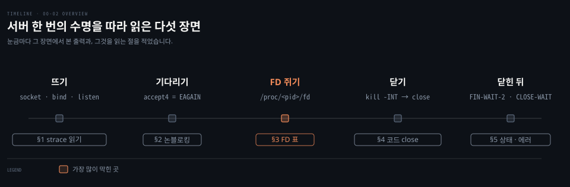
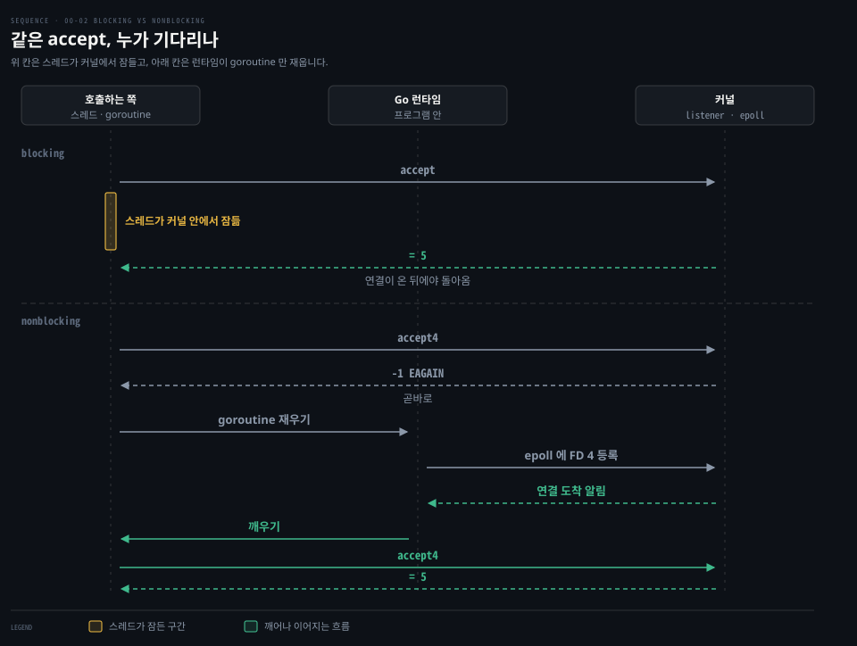
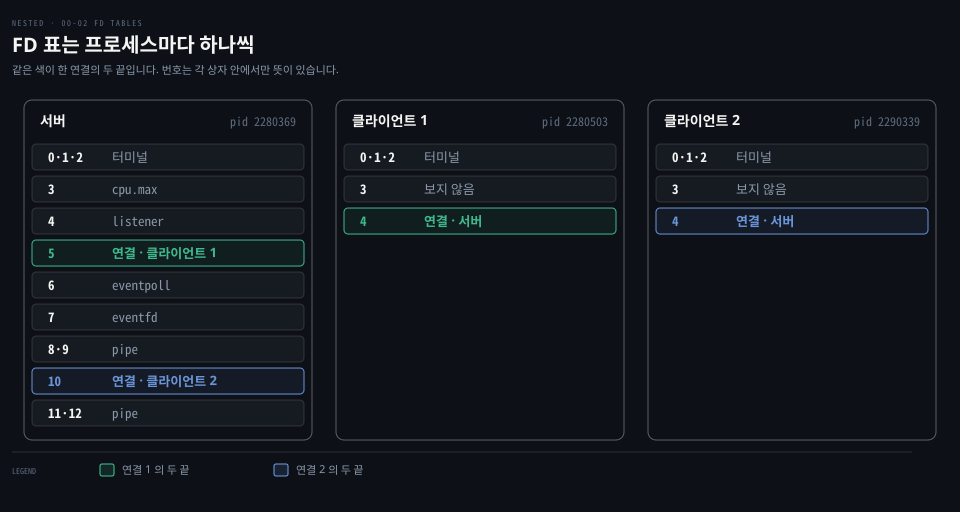
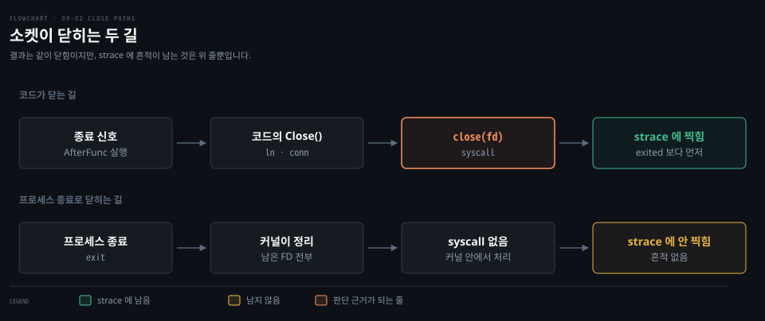

# strace 와 proc 로 읽은 것

---

> gonet 서버를 strace 아래에서 한 번 띄우고 끄는 동안 출력에 나온 낯선 줄들을, 서버가 사는 순서대로 풀어 읽습니다. `00-01` 이 "무엇이 생기는가"를 다뤘다면, 이 문서는 "그 출력을 어떻게 읽는가"를 다룹니다.

## 학습 목표와 범위

> 이 문서를 읽고 나면 strace·`ss`·`/proc` 출력에서 처음 보는 줄을 만나도 그것이 무엇을 알려 주는지 스스로 가를 수 있어야 합니다.

| 목표 | 어떻게 확인하나 |
|---|---|
| strace 한 줄을 syscall 이름·인자·반환값으로 나눠 읽습니다 | 실습 출력의 `socket(...) = 4`, `accept4(...) = -1 EAGAIN` 을 소리 내어 풀어 봅니다 |
| FD 번호는 프로세스마다 따로 매겨지고 비어 있는 가장 작은 번호가 쓰입니다. 이 규칙으로 `ss` 의 `fd=` 를 해석합니다 | Phase 4 에서 도움 없이 답합니다 |
| strace 에 찍힌 `close` 가 코드가 부른 것인지, 프로세스 종료로 치워진 것인지 가릅니다 | Phase 4 에서 도움 없이 답합니다 |

실습 중에 막혔던 자리를 모아 쓴 문서라 절마다 끝에 "막혔던 자리" 한 줄을 남겼습니다. TCP 연결 종료 상태의 전체 설명과 epoll 의 동작은 이미 다른 노트에 있어 링크로 넘깁니다.

| 키워드 | 뜻 | 학습 포인트·연결 개념 | 어디서 |
|---|---|---|---|
| `SOCK_NONBLOCK` | 기다려야 할 때 멈추지 말고 바로 돌아오라는 소켓 플래그 | 기다림을 커널 대신 Go 런타임이 맡게 됨 | §1·§2 |
| `EAGAIN` | "지금은 꺼낼 것이 없다"는 syscall 의 답 | 실패가 아니라 다시 부르라는 신호 | §2 |
| `openat` | 파일을 여는 syscall | 파일도 소켓과 같은 FD 를 받음 | §3 |
| `/proc/<pid>/fd` | 한 프로세스의 FD 표를 파일 목록처럼 보여 주는 곳 | FD 번호는 프로세스마다 따로 | §3 |
| SIGINT·SIGURG·SIGWINCH | 인터럽트, Go 런타임 선점, 터미널 크기 변경 신호 | strace 에 `--- SIG… ---` 로 찍힘 | §4 |
| CLOSE-WAIT | 상대의 FIN 은 받았는데 내가 아직 `close` 하지 않은 상태 | 타이머가 없어 무기한 남음 | §5 |
| EPIPE (`broken pipe`) | 상대가 이미 사라진 연결에 쓴 결과 | 쓰는 순간에야 드러나는 종료 | §5 |

실습은 OrbStack 의 Linux 머신 안에서 했습니다. gonet 서버를 `strace` 아래에서 띄우고 클라이언트 둘을 붙인 상태에서 `ss` 와 `/proc` 로 소켓과 FD 를 본 다음 마지막에 서버에 종료 신호를 보냈습니다. 아래 지도는 그 한 번의 수명을 다섯 장면으로 나눴고 장면 하나가 이 문서의 절 하나입니다.



눈금 위에는 그 장면에서 실제로 본 출력을, 아래에는 그 출력을 읽는 절을 적었습니다. 가장 많이 막힌 곳은 §3 의 FD 표였습니다.


## 1. strace 한 줄은 이름·인자·반환값 세 칸으로 읽습니다

> strace 출력이 길고 복잡해 보여도 한 줄의 모양은 늘 같습니다. 소켓과 상관없는 줄을 먼저 걸러 내면 봐야 할 줄은 몇 줄 남지 않습니다.

strace 는 프로그램이 커널에 거는 요청(syscall)을 가로채 한 줄씩 찍어 주는 도구입니다. 실습에서는 서버를 이렇게 띄웠습니다.

```bash
# -f       : 서버가 만든 스레드까지 따라간다 (아래에서 다시 설명)
# -e trace=: 소켓 수명과 관계있는 syscall 다섯 개만 찍는다
strace -f -e trace=socket,bind,listen,accept4,close \
  ./bin/gonet-linux listen 127.0.0.1:8080
```

한 번의 실행에서 나온 출력 가운데 일부 줄을 순서대로 옮기면 이렇습니다. 2026-09-27 실습 출력이라 pid 와 주소값은 실행할 때마다 달라집니다.

```bash
close(3)                                = 0
strace: Process 2424033 attached
[pid 2424034] socket(AF_INET, SOCK_STREAM|SOCK_CLOEXEC|SOCK_NONBLOCK, IPPROTO_IP) = 4
[pid 2424034] bind(4, {sa_family=AF_INET, sin_port=htons(8080), sin_addr=inet_addr("127.0.0.1")}, 16) = 0
[pid 2424034] listen(4, 4096)           = 0
gonet 2026/09/27 00:34:24.841783 listen addr=127.0.0.1:8080 pid=2424032
[pid 2424034] accept4(4, 0x40001b3a1c, [112], SOCK_CLOEXEC|SOCK_NONBLOCK) = -1 EAGAIN (Resource temporarily unavailable)
[pid 2424034] --- SIGINT {si_signo=SIGINT, si_code=SI_USER, si_pid=2424555, si_uid=0} ---
[pid 2424038] close(4)                  = 0
+++ exited with 0 +++
```

줄이 제각각으로 보여도 모양은 네 가지뿐입니다.

| 모양 | 무엇을 알려 주나 | 위 출력의 예 |
|---|---|---|
| `[pid N] 이름(인자) = 반환값` | syscall 한 번입니다. 괄호 안은 인자, `=` 뒤는 결과입니다. 실패하면 `-1` 과 에러 이름이 붙습니다 | `socket(...) = 4`, `accept4(...) = -1 EAGAIN` (§2) |
| `strace: Process N attached` | 새 스레드를 따라가기 시작했습니다 | 둘째 줄 |
| `--- SIG이름 {...} ---` | 신호가 도착했습니다. §4 에서 봅니다 | `--- SIGINT ... ---` |
| `+++ exited with 코드 +++` | 스레드나 프로세스가 끝났습니다. `pid` 칸 없이 찍힌 마지막 줄이 프로세스 본체입니다 | 마지막 줄 |

`[pid N]` 은 그 syscall 을 부른 스레드 번호로, `-f` 옵션을 줬기 때문에 붙습니다. Go 프로그램은 스레드를 여러 개 띄우므로 같은 서버인데도 이 번호가 줄마다 바뀝니다.

나머지 두 줄은 syscall 이 아닙니다. `pid` 칸이 없는 첫 줄 `close(3)` 은 스레드가 생기기 전 프로세스 본체가 부른 것입니다. 중간의 `gonet ... listen addr=...` 은 gonet 이 직접 찍은 로그입니다.

### socket 의 인자 세 칸은 계열·방식·프로토콜입니다

위 출력의 `socket(AF_INET, SOCK_STREAM|SOCK_CLOEXEC|SOCK_NONBLOCK, IPPROTO_IP) = 4` 는 소켓을 만들어 달라는 요청입니다. 인자 세 칸은 차례로 주소 계열, 통신 방식, 프로토콜입니다.[^socket2] 둘째 칸은 방식 하나에 플래그 둘을 `|` 로 붙인 것입니다.

| 칸 | 값 | 뜻 | 다른 값의 예 |
|---|---|---|---|
| 주소 계열 | `AF_INET` | IPv4 주소를 씀 | `AF_INET6` (IPv6) |
| 통신 방식 | `SOCK_STREAM` | 바이트 스트림, 곧 TCP | `SOCK_DGRAM` (UDP) |
| 방식에 붙은 플래그 | `SOCK_NONBLOCK` | 기다려야 하는 호출이 멈추지 않고 바로 돌아옴. §2 에서 다시 봅니다 | 빼면 blocking |
| 방식에 붙은 플래그 | `SOCK_CLOEXEC` | 이 프로세스가 다른 프로그램을 실행(exec)하면 이 FD 를 자동으로 닫아 자식에게 새지 않게 함 | 빼면 자식에게 넘어감 |
| 프로토콜 | `IPPROTO_IP` | 값 0, "방식에 맞는 기본 프로토콜". `SOCK_STREAM` 과 짝이면 TCP | `IPPROTO_TCP` (TCP 를 직접 지정) |

반환값 `= 4` 가 이 소켓을 가리키는 FD 번호이고 뒤의 `bind(4, ...)` 와 `listen(4, 4096)` 이 같은 4 를 받아 씁니다.

[networking-and-kubernetes 02-01](../../../08_cloud/book/networking-and-kubernetes/02-01.%EC%BB%A4%EB%84%90%EC%9D%B4%20%ED%8C%A8%ED%82%B7%EC%9D%84%20%EC%A3%BC%EA%B3%A0%EB%B0%9B%EB%8A%94%20%EC%9E%90%EB%A6%AC%20%E2%80%94%20%EC%86%8C%EC%BC%93%C2%B7%EC%9D%B8%ED%84%B0%ED%8E%98%EC%9D%B4%EC%8A%A4%C2%B7veth%C2%B7%EB%B8%8C%EB%A6%AC%EC%A7%80.md) §1 「strace 로 들여다보기」는 `net.Listen` 한 줄이 `socket`·`bind`·`listen` 으로 펼쳐지는 기본 모양과 strace 를 운영 중인 프로세스에 붙일 때 드는 비용을 다룹니다. 여기서는 그 노트가 풀지 않은 두 플래그와 gonet 출력에만 있는 줄을 봅니다.

### 진짜 listener 앞의 줄은 Go 의 환경 탐지입니다

위 발췌에서는 뺐지만 실제 출력에는 진짜 listener 를 만들기 전에 다른 소켓 줄들이 먼저 찍혔습니다.

```bash
[pid 2424034] socket(AF_INET6, SOCK_STREAM|SOCK_CLOEXEC|SOCK_NONBLOCK, IPPROTO_TCP) = 4
[pid 2424034] bind(4, {sa_family=AF_INET6, sin6_port=htons(0), ..., inet_pton(AF_INET6, "::1", &sin6_addr), ...}, 28) = 0
[pid 2424034] close(4)                  = 0
[pid 2424034] socket(AF_INET, SOCK_STREAM|SOCK_CLOEXEC|SOCK_NONBLOCK, IPPROTO_MPTCP) = -1 EPROTONOSUPPORT (Protocol not supported)
[pid 2424034] socket(AF_INET, SOCK_STREAM|SOCK_CLOEXEC|SOCK_NONBLOCK, IPPROTO_IP) = 4
```

다섯 줄은 세 묶음으로 나뉩니다.

| 줄 | 하는 일 |
|---|---|
| `socket(AF_INET6, ...)`, `bind(... "::1" ...)`, `close(4)` | Go 가 IPv6 를 쓸 수 있는지 시험하고 곧바로 닫습니다 |
| `socket(..., IPPROTO_MPTCP) = -1 EPROTONOSUPPORT` | listener 를 MPTCP 로 만들려다 커널에게 거절당합니다 |
| `socket(..., IPPROTO_IP) = 4` | 일반 TCP 로 다시 만든 진짜 listener 입니다 |

`net.Listen` 은 `socket`·`bind`·`listen` 세 줄이라고 배웠는데, 그 앞에 `::1` 주소에 포트 0 으로 `bind` 하고 곧바로 닫는 줄이 있습니다. Go 는 처음 네트워크를 쓸 때 이 머신이 IPv4, IPv6, 그리고 IPv6 소켓으로 IPv4 를 받는 방식을 지원하는지 한 번 시험해 봅니다.[^go-probe] 그 결과로 뒤에 만들 소켓의 계열을 정하고 시험용 소켓은 바로 닫습니다.

그다음 줄의 `IPPROTO_MPTCP` 실패도 Go 가 한 일입니다. MPTCP(Multipath TCP)는 연결 하나를 Wi-Fi 와 LTE 처럼 여러 경로로 동시에 보내는 TCP 확장입니다. Go 1.24 부터 listener 는 MPTCP 를 먼저 시도하는 것이 기본값입니다.[^go-mptcp] 이 커널이 `EPROTONOSUPPORT` 로 거절하자 일반 TCP 로 다시 만들었습니다. 진짜 listener 는 이 실패 줄부터 시작한다고 읽으면 됩니다.

막혔던 자리: 출력이 길어 "이게 정상인가"부터 의심했습니다. 소켓과 무관한 줄(런타임 시작, 환경 탐지, 스레드 붙기)을 먼저 걸러 내는 습관이 답입니다.


## 2. EAGAIN 은 실패가 아니라 "지금은 없음"입니다

> 논블로킹 소켓의 `accept4` 는 기다리지 않고 `EAGAIN` 을 돌려주며 기다리는 일은 Go 런타임이 goroutine 을 재워 두는 방식으로 대신합니다.

서버가 막 뜬 뒤 클라이언트가 하나도 없는데 strace 에 `accept4(4, ...) = -1 EAGAIN` 이 찍혔습니다. 에러처럼 보이는데 서버는 꺼지지 않고 기다렸습니다. 클라이언트 하나를 붙이자 이렇게 이어졌습니다.

```bash
[pid 2280371] accept4(4, 0x400013fa1c, [112], SOCK_CLOEXEC|SOCK_NONBLOCK) = -1 EAGAIN (Resource temporarily unavailable)
[pid 2280371] accept4(4, {sa_family=AF_INET, sin_port=htons(56598), sin_addr=inet_addr("127.0.0.1")}, [112 => 16], SOCK_CLOEXEC|SOCK_NONBLOCK) = 5
[pid 2280371] accept4(4, 0x400013fa1c, [112], SOCK_CLOEXEC|SOCK_NONBLOCK) = -1 EAGAIN (Resource temporarily unavailable)
```

`accept4` 는 `accept` 에 넷째 인자(플래그)를 더한 Linux syscall 이라 이름에 `4` 가 붙었고 인자는 네 칸입니다.[^accept2]

| 칸 | 위 출력의 값 | 뜻 |
|---|---|---|
| listener FD | `4` | 연결을 꺼낼 listener 소켓 |
| 주소 버퍼 | `0x400013fa1c` | 상대 주소를 받을 메모리입니다. 실패한 줄에는 채워진 내용이 없어 주소값만 찍혔습니다. 성공한 둘째 줄에는 상대 주소 `127.0.0.1:56598` 이 찍혔습니다 |
| 버퍼 길이 | `[112]` | 버퍼 크기입니다. 둘째 줄의 `[112 => 16]` 은 커널이 IPv4 주소 구조체 크기인 16 바이트를 채웠다는 뜻입니다 |
| 플래그 | `SOCK_CLOEXEC\|SOCK_NONBLOCK` | 새로 받은 연결 소켓에도 §1 의 두 플래그를 붙입니다 |

반환값은 실패하면 `-1 EAGAIN`, 성공하면 새 연결 소켓의 FD 인 `5` 입니다. 이 세 줄이 왜 이렇게 번갈아 찍혔는지 알려면 blocking 과 nonblocking 의 차이가 필요합니다.

플래그가 없는 소켓은 기본이 blocking 입니다. 대기열이 비어 있으면 `accept` 를 부른 스레드가 커널 안에서 잠들고 연결이 와야 깨어납니다. `SOCK_NONBLOCK` 을 주면 커널은 스레드를 붙잡지 않고 곧바로 `EAGAIN` 을 돌려줍니다.[^accept2] "지금은 꺼낼 게 없으니 나중에 다시 불러라"는 뜻입니다.

Go 런타임은 이 답을 받으면 스레드는 그대로 두고 goroutine 만 대기 목록에 올린 뒤 커널의 알림 장치(epoll)에도 "FD 4 에 연결이 오면 알려 달라"고 등록합니다. 연결이 오면 알림을 받아 그 goroutine 을 깨우고 `accept4` 를 다시 부릅니다. 그래서 위 출력에 `EAGAIN`, `= 5`, `EAGAIN` 이 차례로 찍혔습니다. 마지막 `EAGAIN` 은 연결 하나를 받은 루프가 곧바로 다음 연결을 기다리러 돌아간 흔적입니다.



위 칸이 blocking 입니다. `accept` 를 부른 스레드가 연결이 올 때까지 커널 안에서 잠들어 있다가 `= 5` 를 받고서야 돌아옵니다. nonblocking 인 아래 칸에서는 커널이 곧바로 `EAGAIN` 을 돌려주면 Go 런타임이 goroutine 을 재우고 epoll 에 등록해 둡니다. 연결이 오면 알림을 받아 깨운 뒤 `accept4` 를 다시 불러 `= 5` 를 받습니다. 아래 칸에서는 기다리는 동안 잠든 스레드가 없습니다.

epoll 이 기다리는 순환 자체는 [networking-and-kubernetes 02-01](../../../08_cloud/book/networking-and-kubernetes/02-01.%EC%BB%A4%EB%84%90%EC%9D%B4%20%ED%8C%A8%ED%82%B7%EC%9D%84%20%EC%A3%BC%EA%B3%A0%EB%B0%9B%EB%8A%94%20%EC%9E%90%EB%A6%AC%20%E2%80%94%20%EC%86%8C%EC%BC%93%C2%B7%EC%9D%B8%ED%84%B0%ED%8E%98%EC%9D%B4%EC%8A%A4%C2%B7veth%C2%B7%EB%B8%8C%EB%A6%AC%EC%A7%80.md) §1 「창구를 연 뒤 — 기다리는 순환」이 그림으로 설명합니다.

여기서 경계 하나를 기억해 둡니다. `SOCK_NONBLOCK` 이 보장하는 것은 "syscall 이 기다리지 않는다"까지입니다. 준비되면 다시 부르고 그동안 goroutine 을 재우는 일은 커널이 아니라 프로그램 안에 함께 들어 있는 Go 런타임이 합니다. 그 안쪽은 랩 Phase 1 의 주제입니다.

막혔던 자리: nonblocking 을 "비동기를 기본 지원한다"로 읽었습니다. 커널이 주는 것은 기다리지 않는 syscall 이고 비동기처럼 보이게 만드는 것은 런타임입니다.


## 3. FD 는 소켓만의 것이 아니고, 번호는 프로세스마다 따로입니다

> 파일·epoll·파이프도 FD 를 받고 번호는 프로세스마다 0 부터 따로 매기며 비어 있는 가장 작은 번호가 쓰입니다.

실습에서 두 번 놀랐습니다. 두 번째 클라이언트에게 서버가 준 FD 가 6 이 아니라 10 이었고 `ss` 에서는 서버의 listener 와 두 클라이언트 소켓이 모두 FD 4 였습니다. 둘 다 FD 가 무엇에 붙고 어떻게 매겨지는지를 알면 풀립니다.

### 파일과 커널 객체도 같은 FD 를 받습니다

`openat` 은 파일을 여는 syscall 로, 성공하면 소켓과 똑같이 FD 하나를 돌려줍니다. 추적 목록에 `openat` 을 넣자 서버는 `socket` 과 `bind` 사이에서 파일 하나를 FD 5 로 열었다 닫았습니다.

열린 파일은 `/proc/sys/net/core/somaxconn` 입니다. `/proc/sys/` 아래 파일은 커널 설정값을 파일처럼 읽게 해 둔 창구입니다. `somaxconn` 은 accept 대기열 길이의 상한입니다.[^proc5] Go 는 `listen` 에 넘길 대기열 길이(backlog)를 이 파일에서 읽으므로 읽은 값 4096 이 `listen(4, 4096)` 의 둘째 인자로 그대로 들어갔습니다.

[networking-and-kubernetes 02-01](../../../08_cloud/book/networking-and-kubernetes/02-01.%EC%BB%A4%EB%84%90%EC%9D%B4%20%ED%8C%A8%ED%82%B7%EC%9D%84%20%EC%A3%BC%EA%B3%A0%EB%B0%9B%EB%8A%94%20%EC%9E%90%EB%A6%AC%20%E2%80%94%20%EC%86%8C%EC%BC%93%C2%B7%EC%9D%B8%ED%84%B0%ED%8E%98%EC%9D%B4%EC%8A%A4%C2%B7veth%C2%B7%EB%B8%8C%EB%A6%AC%EC%A7%80.md) §1 「읽어내기 — 세 부탁이 남기는 것」에는 이 대기열이 SYN 큐와 accept 큐 두 칸으로 나뉘고 넘칠 때 거절 대신 지연으로 드러나는 이야기가 있습니다.

서버가 쥔 FD 전체는 `/proc/<pid>/fd` 로 봤습니다. 이 디렉터리는 한 프로세스의 FD 표를 번호별 링크로 보여 줍니다.[^proc-fd]

| FD | 가리키는 것 | 정체 |
|---|---|---|
| 0·1·2 | `/dev/pts/2` | 표준 입력·출력·에러. 터미널 A 입니다 |
| 3 | `/sys/fs/cgroup/.lxc/cpu.max` | Go 런타임이 컨테이너 CPU 한도를 읽으려고 열어 둔 파일입니다[^go-cgroup] |
| 4, 5, 10 | `socket:[...]` | listener 와 두 연결 소켓 |
| 6 | `anon_inode:[eventpoll]` | §2 의 epoll 인스턴스 |
| 7 | `anon_inode:[eventfd]` | 런타임이 epoll 대기를 스스로 깨울 때 쓰는 장치[^go-eventfd] |
| 8·9, 11·12 | `pipe:[...]` | 읽기 끝과 쓰기 끝 한 쌍. 누가 만드는지는 아직 확인하지 않았습니다 |

두 번째 클라이언트가 붙을 때 6~9 가 이미 차 있었으니 10 이 나왔습니다. 커널은 새 FD 로 그 프로세스에서 비어 있는 가장 작은 번호를 줍니다.[^socket2] 실습 로그에는 이 규칙의 증거도 남았습니다. 실수로 붙였다 끊은 접속이 FD 10 을 받았다가 `close(10)` 한 직후, 두 번째 클라이언트가 다시 10 을 받았습니다. "4 다음부터 순서대로"였다면 11 이 나왔어야 합니다.

### 번호표는 지점마다 따로 뽑습니다

`ss` 에서 세 소켓이 모두 FD 4 였던 이유는 FD 표가 머신 전체에 하나가 아니라 프로세스마다 하나씩 있기 때문입니다. 은행 지점마다 번호표를 1 번부터 따로 뽑으니 강남점 4 번과 종로점 4 번이 부딪히지 않는 것과 같습니다.

gonet 프로세스 셋은 같은 바이너리라 시작 순서도 같습니다. 서버에서는 0·1·2 가 표준 입출력, 3 이 `cpu.max` 였고 처음 만든 소켓이 4 번을 받았습니다. 클라이언트의 FD 표는 `/proc` 로 열어 보지 않았고 `ss` 로 4 번만 확인했습니다. 3 번까지 서버와 같은 것으로 채워졌다고 보면 4 번이 나온 것이 설명됩니다. 서버에게 4 번은 listener 였고 클라이언트에게는 자기 쪽 연결 소켓이었습니다.

그래서 연결 하나를 두고도 번호는 둘입니다. 클라이언트 1 의 연결은 클라이언트 프로세스에서는 FD 4, 서버 프로세스에서는 FD 5 였습니다.



상자 하나가 프로세스 하나의 FD 표이고 같은 색 두 줄이 한 연결의 양 끝을 이룹니다. 초록 짝은 서버 5 번과 클라이언트 1 의 4 번이고, 파랑 짝은 서버 10 번과 클라이언트 2 의 4 번입니다. 세 상자 모두에 4 번이 있지만 가리키는 것이 다르므로 `ss` 의 `fd=` 는 반드시 같은 줄의 `pid` 와 함께 읽어야 합니다.

막혔던 자리: 클라이언트 쪽 `fd=4` 를 보고 서버가 4 를 닫을 거라고 예측했습니다. 다른 프로세스의 FD 표를 본 것입니다.


## 4. strace 에 close 가 찍히면 코드가 닫은 것입니다

> 소켓이 닫히는 길은 코드의 `Close()` 와 프로세스 종료 두 가지이고 strace 에 `close` syscall 로 남는 것은 앞의 것뿐입니다.

서버를 끄면 소켓이 모두 닫힐 거라고 예측했습니다. 닫히는 번호는 맞혔지만 근거가 달랐습니다. 프로세스가 끝나면 커널이 남은 FD 를 한꺼번에 치우는데 이 정리는 커널 안에서 일어나서 `close` syscall 로 찍히지 않습니다. 실습 출력은 이 순서였습니다.

```bash
[pid 2424034] --- SIGINT {si_signo=SIGINT, si_code=SI_USER, si_pid=2424555, si_uid=0} ---
[pid 2424038] close(4)                  = 0
[pid 2424036] close(5)                  = 0
gonet 2026/09/27 00:35:03.771869 close remote=127.0.0.1:58946 bytes=0
gonet 2026/09/27 00:35:03.772103 shutdown
+++ exited with 0 +++
```

`close(4)`·`close(5)` 가 gonet 의 `shutdown` 로그와 `+++ exited` 보다 먼저 찍혔습니다. 코드가 `Close()` 를 불렀다는 증거입니다. 어느 코드가 불렀는지는 [00-03](./00-03.Go%20%EB%AC%B8%EB%B2%95%20-%20goroutine%C2%B7io.Copy%C2%B7context%C2%B7WaitGroup.md) §5 가 `context.AfterFunc` 로 설명합니다.



위 줄이 이번 출력의 길로, 종료 신호가 코드를 움직여 `close(fd)` syscall 이 나갔기 때문에 strace 에 남았습니다. 아래 줄은 코드가 닫지 않은 FD 가 프로세스 종료와 함께 치워지는 길입니다. 결과는 똑같이 "닫힘"이지만 syscall 이 없어 strace 로는 보이지 않습니다.

아래 줄의 정리는 커널이 프로세스 종료를 처리하는 안에서 남은 FD 를 닫는 일이라 syscall 이 아니고, 그래서 strace 에 `close` 로 찍히지 않습니다.[^exit2] 이 정리를 init(PID 1)이 맡는다고 착각하기 쉽습니다. init 이 하는 일은 부모가 먼저 끝나 고아가 된 프로세스를 넘겨받아, 그 프로세스가 끝났을 때 종료 상태를 거둬 가는 것입니다.[^wait2] FD 정리와는 관계가 없습니다.

### 신호는 누가 받느냐에 따라 결과가 달라집니다

종료 실험은 처음에 실패했습니다. strace 를 띄운 터미널에서 Ctrl-C 를 눌렀더니 `strace: Process ... detached` 만 찍히고 `close` 는 하나도 남지 않았습니다.

터미널의 Ctrl-C 는 그 터미널에서 앞에 떠 있는 프로세스 무리 전체에 SIGINT 를 보냅니다. strace 도 그 신호를 받고 추적을 뗀 채 끝났으니 서버가 그 뒤에 무엇을 했는지는 기록되지 않았습니다.

다시 할 때는 strace 를 띄우지 않은 다른 터미널에서 서버에만 신호를 보냈습니다.

```bash
# gonet 로그의 pid= 값 (이번 실습에서는 2424032)
GONET_PID=2424032
sudo kill -INT "$GONET_PID"
```

그러자 `--- SIGINT ---` 뒤의 `close` 들이 모두 찍혔습니다.

실습 중 strace 에 찍힌 신호는 셋이었고 소켓과 관계있는 것은 SIGINT 하나입니다.[^signal7]

| 신호 | 언제 오나 | 이번 실습에서 |
|---|---|---|
| SIGINT | Ctrl-C 를 누르거나 `kill -INT` 로 보낼 때 | gonet 이 받아 종료 절차를 시작했습니다 |
| SIGURG | Go 런타임이 오래 도는 goroutine 을 잠깐 멈추게 할 때 자기 스레드에 보냄[^go-preempt] | 종료 직전에 세 번 찍혔습니다. 소켓과 무관합니다 |
| SIGWINCH | 터미널 창 크기가 바뀌었을 때 | 창 크기를 조절한 흔적입니다. 소켓과 무관합니다 |

실습에 찍히지 않은 신호까지 넓혀 서버를 다루며 자주 만나는 것을 번호순으로 아래 표에 모았습니다. 번호는 실습 머신의 `kill -l` 에서 읽었습니다.[^kill-l] 커널 기본 동작은 프로그램이 신호 처리를 따로 정하지 않았을 때 커널이 하는 일입니다.[^signal7] Go 프로그램은 런타임이 시작할 때 신호 처리기를 먼저 설치하므로 몇몇 신호에서 결과가 커널 기본과 달라집니다.[^go-signal]

| 번호 | 이름 | 언제 오나 | 커널 기본 동작 | Go 프로그램 기본 동작 |
|---|---|---|---|---|
| 1 | SIGHUP | 제어 터미널과의 연결이 끊겼을 때 | 종료 | 종료 |
| 2 | SIGINT | Ctrl-C, `kill -INT` | 종료 | 종료 |
| 3 | SIGQUIT | `Ctrl-\` | 코어 덤프를 남기고 종료 | goroutine 스택 덤프를 찍고 종료 |
| 9 | SIGKILL | `kill -9` | 종료 | 가로챌 수 없어 커널 기본 동작 그대로 |
| 13 | SIGPIPE | 읽는 쪽이 사라진 파이프나 소켓에 쓸 때 | 종료 | FD 1·2(표준 출력·에러)에 쓸 때만 종료. 소켓 같은 다른 FD 에서는 `write` 가 EPIPE 에러로 돌아옴 |
| 15 | SIGTERM | 신호 이름 없이 `kill` 을 부를 때 | 종료 | 종료 |
| 19 | SIGSTOP | `kill -STOP` | 멈춤 | 가로챌 수 없어 커널 기본 동작 그대로 |
| 20 | SIGTSTP | Ctrl-Z | 멈춤 | 셸의 작업 제어용이라 커널 기본 동작을 그대로 따름 |
| 23 | SIGURG | 소켓에 긴급 데이터가 왔을 때 | 무시 | 런타임이 goroutine 선점 신호로 씀[^go-preempt]. 프로그램 동작은 바뀌지 않음 |
| 28 | SIGWINCH | 터미널 창 크기가 바뀌었을 때 | 무시 | 받기만 하고 아무것도 하지 않음 |

오른쪽 열은 코드가 신호를 따로 받지 않았을 때의 기본입니다. gonet 처럼 `signal.NotifyContext` 로 SIGINT 를 받으면 종료 대신 코드가 정한 절차가 돕니다. §5 의 `write: broken pipe` 가 신호에 의한 종료가 아니라 에러 메시지로 찍힌 것도 이 표의 SIGPIPE 줄로 설명됩니다. 클라이언트가 쓴 곳이 소켓이라 신호 대신 EPIPE 에러를 받았습니다.

막혔던 자리: 예측의 근거를 "서버가 죽으면 닫힌다"로 댔습니다. 그 길은 strace 에 흔적을 남기지 않는다는 점이 판단의 열쇠였습니다.


## 5. 연결이 끝난 뒤 남는 상태와 에러

> TCP 종료 상태의 전체 그림은 기존 노트로 넘기고 여기서는 실습에서 헷갈린 CLOSE-WAIT 와 두 에러 메시지만 짚습니다.

서버를 끈 뒤 `ss` 에 서버 쪽 `FIN-WAIT-2` 와 클라이언트 쪽 `CLOSE-WAIT` 가 한 쌍으로 남았습니다.

연결 종료의 네 단계와 상태 이름은 [networking-and-kubernetes 01-02](../../../08_cloud/book/networking-and-kubernetes/01-02.HTTP%EC%97%90%EC%84%9C%20TCP%C2%B7TLS%C2%B7UDP%EA%B9%8C%EC%A7%80%20%E2%80%94%20Transport%20%EA%B3%84%EC%B8%B5%20%ED%95%B4%EB%B6%80.md) §3 「연결을 닫은 뒤 남는 것」이 설명합니다. 열한 개 상태가 세그먼트마다 양쪽에서 바뀌는 순서는 [CNTD 03-04](../../book/cntd_computer-networking-top-down/03-04.%ED%9D%90%EB%A6%84%20%EC%A0%9C%EC%96%B4%EC%99%80%20%EC%97%B0%EA%B2%B0%20%EA%B4%80%EB%A6%AC%2C%20%EA%B7%B8%EB%A6%AC%EA%B3%A0%20%ED%98%BC%EC%9E%A1.md) §2 「연결을 세우고 허무는 절차」가 표로 정리합니다. 두 상태를 일부러 만들어 보는 실습은 [01-04](../../../08_cloud/book/networking-and-kubernetes/01-04.%ED%8C%A8%ED%82%B7%20%EC%BA%A1%EC%B2%98%20%EC%8B%A4%EC%8A%B5%20%E2%80%94%201%EC%9E%A5%20%EA%B0%9C%EB%85%90%EC%9D%84%20%EB%88%88%EC%9C%BC%EB%A1%9C%20%ED%99%95%EC%9D%B8%ED%95%98%EA%B8%B0.md) §4 에 있습니다.

실습에서는 CLOSE-WAIT 에도 2MSL 타이머가 있다고 착각했습니다. 2MSL 은 세그먼트가 네트워크에 머물 수 있는 최대 시간(MSL)의 두 배입니다. 이만큼 기다리는 것은 먼저 닫은 쪽의 TIME-WAIT 이고, 왜 두 배인지는 같은 01-02 §3 의 「TIME-WAIT 가 2MSL 인 이유」가 설명합니다. CLOSE-WAIT 는 상대의 FIN 을 받았는데 내 프로그램이 아직 `close` 하지 않은 상태로, 타이머가 없어서 프로그램이 닫을 때까지 무기한 남습니다.

운영에서 CLOSE-WAIT 가 쌓이면 대개 애플리케이션 버그로 보는 이유가 이것입니다. 실습의 CLOSE-WAIT 도 `client.go` 가 키보드를 기다리느라 서버의 종료를 못 알아챈 버그였습니다. 이 버그는 2026-09-27 에 고쳤습니다.

실습에서 본 에러 메시지는 둘입니다.

| 메시지 | 무슨 일인가 | 먼저 볼 것 |
|---|---|---|
| `connect: connection refused` | SYN 이 도착했지만 그 주소에서 LISTEN 중인 소켓이 없어 커널이 RST 로 거절했습니다 | 서버가 떠 있는지 |
| `write: broken pipe` (EPIPE) | 상대가 이미 사라진 연결에 썼습니다[^write2] | 내 프로그램이 상대의 종료를 언제 알아채는지 |

두 번째 에러는 CLOSE-WAIT 로 멈춰 있던 클라이언트에 한 줄을 입력하자 났습니다. 멈춘 프로그램은 쓰는 순간에야 상대의 부재를 알아챕니다. 왜 두 번째가 아니라 첫 번째 쓰기에서 바로 났는지는 아직 확인하지 않았습니다.

막혔던 자리: CLOSE-WAIT 와 TIME-WAIT 를 섞었습니다. "어느 쪽이 먼저 닫았나"와 "타이머가 있나"를 짝으로 기억하면 갈립니다.


## 검증과 복습

> Phase 4 의 자답과 회차별 복습은 본문에 누적하지 않고 `_review/` 와 상태 파일에 남깁니다.

- Phase 4: 2026-09-28 예정입니다. 결과는 [STATE.md](./STATE.md) 와 `write/_review/_queue.md` 에 남깁니다.
- 검증 범위: §3 의 FD 번호 규칙, §4 의 코드 close 와 프로세스 종료 구분, §5 의 CLOSE-WAIT 를 표적으로 삼습니다.
- 미해결: §3 의 파이프 두 쌍을 누가 만드는가, §5 의 EPIPE 가 첫 쓰기에서 난 이유. 둘 다 랩 Phase 1 에서 확인합니다.


## 출처와 관련 문서

> 동작 주장에 쓴 1차 자료와, 설명을 넘긴 노트입니다.

- [00-01 listener 소켓과 연결 소켓](./00-01.listener%20%EC%86%8C%EC%BC%93%EA%B3%BC%20%EC%97%B0%EA%B2%B0%20%EC%86%8C%EC%BC%93.md): 같은 실습에서 "무엇이 생기는가"를 정리한 편
- [00-03 Go 문법](./00-03.Go%20%EB%AC%B8%EB%B2%95%20-%20goroutine%C2%B7io.Copy%C2%B7context%C2%B7WaitGroup.md): 같은 실습에서 막힌 Go 문법을 정리한 편

[^socket2]: Linux man page `socket(2)`, 인자 domain·type·protocol 과 RETURN VALUE "the lowest-numbered file descriptor not currently open for the process". <https://man7.org/linux/man-pages/man2/socket.2.html>
[^accept2]: Linux man page `accept(2)`, ERRORS 의 EAGAIN 과 `accept4()` 의 flags 인자. <https://man7.org/linux/man-pages/man2/accept.2.html>
[^proc5]: Linux man page `proc_sys_net(5)` 의 `/proc/sys/net/core/somaxconn`. <https://man7.org/linux/man-pages/man5/proc_sys_net.5.html>
[^proc-fd]: Linux man page `proc_pid_fd(5)` 의 `/proc/pid/fd/`. <https://man7.org/linux/man-pages/man5/proc_pid_fd.5.html>
[^signal7]: Linux man page `signal(7)`, 표준 신호 표의 Action 열(Term·Core·Stop·Ign)과 "SIGKILL and SIGSTOP cannot be caught, blocked, or ignored." OrbStack ubuntu 의 `/usr/share/man/man7/signal.7.gz` 로 대조. <https://man7.org/linux/man-pages/man7/signal.7.html>
[^write2]: Linux man page `write(2)`, ERRORS 의 EPIPE. <https://man7.org/linux/man-pages/man2/write.2.html>
[^go-probe]: Go 소스 `net/ipsock_posix.go` 의 `ipStackCapabilities.probe` (go1.25.1). <https://github.com/golang/go/blob/go1.25.1/src/net/ipsock_posix.go>
[^go-mptcp]: Go `doc/godebug.md` 의 `multipathtcp` 항목, "For Go 1.24, it now defaults to multipathtcp="2", thus enabled by default on listeners." <https://github.com/golang/go/blob/go1.25.1/doc/godebug.md>
[^go-cgroup]: Go `doc/godebug.md` 의 `containermaxprocs`·`updatemaxprocs` 항목 (Go 1.25). <https://github.com/golang/go/blob/go1.25.1/doc/godebug.md>
[^go-eventfd]: Go 소스 `runtime/netpoll_epoll.go` 의 `netpollEventFd` (go1.25.1). <https://github.com/golang/go/blob/go1.25.1/src/runtime/netpoll_epoll.go>
[^go-preempt]: Go 소스 `runtime/signal_unix.go` 의 `const sigPreempt = _SIGURG` (go1.25.1). <https://github.com/golang/go/blob/go1.25.1/src/runtime/signal_unix.go>
[^kill-l]: OrbStack ubuntu(커널 7.0.14-orbstack, arm64)에서 `bash -c 'kill -l'` 을 실행한 출력 (2026-09-28). 1 SIGHUP, 2 SIGINT, 3 SIGQUIT, 9 SIGKILL, 13 SIGPIPE, 15 SIGTERM, 19 SIGSTOP, 20 SIGTSTP, 23 SIGURG, 28 SIGWINCH.
[^go-signal]: `go doc os/signal` (go1.25.1) 의 "Types of signals"·"Default behavior of signals in Go programs"·"SIGPIPE" 절. "A SIGHUP, SIGINT, or SIGTERM signal causes the program to exit. A SIGQUIT, ... signal causes the program to exit with a stack dump. A SIGTSTP, SIGTTIN, or SIGTTOU signal gets the system default behavior", "Other signals will be caught but no action will be taken", "A write to a broken pipe on file descriptors 1 or 2 ... will cause the program to exit with a SIGPIPE signal. A write to a broken pipe on some other file descriptor will take no action on the SIGPIPE signal, and the write will fail with a syscall.EPIPE error." <https://pkg.go.dev/os/signal>
[^exit2]: Linux man page `_exit(2)`, "Any open file descriptors belonging to the process are closed." <https://man7.org/linux/man-pages/man2/_exit.2.html>
[^wait2]: Linux man page `wait(2)` NOTES, "If a parent process terminates, then its 'zombie' children (if any) are adopted by init(1) ... init(1) automatically performs a wait to remove the zombies." <https://man7.org/linux/man-pages/man2/wait.2.html>
