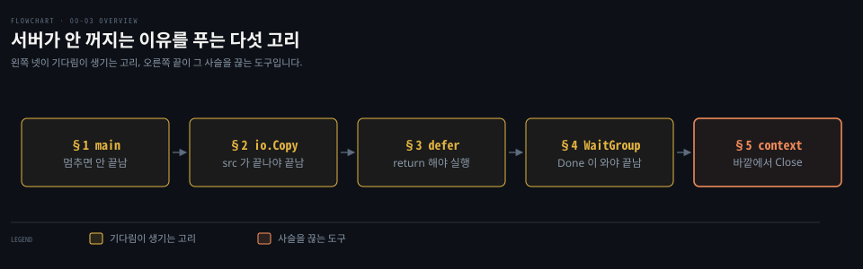
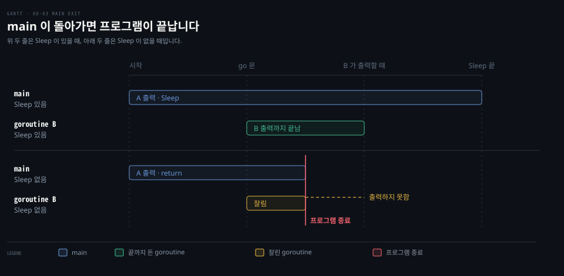
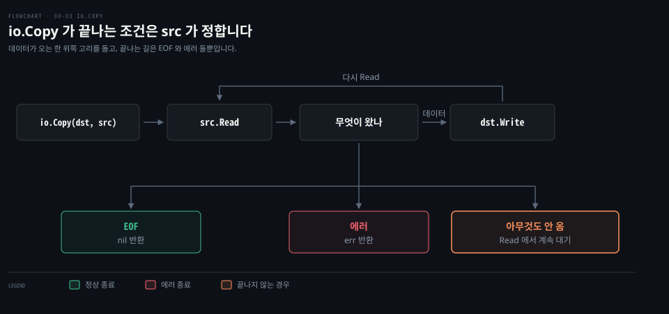
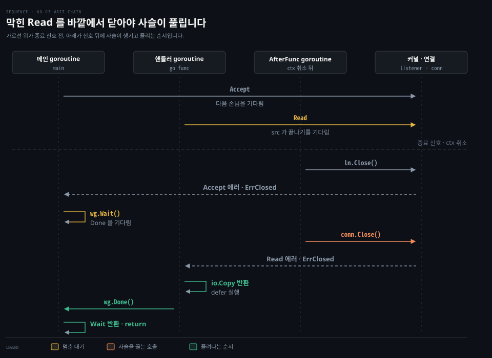
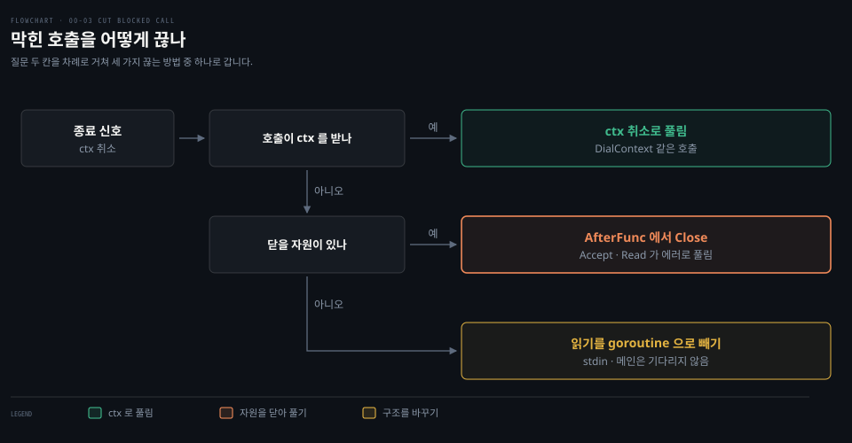

# Go 문법 - goroutine·io.Copy·context·WaitGroup

---

> "서버를 껐는데 왜 프로세스가 안 끝나는가"라는 물음 하나를 따라가며 그 답에 필요한 Go 문법과 도구를 일곱 절에 걸쳐 차례로 쌓습니다. 본문은 Go 일반 문법으로 쓰고 이 문법을 만난 실습 코드는 맨 끝 한 절에 모았습니다.

## 학습 목표와 범위

> 이 문서를 읽고 나면 goroutine 여럿이 서로를 기다리는 코드를 보고 누가 무엇을 기다리는지와 그 기다림을 어디서 끊을 수 있는지 짚을 수 있어야 합니다.

| 목표 | 어떻게 확인하나 |
|---|---|
| `io.Copy(dst, src)` 의 방향과 끝나는 조건을 설명합니다 | 주어진 코드에서 어느 `io.Copy` 가 무엇 때문에 멈춰 있는지 답합니다 |
| `defer` 와 `wg.Wait()` 가 `return` 에 묶여 있다는 것으로 "프로세스가 안 끝나는" 사슬을 거꾸로 따라갑니다 | Phase 4 에서 도움 없이 답합니다 |
| 막힌 호출을 `context.AfterFunc` 로 바깥에서 끊는 이유를 설명합니다 | Phase 4 에서 도움 없이 답합니다 |

다루지 않는 것은 goroutine 스케줄러와 netpoller 의 내부, `select`, 채널 방향 타입, `errgroup` 입니다. 앞의 둘은 [Go 로드맵](../../../roadmap/go-roadmap.md) 4단계 동시성의 주제입니다. `select` 는 [Learning Go 12-02](../../../01_language/book/lgo_learning-go/12-02.select%20%EB%8A%94%20%EC%A4%80%EB%B9%84%EB%90%9C%20case%20%EB%A5%BC%20%EB%AC%B4%EC%9E%91%EC%9C%84%EB%A1%9C%20%EA%B3%A0%EB%A5%B4%EA%B3%A0%20%EA%B3%A0%EB%A3%A8%ED%8B%B4%EC%9D%80%20%EB%B0%98%EB%93%9C%EC%8B%9C%20%EB%81%9D%EB%82%98%EA%B2%8C%20%EB%A7%8C%EB%93%AD%EB%8B%88%EB%8B%A4.md) §1, 채널 방향 타입은 [12-01](../../../01_language/book/lgo_learning-go/12-01.%EA%B3%A0%EB%A3%A8%ED%8B%B4%EC%9D%80%20%EB%9F%B0%ED%83%80%EC%9E%84%EC%9D%B4%20%EB%82%98%EB%88%A0%20%EB%8F%8C%EB%A6%AC%EB%8A%94%20%EA%B0%80%EB%B2%BC%EC%9A%B4%20%EC%8A%A4%EB%A0%88%EB%93%9C%EC%9D%B4%EA%B3%A0%20%EC%B1%84%EB%84%90%EB%A1%9C%20%EA%B0%92%EC%9D%84%20%EC%A3%BC%EA%B3%A0%EB%B0%9B%EC%8A%B5%EB%8B%88%EB%8B%A4.md) §3, `errgroup` 은 [12-03](../../../01_language/book/lgo_learning-go/12-03.%EB%B2%84%ED%8D%BC%20%EC%B1%84%EB%84%90%EC%9D%80%20%EA%B0%9C%EC%88%98%EB%A5%BC%20%EC%95%8C%20%EB%95%8C%20%EC%93%B0%EA%B3%A0%20WaitGroup%20%EA%B3%BC%20Once%20%EA%B0%80%20%EA%B8%B0%EB%8B%A4%EB%A6%BC%EA%B3%BC%20%ED%95%9C%20%EB%B2%88%20%EC%8B%A4%ED%96%89%EC%9D%84%20%EB%A7%A1%EC%8A%B5%EB%8B%88%EB%8B%A4.md) 「errgroup 과 Go 1.25 의 WaitGroup.Go」가 다룹니다.

이 문서는 gonet 의 물음에 필요한 만큼만 설명합니다. 문법 자체의 자세한 설명은 절마다 [Learning Go 정독 노트](../../../01_language/book/lgo_learning-go/README.md)의 해당 편으로 넘깁니다.

| 키워드 | 뜻 | 학습 포인트·연결 개념 | 어디서 |
|---|---|---|---|
| 메인 goroutine | `main` 을 실행하는 goroutine | `go` 없이 생기고, 이것이 끝나면 프로그램도 끝남 | §1 |
| `go` 문 | 함수 호출을 새 goroutine 에 맡기는 문장 | 호출한 쪽은 기다리지 않고 다음 줄로 감 | §1 |
| `io.Copy` | `src` 에서 읽어 `dst` 에 쓰기를 반복하는 함수 | `src` 가 EOF 나 에러를 줘야 끝남 | §2 |
| `defer` | 함수가 돌아갈 때 실행할 호출 | `return` 하지 못하면 실행되지 않음 | §3 |
| `sync.WaitGroup` | goroutine 여럿이 끝나기를 세어 기다리는 도구 | `Done` 이 오지 않으면 `Wait` 도 끝나지 않음 | §4 |
| `context.AfterFunc` | context 가 취소되면 함수를 새 goroutine 에서 실행 | 막힌 호출을 바깥에서 끊는 자리 | §5 |
| `map[K]struct{}` | 값 없이 키만 담는 집합 | 여러 goroutine 이 쓰면 잠금이 필요함 | §6 |

아래 지도는 이 문서가 물음에 답하는 순서입니다. §1~§4 는 각각 "무엇이 끝나야 다음이 끝나는가"를 하나씩 세우는 고리이고 §5 가 그 고리들이 만든 사슬을 바깥에서 끊는 도구입니다.



고리 넷이 모두 "기다림"이라 같은 색으로 칠했습니다. §4 에서 넷이 한 줄로 이어지는 장면을 도식으로 다시 봅니다.


## 1. main 도 goroutine 이고, go 문은 기다리지 않습니다

> 프로그램은 메인 goroutine 하나로 시작합니다. `go` 문은 새 goroutine 을 띄운 뒤 곧바로 다음 줄로 넘어갑니다.

코드에 `go` 가 한 번만 나오는데 "goroutine 이 둘"이라는 말을 들으면 나머지 하나가 어디 있는지 헷갈립니다. 답은 `main` 입니다. Go 프로그램은 시작할 때 `main` 패키지의 `main` 함수를 부릅니다.[^spec-exec] 이 호출을 실행하는 goroutine 이 메인 goroutine 인데 `go` 키워드 없이 생기며 `main` 이 부르는 함수도 모두 이 goroutine 위에서 돕니다.

`go f()` 는 `f` 를 새 goroutine 에 맡깁니다. 명세는 이것을 "일반 호출과 달리 실행이 호출한 함수가 끝나기를 기다리지 않는다"고 적습니다.[^spec-go] 루프 안에서 `go handle(conn)` 을 부르면 루프는 `handle` 이 끝나기를 기다리지 않고 곧바로 다음 반복으로 올라갑니다.

```go
package main

import (
	"fmt"
	"time"
)

func say(s string) { fmt.Println(s) }

func main() {
	// 새 goroutine 에 맡기고 곧바로 다음 줄로
	go func() {
		say("B")
	}()
	say("A")
  
	// 이 줄이 없으면 B 가 찍히기 전에 main 이 돌아가 프로그램이 끝날 수 있다
	time.Sleep(100 * time.Millisecond)
}
```

마지막 줄이 이 절의 두 번째 요점입니다. 명세는 `main` 이 돌아가면 프로그램이 끝나고 다른 goroutine 이 끝나기를 기다리지 않는다고 적습니다.[^spec-exec] 거꾸로 말하면 메인 goroutine 이 어딘가에서 멈춰 돌아가지 못하면 프로그램도 끝나지 않습니다. 이 문서의 물음이 바로 이 자리에서 시작합니다.



위 두 줄은 `time.Sleep` 이 있을 때로, main 이 B 의 출력보다 오래 살아 있으니 B 가 끝까지 돕니다. 아래 두 줄처럼 Sleep 을 빼면 main 이 먼저 돌아가는 순간 빨간 선에서 프로그램이 끝나고 아직 출력하지 못한 B 도 함께 잘립니다.

`go` 로 띄운 함수의 반환값은 버려집니다. 그 까닭과 클로저로 띄우는 관례는 [Learning Go 12-01](../../../01_language/book/lgo_learning-go/12-01.%EA%B3%A0%EB%A3%A8%ED%8B%B4%EC%9D%80%20%EB%9F%B0%ED%83%80%EC%9E%84%EC%9D%B4%20%EB%82%98%EB%88%A0%20%EB%8F%8C%EB%A6%AC%EB%8A%94%20%EA%B0%80%EB%B2%BC%EC%9A%B4%20%EC%8A%A4%EB%A0%88%EB%93%9C%EC%9D%B4%EA%B3%A0%20%EC%B1%84%EB%84%90%EB%A1%9C%20%EA%B0%92%EC%9D%84%20%EC%A3%BC%EA%B3%A0%EB%B0%9B%EC%8A%B5%EB%8B%88%EB%8B%A4.md) §2 「go 키워드로 띄우고 클로저로 감쌉니다」에서 설명합니다. main 이 끝나 남은 goroutine 이 잘리는 다른 예는 [12-02](../../../01_language/book/lgo_learning-go/12-02.select%20%EB%8A%94%20%EC%A4%80%EB%B9%84%EB%90%9C%20case%20%EB%A5%BC%20%EB%AC%B4%EC%9E%91%EC%9C%84%EB%A1%9C%20%EA%B3%A0%EB%A5%B4%EA%B3%A0%20%EA%B3%A0%EB%A3%A8%ED%8B%B4%EC%9D%80%20%EB%B0%98%EB%93%9C%EC%8B%9C%20%EB%81%9D%EB%82%98%EA%B2%8C%20%EB%A7%8C%EB%93%AD%EB%8B%88%EB%8B%A4.md) §1 「교착 상태와 select」가 보여 줍니다.

막혔던 자리: `go` 가 붙은 곳만 goroutine 이라고 봐서 메인 goroutine 을 찾지 못했습니다.


## 2. io.Copy(dst, src) 는 src 가 끝나야 끝납니다

> `io.Copy` 는 받는 쪽을 먼저, 보내는 쪽을 나중에 적고 보내는 쪽이 EOF 나 에러를 줄 때까지 돌아오지 않습니다.

`io.Copy(conn, in)` 과 `io.Copy(out, conn)` 이 한 함수에 나란히 있으면 어느 쪽이 무엇을 기다리는지 헷갈립니다. 인자 순서와 끝나는 조건, 두 가지만 기억하면 풀립니다.

인자는 `io.Copy(dst, src)` 순서라서 대입문 `dst = src` 처럼 받는 쪽이 앞입니다. 이 함수는 `src` 에서 읽어 `dst` 에 씁니다. 끝나는 조건은 `src` 쪽에 있습니다. `src` 가 EOF 에 닿거나 에러가 날 때까지 반복하며 EOF 로 끝나면 에러가 아니라 `nil` 을 돌려줍니다.[^io-copy] EOF 는 "더 올 데이터가 없다"는 정상 신호이기 때문입니다. TCP 연결에서는 상대가 보낸 FIN 이 `Read` 에게 EOF 로 전달됩니다.

```go
package main

import (
	"fmt"
	"io"
	"os"
	"strings"
)

func main() {
	// dst 는 화면, src 는 문자열
	n, err := io.Copy(os.Stdout, strings.NewReader("hello\n"))
  
	// "6 <nil>" 이 찍힌다. EOF 는 에러로 보고되지 않는다
	fmt.Println(n, err)
}
```

끝나는 조건을 `src` 가 정한다는 것이 핵심입니다. `src` 가 키보드(`os.Stdin`)라면 사용자가 Ctrl-D 로 EOF 를 주거나 입력이 에러를 낼 때까지, 다른 곳에서 무슨 일이 일어나든 이 호출은 돌아오지 않습니다. `src` 가 네트워크 연결이라면 상대가 FIN 을 보내거나 누군가 그 연결을 닫아 `Read` 가 에러를 받아야 끝납니다.



`io.Copy` 는 안에서 `src.Read` 를 부르고 무엇이 왔느냐에 따라 갈라집니다. 데이터가 오면 `dst.Write` 로 쓰고 위쪽 고리를 따라 다시 `Read` 합니다. 끝나는 길은 EOF 와 에러 둘뿐입니다. 오른쪽 아래의 "아무것도 안 옴"은 끝나는 길이 아닙니다. `Read` 안에서 계속 기다리는 상태이고 이 문서의 물음은 이 칸에서 시작합니다.

`Read` 는 호출자의 버퍼를 채우고 EOF 로 끝을 알립니다. 이 규약 자체는 [Learning Go 13-01](../../../01_language/book/lgo_learning-go/13-01.io.Reader%20%EB%8A%94%20%EB%B2%84%ED%8D%BC%EB%A5%BC%20%EB%B0%9B%EC%95%84%20%EC%B1%84%EC%9A%B0%EA%B3%A0%20%EC%9E%91%EC%9D%80%20%EC%9D%B8%ED%84%B0%ED%8E%98%EC%9D%B4%EC%8A%A4%EB%A5%BC%20%EA%B2%B9%EC%B3%90%20%EA%B8%B0%EB%8A%A5%EC%9D%84%20%EB%8D%94%ED%95%A9%EB%8B%88%EB%8B%A4.md) §1 「io.Reader 와 io.Writer — 호출자가 준 버퍼를 채웁니다」에서 따로 다룹니다.

막혔던 자리: `io.Copy` 가 "에러가 날 때까지" 돈다고만 보고 끝나는 조건이 `src` 쪽 사건이라는 것을 놓쳤습니다.


## 3. channel 로 결과를 넘기고, defer 는 돌아갈 때 실행됩니다

> goroutine 의 결과는 channel 로 받고 정리 코드는 `defer` 로 걸어 두는데, 둘 다 받는 쪽이 그 자리에 도착해야 의미가 있습니다.

`go` 로 띄운 함수는 반환값을 돌려줄 곳이 없으니 결과를 channel 에 넣고 기다리는 쪽이 꺼냅니다. channel 은 goroutine 사이에 값을 건네는 통로이고 `chan error` 는 error 값을 나르는 channel 입니다. `ch <- v` 가 넣기, `<-ch` 가 꺼내기입니다. 버퍼 유무에 따라 언제 멈추는지까지 포함해 [Learning Go 12-01](../../../01_language/book/lgo_learning-go/12-01.%EA%B3%A0%EB%A3%A8%ED%8B%B4%EC%9D%80%20%EB%9F%B0%ED%83%80%EC%9E%84%EC%9D%B4%20%EB%82%98%EB%88%A0%20%EB%8F%8C%EB%A6%AC%EB%8A%94%20%EA%B0%80%EB%B2%BC%EC%9A%B4%20%EC%8A%A4%EB%A0%88%EB%93%9C%EC%9D%B4%EA%B3%A0%20%EC%B1%84%EB%84%90%EB%A1%9C%20%EA%B0%92%EC%9D%84%20%EC%A3%BC%EA%B3%A0%EB%B0%9B%EC%8A%B5%EB%8B%88%EB%8B%A4.md) §3 「채널 — 고루틴끼리 값을 넘기는 통로」가 자세히 설명합니다.

```go
// 칸이 하나 있는 channel
done := make(chan error, 1)

go func() {
	_, err := io.Copy(out, conn)
	// 받는 쪽이 아직 없어도 칸이 있으니 멈추지 않고 넣고 끝난다
	done <- err
}()

// ... 다른 일 ...
// 값이 들어올 때까지 여기서 기다린다
err := <-done
```

칸을 하나 두는 이유가 있습니다. 칸이 없는 channel 은 받는 쪽이 꺼낼 때까지 넣는 쪽을 멈춰 세우는데 받는 쪽이 먼저 다른 이유로 돌아가 버리면 넣는 goroutine 이 영원히 멈춰 새게 됩니다. 칸이 하나 있으면 넣는 쪽은 받는 쪽을 기다리지 않고 끝날 수 있습니다. 멈춘 goroutine 이 메모리를 붙잡은 채 남는 누수는 [12-02](../../../01_language/book/lgo_learning-go/12-02.select%20%EB%8A%94%20%EC%A4%80%EB%B9%84%EB%90%9C%20case%20%EB%A5%BC%20%EB%AC%B4%EC%9E%91%EC%9C%84%EB%A1%9C%20%EA%B3%A0%EB%A5%B4%EA%B3%A0%20%EA%B3%A0%EB%A3%A8%ED%8B%B4%EC%9D%80%20%EB%B0%98%EB%93%9C%EC%8B%9C%20%EB%81%9D%EB%82%98%EA%B2%8C%20%EB%A7%8C%EB%93%AD%EB%8B%88%EB%8B%A4.md) §4 「고루틴은 반드시 끝나게 만듭니다」가 다룹니다.

`defer` 는 둘러싼 함수가 돌아가기 직전에 실행됩니다.[^spec-defer] 여러 개일 때의 순서와 인자가 정해지는 시점은 [Learning Go 05-03](../../../01_language/book/lgo_learning-go/05-03.defer%20%EB%8A%94%20%ED%95%A8%EC%88%98%EA%B0%80%20%EB%81%9D%EB%82%A0%20%EB%95%8C%20%EC%A0%95%EB%A6%AC%ED%95%98%EA%B3%A0%20%EC%9D%B8%EC%9E%90%EB%8A%94%20%EB%8A%98%20%EB%B3%B5%EC%82%AC%EB%90%A9%EB%8B%88%EB%8B%A4.md) §1 「defer — 함수가 어떻게 끝나든 정리 코드를 실행합니다」에 있습니다. 여기서 필요한 것은 그 뒷면입니다. `defer conn.Close()` 를 걸어 두면 어느 `return` 으로 나가든 연결이 닫히지만 함수가 `return` 에 도착하지 못하면 `defer` 도 실행되지 않습니다. 결과가 channel 에 이미 들어와 있어도 그것을 꺼낼 줄(`<-done`)에 아무도 도착하지 못하면 아무 일도 일어나지 않습니다.

막혔던 자리: channel 에 값이 들어갔는데 왜 반응이 없는지 헷갈렸습니다. 값을 꺼낼 goroutine 이 다른 곳에서 멈춰 있었습니다.


## 4. WaitGroup 은 끝나기를 세어 기다리고, 여기서 기다림이 사슬이 됩니다

> `wg.Wait()` 는 `Done` 이 `Add` 한 만큼 모일 때까지 기다리므로, goroutine 하나가 멈추면 그 기다림이 `Wait` 를 부른 쪽까지 이어집니다.

서버는 종료할 때 처리 중인 goroutine 들이 끝나기를 기다렸다가 돌아가야 합니다. 그렇지 않으면 처리 도중에 프로그램이 끝나 버립니다. 이 셈을 `sync.WaitGroup` 이 맡습니다.[^sync-wg]

`wg.Add(n)` 으로 기다릴 수를 세고 각 goroutine 이 끝날 때 `defer wg.Done()` 으로 하나씩 뺍니다. `wg.Wait()` 는 그 수가 0 이 될 때까지 기다립니다.

예제와 함께 본 사용법은 [Learning Go 12-03](../../../01_language/book/lgo_learning-go/12-03.%EB%B2%84%ED%8D%BC%20%EC%B1%84%EB%84%90%EC%9D%80%20%EA%B0%9C%EC%88%98%EB%A5%BC%20%EC%95%8C%20%EB%95%8C%20%EC%93%B0%EA%B3%A0%20WaitGroup%20%EA%B3%BC%20Once%20%EA%B0%80%20%EA%B8%B0%EB%8B%A4%EB%A6%BC%EA%B3%BC%20%ED%95%9C%20%EB%B2%88%20%EC%8B%A4%ED%96%89%EC%9D%84%20%EB%A7%A1%EC%8A%B5%EB%8B%88%EB%8B%A4.md) §5 「WaitGroup — 여러 고루틴이 끝나기를 기다립니다」에 있습니다. go1.25 의 `wg.Go`[^sync-wg-go] 는 `Add(1)`·`go`·`defer wg.Done()` 세 줄을 한 줄로 줄입니다. 같은 편 「errgroup 과 Go 1.25 의 WaitGroup.Go」가 이것을 다룹니다.

이제 §1~§3 을 이으면 물음의 답이 나옵니다. 서버가 종료 신호를 받고 listener 만 닫았다고 해 봅니다. 접속만 해 둔 클라이언트가 하나 있으면 기다림이 네 단계로 이어집니다.

1. 그 클라이언트를 맡은 goroutine 은 `io.Copy(conn, conn)` 안에서 `Read` 를 기다립니다. 상대가 아무것도 보내지 않고 연결을 닫은 사람도 없어서 `src` 가 끝나지 않습니다(§2).
2. 그래서 `defer wg.Done()` 에 도착하지 못합니다(§3).
3. `wg.Wait()` 는 그 `Done` 을 기다리느라 돌아가지 못합니다.
4. `main` 도 돌아가지 못하니 프로그램이 끝나지 않습니다(§1).



도식은 종료 신호 전후를 가로선으로 나눴습니다. 신호 전에는 핸들러의 `Read` 만 멈춰 있고 메인은 `Accept` 에서 다음 손님을 기다립니다. 신호가 오면 AfterFunc goroutine 이 listener 를 닫고 `Accept` 에러로 풀려난 메인은 이번에는 `wg.Wait()` 에서 멈춥니다. 여기까지가 앞의 사슬이 생기는 순간입니다.

이어서 AfterFunc 가 연결까지 닫으면 막혀 있던 `Read` 가 에러로 돌아오고 `io.Copy` 반환과 `defer` 의 `wg.Done()`, `wg.Wait()` 반환, `return` 이 차례로 풀립니다. 사슬은 맨 앞의 막힌 호출 하나를 바깥에서 끊어야 풀립니다. 그 "바깥"을 만드는 도구가 다음 절의 context 입니다.

막혔던 자리: 핸들러가 왜 `wg.Done()` 에 못 가는지 답하지 못했습니다. `io.Copy` 의 `src` 가 무엇인지부터 따라가면 됩니다.


## 5. context 로 종료 신호를 흘려보내고, AfterFunc 로 막힌 호출을 끊습니다

> `signal.NotifyContext` 는 신호를 context 취소로 바꾸고 `context.AfterFunc` 는 그 취소를 "자원을 닫는 일"로 바꿉니다.

`Accept` 나 `Read` 처럼 막히는 호출은 context 를 인자로 받지 않는 경우가 많아서 종료 신호가 와도 스스로 알아채지 못합니다. 그래서 신호를 두 단계로 옮깁니다.

먼저 신호를 context 로 바꿉니다. `signal.NotifyContext(parent, os.Interrupt, syscall.SIGTERM)` 이 돌려준 `ctx` 는 나열한 신호가 도착하면 취소됩니다.[^signal-notify] Ctrl-C 나 `kill -INT` 가 곧 `ctx` 취소가 됩니다.

그다음 취소를 행동으로 바꿉니다. `context.AfterFunc(ctx, f)` 는 `ctx` 가 취소된 뒤 `f` 를 자기만의 새 goroutine 에서 한 번 부릅니다.[^context-afterfunc] `f` 안에서 막힌 호출이 붙잡고 있는 자원을 닫으면 그 호출이 에러를 받고 풀려납니다. Learning Go 는 이 함수를 [14-02](../../../01_language/book/lgo_learning-go/14-02.%EC%B7%A8%EC%86%8C%ED%95%A0%20%EC%88%98%20%EC%9E%88%EB%8A%94%20context%20%EB%8A%94%20cancel%20%EC%9D%84%20%EA%BC%AD%20%EB%B6%80%EB%A5%B4%EA%B3%A0%20Done%20%EC%B1%84%EB%84%90%EB%A1%9C%20%EB%A9%88%EC%B6%94%EB%A9%B0%20Cause%20%EB%A1%9C%20%EC%9D%B4%EC%9C%A0%EB%A5%BC%20%EB%82%A8%EA%B9%81%EB%8B%88%EB%8B%A4.md) 「Go 1.21 의 AfterFunc 와 WithoutCancel」에서 짧게 보충합니다.

```go
ctx, stop := signal.NotifyContext(context.Background(), os.Interrupt)
defer stop()

stopAfter := context.AfterFunc(ctx, func() {
	// 막힌 Accept 가 net.ErrClosed 로 돌아온다
	ln.Close()
})
// 정상 경로로 먼저 끝나면 f 가 불리지 않게 해제
defer stopAfter()
```

`AfterFunc` 가 돌려주는 `stop` 은 "아직 안 불렸다면 부르지 마라"는 해제 함수입니다. 함수가 정상 경로로 먼저 끝났을 때 뒤늦게 `f` 가 도는 일을 막으려고 `defer` 로 걸어 둡니다.

이 방식으로 끊을 수 없는 것도 있습니다. 키보드(`os.Stdin`)처럼 닫아서 깨울 방법이 마땅치 않은 입력은 그 읽기를 기다리지 않는 구조로 바꿔야 합니다. 읽기를 별도 goroutine 에 두고 메인은 다른 끝(예: 서버 쪽 연결의 종료)만 기다리게 합니다. 메인이 돌아가면 §1 대로 프로그램이 끝나므로 남은 goroutine 은 프로세스 종료가 거둬 갑니다.



지금까지 본 방법을 질문 두 개로 정리한 도식입니다. 막힌 호출이 ctx 를 받으면 취소만으로 풀립니다. 받지 않지만 닫을 자원이 있으면 AfterFunc 에서 그 자원을 닫습니다. 둘 다 아니면 기다리는 구조 자체를 바꿉니다. gonet 의 `Accept`·`Read` 는 가운데 길을, 키보드 입력은 아래 길을 탔습니다.

맨 위 길의 기본형은 goroutine 이 `ctx.Done()` 채널을 `select` 로 지켜보다 멈추는 모양입니다. [Learning Go 12-02](../../../01_language/book/lgo_learning-go/12-02.select%20%EB%8A%94%20%EC%A4%80%EB%B9%84%EB%90%9C%20case%20%EB%A5%BC%20%EB%AC%B4%EC%9E%91%EC%9C%84%EB%A1%9C%20%EA%B3%A0%EB%A5%B4%EA%B3%A0%20%EA%B3%A0%EB%A3%A8%ED%8B%B4%EC%9D%80%20%EB%B0%98%EB%93%9C%EC%8B%9C%20%EB%81%9D%EB%82%98%EA%B2%8C%20%EB%A7%8C%EB%93%AD%EB%8B%88%EB%8B%A4.md) §4 「context 로 고루틴에 멈추라고 알립니다」와 [14-02](../../../01_language/book/lgo_learning-go/14-02.%EC%B7%A8%EC%86%8C%ED%95%A0%20%EC%88%98%20%EC%9E%88%EB%8A%94%20context%20%EB%8A%94%20cancel%20%EC%9D%84%20%EA%BC%AD%20%EB%B6%80%EB%A5%B4%EA%B3%A0%20Done%20%EC%B1%84%EB%84%90%EB%A1%9C%20%EB%A9%88%EC%B6%94%EB%A9%B0%20Cause%20%EB%A1%9C%20%EC%9D%B4%EC%9C%A0%EB%A5%BC%20%EB%82%A8%EA%B9%81%EB%8B%88%EB%8B%A4.md) §1 이 이 모양을 다룹니다.

막혔던 자리: `AfterFunc` 가 언제 발동하는지 몰랐습니다. 발동 시점은 `ctx` 가 취소되는 순간이고 그 `ctx` 를 취소하는 것이 신호입니다.


## 6. map[K]struct{} 은 값 없이 키만 담는 집합입니다

> Go 에는 집합 타입이 없어서 값 자리를 크기 0 인 `struct{}` 로 채운 map 을 집합으로 씁니다. 여러 goroutine 이 건드리면 잠금으로 감쌉니다.

열린 연결을 모아 두었다가 종료할 때 하나씩 닫으려면 "지금 무엇이 열려 있는가"를 담을 집합이 필요합니다. Go 에는 집합 타입이 따로 없어서 값 자리를 크기 0 인 `struct{}` 로 채운 `map[K]struct{}` 를 씁니다.[^spec-size] 값을 `bool` 로 두는 방식과 무엇이 다른지는 [Learning Go 03-02](../../../01_language/book/lgo_learning-go/03-02.%EB%AC%B8%EC%9E%90%EC%97%B4%EC%9D%80%20%EB%B0%94%EC%9D%B4%ED%8A%B8%EC%9D%B4%EA%B3%A0%20map%20%EC%9D%80%20%EC%97%86%EB%8A%94%20%ED%82%A4%EC%97%90%20%EC%A0%9C%EB%A1%9C%20%EA%B0%92%EC%9D%84%20%EB%8F%8C%EB%A0%A4%EC%A4%8D%EB%8B%88%EB%8B%A4.md) §5 「map 을 집합으로」에서 비교합니다.

```go
open := make(map[net.Conn]struct{})
// 넣기
open[c] = struct{}{}
// 빼기
delete(open, c)
// 순회. 순서는 정해져 있지 않다
for c := range open {
	c.Close()
}
```

map 은 여러 goroutine 이 동시에 쓰면 안전하지 않습니다.[^faq-map] 연결마다 goroutine 이 자기 항목을 지우고 종료 goroutine 은 전체를 순회하니 넣기·빼기·순회를 모두 같은 `sync.Mutex` 로 감쌉니다. `Mutex` 와 `RWMutex` 를 언제 쓰는지는 [Learning Go 12-04](../../../01_language/book/lgo_learning-go/12-04.%EC%B1%84%EB%84%90%EB%A1%9C%20%ED%8C%8C%EC%9D%B4%ED%94%84%EB%9D%BC%EC%9D%B8%EC%9D%84%20%EC%A7%9C%EA%B3%A0%20%EA%B3%B5%EC%9C%A0%20%ED%95%84%EB%93%9C%EB%8A%94%20%EB%AE%A4%ED%85%8D%EC%8A%A4%EB%A1%9C%20%EC%A7%80%ED%82%B5%EB%8B%88%EB%8B%A4.md) §2 「Mutex 와 RWMutex」에 있습니다.

막혔던 자리: 이 map 을 배열로 읽었습니다. 순서 없이 넣고 빼는 집합입니다.


## 7. gofmt·go vet·go test 는 서로 다른 것을 봅니다

> 세 도구는 각각 모양, 수상한 코드, 동작을 보고 `go test` 의 `(cached)` 는 결과를 재사용했다는 표시입니다.

실습 마지막에 `make check` 한 줄이 세 도구를 차례로 돌렸습니다. 셋이 무엇을 보는지 모르면 어느 줄이 실패했을 때 무엇을 고쳐야 할지 알 수 없습니다.

| 도구 | 보는 것 | 결과 읽기 |
|---|---|---|
| `gofmt -l` | 들여쓰기·공백 같은 코드 모양 | 출력이 비면 통과. 어긋난 파일 이름만 찍힘 |
| `go vet` | 컴파일은 되지만 실수일 가능성이 큰 코드[^go-vet] | 예: `Printf` 형식과 인자가 안 맞음 |
| `go test -race` | 테스트 실행 + 데이터 경합 탐지 | `ok` 면 통과 |

`go test` 가 `ok ... (cached)` 를 찍으면 코드와 조건이 지난 실행과 같아 결과를 재사용했다는 뜻입니다.[^go-test-cache] 캐시를 무시하고 다시 돌리려면 `-count=1` 을 붙입니다.

`go fmt` 와 `go vet` 이 무엇을 보고 어떻게 고치는지는 [Learning Go 01-01](../../../01_language/book/lgo_learning-go/01-01.go%20%EB%AA%85%EB%A0%B9%20%ED%95%98%EB%82%98%EB%A1%9C%20%EB%A7%8C%EB%93%A4%EA%B3%A0%20%EB%8B%A4%EB%93%AC%EA%B3%A0%20%EA%B2%80%EC%82%AC%ED%95%A9%EB%8B%88%EB%8B%A4.md) §4·§5 와 「go fmt 와 go vet 은 서로 다른 것을 봅니다」가 예제와 함께 설명합니다. vet 다음 단계인 린터는 [11-02](../../../01_language/book/lgo_learning-go/11-02.%EB%A6%B0%ED%84%B0%EB%8A%94%20%EB%AF%BF%EB%90%98%20%ED%99%95%EC%9D%B8%ED%95%98%EB%A9%B0%20%EC%93%B0%EA%B3%A0%20govulncheck%20%EB%8A%94%20%EC%8B%A4%EC%A0%9C%EB%A1%9C%20%EB%B6%80%EB%A5%B4%EB%8A%94%20%EC%B7%A8%EC%95%BD%20%EC%BD%94%EB%93%9C%EB%A5%BC%20%EC%A7%9A%EC%8A%B5%EB%8B%88%EB%8B%A4.md) 가 다룹니다.

막혔던 자리: `gofmt`·`go vet` 이 무엇인지 몰랐습니다.


## gonet 에서 만난 자리

> 위 문법이 gonet-lab Phase 0 코드와 실습의 어디에서 나왔는지 모았습니다. 문법 자체의 자세한 설명은 절마다 링크한 Learning Go 정독 노트가 맡습니다.

| 절 | gonet 코드 | 실습에서 본 것 |
|---|---|---|
| §1 | `server.go` Accept 루프의 `go func(){…}()` | `accept4 = 5` 직후 곧바로 다음 `accept4 … EAGAIN`. 루프가 핸들러를 기다리지 않았습니다 |
| §2 | `server.go` 의 `io.Copy(conn, conn)`, `client.go` 의 두 `io.Copy` | 서버가 닫았는데 클라이언트가 키보드를 기다리며 CLOSE-WAIT 로 남았습니다 |
| §3 | `client.go` 의 `readDone`, 모든 `defer conn.Close()` | `readDone` 에 값이 있는데 꺼낼 쪽이 `io.Copy(conn, in)` 에 멈춰 있었습니다 |
| §4 | `server.go` 의 `wg.Wait()` | `conns` 루프를 뺀 변형 서버가 `waiting for handlers` 에서 끝나지 않았습니다 |
| §5 | `main.go` 의 `signal.NotifyContext`, `server.go`·`client.go` 의 `context.AfterFunc` | `kill -INT` 직후 strace 에 `close(4)`·`close(5)` 가 찍혔습니다 |
| §6 | `server.go` 의 `conns map[net.Conn]struct{}` 와 `mu` | 종료 때 이 집합을 돌며 연결을 닫았습니다 |
| §7 | `make check` | vet·gofmt·`go test -race` 통과, `(cached)` 표시 |

실습 전체 흐름은 [00-01](./00-01.listener%20%EC%86%8C%EC%BC%93%EA%B3%BC%20%EC%97%B0%EA%B2%B0%20%EC%86%8C%EC%BC%93.md) §관련 실습에, 같은 실습에서 만난 syscall·FD 는 [00-02](./00-02.strace%20%EC%99%80%20proc%20%EB%A1%9C%20%EC%9D%BD%EC%9D%80%20%EA%B2%83%20-%20%EC%8B%A4%EC%8A%B5%EC%97%90%EC%84%9C%20%EB%A7%8C%EB%82%9C%20syscall%C2%B7FD%C2%B7TCP%20%EC%83%81%ED%83%9C.md) 에 있습니다.


## 검증과 복습

> Phase 4 의 자답과 회차별 복습은 본문에 누적하지 않고 `_review/` 와 상태 파일에 남깁니다.

- Phase 4: 2026-09-28 예정입니다. §2·§4·§5 의 기다림 사슬을 표적으로 삼습니다.
- 이관: 처음에는 `01_language/go/` 로 옮길 계획이었습니다. Learning Go 정독 노트가 생겨 2026-09-28 에 일반 문법 설명을 그 노트 링크로 대체했고 이 문서는 gonet-lab 에 남습니다.


## 출처와 관련 문서

> 문법·라이브러리 동작 주장에 쓴 1차 자료입니다.

- [Go 학습 로드맵](../../../roadmap/go-roadmap.md): 이 문서의 절들이 로드맵 1·4 단계 어디에 해당하는지 볼 때
- [Learning Go 정독 노트](../../../01_language/book/lgo_learning-go/README.md): 절마다 넘긴 일반 문법 설명의 정본

[^spec-exec]: The Go Programming Language Specification, Program execution. "When that function invocation returns, the program exits. It does not wait for other (non-main) goroutines to complete." <https://go.dev/ref/spec#Program_execution>
[^spec-go]: The Go Programming Language Specification, Go statements. "Unlike with a regular call, program execution does not wait for the invoked function to complete." <https://go.dev/ref/spec#Go_statements>
[^spec-defer]: The Go Programming Language Specification, Defer statements. <https://go.dev/ref/spec#Defer_statements>
[^spec-size]: The Go Programming Language Specification, Size and alignment guarantees. <https://go.dev/ref/spec#Size_and_alignment_guarantees>
[^io-copy]: Go `io.Copy` 문서, "A successful Copy returns err == nil, not err == EOF." <https://pkg.go.dev/io#Copy>
[^sync-wg]: Go `sync.WaitGroup` 문서. <https://pkg.go.dev/sync#WaitGroup>
[^sync-wg-go]: Go `sync.WaitGroup.Go` 문서 (go1.25). <https://pkg.go.dev/sync#WaitGroup.Go>
[^signal-notify]: Go `os/signal.NotifyContext` 문서. <https://pkg.go.dev/os/signal#NotifyContext>
[^context-afterfunc]: Go `context.AfterFunc` 문서, "AfterFunc arranges to call f in its own goroutine after ctx is canceled." <https://pkg.go.dev/context#AfterFunc>
[^faq-map]: Go FAQ, Why are map operations not defined to be atomic? <https://go.dev/doc/faq#atomic_maps>
[^go-vet]: Go `cmd/vet` 문서. <https://pkg.go.dev/cmd/vet>
[^go-test-cache]: `go help test` 의 test caching 설명, "go test prints '(cached)' in place of the elapsed time in the summary line." <https://pkg.go.dev/cmd/go#hdr-Test_packages>
