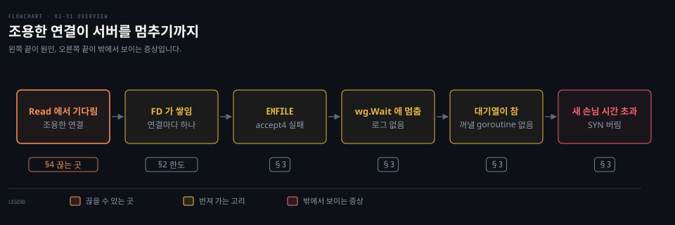
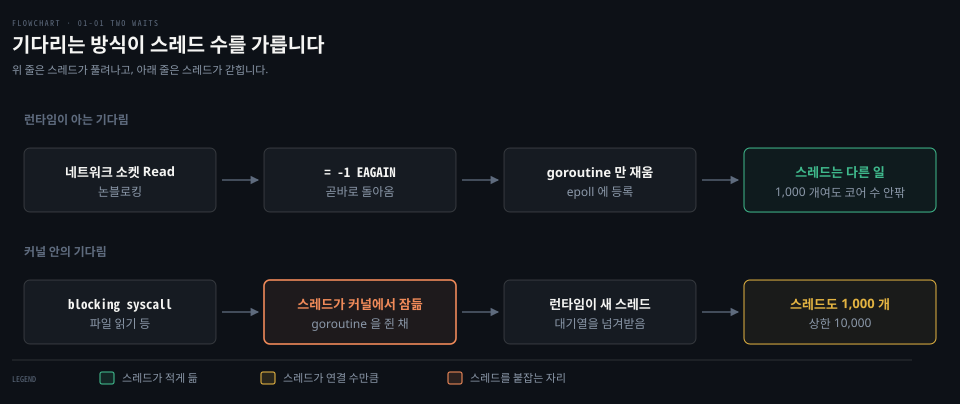
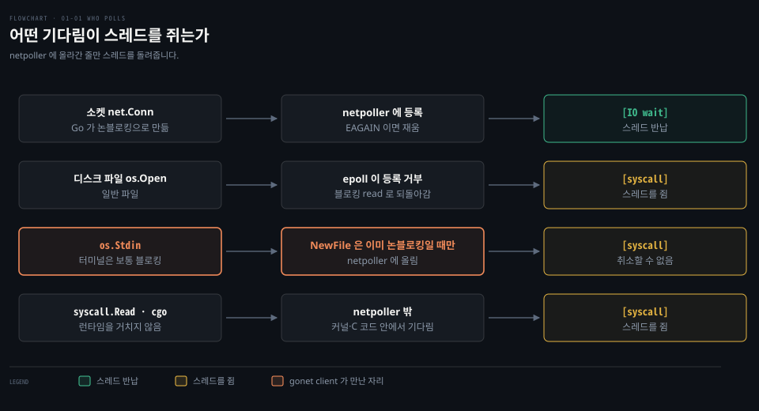
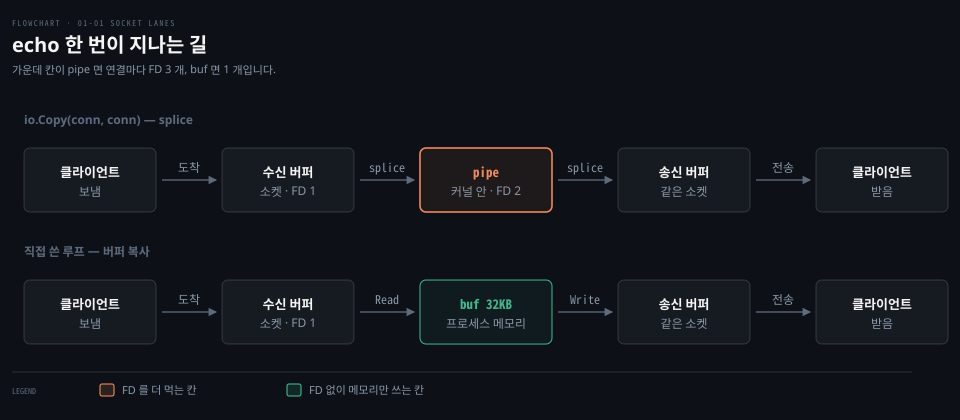
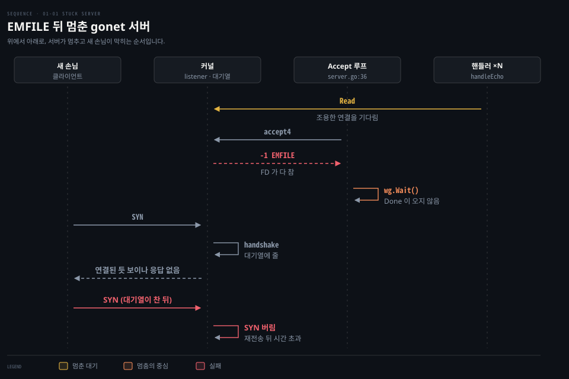
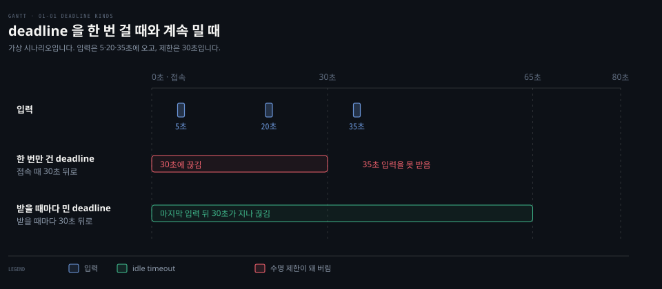

# 조용한 연결이 서버를 멈춘다

---

> 접속만 하고 아무것도 보내지 않는 클라이언트가 쌓이면 Phase 1 을 시작할 때의 gonet 서버는 죽지도 않고 로그도 남기지 않은 채 새 손님을 받지 못하게 됩니다. 이 문서는 그 과정을 goroutine·OS 스레드·FD 한도·WaitGroup 순서로 따라가고, idle timeout 과 Accept 재시도로 고친 결과까지 Phase 3 실측으로 확인합니다.

## 학습 목표와 범위

> 이 문서를 읽고 나면 "프로세스는 살아 있는데 새 접속만 시간 초과로 실패한다"는 증상을 보고, 원인 사슬을 거꾸로 짚고 무엇을 고칠지 말할 수 있어야 합니다.

| 목표 | 어떻게 확인하나 |
|---|---|
| 조용한 연결 1,000 개가 OS 스레드를 거의 쓰지 않는 이유를 "런타임이 아는 기다림"으로 설명합니다 | Phase 4 에서 도움 없이 답합니다 |
| FD 가 찬 뒤 gonet 서버가 에러도 로그도 없이 멈추는 사슬을 결과에서 원인 쪽으로 따라갑니다 | Phase 3 에서 hard limit 을 낮춰 EMFILE 을 재현하고, 증상을 이 사슬로 읽습니다 |
| idle timeout 을 `SetReadDeadline` 으로 걸 때 절대 시각이라는 함정과 시간 값의 트레이드오프를 설명합니다 | Phase 3 에서 idle timeout 을 넣은 서버가 조용한 연결을 끊는지 확인합니다 |
| Accept 가 EMFILE 을 받았을 때 끝내지 않고 쉬었다 다시 받는 이유와 busy loop 를 설명합니다 | Phase 3 에서 재시도 로그의 간격과 회복을 봅니다 |

다루지 않는 것은 Go 스케줄러 내부 구조(G·M·P 는 덤프를 읽을 만큼만 §1 에서 씁니다), epoll 의 동작 방식, 부하 테스트 도구 사용법입니다. EMFILE 이라는 에러의 기본 정의와 accept 대기열이 넘칠 때의 커널 동작은 기존 노트로 넘깁니다.

| 키워드 | 뜻 | 학습 포인트·연결 개념 | 어디서 |
|---|---|---|---|
| 런타임이 아는 기다림 | Go 런타임이 goroutine 을 스레드에서 내려놓고 재울 수 있는 기다림 | 네트워크 소켓 `Read`, channel, mutex | §1 |
| `GOMAXPROCS` | 동시에 Go 코드를 실행하는 스레드 수 | 기본값은 CPU 코어 수 | §1 |
| 기다림 이름표 | goroutine 덤프의 `[IO wait]`·`[syscall]` 같은 표시 | `syscall` 만 스레드를 쥔 기다림 | §1 |
| netpoller | epoll 로 fd 를 지켜보다 준비된 fd 의 goroutine 을 깨우는 런타임 부분 | 디스크 파일·블로킹 stdin 은 여기에 못 오름 | §1 |
| soft·hard limit | 지금 적용되는 FD 한도와 그 천장 | Go 는 soft 를 hard 가까이 스스로 올림 | §2 |
| EMFILE | 프로세스의 FD 가 다 찼다는 에러 | `accept4` 가 새 FD 를 못 붙일 때 | §3 |
| `sync.WaitGroup` | goroutine 이 끝나기를 세어 기다리는 도구 | 세기만 하고 goroutine 을 멈추지 못함 | §3 |
| splice | 두 fd 사이의 데이터를 커널 밖으로 꺼내지 않고 옮기는 syscall | `io.Copy(conn, conn)` 이 고르고, 연결마다 pipe(FD 2 개)를 쥠 | §3 |
| idle timeout | 일정 시간 입력이 없으면 연결을 끊는 규칙 | 짧으면 정상 사용자를 끊고, 길면 자원을 오래 쥠 | §4 |
| `SetReadDeadline` | 그 시각이 지나면 `Read` 를 에러로 돌려보내는 설정 | 절대 시각이라 매번 뒤로 밀어야 idle timeout 이 됨 | §4 |
| backoff | 실패가 이어질수록 다시 시도하기 전 쉬는 시간을 늘리는 방식 | 곧바로 다시 부르면 busy loop | §4 |
| CLOSE-WAIT | 상대의 FIN 을 받았는데 내 쪽이 아직 `close()` 하지 않은 TCP 상태 | 타이머가 없어 닫을 때까지 남음 | §4 |

아래는 이 문서 전체를 한 줄의 사슬로 이은 지도입니다. 왼쪽 끝의 조용한 연결 하나가 오른쪽 끝의 "새 손님이 시간 초과"까지 어떻게 번지는지, 각 고리를 어느 절이 다루는지 적었습니다.



고리 가운데 끊을 수 있는 곳은 맨 앞의 `Read` 입니다. §4 가 그 자리를 다룹니다.


## 1. goroutine 1,000 개가 기다려도 OS 스레드는 적습니다

> 네트워크 소켓의 `Read` 는 런타임이 아는 기다림이라 기다리는 goroutine 은 스레드를 붙잡지 않습니다. 커널 안에서 기다리는 blocking syscall 만 스레드를 붙잡습니다.

echo 서버에 클라이언트 1,000 개가 붙어 모두 조용히 있으면 서버에는 연결마다 하나씩 핸들러 goroutine 1,000 개가 떠서 각자 `Read` 에서 기다립니다. 이때 OS 스레드도 1,000 개가 필요할까요? 답하려면 goroutine 이 스레드 위에서 어떻게 움직이는지부터 알아야 합니다.

### goroutine 은 "돌고 있거나" "기다리고" 있습니다

Go 런타임은 OS 스레드 몇 개를 일꾼처럼 두고 goroutine 을 그 일꾼이 처리할 일감으로 다룹니다. 일꾼 하나는 한 번에 일감 하나만 실행하므로 차례를 기다리는 일감은 대기열에 세워 둡니다.

동시에 Go 코드를 실행하는 일꾼 수는 `GOMAXPROCS` 가 정합니다. 기본값은 CPU 코어 수입니다. Linux 에서는 `go.mod` 의 go 버전이 1.25 이상인 모듈이면 컨테이너 CPU 한도도 반영합니다.[^gomaxprocs] gonet-lab 의 `go.mod` 는 `go 1.25.1` 이라 여기에 해당합니다.

goroutine 은 두 상태를 오갑니다. 스레드 위에서 코드가 실제로 실행되고 있으면 "돌고 있다"고 하고 데이터가 오거나 잠금이 풀릴 때까지 더 나아갈 수 없으면 "기다린다"고 합니다. 스레드를 붙잡느냐는 기다리는 방식에 달려 있습니다.

| 기다리는 방식 | 예 | 스레드는 |
|---|---|---|
| 런타임이 아는 기다림 | 네트워크 소켓의 `Read`, channel 받기, mutex | 런타임이 goroutine 을 스레드에서 내려놓고 재웁니다. 스레드는 다른 goroutine 을 잡습니다 |
| 커널 안의 기다림 | blocking syscall | 스레드가 goroutine 을 쥔 채 커널에 들어가 잠듭니다. 런타임은 그 goroutine 을 떼어 낼 수 없습니다 |



위 줄이 조용한 클라이언트 1,000 개의 경우입니다. Go 는 소켓을 논블로킹으로 만듭니다. 논블로킹 소켓은 읽을 데이터가 없을 때 기다리지 않고 곧바로 "지금은 없음"(`EAGAIN`)을 돌려주는 소켓입니다. `Read` 는 곧바로 `EAGAIN` 을 받고 런타임이 goroutine 을 재운 뒤 스레드를 다른 일에 씁니다. 이 과정은 [00-02](./00-02.strace%20%EC%99%80%20proc%20%EB%A1%9C%20%EC%9D%BD%EC%9D%80%20%EA%B2%83%20-%20%EC%8B%A4%EC%8A%B5%EC%97%90%EC%84%9C%20%EB%A7%8C%EB%82%9C%20syscall%C2%B7FD%C2%B7TCP%20%EC%83%81%ED%83%9C.md) §2 가 strace 출력으로 보였습니다. 그러니 1,000 개가 기다려도 스레드는 코어 수 안팎이면 됩니다.

아래 줄은 다릅니다. goroutine 이 blocking syscall 안에서 잠들면 그 스레드도 함께 갇힙니다. 대기열의 다른 goroutine 을 계속 돌리려면 다른 스레드가 이어받아야 합니다. 놀고 있는 스레드가 없으면 런타임이 새로 만듭니다. Go 문서도 "실행할 준비가 된 goroutine 이 있는데 기존 스레드가 모두 syscall 에 막혀 있을 때만 새 스레드를 만든다"고 적습니다.[^maxthreads] blocking syscall 에 갇힌 goroutine 이 1,000 개면 스레드도 1,000 개 가까이 생깁니다. 기본 상한인 10,000 개를 넘으면 프로그램이 죽습니다.

### 기다림의 이름표 - EAGAIN 과 goroutine 덤프의 `[IO wait]`·`[syscall]`

`Read` 가 `EAGAIN` 을 받았는지는 strace 로 보입니다. 그런데 떠 있는 서버에서 goroutine 1,000 개가 저마다 무엇을 기다리는지는 어떻게 알까요? 기다림에는 두 층의 이름이 붙습니다. 하나는 syscall 이 돌려주는 에러 코드이고 다른 하나는 런타임이 goroutine 에 붙이는 기다림 이름표입니다.

에러 코드는 커널이 논블로킹 fd 에 "지금은 못 한다"고 답하는 말입니다. Go 런타임은 이 답을 받으면 goroutine 을 재우는 쪽으로 처리합니다.

| 에러 코드 | 뜻 | 런타임의 처리 |
|---|---|---|
| `EAGAIN` (`EWOULDBLOCK`) | 읽을 데이터나 쓸 자리가 아직 없음 | fd 를 netpoller 에 맡기고 goroutine 을 재웁니다 |
| `EINPROGRESS` | 논블로킹 `connect` 가 진행 중 | 쓰기 가능 알림이 올 때까지 netpoller 에서 재웁니다 |
| `EINTR` | 시그널이 syscall 을 끊음 | 같은 syscall 을 다시 부릅니다 |

netpoller 는 런타임 안에서 epoll 로 여러 fd 를 한꺼번에 지켜보다가, 준비된 fd 를 기다리던 goroutine 을 깨우는 부분입니다.

기다림 이름표는 goroutine 덤프에서 보입니다. goroutine 덤프는 떠 있는 goroutine 마다 스택을 찍은 출력입니다. 프로세스에 `SIGQUIT` 를 보내면 덤프를 찍고 종료합니다. 코드 안에서는 `runtime/pprof` 의 goroutine 프로파일로 종료 없이 얻습니다. 덤프의 goroutine 머리줄은 `goroutine 7 [IO wait]:` 처럼 생겼습니다. 대괄호 안이 이름표입니다. 이름표 문자열은 go1.25.1 의 `runtime/runtime2.go` 에 정의돼 있습니다.[^waitreason]

| 이름표 | 무엇을 기다리나 | 스레드 |
|---|---|---|
| `IO wait` | netpoller 에 맡긴 fd | 반납 |
| `chan receive` · `chan send` · `select` | channel 연산 | 반납 |
| `sync.Mutex.Lock` · `sync.WaitGroup.Wait` · `sync.Cond.Wait` · `semacquire` | 동기화 도구 | 반납 |
| `sleep` | `time.Sleep` 의 타이머 | 반납 |
| `syscall` | 커널 안에 들어간 syscall 이나 cgo 호출. 이름표가 아니라 goroutine 상태입니다 | 쥔 채 |

`syscall` 을 뺀 나머지는 모두 런타임이 아는 기다림입니다. 이름표는 함수 이름이 아니라 멈춘 이유입니다. goroutine 을 재우는 런타임 함수(`gopark`)가 재우는 순간에 붙입니다.

같은 goroutine 도 덤프를 뜬 시점에 따라 이름표가 달라집니다. `io.Copy` 를 하던 goroutine 이라도 소켓 데이터를 기다리는 중이면 `IO wait` 이고 복사하는 중이면 `running` 입니다. §3 에서 멈춘 gonet 서버를 덤프해 보니 Accept 루프를 돌던 goroutine 은 `sync.WaitGroup.Wait` 에, 핸들러들은 `IO wait` 에 서 있었습니다(관련 실습의 실험 4).

덤프 머리줄의 `m=` 칸은 그 goroutine 이 지금 어느 OS 스레드에 올라가 있는지 보여 줍니다. Go 런타임은 스케줄러를 세 글자로 설명합니다. `runtime/proc.go` 주석에 따르면 G 는 goroutine, M 은 OS 스레드("machine"), P 는 Go 코드를 실행할 자리입니다. P 의 개수가 `GOMAXPROCS` 입니다. `m=nil` 이면 스레드에 올라가 있지 않고 `m=2` 면 2 번 스레드를 쥐고 있습니다.

Phase 3 의 client 덤프에서 우리 코드의 goroutine 셋 가운데 `m=` 에 숫자가 붙은 것은 stdin 을 읽는 `[syscall]` goroutine 뿐이었습니다. 런타임이 띄운 시그널 대기 goroutine 도 `[syscall]` 이라 스레드 하나를 쥐고 있었습니다.

### EAGAIN 없이 스레드가 막히는 곳 - 디스크 파일·stdin·syscall 직접 호출·cgo

위 표의 마지막 줄인 `syscall` 상태는 실제로 어디서 생길까요? Go 는 모든 fd 를 netpoller 에 올리지 않습니다. netpoller 에 올라가지 못한 fd 는 논블로킹이 아니어서 커널이 `EAGAIN` 으로 돌려보내지 않고 스레드째 그 자리에서 재웁니다.

어느 fd 를 올릴지는 `os/file_unix.go` 의 `newFile` 이 정합니다.[^newfile] `os.Open` 으로 연 파일은 일단 올리려고 시도합니다. 하지만 Linux 의 epoll 은 일반 디스크 파일 등록을 거부하므로 블로킹 read·write 로 되돌아갑니다. 소스 주석도 등록 실패의 예로 "disk files on Linux systems" 를 듭니다. `os.NewFile` 로 감싼 fd 는 이미 논블로킹일 때만 올립니다. `os.Stdin` 이 이 길로 만들어집니다. 터미널은 보통 블로킹이라 netpoller 밖에 남습니다.

| 경우 | netpoller 에 못 오르는 이유 | 스레드 |
|---|---|---|
| 소켓 (`net.Conn`) | 오릅니다. Go 가 논블로킹으로 만듭니다 | 반납 |
| 디스크 파일 (`os.Open`) | epoll 이 일반 파일 등록을 거부합니다 | 쥔 채 |
| `os.Stdin` (터미널) | `NewFile` 은 이미 논블로킹인 fd 만 올립니다 | 쥔 채 |
| 블로킹 fd 에 `syscall.Read` 직접 호출 | `os`·`net` 을 거치지 않아 런타임이 모릅니다 | 쥔 채 |
| cgo 호출 | C 코드 안의 기다림은 런타임이 떼어 낼 수 없습니다[^maxthreads] | 쥔 채 |



셋째 줄이 gonet client 가 만난 자리입니다. `client.go` 는 stdin 을 읽는 goroutine 을 따로 두고 "stdin 읽기는 취소할 방법이 없다"고 주석을 달았습니다. 그 goroutine 은 `syscall` 상태로 스레드 하나를 쥐고 있습니다. 소켓처럼 닫아서 깨울 수도 없습니다. 그래서 client 는 이 goroutine 을 기다리지 않고 돌아오도록 짰습니다.

두 줄의 차이는 예제 하나로 드러납니다. 아래 코드는 같은 goroutine 100 개를 한 번은 TCP `Read` 에서, 한 번은 블로킹 pipe 의 `syscall.Read` 에서 기다리게 합니다. 전체 코드는 `gonet-lab/experiments/phase1-two-waits/main.go` 에 있습니다.

```go
switch mode {
case "net":
	ln, _ := net.Listen("tcp", "127.0.0.1:0")
	go func() {
		for {
			c, _ := ln.Accept()
			// 받기만 하고 아무것도 보내지 않는다
			_ = c
		}
	}()
	for i := 0; i < n; i++ {
		c, _ := net.Dial("tcp", ln.Addr().String())
		go func() {
			buf := make([]byte, 1)
			// 데이터가 오지 않으니 영원히 기다린다
			c.Read(buf)
		}()
	}
case "pipe":
	for i := 0; i < n; i++ {
		// syscall.Pipe 는 블로킹 fd 를 돌려준다. os.File 로 감싸지 않았으니 netpoller 를 거치지 않는다.
		var p [2]int
		syscall.Pipe(p[:])
		go func() {
			buf := make([]byte, 1)
			// 쓰는 쪽이 없으니 커널 안에서 멈춘다
			syscall.Read(p[0], buf)
		}()
	}
}
time.Sleep(time.Second)
```

1 초 뒤 프로그램은 `pprof.Lookup("threadcreate").Count()` 로 만든 OS 스레드 수를 세고 goroutine 프로파일을 덤프 형식으로 찍어 이름표별로 셉니다. 아래는 문서를 쓰면서 코드가 도는지 확인하려고 OrbStack `ubuntu` 에서 한 번 돌린 출력입니다. 학습자의 실습 기록은 [관련 실습](#관련-실습)에 따로 남깁니다.

```bash
mode=net  goroutines=102 threads=8    wait reasons: map[IO wait:101 running:1]
mode=pipe goroutines=101 threads=103  wait reasons: map[running:1 syscall:100]
```

두 모드 모두 goroutine 100 개가 기다립니다. `net` 은 스레드 8 개로 버팁니다. `IO wait` 가 101 인 것은 Accept 루프 goroutine 까지 셌기 때문입니다. `pipe` 는 `syscall` 상태의 goroutine 마다 스레드가 하나씩 붙어 103 개가 됐습니다. 위 도식의 첫 줄과 나머지 줄의 차이가 이 숫자입니다.

막혔던 자리: 스레드가 적은 이유를 "goroutine 은 유저 스레드라서"까지만 말했습니다. 기다리는 goroutine 이 스레드를 붙잡는지는 기다리는 방식이 가른다는 것이 빠져 있었습니다. 그 뒤 `EAGAIN` 말고 기다림을 가르는 말은 무엇인지, `EAGAIN` 없이 스레드가 막히는 때는 언제인지를 물었습니다. 이 절의 두 `###` 는 그 질문에 설명으로 답한 내용입니다(도움받은 응답).


## 2. FD 한도는 두 겹이고, Go 는 스스로 올립니다

> 한도는 soft 와 hard 두 겹이고 Go 프로그램은 시작할 때 soft 를 hard 바로 아래까지 올립니다. 그래서 셸의 `ulimit -n` 이 아니라 프로세스의 `/proc/<pid>/limits` 가 실제 한도입니다.

§1 에 따르면 조용한 연결은 스레드는 거의 쓰지 않습니다. 하지만 연결마다 FD 하나는 반드시 씁니다([00-01](./00-01.listener%20%EC%86%8C%EC%BC%93%EA%B3%BC%20%EC%97%B0%EA%B2%B0%20%EC%86%8C%EC%BC%93.md) §4). 그러면 FD 는 몇 개까지 쓸 수 있을까요?

프로세스가 열 수 있는 FD 수에는 두 겹의 한도가 있습니다.

| 한도 | 뜻 | 보는 곳 |
|---|---|---|
| soft limit | 지금 적용되는 값. 프로세스가 hard 까지 스스로 올릴 수 있음 | `ulimit -Sn` |
| hard limit | soft 를 올릴 수 있는 천장 | `ulimit -Hn` |
| 실제 적용값 | 떠 있는 프로세스에 걸린 soft·hard | `/proc/<pid>/limits` 의 `Max open files` |

많은 Linux 배포판이 soft 를 1,024 로 두는 것은 옛 syscall 인 select 때문입니다. select 는 여러 FD 를 한꺼번에 기다리면서 FD 번호를 크기가 고정된 비트맵에 담습니다. 번호가 그 크기를 넘으면 select 를 쓰는 옛 프로그램이 깨지므로 호환을 위해 soft 를 낮게 둡니다. 이름이 같은 Go 문법의 `select` 문(여러 channel 을 기다리는 구문)과는 관계없습니다.

Go 는 Linux 에서 select 대신 epoll 을 쓰므로 이 제약을 따를 이유가 없습니다. Go 프로그램은 시작할 때 soft 가 `hard - 1` 보다 낮으면 soft 를 `hard - 1` 로 올립니다. go1.25 소스 `syscall/rlimit.go` 의 주석이 "Go 는 select 를 쓰지 않으니 이 낮은 한도를 따를 이유가 없다"고 그 이유를 적어 둡니다.[^go-rlimit] 셸에서 `ulimit -n` 이 1,024 로 보여도 gonet 은 실제로 hard 까지 열 수 있다는 뜻입니다.

2026-09-27 에 이 랩의 OrbStack `ubuntu` 에서 재 보니 soft 와 hard 가 모두 1,048,576 이었습니다. 이 머신에서는 조용한 클라이언트 1,000 개로 한도에 닿지 않습니다. §3 의 멈춤을 재현하려면 한도를 일부러 낮춰야 합니다. soft 만 낮추면 Go 가 도로 올리므로 낮출 쪽은 hard 입니다.

Phase 3 에서 셸의 soft 를 1,024 로 낮추고 서버를 띄우자 서버의 `/proc/<pid>/limits` 에는 soft 1,048,575(hard − 1)가 걸려 있었습니다. EMFILE 이라는 에러 이름과 `RLIMIT_NOFILE` 의 기본 정의는 [learning-modern-linux 07-02](../../book/learning-modern-linux/07-02.%ED%8F%AC%ED%8A%B8%EA%B0%80%20%EC%9E%88%EC%96%B4%EC%95%BC%20%EC%84%9C%EB%B9%84%EC%8A%A4%EB%A5%BC%20%EA%B0%80%EB%A6%AC%ED%82%AC%20%EC%88%98%20%EC%9E%88%EA%B3%A0%20%EC%9D%B4%EB%A6%84%EC%9D%B4%20%EC%9E%88%EC%96%B4%EC%95%BC%20%EC%82%AC%EB%9E%8C%EC%9D%B4%20%EA%B8%B0%EC%96%B5%ED%95%9C%EB%8B%A4.md) §4 「소켓이 read 와 write 로 다뤄지는 이유」에 있습니다.

이때 셸에서 `ulimit -Sn` 을 다시 치면 여전히 1,024 입니다. 한도는 프로세스마다 따로 있고 자식은 부모의 값을 물려받기만 합니다. 서버가 자기 한도를 올려도 서버를 띄운 셸은 바뀌지 않습니다. 서버의 실제 한도는 셸이 아니라 서버의 `/proc/<pid>/limits` 로 봅니다.

Go 가 hard − 1 까지만 올리는 이유는 같은 `rlimit.go` 주석에 있습니다. 다른 프로세스가 `prlimit` 로 이 프로세스의 한도를 바꾸면 보통 soft 를 hard 와 같게 맞추므로, 1 을 빼 두면 누가 바꿨는지 알아챌 수 있습니다.

`prlimit` 는 pid 를 지정해 떠 있는 프로세스의 한도를 읽고 바꾸는 syscall 이자 명령입니다. 재시작할 수 없는 서버가 `too many open files` 를 낼 때 그 자리에서 한도를 올리는 데 씁니다. 같은 조건 때문에 soft 가 이미 hard 와 같으면 Go 는 손대지 않습니다. `ulimit -n 64` 는 soft 와 hard 를 둘 다 64 로 맞추므로 Phase 3 의 서버는 `64 64` 로 떴습니다.

막혔던 자리: 한도를 "보통 1,024"로 알고 있었습니다. 그 값은 배포판의 soft 기본값이고 Go 프로그램에는 hard 가 실제 한도라는 점이 새로 드러났습니다. Phase 3 에서는 셸에 찍힌 1,024 를 서버의 값으로 읽었다가 바로잡았습니다.


## 3. FD 가 차면 gonet 은 죽지도 않고 로그도 없이 멈춥니다

> FD 가 다 차면 `Accept` 가 EMFILE 로 돌아오고 에러 분기의 `wg.Wait()` 가 조용한 핸들러들을 영원히 기다립니다. 그동안 listener 는 열린 채라 새 손님은 연결은 되어도 응답을 받지 못하고 대기열까지 차면 시간 초과로 끝납니다.

이 절의 코드는 Phase 1 을 시작할 때의 `server.go` 이고, §4 에서 고칩니다. 운영 중인 서버에서 이런 보고가 들어왔다고 해 봅니다. 프로세스는 살아 있고 에러 로그도 없습니다. 그런데 새 클라이언트는 한동안 응답을 기다리다 시간 초과로 실패합니다. `ss` 로 보니 데이터가 오가지 않는 ESTAB 연결이 한도만큼 붙어 있습니다. 이 증상을 설명하려면 gonet 의 Accept 루프가 어떻게 도는지부터 봐야 합니다.

### Accept 루프는 한 바퀴마다 Accept 에서 멈춥니다

`server.go` 의 Serve 는 끝나지 않는 `for` 루프입니다. 쉬지 않고 도는 것 같지만 매 바퀴 맨 위의 `ln.Accept()` 에서 새 연결이 올 때까지 멈춥니다. 연결 하나가 오면 한 바퀴를 돌고 다시 `Accept` 로 돌아갑니다.

```go
// Phase 1 시작 시점의 server.go Serve 를 줄여 옮김 (§4 에서 고치기 전)
for {
	// 연결이 올 때까지 여기서 멈춤
	conn, err := ln.Accept()
  
	if err != nil {
		// 에러면 핸들러가 모두 끝나기를 기다렸다가 돌아감
		wg.Wait()
		// ... 종료 신호면 nil, 아니면 err 를 돌려줌
	}
  
	// 기다릴 것 하나 추가, 이 연결 전용 goroutine 을 띄우고 곧바로 맨 위로
	wg.Add(1)
	go func() {
		defer wg.Done()
		handleEcho(conn, logger)
	}()
}
```

연결 하나가 들어올 때마다 `wg.Add(1)` 과 핸들러 goroutine 이 하나씩 생깁니다. 핸들러가 부르는 `handleEcho` 안에는 서버 쪽 `io.Copy(conn, conn)` 이 있었습니다(고치기 전 코드). 이 한 줄이 echo 의 본체입니다.

`io.Copy(dst, src)` 는 src 에서 읽어 dst 에 쓰기를 EOF 까지 반복합니다. 같은 `conn` 을 두 번 넘겨도 섞이지 않는 것은 소켓 하나 안에 수신 버퍼와 송신 버퍼 두 차선이 따로 있기 때문입니다. 읽으면 클라이언트가 보낸 것이 수신 버퍼에서 나오고, 쓰면 송신 버퍼를 거쳐 클라이언트에게 갑니다. 클라이언트가 조용하면 이 안의 `Read` 에서 기다립니다.

`sync.WaitGroup` 은 goroutine 을 제어하지 않고 세기만 합니다. `Add` 가 하나 더하고 `Done` 이 하나 빼며 `Wait` 는 그 수가 0 이 될 때까지 기다립니다. goroutine 을 멈추거나 끝내는 기능은 없습니다.

### 연결 하나가 쓰는 FD 는 셋입니다 - io.Copy 의 splice 와 pipe

§2 까지는 연결 하나에 FD 하나로 셈했습니다. 그런데 Phase 3 에서 조용한 연결 100 개를 붙인 서버의 FD 는 307 개였습니다. 연결 소켓 100 개와 listener 1 개 말고도 pipe 가 200 개 있었습니다.

| FD | 개수 | 무엇인가 |
|---|---|---|
| 0~2 | 3 | 표준 입출력 |
| `/sys/fs/cgroup/.../cpu.max` | 1 | CPU 한도 파일. go1.25 런타임이 열어 두고 `GOMAXPROCS` 를 정합니다 |
| `anon_inode:[eventpoll]` | 1 | netpoller 가 쓰는 epoll |
| `anon_inode:[eventfd]` | 1 | 자고 있는 netpoller 를 깨우는 알림용 fd |
| listener 소켓 | 1 | |
| 연결 소켓 | 100 | 연결마다 1 |
| pipe | 200 | 연결마다 2 |

pipe 는 커널 안의 한 방향 버퍼로, 입구 fd 와 출구 fd 가 있어 하나가 FD 두 개를 씁니다. 이 pipe 는 우리 코드가 만든 게 아니고 `io.Copy(conn, conn)` 아래의 표준 라이브러리가 만듭니다. `io.Copy` 는 src 가 `WriterTo` 를, dst 가 `ReaderFrom` 을 구현했는지 차례로 보고 구현한 쪽에 복사를 맡깁니다. TCP 연결은 둘 다 구현하며 소켓에서 소켓으로의 복사는 결국 dst 의 `ReadFrom` 으로 넘어갑니다. 이 원리는 [lgo 07-04](../../../01_language/book/lgo_learning-go/07-04.%ED%83%80%EC%9E%85%20%EB%8B%A8%EC%96%B8%EC%9D%80%20%EC%95%84%EA%BB%B4%20%EC%93%B0%EA%B3%A0%20%EC%95%94%EB%AC%B5%20%EC%9D%B8%ED%84%B0%ED%8E%98%EC%9D%B4%EC%8A%A4%EB%A1%9C%20%EC%9D%98%EC%A1%B4%EC%84%B1%EC%9D%84%20%EC%A3%BC%EC%9E%85%ED%95%A9%EB%8B%88%EB%8B%A4.md) §2 「선택적 인터페이스」에 있습니다.

`TCPConn.ReadFrom` 은 src 도 TCP 연결이면 splice 를 고릅니다. splice 는 두 fd 사이의 데이터를 커널 밖으로 꺼내지 않고 옮기는 syscall 입니다. 다만 한쪽이 반드시 pipe 여야 하므로 소켓 → pipe → 소켓 으로 옮기려고 pipe 하나를 확보해 복사가 끝날 때(EOF·에러)까지 쥐고 있습니다.[^splice] 조용한 연결의 복사는 끝나지 않으니 pipe 도 계속 잡혀 있습니다. 복사가 끝나도 pipe 는 곧바로 닫히지 않고 재사용 풀(`sync.Pool`)로 돌아갑니다. 그 FD 는 나중에 GC 가 정리할 때 닫힙니다.



위 줄이 이 절의 서버입니다. 가운데 칸이 pipe 라 연결마다 FD 가 3 개(소켓 1 + pipe 2)입니다. 아래 줄은 §4 에서 고친 뒤의 모습입니다. 수용할 수 있는 연결 수로 바꿔 보면 차이가 큽니다. 한도가 300 이면 늘 열린 7 개를 빼고 (300 − 7) ÷ 3, 약 97 개에서 멈춥니다. 연결마다 1 개였다면 293 개입니다.

Phase 3 에서 hard 를 64 로 낮추고 연결 30 개를 붙이자 서버는 계산값 19 개보다 많은 21 개를 받았습니다. pipe 는 36 개, 즉 18 연결 몫이었습니다. accept 루프가 소켓을 먼저 받아 두는 사이 핸들러들이 pipe 를 나중에 만들다 FD 가 모자랐던 것입니다. pipe 를 못 만든 핸들러 3 개는 죽지 않았습니다. splice 가 "처리 못 함"을 돌려주면 `io.Copy` 는 보통 복사로 넘어가므로, 이 3 개는 소켓 FD 하나로 동작했습니다.

### 결과에서 원인으로 거슬러 오르면

FD 가 다 차면 커널은 새 연결에 FD 를 붙이지 못해 `accept4` 에 EMFILE 을 돌려줍니다.[^accept2] Go 에서는 이것이 `ln.Accept()` 의 `err` 가 되고 루프는 에러 분기로 들어가 `wg.Wait()` 를 부릅니다. 여기서부터 기다림이 사슬로 이어집니다.

1. 핸들러 goroutine 들은 조용한 클라이언트를 기다리며 `io.Copy` 의 `Read` 에 머뭅니다.
2. 그 탓에 `handleEcho` 가 끝나지 않고 `defer conn.Close()` 와 `defer wg.Done()` 이 실행되지 않습니다.
3. `Done` 이 오지 않으니 `wg.Wait()` 가 돌아오지 않습니다.
4. `return err` 에 닿지 못하므로 `main.go` 의 에러 로그도 남지 않습니다. 이 로그는 `Serve` 가 돌아온 뒤에야 찍힙니다. 프로세스도 그대로 살아 있습니다.

인과의 방향이 중요합니다. `wg.Wait()` 에 멈춘 것이 핸들러를 막는 게 아니라, 핸들러가 끝나지 않아서 `wg.Wait()` 가 멈춘 것입니다.

Phase 3 에서 멈춘 서버를 덤프하니 핸들러 21 개는 `IO wait`, Accept 루프 하나는 `sync.WaitGroup.Wait` 였습니다. FD 에 여유가 있을 때는 Accept 루프도 listener 를 기다리는 `IO wait` 라서 핸들러 100 개와 합쳐 101 개가 `IO wait` 였습니다. EMFILE 뒤에는 같은 goroutine 이 `wg.Wait()` 줄로 옮겨 이름표가 바뀐 것입니다. 에러 로그는 0 줄이었고 프로세스는 살아 있었습니다. 이 사슬은 [00-03](./00-03.Go%20%EB%AC%B8%EB%B2%95%20-%20goroutine%C2%B7io.Copy%C2%B7context%C2%B7WaitGroup.md) §4 의 "기다림의 사슬"과 같은 모양입니다.

### 새 손님이 거절되지 않고 시간 초과로 끝나는 이유

아무도 `Accept` 를 부르지 않는 동안에도 listener 는 닫히지 않았습니다. 커널은 새 SYN 이 오면 handshake 를 끝내고 accept 대기열에 줄을 세웁니다. FD 는 `accept4` 가 꺼낼 때 붙으므로 줄을 서는 데는 FD 가 필요 없습니다.

먼저 줄 선 클라이언트는 연결이 성립한 것처럼 보이지만 아무도 꺼내 주지 않아 응답을 받지 못합니다. Phase 3 에서 서버가 21 개만 받았는데도 클라이언트 30 개는 모두 연결에 성공했고, listener 의 `Recv-Q` 에 나머지 9 개가 보였습니다. 그 뒤 붙은 `gonet connect` 도 연결은 됐지만 `hello` 가 돌아오지 않았습니다.

TCP 상태로는 대기열에 선 연결과 accept 된 연결이 구분되지 않습니다. handshake 가 끝났으니 둘 다 ESTABLISHED 입니다. accept 는 TCP 쪽 일이 아닙니다. 앱과 커널 사이에서 대기열의 연결 하나에 FD 를 붙여 앱에 넘겨주는 일입니다.

| | accept 전 | accept 후 |
|---|---|---|
| TCP 상태 (`ss`) | ESTABLISHED | ESTABLISHED |
| 있는 곳 | listener 의 accept 대기열(LISTEN 줄의 `Recv-Q`) | 앱의 연결 소켓 |
| FD | 없음 | 있음 |

줄이 backlog 만큼 차면 커널은 기본 설정에서 그다음 SYN 을 거절하지 않고 버립니다. 클라이언트는 SYN 을 몇 번 다시 보내다가 시간 초과로 끝납니다. `net.ipv4.tcp_abort_on_overflow` 를 1 로 켠 머신이라면 버리는 대신 RST 로 끊어, 시간 초과 대신 곧바로 거절로 보입니다. 대기열이 넘칠 때의 커널 동작은 [systems-performance 10-02](../../book/systems-performance/10-02.%EB%84%A4%ED%8A%B8%EC%9B%8C%ED%81%AC%20%E2%80%94%20%EC%95%84%ED%82%A4%ED%85%8D%EC%B2%98.md) §4 「연결 큐가 둘인 까닭」의 표에 정리돼 있습니다.



도식은 멈춘 순간의 서버입니다. 핸들러들은 `Read` 에, Accept 루프는 `wg.Wait()` 에 멈춰 있어서 대기열에서 꺼내 갈 goroutine 이 하나도 없습니다. 루프가 다시 `Accept` 를 불러도 FD 가 없으니 또 EMFILE 입니다. 이 멈춤을 풀려면 FD 를 돌려받는 수정과 Accept 루프가 일시 에러에서 멈추지 않는 수정이 함께 있어야 합니다. 연결이 쌓여 서비스가 조용히 멈춘 실무 사례는 [CPU 는 노는데 응답이 끊긴 서비스](../../../troubleshooting/runtime/2026-09-10_CPU%20%EB%8A%94%20%EB%85%B8%EB%8A%94%EB%8D%B0%20%EC%9D%91%EB%8B%B5%EC%9D%B4%20%EB%81%8A%EA%B8%B4%20%EC%84%9C%EB%B9%84%EC%8A%A4.md)가 다룹니다.

막혔던 자리: FD 가 차는 것을 "goroutine 등록 실패"로 봤고 `wg.Wait()` 에 멈춘 것을 원인으로 읽어 인과를 뒤집었습니다. 서버 쪽 `io.Copy` 가 `handleEcho` 안에 있다는 것도 몰랐습니다. Phase 3 에서는 이 사슬을 도움 없이 이었지만, pipe 가 어디서 왔는지와 ESTABLISHED 와 accept 의 구분은 설명을 받았습니다.


## 4. 조용한 연결은 idle timeout 으로 끊습니다

> 끊을 곳은 사슬 맨 앞의 `Read` 이고, 기준은 "일정 시간 입력이 없음"입니다. `SetReadDeadline` 은 절대 시각이라 받을 때마다 뒤로 밀어야 idle timeout 이 됩니다.

§3 의 사슬은 맨 앞의 `Read` 가 끝나야 풀립니다. `io.Copy` 가 끝나려면 `src` 가 EOF 나 에러를 줘야 합니다. 조용한 클라이언트는 EOF 를 보내 주지 않으니 서버가 스스로 "이 연결은 이제 끊어도 된다"고 판단할 기준이 필요합니다. 표준적인 기준은 일정 시간 동안 아무것도 오지 않으면 끊는 것이고 이를 idle timeout(유휴 시간 제한)이라고 부릅니다. Accept 루프가 EMFILE 에서 끝내지 않고 쉬었다 다시 받게 하는 수정도 이 절에서 함께 다룹니다.

### SetReadDeadline 은 "몇 초 동안"이 아니라 "몇 시에"입니다

Go 에서는 `conn.SetReadDeadline(t)` 로 이 기준을 연결에 겁니다. 시각 `t` 가 지나면 막혀 있던 `Read` 가 더 기다리지 않고 `os.ErrDeadlineExceeded` 를 감싼 에러를 돌려줍니다.[^deadline] 그러면 `io.Copy` 가 에러로 끝나고 §3 의 사슬이 앞에서부터 풀립니다.

시간 길이 대신 시각을 받는 이유는 뜻이 하나로 정해지기 때문입니다. "30 초"라면 언제부터 세는지가 모호합니다. 시각이면 "그 시각이 지나면 이 연결의 읽기는 실패한다"로 끝납니다. 지금 기다리는 `Read` 에도 앞으로 부를 `Read` 에도 똑같이 걸리므로 여러 번의 읽기를 한 마감으로 묶을 수 있습니다. 다른 goroutine 이 지난 시각을 걸어 기다리는 `Read` 를 곧바로 깨울 수도 있습니다. 시간 값의 두 타입 `Duration` 과 `Time` 은 [lgo 13-02](../../../01_language/book/lgo_learning-go/13-02.time%20%EC%9D%80%20Duration%20%EA%B3%BC%20Time%20%EB%91%90%20%ED%83%80%EC%9E%85%EC%9D%B4%EA%B3%A0%20%ED%98%95%EC%8B%9D%EC%9D%80%202006%EB%85%84%201%EC%9B%94%202%EC%9D%BC%20%EA%B8%B0%EC%A4%80%20%EC%8B%9C%EA%B0%81%EC%9C%BC%EB%A1%9C%20%EC%94%81%EB%8B%88%EB%8B%A4.md)에 있습니다.

함정은 `t` 가 절대 시각이라는 점입니다. 접속할 때 "지금부터 30초 뒤"로 한 번만 걸면 부지런히 입력하던 클라이언트도 30초가 되는 순간 끊깁니다. 이러면 idle timeout 이 되지 못하고 연결 전체의 수명 제한이 됩니다.



위 줄이 한 번만 건 deadline 입니다. 입력이 계속 오는데도 처음 정한 시각에 끊깁니다. 아래 줄은 데이터를 받을 때마다 deadline 을 "지금부터 30초 뒤"로 다시 미는 방식입니다. 마지막 입력 뒤 30초가 조용히 지나야 끊기므로 이쪽이 idle timeout 입니다.

그런데 `io.Copy` 는 안에서 `Read` 를 알아서 반복하므로 그 사이에 끼어들어 deadline 을 밀 자리가 없습니다. idle timeout 을 걸려면 `io.Copy` 대신 `Read` → deadline 연장 → `Write` 를 직접 도는 루프로 바꿔야 합니다. Phase 3 에서 `handleEcho` 를 이렇게 고쳤습니다(`server.go:97-128`).

```go
buf := make([]byte, 32*1024)
for {
	// 읽기 직전마다 "지금부터 idle 뒤"로 밀어야 입력이 없는 시간만 잰다
	conn.SetReadDeadline(time.Now().Add(idle))
	r, err := conn.Read(buf)
	if r > 0 {
		// 받은 만큼만(buf[:r]) 그대로 돌려보낸다
		w, werr := conn.Write(buf[:r])
		...
	}
	switch {
	case err == nil:
		continue
	case errors.Is(err, io.EOF):                   // 상대가 FIN 을 보냄
		...
	case errors.Is(err, os.ErrDeadlineExceeded):   // idle 동안 아무것도 안 옴
		logger.Printf("idle timeout remote=%s bytes=%d idle=%s", remote, n, idle)
	...
	}
	return  // defer conn.Close() 가 FD 를 반납하고 핸들러가 끝나 wg.Done 까지 간다
}
```

deadline 은 읽기에만 겁니다. idle timeout 이 막으려는 것은 "상대가 아무것도 보내지 않는 연결"이고 그것이 드러나는 곳이 `Read` 입니다. 상대가 읽지 않아 송신 버퍼가 차서 `Write` 가 멈추는 것은 다른 문제로, 이쪽에는 `SetWriteDeadline` 이 따로 있습니다. `errors.Is` 로 에러를 가리는 방법은 [lgo 09-02](../../../01_language/book/lgo_learning-go/09-02.%EC%98%A4%EB%A5%98%EB%A5%BC%20%EA%B0%90%EC%8B%B8%EB%A9%B4%20%ED%8A%B8%EB%A6%AC%EA%B0%80%20%EB%90%98%EA%B3%A0%20errors.Is%20%EC%99%80%20As%20%EA%B0%80%20%EA%B7%B8%20%EC%95%88%EC%9D%84%20%EC%B0%BE%EC%8A%B5%EB%8B%88%EB%8B%A4.md)에 있습니다.

Phase 3 에서 hard 64, idle 20 초 서버에 조용한 연결 30 개를 붙이자 20 초 뒤 30 개 모두 `idle timeout` 으로 끝났고 서버 FD 는 늘 열린 7 개로 돌아왔습니다. 입력을 계속 보내는 연결이 idle 보다 오래 붙어 있어도 끊기지 않는 것은 테스트(`TestServeKeepsActiveConnPastIdle`)로 확인했습니다.

### 직접 쓴 루프는 pipe 를 쓰지 않습니다 - splice 와 버퍼 복사

고친 서버에 연결 30 개를 붙였을 때 FD 는 37 개(7 + 30)였고 pipe 는 0 개였습니다. §3 도식의 아래 줄입니다. 이번 루프는 `conn.Read(buf)` 로 우리 버퍼에 읽고 `conn.Write(buf[:r])` 로 거기서 씁니다. 데이터가 커널과 프로세스 사이를 한 번 오가는 보통 복사라 splice 를 탈 일이 없습니다.

| | splice (`io.Copy(conn, conn)`) | 버퍼 복사 (직접 쓴 루프) |
|---|---|---|
| 데이터가 가는 길 | 소켓 → pipe → 소켓, 모두 커널 안 | 소켓 → `buf` → 소켓, 커널과 프로세스 사이를 한 번 왕복 |
| 연결당 FD | 3 | 1 |
| 연결당 메모리 | pipe 버퍼 (커널) | `buf` 32KB (프로세스) |
| 좋은 점 | 복사가 줄어 큰 데이터에서 CPU 를 덜 씀 | 읽기마다 deadline·로그·내용 검사를 끼울 수 있음 |
| 대가 | 중간에 끼어들 수 없음, Linux 전용 | 왕복 복사 비용 |

echo 처럼 받는 즉시 돌려보내는 작은 데이터에서는 splice 의 이득이 크지 않습니다. 파일을 그대로 흘려보내는 프록시처럼 큰 데이터를 손대지 않고 넘길 때 빛납니다. 커널 쪽 복사 비용과 zero-copy 는 [systems-performance 10-02](../../book/systems-performance/10-02.%EB%84%A4%ED%8A%B8%EC%9B%8C%ED%81%AC%20%E2%80%94%20%EC%95%84%ED%82%A4%ED%85%8D%EC%B2%98.md) 「버퍼와 세그먼테이션 오프로드」에, 같은 계열의 `sendfile(2)` 는 [systems-performance 05-01](../../book/systems-performance/05-01.%EC%95%A0%ED%94%8C%EB%A6%AC%EC%BC%80%EC%9D%B4%EC%85%98%20%E2%80%94%20%EA%B8%B0%EC%B4%88%EC%99%80%20%EC%84%B1%EB%8A%A5%20%EA%B8%B0%EB%B2%95.md) §8 에 있습니다.

### 시간을 얼마로 잡느냐가 트레이드오프입니다

| 값 | 얻는 것 | 잃는 것 |
|---|---|---|
| 짧게 (예: 1초) | 조용한 연결을 빨리 치워 FD·goroutine 을 돌려받음 | 생각하며 천천히 입력하는 정상 사용자까지 끊김 |
| 길게 (예: 1시간) | 느린 사용자도 끊기지 않음 | 치워야 할 연결이 그만큼 오래 자원을 쥠 |

값은 그 서버의 정상 사용 패턴에서 정해집니다. 사람이 키보드로 치는 채팅이면 분 단위가, 기계끼리 주고받는 요청이면 초 단위가 출발점이 됩니다. 어느 값이든 실험으로 확인하기 전에는 추정입니다.

### Accept 에러는 끝내지 않고 쉬었다 다시 받습니다 - backoff

idle timeout 만으로는 §3 의 멈춤이 다 풀리지 않습니다. 고치기 전 에러 분기는 `wg.Wait()` 를 먼저 부르고, 그것을 통과해야 `return err` 에 닿습니다. 결과는 핸들러가 끝나느냐에 따라 갈립니다.

| 버전 | EMFILE 이 나면 | 결과 |
|---|---|---|
| 고치기 전 (idle timeout 없음) | 핸들러가 끝나지 않아 `wg.Wait()` 가 영원히 기다림 | 멈춤. 죽지 않고 로그도 없음 |
| idle timeout 만 넣음 | idle 뒤 핸들러가 끝나 `wg.Wait()` 통과 → `return err` | idle 뒤 서버 프로세스가 끝남 |
| Accept 재시도까지 넣음 | 로그를 남기고 쉬었다가 다시 `Accept` | FD 가 풀리면 스스로 회복 |

멈추는 것도 죽는 것도 원하는 동작이 아닙니다. 에러를 두 부류로 나눕니다. `net.ErrClosed` 는 우리 코드가 listener 를 이미 닫았다는 뜻이고(상대가 닫았다는 뜻이 아닙니다), Ctrl-C 로 서버를 끄는 정상 경로에서 납니다. 다시 불러도 같은 에러이므로 끝냅니다. EMFILE 은 다른 연결이 끝나 FD 가 반납되면 풀립니다. idle timeout 을 넣었으니 조용한 연결은 언젠가 반드시 끝납니다. EMFILE 이면 끝내지 않고 다시 받습니다(`server.go:39-66`).

```go
var delay time.Duration
for {
	conn, err := ln.Accept()
	if err != nil {
		if ctx.Err() != nil || errors.Is(err, net.ErrClosed) {
			wg.Wait()
			return nil
		}
		// 5ms 에서 시작해 실패마다 두 배, 1s 를 넘지 않는다
		if delay == 0 {
			delay = 5 * time.Millisecond
		} else {
			delay *= 2
		}
		if delay > time.Second {
			delay = time.Second
		}
		logger.Printf("accept error: %v; retrying in %s", err, delay)
		select {
		case <-time.After(delay):
		case <-ctx.Done():
		}
		continue
	}
	delay = 0
	...
```

쉬지 않고 곧바로 다시 부르면 `Accept` 가 즉시 실패를 되풀이합니다. goroutine 이 잠들 틈이 없어 스레드 하나가 코어 하나를 붙잡고 같은 에러 로그도 초당 수십만 줄씩 쏟아집니다. 이런 루프를 busy loop 라고 부릅니다. 그래서 실패가 이어질수록 쉬는 시간을 늘리는 backoff 를 씁니다. 시작값과 1 초 천장은 Go 표준 `net/http` 서버의 `Accept` 재시도와 같은 값입니다.[^http-accept] 천장이 크면 로그는 줄지만 FD 가 풀린 뒤 회복이 늦어집니다. 작으면 그 반대입니다.

`select` 는 여러 channel 중 먼저 준비된 쪽 하나를 실행합니다. 여기서는 "쉬는 시간이 다 되거나, 종료 신호가 오거나"입니다. `time.Sleep` 으로 쉬면 Ctrl-C 가 와도 끝까지 자고 나서야 반응합니다. `select` 와 `time.After` 는 [lgo 12-02](../../../01_language/book/lgo_learning-go/12-02.select%20%EB%8A%94%20%EC%A4%80%EB%B9%84%EB%90%9C%20case%20%EB%A5%BC%20%EB%AC%B4%EC%9E%91%EC%9C%84%EB%A1%9C%20%EA%B3%A0%EB%A5%B4%EA%B3%A0%20%EA%B3%A0%EB%A3%A8%ED%8B%B4%EC%9D%80%20%EB%B0%98%EB%93%9C%EC%8B%9C%20%EB%81%9D%EB%82%98%EA%B2%8C%20%EB%A7%8C%EB%93%AD%EB%8B%88%EB%8B%A4.md)에 있습니다.

Phase 3 에서 hard 64, idle 20 초 서버에 조용한 연결 70 개를 붙였습니다. 서버는 57 개(64 − 7)를 받고, 로그에는 `retrying in` 5ms → 10ms → … → 640ms → 1s 가 찍힌 뒤 1 초 간격이 이어졌습니다. `accept error` 는 모두 27 줄로, 앞의 짧은 간격 9 줄(약 1.3 초)과 FD 가 풀릴 때까지의 1 초 간격 약 18 줄입니다. 20 초 뒤 57 개가 idle 로 끊겨 FD 가 풀리자 대기열의 13 개도 받아 모두 70 개가 되었습니다.

`accept` 가 앱까지 돌려줄 수 있는 에러 가운데 운영에서 만날 만한 것은 다음과 같습니다.[^accept2] EBADF·EINVAL·ENOTSOCK 처럼 코드가 잘못됐을 때 나는 에러도 있지만, Go 에서는 닫힌 listener 가 `net.ErrClosed` 로 먼저 걸러집니다.

| 에러 | 뜻 | 기다리면 | `net/http` 는 |
|---|---|---|---|
| EMFILE / ENFILE | 프로세스 / 시스템 전체의 FD 가 참 | 풀림 | 재시도 |
| ENOBUFS / ENOMEM | 커널 메모리 부족 | 풀릴 수 있음 | 일시적으로 보지 않아 서버를 끝냄 |
| EPERM | 방화벽 규칙이 막음 | 규칙을 바꾸기 전까지 안 풀림 | 서버를 끝냄 |

ECONNABORTED(대기열의 연결이 accept 전에 끊김)는 Go 의 `poll.FD.Accept` 가 안에서 다시 시도하므로 앱까지 오지 않습니다.

지금 코드는 `ErrClosed` 가 아닌 에러를 모두 재시도합니다. EPERM 처럼 안 풀리는 에러가 나면 서버는 살아 있지만 새 손님을 받지 못하고 초당 한 줄씩 로그를 남깁니다. §3 과 달리 원인이 로그에 보이고 Ctrl-C 로 끌 수 있습니다. `net/http` 는 더 엄격해서 `Temporary()` 로 일시적이라 판정된 에러만 재시도하고 나머지는 서버를 끝냅니다. "모르는 에러에도 버틴다"와 "모르는 에러면 빨리 죽어 재시작하게 한다" 사이의 트레이드오프입니다.

### 서버가 닫아도 클라이언트 쪽 FD 는 남을 수 있습니다 - CLOSE-WAIT 와 close()

idle timeout 으로 서버가 연결을 닫은 뒤 조용한 클라이언트(`idle-clients`) 쪽 소켓 30 개는 ESTABLISHED 에서 CLOSE-WAIT 로 바뀌어 그대로 남았습니다. CLOSE-WAIT 는 상대의 FIN 을 받았는데 내 쪽이 아직 `close()` 하지 않은 상태이고 타이머가 없습니다.

`idle-clients` 는 연결을 `Read` 하지 않습니다. 커널은 FIN 을 받아 수신 버퍼 끝에 표시해 둘 뿐이고 프로그램이 `Read` 해야 그 표시가 EOF 로 올라옵니다. 이 클라이언트는 서버가 닫은 것을 모릅니다. Ctrl-C 를 받았을 때만 닫습니다. 정상 클라이언트인 `client.go` 는 읽는 goroutine 이 EOF 를 보고 곧바로 닫습니다.

TCP 종료는 양쪽이 각각 FIN 을 보내야 끝나므로 서버가 닫는 순간은 종료의 시작일 뿐입니다. 네 단계는 [cntd 03-04](../../book/cntd_computer-networking-top-down/03-04.%ED%9D%90%EB%A6%84%20%EC%A0%9C%EC%96%B4%EC%99%80%20%EC%97%B0%EA%B2%B0%20%EA%B4%80%EB%A6%AC%2C%20%EA%B7%B8%EB%A6%AC%EA%B3%A0%20%ED%98%BC%EC%9E%A1.md) §2 「연결을 세우고 허무는 절차」에 있습니다. 클라이언트가 끝내 FIN 을 보내지 않으면 이렇게 흘러갑니다.

| 시점 | 서버 쪽 소켓 | 클라이언트 쪽 소켓 |
|---|---|---|
| idle 전 | ESTABLISHED | ESTABLISHED |
| idle 에 서버가 `close()` | FIN-WAIT-2 (클라이언트의 FIN 을 기다림) | CLOSE-WAIT |
| 약 60 초 뒤 | Linux 가 버림 (`tcp_fin_timeout`, 이 VM 에서 60 초) | CLOSE-WAIT |
| 다음 keepalive | 서버 커널이 모르는 연결이라 RST 로 답함 | RST 를 받고 연결이 사라짐. FD 는 남음 |

keepalive 는 조용한 연결에 커널이 가끔 확인용 패킷을 보내 상대가 살아 있는지 묻는 기능입니다. Go 의 `Dialer` 는 이것을 기본으로 켭니다(15 초).[^keepalive] 이 흐름은 문서를 쓰면서 idle 을 2 초로 줄인 확인 실행에서 `ss -o` 의 타이머를 따라가 확인했습니다. RST 패킷 자체를 캡처하지는 않았습니다.

마지막 줄이 중요합니다. TCP 상태 CLOSED 와 `close()` 호출은 다릅니다. CLOSED 는 연결의 상태이고 커널이 바꿉니다. `close()` 는 FD 를 반납하는 syscall 이고 프로세스만 부를 수 있습니다. 이 차이 때문에 연결은 사라졌는데 FD 는 남는 누수가 생깁니다. 판별은 "프로세스가 쥔 소켓 FD 수"와 "`ss` 에 보이는 그 프로세스의 연결 수"를 비교하면 됩니다. Phase 3 에서 `idle-clients` 는 소켓 FD 30 개에 `ss -tanp` 의 연결 0 개였습니다.

```bash
ls -l /proc/$PID/fd | grep -c socket      # 프로세스가 쥔 소켓 FD
ss -tanp | grep -c "pid=$PID,"            # ss 에 보이는 이 프로세스의 연결
```

이런 누수는 한도가 커도 가볍지 않습니다. 요청마다 FD 하나가 새고 초당 100 요청이면 100 만 개까지 약 2 시간 45 분입니다. 그다음은 §3 의 멈춤입니다. 운영에서는 `/proc/<pid>/fd` 개수가 줄지 않고 늘기만 하는 모습으로 먼저 드러납니다.

막혔던 자리: 정리 코드가 필요하다고 보고 finally 같은 문법을 떠올렸습니다. Go 의 `defer` 가 이미 그 역할이고 문제는 `defer` 가 도는 함수가 `Read` 에서 끝나지 못한다는 점이었습니다. Phase 3 에서는 `io.Copy` 를 풀어 직접 루프를 써야 한다는 것, `net.ErrClosed` 가 우리 쪽이 닫았다는 뜻이라는 것, CLOSED 와 `close()` 의 차이를 설명으로 채웠습니다. idle 로 FD 를 돌려받는 것과 일시적 에러는 쉬었다 재시도한다는 방향은 스스로 잡았습니다.


## 관련 실습

> Phase 3 (2026-09-28) 에 OrbStack `ubuntu` 에서 직접 돌린 결과입니다. 예측과 해석은 학습자의 것이고, 문서를 쓰며 코드 확인용으로 돌린 실행은 따로 표시했습니다.

- 실습 코드:
  - `gonet-lab/internal/tcp/server.go`: idle timeout 루프와 Accept 재시도를 넣은 서버
  - `gonet-lab/internal/tcp/tcp_test.go`: `TestServeClosesIdleConn`, `TestServeKeepsActiveConnPastIdle`, `TestServeRetriesTemporaryAcceptError`
  - `gonet-lab/experiments/phase1-idle-clients/main.go`: 연결을 N 개 열고 읽지도 닫지도 않는 실험용 손님. Ctrl-C 에만 닫음
  - `gonet-lab/experiments/phase1-two-waits/main.go`: §1 의 두 기다림 예제
- 실제 결과:

| 실험 | 예측 | 결과 |
|---|---|---|
| 1. `gonet connect` 덤프 | 이름표는 goroutine 이름, 스레드는 모름 | main `[chan receive]` `m=nil`, 읽기 `[IO wait]` `m=nil`, stdin `[syscall]` `m=2`. 런타임의 시그널 goroutine 도 `[syscall]` `m=5` |
| 2. 조용한 연결 100 / 1,000 개 | FD 는 0~2 + 연결 수, 스레드는 늘지 않음 | 서버 FD 307 / 3007, Threads 11 / 12, nproc 7. 덤프는 `IO wait` 101 개 모두 `m=nil`. 연결 1 개는 미실행 |
| 3. 셸 soft 1,024 로 서버 시작 | 서버 soft 1,024, 셸 1,024 | 서버 soft 1,048,575 / hard 1,048,576, 셸 1,024 |
| 4. hard 64 에 연결 30 개 (고치기 전) | 19 개(pipe 없으면 20)만 받고 나머지는 실패, EMFILE 로그가 남음 | accept 21, FD 64, pipe 36, `Recv-Q` 9, 클라이언트 30 개 모두 성공, 새 connect 는 연결되지만 echo 없음, error 로그 0, 덤프 `IO wait` 21 + `sync.WaitGroup.Wait` 1 |
| 5a. idle 20s 서버, hard 64 에 30 개 | (예측 생략) | accept 30, FD 37, pipe 0 → 20 초 뒤 `idle timeout` 30, FD 7. 클라이언트 쪽 ESTAB 30 → CLOSE-WAIT 30 → 이후 사라짐. `idle-clients` 는 소켓 FD 30 / `ss` 연결 0 |
| 5b. Accept 재시도, hard 64 에 70 개 | 재시도 5·10·20ms 뒤 정상, 대기열 13 개도 받음 | 57 개 받음, `retrying in` 5ms → … → 1s, `accept error` 27 줄, 20 초 뒤 13 개도 받아 70, `idle timeout` 70 |
| deadline 한 번만 걸기 vs 매번 밀기 | | 미실행 (학습자 선택으로 건너뜀, 매번 미는 쪽은 테스트로 확인) |

- 결과 분석:
  - 스레드는 연결 수가 아니라 기다리는 방식이 가른다는 것(§1)을 `m=` 로 확인했습니다.
  - 연결당 FD 는 `io.Copy(conn, conn)` 의 splice 때문에 3 개였습니다. 직접 쓴 루프로 바꾸자 1 개가 되었습니다(§3·§4).
  - 멈춤의 사슬(§3)은 덤프와 로그로 그대로 재현되었습니다. idle timeout 과 Accept 재시도를 넣은 뒤에는 FD 가 차도 스스로 회복했습니다(§4).
- 문서를 쓰며 돌린 확인 실행: `phase1-two-waits` 출력(§1), 연결 100 개 서버의 FD 내역(pipe 200), idle 2 초·연결 1 개로 FIN-WAIT-2 → RST 흐름(§4). 학습자 실습 기록과 별개입니다.


## 검증과 복습

> Phase 4 의 자답과 회차별 복습은 본문에 누적하지 않고 `_review/` 와 상태 파일에 남깁니다.

- Phase 4: 아직 진행하지 않았습니다. 결과는 [STATE.md](./STATE.md) 와 `write/_review/_queue.md` 에 남깁니다.
- 검증 범위: 왜·원리·대안·함정·트레이드오프·실습 연결
- 다음 보완점: 막힌 자리를 표적으로 삼습니다.
  - §1: 기다림의 두 방식, 이름표는 멈춘 이유라는 점
  - §2: 셸 한도와 서버 한도
  - §3: `wg.Wait` 와 핸들러의 인과 방향, 연결당 FD 3 개
  - §4: deadline 이 절대 시각이라는 점, `net.ErrClosed` 와 EMFILE 의 구분, CLOSED 와 `close()` 의 차이


## 출처와 관련 문서

> 동작 주장에 쓴 1차 자료와, 설명을 넘긴 노트입니다.

- [00-01 listener 소켓과 연결 소켓](./00-01.listener%20%EC%86%8C%EC%BC%93%EA%B3%BC%20%EC%97%B0%EA%B2%B0%20%EC%86%8C%EC%BC%93.md): 연결마다 소켓 FD 하나라는 식. gonet echo 는 여기에 pipe 2 개가 더해졌습니다(§3)
- [00-03 Go 문법](./00-03.Go%20%EB%AC%B8%EB%B2%95%20-%20goroutine%C2%B7io.Copy%C2%B7context%C2%B7WaitGroup.md): `io.Copy`·`defer`·WaitGroup·기다림의 사슬
- lgo 정독 노트: [12-01 goroutine·channel](../../../01_language/book/lgo_learning-go/12-01.%EA%B3%A0%EB%A3%A8%ED%8B%B4%EC%9D%80%20%EB%9F%B0%ED%83%80%EC%9E%84%EC%9D%B4%20%EB%82%98%EB%88%A0%20%EB%8F%8C%EB%A6%AC%EB%8A%94%20%EA%B0%80%EB%B2%BC%EC%9A%B4%20%EC%8A%A4%EB%A0%88%EB%93%9C%EC%9D%B4%EA%B3%A0%20%EC%B1%84%EB%84%90%EB%A1%9C%20%EA%B0%92%EC%9D%84%20%EC%A3%BC%EA%B3%A0%EB%B0%9B%EC%8A%B5%EB%8B%88%EB%8B%A4.md), [12-02 select](../../../01_language/book/lgo_learning-go/12-02.select%20%EB%8A%94%20%EC%A4%80%EB%B9%84%EB%90%9C%20case%20%EB%A5%BC%20%EB%AC%B4%EC%9E%91%EC%9C%84%EB%A1%9C%20%EA%B3%A0%EB%A5%B4%EA%B3%A0%20%EA%B3%A0%EB%A3%A8%ED%8B%B4%EC%9D%80%20%EB%B0%98%EB%93%9C%EC%8B%9C%20%EB%81%9D%EB%82%98%EA%B2%8C%20%EB%A7%8C%EB%93%AD%EB%8B%88%EB%8B%A4.md), [12-03 WaitGroup](../../../01_language/book/lgo_learning-go/12-03.%EB%B2%84%ED%8D%BC%20%EC%B1%84%EB%84%90%EC%9D%80%20%EA%B0%9C%EC%88%98%EB%A5%BC%20%EC%95%8C%20%EB%95%8C%20%EC%93%B0%EA%B3%A0%20WaitGroup%20%EA%B3%BC%20Once%20%EA%B0%80%20%EA%B8%B0%EB%8B%A4%EB%A6%BC%EA%B3%BC%20%ED%95%9C%20%EB%B2%88%20%EC%8B%A4%ED%96%89%EC%9D%84%20%EB%A7%A1%EC%8A%B5%EB%8B%88%EB%8B%A4.md), [13-01 io.Reader](../../../01_language/book/lgo_learning-go/13-01.io.Reader%20%EB%8A%94%20%EB%B2%84%ED%8D%BC%EB%A5%BC%20%EB%B0%9B%EC%95%84%20%EC%B1%84%EC%9A%B0%EA%B3%A0%20%EC%9E%91%EC%9D%80%20%EC%9D%B8%ED%84%B0%ED%8E%98%EC%9D%B4%EC%8A%A4%EB%A5%BC%20%EA%B2%B9%EC%B3%90%20%EA%B8%B0%EB%8A%A5%EC%9D%84%20%EB%8D%94%ED%95%A9%EB%8B%88%EB%8B%A4.md), [13-04 net/http 타임아웃](../../../01_language/book/lgo_learning-go/13-04.net-http%20%EB%8A%94%20%ED%83%80%EC%9E%84%EC%95%84%EC%9B%83%EC%9D%84%20%EC%A7%81%EC%A0%91%20%EC%A0%95%ED%95%98%EA%B3%A0%20%EB%AF%B8%EB%93%A4%EC%9B%A8%EC%96%B4%EB%8A%94%20Handler%20%EB%A5%BC%20%EA%B0%90%EC%8B%B8%EB%A9%B0%20slog%20%EB%A1%9C%20%EA%B5%AC%EC%A1%B0%ED%99%94%20%EB%A1%9C%EA%B7%B8%EB%A5%BC%20%EB%82%A8%EA%B9%81%EB%8B%88%EB%8B%A4.md), [14-02 취소와 Done](../../../01_language/book/lgo_learning-go/14-02.%EC%B7%A8%EC%86%8C%ED%95%A0%20%EC%88%98%20%EC%9E%88%EB%8A%94%20context%20%EB%8A%94%20cancel%20%EC%9D%84%20%EA%BC%AD%20%EB%B6%80%EB%A5%B4%EA%B3%A0%20Done%20%EC%B1%84%EB%84%90%EB%A1%9C%20%EB%A9%88%EC%B6%94%EB%A9%B0%20Cause%20%EB%A1%9C%20%EC%9D%B4%EC%9C%A0%EB%A5%BC%20%EB%82%A8%EA%B9%81%EB%8B%88%EB%8B%A4.md): 이 문서가 쓴 Go 문법의 정본
- [CPU 는 노는데 응답이 끊긴 서비스](../../../troubleshooting/runtime/2026-09-10_CPU%20%EB%8A%94%20%EB%85%B8%EB%8A%94%EB%8D%B0%20%EC%9D%91%EB%8B%B5%EC%9D%B4%20%EB%81%8A%EA%B8%B4%20%EC%84%9C%EB%B9%84%EC%8A%A4.md): 연결이 쌓여 조용히 멈춘 실무 사례

[^gomaxprocs]: Go `runtime.GOMAXPROCS` 문서, Default 절 (go1.25). <https://pkg.go.dev/runtime#GOMAXPROCS>
[^maxthreads]: Go `runtime/debug.SetMaxThreads` 문서, "A Go program creates a new thread only when a goroutine is ready to run but all the existing threads are blocked in system calls, cgo calls, or are locked to other goroutines" · "The initial setting is 10,000 threads." <https://pkg.go.dev/runtime/debug#SetMaxThreads>
[^go-rlimit]: Go 소스 `syscall/rlimit.go` 의 `init` 과 주석 (go1.25.1). <https://github.com/golang/go/blob/go1.25.1/src/syscall/rlimit.go>
[^accept2]: Linux man page `accept(2)`, ERRORS 의 EMFILE "The per-process limit on the number of open file descriptors has been reached." <https://man7.org/linux/man-pages/man2/accept.2.html>
[^http-accept]: Go 소스 `net/http/server.go` 의 `Server.Serve`, "how long to sleep on accept failure" 인 `tempDelay` (go1.25.1). <https://github.com/golang/go/blob/go1.25.1/src/net/http/server.go>
[^waitreason]: Go 소스 `runtime/runtime2.go` 의 `waitReasonStrings` (go1.25.1). <https://github.com/golang/go/blob/go1.25.1/src/runtime/runtime2.go>
[^newfile]: Go 소스 `os/file_unix.go` 의 `newFile`, `pollable` 판정과 "disk files on Linux systems" 주석 (go1.25.1). <https://github.com/golang/go/blob/go1.25.1/src/os/file_unix.go>
[^splice]: Go 소스 `net/splice_linux.go` 의 `spliceFrom` 과 `internal/poll/splice_linux.go` 의 `Splice`·`getPipe`·`newPipe`(`pipe2`), "Splice gets a pipe buffer from the pool or creates a new one if needed" (go1.25.1). <https://github.com/golang/go/blob/go1.25.1/src/internal/poll/splice_linux.go>
[^keepalive]: Go `net.KeepAliveConfig` 문서, Idle·Interval "If zero, a default value of 15 seconds is used." (go1.25). <https://pkg.go.dev/net#KeepAliveConfig>
[^deadline]: Go `net.Conn` 문서, "A deadline is an absolute time after which I/O operations fail instead of blocking … will return an error that wraps os.ErrDeadlineExceeded." <https://pkg.go.dev/net#Conn>
