# 경계를 지키는 UDP, 대신 떠안는 것

---

> 같은 `hello`·`world` 두 번의 쓰기를 TCP 는 경계 없는 10 바이트로 받고, UDP 는 5 바이트 덩어리 둘로 받습니다. 이 문서는 그 차이에서 출발해 연결이 없다는 것, 손실과 순서를 커널이 챙기지 않는다는 것이 서버 코드에 무엇을 덜어 주고 무엇을 떠넘기는지 따라갑니다.

## 학습 목표와 범위

> 이 문서를 읽고 나면 "TCP 대신 UDP 로 바꾸면 서버 코드에서 무엇이 사라지고 무엇이 새로 생기는가"에 세 축(메시지 경계, 연결, 손실·순서)으로 답할 수 있어야 합니다.

| 목표 | 어떻게 확인하나 |
|---|---|
| TCP `Read` 한 번이 돌려주는 바이트 수가 1 부터 보낸 양까지 어디든 될 수 있는 이유를 "번호는 바이트를 센다"로 설명합니다 | Phase 4 에서 도움 없이 답합니다 |
| 구분값과 길이 접두 두 프레이밍의 약점을 비교합니다 | Phase 4 에서 도움 없이 답합니다 |
| UDP `ReadFrom` 이 데이터그램 하나씩 꺼내고, 버퍼가 작으면 에러 없이 잘린다는 것을 말합니다 | Phase 3 실험 2 에서 확인했습니다 |
| UDP 서버가 소켓 하나로 모든 클라이언트를 받는 이유와, 떠난 클라이언트를 타이머로만 알 수 있는 이유를 설명합니다 | Phase 3 실험 3 에서 `ss -uanp` 로 확인했습니다 |
| 손실·순서를 앱이 다룰 때 재정렬 버퍼와 "늦으면 버리기" 중 무엇을 고를지 앱 성격으로 판단합니다 | Phase 3 실험 4·5 에서 netem 으로 손실·순서 뒤바뀜을 걸어 확인했습니다 |

다루지 않는 것은 혼잡 제어, UDP 체크섬 계산, QUIC 의 내부 구조입니다. UDP 헤더와 TCP 순서 번호·흐름 제어의 원리는 cntd 정독 노트가 정본이라 여기서는 서버 코드에 닿는 결과만 짧게 쓰고 링크로 넘깁니다.

| 키워드 | 뜻 | 학습 포인트·연결 개념 | 어디서 |
|---|---|---|---|
| 바이트 흐름 | 쓰기 경계 없이 바이트만 순서대로 전달되는 방식 | TCP `Read` 의 `r` 은 도착한 만큼 | §1 |
| 순서 번호(SEQ) | TCP 가 바이트 하나하나에 매기는 번호 | `Write` 호출 횟수는 담지 않음 | §1 |
| 수신 버퍼 | 커널이 소켓마다 두는, `Read` 전까지 바이트가 쌓이는 공간 | 앱의 `buf` 와 다른 버퍼, `Recv-Q` 로 보임 | §1 |
| 프레이밍 | 바이트 흐름 위에 메시지 경계를 다시 그리는 약속 | 구분값, 길이 접두 | §1 |
| 데이터그램 | UDP 가 `WriteTo` 한 번으로 만드는 한 덩어리 | `ReadFrom` 한 번 = 데이터그램 하나 | §2 |
| 잘림(truncation) | 버퍼보다 큰 데이터그램의 남는 부분이 버려지는 것 | `ReadFrom` 은 에러를 내지 않음 | §2 |
| 임시 포트 | 클라이언트 소켓에 커널이 붙여 주는 포트 | `ReadFrom` 이 돌려주는 주소의 포트 | §3 |
| HOL 블로킹 | 앞 바이트 하나가 늦어 이미 도착한 뒤 바이트까지 묶이는 현상 | TCP 는 겪고 UDP 는 겪지 않음 | §4 |
| 재정렬 버퍼 | 순서가 앞선 것이 올 때까지 뒤의 것을 앱이 잠시 보관하는 곳 | TCP 커널이 하던 일을 앱이 함 | §4 |


## 1. TCP 는 Write 경계를 잃습니다

> TCP 는 번호를 쓰기가 아니라 바이트에 매기므로, 클라이언트가 `Write` 를 두 번 불러도 서버 `Read` 는 그 경계를 알려 주지 않습니다. 경계가 필요한 서버는 그 경계를 스스로 약속해야 합니다.

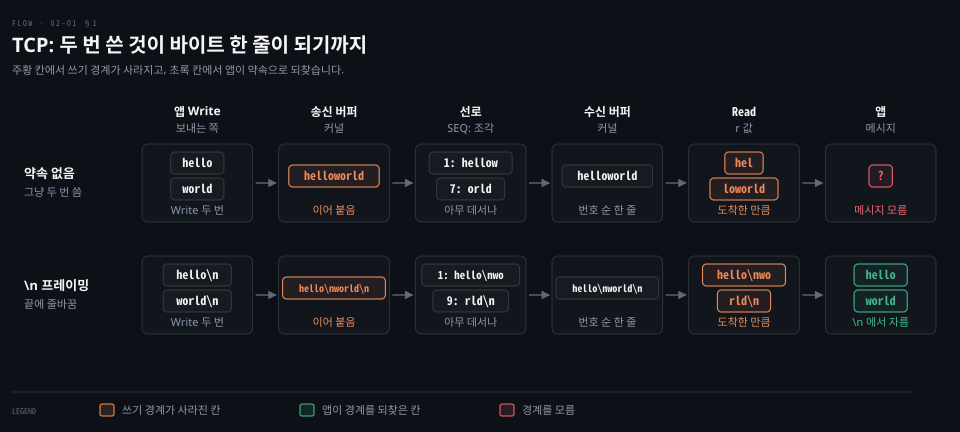

메시지 하나마다 로그 한 줄을 남기는 서버를 TCP 위에 짓는다고 해 봅시다. 클라이언트는 `Write("hello")` 와 `Write("world")` 를 연달아 부르고 서버는 32KB 버퍼로 `Read` 를 부릅니다. `Read` 한 번이 메시지 하나라고 믿고 코드를 쓰면 이 서버는 어떤 날은 맞고 어떤 날은 틀립니다.

### Read 한 번의 r 은 1 에서 10 사이 어디든 됩니다

`Read` 가 돌려주는 `r` 은 이번 호출이 `buf` 에 채운 바이트 수이고, `buf[:r]` 은 버퍼 앞쪽에서 실제로 채워진 부분만 잘라 낸 것입니다. `r` 값은 서버가 `Read` 를 부른 순간 커널에 무엇이 이어서 도착해 있었느냐로 정해집니다. 식으로 쓰면 `r = min(이어서 도착한 바이트 수, len(buf))` 입니다.

| `Read` 를 부른 순간 도착해 있던 것 | `r` | `buf[:r]` |
|---|---|---|
| `hello` 만 | 5 | `hello` |
| `hello` 와 `world` 둘 다 | 10 | `helloworld` |
| `hello` 와 `world` 의 앞 두 바이트 | 7 | `hellowo` |
| `h` 한 바이트 | 1 | `h` |

아무것도 도착하지 않았다면 `r` 이 0 으로 돌아오지 않습니다. `Read` 는 기다립니다. 01-01 에서 goroutine 덤프에 찍히던 `[IO wait]` 가 이 기다림입니다. 전송이 느리면 기다리는 시간이 늘 뿐 `r` 의 범위는 그대로입니다.

서버가 도착 시점을 고를 수는 없습니다. 그러니 서버가 미리 기대할 수 있는 답은 "`r` 은 1 이상 10 이하 어느 값이든 된다"입니다. 32KB 는 10 보다 커서 이 예에서는 `r` 을 깎지 않습니다.

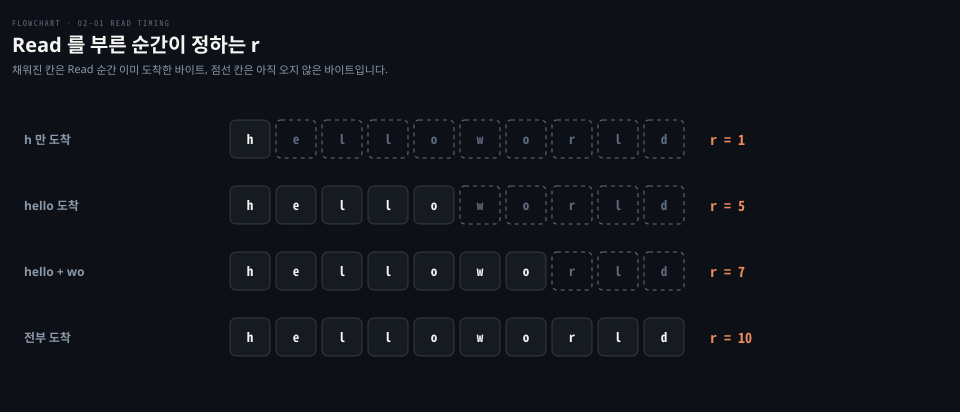

### 번호는 바이트를 세고 Write 는 세지 않습니다

TCP 는 보내는 바이트 하나하나에 **순서 번호(SEQ, sequence number)** 를 매기고, 시작값인 ISN 은 연결마다·방향마다 새로 고릅니다. 번호를 매기는 방식과 ISN 은 [cntd 03-03](../../book/cntd_computer-networking-top-down/03-03.TCP%20%EB%8A%94%20%EC%96%B4%EB%96%BB%EA%B2%8C%20%EC%84%B8%EA%B3%A0%20%EC%96%B4%EB%96%BB%EA%B2%8C%20%EA%B8%B0%EB%8B%A4%EB%A6%AC%EB%8A%94%EA%B0%80.md) §3 「번호는 바이트를 셉니다」가 정본입니다.

설명을 위해 1 부터 세면 `hello` 는 1~5 번, `world` 는 6~10 번입니다. 받는 쪽 커널은 번호를 보고 바이트를 수신 버퍼의 제자리에 끼웁니다. `world` 가 먼저 도착해도 6~10 번 자리에 보관만 하고 앞 구멍이 채워지기 전에는 `Read` 에 넘기지 않습니다. 그래서 앱은 뒤바뀐 순서를 볼 일이 없습니다. 순서가 어긋난 세그먼트를 버퍼에 두었다가 차례대로 올리는 과정은 [cntd 03-03](../../book/cntd_computer-networking-top-down/03-03.TCP%20%EB%8A%94%20%EC%96%B4%EB%96%BB%EA%B2%8C%20%EC%84%B8%EA%B3%A0%20%EC%96%B4%EB%96%BB%EA%B2%8C%20%EA%B8%B0%EB%8B%A4%EB%A6%AC%EB%8A%94%EA%B0%80.md) 「한 흐름에서 둘을 같이 봅니다」가 다룹니다.

다 채운 뒤 커널이 가진 것은 번호 1~10 의 바이트뿐입니다. 5 와 6 사이가 쓰기 경계였다는 정보는 어디에도 없습니다. 보내는 쪽 커널은 `hello` 와 `world` 를 세그먼트 하나로 합쳐 보낼 수도 있고 큰 `Write` 하나를 여러 세그먼트로 쪼갤 수도 있습니다. 그래서 세그먼트 경계로도 되살릴 수 없습니다. 이렇게 쓰기 경계 없이 바이트만 순서대로 전달되는 방식을 **바이트 흐름(byte stream)** 이라고 합니다.

### 수신 버퍼와 buf 는 다른 버퍼입니다

`Read` 의 `buf` 가 32KB 인데 그보다 많이 오면 버려지는지 헷갈리기 쉽습니다. 버퍼가 두 겹이라 그렇습니다.

| 버퍼 | 위치 | 크기를 정하는 쪽 | 넘치면 |
|---|---|---|---|
| `buf` | 앱 메모리 | 우리 코드 `make([]byte, 32*1024)` | `Read` 가 최대 32KB 만 꺼내고 나머지는 커널에 남아 다음 `Read` 가 가져감 |
| **수신 버퍼(receive buffer)** | 커널, 소켓마다 | 커널 설정 `net.ipv4.tcp_rmem` 범위 안에서 커널이 자동 조정, 소켓별 `SO_RCVBUF` 로도 지정[^tcp7] | 버리지 않고 보내는 쪽을 멈춤 |

두 번째 칸의 "보내는 쪽을 멈춤"이 흐름 제어입니다. 받는 쪽이 ACK 에 수신 버퍼의 빈 공간(**수신 윈도**, receive window)을 실어 보내고, 이 값이 0 이 되면 보내는 쪽이 멈춥니다. 창을 정하는 식, 자동 조정, 창이 0 일 때의 교착은 [cntd 03-04](../../book/cntd_computer-networking-top-down/03-04.%ED%9D%90%EB%A6%84%20%EC%A0%9C%EC%96%B4%EC%99%80%20%EC%97%B0%EA%B2%B0%20%EA%B4%80%EB%A6%AC,%20%EA%B7%B8%EB%A6%AC%EA%B3%A0%20%ED%98%BC%EC%9E%A1.md) §1 이 정본입니다.

연결 소켓에서 `ss` 의 `Recv-Q` 칸은 이 수신 버퍼에 쌓여 아직 `Read` 되지 않은 바이트 수입니다. 01-01 에서 LISTEN 줄의 `Recv-Q` 가 accept 대기 연결 수였던 것과 칸 이름은 같지만 세는 대상이 다릅니다. `ss` 의 칸 읽는 법은 [systems-performance 10-04](../../book/systems-performance/10-04.%EB%84%A4%ED%8A%B8%EC%9B%8C%ED%81%AC%20%E2%80%94%20%EA%B4%80%EC%B8%A1%20%EB%8F%84%EA%B5%AC.md) §1 「ss·ip·nstat」이 정본입니다.

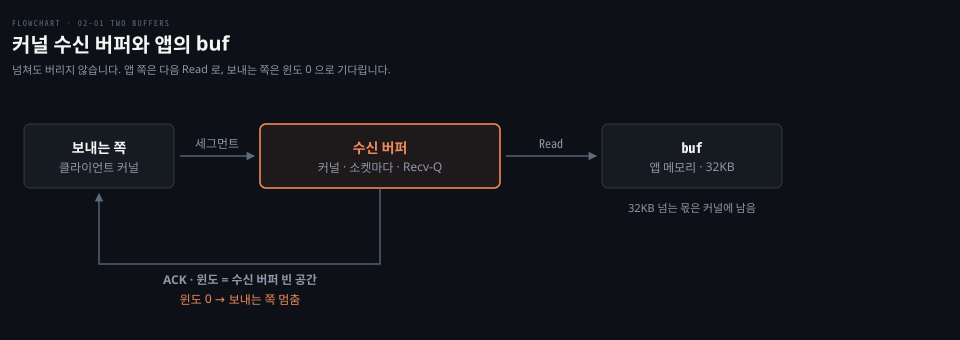

### 경계가 필요하면 앱이 프레이밍합니다

TCP 가 경계를 전달하지 않으니 메시지 단위로 처리할 서버는 보내는 쪽과 경계를 미리 약속해야 합니다. 바이트 흐름 위에 메시지 경계를 다시 그려 넣는 이 약속을 **프레이밍(framing)** 이라고 합니다.

**첫 번째 방법은 구분값입니다.** `hello\n`, `world\n` 처럼 메시지 끝에 `\n` 을 붙이고 서버는 `\n` 이 나올 때까지 읽은 바이트를 모았다가 자릅니다. `Read` 가 `hellowo` 를 주든 `h` 를 주든 모아 두면 되므로 `r` 이 들쭉날쭉해도 괜찮습니다.

약점은 본문 안에 구분값이 섞일 때 드러납니다. 여러 줄짜리 글 하나를 보내면 서버는 줄 수만큼의 메시지로 쪼개 처리합니다. 이미지 같은 바이너리는 어느 바이트든 `\n` 과 같은 값일 수 있어 구분값 방식으로는 보낼 수 없습니다.

**두 번째 방법은 본문 앞에 본문 길이를 먼저 보내는 길이 접두(length-prefix) 입니다.** 서버는 길이 N 을 읽은 뒤 정확히 N 바이트가 모일 때까지 읽고 자릅니다. 본문에 무엇이 들어 있든 상관이 없습니다. 길이 칸 자체는 보통 앞 4 바이트처럼 고정 크기로 정합니다. 길이 칸까지 가변이면 "길이가 어디서 끝나는가"라는 같은 문제가 되살아나기 때문입니다. HTTP 가 두 방식을 어떻게 쓰는지는 [HTTP2 와 실시간 통신 기반](../../../09_spring/03_network/realtime/01-02.HTTP2%EC%99%80%20%EC%8B%A4%EC%8B%9C%EA%B0%84%20%ED%86%B5%EC%8B%A0%20%EA%B8%B0%EB%B0%98.md) §3 「바이너리 프레이밍」이 다룹니다.

아래 도식은 같은 두 메시지를 두 약속으로 자르는 모습과, 본문에 `\n` 이 섞였을 때 구분값 방식이 틀리게 자르는 자리를 보여 줍니다.

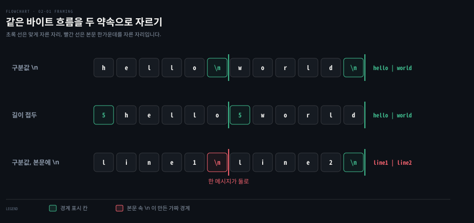

```go
// 길이 접두 프레이밍으로 메시지 하나를 읽는다 (설명용 예시, gonet 저장소에는 없음)
func readMessage(r io.Reader) ([]byte, error) {
	var hdr [4]byte
  
	// io.ReadFull 은 r 이 몇 번에 나눠 주든 정확히 4 바이트가 찰 때까지 Read 를 반복한다
	if _, err := io.ReadFull(r, hdr[:]); err != nil {
		return nil, err
	}
  
	n := binary.BigEndian.Uint32(hdr[:])
	msg := make([]byte, n)
	_, err := io.ReadFull(r, msg)
	return msg, err
}
```

- `io.ReadFull` 이 "`Read` 한 번이 덜 채울 수 있다"는 성질을 반복으로 덮는 도구입니다. `io.Reader` 의 계약은 [lgo 13-01](../../../01_language/book/lgo_learning-go/13-01.io.Reader%20%EB%8A%94%20%EB%B2%84%ED%8D%BC%EB%A5%BC%20%EB%B0%9B%EC%95%84%20%EC%B1%84%EC%9A%B0%EA%B3%A0%20%EC%9E%91%EC%9D%80%20%EC%9D%B8%ED%84%B0%ED%8E%98%EC%9D%B4%EC%8A%A4%EB%A5%BC%20%EA%B2%B9%EC%B3%90%20%EA%B8%B0%EB%8A%A5%EC%9D%84%20%EB%8D%94%ED%95%A9%EB%8B%88%EB%8B%A4.md) 이 정본입니다. 
- 실제 서버라면 상대가 보낸 `n` 을 그대로 믿지 않고 상한을 두어야 합니다. 4GB 를 선언하는 클라이언트 하나가 서버 메모리를 먹을 수 있기 때문입니다.

실제 프로토콜도 두 방식을 섞어 씁니다.

| 방식 | 예 |
|---|---|
| 구분값 | HTTP/1.1 헤더(빈 줄 `\r\n\r\n` 에서 끝남), Redis 인라인 명령 |
| 길이 접두 | HTTP/1.1 본문(`Content-Length`), HTTP/2 프레임, gRPC 메시지, Redis RESP 의 bulk string(`$5\r\nhello\r\n`) |


## 2. UDP 는 데이터그램 경계를 지킵니다

> 커널이 데이터그램을 한 덩어리씩 줄 세우므로 UDP 에서는 `WriteTo` 한 번이 `ReadFrom` 한 번으로 이어지고, 서버에 프레이밍이 필요 없습니다. 대신 버퍼가 작으면 덩어리의 남는 부분이 소리 없이 버려집니다.


같은 두 번의 쓰기를 UDP 로 보내면 서버가 받는 모양이 달라집니다. UDP 가 주고받는 한 덩어리를 **데이터그램(datagram)** 이라고 합니다. 앱이 `WriteTo` 를 한 번 부르면 데이터그램 하나가 만들어집니다. 커널은 여기에 UDP 헤더 하나를 붙여 IP 로 내보냅니다. 경로 MTU 보다 크면 IP 조각 여럿으로 나뉘어 가지만, 받는 쪽이 다시 합쳐 한 덩어리로 넘깁니다. Go 에서는 `net.ListenPacket("udp", ":8080")` 으로 소켓을 열고 `ReadFrom(buf)` 로 받습니다. `ReadFrom` 은 `r` 과 함께 보낸 쪽 주소를 돌려줍니다.

### ReadFrom 한 번은 데이터그램 하나입니다

`ReadFrom` 이 주소를 하나만 돌려준다는 데서 답이 나옵니다. `hello` 는 클라이언트 A 가, `world` 는 클라이언트 B 가 보냈다고 해 봅시다. `ReadFrom` 한 번이 `helloworld` 를 돌려준다면 함께 돌려줄 주소가 A 인지 B 인지 정할 수 없습니다. 그래서 커널은 받은 데이터그램을 이어 붙이지 않고 덩어리째 줄 세워 둡니다. `ReadFrom` 한 번은 그 줄에서 하나만 꺼냅니다. 보낸 쪽이 같은 클라이언트여도 규칙은 같습니다.[^udp7]

| 같은 두 번의 쓰기 | 첫 번째 읽기 | 두 번째 읽기 |
|---|---|---|
| TCP `Read` | 1~10 중 아무 값 | 남은 바이트 |
| UDP `ReadFrom` | 항상 5 (`hello`) | 항상 5 (`world`) |

- 여기서 5 는 `hello` 가 5 바이트라서 나온 값입니다. 200 바이트를 `WriteTo` 했으면 `r` 은 200 입니다. 서버가 크기를 미리 알 필요는 없습니다. UDP 헤더 8 바이트(보낸 포트, 받는 포트, 길이, 체크섬 각 2 바이트)에 길이 칸이 있어서 커널이 덩어리 하나의 크기를 압니다. 
- 이 칸은 헤더 8 바이트까지 포함하므로 `hello` 데이터그램이면 13 입니다.[^rfc768] §1 의 길이 접두를 UDP 는 헤더에 이미 넣어 둔 셈입니다. TCP 헤더에는 이런 길이 칸 없이 순서 번호만 있습니다. 헤더 네 칸의 자세한 뜻은 [cntd 03-01](../../book/cntd_computer-networking-top-down/03-01.%ED%8A%B8%EB%9E%9C%EC%8A%A4%ED%8F%AC%ED%8A%B8%EB%8A%94%20%EB%AC%B4%EC%97%87%EC%9D%84%20%EB%8D%94%ED%95%98%EB%8A%94%EA%B0%80.md) §6 이 다룹니다.

같은 두 번의 쓰기가 보내는 쪽부터 받는 쪽까지 어떤 모양으로 흐르는지는 이 절 맨 위의 도식에 나란히 그려 두었습니다.

### 버퍼보다 큰 데이터그램은 조용히 잘립니다

경계를 지키는 대가가 있습니다. 서버가 버퍼를 3 바이트로 잡았는데 `hello` 데이터그램이 왔다고 해 봅시다. TCP 였다면 첫 `Read` 가 `hel` 을 주고 남은 `lo` 는 커널에 남아 다음 `Read` 가 가져갑니다. UDP 는 덩어리를 쪼개 보관할 수 없으니 첫 `ReadFrom` 이 `hel` 을 주고 `lo` 는 버립니다. 다음 `ReadFrom` 은 `lo` 가 아니라 다음 데이터그램을 꺼냅니다.

더 조심할 점은 이것이 에러로 드러나지 않는다는 것입니다. Linux 는 잘린 사실을 `MSG_TRUNC` 플래그로 알립니다.[^udp7] 이 플래그를 결과로 돌려주는 곳은 `recvmsg` 의 결과 플래그 칸이고, `recvfrom` 은 호출할 때 `MSG_TRUNC` 를 넣어야 실제 길이를 알려 줍니다. Go 의 `ReadFrom` 은 `recvfrom` 을 플래그 0 으로 부르고 받은 바이트 수만 돌려줍니다.[^go-readfrom] 그래서 서버 코드는 `r = 3`, 에러 없음만 보고 잘린 줄 모를 수 있습니다.

잘림을 알아야 한다면 결과 플래그를 돌려주는 `UDPConn.ReadMsgUDP` 를 씁니다. 이 동작은 Phase 3 실험 2 에서 Linux 로 실행해 확인했습니다. 3 바이트 버퍼 서버가 `r=3 "hel"` 다음에 `r=3 "wor"` 를 받았고 에러 줄은 없었습니다.


그래서 UDP 서버는 버퍼를 데이터그램이 가질 수 있는 최대 크기에 맞춰 넉넉히 잡습니다. IPv4 에서 UDP 본문의 최대치는 IP 길이 칸 상한 65,535 에서 IP 헤더 20 바이트와 UDP 헤더 8 바이트를 뺀 65,507 바이트입니다.


## 3. 연결이 없으면 서버는 소켓 하나로 받고, 떠남을 알 수 없습니다

> 클라이언트마다 연결 소켓을 두던 TCP 와 달리 UDP 서버는 소켓 하나로 모두를 받아, 01-01 처럼 조용한 클라이언트에게 붙잡히는 것이 없습니다. 그 대신 클라이언트가 떠났다는 신호도 받지 못합니다.

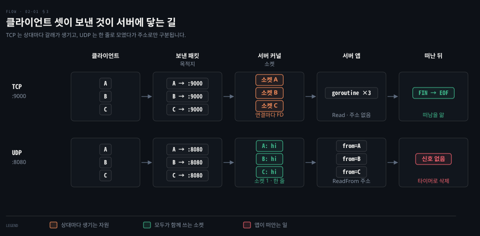

01-01 의 TCP echo 서버는 listener 소켓에서 `Accept` 를 불러 클라이언트마다 연결 소켓 FD 하나와 goroutine 하나를 만들었습니다. 조용히 붙어만 있는 클라이언트가 이 자원을 붙잡아 결국 서버가 멈췄습니다. UDP 서버에는 `Accept` 가 없습니다. 그러면 같은 문제가 생길까요?

### TCP 가 연결마다 소켓을 두는 이유는 상대별 상태입니다

§1 에서 본 대로 TCP 는 경계 없는 바이트 흐름입니다. A 와 B 가 수신 버퍼 하나를 같이 쓰면 A 의 `hello` 와 B 의 `world` 가 `helloworld` 로 이어 붙고, 어디까지가 A 의 바이트인지 되살릴 방법이 없습니다. 그래서 상대마다 버퍼를 따로 두어야 합니다. TCP 의 나머지 장치도 모두 상대 하나에 묶여 있습니다.

| 장치 | 상대마다 따로 있어야 하는 이유 |
|---|---|
| 순서 번호 재조립 | A 와 B 는 각자 다른 ISN 으로 셉니다. 한 버퍼에 두면 "6 번 자리"가 누구의 6 번인지 겹칩니다 |
| 흐름 제어 | 윈도는 "내 버퍼의 빈 공간"입니다. 버퍼를 같이 쓰면 A 를 늦게 읽을 때 B 까지 멈춥니다 |
| 재전송 대기열 | 보냈지만 ACK 를 못 받은 바이트를 상대별로 들고 있다가 그 상대에게만 다시 보냅니다 |
| 종료 상태 | FIN 과 CLOSE-WAIT 같은 상태를 A 와 B 가 각각 다른 시점에 겪습니다 |

커널은 도착한 세그먼트를 4-tuple 로 골라 해당 연결 소켓에 넣고, 그래서 TCP `Read` 는 주소를 돌려주지 않습니다. 소켓 자체가 이미 상대 하나를 뜻하기 때문입니다. 연결 소켓이 상대별 상태를 담는다는 것과 소켓을 두 값·네 값으로 식별하는 차이는 [cntd 02-01](../../book/cntd_computer-networking-top-down/02-01.%EC%95%B1%EC%9D%80%20%EB%AC%B4%EC%97%87%EC%9D%84%20%EA%B3%A0%EB%A5%B4%EA%B3%A0%20%EB%AC%B4%EC%97%87%EC%9D%84%20%EB%AA%BB%20%EA%B3%A0%EB%A5%B4%EB%8A%94%EA%B0%80.md) 「연결 소켓은 무엇을 담는가」와 [cntd 03-01](../../book/cntd_computer-networking-top-down/03-01.%ED%8A%B8%EB%9E%9C%EC%8A%A4%ED%8F%AC%ED%8A%B8%EB%8A%94%20%EB%AC%B4%EC%97%87%EC%9D%84%20%EB%8D%94%ED%95%98%EB%8A%94%EA%B0%80.md) §4 가 정본입니다.

### UDP 서버의 소켓은 하나이고, 클라이언트에도 소켓이 있습니다

UDP 커널은 상대별 상태를 들지 않습니다. 상대가 누구인지는 데이터그램마다 `ReadFrom` 이 돌려주는 주소로만 압니다. 그래서 클라이언트 100 개가 각자 `hello` 를 보내도 서버의 소켓 FD 는 하나입니다.

클라이언트 쪽에는 소켓이 필요합니다. `WriteTo` 는 클라이언트 UDP 소켓의 메서드이고, 서버가 `ReadFrom` 으로 받는 주소는 그 소켓의 IP 와 포트입니다. 클라이언트가 포트를 정하지 않으면 커널이 `bind`·`connect` 나 첫 전송 때 **임시 포트(ephemeral port)** 하나를 붙여 줍니다. Go 의 `ListenPacket`·`DialUDP` 는 소켓을 만드는 과정에서 `bind`·`connect` 까지 하므로 만들자마자 포트가 정해집니다.

| | TCP | UDP |
|---|---|---|
| 클라이언트 | 연결마다 소켓 1 개 | 소켓 1 개 |
| 서버 | listener 1 개 + 연결마다 1 개 | 소켓 1 개로 모든 클라이언트를 받음 |

UDP 서버 소켓은 listen 소켓이 아닙니다. `ListenPacket` 이라는 이름과 달리 LISTEN 상태도 accept 대기열도 없고, 포트에 묶여(bind) 있을 뿐입니다. Phase 3 실험 3 에서 클라이언트 셋을 붙이고 `ss` 로 본 결과는 이렇습니다.

| | 서버 쪽 소켓 | 클라이언트 쪽 소켓 |
|---|---|---|
| UDP | `UNCONN` 1 줄, Peer `*:*` | `ESTAB` 3 줄, Peer `[::1]:8080` |
| TCP | `LISTEN` 1 줄 + `ESTAB` 3 줄 | `ESTAB` 3 줄 |

UDP 클라이언트 줄에 `ESTAB` 이 붙은 것은 연결이 생겨서가 아닙니다. Go 의 `Dial("udp", ...)` 은 커널의 `connect()` 를 부릅니다. UDP 의 `connect()` 는 패킷을 하나도 보내지 않고 자기 소켓에 "기본 상대는 이 주소"라고 적어 두기만 합니다.

그런데 Linux 는 그렇게 상대 주소를 적은 UDP 소켓의 상태 칸에 TCP 와 같은 이름의 값 `TCP_ESTABLISHED` 를 넣고[^udp-connect], `ss` 는 그 값을 그대로 `ESTAB` 으로 보여 줍니다. 서버는 이 일을 모르므로 서버 줄의 Peer 는 여전히 `*:*` 입니다. 연결된 UDP 소켓이 주소 없이 `Write`·`Read` 를 쓰고 다른 곳에서 온 데이터그램을 걸러 낸다는 것은 [cntd 03-01](../../book/cntd_computer-networking-top-down/03-01.%ED%8A%B8%EB%9E%9C%EC%8A%A4%ED%8F%AC%ED%8A%B8%EB%8A%94%20%EB%AC%B4%EC%97%87%EC%9D%84%20%EB%8D%94%ED%95%98%EB%8A%94%EA%B0%80.md) 「실제로 돌려 보면」이 다룹니다.

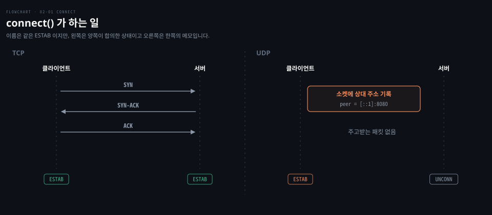

`udp-send` 를 실행할 때마다 `local=` 의 포트가 36811, 35152, 40496 처럼 바뀐 것도 같은 이유입니다. 실행마다 새 소켓이 생기고, 그 소켓의 `connect()` 때 커널이 `net.ipv4.ip_local_port_range`(이 VM 에서 32768~60999) 안의 빈 포트를 새로 붙입니다. 이 범위가 모자랄 때 벌어지는 일은 [systems-performance 10-03](../../book/systems-performance/10-03.%EB%84%A4%ED%8A%B8%EC%9B%8C%ED%81%AC%20%E2%80%94%20%EB%B0%A9%EB%B2%95%EB%A1%A0%C2%B7%EC%8B%A4%ED%97%98%C2%B7%ED%8A%9C%EB%8B%9D.md) 「포트 고갈」이 다룹니다.

조용해진 클라이언트 A 때문에 UDP 서버가 붙잡는 것은 없습니다. `hello` 를 꺼낸 순간 소켓 계층에서 A 의 흔적은 사라집니다. conntrack 이 켜져 있으면 그쪽 항목은 아래에서 볼 타이머로 남습니다. 01-01 에서는 연결 하나가 소켓 FD 하나, pipe FD 둘, goroutine 하나를 붙잡았습니다. 여기에는 그 자원이 하나도 없습니다.

### 떠났다는 신호가 없어 타이머로 지웁니다

붙잡는 것이 없다는 점은 뒤집으면 문제가 됩니다. 앱이 클라이언트별 메시지 수를 `map[주소]횟수` 로 센다고 해 봅시다. 이 map 은 커널이 아니라 앱이 들고 있는 상태입니다. A 가 떠나면 A 의 항목은 언제 지워야 할까요?

TCP 서버는 클라이언트의 FIN 이 도착하면 `Read` 가 `io.EOF` 를 돌려주어 떠난 것을 알았습니다. UDP 헤더에는 FIN 같은 플래그 칸이 없습니다. 떠났다는 신호가 존재하지 않으니 "일정 시간 아무것도 오지 않으면 떠난 것으로 친다"는 규칙밖에 없습니다. 앱은 항목마다 마지막으로 받은 시각을 적어 두고 오래된 항목을 주기적으로 지웁니다.

01-01 에서 연결마다 걸었던 idle timeout 과 같은 발상입니다. 차이는 적용 대상입니다. 01-01 은 연결 소켓마다 `SetReadDeadline` 을 걸었습니다. UDP 에서는 소켓이 하나뿐이라 그렇게 할 수 없고 앱의 상태 항목마다 걸어야 합니다.

실제 시스템도 같은 길을 갑니다. Linux conntrack(NAT·방화벽이 쓰는 연결 추적)도 UDP 흐름을 타이머로만 지우고, 그 기본값은 [networking-and-kubernetes 02-02](../../../08_cloud/book/networking-and-kubernetes/02-02.%EC%BB%A4%EB%84%90%EC%9D%B4%20%ED%8C%A8%ED%82%B7%EC%9D%84%20%ED%8C%90%EC%A0%95%ED%95%98%EB%8A%94%20%EC%B8%B5%20%E2%80%94%20Netfilter%C2%B7Conntrack%C2%B7%EB%9D%BC%EC%9A%B0%ED%8C%85.md) 「UDP 는 종료 신호가 없어 타이머로만 지워집니다」가 다룹니다. UDP 위에서 도는 QUIC 은 프로토콜 안에 idle timeout 을 따로 정해 두었습니다.[^quic-idle]

아래 도식은 §3 전체를 한 장에 모은 것입니다. TCP 서버는 상대마다 소켓과 goroutine 이 생기고, UDP 서버는 소켓 하나에 앱이 든 주소별 시각만 남아 타이머로 지워집니다.

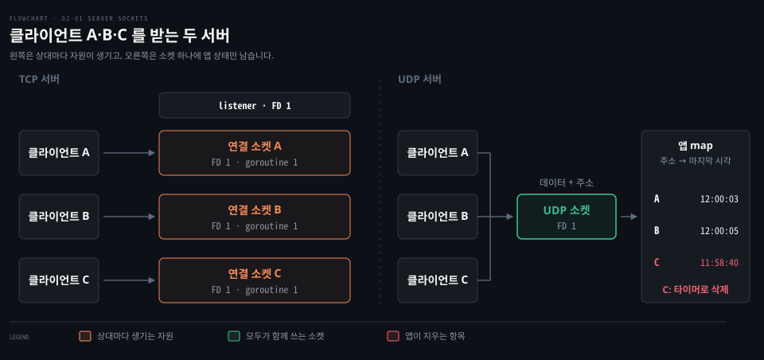


## 4. 손실과 순서는 앱이 떠안습니다

> TCP 는 커널이 빈자리를 채우고 순서를 맞춰 넘기지만, UDP 는 빠진 채로 도착한 순서대로 넘깁니다. 번호·재정렬·재전송이 필요하면 앱이 직접 만들어야 하고, 그 선택권이 UDP 를 쓰는 이유가 되기도 합니다.

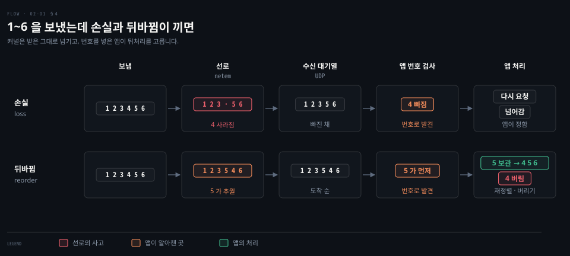

UDP 클라이언트가 본문에 번호 1~10 을 담은 데이터그램 10 개를 보냈는데 가는 길에 4 와 7 이 사라졌다고 해 봅시다. TCP 였다면 앱은 1~10 을 전부 순서대로 받았습니다. UDP 서버 앱은 무엇을 받을까요?

### UDP 는 빠진 채로, 도착한 순서대로 넘깁니다

`ReadFrom` 은 여덟 번 데이터를 돌려줍니다. 빠진 자리에서 기다리지도 않습니다. UDP 헤더에는 순서 번호 칸이 없어서 서버 커널은 빈자리가 있다는 것조차 알 수 없습니다. UDP 에는 ACK 도 없으므로 클라이언트 커널도 손실을 모르고 저절로 재전송되는 일도 없습니다.

순서도 마찬가지입니다. 1~6 이 모두 도착했지만 네트워크에서 뒤바뀌어 `1 2 3 5 4 6` 순서로 들어왔다면 `ReadFrom` 여섯 번도 `1 2 3 5 4 6` 순서로 돌려줍니다. 커널은 도착한 순서대로 줄을 세울 뿐입니다.

TCP 는 반대입니다. 받는 쪽은 빈자리 뒤로 5 와 6 이 올 때마다 "다음은 4"라는 같은 ACK 를 되풀이하고(중복 ACK), 보내는 쪽은 이 신호나 재전송 타이머로 4 를 다시 보냅니다. 누적 ACK·중복 ACK·빠른 재전송의 원리는 [cntd 03-03](../../book/cntd_computer-networking-top-down/03-03.TCP%20%EB%8A%94%20%EC%96%B4%EB%96%BB%EA%B2%8C%20%EC%84%B8%EA%B3%A0%20%EC%96%B4%EB%96%BB%EA%B2%8C%20%EA%B8%B0%EB%8B%A4%EB%A6%AC%EB%8A%94%EA%B0%80.md) §5 가 정본이고, Linux 가 실제로 손실을 판정하는 방식은 [02-02](./02-02.TCP%20%EB%8A%94%20%EC%86%90%EC%8B%A4%EC%9D%84%20%EC%96%B4%EB%96%BB%EA%B2%8C%20%ED%8C%90%EC%A0%95%ED%95%98%EB%82%98%20-%20%EC%A4%91%EB%B3%B5%20ACK%20%EB%AC%B8%ED%84%B1%C2%B7RACK%C2%B7TLP.md) 가 다룹니다.

그동안 이미 도착한 5 와 6 은 커널에 보관될 뿐 앱에 넘어가지 않습니다. 앞 바이트 하나가 늦어서 뒤 바이트까지 묶이는 이 현상을 **HOL 블로킹(Head-of-Line blocking)** 이라고 합니다.

아래 도식은 4 하나가 사라졌을 때 두 프로토콜의 앱이 받는 것을 나란히 놓은 것입니다.

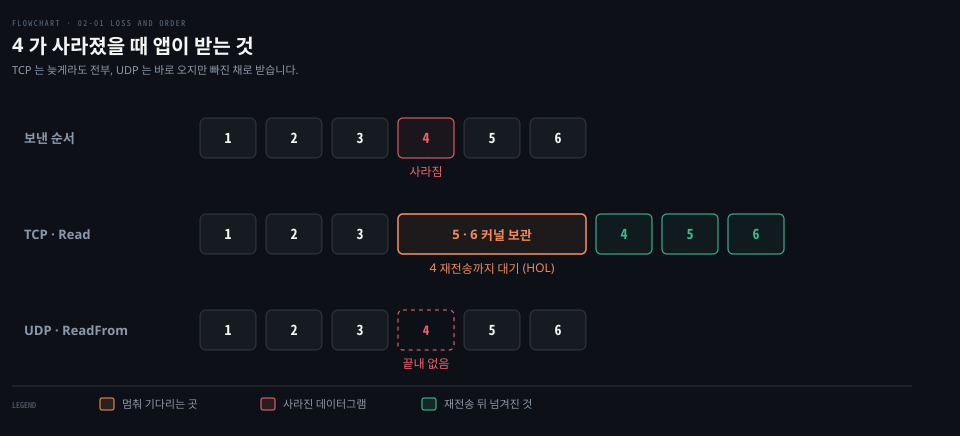

### 앱이 번호를 넣으면 빈자리와 순서를 알 수 있습니다

UDP 서버 커널은 빈자리를 모르지만 본문에 번호가 들어 있으면 서버 앱은 `1 2 3 5 6 8 9 10` 을 보고 4 와 7 이 빠졌다는 것을 압니다. 보내는 쪽 앱이 번호를 직접 넣었기 때문입니다. TCP 커널이 순서 번호로 빈자리를 찾던 원리를 앱 계층에서 다시 구현한 것입니다.

순서가 뒤바뀌었을 때 앱이 할 수 있는 일은 앱 성격에 따라 둘로 갈립니다.

| 전략 | 동작 | 맞는 앱 |
|---|---|---|
| **재정렬 버퍼(reorder buffer)** | 3 다음에 5 가 오면 5 를 잠시 보관하고, 4 를 처리한 뒤 꺼냄 | 파일 전송처럼 전부를 순서대로 처리해야 하는 앱 |
| 늦으면 버리기 | 5 를 이미 처리했으면 뒤늦게 온 4 는 버림 | 음성 통화, 게임처럼 늦은 데이터가 쓸모없는 앱 |

재정렬 버퍼는 TCP 커널이 수신 버퍼 안에서 하던 일을 앱이 직접 하는 것입니다. 늦으면 버리기는 1 초 전 목소리나 위치를 뒤늦게 재생하느니 앞으로 가는 편이 낫다는 판단입니다. 빠진 것을 다시 받아야 한다면 재전송도 앱이 만듭니다. DNS 클라이언트는 질의를 보내고 일정 시간 응답이 없으면 다시 보냅니다. 여기서는 응답 자체가 ACK 역할을 합니다. 앱이 확인 응답과 재전송을 직접 만든다는 발상은 [cntd 03-01](../../book/cntd_computer-networking-top-down/03-01.%ED%8A%B8%EB%9E%9C%EC%8A%A4%ED%8F%AC%ED%8A%B8%EB%8A%94%20%EB%AC%B4%EC%97%87%EC%9D%84%20%EB%8D%94%ED%95%98%EB%8A%94%EA%B0%80.md) 「신뢰성이 필요하면 앱이 만들면 됩니다」와 [networking-and-kubernetes 01-02](../../../08_cloud/book/networking-and-kubernetes/01-02.HTTP%EC%97%90%EC%84%9C%20TCP%C2%B7TLS%C2%B7UDP%EA%B9%8C%EC%A7%80%20%E2%80%94%20Transport%20%EA%B3%84%EC%B8%B5%20%ED%95%B4%EB%B6%80.md) §6 이 다룹니다.

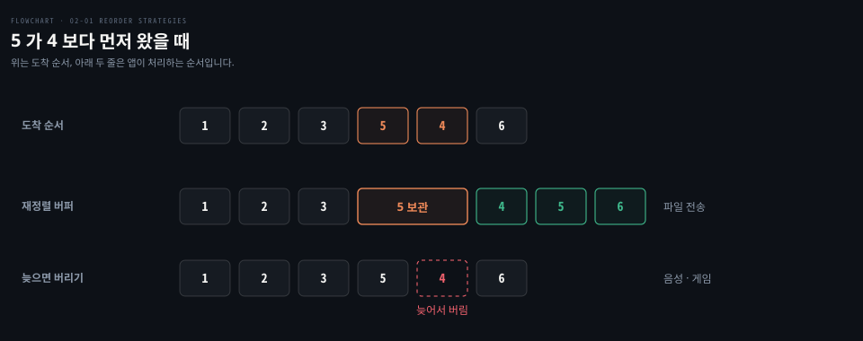

### 신뢰성을 앱이 고른다는 것

TCP 는 커널이 모든 앱에 같은 신뢰성 규칙을 적용합니다. 음성 통화 앱이 늦은 데이터를 버리고 싶어도 TCP 위에서는 커널이 4 를 기다리는 동안 5 와 6 을 넘겨받을 수 없습니다. UDP 는 그 규칙을 비워 두고 앱이 고르게 합니다.

앱이 고르는 것은 "신뢰성이냐 속도냐" 하나가 아닙니다. 신뢰성을 어디에, 어떻게 적용할지도 고릅니다. 음성 통화는 늦은 데이터를 버려 지연을 줄입니다. QUIC 은 신뢰성을 유지하면서 손실의 영향을 좁히고 구현 위치를 옮깁니다.

| | TCP | QUIC (UDP 위) |
|---|---|---|
| 구현 위치 | 커널 | 앱 쪽 라이브러리 |
| 번호 단위 | 연결 전체가 한 바이트 흐름 | 한 연결 안에 스트림 여럿 |
| 손실 하나의 영향 | 뒤 바이트 전부 묶임 | 그 스트림만 묶이고 다른 스트림은 진행 |

커널을 고치지 않고 앱만 업데이트해도 동작을 바꿀 수 있다는 점이 QUIC 이 UDP 위에 올라간 큰 이유이고, [cntd 03-05](../../book/cntd_computer-networking-top-down/03-05.%ED%98%BC%EC%9E%A1%EC%9D%84%20%EC%96%B4%EB%96%BB%EA%B2%8C%20%EB%8B%A4%EC%8A%A4%EB%A6%AC%EB%8A%94%EA%B0%80.md) 「QUIC 이 이 장의 결론입니다」가 이 흐름을 정리합니다. 책이 꼽는 UDP 를 고르는 네 가지 이유와 혼잡 제어를 하지 않을 때 치르는 값은 [cntd 03-01](../../book/cntd_computer-networking-top-down/03-01.%ED%8A%B8%EB%9E%9C%EC%8A%A4%ED%8F%AC%ED%8A%B8%EB%8A%94%20%EB%AC%B4%EC%97%87%EC%9D%84%20%EB%8D%94%ED%95%98%EB%8A%94%EA%B0%80.md) §5 가 정본입니다.

흔히 "UDP 가 훨씬 빠르다"고 말하지만 이 랩에서 근거로 삼을 수 있는 것은 두 가지뿐입니다. 첫 데이터그램을 handshake 없이 바로 보낸다는 점, 그리고 손실이 있어도 뒤 데이터가 묶이지 않는다는 점입니다. "훨씬"이 얼마인지는 따로 재지 않았고, 실험 4 의 걸린 시간만 참고로 남깁니다.

### HTTP 도 TCP 위에서 HOL 블로킹과 싸웠습니다

HOL 블로킹은 UDP 이야기에서 처음 나온 문제가 아닙니다. 아래 도식의 A·B·C 는 한 브라우저가 같은 서버에 보낸 서로 무관한 요청 셋입니다. 예를 들어 한 페이지의 큰 이미지, CSS, JS 입니다. HTTP/2·3 에서는 이 요청 하나가 스트림 하나가 되고, 조각 A1·A2 는 요청 A 의 응답을 잘라 보낸 프레임입니다.

HTTP/1.1 은 응답을 요청 순서대로 보내야 해서 앱 계층에서 막혔습니다. HTTP/2 는 한 연결에 여러 스트림을 섞는 멀티플렉싱으로 그 막힘을 풀었습니다.

다만 HTTP/2 가 푼 것은 앱 계층 막힘뿐입니다. TCP 세그먼트 하나를 잃으면 그 연결 위 모든 스트림이 멈추는 TCP 계층 막힘은 그대로 남았고, 이것이 이 절의 도식에서 "5 · 6 커널 보관" 칸과 같은 현상입니다. HTTP/3 은 이 막힘을 QUIC 으로 풀었습니다. 판마다 막히는 층이 어떻게 바뀌는지는 [cntd 02-02](../../book/cntd_computer-networking-top-down/02-02.%EC%9B%B9%EC%9D%80%20%EC%96%B4%EB%96%BB%EA%B2%8C%20%EC%A3%BC%EA%B3%A0%EB%B0%9B%EB%8A%94%EA%B0%80.md) §6 「HOL 블로킹과 프레임 — HTTP/2」가, HTTP/2 의 프레임과 스트림 구조는 [HTTP2 와 실시간 통신 기반](../../../09_spring/03_network/realtime/01-02.HTTP2%EC%99%80%20%EC%8B%A4%EC%8B%9C%EA%B0%84%20%ED%86%B5%EC%8B%A0%20%EA%B8%B0%EB%B0%98.md) 이 정본입니다.

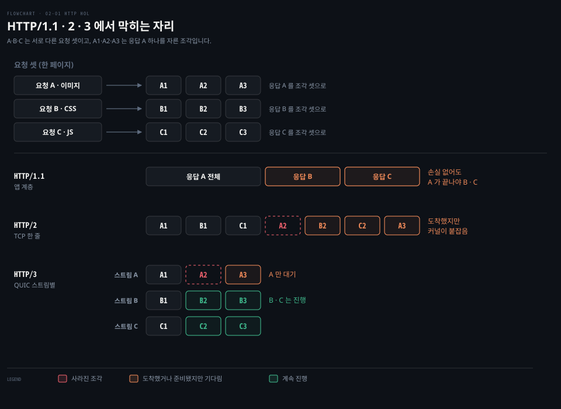

HTTP/2 와 HTTP/3 이 "한 줄"과 "여러 줄"로 갈리는 기준은 패킷이 아니라 **순서 번호를 어디에 매기느냐**입니다. HTTP/2 도 프레임마다 스트림 ID 를 붙이지만 그 ID 는 TCP 본문 안에 있어서 TCP 커널은 보지 못합니다. TCP 가 아는 번호는 연결 전체에 하나뿐인 SEQ 이고, 이 번호로 한 줄을 맞춘 뒤에야 HTTP/2 가 스트림을 가릅니다.

QUIC 은 데이터를 STREAM 프레임에 담습니다. 프레임마다 스트림 ID 와 그 스트림 안에서의 바이트 위치(offset)를 적습니다. 받는 쪽은 이 두 칸으로 스트림마다 따로 순서를 맞춥니다.[^quic-stream] QUIC 의 스트림 구조 전체는 [cntd 03-05](../../book/cntd_computer-networking-top-down/03-05.%ED%98%BC%EC%9E%A1%EC%9D%84%20%EC%96%B4%EB%96%BB%EA%B2%8C%20%EB%8B%A4%EC%8A%A4%EB%A6%AC%EB%8A%94%EA%B0%80.md) 「QUIC 이 이 장의 결론입니다」가 다룹니다. 패킷에도 번호가 있지만 그것은 손실을 알아채고 ACK 하는 데 쓰는 번호이지 데이터 순서를 맞추는 번호가 아닙니다.

그래서 A 의 조각이 실린 패킷 하나를 잃으면 A 에만 빈자리가 생깁니다. B 는 자기 offset 이 다 차 있으니 앱에 넘어갑니다. 한 패킷에 A 와 B 의 프레임이 함께 실려 있었다면 그 패킷을 잃었을 때 둘 다 기다립니다. 막히는 단위가 패킷이 아니라 "빈자리가 생긴 스트림"이라는 뜻입니다.

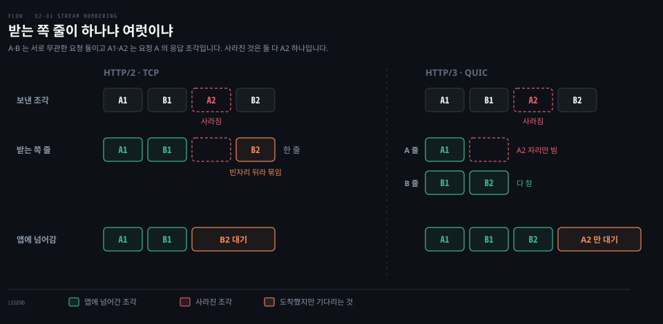


## 검증과 복습

> 이 문서의 이해를 어떻게 확인했고, 무엇을 남겼는지 적습니다.

- Phase 1: 2026-09-28 소크라테스 문답으로 세 축의 차이를 학습자가 직접 설명해 통과했습니다. 첫 자답, 힌트 뒤 답, 교정한 내용의 구분은 [STATE.md](./STATE.md) 에 있습니다.
- Phase 3: 2026-09-28~29 실험 다섯 개를 예측 → 실행 → 해석으로 진행했습니다. 예측은 대부분 결과와 함께 제출됐고, 실험별 기록은 [STATE.md](./STATE.md) 에 있습니다.
- Phase 4: 아직 진행하지 않았습니다.
- 복습 표적
  - §1: 순서 번호는 바이트에 붙는 번호라는 점(Phase 1 에서 "패킷에 붙는 값"으로 답함)
  - §2: `ReadFrom` 이 데이터그램 하나씩이라는 점(첫 자답은 "5 또는 10")
  - §3: 클라이언트에도 UDP 소켓이 있다는 점
  - §4: 재정렬 버퍼(힌트 뒤에 도달)


## 출처와 관련 문서

> 동작 주장에 쓴 1차 자료와, 설명을 넘긴 노트입니다.

- [02-03 UDP 실습 기록](./02-03.UDP%20%EC%8B%A4%EC%8A%B5%20%EA%B8%B0%EB%A1%9D%20-%20%EA%B2%BD%EA%B3%84%C2%B7%EC%9E%98%EB%A6%BC%C2%B7%EC%86%8C%EC%BC%93%C2%B7netem%20%EC%86%90%EC%8B%A4%EA%B3%BC%20%EC%88%9C%EC%84%9C.md): 이 문서의 실험 1~5 명령·예측·출력·해석
- [01-01 조용한 연결이 서버를 멈춘다](./01-01.%EC%A1%B0%EC%9A%A9%ED%95%9C%20%EC%97%B0%EA%B2%B0%EC%9D%B4%20%EC%84%9C%EB%B2%84%EB%A5%BC%20%EB%A9%88%EC%B6%98%EB%8B%A4%20-%20goroutine%C2%B7FD%C2%B7idle%20timeout.md): `[IO wait]`, LISTEN 줄의 `Recv-Q`, idle timeout, 연결 하나가 붙잡는 FD
- [00-01 listener 소켓과 연결 소켓](./00-01.listener%20%EC%86%8C%EC%BC%93%EA%B3%BC%20%EC%97%B0%EA%B2%B0%20%EC%86%8C%EC%BC%93.md): 연결 소켓이 4-tuple 로 구분된다는 것
- cntd 정독 노트: [03-01 트랜스포트는 무엇을 더하는가](../../book/cntd_computer-networking-top-down/03-01.%ED%8A%B8%EB%9E%9C%EC%8A%A4%ED%8F%AC%ED%8A%B8%EB%8A%94%20%EB%AC%B4%EC%97%87%EC%9D%84%20%EB%8D%94%ED%95%98%EB%8A%94%EA%B0%80.md)(UDP 헤더, 소켓 식별, UDP 를 고르는 이유), [03-03 TCP 는 어떻게 세고 어떻게 기다리는가](../../book/cntd_computer-networking-top-down/03-03.TCP%20%EB%8A%94%20%EC%96%B4%EB%96%BB%EA%B2%8C%20%EC%84%B8%EA%B3%A0%20%EC%96%B4%EB%96%BB%EA%B2%8C%20%EA%B8%B0%EB%8B%A4%EB%A6%AC%EB%8A%94%EA%B0%80.md)(순서 번호, ISN, 빠른 재전송), [03-04 흐름 제어와 연결 관리](../../book/cntd_computer-networking-top-down/03-04.%ED%9D%90%EB%A6%84%20%EC%A0%9C%EC%96%B4%EC%99%80%20%EC%97%B0%EA%B2%B0%20%EA%B4%80%EB%A6%AC,%20%EA%B7%B8%EB%A6%AC%EA%B3%A0%20%ED%98%BC%EC%9E%A1.md)(수신 윈도)
- [lgo 13-01 io.Reader](../../../01_language/book/lgo_learning-go/13-01.io.Reader%20%EB%8A%94%20%EB%B2%84%ED%8D%BC%EB%A5%BC%20%EB%B0%9B%EC%95%84%20%EC%B1%84%EC%9A%B0%EA%B3%A0%20%EC%9E%91%EC%9D%80%20%EC%9D%B8%ED%84%B0%ED%8E%98%EC%9D%B4%EC%8A%A4%EB%A5%BC%20%EA%B2%B9%EC%B3%90%20%EA%B8%B0%EB%8A%A5%EC%9D%84%20%EB%8D%94%ED%95%A9%EB%8B%88%EB%8B%A4.md): `Read` 가 버퍼를 덜 채울 수 있다는 계약

[^quic-stream]: RFC 9000 §2.2, "An endpoint uses the Stream ID and Offset fields in STREAM frames to place data in order." · §19.8 "Offset: A variable-length integer specifying the byte offset in the stream for the data in this STREAM frame." <https://www.rfc-editor.org/rfc/rfc9000#section-2.2>
[^rfc768]: RFC 768 "User Datagram Protocol", "Length is the length in octets of this user datagram including this header and the data." <https://www.rfc-editor.org/rfc/rfc768>
[^udp7]: Linux man page `udp(7)`, "All receive operations return only one packet. When the packet is smaller than the passed buffer, only that much data is returned; when it is bigger, the packet is truncated and the MSG_TRUNC flag is set." <https://man7.org/linux/man-pages/man7/udp.7.html>
[^tcp7]: Linux man page `tcp(7)`, `tcp_rmem` "This is a vector of 3 integers: [min, default, max]. These parameters are used by TCP to regulate receive buffer sizes. TCP dynamically adjusts the size of the receive buffer from the defaults listed below, in the range of these values" <https://man7.org/linux/man-pages/man7/tcp.7.html>
[^go-readfrom]: Go 소스 `internal/poll/fd_unix.go` 의 `FD.ReadFrom`, `syscall.Recvfrom(fd.Sysfd, p, 0)` (go1.25.1). <https://github.com/golang/go/blob/go1.25.1/src/internal/poll/fd_unix.go>
[^udp-connect]: Linux 소스 `net/ipv4/datagram.c` 의 `__ip4_datagram_connect` 와 `net/ipv6/datagram.c` 에서 `sk->sk_state = TCP_ESTABLISHED;` (2026-09-29 master 조회). <https://github.com/torvalds/linux/blob/master/net/ipv4/datagram.c>
[^quic-idle]: RFC 9000 "QUIC: A UDP-Based Multiplexed and Secure Transport" §10.1 Idle Timeout. <https://www.rfc-editor.org/rfc/rfc9000#section-10.1>
