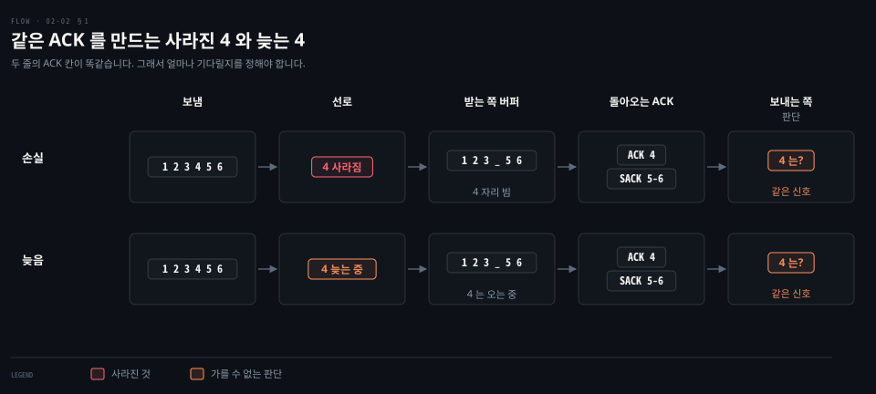
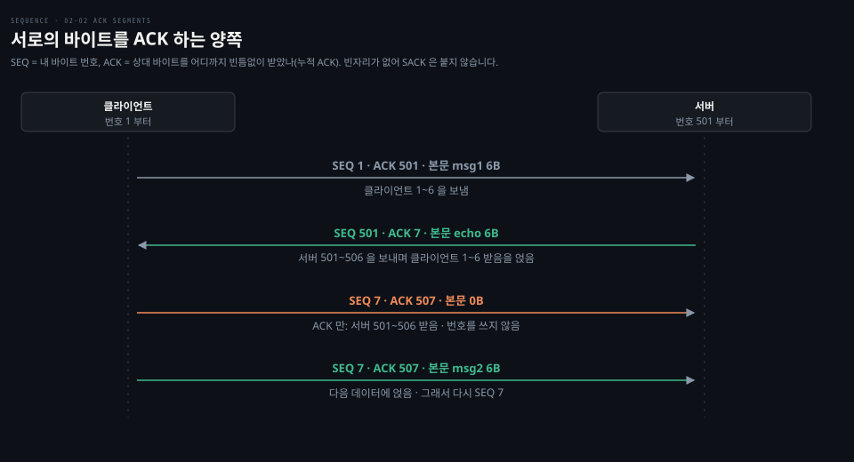
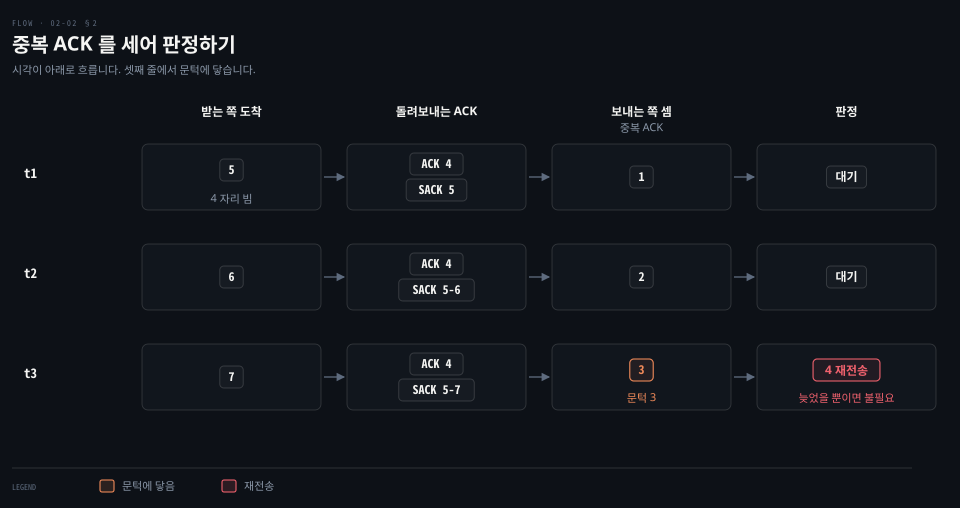
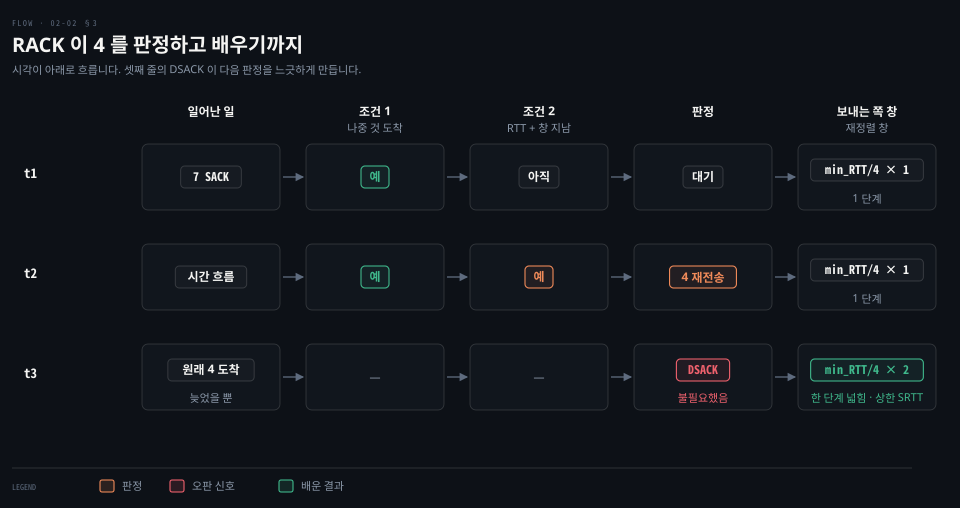
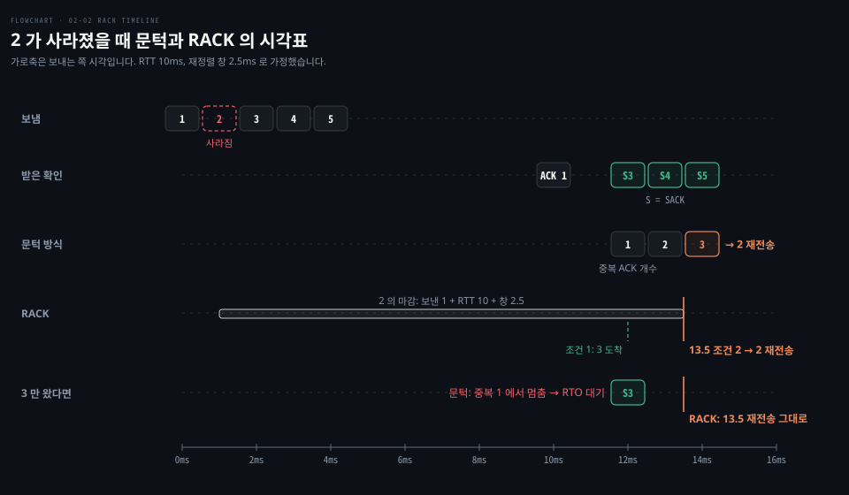
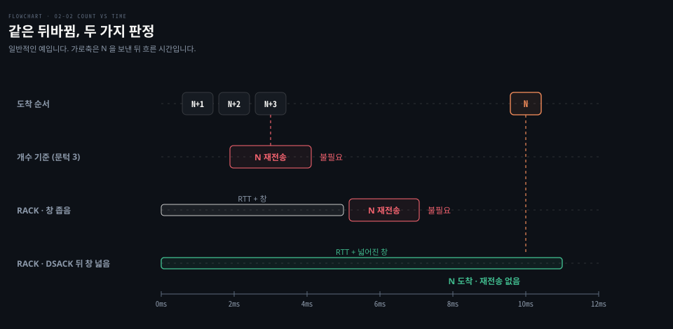
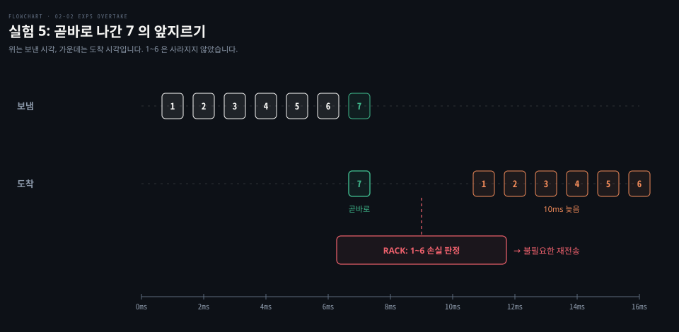
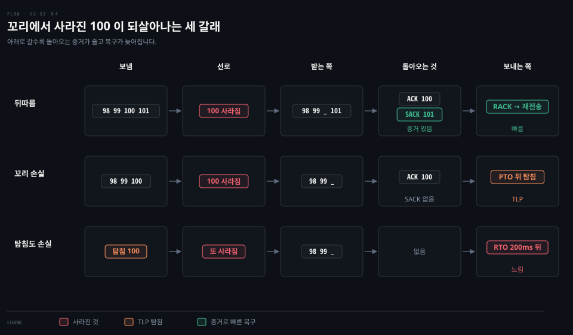

# TCP 는 손실을 어떻게 판정하나

---

> 보내는 쪽은 사라진 것과 늦은 것을 그 자리에서 가를 수 없어서, 02-01 의 실험 5 에서 TCP 는 패킷을 하나도 잃지 않고도 열 번 다시 보냈습니다. 이 문서는 그 판정을 개수, 시간(RACK), 흐름 끝의 탐침(TLP)과 최후의 타이머(RTO) 순서로 따라가며 실험 4·5 의 카운터를 다시 읽습니다.

## 학습 목표와 범위

> 이 문서를 읽고 나면 `nstat` 의 재전송 카운터를 보고 "어떤 판정이 몇 번 일어났고 그중 무엇이 불필요했을 수 있는가"를 설명할 수 있어야 합니다.

| 목표 | 어떻게 확인하나 |
|---|---|
| 보내는 쪽이 손실과 순서 뒤바뀜을 즉시 가를 수 없어 "얼마나 기다릴지"를 정해야 하는 이유를 설명합니다 | Phase 4 에서 도움 없이 답합니다 |
| 중복 ACK 문턱 3 이 맞는 경우와 틀리는 두 경우(뒤바뀜이 큼, 꼬리 손실)를 말합니다 | Phase 4 에서 도움 없이 답합니다 |
| RACK 이 손실을 판정하는 두 조건과, 재정렬 창이 DSACK 으로 넓어지는 과정을 설명합니다 | 실험 5 의 불필요한 재전송 10 번을 이 틀로 해석합니다 |
| 꼬리 손실이 TLP 로 빨리 복구되거나 RTO 로 늦게 복구되는 갈림길을 설명합니다 | 실험 4 의 `TCPLossProbes`·`TCPTimeouts` 를 이 틀로 해석합니다 |

다루지 않는 것은 혼잡 제어(재전송 뒤 보내는 양을 얼마나 줄이는가)와 RTO 값을 계산하는 식입니다. RTO 계산과 고전적인 빠른 재전송은 [cntd 03-03](../../book/cntd_computer-networking-top-down/03-03.TCP%20%EB%8A%94%20%EC%96%B4%EB%96%BB%EA%B2%8C%20%EC%84%B8%EA%B3%A0%20%EC%96%B4%EB%96%BB%EA%B2%8C%20%EA%B8%B0%EB%8B%A4%EB%A6%AC%EB%8A%94%EA%B0%80.md) 이 정본입니다.

| 키워드 | 뜻 | 학습 포인트·연결 개념 | 어디서 |
|---|---|---|---|
| ACK 세그먼트 | 받은 곳까지를 알리려고 보내는 TCP 세그먼트 | 데이터에 얹기도 하고 따로 보내기도 함 | §1 |
| SACK | 받는 쪽이 빈자리 뒤에 받은 구간을 따로 알려 주는 옵션 | 보내는 쪽이 "뒤는 도착했다"를 앎 | §1 |
| 중복 ACK 문턱 | 같은 ACK 가 몇 번 겹치면 손실로 볼지 정한 수 | 기본 3, Linux 는 뒤바뀜을 보면 올림 | §2 |
| RACK | 뒤에 보낸 것이 도착했고 일정 시간이 지나면 손실로 보는 판정 | 개수 대신 시간으로 기다림 | §3 |
| min_RTT · SRTT | 지금까지 잰 가장 작은 RTT · RTT 의 이동 평균 | 재정렬 창의 한 단계와 상한 | §3 |
| 재정렬 창 | RACK 이 RTT 에 더해 기다려 주는 여유 시간 | 0 또는 min_RTT/4 에서 시작, DSACK 을 받은 왕복마다 넓어짐 | §3 |
| DSACK | 받는 쪽이 같은 세그먼트를 두 번 받았다고 알리는 표시 | 보내는 쪽이 "재전송이 불필요했다"를 앎 | §3 |
| TLP | 흐름 끝에서 ACK 가 끊기면 탐침을 보내 신호를 끌어내는 장치 | RTO 까지 가지 않게 함 | §4 |
| RTO | 재전송 타이머가 끝나 다시 보내는 마지막 수단 | Linux 최소 200ms | §4 |

## 1. 사라졌는지 늦었는지, 보내는 쪽은 바로 가를 수 없습니다

> 빈자리 뒤로 세그먼트가 도착했다는 소식만으로는 앞 세그먼트가 사라졌는지 늦는 중인지 알 수 없습니다. 그래서 TCP 는 "얼마나 기다린 뒤 잃었다고 볼지"를 정해야 하고, 그 기다림이 짧으면 불필요한 재전송이, 길면 느린 복구가 생깁니다.

02-01 의 실험 5 는 손실 없이 순서만 뒤섞었습니다. 그런데 `nstat` 의 `TcpExtTCPFastRetrans` 가 10 늘었습니다. 잃은 것이 없는데 열 번 다시 보냈다는 뜻입니다. 이것이 버그가 아니라 설계상 피할 수 없는 대가라는 것을 이해하려면 보내는 쪽이 무엇을 보고 판단하는지부터 봐야 합니다.

### 보내는 쪽이 보는 것은 ACK 뿐입니다

받는 쪽은 데이터를 받으면 "다음에 받아야 할 번호"를 담은 ACK 를 돌려보냅니다. 보낼 데이터가 있으면 그 세그먼트에 ACK 를 얹고 없으면 본문 0 바이트 세그먼트로 ACK 만 보냅니다. 곧바로 보내지 않고 잠깐 기다리는 **지연 ACK(delayed ACK)** 도 있습니다.

어느 쪽이든 헤더에는 SEQ 칸과 ACK 칸이 늘 함께 있습니다. SEQ 는 내가 보내는 바이트의 번호이고, ACK 는 상대가 보낸 바이트를 어디까지 받았는지입니다. 양쪽이 각자 번호를 매기므로 echo 처럼 양쪽이 모두 데이터를 보내면 ACK 도 양방향으로 나갑니다. 본문이 없는 ACK 는 번호를 쓰지 않습니다. 이 과정 전체는 [cntd 03-03](../../book/cntd_computer-networking-top-down/03-03.TCP%20%EB%8A%94%20%EC%96%B4%EB%96%BB%EA%B2%8C%20%EC%84%B8%EA%B3%A0%20%EC%96%B4%EB%96%BB%EA%B2%8C%20%EA%B8%B0%EB%8B%A4%EB%A6%AC%EB%8A%94%EA%B0%80.md) 「Telnet 으로 따라가면」이 정본입니다.

실험 5 에서 `TcpOutSegs` 가 262 로, 메시지 왕복 200 개보다 많았던 것은 이렇게 따로 나간 ACK 세그먼트와 연결을 열고 닫는 SYN·FIN 이 더해졌기 때문으로 보입니다. Linux 의 `TcpOutSegs` 는 재전송을 세지 않고, 재전송은 `TcpRetransSegs` 로 따로 셉니다.[^outsegs] 이 카운터는 UDP 를 세지 않습니다. UDP 에는 ACK 가 없습니다.

누적 ACK 만으로는 빈자리 뒤에 무엇이 도착했는지 알 수 없습니다. 그래서 요즘 TCP 는 **SACK(Selective Acknowledgment)** 옵션을 함께 씁니다. "4 가 비었지만 5~6 은 받았다"처럼 빈자리 뒤에 받은 구간을 따로 알려 주는 것입니다.

`ACK 4` 만 받은 보내는 쪽은 5 와 6 도 사라졌는지 알 수 없지만, `ACK 4 · SACK 5-6` 을 받으면 4 만 다시 보내면 된다는 것을 압니다. RACK 이 "나중에 보낸 것이 도착했다"를 아는 것도 이 SACK 덕분입니다. 이 VM 의 `net.ipv4.tcp_sack` 은 1 로 켜져 있습니다. SACK 블록의 모양은 [cntd 03-03](../../book/cntd_computer-networking-top-down/03-03.TCP%20%EB%8A%94%20%EC%96%B4%EB%96%BB%EA%B2%8C%20%EC%84%B8%EA%B3%A0%20%EC%96%B4%EB%96%BB%EA%B2%8C%20%EA%B8%B0%EB%8B%A4%EB%A6%AC%EB%8A%94%EA%B0%80.md) 「SACK 은 누적 ACK 위에 얹히는 좌표입니다」가 정본입니다.

### 판정은 사후에만 확실합니다

RFC 8985 는 이 문제를 이렇게 적습니다. SACK 된 세그먼트를 알리는 ACK 를 받아도 보내는 쪽은 그것이 뒤바뀜 때문인지 손실 때문인지 곧바로 알 수 없고, 빠진 구간이 재전송 없이 나중에 채워졌을 때에야 뒤바뀜이었다고 알 수 있습니다.[^rfc8985-331] 그러니 손실 판정은 결국 "얼마나 기다려 줄 것인가"의 문제입니다.

| 기다림 | 뒤바뀜만 있을 때 | 진짜 손실일 때 |
|---|---|---|
| 짧게 | 불필요한 재전송 (실험 5) | 빨리 복구 |
| 길게 | 헛재전송 없음 | 복구가 늦음 |

기다림을 재는 잣대는 둘입니다. 뒤따라 도착한 세그먼트의 **개수**로 재거나 흐른 **시간**으로 잽니다. §2 와 §3 이 각각입니다.

## 2. 개수로 기다리기 - 중복 ACK 문턱

> 고전 규칙은 같은 ACK 가 세 번 더 오면 손실로 봅니다. 뒤바뀜이 세 칸 안쪽이고 손실 뒤로 세그먼트가 셋 이상 이어질 때는 잘 맞지만, 그 두 전제가 깨지면 틀리거나 아예 신호를 받지 못합니다.

RFC 5681 의 빠른 재전송은 중복 ACK 세 개가 도착하면 세그먼트를 잃은 것으로 봅니다. 재전송 타이머를 기다리지 않고 곧바로 다시 보냅니다.[^rfc5681] 받는 쪽이 같은 번호를 되풀이할 때마다 보내는 쪽이 하나씩 세는 방식입니다. 문턱이 하나가 아니라 셋인 이유는 약간의 뒤바뀜에도 중복 ACK 가 생기기 때문이고 그 논의는 [cntd 03-02](../../book/cntd_computer-networking-top-down/03-02.%EC%8B%A0%EB%A2%B0%EC%84%B1%EC%9D%80%20%EC%96%B4%EB%96%BB%EA%B2%8C%20%EB%A7%8C%EB%93%A4%EC%96%B4%EC%A7%80%EB%8A%94%EA%B0%80.md) 「중복 ACK 가 왜 하필 셋인가」에 있습니다.

RFC 8985 는 이 방식이 통하는 조건을 두 가지로 짚습니다. 네트워크의 뒤바뀜 정도가 문턱보다 작아야 하고 손실 뒤로 적어도 문턱만큼의 세그먼트가 확인되어야 합니다.[^rfc8985-331] 둘 중 하나가 깨지면 이렇게 됩니다.

| 깨진 전제 | 결과 | 이 랩의 장면 |
|---|---|---|
| 뒤바뀜이 세 칸을 넘음 | 늦었을 뿐인 세그먼트를 잃었다고 판정 | 실험 5: 10ms 늦춰진 75% 의 패킷을, 늦추지 않은 25% 의 뒤 패킷이 앞질러 도착 |
| 손실 뒤로 세그먼트가 셋 미만 | 중복 ACK 가 모자라 판정 못 함 | 02-01 의 1~6 예시, 실험 4 의 흐름 끝 |

Linux 는 첫째 문제를 줄이려고 문턱을 고정하지 않습니다. `net.ipv4.tcp_reordering` 은 연결이 시작할 때의 뒤바뀜 수준(기본 3)이고, 한 연결에서 뒤바뀜을 겪으면 커널이 이 값을 `net.ipv4.tcp_max_reordering`(기본 300)까지 올릴 수 있습니다.[^sysctl-reorder] 같은 오판을 되풀이하지 않도록 배우는 셈입니다. 그래도 개수는 "몇 칸 뒤바뀌었나"를 재는 잣대라서 뒤바뀜 폭이 들쭉날쭉한 경로에서는 적당한 값을 정하기 어렵습니다.

## 3. 시간으로 기다리기 - RACK

> RACK 은 "뒤에 보낸 것이 이미 도착했고, 이 세그먼트는 RTT 에 여유 시간을 더한 만큼 지나도록 도착하지 않았다"를 손실의 조건으로 삼습니다. Linux 는 2018 년부터 이것을 기본 판정으로 쓰고, 2025 년에는 개수만 세는 옛 판정 코드를 지웠습니다.

뒤바뀜을 "몇 칸"이 아니라 "몇 ms"로 보면 사정이 달라집니다. RFC 8985 는 경로가 갈라져서 생기든 무선 구간의 재전송 때문에 생기든, 뒤바뀜의 시간 폭은 대개 한 RTT 안에 든다고 봅니다. 그래서 개수 대신 시간 문턱을 쓰는 것이 뒤바뀜을 어느 정도 견디면서도 빠른 복구를 지키는 절충이라고 설명합니다.[^rfc8985-331]

### RACK 의 두 조건

**RACK(Recent ACKnowledgment)** 은 세그먼트 S 를 다음 두 조건이 모두 맞을 때 잃었다고 봅니다.[^rfc8985-331]

1. S 보다 **나중에 보낸** 세그먼트가 이미 도착했다(SACK 로 확인).
2. S 를 보낸 뒤 **추정 RTT + 재정렬 창**이 지나도록 S 가 도착하지 않았다.

첫 조건은 "뒤는 도착했다"는 증거입니다. 둘째 조건이 기다림입니다. **재정렬 창(reordering window)** 은 RTT 에 더해 기다려 주는 여유 시간입니다. 이 창이 넓으면 늦게 온 세그먼트를 기다려 주고 좁으면 빨리 판정합니다.

같은 손실 하나를 시각표에 놓으면 두 방식이 어떻게 다르게 움직이는지 보입니다. 1~5 를 1ms 간격으로 보냈고 2 가 사라졌으며 RTT 는 10ms, 재정렬 창은 2.5ms 라고 해 봅시다. 12ms 에 3 의 SACK 이 오면 RACK 은 2 보다 나중에 보낸 것이 도착했다는 첫 조건을 얻습니다. 그리고 2 의 마감을 보낸 시각 1ms + RTT 10ms + 창 2.5ms = 13.5ms 로 잡습니다. 마감이 지나도 2 가 오지 않으면 그때 다시 보냅니다.

문턱 방식은 3, 4, 5 의 도착마다 중복 ACK 를 하나씩 세다가 셋째인 14ms 에 다시 보냅니다. 둘의 차이가 가장 크게 드러나는 것은 뒤에 3 하나만 올 때입니다. 문턱 방식은 중복 ACK 1 개에서 멈춰 RTO 까지 기다립니다. RACK 은 3 하나로 첫 조건이 채워졌으므로 같은 13.5ms 에 다시 보냅니다. 문턱은 뒤에 도착한 개수로, RACK 은 보낸 시각부터 잰 시간으로 기다립니다.

### 창은 처음엔 좁고, 헛재전송을 겪으면 넓어집니다

창을 얼마로 잡을지가 §1 의 표를 그대로 옮긴 문제입니다. RFC 8985 가 뼈대를 정하고, 아래 표는 Linux 구현(`tcp_rack_reo_wnd`)을 따라 적었습니다.[^rack-wnd][^linux-reo]

표에 나오는 RTT 값 둘을 먼저 풀어 둡니다. **min_RTT** 는 이 연결에서 지금까지 잰 RTT 가운데 가장 작은 값입니다. **SRTT(Smoothed RTT)** 는 RTT 표본을 받을 때마다 `SRTT ← (1 - 1/8) × SRTT + 1/8 × 새 표본` 으로 갱신하는 이동 평균입니다.[^srtt] 재정렬 창은 min_RTT 의 4 분의 1 을 한 단계로 삼아 단계 수를 늘려 갑니다. 그리고 평균 왕복 시간인 SRTT 를 넘지 않게 묶입니다. SRTT 를 구하는 식은 [cntd 03-03](../../book/cntd_computer-networking-top-down/03-03.TCP%20%EB%8A%94%20%EC%96%B4%EB%96%BB%EA%B2%8C%20%EC%84%B8%EA%B3%A0%20%EC%96%B4%EB%96%BB%EA%B2%8C%20%EA%B8%B0%EB%8B%A4%EB%A6%AC%EB%8A%94%EA%B0%80.md) §4 가 정본입니다.

| 상황 | 재정렬 창 |
|---|---|
| 이 연결에서 아직 뒤바뀜을 보지 못했고, SACK 된 세그먼트가 연결별 `reordering` 값(시작 3) 이상이거나 이미 복구 중 | 0. 사실상 개수 기준처럼 곧바로 판정 |
| 그 밖의 경우 (뒤바뀜을 봤거나, SACK 된 것이 아직 셋 미만) | min_RTT/4 |
| DSACK 을 받은 왕복마다 (한 RTT 에 한 번) | 한 단계(min_RTT/4)씩 넓혀 1 단계 → 2 단계 → 3 단계로, 최대 SRTT 와 255 단계 가운데 먼저 닿는 곳까지. Linux 는 뒤바뀜을 본 적 없는 연결의 DSACK 은 세지 않음 |
| 넓힌 뒤 손실 복구 16 번이 지나면 | 다시 min_RTT/4 로 되돌림 |

여기서 **DSACK(Duplicate SACK)** 은 받는 쪽이 "이 세그먼트는 두 번 받았다"고 알리는 표시입니다. 보내는 쪽이 이것을 받으면 방금 한 재전송이 불필요했다는 것, 즉 창이 너무 좁았다는 것을 압니다. 이 VM 의 `net.ipv4.tcp_dsack` 은 1 입니다.

아래 도식은 일반적인 예입니다. N 이 10ms 늦고 N+1~N+3 이 먼저 도착한 장면을 세 가지 기준으로 판정한 모습이고, 실험 5 의 도착 모양 그대로는 아닙니다. 개수 기준과 좁은 창은 모두 N 을 잃었다고 판정해 불필요하게 재전송하고 DSACK 으로 넓어진 창만 N 을 기다립니다.

### Linux 에서는 이미 RACK 이 기본입니다

Linux 는 2018 년부터 RACK-TLP 를 기본 손실 판정으로 켰고 2025 년 6 월 커밋에서 개수만 세던 옛 판정(RFC 3517/6675) 코드를 지웠습니다.[^linux-remove] 지금 `ip-sysctl` 문서는 `tcp_recovery` 의 RACK 비트를 끄는 것이 효과가 없다고 적습니다. SACK 을 쓰는 연결에서는 RACK 이 유일하게 남은 판정 방식이기 때문입니다.[^sysctl-recovery] 이런 연결은 `tcp_input.c` 의 `tcp_identify_packet_loss` 에서 `tcp_rack_mark_lost` 로 손실을 표시합니다.

그렇다고 "셋"이 사라진 것은 아닙니다. 위 표의 첫 줄처럼, 뒤바뀜을 아직 보지 못한 연결에서는 SACK 된 세그먼트가 3 개 이상이면 창을 0 으로 두어 곧바로 판정합니다. 개수 문턱이 RACK 안에 첫 판정의 방아쇠로 남아 있는 셈입니다. SACK 을 쓰지 않는 연결은 지금도 중복 ACK 수를 세는 옛 경로(`tcp_newreno_mark_lost`)를 탑니다.

### 실험 5 의 불필요한 재전송 10 번

이 틀로 실험 5 를 읽으면 이렇습니다. 이 해석은 카운터 두 개와 소스 코드로 세운 것이고 DSACK 수는 재지 않았습니다.

- 실험 5 는 75% 의 패킷을 10ms 늦추고 25% 는 곧바로 보냈습니다. 1ms 간격이므로 곧바로 나간 패킷 하나가 그 앞 10ms 안에 보낸 늦춰진 패킷 여럿을 앞질러 도착합니다.
- 앞지른 패킷이 SACK 되면 RACK 의 첫 조건(뒤에 보낸 것이 도착)이 채워집니다. 창은 0 이거나 min_RTT/4 인데, 늦추지 않은 패킷 때문에 min_RTT 가 작게 잡혀 둘 다 10ms 에 크게 못 미칩니다. 그래서 늦었을 뿐인 앞 패킷들을 잃었다고 판정했습니다.
- DSACK 으로 창이 넓어질 수는 있지만 한 RTT 에 한 단계, 최대 255 단계와 SRTT 에서 멈춥니다. loopback 의 min_RTT 로는 255 단계를 다 넓혀도 10ms 에 못 닿을 수 있습니다.

다음 실험에서 `TcpExtTCPDSACKRecv`·`TcpExtTCPSACKReorder` 를 함께 세면 이 해석을 확인할 수 있습니다.

## 4. 꼬리 손실은 TLP 가, 마지막은 RTO 가 맡습니다

> 흐름의 마지막 세그먼트가 사라지면 뒤따라 도착하는 것이 없어 개수도 RACK 도 판정할 증거를 얻지 못합니다. TLP 는 탐침을 하나 보내 그 증거를 만들어 내고, 탐침마저 사라지면 재전송 타이머(RTO)가 끝날 때까지 기다려야 합니다.

§2 의 두 번째 깨진 전제는 RACK 에도 그대로 남습니다. RACK 의 첫 조건이 "나중에 보낸 것이 도착했다"이기 때문입니다. 마지막 세그먼트 뒤에는 나중에 보낸 것이 없습니다. 이렇게 흐름 끝에서 난 손실을 꼬리 손실이라고 부릅니다. 02-01 의 1~6 예시(4 뒤로 5·6 둘만 옴)는 개수 규칙에서는 판정을 못 하지만, RACK 은 5·6 이 SACK 되면 재정렬 창이 지난 뒤 4 를 잃었다고 판정합니다. RACK 이 증거를 얻지 못하는 것은 뒤에 아무것도 없는 진짜 꼬리 손실뿐입니다.

### TLP 는 탐침으로 ACK 를 끌어냅니다

**TLP(Tail Loss Probe)** 는 ACK 가 끊긴 채 일정 시간이 지나면 세그먼트 하나를 탐침으로 보냅니다. 새로 보낼 데이터가 있으면 그것을 보내고 없으면 마지막 세그먼트를 다시 보냅니다. 기다리는 시간인 PTO 는 RFC 8985 에서 SRTT 가 있으면 `2 * SRTT` 입니다.[^pto] Linux 는 여기에 2ms 를 더하고, 날아가는 세그먼트가 하나뿐이면 지연 ACK 를 고려해 최소 RTO(200ms)를 더합니다.[^linux-pto]

탐침이 도착하면 받는 쪽이 ACK(와 SACK)를 돌려줍니다. 보내는 쪽은 그것을 증거로 RACK 판정을 해서 빠른 복구로 넘어갑니다. Linux 문서는 TLP 가 꼬리 손실로 생길 RTO 를 빠른 복구로 바꾼다고 적습니다. `tcp_early_retrans` 기본값 3 이 TLP 를 켠 상태입니다.[^sysctl-tlp]

### 탐침도 사라지면 RTO 를 기다립니다

**RTO(Retransmission Timeout)** 는 마지막 수단입니다. 탐침까지 사라지면 재전송 타이머가 끝나야 다시 보냅니다. Linux 의 최소 RTO 는 200ms(`TCP_RTO_MIN` = `HZ/5`)라서[^rto-min], loopback 처럼 RTT 가 1ms 도 안 되는 경로에서도 한 번 걸리면 200ms 를 기다립니다. 꼬리 손실과 TLP 의 고전적 배경은 [cntd 03-03](../../book/cntd_computer-networking-top-down/03-03.TCP%20%EB%8A%94%20%EC%96%B4%EB%96%BB%EA%B2%8C%20%EC%84%B8%EA%B3%A0%20%EC%96%B4%EB%96%BB%EA%B2%8C%20%EA%B8%B0%EB%8B%A4%EB%A6%AC%EB%8A%94%EA%B0%80.md) 「뒤에 셋이 못 오면 빠른 길이 없습니다」가 다룹니다. RTO 뒤의 복구 방식과 타이머 값을 정하는 식은 [cntd 03-03](../../book/cntd_computer-networking-top-down/03-03.TCP%20%EB%8A%94%20%EC%96%B4%EB%96%BB%EA%B2%8C%20%EC%84%B8%EA%B3%A0%20%EC%96%B4%EB%96%BB%EA%B2%8C%20%EA%B8%B0%EB%8B%A4%EB%A6%AC%EB%8A%94%EA%B0%80.md) §4·§5 가 다룹니다.

세그먼트가 뒤따를 때, 꼬리 손실을 TLP 가 구할 때, 탐침마저 사라져 RTO 로 떨어질 때의 세 갈래는 이 절 맨 위의 도식에 나란히 그려 두었습니다.

### 실험 4 의 카운터를 다시 읽으면

실험 4(손실 20%, 메시지 100 개)에서 늘어난 카운터는 이 세 갈래에 대체로 대응하지만 칸끼리 겹칩니다.

| 카운터 | 늘어난 값 | 갈래 |
|---|---|---|
| `TcpExtTCPFastRetrans` | 6 | 뒤따르는 세그먼트가 증거가 된 빠른 재전송 (RACK) |
| `TcpExtTCPLossProbes` | 2 | ACK 가 끊겨 보낸 TLP 탐침 |
| `TcpExtTCPTimeouts` | 2 | 탐침으로도 못 구해 RTO 까지 간 경우 |
| `TcpRetransSegs` | 9 | 다시 보낸 세그먼트 전체 |

TLP 로 끌어낸 ACK 뒤의 재전송도 `TCPFastRetrans` 에 들어가고, `TCPTimeouts` 는 TLP 없이 곧바로 난 RTO 와 SYN 재전송 타이머도 셉니다. `TCPLossProbes` 는 탐침으로 새 데이터를 보낸 경우도 셉니다. 그래서 세 칸을 더해 갈래별 건수를 정확히 가를 수는 없습니다.

TCP 쪽 걸린 시간이 280ms 에서 461ms 로 180ms 가량 늘었습니다. RTO 두 번이 측정 구간 안에서 200ms 씩 더해졌다면 400ms 가 늘었어야 합니다. 그러니 RTO 일부는 측정 구간 밖에서 났거나 다른 대기와 겹쳤을 수 있습니다. `phase2-loss` 는 연결을 연 뒤에 시간을 재기 시작하므로, 핸드셰이크의 SYN 손실(첫 RTO 1 초)이나 연결을 닫는 FIN 손실은 걸린 시간에 들어가지 않습니다. 이 수치만으로는 가를 수 없습니다.

빠른 재전송·TLP·최소 RTO 를 운영 관점에서 묶어 본 설명은 [systems-performance 10-02](../../book/systems-performance/10-02.%EB%84%A4%ED%8A%B8%EC%9B%8C%ED%81%AC%20%E2%80%94%20%EC%95%84%ED%82%A4%ED%85%8D%EC%B2%98.md) 「손실을 빨리 알아채는 법」에 있습니다. 어느 세그먼트에서 어떤 갈래를 탔는지는 `ss -ti` 나 패킷 캡처로 따로 봐야 하고 이 랩에서는 아직 보지 않았습니다.

## 검증과 복습

> 이 문서는 Phase 3 을 마치며 학습자 질문("문턱이 고정이 아니라면 무엇이고, 시간 기반 감지를 켜면 무엇이 달라지나")에 답하려고 썼습니다.

- 4-Phase: 02-01 과 함께 Phase 4 에서 확인합니다. 아직 진행하지 않았습니다.
- 정정 이력: Phase 3 대화에서 "중복 ACK 셋이 모여 빠른 재전송이 발동했다"고 설명했습니다. 이 VM 커널의 실제 판정은 RACK 이고 셋은 그 안의 첫 방아쇠로 남아 있다는 것이 이 문서의 정리입니다.
- 복습 표적: 손실과 뒤바뀜을 즉시 가를 수 없는 이유, RACK 의 두 조건, 꼬리 손실의 세 갈래

## 출처와 관련 문서

> 동작 주장에 쓴 1차 자료와, 설명을 넘긴 노트입니다.

- [02-03 UDP 실습 기록](./02-03.UDP%20%EC%8B%A4%EC%8A%B5%20%EA%B8%B0%EB%A1%9D%20-%20%EA%B2%BD%EA%B3%84%C2%B7%EC%9E%98%EB%A6%BC%C2%B7%EC%86%8C%EC%BC%93%C2%B7netem%20%EC%86%90%EC%8B%A4%EA%B3%BC%20%EC%88%9C%EC%84%9C.md): 실험 4·5 의 명령과 카운터 원 출력, 다음 실험 후보
- [02-01 경계를 지키는 UDP, 대신 떠안는 것](./02-01.%EA%B2%BD%EA%B3%84%EB%A5%BC%20%EC%A7%80%ED%82%A4%EB%8A%94%20UDP,%20%EB%8C%80%EC%8B%A0%20%EB%96%A0%EC%95%88%EB%8A%94%20%EA%B2%83%20-%20%EB%8D%B0%EC%9D%B4%ED%84%B0%EA%B7%B8%EB%9E%A8%C2%B7%EC%86%90%EC%8B%A4%C2%B7%EC%88%9C%EC%84%9C.md): 누적 ACK 표, 실험 4·5 의 원 결과
- [cntd 03-02 신뢰성은 어떻게 만들어지는가](../../book/cntd_computer-networking-top-down/03-02.%EC%8B%A0%EB%A2%B0%EC%84%B1%EC%9D%80%20%EC%96%B4%EB%96%BB%EA%B2%8C%20%EB%A7%8C%EB%93%A4%EC%96%B4%EC%A7%80%EB%8A%94%EA%B0%80.md): 중복 ACK 문턱이 셋인 이유
- [cntd 03-03 TCP 는 어떻게 세고 어떻게 기다리는가](../../book/cntd_computer-networking-top-down/03-03.TCP%20%EB%8A%94%20%EC%96%B4%EB%96%BB%EA%B2%8C%20%EC%84%B8%EA%B3%A0%20%EC%96%B4%EB%96%BB%EA%B2%8C%20%EA%B8%B0%EB%8B%A4%EB%A6%AC%EB%8A%94%EA%B0%80.md): 순서 번호, RTO 계산, 고전적 빠른 재전송

[^rfc5681]: RFC 5681 "TCP Congestion Control" §3.2, "The fast retransmit algorithm uses the arrival of 3 duplicate ACKs … as an indication that a segment has been lost." <https://www.rfc-editor.org/rfc/rfc5681#section-3.2>
[^rfc8985-331]: RFC 8985 "The RACK-TLP Loss Detection Algorithm for TCP" §3.3.1, "a sender cannot tell immediately whether that was a result of reordering or loss" · "effective if the network reordering degree (in sequence distance) is smaller than DupThresh and at least DupThresh segments after the loss is acknowledged" · "the degree of reordering in time difference in such cases is usually within a single round-trip time" · "the sender considers a data segment S lost if … Another data segment sent later than S has been delivered … S has not been delivered after the estimated round-trip time plus the reordering window." <https://www.rfc-editor.org/rfc/rfc8985#section-3.3.1>
[^rack-wnd]: RFC 8985 §3.3.2·§6.2, "The reordering window SHOULD be set to zero if no reordering has been observed" · "it starts with a conservative RACK.reo_wnd of RACK.min_RTT/4" · "after N round trips in which a DSACK is received, the RACK.reo_wnd becomes (N+1) * min_RTT / 4, with an upper-bound of SRTT" · "persists using the inflated RACK.reo_wnd for up to 16 loss recoveries". <https://www.rfc-editor.org/rfc/rfc8985>
[^linux-reo]: Linux 소스 `net/ipv4/tcp_recovery.c` 의 `tcp_rack_reo_wnd`: 뒤바뀜을 보지 못했고 `tp->sacked_out >= tp->reordering` 이면 0, 그 밖에는 `min((tcp_min_rtt(tp) >> 2) * tp->rack.reo_wnd_steps, tp->srtt_us >> 3)` (2026-09-29 master). <https://github.com/torvalds/linux/blob/master/net/ipv4/tcp_recovery.c>
[^linux-remove]: Linux 커밋 1c120191dcec "tcp: remove obsolete and unused RFC3517/RFC6675 loss recovery code" (2025-06-17), "RACK-TLP loss detection has been enabled as the default loss detection algorithm for Linux TCP since 2018". <https://github.com/torvalds/linux/commit/1c120191dcec>
[^sysctl-reorder]: Linux `Documentation/networking/ip-sysctl.rst`, `tcp_reordering` "Initial reordering level of packets in a TCP stream. TCP stack can then dynamically adjust flow reordering level between this initial value and tcp_max_reordering. Default: 3", `tcp_max_reordering` "Default: 300". <https://docs.kernel.org/networking/ip-sysctl.html>
[^sysctl-recovery]: 같은 문서 `tcp_recovery`, "RACK: 0x1 enables RACK loss detection … currently, setting this bit to 0 has no effect, since RACK is the only supported loss detection algorithm." <https://docs.kernel.org/networking/ip-sysctl.html>
[^sysctl-tlp]: 같은 문서 `tcp_early_retrans`, "Tail loss probe (TLP) converts RTOs occurring due to tail losses into fast recovery (RFC8985)" · "Default: 3". <https://docs.kernel.org/networking/ip-sysctl.html>
[^srtt]: RFC 6298 "Computing TCP's Retransmission Timer" §2, "SRTT <- (1 - alpha) * SRTT + alpha * R'" · "The above SHOULD be computed using alpha=1/8 and beta=1/4". <https://www.rfc-editor.org/rfc/rfc6298>
[^pto]: RFC 8985 §7.2, "If SRTT is available: PTO = 2 * SRTT". <https://www.rfc-editor.org/rfc/rfc8985>
[^outsegs]: Linux 소스 `net/ipv4/tcp_output.c` 의 `__tcp_transmit_skb`, `if (after(tcb->end_seq, tp->snd_nxt) || tcb->seq == tcb->end_seq) TCP_ADD_STATS(sock_net(sk), TCP_MIB_OUTSEGS, …)` — 새 데이터나 데이터 없는 세그먼트만 셈 (2026-09-29 master). <https://github.com/torvalds/linux/blob/master/net/ipv4/tcp_output.c>
[^linux-pto]: Linux 소스 `net/ipv4/tcp_output.c` 의 `tcp_schedule_loss_probe`, "Probe timeout is 2*rtt. Add minimum RTO to account for delayed ack when there's one outstanding packet." · `timeout_us = tp->srtt_us >> 2; if (tp->packets_out == 1) timeout_us += tcp_rto_min_us(sk); else timeout_us += TCP_TIMEOUT_MIN_US;` (2026-09-29 master). <https://github.com/torvalds/linux/blob/master/net/ipv4/tcp_output.c>
[^rto-min]: Linux 소스 `include/net/tcp.h`, `#define TCP_RTO_MIN ((unsigned)(HZ / 5))` (2026-09-29 master). <https://github.com/torvalds/linux/blob/master/include/net/tcp.h>
