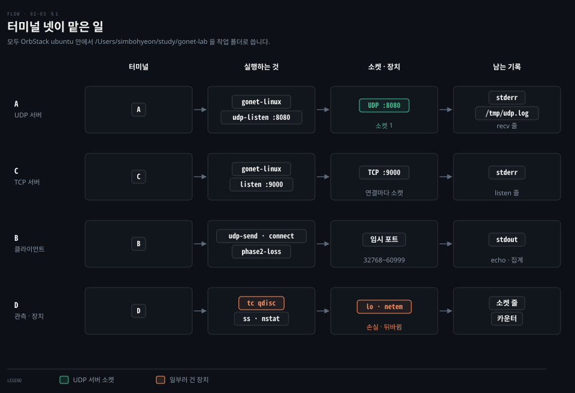
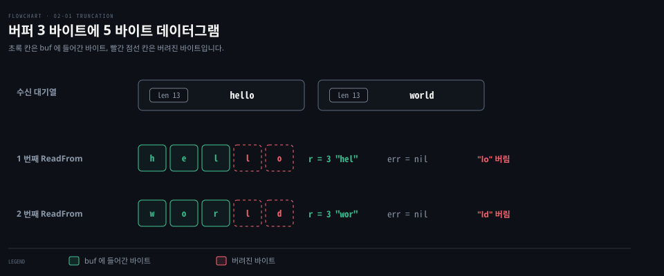
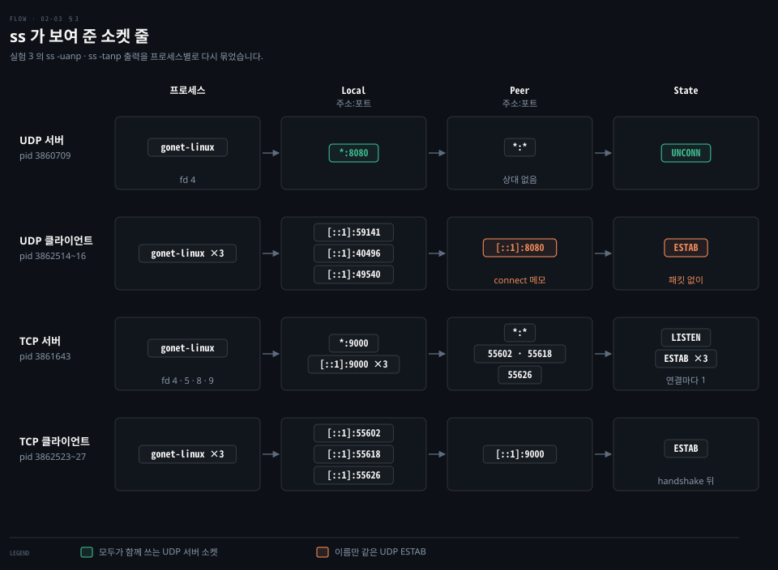
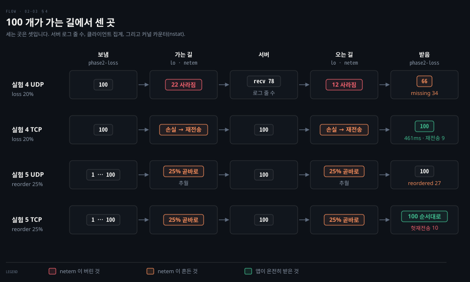

# UDP 실습 기록

---

> 02-01 과 02-02 가 설명한 것을 직접 돌려 본 다섯 실험의 기록입니다. 실험마다 명령, 학습자의 예측과 그 제출 시점, 실제 출력, 해석을 차례로 적었습니다.

## 학습 목표와 범위

> 이 문서를 따라 하면 같은 VM 에서 다섯 실험을 다시 돌려 같은 모양의 결과를 얻어야 합니다. 숫자가 달라져도 무엇을 보면 되는지 알 수 있어야 합니다.

| 목표 | 어떻게 확인하나 |
|---|---|
| UDP 가 쓰기 한 번을 읽기 한 번으로 지키고, 버퍼가 작으면 에러 없이 자른다는 것을 로그로 봅니다 | 실험 1·2 |
| UDP 서버 소켓이 하나이고 UDP 클라이언트의 ESTAB 이 한쪽의 메모라는 것을 ss 로 봅니다 | 실험 3 |
| netem 으로 손실·뒤바뀜을 걸고, 세는 곳 셋(서버 로그·클라이언트 집계·nstat)으로 TCP 와 UDP 가 무너지는 모양을 비교합니다 | 실험 4·5 |

개념 설명은 [02-01](./02-01.%EA%B2%BD%EA%B3%84%EB%A5%BC%20%EC%A7%80%ED%82%A4%EB%8A%94%20UDP,%20%EB%8C%80%EC%8B%A0%20%EB%96%A0%EC%95%88%EB%8A%94%20%EA%B2%83%20-%20%EB%8D%B0%EC%9D%B4%ED%84%B0%EA%B7%B8%EB%9E%A8%C2%B7%EC%86%90%EC%8B%A4%C2%B7%EC%88%9C%EC%84%9C.md) 과 [02-02](./02-02.TCP%20%EB%8A%94%20%EC%86%90%EC%8B%A4%EC%9D%84%20%EC%96%B4%EB%96%BB%EA%B2%8C%20%ED%8C%90%EC%A0%95%ED%95%98%EB%82%98%20-%20%EC%A4%91%EB%B3%B5%20ACK%20%EB%AC%B8%ED%84%B1%C2%B7RACK%C2%B7TLP.md) 가 정본입니다. 여기서는 실행과 관측만 다룹니다.

| 키워드 | 뜻 | 학습 포인트·연결 개념 | 어디서 |
|---|---|---|---|
| qdisc | 커널이 장치로 패킷을 내보내기 직전에 거치는 대기열 규칙 | 평소 `lo` 는 `noqueue` | §4 |
| netem | 손실·지연·순서 뒤바뀜을 흉내 내는 qdisc | 앱 코드가 아니라 커널 안에서 버림 | §4 |
| `nstat` | 커널 네트워크 카운터를 기준점부터 늘어난 만큼 보여 주는 도구 | VM 전체 값, 양 끝이 합쳐짐 | §4 |


## 1. 실습 환경과 코드

> 모든 실험은 OrbStack ubuntu 안에서 터미널 넷으로 돌렸습니다. 서버 둘은 계속 띄워 두고 클라이언트와 관측 명령만 바꿔 가며 실행합니다.



코드는 AI 가 작성했습니다. 실행과 해석은 학습자가 했습니다. 세 곳입니다.

| 파일 | 하는 일 |
|---|---|
| `internal/udp/udp.go` | `Serve`: `ReadFrom` → `recv r= from= data=` 로그 → `WriteTo` 로 echo. `Send`: `Dial("udp")` → `Write` 반복 → 정한 시간 동안 echo 를 받아 찍음 |
| `cmd/gonet/main.go` | `gonet udp-listen <addr> [buf]`, `gonet udp-send <addr> <wait> <msg>...` |
| `experiments/phase2-loss/main.go` | 번호 붙은 메시지 N 개를 UDP echo 와 TCP echo 로 보내 받은 수·빠진 번호·뒤바뀜·걸린 시간을 출력. TCP 쪽은 `\n` 으로 프레이밍 |
| `internal/udp/udp_test.go` | 경계 보존과 무에러 잘림을 테스트로 고정 |

macOS 에서 Linux 용으로 빌드합니다. VM 안에서는 `~` 가 다르므로 절대 경로로 들어갑니다.

```bash
# macOS
cd ~/study/gonet-lab
make build-linux
CGO_ENABLED=0 GOOS=linux GOARCH=arm64 go build -trimpath -o bin/phase2-loss ./experiments/phase2-loss

# 각 터미널
orb -m ubuntu
cd /Users/simbohyeon/study/gonet-lab
```


## 2. 실험 1·2 - 쓰기 한 번은 읽기 한 번이고, 넘치면 잘린다

> 실험 1 은 `hello`·`world` 두 데이터그램이 서버에서도 두 번의 `recv r=5` 로 찍히는지, 실험 2 는 버퍼를 3 바이트로 줄였을 때 남는 바이트가 어떻게 되는지 봅니다.



### 실험 1 - 경계 보존과 보낸 쪽 주소

```bash
# A
./bin/gonet-linux udp-listen :8080
# B
./bin/gonet-linux udp-send localhost:8080 1s hello world
```

예측은 결과와 함께 냈고 둘이었습니다.

- 서버에 두 줄, `r` 은 5
- 서버의 `from=` 포트는 클라이언트 소켓의 임시 포트 그대로

```bash
# A
udp-listen addr=[::]:8080 pid=3851139 buf=65536
recv r=5 from=[::1]:36811 data="hello"
recv r=5 from=[::1]:36811 data="world"
# B
local=[::1]:36811 remote=[::1]:8080
echo r=5 data="hello"
echo r=5 data="world"
```

해석은 이렇습니다. `WriteTo` 한 번이 `ReadFrom` 한 번으로 이어졌습니다. `local=` 은 `hello` 를 보내기 전에 찍혔는데 이미 포트가 있었습니다. `Dial("udp")` 이 부른 `connect()` 때 클라이언트 커널이 임시 포트를 붙였기 때문입니다. 커널이 클라이언트 포트를 고르는 모습은 [cntd 02-01](../../book/cntd_computer-networking-top-down/02-01.%EC%95%B1%EC%9D%80%20%EB%AC%B4%EC%97%87%EC%9D%84%20%EA%B3%A0%EB%A5%B4%EA%B3%A0%20%EB%AC%B4%EC%97%87%EC%9D%84%20%EB%AA%BB%20%EA%B3%A0%EB%A5%B4%EB%8A%94%EA%B0%80.md) 「udpclient.go」에도 나옵니다. 학습자는 처음에 "서버가 정한 포트"라고 읽었다가 클라이언트 커널이 붙인 포트라고 바로잡았습니다.

`localhost` 는 IPv6 `::1` 로 풀려 주소가 `[::1]` 로 찍혔습니다. 서버의 `[::]:8080` 은 IPv4 연결도 함께 받습니다.

### 실험 2 - 버퍼 3 바이트

```bash
# A (Ctrl-C 뒤)
./bin/gonet-linux udp-listen :8080 3
# B
./bin/gonet-linux udp-send localhost:8080 1s hello world
```

예측은 실행 전에 냈고 넷이었습니다.

- 서버 로그는 3 글자씩
- 남은 부분은 버려짐
- 에러 로그 없음
- echo 도 3 글자씩

```bash
# A
recv r=3 from=[::1]:35152 data="hel"
recv r=3 from=[::1]:35152 data="wor"
# B
local=[::1]:35152 remote=[::1]:8080
echo r=3 data="hel"
echo r=3 data="wor"
```

예측 넷이 모두 맞았습니다. 두 번째 읽기가 `lo` 가 아니라 `wor` 이므로 남은 바이트는 버려졌습니다. Linux 에서 Go 의 `ReadFrom` 은 이를 에러로 알리지 않았습니다. 포트가 36811 에서 35152 로 바뀐 것은 `udp-send` 를 실행할 때마다 새 소켓이 생기기 때문입니다. 그 소켓의 `connect()` 때 새 임시 포트가 붙습니다.


## 3. 실험 3 - 클라이언트 셋을 붙인 서버 소켓 수

> UDP 서버와 TCP 서버에 클라이언트를 셋씩 붙인 채 `ss` 로 소켓 줄을 셉니다. UDP 서버가 한 줄로 남는지, TCP 서버는 listener 에 연결 수만큼 줄이 더해지는지 봅니다.



```bash
# A: udp-listen :8080, C: listen :9000 을 띄운 상태에서
# B
for i in 1 2 3; do ./bin/gonet-linux udp-send localhost:8080 60s hi$i & done
for i in 1 2 3; do sleep 60 | ./bin/gonet-linux connect localhost:9000 & done
# D (B 직후, 60 초 안에)
ss -uanp | grep -E 'State|gonet'
ss -tanp | grep -E 'State|gonet'
```

예측은 내지 않았습니다. 첫 시도는 30 초로 했는데 `ss` 에 클라이언트가 보이지 않아 60 초로 늘려 다시 했습니다.

```bash
UNCONN 0 0              *:8080         *:*    users:(("gonet-linux",pid=3860709,fd=4))
ESTAB  0 0          [::1]:59141    [::1]:8080 users:(("gonet-linux",pid=3862514,fd=4))
LISTEN 0 4096           *:9000         *:*    users:(("gonet-linux",pid=3861643,fd=4))
ESTAB  0 0          [::1]:9000     [::1]:55602 users:(("gonet-linux",pid=3861643,fd=5))
ESTAB  0 0          [::1]:55602    [::1]:9000  users:(("gonet-linux",pid=3862527,fd=4))
```

위는 출력 가운데 종류마다 한 줄씩 추린 것입니다. 전체 줄 수는 도식에 있습니다. 학습자가 개수를 직접 읽었습니다. UDP 는 서버 1 + 클라이언트 3, TCP 는 서버 4(listener 1 + 연결 3) + 클라이언트 3 이었습니다.

예상 밖은 UDP 클라이언트 줄의 `ESTAB` 이었습니다. 학습자는 "connect 때 상대 주소를 바로 주입하는가"까지 스스로 갔습니다. 나머지는 설명으로 채웠습니다. UDP `connect()` 는 패킷 없이 자기 소켓에 상대 주소만 적습니다. Linux 는 그 소켓의 상태 칸에 `TCP_ESTABLISHED` 를 넣습니다. 그래서 서버 줄은 여전히 Peer `*:*` 입니다. 자세한 설명은 02-01 §3 에 있습니다.

`ss` 의 옵션과 `UNCONN` 줄 읽는 법은 [learning-modern-linux 07-02](../../book/learning-modern-linux/07-02.%ED%8F%AC%ED%8A%B8%EA%B0%80%20%EC%9E%88%EC%96%B4%EC%95%BC%20%EC%84%9C%EB%B9%84%EC%8A%A4%EB%A5%BC%20%EA%B0%80%EB%A6%AC%ED%82%AC%20%EC%88%98%20%EC%9E%88%EA%B3%A0%20%EC%9D%B4%EB%A6%84%EC%9D%B4%20%EC%9E%88%EC%96%B4%EC%95%BC%20%EC%82%AC%EB%9E%8C%EC%9D%B4%20%EA%B8%B0%EC%96%B5%ED%95%9C%EB%8B%A4.md) §4 「소켓」이, listener 와 연결 소켓의 관계는 [cntd 03-01](../../book/cntd_computer-networking-top-down/03-01.%ED%8A%B8%EB%9E%9C%EC%8A%A4%ED%8F%AC%ED%8A%B8%EB%8A%94%20%EB%AC%B4%EC%97%87%EC%9D%84%20%EB%8D%94%ED%95%98%EB%8A%94%EA%B0%80.md) 「듣는 소켓과 연결된 소켓」이 정본입니다. `for` 줄이 찍는 `[1]`~`[6]` 은 셸이 백그라운드 작업마다 붙이는 작업 번호입니다.


## 4. 실험 4·5 - netem 으로 손실과 뒤바뀜을 걸고 세 곳에서 센다

> `lo` 에 netem 을 걸고 번호 붙은 메시지 100 개를 UDP·TCP echo 로 보냅니다. 서버 로그 줄 수, 클라이언트 집계, `nstat` 카운터를 함께 보면 손실이 가는 길에서 났는지 오는 길에서 났는지, TCP 가 무엇으로 되살렸는지까지 보입니다.



### 장치 - qdisc 와 netem

**qdisc(queueing discipline)** 는 커널이 장치로 패킷을 내보내기 직전에 거치는 대기열 규칙이고, **netem(network emulator)** 은 손실·지연·순서 뒤바뀜을 흉내 내는 qdisc 입니다.[^netem] qdisc 의 자리는 [systems-performance 10-02](../../book/systems-performance/10-02.%EB%84%A4%ED%8A%B8%EC%9B%8C%ED%81%AC%20%E2%80%94%20%EC%95%84%ED%82%A4%ED%85%8D%EC%B2%98.md) 「큐잉 규율·드라이버 링 버퍼·장치 백로그」가, `tc netem` 으로 손실을 걸어 재는 방법은 [systems-performance 10-03](../../book/systems-performance/10-03.%EB%84%A4%ED%8A%B8%EC%9B%8C%ED%81%AC%20%E2%80%94%20%EB%B0%A9%EB%B2%95%EB%A1%A0%C2%B7%EC%8B%A4%ED%97%98%C2%B7%ED%8A%9C%EB%8B%9D.md) §4 「실험」이 정본입니다. 손실은 우리 Go 코드가 아니라 커널 안에서 일어나므로 앱은 실제 네트워크에서처럼 모른 채 겪습니다.

| 설정 | 뜻 |
|---|---|
| `netem loss 20%` | `lo` 로 나가는 패킷마다 따로 20% 확률로 버림 |
| `netem delay 10ms reorder 25% 50%` | 75% 는 10ms 늦추고 25% 는 곧바로 보냄. 50% 는 앞 패킷의 선택을 따라가는 상관도라 곧바로 나가는 패킷이 몰려 나옴 |

`lo` 전체에 걸리므로 실험이 끝나면 곧바로 되돌립니다.

### 실험 4 - 손실 20%

```bash
# D
nstat -n
sudo tc qdisc add dev lo root netem loss 20%
# B
./bin/phase2-loss -udp 127.0.0.1:8080 -tcp 127.0.0.1:9000 -n 100
# D
sudo tc qdisc del dev lo root
grep -c 'data="seq=' /tmp/udp.log
nstat -z TcpRetransSegs TcpExtTCPFastRetrans TcpExtTCPTimeouts TcpExtTCPLossProbes
```

재실험 전에 A 의 서버를 `udp-listen :8080 2> /tmp/udp.log` 로 다시 띄워 로그를 파일로 받았습니다. `nstat -n` 으로 기준점을 찍고 늘어난 값만 보는 방법은 [systems-performance 10-04](../../book/systems-performance/10-04.%EB%84%A4%ED%8A%B8%EC%9B%8C%ED%81%AC%20%E2%80%94%20%EA%B4%80%EC%B8%A1%20%EB%8F%84%EA%B5%AC.md) §1 이 다룹니다.

| 회차 | 예측 | UDP | TCP |
|---|---|---|---|
| 손실 없음 (기준) | - | 100 / 100, 307ms | 100 / 100, 280ms |
| 첫 회 | 없음 (질문으로 대신) | 58 / 100, missing 42 | 100 / 100, 498ms |
| 재실험 | 결과와 함께 제출: 100 → 80 → 64, 빠른 재전송이 더 많음 | 서버 로그 78, 받음 66 | 100 / 100, 461ms |

재실험의 커널 카운터는 `TcpRetransSegs` 9, `TcpExtTCPFastRetrans` 6, `TcpExtTCPTimeouts` 2, `TcpExtTCPLossProbes` 2 였습니다.

해석을 차례로 적으면 이렇습니다.

- echo 라서 데이터그램 하나가 `lo` 를 두 번 지납니다. 돌아올 확률은 0.8 × 0.8 = 0.64 이고 실측 66 은 그 근처입니다.
- 서버 로그 78 줄을 함께 세면 가는 길 손실 22 개와 오는 길 손실 12 개가 나뉩니다.
- 첫 회의 missing 42 개는 `1 2 5 6 9 …` 처럼 흩어졌습니다. netem 이 패킷마다 따로 확률을 적용하기 때문입니다. 기대값 36 개와의 차이는 1σ 남짓으로 흔한 흔들림입니다.
- TCP 는 커널이 재전송해 100 개를 모두 받았고 시간이 늘었습니다. 카운터를 세 갈래(빠른 재전송·TLP·RTO)로 읽는 법과 그 한계는 [02-02](./02-02.TCP%20%EB%8A%94%20%EC%86%90%EC%8B%A4%EC%9D%84%20%EC%96%B4%EB%96%BB%EA%B2%8C%20%ED%8C%90%EC%A0%95%ED%95%98%EB%82%98%20-%20%EC%A4%91%EB%B3%B5%20ACK%20%EB%AC%B8%ED%84%B1%C2%B7RACK%C2%B7TLP.md) §4 에 있습니다.

### 실험 5 - 순서 뒤바뀜만

```bash
# D
nstat -n
sudo tc qdisc add dev lo root netem delay 10ms reorder 25% 50%
# B
./bin/phase2-loss -udp 127.0.0.1:8080 -tcp 127.0.0.1:9000 -n 100
# D
sudo tc qdisc del dev lo root
nstat -z TcpRetransSegs TcpExtTCPFastRetrans TcpOutSegs
```

예측은 결과와 함께 냈고 넷이었습니다.

- UDP 빠짐 0
- UDP 뒤바뀜은 보낸 것의 25% 쯤
- TCP 뒤바뀜 0 (커널이 맞춰 줌)
- 손실이 없어도 순서가 어긋나면 빠른 재전송이 날 수 있음

```bash
udp: sent=100 received=100 missing=0 reordered=27 elapsed=322ms
tcp: sent=100 received=100 missing=0 reordered=0 elapsed=315ms
TcpOutSegs                      262
TcpRetransSegs                  10
TcpExtTCPFastRetrans            10
```

예측 넷이 모두 방향이 맞았습니다. 버려진 패킷이 없는데 TCP 는 열 번 다시 보냈습니다. 곧바로 나간 패킷 하나가 그 앞 10ms 안에 보낸 늦춰진 패킷 여럿을 앞질렀고 RACK 이 이것을 손실로 판정했다는 해석은 [02-02](./02-02.TCP%20%EB%8A%94%20%EC%86%90%EC%8B%A4%EC%9D%84%20%EC%96%B4%EB%96%BB%EA%B2%8C%20%ED%8C%90%EC%A0%95%ED%95%98%EB%82%98%20-%20%EC%A4%91%EB%B3%B5%20ACK%20%EB%AC%B8%ED%84%B1%C2%B7RACK%C2%B7TLP.md) §3 에 있습니다. 학습자는 처음에 "추월 수에 제한이 없고 3 개부터 재전송"이라고 답했습니다. 추월 수가 늦춤 10ms 동안 보낸 개수로 정해진다는 것은 설명으로 채웠습니다.

`TcpOutSegs` 262 는 VM 커널이 이 구간에 내보낸 TCP 세그먼트 수입니다. 클라이언트 데이터, 서버 echo, 따로 나간 ACK, SYN·FIN 이 모두 합쳐져 있습니다. 재전송과 UDP 는 들어 있지 않습니다. 그래서 방향별로도, 종류별로도 가를 수 없습니다.


## 5. 남은 가설과 다음 실험 후보

> 이번 실험으로 가르지 못한 가설 둘과, 02-02 의 해석을 확인할 실험을 모았습니다. 아직 하나도 실행하지 않았습니다.

- 실험 4 에서 메시지 100 개에 TCP 재전송이 9 번뿐이었던 이유로 "손실 동안 메시지가 세그먼트 하나로 합쳐져 나갔다"는 가설을 세웠습니다. `TcpOutSegs` 에 ACK 와 SYN·FIN 이 섞여 있어 가르지 못했습니다.
- 실험 5 의 불필요한 재전송이 DSACK 을 받아 재정렬 창을 넓혔는지는 재지 않았습니다.

| 후보 | 확인할 것 | 연결 |
|---|---|---|
| 실험 5 + `TcpExtTCPDSACKRecv`·`TcpExtTCPSACKReorder` | 불필요한 재전송 뒤 DSACK 이 돌아왔는지 | 02-02 §3 |
| 실험 5 를 `-n 1000` 으로 | 긴 흐름에서 불필요한 재전송 비율이 줄어드는지. 255 단계·SRTT 상한 때문에 0 까지는 줄지 않을 수 있음 | 02-02 §3 |
| 실험 5 를 `-gap 20ms` 로 | 늦춰진 10ms 안에 뒤 세그먼트가 없으면 불필요한 재전송이 0 이 되는지 | 02-02 §3 |
| 실험 4 + `ss -ti` | 연결별 `retrans`·`rto` 로 RTO 갈래를 직접 보는지 | 02-02 §4 |
| 실험 4 + `tcpdump -i lo` | 세그먼트 수를 방향별로 세어 합쳐짐 가설을 가르는지 | 이 절 |


## 검증과 복습

> 실험을 어떻게 진행했고 무엇을 도움받았는지 적습니다.

- Phase 3: 2026-09-28~29. 실험마다 예측 → 실행 → 해석 순서로 진행했습니다. 예측을 결과와 함께 낸 회차가 많았습니다. 회차별 구분은 위 각 실험과 [STATE.md](./STATE.md) 에 있습니다.
- 설명으로 채운 곳(도움받은 응답): UDP 클라이언트 ESTAB 의 원리, netem·echo 두 번 통과, ACK 세그먼트, 추월 수
- 첫 관측에서 한 AI 의 틀린 설명 둘(추월 모양, `TcpOutSegs` 에 재전송 포함)은 02-02 사실 검증에서 바로잡았습니다.


## 출처와 관련 문서

> 명령과 출력의 근거, 그리고 개념 설명을 넘긴 문서입니다.

- [02-01 경계를 지키는 UDP, 대신 떠안는 것](./02-01.%EA%B2%BD%EA%B3%84%EB%A5%BC%20%EC%A7%80%ED%82%A4%EB%8A%94%20UDP,%20%EB%8C%80%EC%8B%A0%20%EB%96%A0%EC%95%88%EB%8A%94%20%EA%B2%83%20-%20%EB%8D%B0%EC%9D%B4%ED%84%B0%EA%B7%B8%EB%9E%A8%C2%B7%EC%86%90%EC%8B%A4%C2%B7%EC%88%9C%EC%84%9C.md): 경계·소켓·손실과 순서의 개념
- [02-02 TCP 는 손실을 어떻게 판정하나](./02-02.TCP%20%EB%8A%94%20%EC%86%90%EC%8B%A4%EC%9D%84%20%EC%96%B4%EB%96%BB%EA%B2%8C%20%ED%8C%90%EC%A0%95%ED%95%98%EB%82%98%20-%20%EC%A4%91%EB%B3%B5%20ACK%20%EB%AC%B8%ED%84%B1%C2%B7RACK%C2%B7TLP.md): 실험 4·5 의 재전송 카운터 해석
- [00-02 strace 와 proc 로 읽은 것](./00-02.strace%20%EC%99%80%20proc%20%EB%A1%9C%20%EC%9D%BD%EC%9D%80%20%EA%B2%83%20-%20%EC%8B%A4%EC%8A%B5%EC%97%90%EC%84%9C%20%EB%A7%8C%EB%82%9C%20syscall%C2%B7FD%C2%B7TCP%20%EC%83%81%ED%83%9C.md): Phase 0 의 실습 기록, `ss`·`/proc` 읽는 법

[^netem]: Linux man page `tc-netem(8)`, "25% of packets (with a correlation of 50%) will get sent immediately, others will be delayed by 10ms." <https://man7.org/linux/man-pages/man8/tc-netem.8.html>
