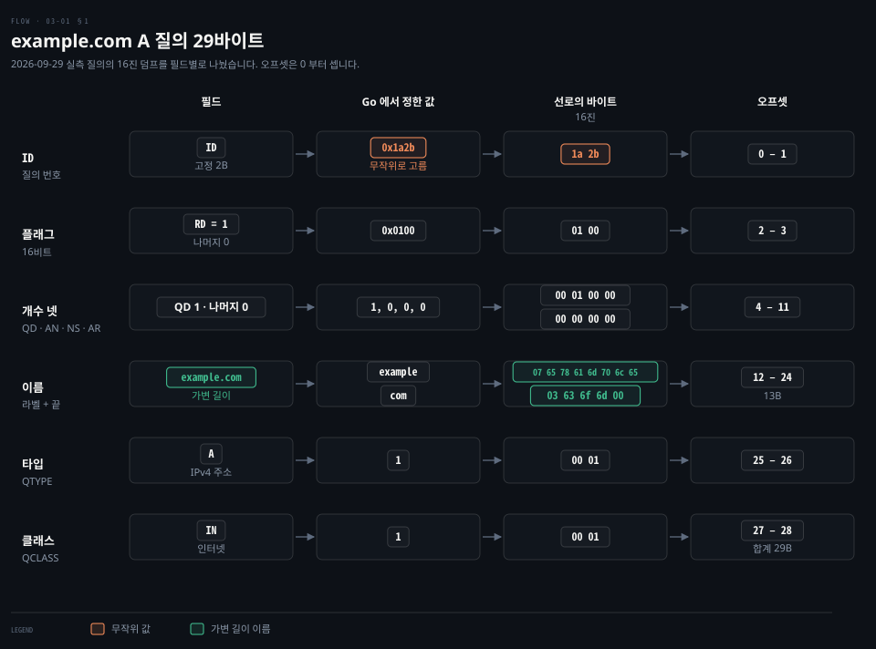
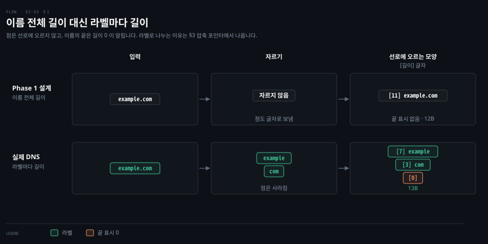
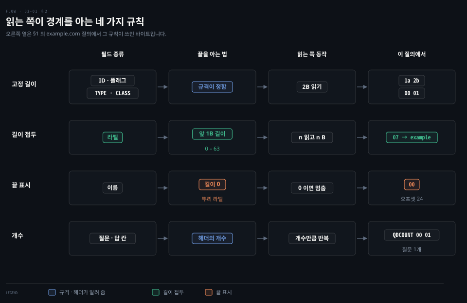
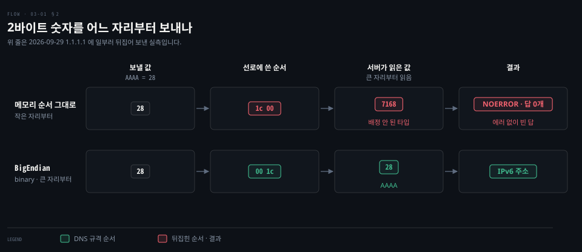
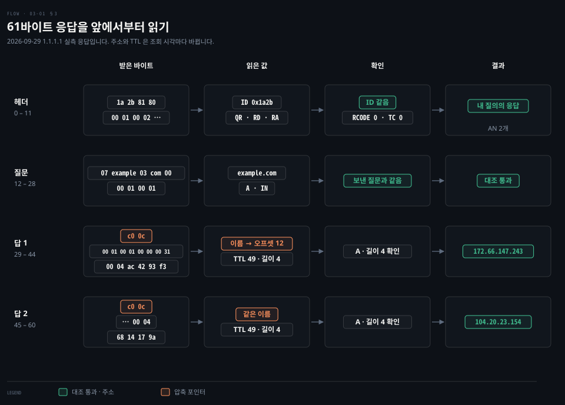
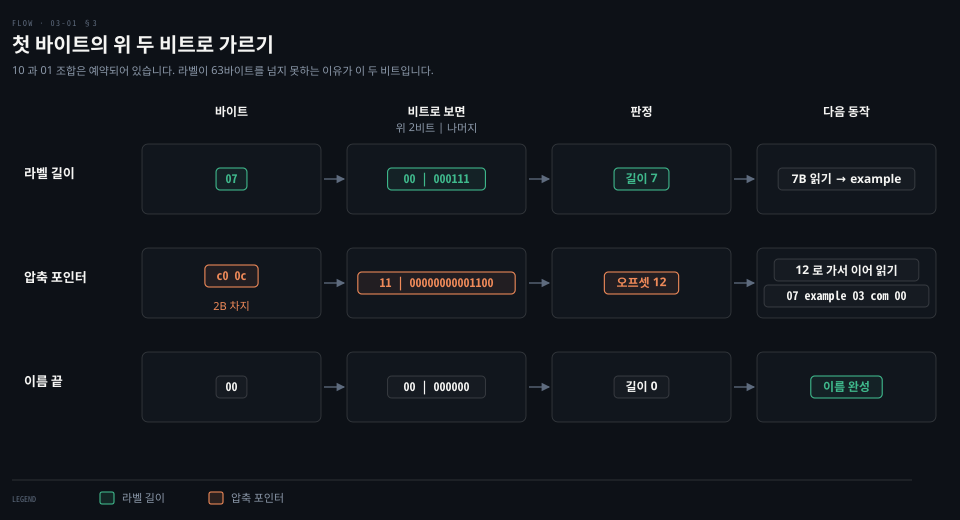
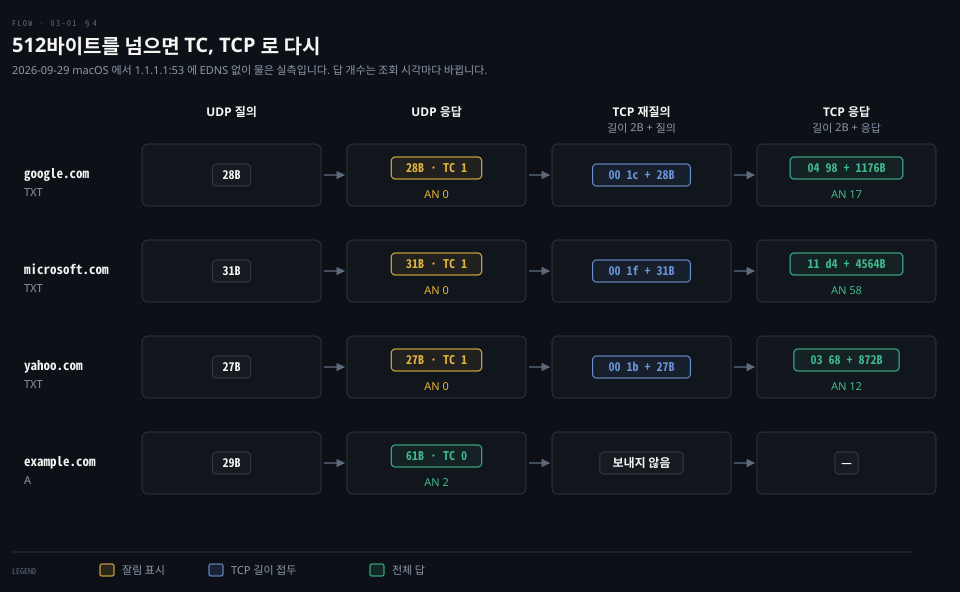
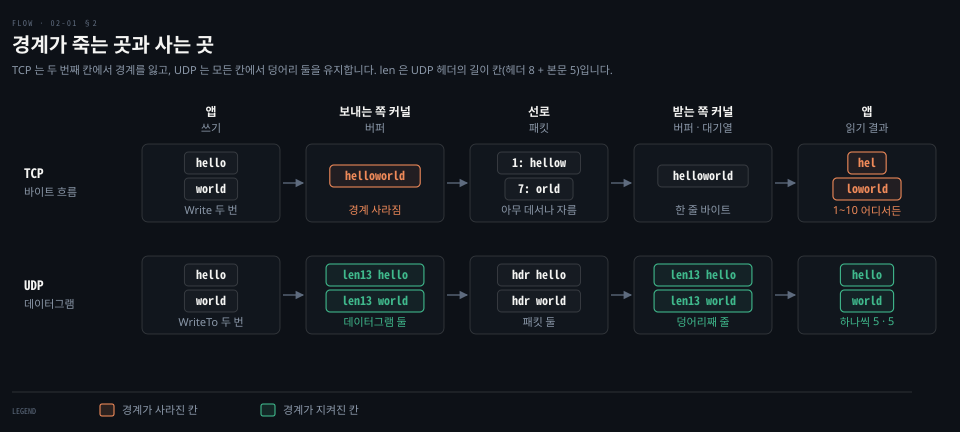
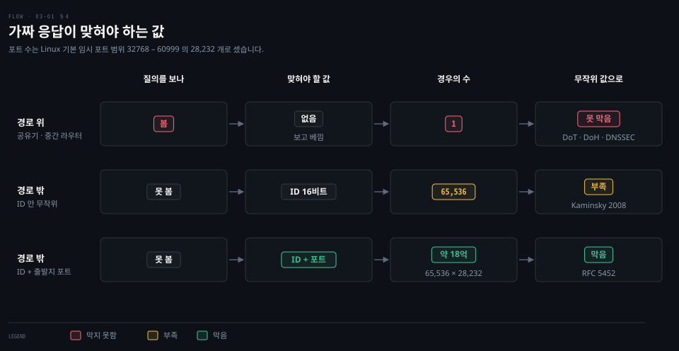

# DNS 질의 한 장을 바이트로

---

> `example.com` 의 IPv4 주소를 묻는 질의는 UDP 데이터그램 한 장, 29바이트입니다. 이 문서는 그 29바이트가 어떤 칸으로 나뉘는지, 받는 쪽이 구분값 없이 경계를 어떻게 아는지, 61바이트 응답을 어떻게 풀어 읽는지, 응답이 512바이트를 넘으면 무슨 일이 생기는지를 실제로 주고받은 바이트로 따라갑니다.

## 학습 목표와 범위

> 이 문서를 읽고 나면 `net.LookupHost` 없이 질의를 바이트로 짓고, 돌아온 바이트가 내 질의의 답인지 가려 주소를 꺼내는 과정에서 각 칸이 왜 그 모양인지 설명할 수 있어야 합니다.

| 목표 | 어떻게 확인하나 |
|---|---|
| 질의 29바이트를 헤더·이름·타입·클래스로 나누고 각 칸의 크기를 말합니다 | Phase 3 에서 직접 만든 질의를 `tcpdump -X` 로 찍어 대조합니다 |
| 고정 길이·길이 접두·끝 표시·개수, 네 규칙으로 경계를 아는 이유를 설명합니다 | Phase 4 에서 도움 없이 답합니다 |
| 여러 바이트 숫자를 큰 자리부터 보내야 하는 이유와 어기면 생기는 일을 말합니다 | Phase 3 에서 바이트 순서를 일부러 뒤집어 보냅니다 |
| 응답에서 ID·질문을 대조하고 압축 포인터를 따라가 주소를 꺼냅니다 | Phase 3 에서 디코더로 실제 응답을 풉니다 |
| TC 비트가 켜진 응답을 알아보고 TCP 로 다시 물을 때 길이 2바이트를 붙입니다 | Phase 3 에서 TXT 질의로 재현합니다 |

다루지 않는 것은 DNS 서버 계층, 재귀와 반복 질의, 캐시와 TTL 의 운용, 자원 레코드 종류의 뜻입니다. 이 개념들은 [cntd 02-03](../../book/cntd_computer-networking-top-down/02-03.%EB%A9%94%EC%9D%BC%EA%B3%BC%20%EC%9D%B4%EB%A6%84%EC%9D%80%20%EC%96%B4%EB%96%BB%EA%B2%8C%20%EC%B0%BE%EC%95%84%EA%B0%80%EB%8A%94%EA%B0%80.md) §4~§8 이 정본입니다. 메시지가 헤더와 네 절로 이루어진다는 큰 구조도 그 노트 §8 에 있으니, 여기서는 그 구조가 선로에서 몇 바이트로 놓이는지만 다룹니다. DNSSEC 과 EDNS 의 내부 형식도 범위 밖입니다.

| 키워드 | 뜻 | 학습 포인트·연결 개념 | 어디서 |
|---|---|---|---|
| 헤더 | 메시지 맨 앞 12바이트 | ID·플래그·개수 넷, 모두 2바이트 고정 | §1 |
| ID | 질의마다 고르는 16비트 번호 | 응답에 그대로 복사되어 돌아옴 | §1, §3 |
| RD | "모르면 끝까지 알아 와 달라"는 1비트 플래그 | Phase 1 Q9 | §1 |
| 라벨 | 이름을 점에서 자른 조각 하나 | 앞에 길이 1바이트, 0 – 63 | §1 |
| 고정 길이 | 규격이 크기를 정해 둔 칸 | 길이 접두가 필요 없음 | §2 |
| 빅엔디언 | 여러 바이트 숫자를 큰 자리부터 놓는 순서 | 네트워크 바이트 순서, `binary.BigEndian` | §2 |
| 압축 포인터 | 이름 대신 앞선 위치를 가리키는 2바이트 | 위 두 비트 `11`, 나머지 14비트가 오프셋 | §3 |
| TC 비트 | 응답이 잘렸다는 표시 | 512바이트 한도, TCP 로 다시 묻기 | §4 |


## 1. 질의 한 장은 29바이트입니다

> 서버는 받은 바이트에서 ID·이름·타입이 어디서 끝나는지 알아야 하므로, DNS 는 이것을 헤더 12바이트·이름 13바이트·타입과 클래스 2바이트씩으로 놓습니다. 이름만 길이가 변하고 나머지는 모두 크기가 정해진 칸입니다.



Phase 1 의 결론은 `[ID][길이]이름[타입]` 이었습니다. 이 모양 그대로는 서버가 읽을 수 없습니다. 플래그를 어디에 둘지, 질문이 몇 개인지, 이름이 어디서 끝나는지가 정해지지 않았기 때문입니다. RFC 1035 는 이 빈칸을 모두 채워 두었습니다. 아래는 2026-09-29 에 손으로 만들어 `1.1.1.1:53` 에 보낸 질의가 선로, 곧 네트워크로 실제 나가는 바이트에 오른 모양 전체입니다.

```pseudocode
1a 2b 01 00 00 01 00 00 00 00 00 00   ← 헤더 12바이트
07 65 78 61 6d 70 6c 65 03 63 6f 6d 00 ← 이름 13바이트 (7 example 3 com 0)
00 01                                  ← 타입 A
00 01                                  ← 클래스 IN
```

이 문서는 바이트 위치를 **오프셋**(offset)으로 가리킵니다. 오프셋은 메시지 맨 앞 바이트를 0 으로 놓고 센 자리 번호입니다. 위 도식 왼쪽의 "자리"가 그것이고, 헤더가 0 – 11 번을 차지하니 이름은 12 번 자리에서 시작합니다. §3 에서 이 12 라는 번호를 다시 만납니다.

### 헤더 12바이트는 모두 2바이트 칸입니다

헤더는 2바이트 칸 여섯 개입니다.[^rfc1035-411] 첫 칸이 ID 이고 둘째 칸이 플래그, 나머지 넷이 개수입니다.

- ID `1a 2b`: 이 질의에 붙인 번호입니다. 서버는 응답에 이 두 바이트를 그대로 복사합니다. 실제 클라이언트는 매번 무작위로 고르고, 이 문서에서는 읽기 쉽게 고정값을 썼습니다. 왜 무작위여야 하는지는 §4 에서, `1a` 를 `2b` 보다 먼저 놓는 이유는 §2 에서 봅니다.
- 플래그 `01 00`: 켜고 끄는 스위치 여러 개를 2바이트에 모은 칸입니다. 질의는 RD("모르면 끝까지 알아 와 달라") 하나만 켜고, 그 값이 `01 00` 입니다. 응답에서 켜지는 스위치는 §3 에서 봅니다.
- 개수 넷: 질문 절, 답 절, 권한 절, 추가 절에 레코드가 몇 개 있는지를 차례로 적습니다. 이름은 QDCOUNT, ANCOUNT, NSCOUNT, ARCOUNT 입니다. 질의는 질문 하나만 담으니 `00 01 00 00 00 00 00 00` 입니다.

네 절의 뜻은 [cntd 02-03](../../book/cntd_computer-networking-top-down/02-03.%EB%A9%94%EC%9D%BC%EA%B3%BC%20%EC%9D%B4%EB%A6%84%EC%9D%80%20%EC%96%B4%EB%96%BB%EA%B2%8C%20%EC%B0%BE%EC%95%84%EA%B0%80%EB%8A%94%EA%B0%80.md) §8 "메시지는 두 종류뿐입니다"에 있습니다. 여기서 볼 것은 개수가 헤더에 먼저 온다는 점입니다. 받는 쪽은 개수를 먼저 읽어야 뒤에 레코드가 몇 개 이어지는지 압니다. 이 순서가 §2 의 네 번째 규칙이 됩니다.

### 이름은 점에서 잘라 라벨마다 길이를 붙입니다

Phase 1 에서는 `example.com` 전체 앞에 길이 11 을 붙였습니다. 실제 DNS 는 이름을 점에서 잘라 조각마다 길이를 붙입니다. 이 조각을 **라벨**(label)이라 부릅니다.[^rfc1035-412]



두 설계를 나란히 놓으면 차이가 셋 보입니다.

1. 점은 선로에 오르지 않습니다. 라벨 경계를 길이가 알려 주므로 점을 따로 적을 이유가 없습니다.
2. 이름은 길이 0 인 빈 라벨로 끝납니다. 이것을 뿌리(root) 라벨이라 부르고, 읽는 쪽은 `00` 을 만나면 이름이 끝났다고 판단합니다.
3. 그 결과 같은 `example.com` 이 12바이트가 아니라 13바이트가 됩니다. 길이 바이트가 하나 늘고 점 하나가 빠지고 끝 표시 하나가 붙습니다.

라벨로 나누는 이유는 §3 에서 드러납니다. 이름이 라벨 단위로 끊겨 있어야 `www.example.com` 의 뒷부분 `example.com` 만 따로 가리킬 수 있습니다. 라벨 길이가 0 – 63 으로 제한되는 이유도 §3 의 압축 포인터와 이어집니다. 이름 전체는 255바이트를 넘을 수 없습니다.[^rfc1035-234]

### 타입과 클래스는 코드입니다

Phase 1 Q4 에서 정리한 대로 타입은 정해진 목록의 번호입니다. `A` 는 1 이고 `MX` 는 15 이며 `AAAA` 는 28 입니다.[^rfc1035-322][^rfc3596]

타입 뒤에는 클래스가 2바이트 더 붙습니다. 클래스는 어떤 네트워크 체계의 이름인지를 가리키는 코드입니다. 오늘날에는 거의 언제나 인터넷을 뜻하는 `IN`(1)입니다. 1980년대에는 CSNET·CHAOS·Hesiod 같은 다른 체계에서도 같은 형식을 쓰려 했고, 그 흔적이 칸으로 남았습니다.[^rfc1035-324]


## 2. 받는 쪽은 구분값 없이 경계를 압니다

> DNS 메시지에는 구분값이 없고, 칸마다 고정 길이·길이 접두·끝 표시·개수 가운데 하나로 끝을 알립니다. 여러 바이트 숫자는 큰 자리부터 놓습니다.



[02-01](./02-01.%EA%B2%BD%EA%B3%84%EB%A5%BC%20%EC%A7%80%ED%82%A4%EB%8A%94%20UDP%2C%20%EB%8C%80%EC%8B%A0%20%EB%96%A0%EC%95%88%EB%8A%94%20%EA%B2%83%20-%20%EB%8D%B0%EC%9D%B4%ED%84%B0%EA%B7%B8%EB%9E%A8%C2%B7%EC%86%90%EC%8B%A4%C2%B7%EC%88%9C%EC%84%9C.md) §1 에서 TCP 바이트 흐름에 경계를 그리는 약속으로 구분값과 길이 접두를 비교했습니다. UDP 는 데이터그램 경계를 지켜 주므로 메시지 하나의 시작과 끝은 이미 정해져 있습니다. 문제는 그 안의 칸과 칸 사이입니다. Phase 1 Q2 에서 확인했듯 구분값은 본문에 섞이면 경계가 깨집니다. DNS 이름에는 어떤 바이트든 들어갈 수 있으니 구분값을 쓸 수 없습니다.[^rfc2181]

### 네 규칙이 모든 칸을 덮습니다

도식의 네 줄은 서로 다른 칸을 맡습니다.

- 고정 길이는 ID·플래그·개수·타입·클래스를 맡습니다. 규격이 모두 2바이트로 정했으므로 읽는 쪽은 2바이트만 읽으면 됩니다. Phase 1 Q5 에서 "일정 길이가 정해져 있어서"라고 답한 그 규칙입니다.
- 길이 접두는 라벨을 맡습니다. 길이가 제각각이라 앞 1바이트에 길이를 적습니다.
- 끝 표시는 이름 전체를 맡습니다. 라벨이 몇 개인지 미리 적지 않는 대신 길이 0 으로 끝을 알립니다.
- 개수는 질문 절과 답 절을 맡습니다. 헤더의 QDCOUNT·ANCOUNT 가 레코드 수를 알려 주므로 읽는 쪽은 그만큼 반복합니다.

이 넷이 맞물리면 읽는 쪽은 처음부터 끝까지 한 번 훑는 것으로 메시지를 다 풉니다. 되돌아가서 다시 읽을 일은 §3 의 압축 포인터 하나뿐입니다.

### 여러 바이트 숫자는 큰 자리부터 놓습니다

보내는 쪽과 받는 쪽 컴퓨터는 CPU 가 다를 수 있습니다. 그래서 선로에서는 숫자를 놓는 순서를 하나로 정해 둬야 합니다. 2바이트 칸에 숫자 6699(`0x1a2b`)를 넣는다고 해 봅시다. 큰 자리 바이트 `1a` 를 먼저 놓을 수도 있고 작은 자리 `2b` 를 먼저 놓을 수도 있습니다. 앞의 방식을 **빅엔디언**(big-endian), 뒤의 방식을 리틀엔디언이라 부릅니다. RFC 1035 는 가장 큰 자리 바이트를 먼저 보낸다고 적었습니다.[^rfc1035-232] 인터넷 프로토콜 대부분이 같은 약속을 따르므로 빅엔디언을 네트워크 바이트 순서라고도 부릅니다. 개념 자체는 [lgo 16-03](../../../01_language/book/lgo_learning-go/16-03.unsafe%20%EB%8A%94%20%EB%A9%94%EB%AA%A8%EB%A6%AC%20%EB%B0%B0%EC%B9%98%EB%A5%BC%20%EB%93%9C%EB%9F%AC%EB%82%B4%20%EB%B0%94%EC%9D%B4%ED%8A%B8%EC%99%80%20%EA%B5%AC%EC%A1%B0%EC%B2%B4%EB%A5%BC%20%EA%B3%A7%EB%B0%94%EB%A1%9C%20%EB%B0%94%EA%BE%B8%EA%B3%A0%20checkptr%20%EC%9D%B4%20%EC%98%A4%EC%9A%A9%EC%9D%84%20%EC%9E%A1%EC%8A%B5%EB%8B%88%EB%8B%A4.md) §2 가 정본입니다.

날짜 `03/04` 를 떠올리면 쉽습니다. 한국식으로 읽으면 3월 4일이고 유럽식으로 읽으면 4월 3일입니다. 숫자는 같은데 어느 칸이 큰 단위인지 약속이 다르면 다른 날짜가 됩니다. 바이트 하나는 0 – 255 만 담으므로 더 큰 숫자는 두 칸에 나눠 담고, 이때 같은 문제가 생깁니다.

x86 과 ARM 은 보통 메모리에 리틀엔디언으로 숫자를 둡니다. 숫자를 메모리 순서 그대로 선로에 올리면 받는 쪽은 뒤집힌 숫자를 읽습니다.



위 줄은 2026-09-29 에 1.1.1.1 로 실제로 보내 본 결과입니다. AAAA(28)를 뒤집어 보내자 서버는 배정되지 않은 타입 7168 을 물은 것으로 읽었습니다. 그리고 결과 코드 0, 곧 "에러 없음"을 뜻하는 NOERROR 에 답 0개로 돌려줬습니다. 클라이언트는 "IPv6 주소가 없다"고 오해하게 됩니다.

바이트 순서 실수는 컴파일러가 잡아 주지 않습니다. 서버도 에러로 알려 주지 않습니다. 질문 개수 칸을 뒤집어 보낸 질의에는 오히려 정상 응답이 와서 실수가 아예 드러나지 않았습니다. 서버가 봐준 덕분일 뿐이라 다른 서버에서는 같은 코드가 실패할 수 있습니다. 그래서 Phase 3 에서는 직접 만든 질의를 `dig` 가 만든 질의와 바이트 단위로 대조합니다.

### Go 에서는 binary.BigEndian 이 순서를 맡습니다

Go 의 `encoding/binary` 패키지는 두 순서를 값으로 제공합니다. `binary.BigEndian.AppendUint16(b, v)` 는 `v` 를 큰 자리부터 두 바이트로 `b` 뒤에 붙이고, `binary.BigEndian.Uint16(b)` 는 반대로 읽습니다.[^go-binary] 헤더와 질문 칸만 짓는 코드는 이 정도입니다.

```go
// 헤더 12바이트: ID, 플래그(RD), QDCOUNT=1, 나머지 개수 0
b := binary.BigEndian.AppendUint16(nil, id)
b = binary.BigEndian.AppendUint16(b, 0x0100)
b = binary.BigEndian.AppendUint16(b, 1)
b = append(b, 0, 0, 0, 0, 0, 0)

// 이름: 라벨마다 길이 1바이트 + 라벨, 끝은 0
for _, label := range strings.Split(name, ".") {
	b = append(b, byte(len(label)))
	b = append(b, label...)
}
b = append(b, 0)
// 타입과 클래스
b = binary.BigEndian.AppendUint16(b, qtype)
b = binary.BigEndian.AppendUint16(b, 1) // IN
```

라벨 길이 검사(1 – 63)와 이름 전체 길이 검사(255 이하)는 빠져 있습니다. Phase 3 에서 이 검사를 넣는 것까지 실습합니다. Go 에는 이 일을 다 해 주는 `golang.org/x/net/dns/dnsmessage` 패키지도 있습니다.[^dnsmessage] 랩에서는 직접 짠 뒤 결과를 이 패키지와 비교하는 데 씁니다.


## 3. 응답은 질의를 복사하고 답을 덧붙입니다

> 돌아온 바이트가 내 질문의 답인지 가리려고, 응답은 질의 29바이트를 거의 그대로 복사한 뒤에 답 레코드를 붙입니다. 1.1.1.1 의 61바이트 응답에는 답 둘이 16바이트씩 붙었고, 답의 이름 자리에는 이름 대신 오프셋 12 를 가리키는 2바이트 포인터가 들어 있었습니다.



응답에서 주소를 꺼내려면 먼저 이 바이트가 내 질의의 답인지, 어디까지가 복사본이고 어디부터가 답인지 가려야 합니다. 응답 전체는 다음과 같고, 주소와 TTL 은 조회할 때마다 바뀔 수 있습니다.

```pseudocode
1a 2b 81 80 00 01 00 02 00 00 00 00                 ← 헤더: ID 같음, 플래그 0x8180, AN 2
07 65 78 61 6d 70 6c 65 03 63 6f 6d 00 00 01 00 01  ← 질문: 보낸 것과 같음
c0 0c 00 01 00 01 00 00 00 31 00 04 ac 42 93 f3     ← 답 1: 172.66.147.243
c0 0c 00 01 00 01 00 00 00 31 00 04 68 14 17 9a     ← 답 2: 104.20.23.154
```

### 짝이 맞는지부터 확인합니다

Phase 1 Q6~Q8 에서 클라이언트가 ID 와 질문을 대조해야 한다고 정리했습니다. RFC 5452 는 리졸버, 곧 이름을 대신 물어 주는 DNS 클라이언트가 대조해야 할 항목을 여섯으로 적었습니다.[^rfc5452-91]

1. 응답의 출발지 주소가 질의의 목적지 주소와 같은가
2. 응답의 목적지 주소가 질의의 출발지 주소와 같은가
3. 응답의 목적지 포트가 질의의 출발지 포트와 같은가
4. ID 가 같은가
5. 질문의 이름이 같은가
6. 질문의 클래스와 타입이 같은가

1~3 은 UDP 소켓이 대부분 해 줍니다. [02-01](./02-01.%EA%B2%BD%EA%B3%84%EB%A5%BC%20%EC%A7%80%ED%82%A4%EB%8A%94%20UDP%2C%20%EB%8C%80%EC%8B%A0%20%EB%96%A0%EC%95%88%EB%8A%94%20%EA%B2%83%20-%20%EB%8D%B0%EC%9D%B4%ED%84%B0%EA%B7%B8%EB%9E%A8%C2%B7%EC%86%90%EC%8B%A4%C2%B7%EC%88%9C%EC%84%9C.md) §3 에서 본 대로 `connect()` 한 UDP 소켓은 상대 주소·포트가 다른 데이터그램을 받지 않습니다. 4~6 은 앱 코드가 헤더와 질문 칸을 읽어 직접 비교해야 합니다.

짝이 맞으면 플래그를 봅니다. 응답의 플래그 `81 80` 은 스위치 셋이 켜진 값입니다.

- QR: 이 메시지가 응답이라는 표시입니다.
- RD: 질의의 RD 를 그대로 복사한 것입니다.
- RA: 서버가 재귀를 해 줄 수 있다는 표시입니다.

TC 가 꺼져 있고 RCODE 가 0 이니 잘리지 않은 정상 응답입니다. 물은 이름이 없으면 RCODE 가 3 으로 옵니다. RFC 1035 는 이 값을 Name Error 라 부르고, 흔히 NXDOMAIN 이라고 합니다.

### 답 레코드는 여섯 칸입니다

답 절의 레코드는 이름, 타입, 클래스, TTL, 데이터 길이, 데이터(RDATA)의 여섯 칸으로 되어 있습니다.[^rfc1035-413] 이름을 빼면 모두 크기가 정해져 있습니다. 타입과 클래스는 2바이트, TTL 은 4바이트, 데이터 길이는 2바이트입니다. 데이터 칸만 앞의 데이터 길이만큼 읽습니다. 여기서도 §2 의 길이 접두 규칙이 쓰입니다. 데이터 길이 `00 04` 를 작은 자리부터로 잘못 읽으면 1024 가 되어 61바이트 메시지 밖을 읽으려 하니, §2 의 바이트 순서는 읽는 쪽에서도 지켜야 합니다.

답 1 을 칸마다 끊으면 이렇습니다.

| 칸 | 바이트 | 값 |
|---|---|---|
| 이름 | `c0 0c` | 오프셋 12 의 이름, 곧 `example.com` |
| 타입 | `00 01` | A |
| 클래스 | `00 01` | IN |
| TTL | `00 00 00 31` | 49초 |
| 데이터 길이 | `00 04` | 4바이트 |
| 데이터 | `ac 42 93 f3` | 172.66.147.243 |

TTL 이 캐시에서 어떤 의미인지는 [cntd 02-03](../../book/cntd_computer-networking-top-down/02-03.%EB%A9%94%EC%9D%BC%EA%B3%BC%20%EC%9D%B4%EB%A6%84%EC%9D%80%20%EC%96%B4%EB%96%BB%EA%B2%8C%20%EC%B0%BE%EC%95%84%EA%B0%80%EB%8A%94%EA%B0%80.md) §7 에 있습니다. 한 이름에 A 레코드가 둘이라 ANCOUNT 가 2 였고, 읽는 쪽은 같은 여섯 칸을 두 번 읽습니다.

### c0 0c 는 이름이 아니라 위치입니다

답의 이름 자리에 `07 example 03 com 00` 13바이트가 다시 올 것 같지만 실제로는 `c0 0c` 두 바이트뿐입니다. 같은 이름이 질문 칸 오프셋 12 에 이미 있으니 "거기를 보라"고 가리킨 것입니다. 이것을 **압축 포인터**(compression pointer)라 부릅니다.[^rfc1035-414]

§1 에서 본 대로 오프셋은 맨 앞을 0 으로 센 자리 번호이고, 12 번 자리는 질문 칸 이름의 첫 바이트 `07` 입니다.

```pseudocode
자리:   0  1  2  3  4  5  6  7  8  9 10 11 | 12 13 ... 23 24
바이트: 1a 2b 81 80 00 01 00 02 00 00 00 00 | 07  e ...  m 00
        └─────────── 헤더 12B ───────────┘ └─ 질문 칸 이름 ─┘
```

`c0 0c` 를 만난 디코더는 12 번 자리로 건너가 `07 example 03 com 00` 을 읽고, 원래 자리로 돌아와 답의 타입·TTL·주소를 이어 읽습니다. 책에서 같은 표를 다시 그리지 않고 "앞의 표 3 을 보라"고 적는 것과 같습니다.



읽는 쪽은 이름 자리에서 바이트 하나를 읽고 위 두 비트를 봅니다.

- `00` 이면 라벨 길이입니다. 라벨이 63바이트를 넘지 못하므로 길이 바이트의 위 두 비트는 언제나 0 입니다.
- `11` 이면 포인터입니다. 다음 바이트까지 두 바이트를 읽고, 위 두 비트를 뺀 14비트를 메시지 첫 바이트부터 센 오프셋으로 씁니다. `c0 0c` 에서 `0x0c` 는 12 입니다.

§1 에서 라벨이 63바이트까지인 이유를 미뤄 두었는데, 바로 이 두 비트 때문입니다. 길이 바이트 8비트 가운데 두 비트를 포인터 표시로 비워 두어 길이에는 6비트, 곧 0 – 63 만 남았습니다. 첫 바이트 값으로 나누면 이렇습니다.

| 첫 바이트 값 | 뜻 |
|---|---|
| 0 – 63 | 라벨 길이 |
| 64 – 191 | RFC 1035 에서 예약, 지금도 쓰지 않음 |
| 192 – 255 | 압축 포인터의 첫 바이트 |

길이로 192 이상이 나와도 된다면 디코더는 그 바이트가 길이인지 포인터인지 가를 수 없습니다. 이름 조각 하나가 63바이트로 짧게 묶인 것은 이 구분의 대가입니다.

포인터는 이름 전체만 가리키지 않습니다. `www.example.com` 이면 `03 77 77 77 c0 0c` 처럼 앞 라벨을 적고 뒷부분만 포인터로 넘길 수 있습니다. 이름을 라벨 단위로 끊은 덕분입니다. `example.com` 이면 포인터 하나가 11바이트를 아끼므로, 답이 수십 개인 응답에서는 수백 바이트가 됩니다. 512바이트 한도(§4) 안에 답을 더 많이 담으려는 장치이기도 합니다.

포인터를 따라가는 디코더는 한 가지를 꼭 막아야 합니다. 포인터가 자기 자신을 가리키거나 두 포인터가 서로를 가리키는 순환이 생기면 디코더는 끝없이 돕니다. 정상 메시지의 포인터는 늘 앞쪽에 이미 나온 이름을 가리키므로, 지금 위치보다 앞을 가리키는지 검사하거나 따라간 횟수에 상한을 둡니다. 받은 바이트는 누가 만들었는지 모르니 이런 입력에도 끝없이 돌지 않는 디코더를 만들어야 합니다.


## 4. UDP 위의 DNS 가 떠안는 것

> UDP 응답이 512바이트를 넘으면 서버는 TC 를 켜서 잘라 보내고, 클라이언트는 길이 2바이트를 앞에 붙여 TCP 로 다시 묻습니다. 연결이 없어 가짜 응답도 받게 되므로 ID 와 출발지 포트를 무작위로 골라 막습니다.



### 512바이트를 넘으면 TC 를 켜고 자릅니다

RFC 1035 는 UDP 로 나르는 메시지를 IP·UDP 헤더를 빼고 512바이트로 제한했습니다. 더 긴 메시지는 잘리고 헤더에 TC 비트가 켜집니다.[^rfc1035-421] 도식의 TXT 질의 셋이 그 경우입니다. `google.com` TXT 는 UDP 로 물었을 때 28바이트가 돌아왔습니다. 헤더와 질문만 있고 답 개수가 0 이었습니다. 플래그를 정상 응답과 비교하면 TC 스위치 하나만 더 켜져 있습니다. 1.1.1.1 은 답을 일부만 넣는 대신 전부 비웠습니다.

TC 를 보지 않는 클라이언트는 이 응답을 "답이 없다"로 읽습니다. 에러도 아니고 RCODE 도 0 입니다. [02-01](./02-01.%EA%B2%BD%EA%B3%84%EB%A5%BC%20%EC%A7%80%ED%82%A4%EB%8A%94%20UDP%2C%20%EB%8C%80%EC%8B%A0%20%EB%96%A0%EC%95%88%EB%8A%94%20%EA%B2%83%20-%20%EB%8D%B0%EC%9D%B4%ED%84%B0%EA%B7%B8%EB%9E%A8%C2%B7%EC%86%90%EC%8B%A4%C2%B7%EC%88%9C%EC%84%9C.md) §2 에서 버퍼가 작으면 `ReadFrom` 이 에러 없이 잘린다고 봤는데, 여기서는 서버가 규격에 따라 스스로 잘라 보내고 헤더 비트 하나로만 알립니다.

512 라는 숫자의 이유를 RFC 1035 는 적지 않았습니다. 흔히 IP 규격이 모든 호스트에 받을 준비를 요구한 576바이트 데이터그램 안에 IP·UDP 헤더와 함께 들어가는 크기로 설명합니다.[^rfc791] 이 한도는 1987년의 것이고, 지금은 EDNS(0) 라는 확장으로 질의에 "나는 더 큰 UDP 응답도 받을 수 있다"고 적어 한도를 올립니다.[^rfc6891] 이 문서의 질의는 EDNS 를 넣지 않았으므로 512바이트가 그대로 적용되었습니다.

### TCP 로 다시 물을 때는 길이 2바이트를 붙입니다

TC 를 받은 클라이언트는 같은 질의를 TCP 53번 포트로 다시 보냅니다. 요즘 DNS 구현은 UDP 와 TCP 를 모두 지원해야 합니다.[^rfc7766] UDP 로 보낼 때 붙이지 않던 길이를 TCP 에서만 붙이는 이유는 이렇습니다. UDP 는 한 번 보낸 것이 한 장으로 도착해 끝을 커널이 알려 주지만, TCP 는 메시지 둘이 한 줄로 붙어 올 수 있어 어디서 끊을지 받는 쪽이 모릅니다.



TCP 는 순서 번호를 바이트에 매깁니다. `Write` 두 번의 바이트는 송신 버퍼에서 이어 붙습니다. 커널은 이것을 상대의 수신 여유와 세그먼트 크기에 맞춰 다시 잘라 보냅니다. 받는 쪽 `Read` 는 그 순간 도착한 연속 바이트를 돌려줄 뿐 쓰기 경계를 모릅니다.

UDP 는 `Write` 한 번이 데이터그램 하나입니다. 받는 쪽 커널도 데이터그램을 한 개씩 따로 줄 세워 `ReadFrom` 한 번에 하나를 돌려줍니다. 수도관에 두 번 부은 물은 섞이지만 두 번 보낸 택배 상자는 두 개로 도착합니다.

| | TCP | UDP |
|---|---|---|
| 번호를 매기는 단위 | 바이트 | 없음 |
| 보내는 쪽 커널 | 쓰기들을 이어 붙이고 다시 자름 | 쓰기 하나 = 데이터그램 하나 |
| 받는 쪽 한 번 읽기 | 도착한 연속 바이트만큼 | 데이터그램 정확히 하나 |
| 메시지 경계 | 앱이 프레이밍 | 이미 있음 |

TCP 가 경계를 버리는 것은 재전송과 흐름 제어를 바이트 단위로 하고 작은 쓰기를 합쳐 보내려는 설계의 대가입니다. 원리와 실측은 [02-01](./02-01.%EA%B2%BD%EA%B3%84%EB%A5%BC%20%EC%A7%80%ED%82%A4%EB%8A%94%20UDP%2C%20%EB%8C%80%EC%8B%A0%20%EB%96%A0%EC%95%88%EB%8A%94%20%EA%B2%83%20-%20%EB%8D%B0%EC%9D%B4%ED%84%B0%EA%B7%B8%EB%9E%A8%C2%B7%EC%86%90%EC%8B%A4%C2%B7%EC%88%9C%EC%84%9C.md) §1·§2 가 정본입니다. DNS 는 02-01 §1 에서 비교한 두 프레이밍 가운데 길이 접두를 골랐습니다. 메시지 앞에 길이 2바이트를 붙이고, 이 길이에는 자기 자신 2바이트를 넣지 않습니다.[^rfc1035-422]

`google.com` TXT 질의는 28바이트이므로 TCP 로는 `00 1c` 를 앞에 붙여 30바이트를 씁니다. 응답은 `04 98`, 곧 1176바이트라는 길이가 먼저 오고 그 뒤로 답 17개가 담긴 메시지가 옵니다. 읽는 쪽은 먼저 2바이트를 읽고, 그 길이만큼 `io.ReadFull` 로 채운 다음 파싱합니다. `Read` 한 번이 메시지 하나라고 믿으면 02-01 §1 의 경계 문제를 그대로 겪습니다.

### 연결이 없으니 가짜 응답도 받습니다

UDP 소켓은 자기 포트로 온 데이터그램이면 누가 보냈든 받습니다. Phase 1 Q8 에서 본 대로, 누군가 내가 `example.com` 을 물을 것을 알고 가짜 주소를 담은 응답을 먼저 보낼 수 있습니다. 질문은 추측하기 쉬우니 질문 대조만으로는 막지 못합니다.



공격자는 두 부류입니다. 경로 위의 공격자는 질의가 자기 장비를 지나가므로 ID 와 포트를 보고 베낍니다. 무작위 값으로는 이 경우를 막을 수 없고, 응답에 서명하는 DNSSEC 이나 통로를 암호화하는 DoT·DoH 가 필요합니다. 경로 밖의 공격자는 질의를 볼 수 없어서 값을 찍어야 합니다. 이 경우를 막는 것이 무작위 값입니다.

ID 16비트, 곧 65,536 가지가 짧은 시간에 다 찍어 볼 수 있는 수라는 약점은 전부터 알려져 있었습니다. 2008년 Kaminsky 공격이 이 약점을 실제 캐시 오염으로 이어 보이면서 대책이 급해졌습니다.[^kaminsky] 그 뒤 RFC 5452 는 리졸버가 ID 뿐 아니라 출발지 포트도 예측할 수 없게 고르도록 요구했습니다.[^rfc5452-92]

Linux 기본 임시 포트 범위 28,232 개를 곱하면 경우의 수가 약 18억으로 늘어납니다. 완전히 막는 것이 아니라 위조에 드는 시도를 크게 늘리는 대책입니다. 02-01 §3 에서 `udp-send` 를 실행할 때마다 포트가 바뀌던 그 임시 포트가 여기서 방어에 쓰입니다. 랩의 DNS 클라이언트도 ID 를 `crypto/rand` 로 고르고, 포트는 커널에 맡겨 무작위로 받습니다.

### 응답이 오지 않으면 다시 묻습니다

UDP 는 손실을 알려 주지 않으므로, 응답이 사라지면 클라이언트는 무한히 기다립니다. 02-01 §4 에서 손실은 앱의 몫이라고 정리한 그대로입니다. DNS 클라이언트는 읽기에 deadline 을 걸고, 시간이 지나면 같은 질의를 다시 보내거나 다른 서버에 묻습니다. 늦게 도착한 첫 응답과 재전송의 응답이 둘 다 올 수 있으니, 짝이 맞는 첫 응답 하나만 쓰고 나머지는 버립니다. 재시도 간격과 횟수는 Phase 3 에서 정합니다.


## 검증과 복습

> 이 문서의 이해를 어떻게 확인했고, 무엇을 남겼는지 적습니다.

- Phase 1: 2026-09-29 소크라테스 문답 Q1~Q9 로 질의에 담을 조각(이름·타입·ID·RD)과 경계 규칙을 학습자가 세웠습니다. 첫 자답, 힌트 뒤 답, 설명으로 채운 내용의 구분은 [STATE.md](./STATE.md) 에 있습니다.
- Phase 2: 2026-10-02 메타인지 체크 첫 답은 "읽어도 잘 모르겠다"였습니다. 학습자 요청으로 §1 – §4 를 함께 한 단계씩 다시 읽었고, 그 뒤 "전체적으로 이해했다, TCP 와 UDP 의 경계 차이만 한 번 더"로 답했습니다. 다시 읽으며 채운 설명(엔디언 날짜 비유, 오프셋 자리 표, 첫 바이트 값 범위, TCP·UDP 경계 비교)을 본문에 반영했습니다.
- Phase 3: 아직 진행하지 않았습니다. 질의 인코더와 응답 디코더를 짜고 `tcpdump -X`, `dig` 출력과 바이트를 대조할 예정입니다.
- Phase 4: 아직 진행하지 않았습니다.
- 복습 표적
  - §1: 길이 접두 값 세기(Phase 1 에서 9, 10 으로 두 번 틀림), 라벨마다 길이를 붙이는 이유
  - §1: 타입은 코드이고 RD 는 플래그라는 구분
  - §4: 무작위 ID 로 막는 것은 경로 밖 공격자라는 점(Phase 1 Q8 에서 "모르겠음")
  - §2·§3: 빅엔디언(Phase 1 에서 다루지 않아 다시 읽을 때 "모르겠음"), 오프셋은 0 부터 센 자리 번호, 포인터 따라가기
  - §3: 서버는 RD 가 켜지면 직접 끝까지 물어 온다는 점("다른 곳으로 다시 쏴 준다"로 답함)


## 출처와 관련 문서

> 동작 주장에 쓴 1차 자료와, 설명을 넘긴 노트입니다.

- [cntd 02-03 메일과 이름은 어떻게 찾아가는가](../../book/cntd_computer-networking-top-down/02-03.%EB%A9%94%EC%9D%BC%EA%B3%BC%20%EC%9D%B4%EB%A6%84%EC%9D%80%20%EC%96%B4%EB%96%BB%EA%B2%8C%20%EC%B0%BE%EC%95%84%EA%B0%80%EB%8A%94%EA%B0%80.md): DNS 가 하는 일, 서버 계층, 재귀·반복 질의, 캐시와 TTL, 자원 레코드, 메시지 절 구조
- [02-01 경계를 지키는 UDP, 대신 떠안는 것](./02-01.%EA%B2%BD%EA%B3%84%EB%A5%BC%20%EC%A7%80%ED%82%A4%EB%8A%94%20UDP%2C%20%EB%8C%80%EC%8B%A0%20%EB%96%A0%EC%95%88%EB%8A%94%20%EA%B2%83%20-%20%EB%8D%B0%EC%9D%B4%ED%84%B0%EA%B7%B8%EB%9E%A8%C2%B7%EC%86%90%EC%8B%A4%C2%B7%EC%88%9C%EC%84%9C.md): 프레이밍 두 방법, 데이터그램 경계와 잘림, `connect()` 한 UDP 소켓, 임시 포트, 손실은 앱의 몫
- [lgo 16-03 unsafe 와 바이트 순서](../../../01_language/book/lgo_learning-go/16-03.unsafe%20%EB%8A%94%20%EB%A9%94%EB%AA%A8%EB%A6%AC%20%EB%B0%B0%EC%B9%98%EB%A5%BC%20%EB%93%9C%EB%9F%AC%EB%82%B4%20%EB%B0%94%EC%9D%B4%ED%8A%B8%EC%99%80%20%EA%B5%AC%EC%A1%B0%EC%B2%B4%EB%A5%BC%20%EA%B3%A7%EB%B0%94%EB%A1%9C%20%EB%B0%94%EA%BE%B8%EA%B3%A0%20checkptr%20%EC%9D%B4%20%EC%98%A4%EC%9A%A9%EC%9D%84%20%EC%9E%A1%EC%8A%B5%EB%8B%88%EB%8B%A4.md): 빅엔디언·리틀엔디언과 네트워크 바이트 순서
- 실측: 2026-09-29 macOS 에서 Python `socket` 으로 손수 만든 질의를 `1.1.1.1:53` 에 UDP·TCP 로 보내 받은 바이트. 이 문서의 16진 덤프와 도식의 값은 모두 이 출력에서 옮겼습니다.

[^rfc1035-411]: RFC 1035 §4.1.1 Header section format. ID, 플래그(QR·Opcode·AA·TC·RD·RA·Z·RCODE), QDCOUNT, ANCOUNT, NSCOUNT, ARCOUNT 가 각 16비트. <https://www.rfc-editor.org/rfc/rfc1035#section-4.1.1>
[^rfc1035-412]: RFC 1035 §4.1.2, "QNAME a domain name represented as a sequence of labels, where each label consists of a length octet followed by that number of octets. The domain name terminates with the zero length octet for the null label of the root." <https://www.rfc-editor.org/rfc/rfc1035#section-4.1.2>
[^rfc1035-234]: RFC 1035 §2.3.4 Size limits, "labels 63 octets or less", "names 255 octets or less", "UDP messages 512 octets or less". <https://www.rfc-editor.org/rfc/rfc1035#section-2.3.4>
[^rfc1035-322]: RFC 1035 §3.2.2 TYPE values, A 1, MX 15. <https://www.rfc-editor.org/rfc/rfc1035#section-3.2.2>
[^rfc1035-324]: RFC 1035 §3.2.4 CLASS values, IN 1 the Internet, CS 2 the CSNET class, CH 3 the CHAOS class, HS 4 Hesiod. <https://www.rfc-editor.org/rfc/rfc1035#section-3.2.4>
[^rfc2181]: RFC 2181 §11 Name syntax, "Those restrictions aside, any binary string whatever can be used as the label of any resource record." <https://www.rfc-editor.org/rfc/rfc2181#section-11>
[^kaminsky]: CERT/CC VU#800113 "Multiple DNS implementations vulnerable to cache poisoning" (2008). RFC 5452 서론도 이 문제들을 "previously recognized, remain largely unsolved" 라고 적었습니다. <https://www.kb.cert.org/vuls/id/800113>
[^rfc3596]: RFC 3596 §2.1, AAAA 레코드 타입 값 28. <https://www.rfc-editor.org/rfc/rfc3596#section-2.1>
[^rfc1035-232]: RFC 1035 §2.3.2 Data Transmission Order, "When a multi-octet quantity is transmitted the most significant octet is transmitted first." <https://www.rfc-editor.org/rfc/rfc1035#section-2.3.2>
[^go-binary]: Go 표준 라이브러리 `encoding/binary`, `ByteOrder` 의 `Uint16` 과 `AppendByteOrder` 의 `AppendUint16`(Go 1.19 추가). <https://pkg.go.dev/encoding/binary>
[^dnsmessage]: `golang.org/x/net/dns/dnsmessage`, DNS 메시지 파싱·빌드 패키지. <https://pkg.go.dev/golang.org/x/net/dns/dnsmessage>
[^rfc5452-91]: RFC 5452 §9.1 Query Matching Rules, "A resolver implementation MUST match responses to all of the following attributes of the query". <https://www.rfc-editor.org/rfc/rfc5452#section-9.1>
[^rfc1035-413]: RFC 1035 §4.1.3 Resource record format. NAME, TYPE, CLASS, TTL(32비트), RDLENGTH, RDATA. <https://www.rfc-editor.org/rfc/rfc1035#section-4.1.3>
[^rfc1035-414]: RFC 1035 §4.1.4 Message compression, "The first two bits are ones. This allows a pointer to be distinguished from a label, since the label must begin with two zero bits because labels are restricted to 63 octets or less. (The 10 and 01 combinations are reserved for future use.) The OFFSET field specifies an offset from the start of the message". <https://www.rfc-editor.org/rfc/rfc1035#section-4.1.4>
[^rfc1035-421]: RFC 1035 §4.2.1 UDP usage, "Messages carried by UDP are restricted to 512 bytes (not counting the IP or UDP headers). Longer messages are truncated and the TC bit is set in the header." <https://www.rfc-editor.org/rfc/rfc1035#section-4.2.1>
[^rfc791]: RFC 791 §3.1 Internet Header Format 의 Total Length 설명, "All hosts must be prepared to accept datagrams of up to 576 octets (whether they arrive whole or in fragments)." 512 와의 연결은 RFC 1035 에 없는 통설입니다. <https://www.rfc-editor.org/rfc/rfc791>
[^rfc6891]: RFC 6891 Extension Mechanisms for DNS (EDNS(0)). <https://www.rfc-editor.org/rfc/rfc6891>
[^rfc7766]: RFC 7766 §5, "All general-purpose DNS implementations MUST support both UDP and TCP transport." <https://www.rfc-editor.org/rfc/rfc7766#section-5>
[^rfc1035-422]: RFC 1035 §4.2.2 TCP usage, "The message is prefixed with a two byte length field which gives the message length, excluding the two byte length field." <https://www.rfc-editor.org/rfc/rfc1035#section-4.2.2>
[^rfc5452-92]: RFC 5452 §9.2, "Use an unpredictable source port for outgoing queries from the range of available ports", "Use an unpredictable query ID for outgoing queries, utilizing the full range available (0-65535)." <https://www.rfc-editor.org/rfc/rfc5452#section-9.2>
