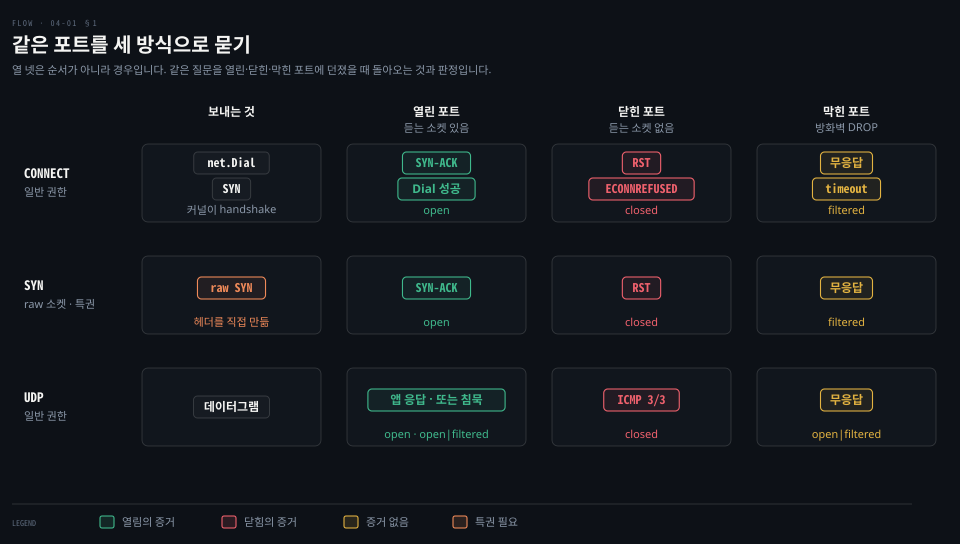
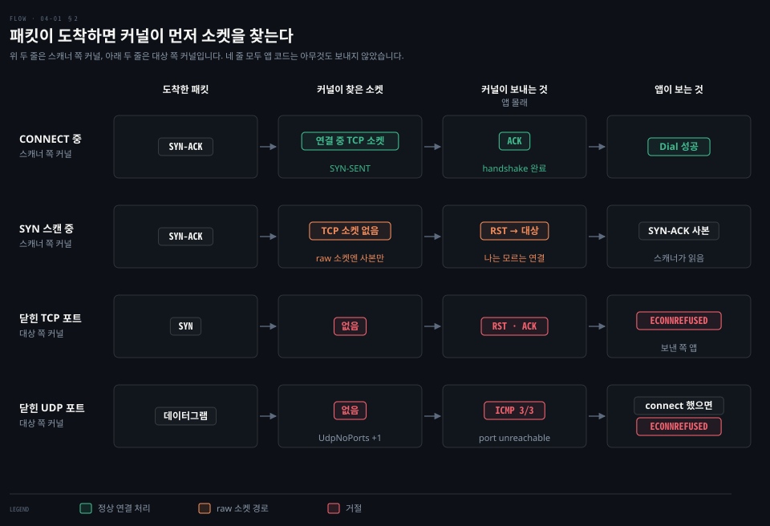
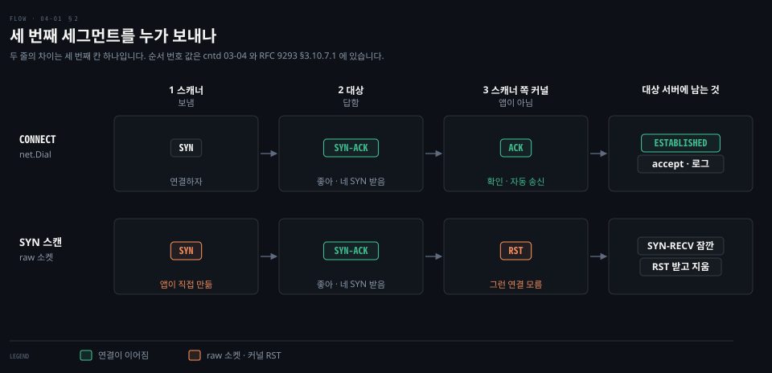
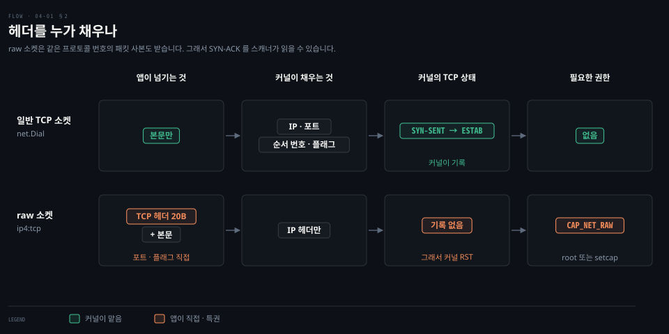
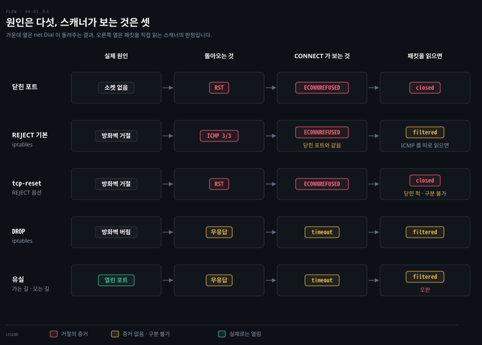
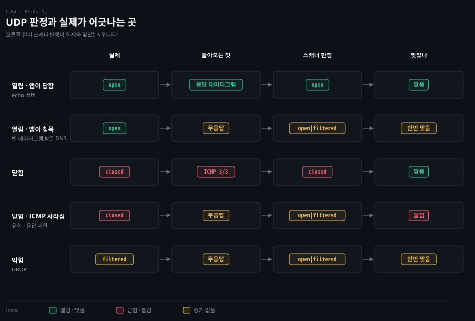
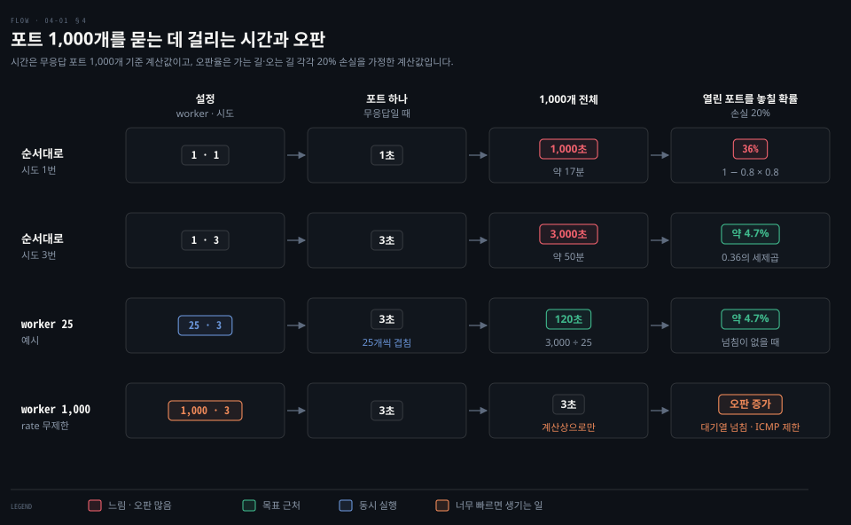
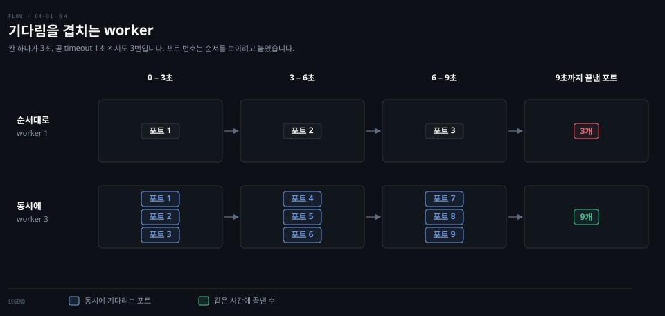
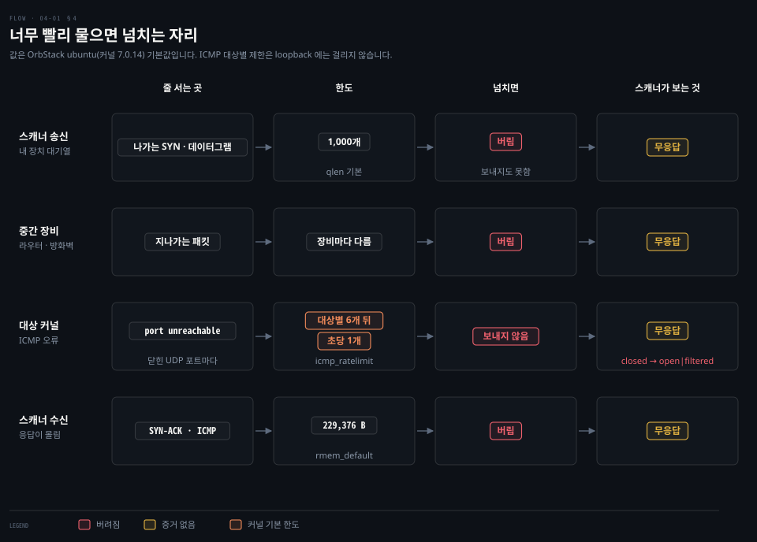
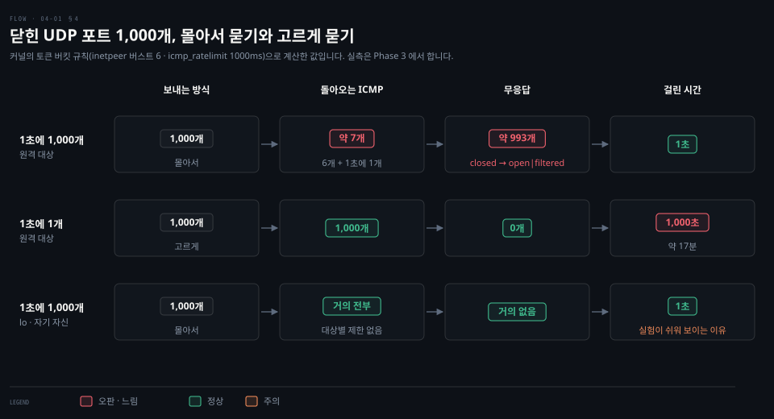

# 무응답은 증거가 아니다

---

> 포트 스캐너는 포트마다 말을 걸어 보고 돌아온 것으로 열림·닫힘·막힘을 판정합니다. 이 문서는 같은 포트를 CONNECT·SYN·UDP 세 방식으로 물었을 때 무엇이 돌아오는지, 그 사이 커널이 앱 몰래 무엇을 보내는지, 그리고 아무것도 돌아오지 않을 때 왜 확정할 수 없는지를 따라갑니다.

## 학습 목표와 범위

> 이 문서를 읽고 나면 세 방식의 판정표를 그릴 수 있어야 합니다. 그리고 "응답이 없다"를 끝내 확정할 수 없어서 스캐너가 정확도와 속도를 맞바꾼다는 것을 설명할 수 있어야 합니다.

| 목표 | 어떻게 확인하나 |
|---|---|
| CONNECT·SYN·UDP 에서 열림·닫힘·막힘을 무엇으로 판정하는지 말합니다 | Phase 3 에서 세 모드의 분류표와 근거 패킷을 대조합니다 |
| 앱이 보내지 않은 ACK 와 RST 를 커널이 왜 보내는지 설명합니다 | Phase 3 에서 SYN 스캔 중 tcpdump 로 커널 RST 를 봅니다 |
| 무응답을 만드는 원인 넷을 들고, 스캐너 판정이 실제와 어긋나는 경우를 짚습니다 | Phase 3 에서 DROP·REJECT·netem 손실·ICMP 제한을 걸어 봅니다 |
| worker 수·재시도·timeout·rate 가 시간과 오판을 어떻게 바꾸는지 계산합니다 | Phase 4 에서 도움 없이 답합니다 |

다루지 않는 것은 TCP 헤더 필드와 체크섬 계산, SYN 쿠키의 내부, 서비스 버전 탐지입니다. 헤더를 직접 짜는 일은 Phase 3 실습에서 합니다. 3-way handshake 와 RST·SYN 쿠키의 원리는 [cntd 03-04](../../book/cntd_computer-networking-top-down/03-04.%ED%9D%90%EB%A6%84%20%EC%A0%9C%EC%96%B4%EC%99%80%20%EC%97%B0%EA%B2%B0%20%EA%B4%80%EB%A6%AC%2C%20%EA%B7%B8%EB%A6%AC%EA%B3%A0%20%ED%98%BC%EC%9E%A1.md) §2·§3 이 정본입니다. DROP 과 REJECT 의 실측은 [nk 02-06](../../../08_cloud/book/networking-and-kubernetes/02-06.%EC%BB%A4%EB%84%90%20%EB%84%A4%ED%8A%B8%EC%9B%8C%ED%82%B9%20%EC%8B%A4%EC%8A%B5%202%20%E2%80%94%20%EB%A7%89%EA%B3%A0%2C%20%EC%A7%84%EB%8B%A8%ED%95%98%EA%B3%A0%2C%20%EB%82%98%EB%88%84%EA%B8%B0.md) §1 에 있습니다. 스캔은 자기 소유 호스트(OrbStack 머신, `lo`)에만 합니다.

| 키워드 | 뜻 | 학습 포인트·연결 개념 | 어디서 |
|---|---|---|---|
| 포트 스캐너 | 포트마다 말을 걸어 상태를 판정하는 프로그램 | 판정은 open·closed·filtered | §1 |
| SYN · SYN-ACK · ACK | 연결을 맺을 때 오가는 세 세그먼트의 플래그 | 3-way handshake | §1 |
| CONNECT 스캔 | `net.Dial` 로 연결을 끝까지 맺어 보는 방식 | 결과를 errno 로만 봄 | §1 |
| SYN 스캔 | SYN 하나만 보내고 돌아온 플래그를 읽는 방식 | raw 소켓이 필요함 | §1, §2 |
| RST | "그런 연결은 없다"를 뜻하는 TCP 플래그 | 소켓이 없을 때 커널이 보냄 | §1, §2 |
| raw 소켓 | 앱이 TCP 헤더를 직접 써서 보내는 소켓 | `CAP_NET_RAW` 권한 | §2 |
| ICMP port unreachable | 닫힌 UDP 포트에 커널이 돌려보내는 오류 메시지 | 종류 3(목적지 도달 불가)·코드 3(포트) | §1, §2, §3 |
| open\|filtered | 열렸는지 막혔는지 가를 수 없다는 UDP 판정 | 무응답의 정직한 이름 | §3 |
| worker pool | 같은 일을 하는 goroutine 을 여러 개 띄워 동시에 처리하는 방식 | 기다림을 겹침 | §4 |
| rate limit | 초당 보내는 패킷 수의 상한 | 몰아서 보내지 않고 고르게 | §4 |


## 1. 같은 포트를 세 방식으로 묻습니다

> 세 방식은 열린 포트와 닫힌 포트에서 서로 다른 증거를 받지만, 막힌 포트에서는 모두 아무것도 받지 못합니다. 이 비대칭이 문서 전체의 출발점입니다.



포트 하나가 열렸는지 알고 싶다고 해 봅시다. 우리가 Phase 0 부터 써 온 방법은 `net.Dial` 하나였습니다. 결과는 "연결됨"이나 "에러" 둘뿐이었습니다. 그 사이에 어떤 패킷이 오갔는지는 커널이 처리해서 앱에 보이지 않았습니다. 포트 스캐너는 그 숨은 패킷을 증거로 읽어야 하는 프로그램입니다.

판정은 셋입니다.

- **open**(열림): 그 포트에서 듣는 프로그램이 있습니다.
- **closed**(닫힘): 호스트에는 닿았지만 그 포트에서 듣는 프로그램이 없습니다.
- **filtered**(막힘): 중간의 방화벽이 패킷을 막아 판단할 수 없습니다.

판정에 쓰는 증거는 TCP 세그먼트에 켜진 **플래그**입니다. 이 문서에 나오는 플래그는 넷입니다. 앞의 셋이 연결을 맺는 3-way handshake 입니다(원리는 [cntd 03-04](../../book/cntd_computer-networking-top-down/03-04.%ED%9D%90%EB%A6%84%20%EC%A0%9C%EC%96%B4%EC%99%80%20%EC%97%B0%EA%B2%B0%20%EA%B4%80%EB%A6%AC%2C%20%EA%B7%B8%EB%A6%AC%EA%B3%A0%20%ED%98%BC%EC%9E%A1.md) §2).

| 플래그 | 뜻 | 누가 보내나 |
|---|---|---|
| SYN | 연결하자 | 연결을 시작하는 쪽 |
| SYN-ACK | 좋아, 네 SYN 받았어 | 듣고 있는 쪽 |
| ACK | 확인, 이제 연결됐어 | 시작한 쪽 |
| RST | 그런 연결은 없어 | 받아 줄 소켓이 없는 쪽 |

`ss` 에 보이는 CLOSED·ESTABLISHED 는 소켓의 **상태** 이름입니다. SYN·RST 는 선로를 오가는 세그먼트의 **플래그** 이름입니다. 닫힌 포트가 돌려보내는 것은 상태가 아니라 RST 플래그가 켜진 세그먼트입니다.

### CONNECT 는 결과를 errno 로만 봅니다

**CONNECT 스캔**은 `net.Dial` 로 3-way handshake 를 끝까지 맺어 봅니다. 성공하면 open 입니다. 닫힌 포트에서는 대상이 RST 를 돌려보내므로 곧바로 `ECONNREFUSED` 가 옵니다. 이것을 closed 로 판정합니다. `ECONNREFUSED` 처럼 syscall 이 실패한 이유를 알리는 번호를 **errno** 라고 부릅니다. 기다리다 timeout 이 나면 filtered 입니다. Go 코드로는 에러의 종류만 가르면 됩니다.

```go
conn, err := net.DialTimeout("tcp", addr, time.Second)
switch {
case err == nil:
	conn.Close()
	return Open
case errors.Is(err, syscall.ECONNREFUSED):
	return Closed // RST 또는 ICMP 가 돌아왔다
default:
	var ne net.Error
	if errors.As(err, &ne) && ne.Timeout() {
		return Filtered // 아무것도 돌아오지 않았다
	}
	return Unknown
}
```

`DialTimeout` 에 1초를 준 이유가 있습니다. timeout 을 주지 않으면 커널 기본값대로 SYN 을 모두 10번 다시 보내고(`tcp_syn_retries` 6 + `tcp_syn_linear_timeouts` 4) 131초쯤 뒤에야 포기합니다.[^syn-retries] 포트 하나에 2분이 넘으면 스캐너로 쓸 수 없습니다.

CONNECT 의 장점은 일반 사용자 권한으로 돈다는 것입니다. 단점은 연결을 끝까지 맺는다는 것입니다. 대상 서버는 `accept` 로 연결을 받고 접속 로그를 남길 수 있습니다(accept 대기열은 [00-01](./00-01.listener%20%EC%86%8C%EC%BC%93%EA%B3%BC%20%EC%97%B0%EA%B2%B0%20%EC%86%8C%EC%BC%93.md) 참고). 판정에 쓸 수 있는 정보도 errno 하나뿐입니다.

### SYN 스캔은 돌아온 플래그를 직접 읽습니다

**SYN 스캔**은 SYN 하나만 보내고 돌아온 세그먼트의 플래그를 봅니다. SYN-ACK 면 open, RST 면 closed, 아무것도 없으면 filtered 입니다. 연결을 끝까지 맺지 않으므로 대상 서버의 앱은 연결을 받지 못합니다.

`net.Dial` 로는 이렇게 할 수 없습니다. SYN-ACK 가 오는 순간 커널이 마지막 ACK 를 자동으로 보내 버리기 때문입니다(§2). 그래서 SYN 스캔은 헤더를 앱이 직접 만드는 raw 소켓을 씁니다. 그 대가로 특권이 필요합니다.

### UDP 는 열린 포트도 침묵할 수 있습니다

UDP 에는 SYN 도 RST 도 없습니다. **UDP 스캔**은 데이터그램 하나를 보내고 기다립니다.

- 응답 데이터그램이 오면 open 입니다. 하지만 답할지는 그 포트의 앱이 정합니다. echo 서버는 답하지만, DNS 서버는 질의 형식이 아닌 데이터그램을 그냥 버립니다.
- 닫힌 포트면 대상 커널이 ICMP port unreachable 을 돌려보내니 closed 입니다. IP 계층의 "그 포트로는 전달할 수 없음" 오류 메시지이고, 자세한 것은 §2 에서 봅니다.
- 아무것도 오지 않으면 open 인지 filtered 인지 가를 수 없습니다(§3).

그래서 실제 UDP 스캐너는 포트마다 그 프로토콜이 답할 만한 페이로드를 담아 보냅니다. 53번 포트에는 [03-01](./03-01.DNS%20%EC%A7%88%EC%9D%98%20%ED%95%9C%20%EC%9E%A5%EC%9D%84%20%EB%B0%94%EC%9D%B4%ED%8A%B8%EB%A1%9C%20-%20%ED%97%A4%EB%8D%94%C2%B7%EB%9D%BC%EB%B2%A8%C2%B7%EC%95%95%EC%B6%95%20%ED%8F%AC%EC%9D%B8%ED%84%B0%C2%B7TC.md) 에서 만든 DNS 질의를 보내는 식입니다.


## 2. 커널은 앱이 모르는 사이에 답합니다

> 패킷이 도착하면 커널은 앱보다 먼저 그 패킷을 받을 소켓을 찾고, 찾은 결과에 따라 ACK·RST·ICMP 를 스스로 보냅니다. 스캐너가 읽는 증거의 대부분은 이렇게 커널이 보낸 것입니다.



[00-01](./00-01.listener%20%EC%86%8C%EC%BC%93%EA%B3%BC%20%EC%97%B0%EA%B2%B0%20%EC%86%8C%EC%BC%93.md) 에서 커널은 들어온 패킷의 주소와 포트로 받을 소켓을 찾는다고 봤습니다. 포트 스캔에서는 그 검색이 **실패하는 쪽**이 더 중요합니다. 검색이 실패해도 커널은 패킷을 그냥 버리지 않고 보낸 쪽에 알려 줍니다. 무엇으로 알리는지는 프로토콜마다 다릅니다.

### 소켓이 없으면 TCP 는 RST, UDP 는 ICMP 로 답합니다

TCP 규격은 연결 기록이 없는 곳에 RST 가 아닌 세그먼트가 오면 RST 로 답하라고 정합니다.[^rfc9293-closed] 그래서 닫힌 포트에 SYN 이 오면 대상 커널이 RST 를 돌려보냅니다. 보낸 쪽 `net.Dial` 은 이것을 `ECONNREFUSED` 로 받습니다. 원리 자체는 [cntd 03-04](../../book/cntd_computer-networking-top-down/03-04.%ED%9D%90%EB%A6%84%20%EC%A0%9C%EC%96%B4%EC%99%80%20%EC%97%B0%EA%B2%B0%20%EA%B4%80%EB%A6%AC%2C%20%EA%B7%B8%EB%A6%AC%EA%B3%A0%20%ED%98%BC%EC%9E%A1.md) §2 「없는 소켓 앞으로 온 세그먼트에는 RST 를 보냅니다」에 있습니다.

UDP 에는 이런 플래그가 없습니다. 그래서 한 계층 아래인 IP 계층의 오류 메시지 **ICMP** 를 빌립니다. `ping` 이 쓰는 그 프로토콜입니다. 닫힌 UDP 포트에는 **port unreachable** 을 돌려보냅니다.

ICMP 메시지는 종류와 코드 두 번호로 구분합니다. 종류 3 은 "목적지에 도달할 수 없음", 그중 코드 3 은 "포트에 도달할 수 없음"입니다. 도식의 `ICMP 3/3` 이 이 메시지입니다.

traceroute 가 마지막 홉을 알아내는 방법도 이것입니다([cntd 05-04](../../book/cntd_computer-networking-top-down/05-04.%EC%8B%A4%EC%8A%B5%20-%20traceroute%C2%B7ICMP%C2%B7%ED%9D%90%EB%A6%84%20%ED%91%9C%EB%A5%BC%20%EC%86%90%EC%9C%BC%EB%A1%9C%20%ED%99%95%EC%9D%B8%ED%95%A9%EB%8B%88%EB%8B%A4.md) §2). 보낸 쪽 UDP 소켓이 `connect` 로 상대를 정해 두었다면 이 ICMP 는 다음 읽기에서 `ECONNREFUSED` 로 올라옵니다.[^udp7]

그렇다면 TCP 는 왜 닫힌 포트를 ICMP 로 알리지 않을까요? TCP 에는 같은 계층의 거절 신호 RST 가 이미 있기 때문입니다. 연결 기록을 다루는 것은 TCP 계층입니다. 그러니 거절도 TCP 세그먼트로 하는 편이 받는 쪽 TCP 가 곧바로 처리하기 쉽습니다. UDP 는 그런 신호가 없어 아래 계층을 빌린 것입니다. 다만 TCP 소켓도 ICMP 를 받기는 합니다. §3 에서 방화벽이 TCP 에 ICMP 로 거절하는 경우를 봅니다.

지도의 셋째 줄에서 닫힌 포트의 답이 RST 가 아니라 RST·ACK 인 것은 규격이 정한 모양입니다. SYN 처럼 ACK 가 꺼진 세그먼트에 답할 때는 "네 SYN 은 받았다"는 ACK 를 함께 켜서 보냅니다.[^rfc9293-closed]

### 일반 소켓은 마지막 ACK 를 커널이 보냅니다

CONNECT 와 SYN 스캔이 갈리는 곳은 handshake 의 세 번째 세그먼트입니다. 두 방식 모두 SYN 을 보내고 SYN-ACK 를 받는 데까지는 같습니다.



`net.Dial` 로 연결을 시작한 소켓은 커널에 "SYN 을 보내고 답을 기다리는 중(SYN-SENT)"으로 기록되어 있습니다. 그래서 SYN-ACK 가 오면 커널은 기록과 맞춰 본 뒤 앱에 묻지 않고 곧바로 ACK 를 보냅니다. 앱은 이 순간을 멈출 방법이 없습니다.

`Dial` 이 돌아왔을 때는 이미 연결이 성립한 상태(ESTABLISHED)입니다. 대상 서버의 accept 대기열에도 올라 있습니다. Phase 0 부터 써 온 `net.Dial` 도 매번 이렇게 동작했습니다. 우리가 handshake 를 의식하지 않아도 됐던 것은 커널이 세 번째 세그먼트까지 대신 보내 줬기 때문입니다.

### raw 소켓으로 보낸 SYN 은 커널이 모르는 연결입니다

SYN 스캔이 "세 번째 세그먼트를 보내지 않을 자유"를 얻으려고 쓰는 것이 **raw 소켓**입니다. 일반 소켓과는 헤더를 채우는 주체가 다릅니다.



raw 소켓으로 보낸 SYN 은 커널의 TCP 상태 관리를 거치지 않습니다. 그래서 커널에는 "이 연결을 시작했다"는 기록이 남지 않습니다. 대상이 SYN-ACK 로 답하면 두 가지 일이 함께 일어납니다.

1. raw 소켓은 같은 프로토콜 번호의 패킷 사본을 받습니다. 그래서 스캐너는 이 SYN-ACK 를 읽고 open 으로 판정합니다.[^raw7]
2. 스캐너 쪽 커널은 이 SYN-ACK 를 받아 줄 TCP 소켓을 찾지 못합니다. 그래서 대상에게 RST 를 보냅니다.

이 RST 는 스캐너 쪽 커널이 대상에게 보내는 것이고, 포트가 닫혔다는 뜻이 아닙니다. "나는 이 연결을 모른다"는 뜻입니다. 닫힌 포트의 대상 커널이 RST 를 보낼 때와 규칙은 같습니다. 하지만 보내는 쪽과 가리키는 대상이 다릅니다.

| 누가 보낸 RST 인가 | 받는 쪽 | 뜻 |
|---|---|---|
| 대상 커널 | 스캐너 | 그 포트에 듣는 소켓이 없다 → closed 의 증거 |
| 스캐너 쪽 커널 | 대상 | 나는 이 연결을 시작한 기록이 없다 → 판정과 무관 |

스캐너 코드는 RST 를 보낸 적이 없는데 tcpdump 에는 RST 가 찍히는 이유가 이것입니다. 덕분에 대상 서버에는 반쯤 열린 연결(SYN-RECV, SYN-ACK 를 보내고 마지막 ACK 를 기다리는 상태)이 오래 남지 않습니다.

### 헤더를 직접 쓰는 능력은 특권입니다

raw 소켓을 열려면 root 이거나 `CAP_NET_RAW` 권한이 있어야 합니다.[^capabilities] capability 는 root 의 권한을 작게 쪼갠 조각입니다. 헤더를 앱이 쓴다는 것은 커널이 지켜 주던 규칙을 앱이 벗어날 수 있다는 뜻이기 때문입니다.

- 출발지 주소를 남의 것으로 바꿔 보낼 수 있습니다.
- 남의 연결에 맞는 RST 를 만들어 그 연결을 끊을 수 있습니다.
- 커널의 연결 상태와 맞지 않는 세그먼트를 마음대로 보낼 수 있습니다.

바이너리 하나에만 이 권한을 주려면 `sudo setcap cap_net_raw+ep ./bin/gonet` 처럼 파일에 capability 를 붙입니다. capability 가 무엇인지는 [container-security 02-01](../../../08_cloud/book/container-security/02-01.Linux%20%EC%8B%9C%EC%8A%A4%ED%85%9C%20%EC%BD%9C%C2%B7%EA%B6%8C%ED%95%9C%C2%B7capability%20%E2%80%94%20%EC%BB%A8%ED%85%8C%EC%9D%B4%EB%84%88%20%EB%B3%B4%EC%95%88%EC%9D%98%20%EB%B0%94%EB%8B%A5.md) §4 가 정본입니다. macOS(BSD 계열)의 raw 소켓에는 들어오는 TCP 세그먼트가 전달되지 않습니다. 그래서 SYN 스캔은 OrbStack 머신에서만 돌립니다.[^bsd-raw]


## 3. 무응답은 증거가 아닙니다

> 무언가 돌아오면 증거가 되지만, 아무것도 돌아오지 않는 것은 방화벽 DROP·유실·ICMP 응답 제한이 모두 똑같이 만들어 냅니다. 그래서 TCP 무응답은 filtered 로, UDP 무응답은 open|filtered 로만 적을 수 있습니다.



timeout 이 났다고 방화벽이 막았다고 단정할 수 있을까요? 원인 다섯을 나란히 놓아 보겠습니다. 스캐너가 보는 것은 RST, ICMP, 무응답 셋뿐이고 그중 무응답에 원인 둘이 겹칩니다.

### 방화벽은 침묵하거나 거절을 지어 보냅니다

방화벽(iptables)이 패킷을 막는 방법은 둘입니다. **DROP** 은 조용히 버리고 아무것도 돌려보내지 않습니다. **REJECT** 는 버리면서 거절했다는 답을 지어 보냅니다. REJECT 가 무엇을 보내는지는 따로 지정하지 않으면 TCP 에도 ICMP port unreachable 입니다. `--reject-with tcp-reset` 을 붙이면 RST 입니다.[^reject]

여기서 CONNECT 의 약점이 하나 더 드러납니다. Linux 커널은 연결을 시도하던 TCP 소켓이 ICMP port unreachable 을 받으면 이것을 `ECONNREFUSED` 로 바꿔 앱에 넘깁니다.[^icmp-err] 그래서 `net.Dial` 만 보는 스캐너에게는 닫힌 포트와 REJECT 로 막힌 포트가 똑같습니다.

패킷을 직접 읽는 스캐너만 RST 와 ICMP 를 갈라 볼 수 있습니다. 그마저 `tcp-reset` 으로 거절하는 방화벽 앞에서는 닫힌 포트와 구분되지 않습니다.

같은 실험을 netns(같은 커널 안에 따로 떼어 낸 가상 네트워크 공간) 위에서 해 본 기록이 [nk 02-06](../../../08_cloud/book/networking-and-kubernetes/02-06.%EC%BB%A4%EB%84%90%20%EB%84%A4%ED%8A%B8%EC%9B%8C%ED%82%B9%20%EC%8B%A4%EC%8A%B5%202%20%E2%80%94%20%EB%A7%89%EA%B3%A0%2C%20%EC%A7%84%EB%8B%A8%ED%95%98%EA%B3%A0%2C%20%EB%82%98%EB%88%84%EA%B8%B0.md) §1 에 있습니다. REJECT 를 걸자 `nc` 가 `Connection refused` 를 냈습니다.

### 유실은 열린 포트를 filtered 로 보이게 합니다

[02-03](./02-03.UDP%20%EC%8B%A4%EC%8A%B5%20%EA%B8%B0%EB%A1%9D%20-%20%EA%B2%BD%EA%B3%84%C2%B7%EC%9E%98%EB%A6%BC%C2%B7%EC%86%8C%EC%BC%93%C2%B7netem%20%EC%86%90%EC%8B%A4%EA%B3%BC%20%EC%88%9C%EC%84%9C.md) 실험 4 에서 `netem loss 20%` 로 `lo` 에 손실을 걸자 메시지 일부가 중간에서 사라졌습니다. 스캐너의 SYN 이나 대상의 SYN-ACK 가 이렇게 사라지면 열린 포트가 무응답이 됩니다. 사라진 곳이 가는 길이든 오는 길이든 스캐너가 보기에는 같습니다.

DROP 과 다른 점은 우연이라는 것입니다. 같은 포트에 다시 물으면 이번에는 답이 올 수 있습니다. DROP 은 몇 번을 물어도 계속 침묵합니다. 재시도가 둘을 가르는 가장 값싼 도구이고, 그 비용은 §4 에서 셉니다.

### UDP 무응답은 열림까지 섞입니다

UDP 는 사정이 더 나쁩니다. TCP 에서는 열린 포트가 대기열이 넘치지 않는 한 SYN-ACK 로 답합니다. UDP 에서는 열린 포트도 앱이 답하지 않으면 침묵합니다. 그래서 스캐너는 무응답을 **open|filtered**("열렸거나 막혔거나, 구분할 수 없음")라고 적습니다.



네 번째 줄은 판정이 틀리는 경우입니다. 닫힌 포트도 침묵할 때가 있습니다. ICMP 가 오는 길에 사라질 때입니다. 대상 커널이 ICMP 를 아끼느라 응답을 생략할 때도 그렇습니다.

Linux 커널은 같은 출발지에 보내는 이 ICMP 를 6개까지 몰아 보낸 뒤 1초에 1개로 제한합니다.[^icmp-limit] 빠르게 훑는 UDP 스캔은 이 한도에 금방 닿습니다. 그 뒤의 닫힌 포트는 open|filtered 로 잘못 적힙니다. 얼마나 틀리는지는 §4 에서 셉니다.


## 4. 정확도와 속도를 맞바꿉니다

> 무응답을 줄이려면 다시 물어야 하고 다시 물을수록 오래 걸립니다. worker 를 늘려 기다림을 겹치면 시간이 줄지만, 너무 빨리 물으면 대기열이 넘쳐 스캐너가 스스로 무응답을 만들어 냅니다.



판정 하나하나는 §1~§3 으로 정해졌습니다. 남은 문제는 포트가 1,000개일 때입니다. 무응답 포트는 timeout 만큼 기다려야 판정할 수 있으므로 시간 대부분이 기다림에 쓰입니다.

### 재시도는 오판을 줄이고 시간을 곱합니다

손실이 가는 길과 오는 길에 각각 20% 이고 시도마다 독립이라고 가정하면, 한 번 물어 답을 받을 확률은 0.8 × 0.8 = 0.64 입니다. 열린 포트를 놓칠 확률이 36% 입니다. 세 번 물어 세 번 모두 놓칠 확률은 0.36 의 세제곱, 약 4.7% 로 떨어집니다. 대신 무응답 포트 하나에 1초 × 3번 = 3초가 들고, 순서대로 1,000개를 물으면 3,000초, 약 50분입니다.

무응답만으로는 끝내 확실히 알 수 없습니다. 시도를 늘리면 오판 확률이 줄 뿐 0 이 되지는 않습니다. 그래서 스캐너는 "몇 번까지 물을지"와 "얼마나 기다릴지"를 사용자에게 고르게 합니다. 이 랩이 참고하는 naabu 의 기본값은 재시도 3번, timeout 1초입니다.[^naabu] naabu 는 결과와 상관없이 전체 포트를 세 바퀴 돕니다.

### worker 는 기다림을 겹쳐 시간을 줄입니다

기다리는 동안 스캐너는 아무 일도 하지 않습니다. 그 시간에 다른 포트를 물으면 됩니다. 같은 일을 하는 goroutine 여러 개를 띄워 포트를 나눠 맡기는 것이 **worker pool** 입니다.



worker 가 3이면 같은 9초 동안 포트 9개를 끝냅니다. worker 25에 시도 3번이라면 무응답 포트 1,000개가 3,000 ÷ 25 = 120초로 줄어듭니다. 각 포트의 판정 방법은 바뀌지 않았고, 기다림만 겹쳤습니다.

Go 로는 포트를 채널에 넣고 goroutine 여러 개가 꺼내 가게 하면 됩니다. 아래 `tick` 은 일정한 간격으로 신호를 내보내는 채널입니다. worker 는 신호를 받을 때만 다음 포트를 묻습니다. 이 장치가 뒤에서 볼 **rate limit**(초당 보내는 패킷 수의 상한)입니다.

```go
func scan(host string, workers, rate int, results chan<- Result) {
	ports := make(chan int)
	// rate 개/초 간격으로 신호를 내보내는 채널
	tick := time.Tick(time.Second / time.Duration(rate))
	// 포트를 하나씩 넣고 다 넣으면 닫는다
	go func() {
		for p := 1; p <= 1000; p++ {
			ports <- p
		}
		close(ports)
	}()
	var wg sync.WaitGroup
	for range workers {
		wg.Add(1)
		go func() {
			defer wg.Done()
			for p := range ports {
				// rate limit: 신호가 올 때만 다음 포트를 묻는다
				<-tick
				results <- probe(host, p)
			}
		}()
	}
	wg.Wait()
}
```

### 너무 빨리 물으면 스캐너가 무응답을 만듭니다

worker 를 1,000개로 늘리면 계산상 3초에 끝납니다. 하지만 실제로는 오판이 늘어납니다. 한꺼번에 1,000개를 **몰아서** 보내기 때문입니다. 패킷은 가는 길과 오는 길 곳곳의 대기열에서 줄을 서고, 대기열마다 한도가 있습니다.



빠지는 속도보다 빨리 넣으면 넘친 패킷은 버려집니다. [02-01](./02-01.%EA%B2%BD%EA%B3%84%EB%A5%BC%20%EC%A7%80%ED%82%A4%EB%8A%94%20UDP%2C%20%EB%8C%80%EC%8B%A0%20%EB%96%A0%EC%95%88%EB%8A%94%20%EA%B2%83%20-%20%EB%8D%B0%EC%9D%B4%ED%84%B0%EA%B7%B8%EB%9E%A8%C2%B7%EC%86%90%EC%8B%A4%C2%B7%EC%88%9C%EC%84%9C.md) §1 에서 본 TCP 연결은 받는 쪽이 보내는 쪽을 늦출 수 있습니다(흐름 제어). 스캐너가 받는 SYN-ACK·ICMP·UDP 응답에는 그런 장치가 없습니다. 받는 소켓의 버퍼가 차면 그대로 버려집니다.

버려진 자리는 스캐너에게 무응답으로 보이고 무응답은 filtered 나 open|filtered 로 적힙니다. 스캐너가 너무 서둘러서 스스로 오판을 만드는 셈입니다.

대상 커널의 ICMP 제한은 이 넘침이 가장 크게 드러나는 곳입니다. 닫힌 UDP 포트 1,000개를 1초 안에 몰아서 물으면 어떻게 되는지 커널 규칙으로 계산해 보면 이렇습니다.



몰아서 물으면 ICMP 는 7개쯤만 돌아오고 993개가 open|filtered 로 잘못 적힙니다. 1초에 1개씩 고르게 물으면 모두 맞지만 17분이 걸립니다. UDP 스캔이 유난히 느린 이유가 이것입니다. 마지막 줄은 Phase 3 를 위한 주의입니다. `lo` 로 자기 자신을 스캔하면 대상별 제한이 걸리지 않아, 이 오판이 재현되지 않습니다.

그래서 스캐너는 worker 수와 별도로 rate limit 을 둡니다. 동시에 몇 개를 기다릴지(worker)와 1초에 몇 개를 보낼지(rate)는 다른 손잡이입니다. worker 를 늘리면 기다림이 겹치고 rate 를 낮추면 몰아서 보내지 않게 됩니다.

naabu 는 둘을 `-rate`(기본 초당 1,000) 하나로 묶어, 동시에 기다리는 탐침 수와 초당 보내는 수를 함께 정합니다.[^naabu-rate]


## 검증과 복습

> 이 문서의 이해를 어떻게 확인했고, 무엇을 남겼는지 적습니다.

- Phase 1: 2026-10-03 소크라테스 문답 Q1~Q8 로 세 방식의 판정과 무응답의 한계를 학습자가 세웠습니다. RST 라는 이름은 힌트 뒤에도 떠올리지 못해 설명으로 채웠고, 첫 자답·힌트 뒤 답·설명의 구분은 [STATE.md](./STATE.md) 에 있습니다. 학습자가 요청한 네 가지(worker pool, rate 와 대기열, 마지막 ACK 자동 송신, 커널 RST)는 §2·§4 의 도식으로 풀었습니다. 2026-10-03 별도 서브에이전트 둘이 사실(VM 실측 포함)과 학습성을 검토했고, 지적한 오류 셋(SYN 재전송 횟수, ICMP 제한의 종류, naabu `-c` 해석)과 학습성 지적을 반영했습니다.
- Phase 3: 아직 진행하지 않았습니다. 세 모드를 구현하고 DROP·REJECT·netem 손실·ICMP 제한·고속 스캔 실험을 할 예정입니다.
- Phase 4: 아직 진행하지 않았습니다.
- 복습 표적
  - §2: 닫힌 포트에 돌아오는 것이 RST 라는 점(첫 답은 상태 이름 CLOSED)
  - §2: SYN 스캔 중 RST 를 보내는 쪽과 그 이유(첫 답은 "closed 로 나간다")
  - §3: UDP 무응답이 open|filtered 인 이유


## 출처와 관련 문서

> 동작 주장에 쓴 1차 자료와, 설명을 넘긴 노트입니다.

- [cntd 03-04 흐름 제어와 연결 관리](../../book/cntd_computer-networking-top-down/03-04.%ED%9D%90%EB%A6%84%20%EC%A0%9C%EC%96%B4%EC%99%80%20%EC%97%B0%EA%B2%B0%20%EA%B4%80%EB%A6%AC%2C%20%EA%B7%B8%EB%A6%AC%EA%B3%A0%20%ED%98%BC%EC%9E%A1.md): 3-way handshake, 없는 소켓 앞의 RST, SYN 플러드와 SYN 쿠키
- [cntd 05-04 traceroute·ICMP 실습](../../book/cntd_computer-networking-top-down/05-04.%EC%8B%A4%EC%8A%B5%20-%20traceroute%C2%B7ICMP%C2%B7%ED%9D%90%EB%A6%84%20%ED%91%9C%EB%A5%BC%20%EC%86%90%EC%9C%BC%EB%A1%9C%20%ED%99%95%EC%9D%B8%ED%95%A9%EB%8B%88%EB%8B%A4.md): port unreachable 로 마지막 홉을 아는 traceroute
- [nk 02-06 막고, 진단하고, 나누기](../../../08_cloud/book/networking-and-kubernetes/02-06.%EC%BB%A4%EB%84%90%20%EB%84%A4%ED%8A%B8%EC%9B%8C%ED%82%B9%20%EC%8B%A4%EC%8A%B5%202%20%E2%80%94%20%EB%A7%89%EA%B3%A0%2C%20%EC%A7%84%EB%8B%A8%ED%95%98%EA%B3%A0%2C%20%EB%82%98%EB%88%84%EA%B8%B0.md): DROP 과 REJECT 의 실측, REJECT 의 출발지 주소
- [nk 02-04 Linux 네트워크 진단 도구](../../../08_cloud/book/networking-and-kubernetes/02-04.Linux%20%EB%84%A4%ED%8A%B8%EC%9B%8C%ED%81%AC%20%EC%A7%84%EB%8B%A8%20%EB%8F%84%EA%B5%AC%20%E2%80%94%20%EA%B3%84%EC%B8%B5%20%EC%88%9C%EC%84%9C%EB%8C%80%EB%A1%9C%20%EC%88%98%EC%82%AC%ED%95%98%EA%B8%B0.md) §4: 안에서 보는 `ss` 와 밖에서 보는 `nmap`
- [container-security 02-01](../../../08_cloud/book/container-security/02-01.Linux%20%EC%8B%9C%EC%8A%A4%ED%85%9C%20%EC%BD%9C%C2%B7%EA%B6%8C%ED%95%9C%C2%B7capability%20%E2%80%94%20%EC%BB%A8%ED%85%8C%EC%9D%B4%EB%84%88%20%EB%B3%B4%EC%95%88%EC%9D%98%20%EB%B0%94%EB%8B%A5.md) §4: capability 와 `setcap`
- [02-01 경계를 지키는 UDP](./02-01.%EA%B2%BD%EA%B3%84%EB%A5%BC%20%EC%A7%80%ED%82%A4%EB%8A%94%20UDP%2C%20%EB%8C%80%EC%8B%A0%20%EB%96%A0%EC%95%88%EB%8A%94%20%EA%B2%83%20-%20%EB%8D%B0%EC%9D%B4%ED%84%B0%EA%B7%B8%EB%9E%A8%C2%B7%EC%86%90%EC%8B%A4%C2%B7%EC%88%9C%EC%84%9C.md): 수신 버퍼, connected UDP, netem 손실
- 계획 문서: `~/study/gonet-lab/docs/03-02.gonet-lab-phase4-plan.md` (구현 세 단, 실험 목록, naabu 대응표)

[^syn-retries]: Linux `net/ipv4/tcp_timer.c` 는 SYN-SENT 상태에서 재전송 한도에 `tcp_syn_linear_timeouts` 를 더합니다(`max_retransmits += ...`). ip-sysctl.rst, tcp_syn_retries "Default value is 6, which corresponds to 67seconds (with tcp_syn_linear_timeouts = 4) till the last retransmission with the current initial RTO of 1second. With this the final timeout for an active TCP connection attempt will happen after 131seconds." OrbStack ubuntu 에서 `tcp_syn_retries = 6`, `tcp_syn_linear_timeouts = 4` 확인(2026-10-03). <https://www.kernel.org/doc/Documentation/networking/ip-sysctl.rst>
[^rfc9293-closed]: RFC 9293 §3.10.7.1 CLOSED STATE, "An incoming segment not containing a RST causes a RST to be sent in response." ACK 비트가 꺼진 세그먼트(SYN)에는 `<SEQ=0><ACK=SEG.SEQ+SEG.LEN><CTL=RST,ACK>`, 켜진 세그먼트(SYN-ACK)에는 `<SEQ=SEG.ACK><CTL=RST>` 로 답합니다. <https://www.rfc-editor.org/rfc/rfc9293#section-3.10.7.1>
[^udp7]: Linux man page `udp(7)` ERRORS, "ECONNREFUSED No receiver was associated with the destination address. This might be caused by a previous packet sent over the socket." <https://man7.org/linux/man-pages/man7/udp.7.html>
[^raw7]: Linux man page `raw(7)`, "All packets or errors matching the protocol number specified for the raw socket are passed to this socket." <https://man7.org/linux/man-pages/man7/raw.7.html>
[^capabilities]: Linux man page `capabilities(7)`, CAP_NET_RAW "Use RAW and PACKET sockets; ...". `raw(7)` 도 "In order to create a raw socket, a process must have the CAP_NET_RAW capability" 라고 적습니다. <https://man7.org/linux/man-pages/man7/capabilities.7.html>
[^reject]: `iptables-extensions(8)` REJECT (IPv4), "--reject-with type ... (icmp-port-unreachable is the default). The option tcp-reset can be used on rules which only match the TCP protocol: this causes a TCP RST packet to be sent back." <https://man7.org/linux/man-pages/man8/iptables-extensions.8.html>
[^icmp-err]: Linux 소스 `net/ipv4/icmp.c` 의 `icmp_err_convert[]` 에서 `ICMP_PORT_UNREACH` 가 `.errno = ECONNREFUSED, .fatal = 1` 이고, `net/ipv4/tcp_ipv4.c` 의 `tcp_v4_err` 는 SYN-SENT 상태에서 이 오류로 연결을 끝냅니다(2026-10-03 master 조회). <https://github.com/torvalds/linux/blob/master/net/ipv4/icmp.c>
[^icmp-limit]: 대상별 제한은 `net/ipv4/icmp.c` 의 `icmpv4_xrlim_allow` 와 `net/ipv4/inetpeer.c` 의 `XRLIM_BURST_FACTOR 6` 이 정하고, 간격은 `icmp_ratelimit = 1000`(ms) 입니다. 같은 함수에 "No rate limit on loopback" 이 있어 `lo` 에는 걸리지 않습니다. 모든 대상을 합한 전역 한도 `icmp_msgs_per_sec`·`icmp_msgs_burst` 는 OrbStack ubuntu(커널 7.0.14)에서 1000·50 이고, 최신 ip-sysctl.rst 의 기본값은 10000 입니다. `icmp_ratemask = 6168` 에 destination unreachable 이 들어 있습니다(2026-10-03). <https://www.kernel.org/doc/Documentation/networking/ip-sysctl.rst>
[^bsd-raw]: W. Richard Stevens 외, *UNIX Network Programming* Vol. 1 3판 §28.4 Raw Socket Input, BSD 계열 커널은 받은 TCP·UDP 패킷을 raw 소켓에 넘기지 않습니다. gonet-lab Phase 4 계획 문서도 같은 이유로 SYN 단을 Linux 전용으로 둡니다.
[^naabu-rate]: naabu `pkg/runner/runner.go` 에서 탐침 동시성은 `sizedwaitgroup.New(r.options.Rate)`, 속도는 같은 `Rate` 로 만든 limiter 의 `Take()` 가 정합니다. README 의 `-c` 는 "general internal worker threads" 로 포트 탐침 수와 다릅니다(2026-10-03 사실 검증 에이전트 확인).
[^naabu]: projectdiscovery/naabu README 의 옵션 기본값 `-retries 3`, `-timeout 1000`(ms), `-c 25`, `-rate 1000`. gonet-lab Phase 4 계획 문서의 대응표에서 옮겼습니다(계획 문서는 2026-10-01 README 확인). <https://github.com/projectdiscovery/naabu>
