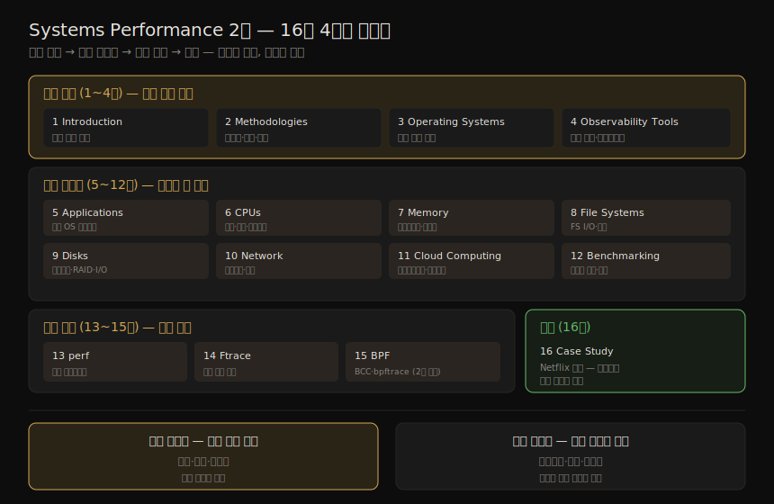

# Systems Performance (2판) — 책 개요와 학습 로드맵
---
> 이 책은 운영체제 관점에서 시스템과 애플리케이션의 성능을 분석하는 법을 다루는 Brendan Gregg(Netflix 성능 엔지니어)의 책입니다. 리눅스를 주 예시로, CPU·메모리·파일시스템·디스크·네트워크부터 클라우드(하이퍼바이저·컨테이너)·벤치마킹·고급 추적(perf·Ftrace·BPF)까지 16개 장으로 올라갑니다. 이 노트는 각 장 본문에 들어가기 전, 책 전체가 어디로 향하는지를 먼저 잡아 두는 지도입니다.

성능 분석이 어려운 까닭은 문제가 어디서든 — 심지어 내가 점검조차 하지 않는 영역에서도 — 비롯되기 때문입니다. 저자는 서장을 도널드 럼스펠드의 말로 엽니다. "우리가 안다고 아는 것(known knowns)이 있고, 모른다고 아는 것(known unknowns)이 있으며, 모르는 줄도 모르는 것(unknown unknowns)이 있다." 성능 문제의 진짜 함정은 이 세 번째 — *모르는 줄도 모르는 영역* 입니다. 이 책의 목표는 그 영역을 드러내고, 거기에 닿을 분석 방법론과 도구를 손에 쥐여 주는 것입니다.

이 첫 노트의 목적은 하나입니다. 뒤따라올 장별 학습 노트를 읽기 전에, **네 그룹으로 묶은 16개 장의 배치**와 이 책이 택한 *방법론 우선* 의 구조 철학을 머릿속에 넣어 두는 것입니다. 그래야 개별 주제(예: 디스크 I/O 큐잉)가 전체에서 어디쯤 위치하는지 알고 읽을 수 있습니다.

## 1. 이 책이 답하려는 질문 — unknown unknowns

> 성능 문제는 내가 모르는 줄도 모르는 영역에서도 비롯됩니다. 이 책은 그 영역을 드러내고, 거기에 닿을 분석 방법론과 도구를 제공하는 것을 목표로 삼습니다.

성능 문제는 복잡한 기술 시스템에서 지정학만큼이나 어디서든 튀어나옵니다. 저자가 럼스펠드의 "unknown unknowns"를 인용한 까닭이 여기에 있습니다. 내가 무엇을 점검해야 할지 *아는* 영역(known)은 그나마 다루기 쉽지만, 존재 자체를 모르는 영역은 점검 목록에 오르지도 못합니다. 이 책은 그런 사각지대를 드러내려 합니다.

그래서 이 책의 초점은 "성능 도구가 무엇을 보여 주는가(what)"보다 "어떻게 시스템을 분석하고, 도구가 낡아도 어떻게 최신 상태를 유지하는가(how)"에 있습니다. 저자는 운영체제 성능을 "이미 풀린 문제"로 여기고 싶은 유혹을 경계하라고 합니다. 커널은 수십 년간 다듬어졌지만, 여전히 새로운 워크로드와 하드웨어를 만나며 끊임없이 바뀌는 복잡한 소프트웨어이기 때문입니다.

## 2. 운영체제 성능은 풀린 문제가 아니다

> 커널은 오래 다듬어졌지만 여전히 복잡하고 변화 중입니다. 새 기능이 성능을 높이기도, Meltdown 완화처럼 오히려 깎기도 합니다. 앱 성능도 OS 관점에서 보면 앱 전용 도구가 놓치는 단서를 잡을 수 있습니다.

애플리케이션 코드는 끊임없이 개발되니 느리다는 걸 받아들이기 쉽지만, 운영체제는 다르게 보기 쉽습니다. 커널이 수십 년간 개발·튜닝됐으니 성능은 끝난 이야기라고 여기는 것입니다. 저자는 그렇지 않다고 못 박습니다. 커널은 끊임없이 바뀌는 물리 장치들을 관리하고, 새롭고 다양한 워크로드를 받아 내며, 시스템이 계속 확장되면서 새로 드러나는 병목을 제거하는 작업이 이어집니다.

심지어 커널 변경이 성능을 *해치는* 경우도 있습니다. 2018년 도입된 **Meltdown 취약점 완화**가 그 예입니다. 보안을 위한 변경이 성능 비용을 동반한 것입니다. 그래서 운영체제 성능 분석은 끝나는 작업이 아니라, 계속해서 개선으로 이어지는 진행형 과제입니다.

애플리케이션 성능 역시 운영체제 관점에서 분석할 가치가 있습니다. 앱 전용 도구만으로는 놓칠 단서를, OS 맥락에서 보면 더 찾을 수 있기 때문입니다.

## 3. 2판의 변화 — 왜 다시 썼나

> 지난 8년간 리눅스에 더해진 가장 큰 변화는 Extended BPF입니다. 이를 반영해 BPF·perf·Ftrace 장을 새로 넣었고, 시장이 줄어든 Solaris 콘텐츠는 대거 덜어 내 리눅스에 집중했습니다.

저자는 1판을 8년 전에 썼고, 오래 가도록 설계했습니다. 그럼에도 2판이 필요했던 이유는 그사이 리눅스에 큰 변화가 있었기 때문입니다.

가장 큰 변화는 **Extended BPF** 입니다. 차세대 성능 분석 도구를 떠받치는 커널 기술로, Netflix와 Facebook을 비롯한 회사들이 실제로 씁니다. 2판은 이를 반영해 **BPF 장**을 새로 넣었고(이 주제의 더 깊은 참고서는 저자의 별도 저서 *BPF Performance Tools* 입니다), 그동안 크게 발전한 **perf** 와 **Ftrace** 도 각각 별도의 장으로 분리했습니다. 클라우드 VM을 굴리는 하이퍼바이저와 컨테이너 기술의 변화도 갱신했습니다.

또 하나의 큰 변화는 **Solaris 콘텐츠를 덜어 낸** 것입니다. 1판은 리눅스와 Solaris를 대등하게 다뤘지만, 그사이 Solaris의 시장 점유가 크게 줄어 Solaris 내용을 대부분 제거하고 그 자리에 리눅스 내용을 더 넣었습니다. 다만 운영체제·커널의 이해는 다른 OS를 견주어 볼 때 깊어지므로, 관점을 위해 Solaris와 다른 OS의 언급은 일부 남겨 두었습니다. 이 모든 갱신의 바탕에는 저자가 6년간 Netflix 마이크로서비스 환경에서 하이퍼바이저·컨테이너·런타임·커널·데이터베이스·애플리케이션의 성능을 다룬 현장 경험이 깔려 있습니다.

## 4. durable vs faster-changing — 책의 수명 설계

> 책의 많은 장이 두 부분으로 나뉩니다. 앞부분(용어·개념·방법론)은 수년 뒤에도 유효한 *오래 가는 기술* 이고, 뒷부분(아키텍처·도구·튜너블)은 낡더라도 *예시* 로서 가치가 남습니다.

이 책이 오래 가도록 설계된 비결은 장의 구조에 있습니다. 많은 장이 두 부분으로 나뉩니다.

1. **첫 부분 — 용어·개념·방법론**: 보통 그 자체로 제목이 달려 있으며, 여러 해가 지나도 유효합니다. 이것이 *오래 가는 기술(durable skills)* 입니다.
2. **둘째 부분 — 구현 예시**: 아키텍처·분석 도구·튜너블을 다룹니다. 이쪽은 시간이 지나면 낡지만, 첫 부분의 개념이 *어떻게 구현되는가* 를 보여 주는 예시로서 여전히 쓸모가 있습니다.

저자가 "도구는 낡아도 방법론은 남는다"고 보는 까닭이 여기 있습니다. 예시로 든 도구나 튜닝은 시간이 지나면 더 이상 맞지 않을 수 있지만, 그 도구가 *던지는 질문* 과 그 질문을 끌어내는 *방법론* 은 오래 갑니다. 추적(tracing) 도구 역시 이 책은 BCC·bpftrace·Ftrace를 중심으로 다루지만, 정작 배우기 어려운 핵심은 특정 도구의 사용법이 아니라 "시스템에 어떤 질문을 던질 수 있는가"라고 강조합니다. 그래서 학습 노트를 읽을 때도 도구 이름보다 *그 도구로 무엇을 묻는가* 에 무게를 두면 책의 설계 의도와 맞아떨어집니다.

## 5. 16개 장 학습 로드맵

> 어느 장이 무엇을 다루는지의 지도입니다. 16개 장은 필수 배경(1~4) · 분석 대상별(5~12) · 고급 추적(13~15) · 종합 케이스(16) 네 그룹으로 묶입니다.

저자가 권하는 읽기 흐름은 분명합니다. 1~4장이 필수 배경을 깔고, 그다음은 필요에 따라 나머지를 참조하면 됩니다. 아래 종합도는 네 그룹과 그 안의 장 배치를 한 장으로 보여 줍니다.

아래 표는 서장의 "How This Book Is Structured"가 밝힌 각 장의 범위입니다. 기술 세부 내용은 해당 장 본문을 받아 별도 노트로 채울 예정이며, 이 표는 그 자리를 잡아 두는 골격입니다.

| 장 | 제목 | 그룹 | 다루는 범위 |
|----|------|------|------------|
| 1 | Introduction | 필수 배경 | 시스템 성능 분석 입문, 핵심 개념과 성능 활동의 예 |
| 2 | Methodologies | 필수 배경 | 용어·개념·모델, 관측·실험 방법론, 용량 계획, 분석, 통계 |
| 3 | Operating Systems | 필수 배경 | 성능 분석가를 위한 커널 내부 요약 — OS가 무엇을 하는지 해석할 배경 |
| 4 | Observability Tools | 필수 배경 | 시스템 관측 도구의 종류와 그것이 딛고 선 인터페이스·프레임워크 |
| 5 | Applications | 분석 대상별 | 애플리케이션 성능 주제와 이를 OS 관점에서 관측하기 |
| 6 | CPUs | 분석 대상별 | 프로세서·코어·하드웨어 스레드, CPU 캐시·인터커넥트, 커널 스케줄링 |
| 7 | Memory | 분석 대상별 | 가상 메모리, 페이징·스와핑, 메모리 아키텍처·버스·주소 공간·할당자 |
| 8 | File Systems | 분석 대상별 | 파일시스템 I/O 성능과 관련 캐시들 |
| 9 | Disks | 분석 대상별 | 저장 장치, 디스크 I/O 워크로드, 스토리지 컨트롤러, RAID, 커널 I/O 서브시스템 |
| 10 | Network | 분석 대상별 | 네트워크 프로토콜, 소켓, 인터페이스, 물리 연결 |
| 11 | Cloud Computing | 분석 대상별 | OS·하드웨어 기반 가상화(하이퍼바이저·컨테이너)의 오버헤드·격리·관측 특성 |
| 12 | Benchmarking | 분석 대상별 | 정확히 벤치마킹하는 법, 남의 벤치마크 결과를 해석하는 법, 흔한 실수 피하기 |
| 13 | perf | 고급 추적 | 표준 리눅스 프로파일러 perf(1)와 그 기능 — 책 전반의 perf 사용을 떠받치는 참조 |
| 14 | Ftrace | 고급 추적 | 표준 리눅스 추적기 Ftrace — 커널 코드 실행 탐색에 특히 적합 |
| 15 | BPF | 고급 추적 | 표준 BPF 프런트엔드 BCC·bpftrace 요약 |
| 16 | Case Study | 종합 | Netflix의 실전 성능 사례 — 프로덕션 성능 수수께끼를 처음부터 끝까지 분석 |

> 1~4장은 필수 배경이라 먼저 읽고, 5~12장은 분석 대상(앱·CPU·메모리·디스크·네트워크 등)별로 필요할 때 참조하면 됩니다. 13~15장은 추적·프로파일링 심화라 한두 도구를 깊이 익히려는 독자를 위한 선택 읽기입니다. 16장은 스토리텔링 방식이라, 성능 분석이 처음이라면 다양한 도구가 어떻게 함께 쓰이는지 보려고 *먼저* 읽어도 좋다고 저자는 권합니다.

## 6. 대상 독자와 읽는 법

> 1차 독자는 엔터프라이즈·클라우드의 시스템 관리자·운영자이며, 개발자·DBA·SRE·학생에게도 유용합니다. 성능이 본업이 아닌 사람이 당면 문제만큼만 빠르게 익히도록 짧고 점프 가능하게 짜였습니다.

이 책의 1차 독자는 엔터프라이즈·클라우드 컴퓨팅 환경의 **시스템 관리자와 운영자** 입니다. 더해서 운영체제·애플리케이션 성능을 이해해야 하는 개발자, 데이터베이스 관리자, 웹 서버 관리자에게도 참고서가 됩니다.

저자는 Netflix 같은 대규모 컴퓨팅 환경의 성능 엔지니어로서, 동시다발 성능 문제를 시간 압박 속에 풀어야 하는 SRE·개발자와 일해 왔습니다. 본인도 Netflix CORE SRE 온콜 로테이션에서 그 압박을 직접 겪었습니다. 많은 이에게 성능은 주 업무가 아니므로 당면 문제를 풀 만큼만 알면 된다는 점을 알기에, 책을 되도록 짧게 쓰고 특정 장으로 바로 건너뛰기 쉽게 구성했습니다.

또 다른 독자는 학생입니다. 시스템 성능 과목의 보조 교재로도 적합하며, 각 장 끝의 연습 문제로 내용을 복습·적용할 수 있습니다(일부 고급 문제는 풀지 못해도 되며, 생각을 자극하는 데 목적이 있습니다). 읽는 법은 앞서 본 대로입니다. 1~4장으로 배경을 다진 뒤, 5~12장을 필요에 따라 참조하고, 13~15장은 추적기를 깊이 파고들 때 펼치며, 16장은 전체 그림을 먼저 보고 싶을 때 출발점으로 삼습니다.

## 학습 점검

> 이 노트의 핵심을 스스로 떠올려 봅니다. 답이 막히면 해당 섹션으로 돌아가 확인합니다.

- 럼스펠드의 "unknown unknowns"가 성능 분석에서 무엇을 가리키며, 왜 가장 위험한지 한 문장으로 말해 봅니다. (→ §1)
- "운영체제 성능은 풀린 문제"라는 통념이 왜 틀렸는지, Meltdown 완화 예를 들어 설명해 봅니다. (→ §2)
- 2판이 새로 넣은 세 가지 추적·프로파일링 장(perf·Ftrace·BPF)과, Solaris 콘텐츠를 덜어 낸 이유를 떠올려 봅니다. (→ §3)
- durable skill과 faster-changing skill의 차이를, 책이 장을 두 부분으로 나눈 방식과 연결해 말해 봅니다. (→ §4)
- 16개 장의 네 그룹(필수 배경·분석 대상별·고급 추적·종합)을 구분하고, 저자가 권하는 읽기 순서를 설명해 봅니다. (→ §5, §6)

## 다음 단계

> 이 지도를 펼친 뒤에는 필수 배경(1~4장)부터 순서대로 장 본문을 받아 노트를 채웁니다.

이 노트는 책의 골격만 잡은 지도입니다. 실제 기술 내용은 각 장 본문을 받아 채워야 합니다. 작성 순서는 책 구조를 그대로 따릅니다.

1. **필수 배경 (1~4장)**: 서론·방법론·운영체제·관측 도구 — 나머지 전부의 토대입니다.
2. **분석 대상별 (5~12장)**: 앱·CPU·메모리·파일시스템·디스크·네트워크·클라우드·벤치마킹 — 대상마다 한 장씩입니다.
3. **고급 추적 (13~15장)**: perf·Ftrace·BPF — 추적·프로파일링 심화입니다.
4. **종합 (16장)**: Netflix 케이스 스터디 — 도구를 한데 모아 푸는 실전입니다.

## 관련 문서

> 이 책은 "성능 분석가 관점"으로 OS·커널 내부를 봅니다. 같은 02_os의 다른 커널 노트와는 시선이 다르므로, 같은 메커니즘이 양쪽에서 나오면 서로 교차참조합니다.

- [02_os/systems-performance/ MOC](./README.md) — 본 폴더 전체 지도
- [02_os/ MOC](../README.md) — OS 공통 기반 전체 지도
- [02_os/linux-kernel-programming/ MOC](../linux-kernel-programming/README.md) — 커널 개발자 관점의 리눅스 내부. 본서 3·6·7장(커널·CPU·메모리)과 메커니즘이 겹칩니다
- [02_os/kernel/ MOC](../kernel/README.md) — K8s 운영 관점의 커널 메커니즘(namespace·cgroup). 본서 11장(컨테이너)과 맞닿습니다
