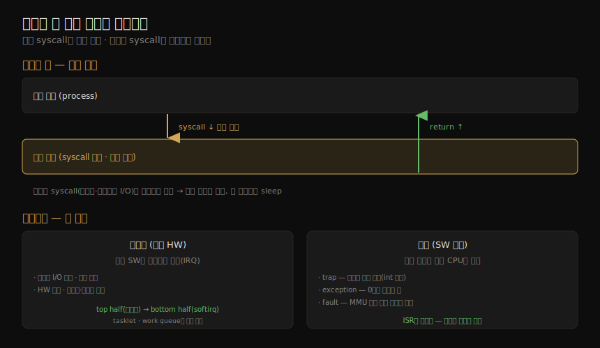

# 운영체제 (1) — 커널·시스템 콜·인터럽트·프로세스
---
> 이 노트는 3장의 첫 부분으로, 성능 분석에 필요한 운영체제·커널의 *실행과 제어 흐름* 을 잡습니다. 성능 분석은 끊임없이 "시스템 콜이 어떻게 수행되나·커널이 스레드를 어떻게 CPU에 배치하나" 같은 가설을 세우고 검증하는 일이라, 커널 지식이 전제됩니다. 여기서는 핵심 용어, 커널과 유저/커널 모드, 시스템 콜, 인터럽트, 클럭, 프로세스, 스택을 봅니다.

성능 분석가는 시스템 동작에 대한 가설 — 시스템 콜이 어떻게 수행되나, 커널이 스레드를 어떻게 CPU에 스케줄링하나, 제한된 메모리가 성능에 어떻게 영향을 주나, 파일시스템이 I/O를 어떻게 처리하나 — 을 세우고 검증합니다. 이 활동에는 운영체제·커널 지식이 필요합니다. 이 노트는 그 지식의 첫 절반 — 커널이 *무엇을 어떻게 실행하고 제어하는가* — 입니다.

> 이 책의 커널 설명은 "성능 분석가 관점"입니다. 같은 02_os의 [linux-kernel-programming](../linux-kernel-programming/00-00.책%20개요와%20학습%20로드맵.md)(커널 개발자 관점)·[kernel](../kernel/README.md)(K8s 운영 관점)과 시선이 다르므로, 같은 메커니즘(스택·시스템 콜·스케줄러)이 양쪽에 나오면 교차참조합니다. 자원·I/O 흐름은 03-02 가 이어받습니다.


## 1. 핵심 용어

> 이 책이 쓰는 운영체제 핵심 어휘입니다. 프로세스·스레드·태스크의 구분, 모드 전환과 컨텍스트 전환의 차이를 먼저 잡아 둡니다.

| 용어 | 뜻 |
|------|-----|
| 운영체제(OS) | 부팅·프로그램 실행을 위해 설치된 SW와 파일. 커널·관리 도구·시스템 라이브러리 포함 |
| 커널(kernel) | 시스템을 관리하는 프로그램(HW·메모리·CPU 스케줄링). HW 직접 접근이 허용된 *커널 모드* 에서 실행 |
| 프로세스(process) | 프로그램을 실행하는 OS 추상·환경. 유저 모드로 돌며 시스템 콜로 커널 모드에 접근 |
| 스레드(thread) | CPU에 스케줄링될 수 있는 실행 컨텍스트. 커널·프로세스가 하나 이상 가짐 |
| 태스크(task) | 리눅스의 실행 단위 — 단일 스레드 프로세스·멀티스레드의 한 스레드·커널 스레드를 모두 가리킴 |
| 메인 메모리 / 가상 메모리 | 물리 메모리(RAM) / 멀티태스킹·오버서브스크립션을 지원하는 추상(사실상 무한) |
| 커널 공간 / 유저 공간 | 커널의 가상 주소 공간 / 프로세스의 가상 주소 공간 |
| 컨텍스트 전환(context switch) | 한 스레드/프로세스 실행에서 다른 것으로 전환 — CPU 레지스터 집합(스레드 컨텍스트)을 새 집합으로 |
| 모드 전환(mode switch) | 커널 모드와 유저 모드 사이 전환 |
| 시스템 콜(syscall) | 유저 프로그램이 커널에 특권 연산(장치 I/O 등)을 요청하는 정의된 프로토콜 |
| 프로세서(processor) | 하나 이상의 CPU를 담은 물리 칩 (process와 혼동 금지) |
| 트랩(trap) | 커널에 시스템 루틴을 요청하는 신호. 시스템 콜·프로세서 예외·인터럽트가 트랩의 유형 |
| 하드웨어 인터럽트 | 물리 장치가 커널에 보내는 신호(보통 I/O 서비스 요청). 인터럽트는 트랩의 한 유형 |


## 2. 커널 — 시스템의 핵심 SW

> 커널은 OS의 핵심 SW로, monolithic 모델(Linux·BSD)에서는 CPU 스케줄링·메모리·파일시스템·네트워크·장치를 모두 관리합니다. 주로 *요청 시에만* 실행됩니다 — 시스템 콜이나 인터럽트가 올 때.

커널은 운영체제의 핵심 SW이며, 하는 일은 커널 모델에 달려 있습니다. Unix 계열(Linux·BSD)은 **monolithic 커널** 로, CPU 스케줄링·메모리·파일시스템·네트워크 프로토콜·시스템 장치(디스크·NIC 등)를 한 큰 프로그램으로 관리합니다. 그 위에 *시스템 라이브러리* 가 시스템 콜보다 풍부하고 쉬운 인터페이스를 주지만, 앱이 시스템 콜을 *직접* 부를 수도 있습니다(예: Go 런타임은 libc 없이 자체 syscall 층을 가짐).

다른 모델도 있습니다 — microkernel(작은 커널 + 유저 모드로 기능 이동), unikernel(커널·앱을 한 프로그램으로 컴파일), hybrid(Windows NT처럼 둘을 섞음). Linux는 최근 **Extended BPF** 로 모델을 바꿔, 안전한 커널 모드 앱과 자체 API(BPF helpers)를 허용합니다 — 일부 앱·시스템 기능을 BPF로 다시 써 보안·성능을 높입니다(03-03 §BPF).

#### 커널 실행 — 요청 시에만

커널은 수백만 줄짜리 큰 프로그램이지만 *주로 요청 시에만* 실행됩니다 — 유저 프로그램이 시스템 콜을 하거나 장치가 인터럽트를 보낼 때입니다. 일부 커널 스레드(클럭 루틴·메모리 관리)는 비동기로 도는데, 가볍게 만들어 CPU를 거의 안 씁니다. 웹서버처럼 I/O가 잦은 워크로드는 대부분 커널 컨텍스트에서, 계산 집약 워크로드는 대부분 유저 모드에서 실행됩니다.

> 계산 집약 워크로드라 커널이 성능에 영향을 안 줄 것 같지만, 그렇지 않은 경우가 많습니다. 가장 분명한 건 *CPU 경합* — 다른 스레드가 CPU를 다툴 때 커널 스케줄러가 누가 돌고 누가 기다릴지 정합니다. 커널은 또 어느 CPU에서 돌릴지도 골라, 더 따뜻한 HW 캐시나 더 나은 메모리 지역성을 가진 CPU를 택해 성능을 크게 높일 수 있습니다.


## 3. 커널 모드와 유저 모드

> 커널은 장치 접근·특권 명령이 허용된 커널 모드에서, 유저 프로그램은 유저 모드에서 돕니다. x86은 privilege ring(0~3)으로 구현하며, 보통 둘~셋(유저·커널·하이퍼바이저)만 씁니다. 모드·컨텍스트 전환은 작은 오버헤드라 회피 최적화가 있습니다.

커널은 *커널 모드* 에서 돌아 장치 전체 접근·특권 명령 실행이 가능하고, 멀티태스킹을 위해 장치 접근을 중재해 프로세스·사용자가 서로 데이터에 접근하지 못하게 막습니다. 유저 프로그램(프로세스)은 *유저 모드* 에서 돌며, I/O 같은 특권 연산을 시스템 콜로 커널에 요청합니다. x86은 privilege ring(0~3)으로 구현하는데, 보통 둘~셋만 씁니다(유저·커널·있으면 하이퍼바이저). 유저 모드에서 특권 명령을 실행하면 예외가 나고 커널이 처리합니다(예: permission denied).

모든 시스템 콜은 *모드 전환* 을 합니다. 일부 시스템 콜은 *컨텍스트 전환* 도 합니다 — 디스크·네트워크 I/O처럼 블로킹되는 것은, 첫 스레드가 막힌 동안 다른 스레드가 돌도록 컨텍스트 전환합니다. 모드·컨텍스트 전환은 작은 오버헤드(CPU 사이클)라, 회피 최적화가 있습니다. syscall의 모드 전환과 뒤(§5)에서 볼 인터럽트 두 종류를 한 장으로 정리하면 다음과 같습니다.



| 최적화 | 방법 |
|--------|------|
| 유저 모드 syscall | 일부 syscall을 유저 라이브러리에 구현 — Linux의 vDSO(`gettimeofday`·`getcpu`)를 프로세스 주소 공간에 매핑 |
| 메모리 매핑 | demand paging·데이터 저장·I/O에 써 syscall 오버헤드 회피 |
| 커널 바이패스 | 유저 프로그램이 장치에 직접 접근(예: 네트워킹용 DPDK) |
| 커널 모드 앱 | in-kernel 웹서버(TUX), 그리고 Extended BPF |

> Meltdown 완화(KPTI, 03-03) 이후 컨텍스트 전환 비용이 더 커졌습니다. SPARC 같은 일부 아키텍처는 커널에 별도 주소 공간을 써, 모드 전환이 가상 메모리 컨텍스트까지 바꿔야 합니다.


## 4. 시스템 콜 — 커널에 특권 연산 요청

> 시스템 콜은 커널에 특권 루틴을 요청합니다. 커널 단순성(Unix 철학)을 위해 수를 최소로 유지하고, 더 정교한 건 유저랜드 라이브러리로 쌓습니다. ioctl·mmap·brk·futex처럼 쓰임이 덜 분명한 것이 있습니다.

시스템 콜은 커널에 특권 시스템 루틴을 요청합니다. 수백 개가 있지만, 커널 유지보수자는 커널을 단순하게(Unix 철학) 유지하려 그 수를 최소로 둡니다 — 더 정교한 인터페이스는 *유저랜드 시스템 라이브러리* 로 쌓아 개발·유지가 쉽습니다(libc·glibc). 각 syscall은 man page가 있고, 에러는 에러 코드(예: `ENOENT` "no such file or directory")로 표현합니다.

| syscall | 설명 |
|---------|------|
| `read`/`write` | 바이트 읽기/쓰기 |
| `open`/`close` | 파일 열기/닫기 |
| `fork`/`clone` | 새 프로세스/(또는 스레드) 생성 |
| `exec` | 새 프로그램 실행 |
| `connect`/`accept` | 네트워크 연결/수락 |
| `stat` | 파일 통계 조회 |
| `ioctl` | I/O 속성 설정 등 기타 기능 |
| `mmap` | 파일을 메모리 주소 공간에 매핑 |
| `brk` | 힙 포인터 확장 |
| `futex` | fast user-space mutex |

쓰임이 덜 분명한 것들입니다. **`ioctl`** 은 다른 적당한 syscall이 없을 때 커널에 잡다한 동작을 요청합니다(특히 관리 도구). 예로 perf는 동작마다 syscall을 더하는 대신 `perf_event_open` 하나로 fd를 받아, `ioctl(fd, PERF_EVENT_IOC_ENABLE)` 처럼 인자를 바꿔 여러 동작을 수행합니다 — 인자는 개발자가 더하고 바꾸기 쉽습니다. **`mmap`** 은 실행파일·라이브러리를 주소 공간에 매핑하고, 메모리 매핑 파일에 쓰며, `brk` 기반 malloc 대신 작업 메모리 할당에 써 syscall 횟수를 줄이기도 합니다(매핑 관리 트레이드오프로 늘 통하진 않음). **`brk`** 는 힙 포인터를 확장해 프로세스 작업 메모리 크기를 정합니다(보통 malloc이 기존 힙으로 부족할 때). **`futex`** 는 유저 공간 락의 *막힐 만한 부분* 을 처리합니다.


## 5. 인터럽트 — 비동기와 동기

> 인터럽트는 처리할 이벤트가 생겼다는 신호로, 현재 실행을 멈추고 ISR을 돌립니다. 외부 HW가 보내는 비동기 인터럽트와 SW 명령이 내는 동기 인터럽트(trap·exception·fault)가 있습니다.

인터럽트는 처리할 이벤트가 생겼다는 프로세서 신호로, 현재 실행을 멈추고(필요하면 커널 모드 진입) 현재 스레드 상태를 저장한 뒤 **ISR(인터럽트 서비스 루틴)** 을 돌립니다.

#### 비동기 인터럽트

HW 장치가 현재 SW와 *비동기로* IRQ를 보냅니다 — 디스크 I/O 완료, HW 실패, 패킷 도착, 키보드·마우스 입력 등입니다. 예: CPU 0에서 DB(MySQL)가 파일시스템을 읽다 디스크 대기로 컨텍스트 전환돼 Java 앱이 돌고, 나중에 디스크 I/O가 완료될 때 DB는 이미 CPU 0에 없습니다 — 완료 인터럽트가 DB에 *비동기로* 온 것입니다.

#### 동기 인터럽트

SW 명령이 냅니다(용어는 자주 혼용됨).

| 유형 | 뜻 |
|------|-----|
| trap | 의도적 커널 호출(예: `int` 명령). syscall 구현의 하나(x86 `int 0x80`) |
| exception | 예외 조건(예: 0으로 나누기) |
| fault | 주로 메모리 이벤트(예: MMU 매핑 없는 위치 접근 시 page fault) |

#### 인터럽트 스레드와 마스킹

ISR은 활성 스레드 방해를 줄이려 최대한 빨리 돕니다. 일이 많으면(특히 락에 막힐 수 있으면) 커널이 스케줄링하는 *인터럽트 스레드* 가 처리합니다. Linux 드라이버는 *두 half* 로 모델링됩니다 — top half가 인터럽트를 빠르게 처리하고, bottom half(tasklet·work queue)에 일을 넘겨 나중에 처리합니다. top half는 인터럽트 비활성 모드로 돌아 너무 오래 걸리면 다른 스레드에 지연을 주므로 빠르게 끝내야 합니다. Linux 네트워크 드라이버는 top half가 인바운드 패킷 IRQ를 처리하고, bottom half(softirq)가 패킷을 네트워크 스택 위로 밀어 올립니다.

커널은 안전하게 인터럽트할 수 없는 코드 경로(예: 인터럽트도 필요로 할 spin lock 보유 중)에서 *인터럽트 마스킹* 으로 일시 차단합니다 — 마스킹 안 하면 데드락이 날 수 있습니다. 인터럽트 비활성 시간은 다른 인터럽트로 깨어날 앱 실행을 교란하므로 짧아야 하고, 실시간 시스템·성능 분석의 대상입니다(Ftrace `irqsoff` 트레이서, 03-03). 무시하면 안 되는 고우선 이벤트는 **NMI(non-maskable interrupt)** 로 구현됩니다(예: IPMI 워치독이 인터럽트 부재로 커널 락업을 감지하면 NMI로 재부팅).


## 6. 클럭과 idle 스레드

> 원래 Unix 커널의 핵심은 타이머 인터럽트로 실행되는 clock() 루틴으로, 초당 100·1000번(tick) 돌며 시간 갱신·타이머 만료·통계를 합니다. 현대 커널은 tickless로 옮겨 오버헤드·전력을 줄였습니다.

원래 Unix 커널의 핵심은 타이머 인터럽트로 실행되는 `clock()` 루틴으로, 역사적으로 초당 60·100·1000번(Hertz, 각 실행을 *tick* 이라 함) 돌며 시스템 시간 갱신·타이머와 스케줄링 타임슬라이스 만료·CPU 통계 유지·예약 커널 루틴 실행을 했습니다. 성능 문제도 있었습니다 — **tick 지연**(100Hz면 타이머가 다음 tick까지 최대 10ms 추가 대기 — 고해상도 인터럽트로 해결), **tick 오버헤드**(CPU 사이클 소모·앱 교란, OS jitter의 한 원인 — idle 시간을 깨워 전력 낭비). 현대 커널은 기능을 on-demand 인터럽트로 옮겨 **tickless 커널** 을 지향합니다 — 오버헤드를 줄이고 프로세서가 더 오래 sleep 상태에 머물러 전력 효율이 오릅니다(Linux는 `CONFIG_HZ` 보통 250Hz, `NO_HZ` 로 호출 감축).

**idle 스레드** — CPU가 할 일이 없으면 커널이 일을 기다리는 자리표시 스레드를 스케줄링합니다. 현대 Linux의 idle 태스크는 `hlt`(halt) 명령으로 다음 인터럽트까지 CPU를 끄고 전력을 아낍니다.


## 7. 프로세스

> 프로세스는 유저 프로그램 실행 환경으로, 주소 공간·파일 디스크립터·스레드 스택·레지스터로 이뤄집니다. fork(2)/clone(2)으로 생성(COW로 최적화)되고, exec(2)로 다른 프로그램을 실행합니다. 수명주기는 on-proc·ready-to-run·sleep·zombie 상태를 돕니다.

프로세스는 유저 레벨 프로그램 실행 환경으로, 메모리 주소 공간·파일 디스크립터·스레드 스택·레지스터로 이뤄집니다. 커널이 멀티태스킹하며, 한 시스템에 수천 개를 돌립니다 — 각자 고유한 **PID** 로 식별됩니다. 한 프로세스는 하나 이상의 스레드를 담고, 스레드는 주소 공간에서 돌며 같은 파일 디스크립터를 공유합니다. 스레드는 스택·레지스터·instruction pointer로 된 실행 컨텍스트로, 여러 스레드가 한 프로세스를 여러 CPU에 걸쳐 병렬 실행하게 합니다. Linux에서 스레드·프로세스는 모두 *태스크* 입니다. 커널이 처음 띄우는 프로세스는 "init"(PID 1)로, 유저 공간 서비스를 띄웁니다(Linux는 보통 systemd).

#### 프로세스 생성과 COW

프로세스는 보통 `fork(2)`(Linux는 다용도 `clone(2)` 을 감쌈)로 생성됩니다 — 자기 PID를 가진 프로세스 복제본을 만들고, `exec(2)`(`execve` 등)로 다른 프로그램 실행을 시작합니다. `fork`/`clone` 은 성능을 위해 **COW(copy-on-write)** 전략을 씁니다 — 전체 내용을 복사하지 않고 이전 주소 공간에 참조를 더하다가, 어느 쪽이 다중 참조 메모리를 수정하면 그때 그 부분만 별도 복사합니다. 복사를 미루거나 없애 메모리·CPU 사용을 줄입니다.

#### 수명주기와 환경

| 상태 | 뜻 |
|------|-----|
| on-proc | 프로세서(CPU)에서 실행 중 |
| ready-to-run | 실행 가능하나 CPU 런큐에서 차례 대기 |
| sleep | I/O 등으로 블록 — 완료돼 깨어날 때까지 |
| zombie | 종료 중 — 부모가 상태를 reap하거나 커널이 제거할 때까지 |

프로세스 환경은 주소 공간의 데이터와 커널 안 메타데이터(컨텍스트)로 이뤄집니다. 커널 컨텍스트는 PID·소유자 UID·각종 시간 등 속성·통계(보통 `ps`·`top` 으로 봄)와 파일 디스크립터 집합(보통 스레드 간 공유)을 담습니다. 유저 주소 공간은 실행파일·라이브러리·힙 같은 메모리 세그먼트를 담습니다(03-02). Linux에서 각 스레드는 자기 유저 스택과 커널 예외 스택을 가집니다.


## 8. 스택 — 실행 경로를 담는 LIFO

> 스택은 함수 실행 중 임시 데이터(반환 주소·레지스터·인자)를 담는 LIFO 저장 영역입니다. 저장된 반환 주소를 프레임마다 따라가면(stack walking) 현재 함수까지의 호출 경로 — 스택 트레이스 — 가 나와, "왜 이게 실행 중인가"에 답합니다.

스택은 임시 데이터를 담는 LIFO(후입선출) 메모리 영역으로, CPU 레지스터에 안 들어가는 데이터를 저장합니다. 함수 호출 시 반환 주소가 스택에 저장되고, 호출 후에도 필요한 레지스터도 저장될 수 있으며, 인자 전달에도 쓰입니다. 한 함수 실행에 관련된 스택 데이터 집합이 *스택 프레임* 입니다.

#### 스택 트레이스 읽기

스레드 스택의 모든 프레임에 저장된 반환 주소를 살피면(*stack walking*) 현재 실행 함수까지의 호출 경로 — **스택 백트레이스(스택 트레이스, 줄여서 "스택")** — 가 나옵니다. 스택은 "왜 이게 실행 중인가"에 답해, 디버깅·성능 분석의 값진 도구입니다. TCP 전송 경로의 커널 스택 예입니다.

```
tcp_sendmsg+1
sock_sendmsg+62
SYSC_sendto+319
sys_sendto+14
do_syscall_64+115
entry_SYSCALL_64_after_hwframe+61
```

스택은 보통 *leaf-to-root* 로 찍힙니다 — 첫 줄이 현재 실행 함수, 그 아래가 부모·조부모입니다. 위 예는 `tcp_sendmsg()`(offset 1, 두 번째 명령)가 `sock_sendmsg()`(offset 62)에 의해 호출됐습니다. 함수명 오른쪽의 offset은 함수 안 위치로, 명령 수준의 저수준 이해가 필요할 때만 유용합니다. *아래에서 위로* 읽으면 "어떻게 여기까지 왔나"를 따라갈 수 있습니다. 스택은 소스 코드 내부 경로를 드러내, API가 아닌 한 코드 자체 외엔 문서가 없습니다.

#### 유저·커널 스택

시스템 콜 실행 중 프로세스 스레드는 두 스택 — 유저 레벨·커널 레벨 — 을 가집니다. 블록된 스레드의 *유저 스택* 은 syscall 동안 바뀌지 않습니다 — 스레드가 커널 컨텍스트에서 별도 커널 스택을 쓰기 때문입니다(시그널 핸들러는 설정에 따라 유저 스택을 빌릴 수 있는 예외). Linux는 목적별 커널 스택이 여럿입니다 — syscall은 스레드별 커널 예외 스택을, soft·hard 인터럽트(IRQ)는 각자 스택을 씁니다.


## 학습 점검

> 이 노트의 핵심을 스스로 떠올려 봅니다. 답이 막히면 해당 섹션으로 돌아가 확인합니다.

- 프로세스·스레드·태스크의 차이를 한 문장씩으로 설명해 봅니다. (→ §1, §7)
- 모드 전환과 컨텍스트 전환의 차이, 그리고 모든 syscall이 모드 전환을 하지만 일부만 컨텍스트 전환을 하는 이유를 말해 봅니다. (→ §3)
- `ioctl` 이 왜 쓰임이 모호하고, perf가 `perf_event_open`+`ioctl` 로 어떻게 동작을 더하는지 설명해 봅니다. (→ §4)
- 비동기 인터럽트와 동기 인터럽트(trap·exception·fault)의 차이와, Linux 드라이버의 top/bottom half가 왜 나뉘는지 떠올려 봅니다. (→ §5)
- tickless 커널이 무엇이고 왜 tick 오버헤드를 줄이려 하는지, idle 스레드가 전력을 어떻게 아끼는지 말해 봅니다. (→ §6)
- COW가 fork 성능을 어떻게 높이는지, 프로세스 수명주기 4상태를 설명해 봅니다. (→ §7)
- 스택 트레이스가 "왜 이게 실행 중인가"에 어떻게 답하는지, leaf-to-root로 읽는다는 게 무슨 뜻인지 말해 봅니다. (→ §8)
