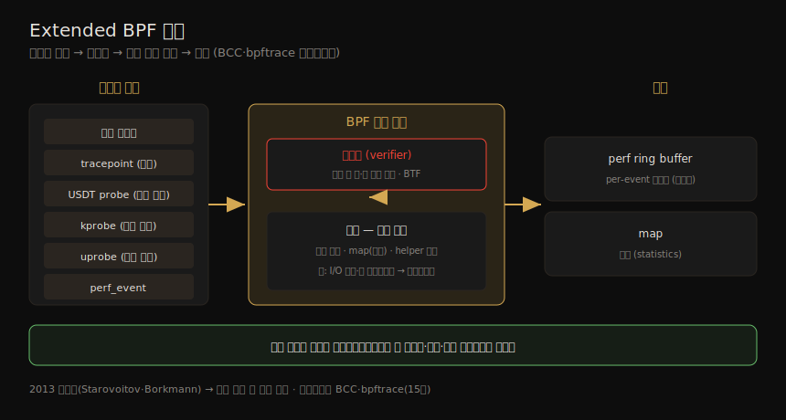

# 운영체제 (3) — 커널 구현·Linux 발전사·BPF
---
> 이 노트는 3장의 마지막 부분으로, 성능 관점에서 본 커널 *구현* 의 역사와 현재를 잡습니다. 성능 기능이 Unix에서 Linux로 어떻게 더해졌는지 — Unix·BSD·Solaris의 성능 발전, Linux의 풍부한 발전사(3.1~5.8), 그리고 성능에 중요한 세 주제(systemd·KPTI/Meltdown·Extended BPF) — 를 봅니다. 마지막으로 PGO 커널·unikernel·microkernel 같은 다른 커널 모델과 커널 비교를 다룹니다.

03-01·03-02 가 *일반적* OS 개념(어느 커널에나 적용)이었다면, 이 노트는 *특정* 커널 — 특히 Linux — 의 구현 specifics입니다. 켄 톰슨의 말이 이 노트의 화두입니다. "UNIX는 처음에 시스템 콜이 스무 개였는데, 직계 후손인 Linux는 오늘날 천 개가 넘는다. 나는 커지는 것들의 복잡성과 크기가 걱정된다." Linux는 강력해지는 만큼 복잡해졌고, 그 복잡성이 곧 성능 기능이자 학습·디버깅 비용입니다.

> 이 노트의 Extended BPF·KPTI는 이 책 전반(특히 15장 BPF)의 토대입니다. 같은 02_os의 [kernel/01-01](../kernel/01-01.커널과%20컨테이너.md)(K8s 운영 관점)·[linux-kernel-programming](../linux-kernel-programming/00-00.책%20개요와%20학습%20로드맵.md)(커널 개발자 관점)과 교차참조합니다.


## 1. 커널 비교와 syscall 수

> 커널 차이는 지원 파일시스템·syscall 인터페이스·네트워크 스택·실시간 지원·스케줄링 알고리즘에 있습니다. man page section 2 항목 수로 본 syscall 수는 거친 비교지만 차이를 보여 줍니다 — UNIX v7은 48개, Linux 5.3은 493개입니다.

커널 차이는 지원 파일시스템(8장)·syscall 인터페이스·네트워크 스택 구조·실시간 지원·CPU/디스크/네트워크 스케줄링 알고리즘에 있습니다. man page section 2(syscalls) 항목 수로 본 비교입니다(문서화된 것만 — 보통 더 많은 syscall이 OS SW의 사적 사용으로 제공됨).

| 커널 | syscall 수 |
|------|-----------|
| UNIX Version 7 | 48 |
| SunOS (Solaris) 5.11 | 142 |
| FreeBSD 12.0 | 222 |
| Linux 2.6.32 | 408~427 |
| Linux 4.15 | 480 |
| Linux 5.3 | 493 |

> 켄 톰슨(ACM Turing Centenary, 2012): "UNIX는 처음에 시스템 콜이 스무 개였는데, 직계 후손인 Linux는 오늘날 천 개가 넘는다. 나는 커지는 것들의 복잡성과 크기가 걱정된다." Linux는 새 syscall·커널 인터페이스로 복잡성을 유저랜드에 노출하며, 그 복잡성이 학습·프로그래밍·디버깅을 더 오래 걸리게 합니다.


## 2. Unix·BSD·Solaris의 성능 발전

> Unix는 작은 커널에도 성능 기능(스케줄러 우선순위·512바이트 블록·buffer cache·스와핑·멀티태스킹)을 가졌습니다. BSD는 paged 가상 메모리·demand paging·FFS·TCP/IP 스택·소켓을, Solaris는 VFS·slab 할당자·DTrace·Zones·ZFS를 더했습니다.

#### Unix

Unix(1969~, Thompson·Ritchie 등 AT&T Bell Labs)는 Multics의 후속으로 가벼운 멀티태스킹 OS·커널로 개발됐습니다. "커널은 유저가 자기 취향대로 바꿀 수 없는 유일한 코드라, 가능한 한 적은 결정을 해야 한다 — 한 가지 일에 한 가지 방법만, 단 그것이 제공될 수 있던 모든 옵션의 최소공약수이게." 작은 커널에도 성능 기능이 있었습니다 — 스케줄러 우선순위(고우선 일의 런큐 지연↓), 효율을 위한 512바이트 블록 디스크 I/O와 장치별 buffer cache, idle 프로세스 스와핑, 그리고 멀티태스킹입니다. 네트워킹·다중 파일시스템·페이징을 지원하려 커널은 커져야 했습니다.

#### BSD

BSD(1978~, UC Berkeley)의 성능 발전입니다 — **paged 가상 메모리**(프로세스 전체 스와핑 대신 LRU 청크를 페이징), **demand paging**(물리 매핑을 처음 쓸 때로 미룸), **FFS**(실린더 그룹으로 단편화↓·회전 디스크 성능↑, UFS의 기반), **TCP/IP 네트워크 스택**(Unix 최초의 고성능, 4.2BSD), **소켓**(연결 엔드포인트 API), **Jails**(경량 OS 레벨 가상화), **Kernel TLS**(TLS 처리를 커널로 — Netflix FreeBSD OCA 성능용). Netflix CDN은 FreeBSD로 "16코어 2.6GHz CPU에서 ~55% CPU로 TLS 암호화 연결 90Gb/s"를 냅니다.

#### Solaris

Solaris(1982~, Sun, SVR4 기반)의 성능 발전입니다 — **VFS**(다중 파일시스템 공존 추상, NFS·UFS용), **fully preemptible 커널**(실시간 저지연), **멀티프로세서 지원**(ASMP·SMP), **slab 할당자**(CPU별 사전할당 버퍼 캐시로 빠른 재사용 — Linux 포함 커널 표준이 됨), **DTrace**(전체 스택의 정적·동적 트레이싱 — Linux의 BPF·bpftrace에 대응), **Zones**(OS 기반 가상화 — Linux 컨테이너의 선조 격), **ZFS**(엔터프라이즈 파일시스템).


## 3. Linux 발전사 — 3.1에서 5.8까지

> Linux(1991~, Torvalds)는 Unix·BSD·Solaris·Plan 9의 아이디어를 종합했습니다. 성능 관련 발전은 방대합니다 — CFS 스케줄러·cgroups·futex·huge pages·RCU·epoll·SLUB·다수의 TCP 혼잡 제어·io_uring, 그리고 Extended BPF가 핵심입니다.

Linux(1991~, Linus Torvalds)는 Intel PC용 자유 OS로 시작해, 여러 선조의 아이디어를 종합했습니다 — Unix(OS 계층·syscall·멀티태스킹·가상메모리·전역 파일시스템·buffer cache), BSD(paged 가상메모리·demand paging·FFS·TCP/IP·소켓), Solaris(VFS·NFS·page cache·slab 할당자), Plan 9(rfork — 프로세스·스레드 간 다양한 공유 수준). 지금은 서버·클라우드·임베디드(휴대폰)에 널리 쓰입니다.

성능 관련 발전사(첫 도입 버전)를 주제별로 추리면 다음과 같습니다.

| 영역 | 발전 |
|------|------|
| 스케줄링 | scheduling domains(2.6.7, NUMA), CFS(2.6.23), CFS bandwidth control(3.2), SCHED_DEADLINE(3.14) |
| 메모리 | huge pages(2.5.36), overcommit·OOM killer, transparent huge pages(2.6.38), NUMA balancing(3.8+), PSI(4.20·5.2) |
| 동기화 | futex(2.5.7), RCU(2.5.43), MCS locks·qspinlocks(3.15), queued spinlocks(4.2) |
| I/O | modular I/O 스케줄링(2.6.10), CFQ, multiqueue block I/O(3.13), BFQ·Kyber(4.12), multi-queue 기본(5.0), io_uring(5.1) |
| 네트워크 | TCP 혼잡 제어(Cubic·DCTCP 3.18·BBR 4.9), TFO(3.6~3.13), XDP(4.8·4.18), MultiPath TCP(5.6) |
| 메모리 할당자 | SLUB(2.6.22) |
| 관측·트레이싱 | OProfile(2.5.43), tracepoints(2.6.28), perf(2.6.31), uprobes(3.5), Extended BPF(3.18+), perf flame graphs(5.8) |
| 자원·가상화 | cgroups(2.6.24)·cgroup v2(4.5·4.15), KVM, Overlayfs(3.18), Intel CAT(4.10) |
| syscall 효율 | epoll(2.5.46)·epoll 확장성(4.5), splice(2.6.17), MSG_ZEROCOPY(4.14) |
| 보안·완화 | PCID(4.14), KPTI(4.14, Meltdown 완화) |

> No BKL(2.6.37, big kernel lock 병목 최종 제거)·DynTicks(2.6.21, tickless)·thermal pressure(5.7) 등 작은 개선도 많습니다. 부팅 시간도 systemd 채택으로 개선됐습니다. 이 풍부함은 곧 *복잡성* 입니다 — 성능 기능·튜너블이 너무 많아 워크로드마다 설정·튜닝이 수고롭고, 튜닝 안 된 채 도는 배포가 많습니다.


## 4. systemd — 서비스 매니저와 부팅 시간

> systemd는 원래 UNIX init을 대체한 서비스 매니저로, 의존성 인식 서비스 시작과 서비스 시간 통계를 제공합니다. 부팅 시간 튜닝에서 systemd 통계가 어디를 손볼지 보여 줍니다.

systemd는 흔히 쓰는 Linux 서비스 매니저로, 원래 UNIX init 시스템을 대체합니다 — 의존성 인식 서비스 시작과 서비스 시간 통계 등을 가집니다. 부팅 시간 튜닝에서 systemd 통계가 유용합니다. `systemd-analyze` 가 전체 부팅 시간을, `critical-chain` 이 지연을 일으키는 *임계 경로*(서비스 연쇄)를 보여 줍니다.

```
# systemd-analyze
Startup finished in 1.657s (kernel) + 10.272s (userspace) = 11.930s
graphical.target reached after 9.663s in userspace

# systemd-analyze critical-chain
graphical.target @9.663s
└─...
  └─systemd-networkd-wait-online.service @3.498s +1.860s   ← 가장 느림
```

> `blame` 은 가장 느린 초기화 시간을, `plot` 은 SVG 다이어그램을 냅니다. 위 예에선 `systemd-networkd-wait-online.service` 가 1.86초로 가장 느린 서비스입니다.


## 5. KPTI(Meltdown) — 보안 완화의 성능 비용

> KPTI 패치(Linux 4.14, 2018)는 Intel Meltdown 취약점 완화입니다. 보안 문제는 막지만 컨텍스트 전환·syscall마다 추가 CPU 사이클·TLB flush로 성능을 깎습니다. PCID 지원이 일부 TLB flush를 피해 비용을 줄입니다.

**KPTI(kernel page table isolation)** 패치(Linux 4.14, 2018)는 Intel 프로세서 취약점 *Meltdown* 의 완화입니다(옛 커널은 KAISER 패치). 보안 문제를 우회하지만, 컨텍스트 전환·syscall마다 추가 CPU 사이클과 TLB flush로 프로세서 성능을 깎습니다. 같은 릴리스에 더해진 **PCID(process-context ID)** 지원이 (프로세서가 pcid를 지원하면) 일부 TLB flush를 피해 비용을 줄입니다.

> 저자는 Netflix 클라우드 프로덕션 워크로드에서 KPTI 영향을 *syscall 비율에 따라 0.1~6%*(비율 높을수록 비쌈)로 평가했습니다. huge pages(flush된 TLB가 더 빨리 데워짐)와 트레이싱 도구로 syscall을 줄이면 비용이 더 낮아집니다 — 이런 트레이싱 도구 다수가 Extended BPF로 구현됩니다.


## 6. Extended BPF — 차세대 커널 실행 환경

> BPF는 1992년 패킷 캡처용으로 나왔으나, 2013년 재작성(Starovoitov·Borkmann)으로 범용 커널 안 실행 엔진이 됐습니다. 명령 집합·저장 객체(map)·helper 함수로 이뤄지고, 검증기가 안전을 보장해 커널을 깨거나 오염시키지 않습니다. 효율적·안전·고급 트레이싱 도구를 떠받쳐 성능 분석에 중요합니다.

**BPF**(원래 Berkeley Packet Filter)는 1992년 패킷 캡처 도구 성능을 높이려 나온 기술입니다. 2013년 Alexei Starovoitov가 대규모 재작성을 제안하고 Daniel Borkmann과 함께 발전시켜 2014년 커널에 들어가, BPF를 네트워킹·관측성·보안에 두루 쓰는 *범용 실행 엔진* 으로 바꿨습니다.

BPF는 명령 집합·저장 객체(map)·helper 함수로 이뤄진 유연·효율적 기술이며, 가상 명령 집합 명세 덕에 가상 머신으로 볼 수 있습니다. 이벤트 소스에서 검증기를 거쳐 출력까지의 흐름을 한 장으로 정리하면 다음과 같습니다.



BPF 프로그램은 커널 모드에서 *이벤트* 에 붙어 실행됩니다 — 소켓 이벤트·tracepoint·USDT probe·kprobe·uprobe·perf_event입니다. BPF 바이트코드는 먼저 *검증기(verifier)* 를 통과해야 합니다 — BPF 프로그램이 커널을 깨거나 오염시키지 않음을 보장합니다. 데이터 타입·구조 이해를 위해 *BTF(BPF Type Format)* 를 쓰기도 하고, 출력은 per-event 데이터엔 perf ring buffer로, 통계엔 map으로 냅니다.

> BPF가 성능 분석에 중요한 까닭은 *효율적·안전·고급* 트레이싱 도구의 새 세대를 떠받치기 때문입니다 — 기존 커널 이벤트 소스(tracepoint·kprobe·uprobe·perf_event)에 프로그래머빌리티를 줍니다. 예로 BPF 프로그램이 I/O 시작·끝에 타임스탬프를 기록해 지속 시간을 재고 커스텀 히스토그램에 담을 수 있습니다. 이 책의 많은 BPF 프로그램은 BCC·bpftrace 프런트엔드를 쓰며, 15장에서 다룹니다.


## 7. 다른 커널 모델과 커널 비교

> PGO 커널은 CPU 프로파일로 컴파일을 개선하고, unikernel은 커널·앱을 한 이미지로 합치며, microkernel은 커널을 최소화하고 기능을 유저 모드로 옮깁니다. 어느 커널이 빠른지는 설정·워크로드에 달렸지만, 저자는 광범위한 성능 작업·커뮤니티 덕에 보통 Linux가 앞선다고 봅니다.

#### 다른 커널 모델

| 모델 | 뜻 |
|------|-----|
| PGO 커널 | profile-guided optimization — 프로덕션 CPU 프로파일로 재컴파일해 특정 워크로드 성능↑(Windows·Google이 5~20% 개선). AutoFDO는 특수 커널 없이 perf 프로파일 사용 |
| unikernel | 커널·라이브러리·앱을 한 머신 이미지로 — 적은 명령 텍스트로 캐시 적중↑·취약점↓. 단 SSH·셸·성능 도구가 없어 디버깅이 과제(MirageOS) |
| microkernel | 커널을 최소화(메모리·스레드·IPC만), 파일시스템·네트워크·드라이버는 유저 모드 — 더 fault-tolerant(드라이버 크래시가 커널을 안 죽임), 단 IPC 단계로 성능↓(QNX·Minix 3) |
| hybrid 커널 | microkernel·monolithic의 장점 결합 — 성능 핵심 서비스는 커널로(직접 호출), 모듈성·내고장성은 유지(Windows NT·Plan 9) |
| 분산 OS | 여러 노드에 단일 OS 인스턴스(각 노드에 microkernel) — Plan 9·Inferno. 널리 쓰이진 않음 |

#### 커널 비교

어느 커널이 빠른지는 OS 설정·워크로드·커널 관여도에 달렸습니다. 저자는 광범위한 성능 개선 작업·앱/드라이버 지원·넓은 사용과 큰 커뮤니티(성능 이슈를 발견·보고) 덕에 보통 **Linux가 앞선다** 고 봅니다 — TOP500 슈퍼컴퓨터는 2017년 100% Linux가 됐습니다. 예외도 있어 Netflix는 클라우드엔 Linux, CDN엔 FreeBSD를 씁니다. 커널 성능은 흔히 마이크로벤치마크로 비교하는데 오류가 쉽습니다 — 한 커널이 특정 syscall에 빠르다 해도 그 syscall이 프로덕션 워크로드에 안 쓰이거나, 마이크로벤치마크가 테스트 안 한 플래그로 쓰일 수 있습니다. 정확한 비교는 선임 엔지니어가 몇 주를 들일 일입니다(12장 active benchmarking). 그리고 풍부한 Linux 발전은 *복잡성* 도 가져와, 비교 시 *각 커널이 튜닝됐는가* 를 따져야 합니다 — 튜닝 안 된 배포가 많습니다.


## 학습 점검

> 이 노트의 핵심을 스스로 떠올려 봅니다. 답이 막히면 해당 섹션으로 돌아가 확인합니다.

- syscall 수가 UNIX v7(48)에서 Linux 5.3(493)으로 늘어난 것이 켄 톰슨의 "복잡성 걱정"과 어떻게 연결되는지 설명해 봅니다. (→ §1)
- BSD가 Unix에 더한 성능 기능 셋(paged 가상메모리·demand paging·FFS·TCP/IP·소켓 중)과, Solaris의 slab 할당자가 왜 커널 표준이 됐는지 말해 봅니다. (→ §2)
- Linux 성능 발전 중 스케줄링(CFS)·트레이싱(BPF)·I/O(io_uring) 각 영역에서 하나씩 떠올려 봅니다. (→ §3)
- KPTI가 왜 성능을 깎고(컨텍스트 전환·syscall TLB flush), PCID·huge pages가 비용을 어떻게 줄이는지 설명해 봅니다. (→ §5)
- Extended BPF의 검증기(verifier)가 왜 필요하고, BPF가 어떤 이벤트 소스에 붙어 어떻게 성능 분석을 돕는지 말해 봅니다. (→ §6)
- monolithic·microkernel·hybrid·unikernel의 차이와, 저자가 보통 Linux가 빠르다고 보는 이유를 떠올려 봅니다. (→ §7)
