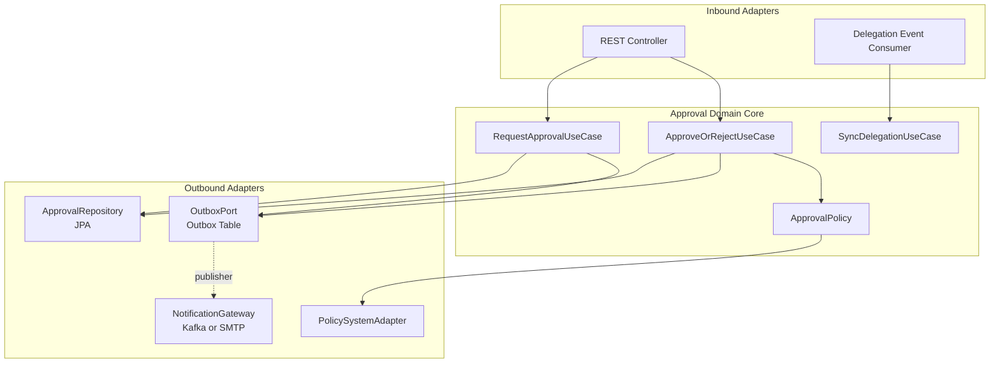

# 헥사고날 변형 — TPS 결재 도메인 적용 사례
---
> 교과서 헥사고날 아키텍처를 실전 결재 도메인에 적용하면 그대로는 작동하지 않는다. 외부 결재선 시스템, 위임/대결 규칙, 비동기 알림 같은 요구가 어댑터 구조를 바꾸도록 강제하기 때문이다.

## 1. 왜 교과서 그대로는 안 되는가

> 결재 도메인은 단일 입력·단일 저장소를 가정한 헥사고날 다이어그램의 전제를 깬다.

전형적인 헥사고날 그림은 도메인 코어가 inbound port를 하나 갖고, outbound port로 DB와 외부 시스템에 접근하는 모습이다. 결재 도메인에서는 다음 세 가지가 동시에 들어온다:

- 신청자가 결재 요청을 올리는 동기 호출
- 결재선의 다음 결재자에게 알림을 보내는 비동기 outbound
- 외부 인사 시스템에서 위임·대결 사실이 변경되는 inbound 이벤트

세 흐름을 같은 inbound port 하나로 받으면 도메인이 "이 호출이 누구의 어떤 의도냐"를 매번 분기해야 한다. 결국 도메인 코드가 어댑터 사정에 오염된다.

## 2. 변형 1 — inbound port를 의도별로 분리

결재 도메인의 inbound port를 한 덩어리로 두지 않고 의도(intent) 단위로 쪼갠다. `RequestApprovalUseCase`, `ApproveOrRejectUseCase`, `SyncDelegationUseCase` 세 개다.

```java
public interface RequestApprovalUseCase {
    ApprovalId request(RequestApproval cmd);
}

public interface ApproveOrRejectUseCase {
    void decide(ApprovalDecision cmd);
}

public interface SyncDelegationUseCase {
    void apply(DelegationEvent event);
}
```

REST 어댑터는 앞의 두 port를 호출하고, Kafka Consumer 어댑터는 세 번째 port를 호출한다. **port가 도메인의 의도를 직접 드러내므로** 어댑터를 추가해도 도메인이 흔들리지 않는다. Vernon이 `Implementing DDD`에서 강조한 "application service는 use case의 표현"과 일치한다.

## 3. 변형 2 — outbound port의 트랜잭션 경계 분리

> 결재 승인은 한 트랜잭션 안에서 끝나지만, 다음 결재자 알림은 별도 트랜잭션에서 발생해야 한다.

교과서는 outbound port를 `ApprovalRepository`, `NotificationGateway` 두 개로 단순화하지만, 실전에서는 두 어댑터가 같은 트랜잭션에 묶이면 안 된다. 알림 시스템이 일시 장애를 일으키면 결재가 같이 롤백돼 사용자가 "버튼만 눌렸지 결재가 안 됐다"는 상태를 보게 된다.

| outbound port | 트랜잭션 정책 | 어댑터 |
|---------------|--------------|--------|
| `ApprovalRepository` | 결재 결정과 같은 TX 안에서 commit | JPA |
| `OutboxPort` | 같은 TX 안에서 저장만 (전송은 별도) | Outbox 테이블 |
| `NotificationGateway` | TX 밖, Outbox publisher가 호출 | Kafka 또는 SMTP |

Outbox를 끼우면 도메인 코어는 "알림이 발사됐다"고 가정하지 않고 "발사가 예약됐다"만 보장한다. 03-09의 Outbox 패턴이 이 자리에서 그대로 들어맞는다.

## 4. 변형 3 — 정책(Policy)을 도메인 안으로 끌어오기

결재선 규칙(승인자가 휴가 중이면 차상위 결재, 금액 임계값 초과 시 추가 결재선)은 외부 정책 시스템이 제공한다. 어댑터에 두면 도메인이 자기 규칙을 모르게 되므로, 정책을 **outbound port + 도메인 인터페이스 이중 표현**으로 다룬다.

```java
public interface ApprovalPolicy {                 // 도메인 인터페이스
    NextApprover nextApprover(Approval approval);
}

@Component
public class PolicySystemApprovalPolicy
        implements ApprovalPolicy {               // outbound adapter
    private final PolicyApiClient client;
    ...
}
```

도메인은 `ApprovalPolicy`에만 의존한다. 어댑터가 외부 시스템을 호출해 결과를 반환하든, in-memory 정책으로 결과를 만들든 도메인은 동일하게 동작한다. 통합 테스트에서 in-memory 구현으로 대체할 수 있어 외부 시스템 의존을 격리할 수 있다.

## 5. 결과 다이어그램

위 세 변형을 모두 적용한 결재 도메인의 어댑터 구조는 다음과 같다.



핵심은 **inbound가 의도별로 갈라지고, outbound는 트랜잭션 경계별로 갈라진다**는 점이다. 도메인 코어는 어댑터 개수가 늘어도 같은 모양을 유지한다.

## 6. 트레이드오프

변형은 공짜가 아니다. inbound port 분리는 use case 클래스 수를 늘리고, outbound 트랜잭션 분리는 Outbox 인프라를 강제한다. 결재 도메인처럼 외부 통합이 많고 트랜잭션 경계가 복잡한 경우에는 보상이 크지만, 단순 CRUD에 가까운 도메인에서는 과한 설계다.

판단 기준은 단순하다. **외부 시스템 어댑터가 둘 이상이고 그중 하나라도 다른 트랜잭션 정책을 요구하면** 변형을 적용한다. 그 외에는 02-03의 교과서 헥사고날로 충분하다.
